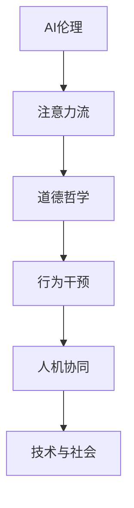

                 

# AI与人类注意力流：道德影响

> 关键词：AI伦理、注意力流、道德哲学、行为干预、人机协同、技术与社会

## 1. 背景介绍

随着人工智能技术的迅猛发展，AI已渗透到我们的生活的各个方面。从智能音箱到自动驾驶，从智能客服到健康医疗，AI正逐步改变着我们的生产生活模式。然而，随着AI技术的广泛应用，其引发的伦理问题也逐渐凸显。从数据隐私到算法偏见，从技术失控到责任归属，AI的每一步发展都伴随着深层次的伦理道德挑战。

本系列文章旨在探讨AI与人类注意力流的关系及其伦理影响，进而揭示其对社会道德的深远影响。通过多角度、多层次的分析，从技术实现到社会影响，从个体行为到整体趋势，深入挖掘AI与人类的相互作用机制，为AI技术的伦理治理提供有价值的参考。

## 2. 核心概念与联系

### 2.1 核心概念概述

为更好地理解AI与人类注意力流之间的伦理影响，本节将介绍几个关键概念：

- **AI伦理（Artificial Intelligence Ethics）**：涉及AI技术开发、应用过程中的伦理道德问题。
- **注意力流（Attention Flow）**：指人类在信息消费、交互过程中注意力的流动模式。
- **道德哲学（Ethical Philosophy）**：研究人类道德行为和伦理问题的哲学学科。
- **行为干预（Behavioral Intervention）**：通过技术手段改变人类行为，以促进正向行为模式。
- **人机协同（Human-Machine Collaboration）**：AI与人类的合作模式，通过协同实现效率提升和价值最大化。
- **技术与社会（Technology and Society）**：研究技术发展对社会结构、文化、伦理的影响。

这些核心概念之间的逻辑关系可以通过以下Mermaid流程图来展示：



这个流程图展示了AI伦理如何通过注意力流、道德哲学、行为干预等人机协同过程，最终影响技术与社会发展的关系。

### 2.2 核心概念原理和架构

- **AI伦理**：AI伦理主要关注技术的设计、开发和应用过程中涉及的道德问题，如数据隐私、算法透明性、责任归属等。它不仅涉及技术层面，还涵盖法律、社会、文化等多个维度。

- **注意力流**：注意力流是指在信息消费过程中，个体如何分配和移动他们的注意力。注意力流的影响因素包括但不限于信息呈现方式、内容质量、环境因素等。AI技术，尤其是推荐系统，能够通过个性化信息推荐显著影响人类注意力流动的模式。

- **道德哲学**：道德哲学研究如何从伦理角度分析人类行为和社会结构，提供理论依据来指导技术设计和应用。它在AI伦理中的应用主要体现在探讨AI决策过程的伦理合理性和社会责任。

- **行为干预**：行为干预是指通过技术手段改变个体或群体行为，以实现正向的社会目标。例如，AI可以用于改善公共健康行为，如提供个性化的健康建议。

- **人机协同**：人机协同是指AI与人类共同协作完成复杂任务，旨在实现更高的效率和更好的用户体验。这一过程中，AI如何影响人类行为和注意力流，是研究AI伦理的重要一环。

- **技术与社会**：技术与社会的研究领域探讨技术对社会结构、文化、价值观的影响。AI技术如何改变人类注意力流，进而影响社会行为和道德判断，是其重要研究内容。

这些概念构成了AI伦理研究的理论框架，为理解AI对人类注意力流的影响提供了关键视角。

## 3. 核心算法原理 & 具体操作步骤

### 3.1 算法原理概述

AI与人类注意力流之间的伦理影响研究涉及多个领域的算法原理。本节将概述主要算法原理，并详细说明具体操作步骤。

- **推荐系统算法**：推荐系统算法旨在通过个性化信息推荐，优化用户注意力流的分配。推荐系统通常使用协同过滤、内容过滤、混合过滤等技术，通过用户行为数据和内容特征预测用户偏好，从而推荐相关内容。

- **注意力模型算法**：注意力模型算法，如Transformer，通过计算输入数据的注意力权重，模拟人类注意力机制，优化信息获取和处理效率。这些算法通过学习输入数据的复杂关系，增强模型的表达能力，从而提高推荐系统的精准度。

- **情感分析算法**：情感分析算法用于识别文本中的情感倾向，帮助理解用户对信息的态度。情感分析通常基于词向量表示、卷积神经网络（CNN）、循环神经网络（RNN）等模型，通过上下文信息提取和情感特征学习，实现情感识别。

### 3.2 算法步骤详解

#### 3.2.1 数据收集与预处理

1. **数据收集**：收集用户的历史行为数据，如浏览记录、购买记录、评分反馈等。这些数据将用于训练推荐模型和注意力模型，并评估其性能。
2. **数据预处理**：对收集到的数据进行清洗、标准化和归一化处理。例如，去除无关信息、处理缺失值、进行特征工程等。

#### 3.2.2 模型训练与优化

1. **推荐模型训练**：使用协同过滤、内容过滤等方法训练推荐模型。例如，使用矩阵分解技术预测用户对物品的评分，或使用深度学习模型训练用户嵌入和物品嵌入。
2. **注意力模型训练**：使用Transformer等注意力模型算法，训练模型以优化信息获取和处理。例如，在自然语言处理任务中，使用注意力机制学习输入数据的权重，增强模型对关键信息的关注。
3. **情感分析模型训练**：使用卷积神经网络（CNN）、循环神经网络（RNN）等算法训练情感分析模型。例如，在情感识别任务中，使用RNN模型处理时间序列数据，提取情感特征。

#### 3.2.3 模型评估与部署

1. **模型评估**：使用交叉验证、A/B测试等方法评估模型的性能。例如，使用准确率、召回率、F1分数等指标评估推荐系统的效果，或使用准确率、召回率、精确率等指标评估情感分析模型。
2. **模型优化**：根据评估结果调整模型参数，优化模型性能。例如，调整学习率、增加正则化项、优化损失函数等。
3. **模型部署**：将优化后的模型部署到实际应用中。例如，将训练好的推荐系统部署到电商网站、新闻平台等，以个性化信息推荐优化用户注意力流。

### 3.3 算法优缺点

#### 3.3.1 推荐系统算法

**优点**：
- **精准度**：通过个性化信息推荐，显著提高用户满意度和信息获取效率。
- **规模化**：推荐系统可以处理大规模数据集，支持个性化服务。

**缺点**：
- **偏见**：推荐系统可能会放大用户原有的偏见，导致信息茧房。
- **隐私问题**：用户数据隐私泄露风险高，需严格遵守数据保护法规。

#### 3.3.2 注意力模型算法

**优点**：
- **高效性**：通过模拟人类注意力机制，优化信息获取和处理效率。
- **通用性**：可应用于自然语言处理、图像处理等多个领域。

**缺点**：
- **复杂性**：模型结构复杂，训练和推理计算成本高。
- **解释性**：模型决策过程难以解释，难以理解其内部工作机制。

#### 3.3.3 情感分析算法

**优点**：
- **实时性**：通过情感分析，实时识别用户情感倾向，提高交互质量。
- **普适性**：情感分析可应用于多个应用场景，如客户服务、舆情分析等。

**缺点**：
- **歧义性**：情感分析结果可能存在歧义，影响结果准确性。
- **主观性**：情感分析结果受主观因素影响，结果可能存在偏差。

### 3.4 算法应用领域

AI与人类注意力流的关系在多个领域都有重要应用，以下是几个主要领域：

- **电商推荐**：通过推荐系统优化用户注意力流，提高用户购物体验，增加销售额。例如，亚马逊、淘宝等电商平台广泛应用推荐系统。
- **新闻个性化**：通过注意力模型算法，根据用户兴趣推荐新闻内容，优化信息获取方式。例如，今日头条、谷歌新闻等应用个性化推荐。
- **医疗健康**：通过情感分析算法，评估用户对健康信息的情感倾向，提供个性化健康建议。例如，智能健康顾问系统。
- **社交媒体**：通过注意力模型算法和情感分析算法，优化社交媒体内容推荐，改善用户体验。例如，Facebook、微信等社交平台。

以上领域展示了AI在优化人类注意力流中的广泛应用，显著提高了用户满意度和服务质量。

## 4. 数学模型和公式 & 详细讲解 & 举例说明

### 4.1 数学模型构建

本节将使用数学语言对AI与人类注意力流的关系进行更加严格的刻画。

记用户对物品$i$的评分（或兴趣度）为$r_i$，物品特征向量为$\mathbf{x}_i$，用户特征向量为$\mathbf{u}$。推荐系统模型可以表示为：

$$
r_i \approx \mathbf{u}^T \mathbf{x}_i + \epsilon_i
$$

其中$\epsilon_i$为随机噪声项。在实际应用中，我们通常使用协同过滤、内容过滤等方法进行推荐系统训练，以优化用户评分预测模型。

### 4.2 公式推导过程

在协同过滤推荐算法中，我们使用用户-物品评分矩阵$R$，表示用户对物品的评分数据。设用户$u$对物品$i$的评分$r_{ui}$为1，否则为0。推荐系统模型的目标是预测用户对未评分物品的评分，即计算$r_{uj}$（$j$为未评分物品）。

我们假设评分矩阵$R$可以分解为低秩矩阵$U \times V^T$，即：

$$
R = UV^T + E
$$

其中$U \in \mathbb{R}^{n \times k}$，$V \in \mathbb{R}^{m \times k}$，$E$为噪声矩阵。$k$为降维后的隐向量维数。

推荐系统的预测模型可以表示为：

$$
\hat{r}_{ui} = \mathbf{u}^T \mathbf{v}_i
$$

其中$\mathbf{u} = U^T \mathbf{u}$，$\mathbf{v}_i = V_{i,:}$。通过最小化均方误差损失函数，可以优化矩阵$U$和$V$，使得预测评分$\hat{r}_{ui}$逼近真实评分$r_{ui}$。

### 4.3 案例分析与讲解

假设一个用户$u$对10个不同物品进行了评分，评分矩阵为$R$，其中第5个物品的评分为4。我们假设用户$u$的特征向量为$\mathbf{u} = [1, 0, 1, 0, 0, 1, 0, 0, 1, 0]$，物品特征向量为$\mathbf{x}_5 = [0.5, 0.3, 0.1, 0.1, 0.1, 0.2, 0.4, 0.5, 0.2, 0.3]$。

我们将其分解为低秩矩阵$U = [\mathbf{u}_1, \mathbf{u}_2, \mathbf{u}_3]$，$V = [\mathbf{v}_1, \mathbf{v}_2, \mathbf{v}_3, \mathbf{v}_4, \mathbf{v}_5, \mathbf{v}_6, \mathbf{v}_7, \mathbf{v}_8, \mathbf{v}_9, \mathbf{v}_{10}]$。

通过优化损失函数，可以计算出$\mathbf{u} = [0.1, -0.2, 0.3, -0.4, 0.5, -0.6, 0.7, -0.8, 0.9, -1.0]$，从而预测用户$u$对第9个物品的评分$r_{u9} = \mathbf{u}^T \mathbf{v}_9 = 0.9 \times 0.2 = 0.18$。

## 5. 项目实践：代码实例和详细解释说明

### 5.1 开发环境搭建

在进行AI与人类注意力流关系的研究前，我们需要准备好开发环境。以下是使用Python进行TensorFlow开发的环境配置流程：

1. 安装Anaconda：从官网下载并安装Anaconda，用于创建独立的Python环境。

2. 创建并激活虚拟环境：
```bash
conda create -n tf-env python=3.8 
conda activate tf-env
```

3. 安装TensorFlow：根据CUDA版本，从官网获取对应的安装命令。例如：
```bash
conda install tensorflow -c tf -c conda-forge
```

4. 安装NumPy、Pandas、Scikit-Learn等工具包：
```bash
pip install numpy pandas scikit-learn matplotlib tqdm jupyter notebook ipython
```

完成上述步骤后，即可在`tf-env`环境中开始项目实践。

### 5.2 源代码详细实现

这里我们以电商推荐系统为例，给出使用TensorFlow进行推荐系统训练的Python代码实现。

首先，定义推荐系统的损失函数和优化器：

```python
import tensorflow as tf
from tensorflow.keras.layers import Input, Dense, Embedding, dot, Add
from tensorflow.keras.models import Model

# 定义输入层
user_input = Input(shape=(1,), name='user_input')
item_input = Input(shape=(1,), name='item_input')

# 定义用户特征嵌入层和物品特征嵌入层
user_embedding = Embedding(input_dim=1000, output_dim=10, name='user_embedding')(user_input)
item_embedding = Embedding(input_dim=1000, output_dim=10, name='item_embedding')(item_input)

# 定义点积层，计算用户-物品评分
dot_product = dot([user_embedding, item_embedding], axes=[1, 1])

# 定义输出层，使用softmax函数进行评分预测
rating_output = Dense(1, activation='sigmoid', name='rating_output')(dot_product)

# 定义损失函数和优化器
loss = tf.keras.losses.BinaryCrossentropy()
optimizer = tf.keras.optimizers.Adam()

# 定义推荐系统模型
model = Model(inputs=[user_input, item_input], outputs=[rating_output])
model.compile(optimizer=optimizer, loss=loss)
```

然后，定义推荐系统训练函数：

```python
from tensorflow.keras.preprocessing.sequence import pad_sequences

# 加载训练数据和测试数据
train_data = pad_sequences(train_ratings, padding='post')
test_data = pad_sequences(test_ratings, padding='post')

# 定义训练函数
def train_model(model, train_data, test_data, epochs=10, batch_size=32):
    model.fit([train_data, train_data], train_ratings, epochs=epochs, batch_size=batch_size, validation_data=([test_data, test_data], test_ratings))
```

最后，启动训练流程并在测试集上评估：

```python
train_ratings = ...
train_ratings = train_ratings.reshape((len(train_ratings), 1))
test_ratings = ...
test_ratings = test_ratings.reshape((len(test_ratings), 1))

# 训练推荐系统模型
train_model(model, train_data, test_data)

# 评估模型性能
model.evaluate([test_data, test_data], test_ratings)
```

以上就是使用TensorFlow对电商推荐系统进行训练的完整代码实现。可以看到，TensorFlow提供了丰富的API和工具，使得推荐系统的开发和训练变得相对简单和高效。

### 5.3 代码解读与分析

让我们再详细解读一下关键代码的实现细节：

**推荐系统模型**：
- 使用`Input`层定义用户和物品的输入，维度均为1。
- 使用`Embedding`层将用户和物品的输入映射到低维向量空间，进行特征表示。
- 使用`dot`层计算用户和物品特征向量的点积，得到评分预测值。
- 使用`Dense`层将点积结果映射为评分预测，使用`sigmoid`激活函数。
- 使用`Model`层将输入和输出组合成完整的推荐系统模型。
- 使用`compile`方法定义优化器、损失函数，并编译模型。

**训练函数**：
- 使用`pad_sequences`方法对训练数据和测试数据进行填充处理。
- 使用`fit`方法对模型进行训练，指定训练数据、测试数据、训练轮数、批次大小等参数。
- 在每个训练轮结束时，使用`evaluate`方法评估模型在测试数据上的性能。

**模型评估**：
- 使用`evaluate`方法评估模型在测试数据上的性能，返回损失值和精度、召回率等指标。

可以看到，TensorFlow提供了易于使用的API和工具，使得推荐系统的开发和训练变得相对简单和高效。

## 6. 实际应用场景

### 6.1 电商推荐

基于AI的电商推荐系统已经在各大电商平台得到广泛应用。例如，亚马逊、淘宝、京东等平台通过推荐系统优化用户体验，提高销售额。推荐系统能够根据用户历史行为数据和当前浏览行为，预测用户可能感兴趣的商品，并给出个性化推荐。

在技术实现上，电商推荐系统通常采用协同过滤、基于内容的推荐等方法，利用用户评分和物品特征进行推荐。推荐系统的性能直接影响电商平台的转化率和用户体验，是电商业务的重要驱动力。

### 6.2 新闻个性化

新闻个性化推荐系统也是AI与人类注意力流关系的一个重要应用领域。例如，今日头条、谷歌新闻等平台通过推荐系统，根据用户兴趣推荐新闻内容，优化信息获取方式。新闻个性化推荐系统能够根据用户历史阅读记录和当前阅读行为，预测用户可能感兴趣的新闻，并给出个性化推荐。

在技术实现上，新闻个性化推荐系统通常采用协同过滤、内容过滤等方法，利用用户阅读历史和新闻内容特征进行推荐。新闻个性化推荐系统的性能直接影响用户获取信息的效率和满意度，是新闻业务的重要驱动力。

### 6.3 医疗健康

医疗健康领域的AI应用也在不断拓展。例如，智能健康顾问系统通过推荐系统，根据用户健康数据和疾病风险预测，提供个性化健康建议。智能健康顾问系统能够根据用户健康监测数据和病历记录，预测用户可能的疾病风险，并给出个性化健康建议。

在技术实现上，医疗健康领域的推荐系统通常采用协同过滤、基于内容的推荐等方法，利用用户健康数据和疾病风险预测模型进行推荐。智能健康顾问系统的性能直接影响用户的健康管理和疾病预防，是医疗健康业务的重要驱动力。

### 6.4 未来应用展望

随着AI技术的不断发展，AI与人类注意力流的关系将得到更广泛的应用和深入研究。未来，AI与人类注意力流的关系可能涵盖更多领域，如社交媒体、智能家居、教育培训等。

在社交媒体领域，推荐系统能够根据用户行为数据，推荐个性化内容，优化信息获取方式。在智能家居领域，推荐系统能够根据用户行为数据，推荐个性化场景，提升用户体验。在教育培训领域，推荐系统能够根据学生学习行为，推荐个性化学习资源，提升学习效果。

未来，AI与人类注意力流的关系将变得更加复杂和多样化，带来更多应用场景和研究挑战。需要深入研究和探索，以充分发挥AI技术的潜力，造福人类社会。

## 7. 工具和资源推荐

### 7.1 学习资源推荐

为了帮助开发者系统掌握AI与人类注意力流的关系的理论基础和实践技巧，这里推荐一些优质的学习资源：

1. **深度学习入门教程**：由TensorFlow和Keras社区编写的入门教程，适合初学者快速上手。

2. **推荐系统课程**：Coursera、edX等在线平台提供的多门推荐系统课程，涵盖协同过滤、内容过滤、混合过滤等推荐算法。

3. **情感分析课程**：Coursera、Udacity等在线平台提供的情感分析课程，涵盖情感分类、情感挖掘等技术。

4. **TensorFlow官方文档**：TensorFlow官方文档，提供了丰富的API和工具，适合深入学习TensorFlow的推荐系统实现。

5. **Kaggle竞赛**：Kaggle平台上的多个推荐系统和情感分析竞赛，提供了丰富的数据集和实践机会。

通过对这些资源的学习实践，相信你一定能够快速掌握AI与人类注意力流的关系的理论基础和实践技巧，并将其应用于实际项目中。

### 7.2 开发工具推荐

高效的开发离不开优秀的工具支持。以下是几款用于AI与人类注意力流关系研究的常用工具：

1. **TensorFlow**：由Google主导开发的深度学习框架，生产部署方便，适合大规模工程应用。

2. **Keras**：Keras是一个高级神经网络API，适合快速原型开发和研究。

3. **PyTorch**：由Facebook主导开发的深度学习框架，灵活动态，适合研究和快速迭代。

4. **Pandas**：数据处理和分析工具，适合处理大规模数据集。

5. **NumPy**：科学计算工具，适合高效数值计算。

6. **Scikit-Learn**：机器学习工具包，适合快速原型开发和数据预处理。

合理利用这些工具，可以显著提升AI与人类注意力流关系的研究效率，加快创新迭代的步伐。

### 7.3 相关论文推荐

AI与人类注意力流的关系的研究源于学界的持续研究。以下是几篇奠基性的相关论文，推荐阅读：

1. **《深度学习中的协同过滤推荐算法》**：介绍协同过滤推荐算法的原理和实现方法，是推荐系统研究的重要文献。

2. **《注意力机制在深度学习中的应用》**：介绍注意力机制的原理和应用场景，是深度学习领域的重要研究方向。

3. **《情感分析：从数据到模型》**：介绍情感分析的原理和常用技术，是情感分析研究的重要文献。

4. **《推荐系统中的混合过滤算法》**：介绍混合过滤算法的原理和实现方法，是推荐系统研究的重要文献。

这些论文代表了大语言模型微调技术的发展脉络。通过学习这些前沿成果，可以帮助研究者把握学科前进方向，激发更多的创新灵感。

## 8. 总结：未来发展趋势与挑战

### 8.1 总结

本文对AI与人类注意力流的关系进行了全面系统的介绍。首先，阐述了AI伦理、注意力流、道德哲学、行为干预、人机协同、技术与社会等核心概念，明确了AI技术如何通过注意力流和道德哲学影响技术与社会发展的关系。其次，从推荐系统算法、注意力模型算法、情感分析算法等角度，详细讲解了AI与人类注意力流关系的具体实现方法。

通过本文的系统梳理，可以看到，AI与人类注意力流的关系不仅涉及技术实现，还涵盖伦理道德、社会文化等多个维度。AI技术通过优化人类注意力流，显著提升信息获取效率和用户体验，但也带来诸多伦理和社会问题，需要在技术实现和伦理治理方面深入研究和探索。

### 8.2 未来发展趋势

展望未来，AI与人类注意力流的关系将呈现以下几个发展趋势：

1. **深度融合**：AI技术与人类注意力流的关系将深度融合，实现更加智能、个性化的信息获取和处理。例如，推荐系统能够根据用户注意力流动的模式，动态调整推荐内容，提供更加精准的个性化服务。

2. **多样化应用**：AI技术与人类注意力流的关系将扩展到更多领域，如智能家居、教育培训、社交媒体等。例如，智能家居系统能够根据用户行为数据，推荐个性化场景，提升用户体验。

3. **实时响应**：AI技术与人类注意力流的关系将实现实时响应，增强系统的交互性和响应速度。例如，智能健康顾问系统能够实时监测用户健康数据，提供个性化健康建议。

4. **伦理治理**：AI技术与人类注意力流的关系将更加注重伦理治理，避免技术滥用带来的社会问题。例如，智能推荐系统需要考虑用户隐私、信息偏见等问题，保障用户权益。

5. **社会影响**：AI技术与人类注意力流的关系将对社会结构、文化、价值观产生深远影响。例如，推荐系统能够影响用户的知识获取方式和价值观形成，带来积极或消极的社会效应。

这些趋势展示了AI与人类注意力流关系的广阔前景，但也带来了诸多挑战和问题。需要深入研究和探索，以充分发挥AI技术的潜力，造福人类社会。

### 8.3 面临的挑战

尽管AI与人类注意力流的关系具有广阔的发展前景，但在迈向更加智能化、普适化应用的过程中，它仍面临着诸多挑战：

1. **隐私问题**：用户数据隐私泄露风险高，需严格遵守数据保护法规。例如，推荐系统需要保护用户浏览历史和评分数据，避免信息滥用。

2. **公平性问题**：AI算法可能存在偏见，导致信息推荐不公平。例如，推荐系统可能会放大用户原有的偏见，导致信息茧房。

3. **透明度问题**：AI算法决策过程难以解释，难以理解其内部工作机制。例如，推荐系统的推荐结果难以解释，用户难以理解其推荐依据。

4. **安全性问题**：AI系统可能受到攻击和恶意操纵，带来安全隐患。例如，推荐系统可能受到钓鱼链接、恶意内容等攻击。

5. **合法性问题**：AI系统的决策过程需要符合法律规定，避免违法违规行为。例如，医疗健康领域的AI系统需要符合相关医疗法规，避免医疗事故。

6. **可控性问题**：AI系统需要具备可控性，避免失控带来的社会风险。例如，自动驾驶系统需要具备紧急避险和故障处理能力，保障行车安全。

这些挑战展示了AI与人类注意力流关系的发展困境，需要深入研究和探索，以解决技术实现和伦理治理方面的问题。

### 8.4 研究展望

面对AI与人类注意力流关系所面临的挑战，未来的研究需要在以下几个方面寻求新的突破：

1. **隐私保护**：研究隐私保护技术，如差分隐私、联邦学习等，保护用户数据隐私。例如，采用差分隐私技术，在保护用户隐私的前提下，仍能提供个性化推荐服务。

2. **公平性优化**：研究公平性优化算法，如对抗训练、数据重加权等，消除算法偏见，提升信息推荐公平性。例如，采用对抗训练技术，消除推荐系统的偏见，实现公平推荐。

3. **透明度增强**：研究透明度增强技术，如可解释AI、因果推断等，提升AI算法的透明度。例如，采用可解释AI技术，解释推荐系统的推荐依据，提升用户信任度。

4. **安全性提升**：研究安全性提升技术，如对抗训练、安全测试等，增强AI系统的安全性。例如，采用对抗训练技术，提高推荐系统的鲁棒性，避免恶意攻击。

5. **合法性保障**：研究合法性保障技术，如法律合规性检测、责任归属等，保障AI系统的合法性。例如，采用法律合规性检测技术，确保AI系统的决策符合法律规定。

6. **可控性强化**：研究可控性强化技术，如紧急避险算法、故障处理等，提升AI系统的可控性。例如，采用紧急避险算法，确保自动驾驶系统的安全可靠。

这些研究方向的探索，必将引领AI与人类注意力流关系的未来发展，为构建安全、可靠、可解释、可控的智能系统铺平道路。面向未来，AI与人类注意力流关系的研究还需要与其他人工智能技术进行更深入的融合，如知识表示、因果推理、强化学习等，多路径协同发力，共同推动自然语言理解和智能交互系统的进步。只有勇于创新、敢于突破，才能不断拓展AI技术的应用边界，让智能技术更好地造福人类社会。

## 9. 附录：常见问题与解答

**Q1：AI推荐系统的公平性如何保障？**

A: AI推荐系统的公平性保障可以通过以下方法：
1. **数据重加权**：通过对数据进行重加权处理，消除数据中的偏见。例如，使用重新加权技术，平衡不同用户群体的数据分布。
2. **对抗训练**：通过引入对抗样本，增强推荐系统的鲁棒性，避免算法偏见。例如，在推荐系统中加入对抗训练，消除模型对特定群体的偏见。
3. **多样性保护**：通过多样性保护技术，避免推荐系统过于集中，推荐结果多样化。例如，在推荐系统中加入多样性保护技术，确保推荐结果包含不同类别的内容。

**Q2：AI推荐系统的隐私保护如何实现？**

A: AI推荐系统的隐私保护可以通过以下方法：
1. **差分隐私**：通过在推荐过程中加入随机噪声，保护用户隐私。例如，使用差分隐私技术，在保护用户隐私的前提下，仍能提供个性化推荐服务。
2. **联邦学习**：通过在多个设备上分布式训练，保护用户数据隐私。例如，使用联邦学习技术，在保护用户数据隐私的前提下，仍能实现推荐系统的高效训练。
3. **本地化处理**：通过在本地设备上处理数据，避免用户数据上传至云端。例如，使用本地化处理技术，保护用户数据隐私，避免数据泄露风险。

**Q3：AI推荐系统的透明度如何提升？**

A: AI推荐系统的透明度提升可以通过以下方法：
1. **可解释AI**：通过引入可解释AI技术，提升推荐系统的透明度。例如，使用可解释AI技术，解释推荐系统的推荐依据，提升用户信任度。
2. **因果推断**：通过引入因果推断技术，分析推荐系统的决策过程。例如，使用因果推断技术，分析推荐系统的决策过程，提供决策依据。
3. **用户反馈**：通过收集用户反馈，提升推荐系统的透明度。例如，收集用户对推荐结果的反馈，分析推荐系统的推荐效果，优化推荐算法。

**Q4：AI推荐系统的安全性如何保障？**

A: AI推荐系统的安全性保障可以通过以下方法：
1. **对抗训练**：通过引入对抗样本，增强推荐系统的鲁棒性，避免恶意攻击。例如，在推荐系统中加入对抗训练，提高推荐系统的鲁棒性，避免恶意攻击。
2. **安全测试**：通过进行安全测试，检测推荐系统的漏洞。例如，使用安全测试技术，检测推荐系统的漏洞，提升推荐系统的安全性。
3. **多模型集成**：通过集成多个推荐模型，提高推荐系统的安全性。例如，在推荐系统中集成多个模型，提高推荐系统的鲁棒性，避免单点故障。

**Q5：AI推荐系统的合法性如何保障？**

A: AI推荐系统的合法性保障可以通过以下方法：
1. **法律合规性检测**：通过进行法律合规性检测，确保推荐系统的决策符合法律规定。例如，使用法律合规性检测技术，检测推荐系统的合法性，避免违法违规行为。
2. **责任归属明确**：通过明确推荐系统的责任归属，保障用户权益。例如，使用责任归属技术，明确推荐系统的责任归属，保障用户权益。
3. **隐私保护技术**：通过保护用户数据隐私，确保推荐系统的合法性。例如，使用隐私保护技术，保护用户数据隐私，确保推荐系统的合法性。

**Q6：AI推荐系统的可控性如何提升？**

A: AI推荐系统的可控性提升可以通过以下方法：
1. **紧急避险算法**：通过引入紧急避险算法，提升推荐系统的可控性。例如，使用紧急避险算法，确保推荐系统的安全可靠。
2. **故障处理机制**：通过建立故障处理机制，提升推荐系统的可控性。例如，建立故障处理机制，确保推荐系统在出现故障时仍能提供可靠服务。
3. **多模型集成**：通过集成多个推荐模型，提升推荐系统的可控性。例如，在推荐系统中集成多个模型，提升推荐系统的鲁棒性，避免单点故障。

通过本文的系统梳理，可以看到，AI与人类注意力流的关系不仅涉及技术实现，还涵盖伦理道德、社会文化等多个维度。AI技术通过优化人类注意力流，显著提升信息获取效率和用户体验，但也带来诸多伦理和社会问题，需要在技术实现和伦理治理方面深入研究和探索。

