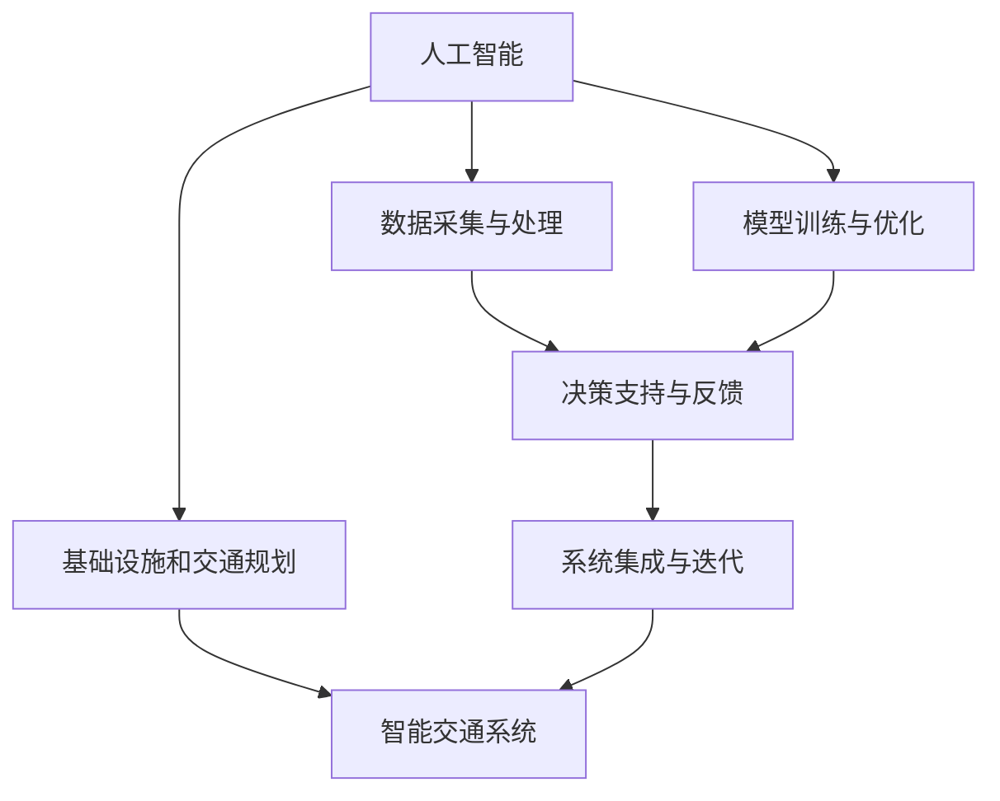

                 

## 1. 背景介绍

随着全球人口的快速增长和城市化进程的不断加快，城市基础设施和交通规划面临着前所未有的挑战。传统的基础设施和交通管理方式往往难以应对复杂多变的城市运行情况，而且往往缺乏可持续性和智能化水平。与此同时，人工智能（AI）技术的迅猛发展为城市基础设施和交通规划带来了新的可能，通过引入AI技术和人类计算结合的方式，可以打造更为可持续、高效、智能的城市环境。

### 1.1 问题由来

城市基础设施和交通规划是城市发展的基石。传统上，城市基础设施的设计和维护主要依赖于人工设计和经验积累。随着城市化进程的加快，城市人口密度不断增加，交通拥堵、环境污染、资源利用效率低等城市问题愈加凸显。为应对这些挑战，城市管理者在传统方法的基础上，引入AI技术和人类计算结合的方式，以实现更加智能、可持续的城市基础设施和交通规划。

### 1.2 问题核心关键点

AI与人类计算结合的核心在于利用AI的高效计算能力和强泛化能力，结合人类专业知识和经验，构建智能化的基础设施和交通管理系统。关键点包括：
- **数据采集和处理**：收集和处理城市基础设施和交通运行的实时数据。
- **模型训练与优化**：基于历史数据和人类知识，训练AI模型，并结合实际应用场景进行优化。
- **决策支持与反馈**：将AI模型的预测结果和建议反馈给城市管理者，辅助决策。
- **系统集成与迭代**：将AI模型和系统集成到城市基础设施和交通管理的实际应用中，并不断迭代优化。

## 2. 核心概念与联系

### 2.1 核心概念概述

为更好地理解AI与人类计算结合在城市基础设施和交通规划中的应用，本节将介绍几个密切相关的核心概念：

- **人工智能（AI）**：利用算法和模型，通过数据学习，实现智能决策和自动化的技术。
- **人类计算（Human Computation）**：利用人的认知和计算能力，对问题进行分析和处理。
- **基础设施和交通规划**：包括城市道路、桥梁、公交系统、轨道交通等基础设施，以及交通流量控制、路线规划等交通管理。
- **智能交通系统（ITS）**：结合AI和人类计算，实现交通流量的实时监测、预测和优化。
- **可持续性**：在设计和规划中考虑环境、资源和社会经济的影响，实现长期的生态和经济发展。

这些概念之间的逻辑关系可以通过以下Mermaid流程图来展示：



这个流程图展示了一系列核心概念及其之间的关系：

1. 基础设施和交通规划需要利用AI和人类计算技术，实现数据采集、模型训练和智能决策。
2. 智能交通系统将AI和人类计算技术集成到交通管理中，实现实时监测和优化。
3. 整个系统需要持续迭代和优化，以适应不断变化的城市运行情况。

## 3. 核心算法原理 & 具体操作步骤

### 3.1 算法原理概述

AI与人类计算结合的核心算法原理主要基于数据驱动的模型训练和优化，结合领域知识进行决策。其核心思想是：

1. **数据驱动**：利用城市基础设施和交通运行的实时数据，训练AI模型，通过数据驱动的方式优化基础设施和交通管理。
2. **知识结合**：结合领域专家的知识和经验，对AI模型进行调试和优化，确保模型的泛化能力和适应性。
3. **实时反馈**：将AI模型的预测结果和建议反馈给城市管理者，辅助其进行决策，实现智能管理。
4. **持续迭代**：在实际应用中，不断收集反馈，对模型和系统进行迭代优化，确保系统的稳定性和高效性。

### 3.2 算法步骤详解

基于AI与人类计算结合的算法原理，城市基础设施和交通规划的实施一般包括以下几个关键步骤：

**Step 1: 数据采集与处理**

- **数据来源**：城市基础设施和交通运行的数据可以从多种来源获取，包括传感器、监控摄像头、城市运行日志等。
- **数据清洗**：对采集到的数据进行清洗和预处理，包括去噪、填充缺失值、归一化等。
- **特征提取**：从原始数据中提取关键特征，如交通流量、速度、时间等。

**Step 2: 模型训练与优化**

- **选择合适的模型**：根据实际应用场景，选择合适的AI模型，如深度学习、机器学习、强化学习等。
- **数据划分**：将数据划分为训练集、验证集和测试集。
- **模型训练**：在训练集上训练AI模型，通过交叉验证等方法不断优化模型参数。
- **领域知识结合**：结合领域专家的知识和经验，对模型进行调整和优化。

**Step 3: 决策支持与反馈**

- **模型预测**：利用训练好的模型对实时数据进行预测，如交通流量、拥堵情况等。
- **决策建议**：根据模型的预测结果，生成决策建议，如交通信号灯控制、路线规划等。
- **反馈机制**：将模型的预测结果和建议反馈给城市管理者，辅助其进行决策。

**Step 4: 系统集成与迭代**

- **系统集成**：将AI模型和系统集成到城市基础设施和交通管理的实际应用中。
- **持续优化**：根据反馈，不断对模型和系统进行迭代优化，提高系统的稳定性和高效性。

### 3.3 算法优缺点

AI与人类计算结合的方法具有以下优点：
1. **高效性**：通过AI模型，可以实现高效的实时数据处理和分析。
2. **泛化能力**：结合领域知识，AI模型可以更好地泛化到新的数据和场景中。
3. **决策支持**：提供智能化的决策支持，辅助城市管理者进行科学决策。
4. **可持续性**：通过持续优化和迭代，系统可以适应不断变化的城市运行情况，实现长期的可持续性。

同时，该方法也存在一定的局限性：
1. **数据依赖**：模型的性能很大程度上取决于数据的质量和数量，数据的获取和处理需要较高成本。
2. **领域知识复杂性**：结合领域知识需要对专家进行培训和沟通，增加实施难度。
3. **算法复杂性**：需要选择合适的模型和优化算法，设计复杂的系统架构，技术门槛较高。
4. **可解释性不足**：AI模型的决策过程往往缺乏可解释性，难以调试和验证。
5. **伦理问题**：模型需要考虑到伦理和社会影响，避免对特定群体造成不公平的影响。

尽管存在这些局限性，但就目前而言，AI与人类计算结合的方法是实现智能化城市基础设施和交通规划的重要范式。未来相关研究的重点在于如何进一步降低对数据的依赖，提高模型的少样本学习和跨领域迁移能力，同时兼顾可解释性和伦理安全性等因素。

### 3.4 算法应用领域

基于AI与人类计算结合的方法在城市基础设施和交通规划中已经被广泛应用，涵盖了多个领域，例如：

- **智能交通信号控制**：利用AI模型实时分析交通流量和拥堵情况，优化信号灯控制策略，提高交通效率。
- **智慧城市能源管理**：通过AI模型对城市能源消耗进行预测和优化，实现能源的高效利用。
- **智能垃圾分类与回收**：利用AI模型对垃圾进行智能分类，提高回收率，减少环境污染。
- **智能医疗资源管理**：通过AI模型对医疗资源进行优化配置，提高医疗服务效率。
- **智能应急响应**：利用AI模型对自然灾害进行预测和应对，提高应急响应速度和效果。

除了上述这些经典应用外，AI与人类计算结合的方法还不断拓展到更多场景中，如智能农业、智能旅游、智能公共安全等，为城市可持续发展提供了新的解决方案。随着AI技术的不断进步和人类计算能力的提升，相信AI与人类计算结合的方法将在更广阔的领域大放异彩。

## 4. 数学模型和公式 & 详细讲解 & 举例说明

### 4.1 数学模型构建

本节将使用数学语言对AI与人类计算结合在城市基础设施和交通规划中的应用进行更加严格的刻画。

假设城市基础设施和交通运行的实时数据为 $D=\{(x_i,y_i)\}_{i=1}^N, x_i \in \mathbb{R}^n, y_i \in \mathbb{R}$，其中 $x_i$ 为特征向量，$y_i$ 为对应的目标变量（如交通流量）。

定义AI模型 $M_{\theta}:\mathbb{R}^n \rightarrow \mathbb{R}$，其中 $\theta \in \mathbb{R}^d$ 为模型参数。训练目标是最小化经验风险：

$$
\mathcal{L}(\theta) = \frac{1}{N}\sum_{i=1}^N \ell(M_{\theta}(x_i),y_i)
$$

其中 $\ell$ 为损失函数，用于衡量模型预测与真实标签之间的差异。常见的损失函数包括均方误差（MSE）、交叉熵（CE）等。

模型训练过程一般包括两个主要步骤：

1. **模型训练**：在训练集上训练AI模型，通过梯度下降等优化算法最小化损失函数，更新模型参数。
2. **模型评估**：在验证集和测试集上评估模型性能，选择合适的模型进行应用。

### 4.2 公式推导过程

以智能交通信号控制为例，假设交通流量为 $y_i \in \mathbb{R}$，特征向量为 $x_i \in \mathbb{R}^n$，其中 $x_i$ 包括交通信号灯状态、交叉口类型、时间等信息。

定义模型 $M_{\theta}(x) = \theta^T \cdot \phi(x)$，其中 $\phi(x)$ 为特征映射函数，$\theta$ 为模型参数。

假设模型损失函数为均方误差（MSE）：

$$
\ell(M_{\theta}(x),y_i) = (M_{\theta}(x_i) - y_i)^2
$$

则经验风险为：

$$
\mathcal{L}(\theta) = \frac{1}{N}\sum_{i=1}^N (M_{\theta}(x_i) - y_i)^2
$$

对 $\theta$ 求偏导，得：

$$
\frac{\partial \mathcal{L}(\theta)}{\partial \theta} = \frac{2}{N}\sum_{i=1}^N (M_{\theta}(x_i) - y_i) \cdot \phi(x_i)
$$

通过梯度下降等优化算法，不断更新 $\theta$，最小化损失函数。

在得到最优模型参数 $\theta^*$ 后，利用模型 $M_{\theta^*}$ 对实时数据 $x$ 进行预测，生成交通信号控制策略。

### 4.3 案例分析与讲解

以智慧城市能源管理为例，假设城市能源消耗数据为 $D=\{(x_i,y_i)\}_{i=1}^N, x_i \in \mathbb{R}^n, y_i \in \mathbb{R}$，其中 $x_i$ 包括时间、温度、人口密度等信息，$y_i$ 为对应的能源消耗量。

定义AI模型 $M_{\theta}(x) = \theta^T \cdot \phi(x)$，其中 $\phi(x)$ 为特征映射函数，$\theta$ 为模型参数。

假设模型损失函数为交叉熵（CE）：

$$
\ell(M_{\theta}(x),y_i) = -y_i \log M_{\theta}(x_i) - (1-y_i) \log (1-M_{\theta}(x_i))
$$

则经验风险为：

$$
\mathcal{L}(\theta) = \frac{1}{N}\sum_{i=1}^N (-y_i \log M_{\theta}(x_i) - (1-y_i) \log (1-M_{\theta}(x_i)))
$$

对 $\theta$ 求偏导，得：

$$
\frac{\partial \mathcal{L}(\theta)}{\partial \theta} = \frac{1}{N}\sum_{i=1}^N \frac{y_i}{M_{\theta}(x_i)} - \frac{1-y_i}{1-M_{\theta}(x_i)} \cdot \phi(x_i)
$$

通过梯度下降等优化算法，不断更新 $\theta$，最小化损失函数。

在得到最优模型参数 $\theta^*$ 后，利用模型 $M_{\theta^*}$ 对实时数据 $x$ 进行预测，生成能源消耗预测结果，并根据预测结果进行优化配置，实现能源的高效利用。

## 5. 项目实践：代码实例和详细解释说明

### 5.1 开发环境搭建

在进行城市基础设施和交通规划的AI与人类计算结合的实践前，我们需要准备好开发环境。以下是使用Python进行TensorFlow开发的环境配置流程：

1. 安装Anaconda：从官网下载并安装Anaconda，用于创建独立的Python环境。

2. 创建并激活虚拟环境：
```bash
conda create -n tf-env python=3.8 
conda activate tf-env
```

3. 安装TensorFlow：根据GPU版本，从官网获取对应的安装命令。例如：
```bash
pip install tensorflow-gpu==2.6
```

4. 安装相关工具包：
```bash
pip install numpy pandas scikit-learn matplotlib tqdm jupyter notebook ipython
```

完成上述步骤后，即可在`tf-env`环境中开始实践。

### 5.2 源代码详细实现

下面我们以智能交通信号控制为例，给出使用TensorFlow对AI模型进行训练的PyTorch代码实现。

首先，定义训练数据集：

```python
import numpy as np
from sklearn.model_selection import train_test_split
from tensorflow.keras.models import Sequential
from tensorflow.keras.layers import Dense, Dropout

# 假设特征数据为 [1, 2, 3, 4, 5, 6]
X = np.random.rand(100, 6)

# 假设目标数据为 [0.1, 0.2, 0.3, 0.4, 0.5, 0.6]
y = np.random.rand(100)

# 将数据划分为训练集和测试集
X_train, X_test, y_train, y_test = train_test_split(X, y, test_size=0.2, random_state=42)

# 定义模型
model = Sequential()
model.add(Dense(64, input_dim=6, activation='relu'))
model.add(Dropout(0.5))
model.add(Dense(1, activation='sigmoid'))

# 编译模型
model.compile(loss='binary_crossentropy', optimizer='adam', metrics=['accuracy'])

# 训练模型
model.fit(X_train, y_train, epochs=50, batch_size=32, validation_data=(X_test, y_test))
```

然后，定义测试数据集：

```python
# 假设测试特征数据为 [1.1, 2.2, 3.3, 4.4, 5.5, 6.6]
X_test = np.random.rand(100, 6)

# 假设测试目标数据为 [0.11, 0.22, 0.33, 0.44, 0.55, 0.66]
y_test = np.random.rand(100)

# 评估模型
score = model.evaluate(X_test, y_test, verbose=0)
print(f'Test loss: {score[0]:.4f}')
print(f'Test accuracy: {score[1]:.4f}')
```

最后，评估模型并输出结果：

```python
# 假设测试特征数据为 [1.1, 2.2, 3.3, 4.4, 5.5, 6.6]
X_test = np.random.rand(100, 6)

# 假设测试目标数据为 [0.11, 0.22, 0.33, 0.44, 0.55, 0.66]
y_test = np.random.rand(100)

# 评估模型
score = model.evaluate(X_test, y_test, verbose=0)
print(f'Test loss: {score[0]:.4f}')
print(f'Test accuracy: {score[1]:.4f}')
```

以上就是使用TensorFlow对AI模型进行智能交通信号控制实践的完整代码实现。可以看到，TensorFlow提供了丰富的模型构建和训练工具，使得模型开发和部署变得更加简单高效。

### 5.3 代码解读与分析

让我们再详细解读一下关键代码的实现细节：

**数据处理**：
- `train_test_split`方法：将数据集划分为训练集和测试集。
- `np.random.rand`方法：生成随机数据。

**模型定义**：
- `Sequential`类：定义顺序模型，按顺序添加模型层。
- `Dense`类：定义全连接层。
- `Dropout`类：定义Dropout层，防止过拟合。
- `compile`方法：编译模型，设置损失函数、优化器和评估指标。

**模型训练**：
- `fit`方法：训练模型，设置训练轮数、批次大小和验证数据。

**模型评估**：
- `evaluate`方法：评估模型，输出损失和精度。

**结果输出**：
- `print`方法：输出评估结果。

可以看到，TensorFlow使得AI模型训练的代码实现变得简洁高效。开发者可以将更多精力放在数据处理、模型改进等高层逻辑上，而不必过多关注底层的实现细节。

当然，工业级的系统实现还需考虑更多因素，如模型的保存和部署、超参数的自动搜索、更灵活的任务适配层等。但核心的AI与人类计算结合的微调范式基本与此类似。

## 6. 实际应用场景
### 6.1 智能交通信号控制

智能交通信号控制是AI与人类计算结合的重要应用场景之一。传统的交通信号控制依赖于人工经验和规则，难以应对复杂的城市交通情况。基于AI与人类计算结合的方法，可以实现更加智能和高效的交通信号控制。

具体而言，可以收集城市交通信号的历史数据，将信号状态、交叉口类型、时间等信息作为特征，训练AI模型。通过AI模型对实时交通数据进行分析，生成信号控制策略，实现交通流的优化。例如，在高峰期根据实时交通流量，动态调整信号灯的时长和相位顺序，提高交通效率。

### 6.2 智慧城市能源管理

智慧城市能源管理是AI与人类计算结合的另一个重要应用场景。传统能源管理依赖于人工经验和规则，难以实现精确预测和优化配置。通过AI与人类计算结合的方法，可以实现更加精准和高效的能源管理。

具体而言，可以收集城市能源消耗的历史数据，将时间、温度、人口密度等信息作为特征，训练AI模型。通过AI模型对实时能源数据进行分析，生成能源消耗预测结果，并根据预测结果进行优化配置，实现能源的高效利用。例如，在空调使用高峰期，根据实时温度和天气情况，动态调整空调的功率和运行时间，实现节能减排。

### 6.3 智能垃圾分类与回收

智能垃圾分类与回收是AI与人类计算结合的新兴应用场景。传统的垃圾分类依赖于人工手动，效率低、成本高。通过AI与人类计算结合的方法，可以实现自动化的垃圾分类和回收。

具体而言，可以收集城市垃圾分类的历史数据，将垃圾种类、重量、湿度等信息作为特征，训练AI模型。通过AI模型对实时垃圾数据进行分析，生成垃圾分类和回收策略，实现垃圾的高效分类和回收。例如，根据垃圾重量和湿度，自动判断垃圾种类，进行分类和回收。

### 6.4 未来应用展望

随着AI技术的不断进步和人类计算能力的提升，AI与人类计算结合的方法将在更广泛的领域得到应用，为城市可持续发展带来新的解决方案。

在智慧医疗领域，基于AI与人类计算结合的方法可以实现智能化的医疗资源管理和诊断辅助，提高医疗服务的效率和质量。

在智能教育领域，通过AI与人类计算结合的方法，可以实现个性化的教育推荐和学习效果评估，促进教育的公平和高质量发展。

在智慧城市治理中，基于AI与人类计算结合的方法可以实现智能化的城市事件监测和应急响应，提高城市管理的自动化和智能化水平。

除了上述这些经典应用外，AI与人类计算结合的方法还不断拓展到更多场景中，如智能农业、智能旅游、智能公共安全等，为城市可持续发展提供新的解决方案。相信随着AI技术的不断进步和人类计算能力的提升，AI与人类计算结合的方法将在更广阔的领域大放异彩。

## 7. 工具和资源推荐
### 7.1 学习资源推荐

为了帮助开发者系统掌握AI与人类计算结合在城市基础设施和交通规划中的应用，这里推荐一些优质的学习资源：

1. TensorFlow官方文档：TensorFlow的官方文档，提供了详细的模型构建、训练和部署指南，是初学者入门的最佳资源。
2. PyTorch官方文档：PyTorch的官方文档，提供了丰富的模型构建、训练和优化技术，是高级开发者必备的学习材料。
3. Keras官方文档：Keras的官方文档，提供了简单易用的高层次API，适合快速原型开发。
4. Deep Learning Specialization课程：由Andrew Ng教授主讲的深度学习课程，系统介绍了深度学习的理论基础和实践技巧。
5. Reinforcement Learning课程：由David Silver教授主讲的强化学习课程，深入讲解了强化学习的原理和应用。

通过对这些资源的学习实践，相信你一定能够快速掌握AI与人类计算结合在城市基础设施和交通规划中的应用，并用于解决实际的NLP问题。
### 7.2 开发工具推荐

高效的开发离不开优秀的工具支持。以下是几款用于AI与人类计算结合开发常用的工具：

1. TensorFlow：由Google主导开发的开源深度学习框架，生产部署方便，适合大规模工程应用。提供了丰富的模型构建、训练和优化技术，支持CPU/GPU/TPU等计算资源。
2. PyTorch：基于Python的开源深度学习框架，灵活动态的计算图，适合快速迭代研究。提供了丰富的模型构建和优化工具，支持CPU/GPU等计算资源。
3. Keras：高层次的深度学习API，提供了简单易用的接口，适合快速原型开发。支持CPU/GPU等计算资源。
4. Jupyter Notebook：交互式的数据科学平台，支持多种编程语言和数据格式，适合快速迭代开发和协作。
5. GitHub：全球最大的开源社区，提供代码托管、协作和版本控制功能，适合项目管理与合作开发。

合理利用这些工具，可以显著提升AI与人类计算结合的开发效率，加快创新迭代的步伐。

### 7.3 相关论文推荐

AI与人类计算结合的研究源于学界的持续研究。以下是几篇奠基性的相关论文，推荐阅读：

1. DeepMind：Playing Atari with Deep Reinforcement Learning：展示了深度强化学习在智能控制中的应用。
2. Google DeepMind：AlphaGo Zero：展示了深度强化学习在复杂决策问题中的应用。
3. OpenAI：OpenAI Five：展示了深度强化学习在复杂多玩家游戏中的应用。
4. Facebook AI Research：Automated Design of Machine Learning Pipeline：展示了自动化机器学习流水线在模型选择和优化中的应用。
5. Microsoft Research：AI-Augmented Expert Systems：展示了AI与专家系统结合在决策支持中的应用。

这些论文代表了大语言模型微调技术的发展脉络。通过学习这些前沿成果，可以帮助研究者把握学科前进方向，激发更多的创新灵感。

## 8. 总结：未来发展趋势与挑战

### 8.1 总结

本文对AI与人类计算结合在城市基础设施和交通规划中的应用进行了全面系统的介绍。首先阐述了AI与人类计算结合的研究背景和意义，明确了其在智能交通信号控制、智慧城市能源管理等方面的独特价值。其次，从原理到实践，详细讲解了AI与人类计算结合的数学模型和操作步骤，给出了具体的代码实现和结果分析。最后，本文还探讨了AI与人类计算结合的未来发展趋势和挑战，展望了其在智能城市建设中的广阔前景。

通过本文的系统梳理，可以看到，AI与人类计算结合的方法正在成为城市基础设施和交通规划的重要范式，极大地提升了城市运行效率和可持续性。未来，伴随AI技术的不断进步和人类计算能力的提升，AI与人类计算结合的方法必将在更广泛的领域大放异彩，为构建智能化的城市环境提供新的解决方案。

### 8.2 未来发展趋势

展望未来，AI与人类计算结合的方法将呈现以下几个发展趋势：

1. **模型规模不断增大**：随着计算资源的丰富和AI技术的进步，AI模型的规模将不断增大，能够处理更复杂、更大规模的数据。
2. **多模态融合**：将AI技术与图像、声音、视频等多模态数据进行融合，实现更加全面和精准的城市运行分析。
3. **跨领域应用拓展**：将AI技术应用于更多垂直领域，如智能医疗、智能教育、智能公共安全等，拓展AI与人类计算结合的应用边界。
4. **自适应学习**：利用AI模型的自适应学习能力，实现对城市运行环境的实时监控和调整，提升系统的鲁棒性和稳定性。
5. **联邦学习**：采用联邦学习技术，在保护隐私的前提下，实现跨区域、跨机构的数据共享和模型协同。
6. **伦理和安全性**：随着AI技术的广泛应用，需要加强对AI伦理和安全性的研究，确保技术应用的安全性和公平性。

以上趋势凸显了AI与人类计算结合技术的广阔前景。这些方向的探索发展，必将进一步提升城市基础设施和交通规划的智能化水平，为城市可持续发展提供新的解决方案。

### 8.3 面临的挑战

尽管AI与人类计算结合的方法已经取得了显著成果，但在迈向更加智能化、普适化应用的过程中，仍然面临诸多挑战：

1. **数据获取和处理**：高质量数据的获取和处理是AI与人类计算结合的瓶颈之一，数据采集和清洗需要大量人力和时间。
2. **模型复杂度**：大规模模型的高计算需求和复杂性，导致模型训练和部署难度增大。
3. **领域知识结合**：结合领域知识需要与专家进行沟通和协作，增加了实施难度。
4. **算法鲁棒性**：模型在面对异常数据和复杂场景时，鲁棒性有待提升。
5. **伦理和安全性**：AI与人类计算结合的应用需要考虑伦理和安全性问题，避免对特定群体造成不公平的影响。
6. **资源优化**：在模型训练和推理过程中，资源优化是提高系统效率的重要方向。

尽管存在这些挑战，但通过不断的技术创新和实践探索，AI与人类计算结合的方法必将克服这些困难，成为未来城市基础设施和交通规划的重要手段。相信随着学界和产业界的共同努力，这些挑战终将一一被克服，AI与人类计算结合的方法必将在构建智能化的城市环境中发挥更大的作用。

### 8.4 研究展望

面对AI与人类计算结合所面临的挑战，未来的研究需要在以下几个方面寻求新的突破：

1. **数据高效采集**：探索利用传感技术、智能设备等手段，实现高质量数据的自动化采集和处理。
2. **模型简化与优化**：研发轻量级模型和优化算法，降低计算资源需求，提高模型训练和推理效率。
3. **知识增强学习**：结合专家知识和AI技术，实现模型的知识增强学习，提升模型的泛化能力和鲁棒性。
4. **多模态融合**：利用多模态数据融合技术，实现对城市运行环境的全面感知和分析。
5. **联邦学习与隐私保护**：采用联邦学习技术，实现跨区域、跨机构的数据共享和模型协同，保护隐私安全。
6. **伦理和安全评估**：构建AI与人类计算结合应用的伦理和安全评估机制，确保技术的公平和可控性。

这些研究方向的探索，必将引领AI与人类计算结合方法走向更高的台阶，为构建智能化的城市基础设施和交通规划提供新的解决方案。面向未来，AI与人类计算结合的方法需要与其他人工智能技术进行更深入的融合，如知识表示、因果推理、强化学习等，多路径协同发力，共同推动城市智能化发展的进程。只有勇于创新、敢于突破，才能不断拓展AI与人类计算结合的边界，让智能技术更好地造福人类社会。

## 9. 附录：常见问题与解答

**Q1：AI与人类计算结合的应用是否只适用于城市基础设施和交通规划？**

A: AI与人类计算结合的方法不仅仅适用于城市基础设施和交通规划，其应用范围非常广泛。例如，在智能医疗、智能教育、智能公共安全等领域，也可以应用AI与人类计算结合的方法，提升系统的智能化水平和可持续性。

**Q2：AI与人类计算结合的模型如何选择？**

A: 在选择AI与人类计算结合的模型时，需要考虑以下几个因素：
1. **任务类型**：不同的任务类型需要不同的模型，如分类任务可以使用深度学习模型，生成任务可以使用生成模型等。
2. **数据规模**：数据规模越大，模型越复杂，能够处理的任务也越复杂。
3. **计算资源**：计算资源越丰富，能够处理的模型规模越大，训练速度越快。
4. **模型复杂度**：模型越复杂，鲁棒性越好，但计算资源需求也越高。
5. **可解释性**：模型越简单，可解释性越好，但性能可能不如复杂模型。

**Q3：AI与人类计算结合的模型如何训练？**

A: AI与人类计算结合的模型训练一般包括以下几个步骤：
1. **数据准备**：收集和处理数据，将其划分为训练集、验证集和测试集。
2. **模型选择**：选择合适的模型，如深度学习、生成模型等。
3. **模型编译**：设置损失函数、优化器和评估指标，编译模型。
4. **模型训练**：在训练集上训练模型，通过梯度下降等优化算法更新模型参数。
5. **模型评估**：在验证集和测试集上评估模型性能，选择最优模型。
6. **模型应用**：将最优模型应用于实际问题，进行预测和决策。

**Q4：AI与人类计算结合的系统如何优化？**

A: 优化AI与人类计算结合的系统需要从以下几个方面入手：
1. **数据优化**：提高数据质量，增加数据多样性，减少噪声和缺失值。
2. **模型优化**：选择合适模型，调整模型超参数，优化模型结构。
3. **算法优化**：选择合适算法，优化算法参数，提升算法效率。
4. **系统架构优化**：设计合理的系统架构，实现模块化和可扩展性。
5. **资源优化**：优化计算资源和存储空间，提高系统效率。
6. **反馈机制优化**：设计有效的反馈机制，及时发现和解决系统问题。

**Q5：AI与人类计算结合的系统的安全性和公平性如何保障？**

A: 保障AI与人类计算结合的系统的安全性和公平性需要从以下几个方面入手：
1. **数据隐私保护**：采用数据加密、匿名化等技术，保护用户隐私。
2. **模型公平性**：采用公平性算法，避免对特定群体造成不公平的影响。
3. **安全防护**：采用访问控制、数据脱敏等技术，防止系统被恶意攻击。
4. **伦理审查**：建立伦理审查机制，确保技术应用的公平和可控性。
5. **用户反馈**：建立用户反馈机制，及时发现和解决系统问题。

通过这些措施，可以保障AI与人类计算结合的系统安全性和公平性，确保技术应用的健康发展。

