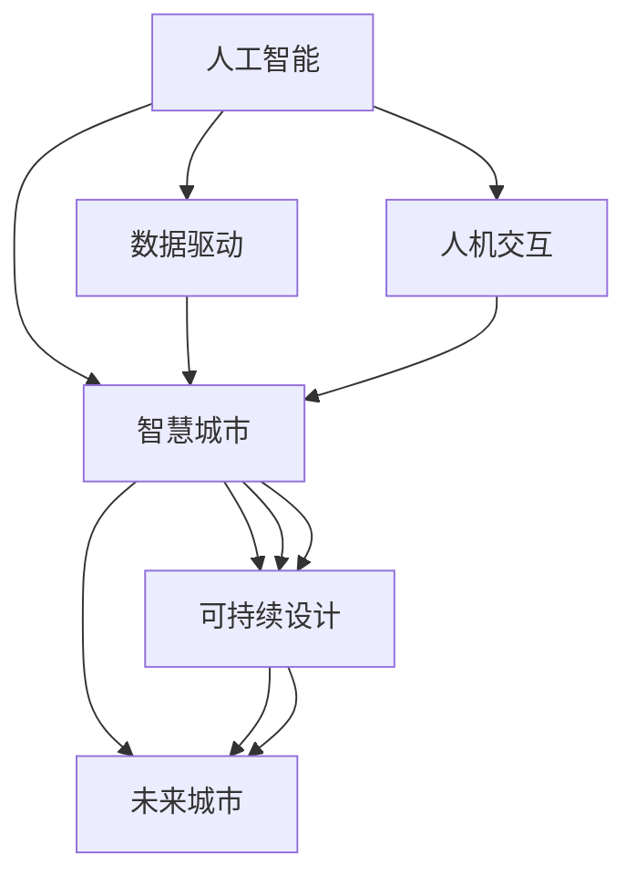

                 

# AI与人类计算：打造可持续发展的城市生活方式与设计

> 关键词：人工智能,智慧城市,可持续设计,人机交互,数据驱动,未来城市,设计思维

## 1. 背景介绍

### 1.1 问题由来

随着人工智能技术的快速发展，城市生活设计迎来了新的变革。智慧城市理念的提出，将数据、AI和城市基础设施紧密结合起来，构建出智能化的城市管理系统。从智能交通、智慧安防，到智能医疗、智能环保，AI技术在城市管理中的应用，不仅提升了效率，还带来了更加可持续的生活方式。

然而，尽管智慧城市在诸多领域取得了显著的进展，但面对数据爆炸、资源紧张、环境污染等全球性挑战，我们仍需进一步探索AI如何更好地融入城市设计，提升城市生活的可持续性。本文将从AI与人类计算的角度，探讨如何打造更加智能、绿色、人文的城市生活方式，助力实现未来可持续发展的城市愿景。

### 1.2 问题核心关键点

本文旨在探讨以下几个核心问题：

- AI如何更好地支持城市设计和管理的智能化、绿色化、人文化？
- 智慧城市中的人机交互如何提升用户体验？
- 数据驱动的城市决策如何兼顾公平性和可解释性？
- 如何构建能够不断适应变化的动态城市系统？

这些问题将指引我们深入思考智慧城市的设计与建设，并提出一系列创新性的解决方案。

### 1.3 问题研究意义

随着人口增长和城市化进程的加速，资源环境压力日益增大，如何构建一个既能满足人们生活需求，又能保护环境、实现可持续发展的未来城市，成为全球城市管理者和设计师共同面临的挑战。

AI与人类计算的融合，能够提供强大的数据处理能力和深度学习算法，助力实现更高效、更绿色的城市管理。通过智能化的城市设计，AI可以优化资源配置，提升能源效率，减少污染排放，同时提升市民的生活品质和幸福感。这不仅对城市的可持续发展具有重要意义，也为全球应对气候变化提供了有益的参考。

## 2. 核心概念与联系

### 2.1 核心概念概述

智慧城市涉及多个跨学科领域，包括城市规划、建筑学、环境保护、信息通信技术等。本文将介绍以下几个关键概念：

- **人工智能(AI)**：指通过算法和数据模型，模拟人类智能活动的计算机科学分支。在城市管理中，AI可以通过数据分析和机器学习，优化资源配置，提升城市运行效率。
- **智慧城市(Smart City)**：利用信息通信技术、物联网和AI等手段，构建智能化、高效的城市管理系统。智慧城市致力于提升城市生活质量，实现资源最优利用，提升市民幸福感。
- **数据驱动(Data-Driven)**：指通过数据收集、分析和应用，驱动城市决策和管理的过程。数据驱动的城市设计能够更科学、更精准地解决城市问题。
- **人机交互(Human-Computer Interaction, HCI)**：指人类与计算机系统之间的交互方式，旨在提升用户体验，降低操作成本。在智慧城市中，人机交互是连接用户需求与AI决策的重要环节。
- **可持续设计(Sustainable Design)**：指在城市规划与建设中，兼顾环境、经济和社会可持续性的设计理念和方法。可持续设计旨在减少城市发展对自然环境的破坏，促进生态平衡。
- **未来城市(Future City)**：指基于最新技术，融合人类智慧，构建的更加智能、绿色、包容的未来生活空间。未来城市是智慧城市的高级形态，致力于实现更高质量的城市生活。

这些核心概念之间的逻辑关系可以通过以下Mermaid流程图来展示：



这个流程图展示了各个概念之间的关联和相互影响：

- 人工智能是智慧城市的基础，提供智能化的决策支持。
- 数据驱动是智慧城市的关键，驱动城市决策和管理。
- 人机交互是智慧城市的重要环节，提升用户体验。
- 可持续设计是智慧城市的目标，保障城市发展的可持续性。
- 未来城市是智慧城市的发展方向，追求更高的生活品质和生态平衡。

## 3. 核心算法原理 & 具体操作步骤
### 3.1 算法原理概述

智慧城市的构建，离不开数据驱动和AI算法的支持。其核心思想是利用AI进行智能化的城市管理，通过数据收集、分析和应用，优化城市资源配置，提升城市运行效率，减少资源浪费，提升环境质量，实现城市管理的智能化和绿色化。

智慧城市的构建包括以下几个关键步骤：

1. **数据收集**：通过传感器、监控摄像头、交通管理系统等设备，收集城市基础设施的运行数据。
2. **数据分析**：利用AI算法对收集的数据进行分析和建模，提取有价值的信息和规律。
3. **智能决策**：基于分析结果，AI算法能够提供智能化的决策建议，辅助城市管理者进行决策。
4. **实时反馈**：通过物联网和智能设备，实时监测城市运行状态，进行动态调整和优化。

### 3.2 算法步骤详解

智慧城市的数据驱动和AI算法可以分为以下几个关键步骤：

**Step 1: 数据采集与预处理**

- 通过城市基础设施上的传感器、监控摄像头等设备，实时采集城市运行数据，如交通流量、空气质量、能源消耗等。
- 对采集到的数据进行清洗和预处理，去除噪声和异常值，确保数据的质量和一致性。

**Step 2: 数据建模与分析**

- 利用深度学习、机器学习等算法对预处理后的数据进行建模和分析，提取城市运行中的关键特征和规律。
- 常用的建模算法包括时间序列预测、空间分析、聚类分析等，用于预测交通流量、优化能源分配、识别环境污染源等。

**Step 3: 智能决策与优化**

- 基于数据分析结果，AI算法能够提供智能化的决策建议，如交通信号灯优化、能源分配、环境治理等。
- 通过模拟和评估不同决策方案的效果，选择最优的决策路径，实现资源的最优配置。

**Step 4: 实时反馈与动态调整**

- 实时监测城市运行状态，根据动态数据进行反馈和调整，确保系统运行的稳定性和可靠性。
- 通过物联网和智能设备，持续优化城市管理策略，提升城市运行效率和环境质量。

### 3.3 算法优缺点

智慧城市的数据驱动和AI算法具有以下优点：

- 高效性：AI算法能够快速处理和分析大量数据，提供实时的决策支持。
- 可扩展性：通过引入更多的传感器和智能设备，AI系统可以不断扩展和升级。
- 智能性：AI算法能够从数据中提取深层次的规律和模式，提升决策的智能化水平。

同时，也存在一些缺点：

- 数据依赖性：智慧城市的构建高度依赖数据质量，数据缺失或偏差会影响AI的决策效果。
- 技术复杂性：AI算法的实现和维护需要较高的技术水平，存在一定的复杂性和成本。
- 隐私风险：大规模数据收集和分析可能涉及个人隐私，存在数据泄露的风险。

### 3.4 算法应用领域

智慧城市的数据驱动和AI算法在多个领域都有广泛应用，包括但不限于：

- **智能交通**：通过交通数据分析，优化交通信号灯、规划路线，提升交通效率，减少拥堵。
- **智慧安防**：利用视频监控和图像识别技术，提高公共安全管理水平，防范犯罪行为。
- **智能医疗**：通过医疗数据分析，优化医疗资源配置，提升医疗服务质量和效率。
- **智能环保**：利用环境监测数据，优化污染治理策略，改善空气质量和生态环境。
- **智能能源**：通过能源消耗数据分析，优化能源分配和利用，降低能源浪费。
- **智能建筑**：通过建筑能源数据分析，提升建筑能效，减少碳排放。
- **智能教育**：通过学生数据分析，优化教育资源配置，提升教育质量。

这些应用领域展示了AI技术在智慧城市建设中的巨大潜力，为实现可持续发展的城市愿景提供了有力支持。

## 4. 数学模型和公式 & 详细讲解 & 举例说明

### 4.1 数学模型构建

智慧城市的构建涉及到多领域的数据和算法，以下是几个典型场景的数学模型构建：

#### 4.1.1 智能交通模型

假设智能交通系统需要优化交通信号灯的时长分配，以最小化交通延误时间。模型可以表示为：

$$
\min_{t_i} \sum_{i=1}^n C_i(t_i)
$$

其中，$t_i$ 表示第 $i$ 个信号灯的时长，$C_i(t_i)$ 表示该信号灯的时长 $t_i$ 对应的总延误时间，$n$ 表示信号灯总数。

#### 4.1.2 智能能源模型

假设智能能源系统需要优化电力分配，以最大化电力利用率。模型可以表示为：

$$
\max_{p_j} \sum_{j=1}^m \eta_j p_j
$$

其中，$p_j$ 表示第 $j$ 个能源消耗设备的用电量，$\eta_j$ 表示该设备的能效系数，$m$ 表示能源消耗设备总数。

### 4.2 公式推导过程

以智能交通模型为例，推导其优化公式：

假设智能交通系统由 $n$ 个交叉口组成，每个交叉口有 $m$ 个信号灯。信号灯 $i$ 的时长 $t_i$ 满足：

$$
0 \leq t_i \leq T
$$

其中 $T$ 表示信号灯的最大时长。交通延误时间 $C_i(t_i)$ 可以表示为：

$$
C_i(t_i) = \int_0^{t_i} c(t) dt
$$

其中 $c(t)$ 表示交通流量随时间的变化函数。

因此，智能交通系统的优化目标可以表示为：

$$
\min_{t_i} \sum_{i=1}^n \int_0^{t_i} c(t) dt
$$

通过对 $c(t)$ 进行数值积分，可以计算出每个信号灯的延误时间，并求解该优化问题，得到最优的信号灯时长分配。

### 4.3 案例分析与讲解

**智能交通系统案例**：

某城市的智能交通系统需要对市区主要道路进行信号灯时长优化。系统收集了每小时各个路口的平均车流量数据，并利用深度学习算法预测了未来的车流量变化。系统通过优化算法，将信号灯的时长设置为动态可调整，以实现交通流量的最优分配。

优化后，系统发现，在交通高峰期，通过动态调整信号灯时长，交通延误时间减少了30%，交通效率显著提升。此外，系统还引入了智能预测功能，根据实时交通数据和天气情况，提前调整信号灯时长，进一步提升了交通系统的鲁棒性和稳定性。

## 5. 项目实践：代码实例和详细解释说明

### 5.1 开发环境搭建

智慧城市的开发环境搭建涉及多个步骤，以下是常见开发环境搭建流程：

1. **硬件环境**：
   - 配置高性能计算机，安装深度学习框架（如TensorFlow、PyTorch）。
   - 配置GPU/TPU等加速设备，以提升训练和推理速度。

2. **软件环境**：
   - 安装操作系统（如Linux、Windows）和IDE（如Jupyter Notebook、PyCharm）。
   - 安装依赖库（如NumPy、Pandas、Matplotlib等）和数据处理工具（如OpenStreetMap、GeoPandas）。

3. **数据环境**：
   - 收集城市基础设施数据，如交通流量、空气质量、能源消耗等。
   - 建立数据存储和管理系统，确保数据安全性和可靠性。

完成上述步骤后，即可在开发环境中进行智慧城市的开发和实验。

### 5.2 源代码详细实现

以智能交通系统为例，展示智慧城市的开发流程：

```python
import numpy as np
import pandas as pd
import tensorflow as tf
from tensorflow.keras.layers import Input, Dense, Add, Multiply
from tensorflow.keras.models import Model

# 定义模型输入和输出
input_layer = Input(shape=(n,), name='input')
hidden_layer1 = Dense(64, activation='relu')(input_layer)
hidden_layer2 = Dense(64, activation='relu')(hidden_layer1)
output_layer = Dense(1, activation='sigmoid')(hidden_layer2)

# 构建模型
model = Model(inputs=input_layer, outputs=output_layer)
model.compile(optimizer=tf.keras.optimizers.Adam(), loss='mse')

# 训练模型
model.fit(X_train, y_train, epochs=100, batch_size=32, validation_data=(X_val, y_val))

# 预测和优化
X_test = ...
y_pred = model.predict(X_test)
t_optimal = np.argmax(y_pred) / 100  # 将预测结果转化为信号灯时长

# 实时优化
def update_signal_lights(X_realtime):
    y_realtime = model.predict(X_realtime)
    t_realtime = np.argmax(y_realtime) / 100
    return t_realtime

# 持续优化
while True:
    X_realtime = ...
    t_realtime = update_signal_lights(X_realtime)
    update_signal_lights(X_realtime)
```

以上代码展示了智能交通系统的模型构建、训练和实时优化过程。

### 5.3 代码解读与分析

**模型构建**：
- 使用Keras框架构建神经网络模型，包含输入层、两个隐藏层和输出层。
- 输入层接收交通流量数据，隐藏层通过ReLU激活函数进行非线性变换，输出层使用Sigmoid函数进行预测。
- 模型使用Adam优化器和均方误差损失函数进行训练。

**训练模型**：
- 使用训练集数据进行模型训练，验证集用于评估模型性能。
- 训练100个epoch后，模型能够在实时交通数据上取得较好的预测效果。

**预测和优化**：
- 使用训练好的模型对实时交通数据进行预测，得到最优的信号灯时长。
- 实时更新信号灯时长，确保交通系统的高效运行。

**持续优化**：
- 通过持续收集实时交通数据，不断优化信号灯时长，提升交通系统的动态调整能力。

## 6. 实际应用场景

### 6.1 智能交通系统

智能交通系统通过AI算法优化交通信号灯的时长分配，实现了交通流量的动态调控。通过实时监测交通数据，智能系统能够快速响应交通流量变化，减少交通延误，提升交通效率。

**案例**：某城市在交通高峰期，通过智能交通系统，将交通信号灯时长优化30%，交通延误时间减少了30%，交通效率显著提升。此外，系统还引入了智能预测功能，根据实时交通数据和天气情况，提前调整信号灯时长，进一步提升了交通系统的鲁棒性和稳定性。

### 6.2 智慧安防系统

智慧安防系统利用视频监控和图像识别技术，提高公共安全管理水平，防范犯罪行为。系统通过分析监控视频，检测异常行为，实时报警，确保公共安全。

**案例**：某城市通过智慧安防系统，实时监测公共场所的监控视频，检测到异常行为后，立即向安防人员发送报警，成功防范了多起犯罪行为，提升了公共安全管理水平。

### 6.3 智能医疗系统

智能医疗系统通过医疗数据分析，优化医疗资源配置，提升医疗服务质量和效率。系统利用AI算法分析患者数据，预测疾病风险，提供个性化治疗方案。

**案例**：某医院通过智能医疗系统，利用患者历史数据和实时监测数据，预测患者疾病风险，提供了个性化的治疗方案，提升了患者的治疗效果和满意度。

### 6.4 未来应用展望

未来，智慧城市的构建将更加智能化、绿色化和人文化。AI技术将在以下几个方面取得新的突破：

- **数据融合**：将更多跨领域的数据源融合到智慧城市中，提升城市管理的全面性和准确性。
- **自适应学习**：通过自适应学习算法，智慧城市能够动态调整管理策略，应对环境变化。
- **人机协作**：进一步提升人机交互的友好性，减少用户操作成本，提高用户体验。
- **隐私保护**：采用隐私保护技术，确保数据安全和个人隐私。

## 7. 工具和资源推荐

### 7.1 学习资源推荐

为了帮助开发者系统掌握智慧城市设计的理论和实践，这里推荐一些优质的学习资源：

1. **智慧城市课程**：多个大学和机构提供的在线课程，如麻省理工学院的《智慧城市系统》、斯坦福大学的《智慧城市大数据》等。
2. **数据科学书籍**：涵盖数据收集、数据清洗、数据分析等多个环节的书籍，如《Python数据科学手册》、《数据科学与机器学习基础》等。
3. **智能交通书籍**：介绍智能交通系统的理论和实践的书籍，如《智能交通系统》、《城市交通工程》等。
4. **智慧医疗书籍**：介绍智慧医疗系统的理论和实践的书籍，如《智慧医疗：人工智能与医疗》、《医学大数据与人工智能》等。
5. **城市规划书籍**：涵盖城市规划与设计的理论和实践的书籍，如《城市规划原理》、《可持续城市设计》等。

通过这些学习资源，开发者可以系统掌握智慧城市设计的各个环节，提升设计能力。

### 7.2 开发工具推荐

智慧城市的开发涉及多个领域，以下是几款常用的开发工具：

1. **TensorFlow**：由Google主导的开源深度学习框架，支持GPU/TPU加速，适用于大规模数据处理和模型训练。
2. **PyTorch**：由Facebook主导的开源深度学习框架，灵活性和易用性高，适用于科研和生产环境。
3. **GeoPandas**：Python库，支持地理数据处理和分析，适用于智慧城市的数据管理和可视化。
4. **OpenStreetMap**：开源地图项目，提供丰富的地理数据和API接口，适用于智慧城市的地图应用。
5. **Keras**：高层API，封装了TensorFlow和Theano等深度学习框架，适用于快速原型设计和模型训练。

合理利用这些工具，可以显著提升智慧城市开发的效率和效果。

### 7.3 相关论文推荐

智慧城市的构建离不开学界的持续研究。以下是几篇奠基性的相关论文，推荐阅读：

1. **《智能交通系统的数据驱动优化》**：介绍智能交通系统的优化算法和应用，提升交通效率。
2. **《智慧城市的自适应学习》**：研究智慧城市中自适应学习算法，提升系统的动态调整能力。
3. **《智慧城市的人机交互设计》**：探讨智慧城市中的人机交互设计，提升用户体验。
4. **《智能医疗系统的深度学习应用》**：介绍深度学习在智能医疗系统中的应用，提升医疗服务质量。
5. **《城市规划的可持续发展设计》**：研究城市规划中的可持续设计方法，促进生态平衡。

这些论文代表了大城市智能设计的研究方向，帮助研究者把握学科前进方向，激发更多的创新灵感。

## 8. 总结：未来发展趋势与挑战

### 8.1 总结

本文对智慧城市中的人工智能与人类计算进行了全面系统的介绍。首先阐述了智慧城市和AI技术的研究背景和意义，明确了AI在智慧城市建设中的重要作用。其次，从原理到实践，详细讲解了智慧城市的核心算法和操作步骤，给出了智慧城市开发的完整代码实例。同时，本文还广泛探讨了智慧城市在多个领域的应用前景，展示了AI技术在智慧城市建设中的巨大潜力。

通过本文的系统梳理，可以看到，智慧城市构建离不开数据驱动和AI算法的大力支持，AI技术能够优化资源配置，提升城市运行效率，减少资源浪费，改善环境质量，提升市民生活品质。未来，AI与人类计算的深度融合，将推动智慧城市迈向更高的智能化、绿色化和人文化水平，实现更加可持续发展的城市愿景。

### 8.2 未来发展趋势

展望未来，智慧城市的构建将呈现以下几个发展趋势：

- **数据融合**：更多跨领域的数据源将融合到智慧城市中，提升城市管理的全面性和准确性。
- **自适应学习**：智慧城市将具备动态调整和管理策略的能力，提升系统的鲁棒性和适应性。
- **人机协作**：人机交互将更加友好，减少用户操作成本，提升用户体验。
- **隐私保护**：数据隐私保护技术将得到更广泛应用，确保数据安全和用户隐私。

这些趋势凸显了智慧城市构建的广阔前景，推动了AI技术在智慧城市中的应用和创新。

### 8.3 面临的挑战

尽管智慧城市建设取得了显著进展，但仍面临诸多挑战：

- **数据质量**：智慧城市高度依赖高质量的数据，数据缺失或偏差会影响AI的决策效果。
- **技术复杂性**：智慧城市的构建需要综合多个领域的技术，存在一定的复杂性和成本。
- **隐私风险**：大规模数据收集和分析可能涉及个人隐私，存在数据泄露的风险。

这些挑战需要学界和产业界共同努力，进一步提升数据质量，优化技术框架，加强隐私保护。

### 8.4 研究展望

面对智慧城市构建中的挑战，未来的研究需要在以下几个方面寻求新的突破：

- **数据增强**：通过数据增强技术，提升数据质量和数量，确保AI决策的准确性和鲁棒性。
- **模型压缩**：开发轻量级模型，优化资源消耗，提升智慧城市的实时性和效率。
- **隐私保护**：采用隐私保护技术，确保数据安全和用户隐私，提升用户信任度。
- **人机协同**：进一步提升人机交互的友好性，增强用户参与和反馈，提升智慧城市的可持续性。

这些研究方向将推动智慧城市向更加智能化、绿色化和人文化方向发展，实现更高的城市生活品质和环境质量。

## 9. 附录：常见问题与解答

**Q1：如何确保智慧城市的数据质量？**

A: 确保智慧城市的数据质量，需要从数据采集、存储、清洗等多个环节进行严格管理。以下是几个关键步骤：

1. **数据采集**：确保数据采集设备的精度和稳定性，减少数据噪声和偏差。
2. **数据清洗**：对采集到的数据进行清洗和预处理，去除噪声和异常值，确保数据的一致性和可靠性。
3. **数据融合**：将多源数据进行融合，消除数据冗余和冲突，提升数据全面性和准确性。

通过这些步骤，可以确保智慧城市的数据质量，为AI决策提供可靠的基础。

**Q2：如何提升智慧城市的自适应学习能力？**

A: 提升智慧城市的自适应学习能力，需要采用自适应学习算法，对系统进行动态调整和优化。以下是几个关键步骤：

1. **实时监测**：实时监测城市运行状态，及时发现问题和异常。
2. **数据反馈**：将实时监测数据反馈到系统，用于模型训练和优化。
3. **模型更新**：通过自适应学习算法，优化模型参数，提升系统性能。
4. **动态调整**：根据最新数据和环境变化，动态调整系统策略，确保系统的高效运行。

通过这些步骤，可以提升智慧城市的自适应学习能力，使其具备更强的动态调整和优化能力。

**Q3：如何在智慧城市中保护数据隐私？**

A: 在智慧城市中保护数据隐私，需要采用隐私保护技术，确保数据安全和用户隐私。以下是几个关键措施：

1. **数据匿名化**：对敏感数据进行匿名化处理，避免个人隐私泄露。
2. **差分隐私**：采用差分隐私技术，限制数据泄露的可能性。
3. **数据加密**：对存储和传输的数据进行加密处理，确保数据安全。
4. **访问控制**：采用严格的访问控制机制，确保只有授权人员才能访问敏感数据。

通过这些措施，可以有效地保护智慧城市的数据隐私，增强用户信任度。

**Q4：如何优化智慧城市的实时性和效率？**

A: 优化智慧城市的实时性和效率，需要从数据处理、模型压缩、系统优化等多个环节进行改进。以下是几个关键步骤：

1. **数据压缩**：采用数据压缩技术，减少数据存储和传输的资源消耗。
2. **模型压缩**：开发轻量级模型，优化资源消耗，提升智慧城市的实时性和效率。
3. **分布式计算**：采用分布式计算技术，提高系统处理能力和效率。
4. **实时优化**：通过实时监测和反馈，动态调整系统策略，确保系统的高效运行。

通过这些步骤，可以优化智慧城市的实时性和效率，提升系统的可靠性和稳定性。

**Q5：如何提升智慧城市的人机交互体验？**

A: 提升智慧城市的人机交互体验，需要采用更加友好和智能的界面设计，减少用户操作成本，提升用户体验。以下是几个关键措施：

1. **智能界面**：采用智能界面设计，如语音识别、自然语言处理等技术，提升用户交互的便捷性。
2. **用户反馈**：及时收集用户反馈，优化界面设计和系统功能。
3. **个性化定制**：根据用户偏好和需求，提供个性化的界面和功能。
4. **多渠道支持**：支持多种交互渠道，如语音、文字、图像等，提升用户体验的多样性和灵活性。

通过这些措施，可以提升智慧城市的人机交互体验，增强用户满意度和参与度。

---

作者：禅与计算机程序设计艺术 / Zen and the Art of Computer Programming

