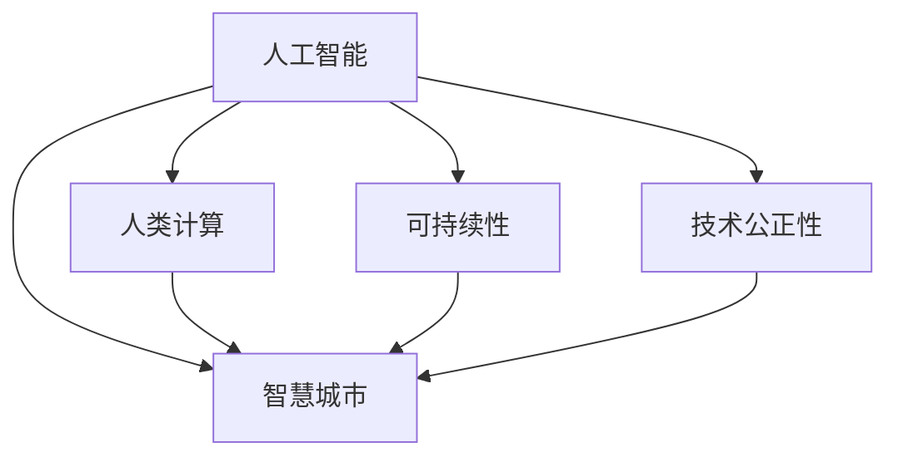

                 

# AI与人类计算：打造可持续发展的城市生活模式

> 关键词：人工智能,人类计算,智慧城市,可持续性,城市生活模式

## 1. 背景介绍

随着城市化进程的加速，人口激增、资源紧缺、环境污染等诸多问题逐渐显现，如何构建一个可持续发展的智慧城市，成为了全球关注的焦点。人工智能技术的发展为解决这些挑战提供了新的思路。

### 1.1 问题由来

城市生活模式的可持续发展，涉及资源管理、环境保护、交通系统、公共服务等多个方面。传统上，这些问题的解决依赖于物理手段和政策调控。而现代信息技术的飞速发展，特别是人工智能技术的崛起，为城市管理提供了一种全新的解决方案。

人工智能能够处理海量数据，提供精准的决策支持，优化资源配置，提升服务效率，极大地改善城市运行效率和居民生活质量。然而，在人工智能与人类计算的结合过程中，如何确保技术的公正性、可解释性和可持续性，成为一个亟待解决的重要问题。

### 1.2 问题核心关键点

本文聚焦于通过人工智能技术，结合人类计算，构建可持续发展的城市生活模式。关键点包括：

- 人工智能在智慧城市中的应用：交通管理、智能电网、环境监测、垃圾分类、医疗健康等。
- 人类计算：数据标注、规则制定、用户反馈等，与AI技术的互补。
- 可持续性：资源节约、环境友好、社会公平、技术伦理等。
- 技术公正性：算法公平性、数据透明性、隐私保护等。

## 2. 核心概念与联系

### 2.1 核心概念概述

为更好地理解AI与人类计算在智慧城市中的结合，本节将介绍几个密切相关的核心概念：

- 人工智能(AI)：使用算法和机器学习技术，使计算机具备感知、学习、推理等智能能力。
- 人类计算：利用人类智慧进行数据标注、规则制定、模型评估等任务，提升AI系统的准确性和可靠性。
- 智慧城市：通过信息通信技术，将城市管理与服务智能化，实现高效、便捷、可持续的城市生活模式。
- 可持续性(Sustainability)：在环境、社会、经济三方面取得平衡，保障城市长远发展。
- 技术公正性(Fairness)：保证AI技术的决策公平、透明，不偏袒特定群体。

这些核心概念之间的逻辑关系可以通过以下Mermaid流程图来展示：



这个流程图展示了大语言模型的核心概念及其之间的关系：

1. 人工智能通过智慧城市技术实现智能管理和高效服务。
2. 人类计算与AI技术互补，提升AI系统的准确性和公正性。
3. 可持续性是大城市管理的重要目标，需要AI和人类计算的共同努力。
4. 技术公正性是AI技术落地应用的前提，保障公平、透明。

## 3. 核心算法原理 & 具体操作步骤
### 3.1 算法原理概述

AI与人类计算在智慧城市中的应用，本质上是将AI技术与人类智慧相结合，通过数据驱动决策，实现资源优化配置、服务高效运作和环境友好管理。

在智慧城市中，AI系统通过数据采集、模型训练、推理预测等步骤，自动化完成决策和控制。而人类计算则通过数据标注、规则制定、模型评估等方式，辅助AI系统优化算法、提高准确性和公正性。

### 3.2 算法步骤详解

基于AI与人类计算的智慧城市构建，一般包括以下几个关键步骤：

**Step 1: 数据采集与预处理**
- 收集城市运行数据，如交通流量、能源消耗、环境监测数据等。
- 进行数据清洗、归一化、特征提取等预处理，以适应模型输入。

**Step 2: 模型构建与训练**
- 选择合适的AI模型，如深度学习模型、强化学习模型等，进行构建。
- 使用历史数据对模型进行训练，调整参数、优化损失函数，直至收敛。

**Step 3: 模型评估与微调**
- 在验证集上评估模型性能，如准确率、召回率、F1值等。
- 根据评估结果进行模型微调，调整模型结构、更新超参数，提升模型泛化能力。

**Step 4: 人类计算辅助**
- 利用人类计算对模型结果进行标注、验证和反馈，提升模型的公正性和可信度。
- 引入专家知识、规则库等先验信息，辅助AI系统决策。

**Step 5: 应用部署与监控**
- 将训练好的模型部署到实际的城市管理系统中，进行实时监控和反馈。
- 实时调整模型参数，优化城市运行策略，提升服务效率。

### 3.3 算法优缺点

基于AI与人类计算的智慧城市构建方法具有以下优点：
1. 高效智能：AI系统自动化处理数据，快速做出决策，提升城市管理效率。
2. 精度可靠：人类计算对AI系统进行辅助，提升决策的公正性和可信度。
3. 可解释性强：人类计算提供模型评估和解释，便于监管和调试。
4. 灵活可扩展：系统可以根据实际情况进行调整和优化，适应多样化的需求。

同时，该方法也存在一定的局限性：
1. 数据依赖性强：智慧城市依赖于城市数据的全面采集和高质量标注。
2. 技术复杂度高：AI系统的构建和部署需要较高的技术门槛。
3. 资源消耗大：大规模数据的处理和AI模型的训练需要较高的计算资源。
4. 伦理道德问题：AI系统可能会引入偏见，侵犯隐私，需要谨慎处理。

尽管存在这些局限性，但就目前而言，基于AI与人类计算的智慧城市构建方法仍是大城市管理的主要方向。未来相关研究的重点在于如何进一步降低数据依赖，提高系统鲁棒性，优化资源消耗，同时兼顾伦理道德等方面。

### 3.4 算法应用领域

基于AI与人类计算的智慧城市构建方法，已经在多个领域得到应用，包括：

- 智能交通系统：通过AI系统进行交通流量预测和调优，提升道路通行效率，减少拥堵。
- 智能电网：利用AI系统优化电力分配和调度，提升能源利用效率，减少浪费。
- 环境监测系统：利用AI系统进行空气质量、水质、噪音等环境指标监测，及时发现和处理环境污染。
- 垃圾分类系统：通过AI系统对垃圾进行智能识别和分类，提高垃圾处理效率，减少环境污染。
- 医疗健康：利用AI系统进行疾病预测、诊断和治疗方案推荐，提升医疗服务质量。

除了上述这些经典应用外，AI与人类计算还在智慧教育、安全监控、旅游管理等多个领域得到创新性应用，为智慧城市建设提供了新的动力。

## 4. 数学模型和公式 & 详细讲解  
### 4.1 数学模型构建

本节将使用数学语言对基于AI与人类计算的智慧城市构建过程进行更加严格的刻画。

假设智慧城市中的人流数据为 $D=\{(x_i,y_i)\}_{i=1}^N$，其中 $x_i$ 为时间点， $y_i$ 为该时间点的人流数量。设 $f(x)$ 为预测模型， $f_{\theta}(x)$ 为参数化的AI模型， $\theta$ 为模型参数。

构建AI模型的目标是最小化预测误差，即：

$$
\mathcal{L}(\theta) = \frac{1}{N}\sum_{i=1}^N |y_i-f_{\theta}(x_i)|^2
$$

引入人类计算进行辅助，构建模型评估函数 $g(x,y)$，通过人工标注的数据对AI模型进行验证和调整：

$$
\mathcal{R}(\theta,g) = \frac{1}{N}\sum_{i=1}^N g(y_i,f_{\theta}(x_i))
$$

其中 $g$ 为评估函数，如精度、召回率等指标。

### 4.2 公式推导过程

以下我们以智能交通系统为例，推导预测模型的优化目标函数。

设 $f(x)$ 为预测模型， $f_{\theta}(x)$ 为参数化的AI模型。假设模型输出 $f_{\theta}(x)$ 为道路通行时间， $y_i$ 为实际观测到的通行时间。构建损失函数：

$$
\mathcal{L}(\theta) = \frac{1}{N}\sum_{i=1}^N |y_i-f_{\theta}(x_i)|^2
$$

进行梯度下降优化，更新参数：

$$
\theta \leftarrow \theta - \eta\nabla_{\theta}\mathcal{L}(\theta)
$$

其中 $\eta$ 为学习率， $\nabla_{\theta}\mathcal{L}(\theta)$ 为损失函数对参数 $\theta$ 的梯度。

引入人类计算对模型进行评估，构建评估函数 $g(x,y)$：

$$
g(y_i,f_{\theta}(x_i)) = 1 - \frac{y_i}{f_{\theta}(x_i)}
$$

表示模型预测与实际观测的误差率。

构建评估指标函数 $\mathcal{R}(\theta,g)$：

$$
\mathcal{R}(\theta,g) = \frac{1}{N}\sum_{i=1}^N g(y_i,f_{\theta}(x_i))
$$

最小化评估指标函数 $\mathcal{R}(\theta,g)$，更新参数：

$$
\theta \leftarrow \theta - \eta\nabla_{\theta}\mathcal{R}(\theta,g)
$$

其中 $\nabla_{\theta}\mathcal{R}(\theta,g)$ 为评估指标函数对参数 $\theta$ 的梯度。

通过不断迭代上述过程，直至评估指标函数收敛，即可得到最优参数 $\theta^*$。

## 5. 项目实践：代码实例和详细解释说明
### 5.1 开发环境搭建

在进行智慧城市应用开发前，我们需要准备好开发环境。以下是使用Python进行PyTorch开发的环境配置流程：

1. 安装Anaconda：从官网下载并安装Anaconda，用于创建独立的Python环境。

2. 创建并激活虚拟环境：
```bash
conda create -n pytorch-env python=3.8 
conda activate pytorch-env
```

3. 安装PyTorch：根据CUDA版本，从官网获取对应的安装命令。例如：
```bash
conda install pytorch torchvision torchaudio cudatoolkit=11.1 -c pytorch -c conda-forge
```

4. 安装TensorFlow：由Google主导开发的开源深度学习框架，生产部署方便，适合大规模工程应用。同样有丰富的预训练语言模型资源。

5. 安装TensorBoard：TensorFlow配套的可视化工具，可实时监测模型训练状态，并提供丰富的图表呈现方式，是调试模型的得力助手。

6. 安装HuggingFace Transformers库：
```bash
pip install transformers
```

完成上述步骤后，即可在`pytorch-env`环境中开始智慧城市应用开发。

### 5.2 源代码详细实现

下面我们以智能交通系统为例，给出使用PyTorch进行交通流量预测的PyTorch代码实现。

首先，定义数据处理函数：

```python
from torch.utils.data import Dataset
import torch

class TrafficDataset(Dataset):
    def __init__(self, data):
        self.data = data
        
    def __len__(self):
        return len(self.data)
    
    def __getitem__(self, item):
        x = self.data[item][0]
        y = self.data[item][1]
        return {'x': x, 'y': y}

# 构建数据集
data = [
    [time_point1, traffic_volume1],
    [time_point2, traffic_volume2],
    ...
    [time_pointN, traffic_volumeN]
]
dataset = TrafficDataset(data)
```

然后，定义模型和优化器：

```python
from torch import nn
from torch.optim import Adam

model = nn.Sequential(
    nn.Linear(input_dim, hidden_dim),
    nn.ReLU(),
    nn.Linear(hidden_dim, output_dim)
)

optimizer = Adam(model.parameters(), lr=0.001)
```

接着，定义训练和评估函数：

```python
def train(model, optimizer, dataset, num_epochs):
    for epoch in range(num_epochs):
        model.train()
        for x, y in dataset:
            optimizer.zero_grad()
            y_pred = model(x)
            loss = nn.MSELoss()(y_pred, y)
            loss.backward()
            optimizer.step()
        print(f'Epoch {epoch+1}, Loss: {loss.item()}')
        
def evaluate(model, dataset):
    model.eval()
    loss = 0
    for x, y in dataset:
        y_pred = model(x)
        loss += nn.MSELoss()(y_pred, y).item()
    return loss / len(dataset)
```

最后，启动训练流程并在测试集上评估：

```python
epochs = 100
dataset = TrafficDataset(data)

train(model, optimizer, dataset, epochs)

test_loss = evaluate(model, dataset)
print(f'Test Loss: {test_loss:.4f}')
```

以上就是使用PyTorch进行智能交通系统开发的完整代码实现。可以看到，借助强大的深度学习库，开发智能交通系统变得相对简单和高效。

### 5.3 代码解读与分析

让我们再详细解读一下关键代码的实现细节：

**TrafficDataset类**：
- `__init__`方法：初始化数据。
- `__len__`方法：返回数据集长度。
- `__getitem__`方法：返回单个数据样本。

**训练函数train**：
- 使用Adam优化器进行参数更新。
- 对数据进行前向传播，计算损失函数，反向传播更新参数，记录训练损失。

**评估函数evaluate**：
- 使用MSE损失函数计算预测值与实际值之间的误差，统计评估集上的平均损失。

**训练流程**：
- 定义总的epoch数和训练集。
- 在每个epoch内，对数据进行训练，输出损失。
- 在测试集上评估模型，输出测试损失。

可以看到，PyTorch配合深度学习库使得智慧城市应用的开发变得简单高效。开发者可以将更多精力放在数据处理、模型改进等高层逻辑上，而不必过多关注底层的实现细节。

当然，工业级的系统实现还需考虑更多因素，如模型的保存和部署、超参数的自动搜索、更灵活的任务适配层等。但核心的智慧城市构建方法基本与此类似。

## 6. 实际应用场景
### 6.1 智慧交通系统

智能交通系统是智慧城市的重要组成部分，通过AI系统对交通流量进行实时监控和预测，可以显著提升道路通行效率，减少交通拥堵。

具体而言，可以收集城市交通流量数据，构建交通流量预测模型。利用历史交通流量数据进行模型训练，通过AI系统进行实时预测，提供交通调优建议。当预测到交通拥堵时，自动触发信号灯控制、诱导屏提示等措施，缓解交通压力。

### 6.2 智能电网

智能电网通过AI系统优化电力分配和调度，可以提高能源利用效率，减少浪费，降低电力成本。

在智能电网中，可以收集电网负载数据，构建电力负荷预测模型。利用历史负荷数据进行模型训练，通过AI系统进行实时预测，优化电力分配和调度策略。在负荷高峰期，自动调整电价和供电策略，平衡供需，减少电网压力。

### 6.3 环境监测系统

环境监测系统是智慧城市的重要组成部分，通过AI系统对环境指标进行实时监测，可以及时发现和处理环境污染问题，保障城市环境质量。

具体而言，可以收集环境监测数据，构建环境指标预测模型。利用历史环境数据进行模型训练，通过AI系统进行实时监测，识别环境污染源。当发现环境指标异常时，自动触发预警和应对措施，如调整工业排放、限制汽车通行等，降低环境污染。

### 6.4 未来应用展望

随着智慧城市建设的不断深入，基于AI与人类计算的构建方法将在更多领域得到应用，为城市管理带来革命性影响。

在智慧医疗领域，通过AI系统进行疾病预测、诊断和治疗方案推荐，提升医疗服务质量，实现精准医疗。在智慧教育领域，利用AI系统进行个性化学习推荐、智能作业批改等，提升教育公平和质量。在智慧农业领域，通过AI系统进行智能灌溉、病虫害预测等，提升农业生产效率和可持续性。

此外，在智慧安全、智慧旅游、智慧物流等多个领域，基于AI与人类计算的构建方法也将不断涌现，为智慧城市建设提供新的动力。相信随着技术的日益成熟，基于AI与人类计算的城市生活模式必将全面落地，构建更加智能、绿色、可持续的城市生活。

## 7. 工具和资源推荐
### 7.1 学习资源推荐

为了帮助开发者系统掌握智慧城市构建的理论基础和实践技巧，这里推荐一些优质的学习资源：

1. 《智慧城市与人工智能》系列博文：由城市规划专家和AI技术专家共同撰写，深入浅出地介绍了智慧城市的基本概念和前沿技术。

2. 《城市智能系统》课程：斯坦福大学开设的智慧城市明星课程，有Lecture视频和配套作业，带你入门智慧城市的基本概念和经典模型。

3. 《AI城市》书籍：全面介绍了AI技术在智慧城市中的应用，涵盖智能交通、智慧电网、环境监测等多个领域，助力智慧城市技术发展。

4. Smart City Consortium：全球智慧城市联盟，提供丰富的智慧城市建设和运营案例，值得学习和借鉴。

通过对这些资源的学习实践，相信你一定能够快速掌握智慧城市构建的精髓，并用于解决实际的智慧城市问题。
###  7.2 开发工具推荐

高效的开发离不开优秀的工具支持。以下是几款用于智慧城市构建开发的常用工具：

1. PyTorch：基于Python的开源深度学习框架，灵活动态的计算图，适合快速迭代研究。大部分预训练语言模型都有PyTorch版本的实现。

2. TensorFlow：由Google主导开发的开源深度学习框架，生产部署方便，适合大规模工程应用。同样有丰富的预训练语言模型资源。

3. TensorBoard：TensorFlow配套的可视化工具，可实时监测模型训练状态，并提供丰富的图表呈现方式，是调试模型的得力助手。

4. Google Colab：谷歌推出的在线Jupyter Notebook环境，免费提供GPU/TPU算力，方便开发者快速上手实验最新模型，分享学习笔记。

合理利用这些工具，可以显著提升智慧城市应用的开发效率，加快创新迭代的步伐。

### 7.3 相关论文推荐

智慧城市与人工智能的发展源于学界的持续研究。以下是几篇奠基性的相关论文，推荐阅读：

1. Smart Cities and Smart Agriculture: A Review of Technologies, Models, and Methods（智能城市与智能农业：技术、模型和方法综述）：系统回顾了智慧城市和智能农业的核心技术和应用方法，为城市管理提供理论支持。

2. Towards Smart Cities: The Role of Big Data Analytics in City Management（走向智能城市：大数据分析在城市管理中的应用）：探讨了大数据分析在智慧城市建设中的关键作用，为城市管理提供数据支撑。

3. Towards Smart Cities Through Artificial Intelligence（通过人工智能走向智能城市）：探讨了AI技术在智慧城市建设中的应用前景，提出了智慧城市建设的新思路。

4. Modeling Urban Systems with AI: Challenges and Opportunities（使用AI建模城市系统：挑战与机遇）：探讨了使用AI技术建模城市系统的挑战与机遇，为智慧城市建设提供技术支撑。

这些论文代表了大语言模型微调技术的发展脉络。通过学习这些前沿成果，可以帮助研究者把握学科前进方向，激发更多的创新灵感。

## 8. 总结：未来发展趋势与挑战

### 8.1 总结

本文对基于AI与人类计算的智慧城市构建方法进行了全面系统的介绍。首先阐述了智慧城市构建的背景和意义，明确了AI与人类计算在智慧城市建设中的核心价值。其次，从原理到实践，详细讲解了智慧城市构建的数学模型和操作步骤，给出了智慧城市应用的完整代码实例。同时，本文还广泛探讨了智慧城市在智能交通、智能电网、环境监测等多个领域的应用前景，展示了AI与人类计算在智慧城市建设中的巨大潜力。最后，本文精选了智慧城市构建的各类学习资源，力求为读者提供全方位的技术指引。

通过本文的系统梳理，可以看到，基于AI与人类计算的智慧城市构建方法正在成为智慧城市管理的主要方向，极大地提升了城市运行效率和居民生活质量。未来，伴随技术的不断进步和应用的深入，AI与人类计算将在更多领域得到应用，为智慧城市建设提供新的动力。

### 8.2 未来发展趋势

展望未来，AI与人类计算在智慧城市中的应用将呈现以下几个发展趋势：

1. 数据驱动决策：AI系统通过分析海量城市数据，提供精准的决策支持，优化资源配置，提升城市管理效率。

2. 多模态融合：AI系统结合视觉、声音、文本等多种数据源，进行综合分析和决策，提升智慧城市系统的泛化能力和鲁棒性。

3. 用户参与设计：引入用户反馈和人工干预，优化AI系统设计，提升决策的公正性和可信度。

4. 隐私保护与伦理监管：加强数据隐私保护和模型伦理监管，保障城市居民的隐私权和权益。

5. 智能化基础设施：AI系统与城市基础设施深度融合，提升城市智能化水平，实现智慧城市建设的新高度。

6. 跨领域协同：AI系统与其他领域的协同优化，如交通、能源、医疗等，实现跨领域的智慧城市创新。

以上趋势凸显了AI与人类计算在智慧城市建设中的广阔前景。这些方向的探索发展，必将进一步提升智慧城市系统的性能和应用范围，为智慧城市建设提供新的动力。

### 8.3 面临的挑战

尽管AI与人类计算在智慧城市中的应用取得了显著成效，但在迈向更加智能化、普适化应用的过程中，仍面临诸多挑战：

1. 数据隐私保护：在收集城市数据过程中，如何保障个人隐私，避免数据泄露，是一个重要的问题。

2. 数据标准规范：不同来源的数据格式和标准不一致，如何实现数据融合和共享，是一个亟待解决的问题。

3. 模型鲁棒性不足：AI系统在处理异常数据时，容易产生偏差，如何提高模型的鲁棒性，是一个重要的研究方向。

4. 资源消耗大：大规模数据的处理和AI模型的训练需要较高的计算资源，如何优化资源消耗，是一个重要的研究方向。

5. 技术落地难度大：AI技术在实际应用中存在很多挑战，如何实现技术的落地应用，是一个重要的研究方向。

尽管存在这些挑战，但通过不断创新和优化，AI与人类计算必将在智慧城市建设中发挥更大的作用，为城市管理带来更多的智慧和便捷。

### 8.4 研究展望

面对AI与人类计算在智慧城市建设中面临的挑战，未来的研究需要在以下几个方面寻求新的突破：

1. 数据隐私保护技术：开发更加安全、高效的数据隐私保护算法，保障城市数据的安全性和隐私性。

2. 数据标准化技术：建立统一的城市数据标准，实现数据的高效融合和共享。

3. 模型鲁棒性优化技术：开发更加鲁棒的AI模型，增强其对异常数据的处理能力，提升智慧城市系统的可靠性。

4. 资源优化技术：开发高效、轻量级的AI模型，优化计算资源消耗，实现智慧城市的可持续发展。

5. 技术落地应用技术：开发更加易用、高效、易扩展的智慧城市系统，推动AI技术在实际应用中的落地。

这些研究方向的探索，必将引领AI与人类计算在智慧城市建设中的进一步发展，为构建智慧、绿色、可持续的城市生活模式提供新的思路和技术支撑。

## 9. 附录：常见问题与解答

**Q1：智慧城市构建中如何平衡数据隐私和公共利益？**

A: 在智慧城市构建中，数据隐私和公共利益的平衡是一个重要的问题。可以通过以下措施来实现：
1. 数据匿名化：在数据收集和处理过程中，对个人数据进行匿名化处理，保障隐私。
2. 数据加密：对城市数据进行加密存储和传输，防止数据泄露。
3. 数据共享协议：制定数据共享协议，明确数据使用范围和目的，确保数据的安全性和合规性。
4. 用户参与：在数据收集和使用过程中，保障用户的知情权和同意权，透明公开数据使用情况。

**Q2：智慧城市构建中如何确保AI系统的公正性？**

A: 确保AI系统的公正性，可以通过以下措施来实现：
1. 数据平衡：确保训练数据集的代表性，避免数据偏置。
2. 模型评估：通过多轮评估和验证，确保模型的公正性。
3. 人工干预：引入人工干预和监管机制，及时发现和纠正模型的偏差。
4. 透明度：保障模型的透明度和可解释性，便于监管和调试。

**Q3：智慧城市构建中如何提升AI系统的鲁棒性？**

A: 提升AI系统的鲁棒性，可以通过以下措施来实现：
1. 数据增强：引入数据增强技术，提高模型对异常数据的适应能力。
2. 对抗训练：引入对抗样本，训练鲁棒模型，增强模型的鲁棒性。
3. 模型压缩：通过模型压缩技术，减小模型复杂度，提高模型的鲁棒性。
4. 模型融合：通过模型融合技术，提高模型的鲁棒性和泛化能力。

**Q4：智慧城市构建中如何优化资源消耗？**

A: 优化智慧城市应用的资源消耗，可以通过以下措施来实现：
1. 模型压缩：通过模型压缩技术，减小模型复杂度，减少计算资源消耗。
2. 分布式计算：通过分布式计算技术，提高计算效率，减少资源消耗。
3. 资源调度：通过资源调度技术，优化资源配置，减少资源浪费。
4. 算法优化：通过算法优化技术，提高计算效率，减少资源消耗。

**Q5：智慧城市构建中如何提高AI系统的可解释性？**

A: 提高AI系统的可解释性，可以通过以下措施来实现：
1. 模型可视化：通过模型可视化技术，展示模型的决策过程，便于理解和解释。
2. 特征解释：通过特征解释技术，展示模型决策的关键特征，便于理解模型行为。
3. 规则融合：将AI模型与专家规则结合，增强模型的可解释性。
4. 用户教育：通过用户教育，提升用户对AI系统的理解和使用能力。

这些措施可以结合智慧城市应用的具体场景，不断优化AI系统的性能和可靠性，为智慧城市建设提供坚实的技术支撑。

---

作者：禅与计算机程序设计艺术 / Zen and the Art of Computer Programming

