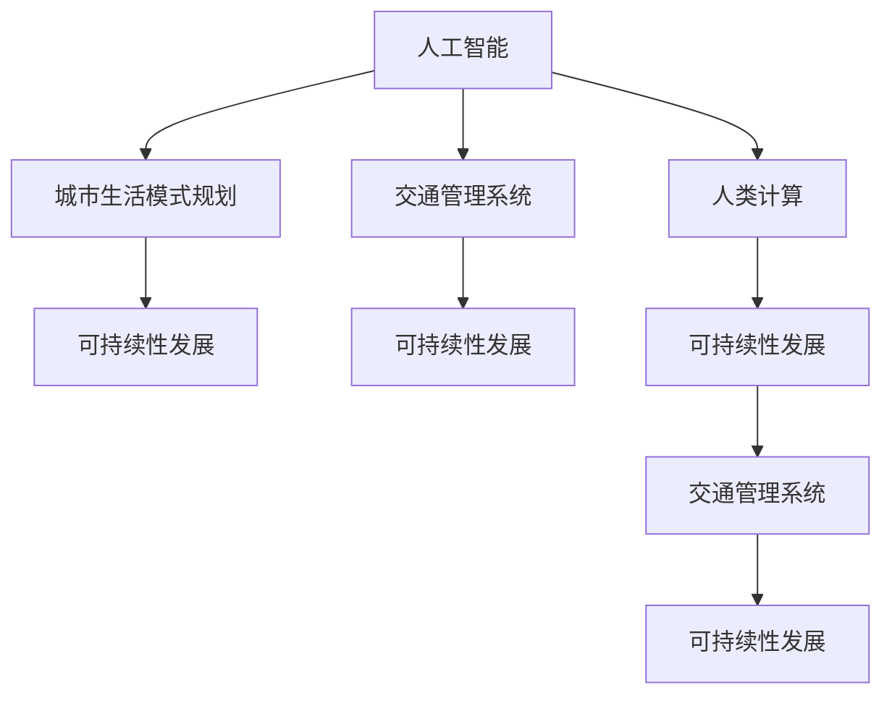

                 

## 1. 背景介绍

随着城市化进程的加快，人口密集、交通拥堵、环境污染等城市问题日益突出，亟需新型技术手段来解决。人工智能(AI)与人类计算(Human Computing)作为新兴技术，为城市生活模式的规划和交通管理系统的设计提供了新的思路和方法。通过AI和人类计算的结合，不仅能够优化城市资源配置，提升交通效率，还能促进可持续发展，构建更加宜居的城市生活环境。本文将围绕这一主题，详细介绍AI与人类计算在城市生活模式与交通管理系统规划中的应用。

## 2. 核心概念与联系

### 2.1 核心概念概述

1. **人工智能(AI)**：指使用计算机算法和数据分析技术，模拟人类智能，实现自主学习、感知、推理和决策等能力。AI技术在图像识别、自然语言处理、智能推荐等领域有着广泛的应用。

2. **人类计算(Human Computing)**：指利用人类智慧与技能，通过智能化工具辅助，实现高效计算与数据处理。人类计算强调人机协同，将复杂计算任务分解为可执行的任务，充分发挥人的优势。

3. **城市生活模式规划**：指通过AI与人类计算技术，对城市居民的生活习惯、工作方式、消费模式等进行分析和优化，以提升城市生活质量和宜居性。

4. **交通管理系统**：利用AI与人类计算技术，对交通流量、车辆定位、路网管理等进行智能分析和优化，提升交通效率和安全性。

5. **可持续性发展**：指在城市规划与交通管理中，充分考虑环境保护、资源利用效率、社会公平等要素，实现长期、稳定、和谐的发展。

这些核心概念之间的逻辑关系可以通过以下Mermaid流程图来展示：



这个流程图展示了大语言模型的核心概念及其之间的关系：

1. AI和人类计算技术支持城市生活模式规划和交通管理系统设计。
2. 这些系统设计有助于实现可持续性发展。
3. AI和人类计算的结合，能够充分发挥各自优势，提升规划与管理的科学性和效率。

## 3. 核心算法原理 & 具体操作步骤

### 3.1 算法原理概述

基于AI与人类计算的城市生活模式与交通管理系统规划，核心算法原理可以概括为以下几点：

1. **数据融合**：将城市各类数据（如交通流量、气象数据、人口统计数据等）进行整合，构建统一的城市数据平台。

2. **AI建模**：使用机器学习、深度学习等AI技术，对城市运行数据进行建模，预测交通流量、能源需求、环境变化等。

3. **优化决策**：结合AI模型和人类专家的知识和经验，进行综合优化决策，提升城市管理和服务的质量。

4. **实时监控与反馈**：通过传感器、智能设备等手段，实现对城市运行状态的实时监控，并根据反馈数据动态调整模型和决策策略。

5. **用户交互与反馈**：利用人类计算工具，如智能手机应用、AI助手等，实现与用户的高效互动，收集用户反馈，持续改进系统。

### 3.2 算法步骤详解

1. **数据收集与预处理**：
   - 收集城市各类运行数据，包括交通流量、气象数据、人口统计数据等。
   - 对数据进行清洗、去重、标准化处理，构建统一的数据平台。

2. **模型训练与优化**：
   - 使用历史数据对AI模型进行训练，预测未来交通流量、能源需求等。
   - 采用优化算法（如遗传算法、强化学习等）对模型进行优化，提升预测精度。

3. **决策与规划**：
   - 结合AI模型和专家知识，进行交通流量控制、能源分配、环境保护等综合优化决策。
   - 设计城市生活模式规划方案，优化交通路网、公共设施布局等。

4. **实时监控与调整**：
   - 部署传感器、智能设备等，实时监控城市运行状态。
   - 根据实时数据反馈，动态调整AI模型和决策策略，实现动态优化。

5. **用户交互与反馈**：
   - 利用智能手机应用、AI助手等，实现与用户的高效互动，收集用户反馈。
   - 根据用户反馈，持续改进AI模型和规划方案。

### 3.3 算法优缺点

AI与人类计算在城市生活模式与交通管理系统规划中的应用，具有以下优点：

1. **高效性**：AI与人类计算结合，能够高效处理海量数据，提供精准的预测和优化决策。
2. **灵活性**：结合专家知识，能够灵活应对突发情况，提升系统的适应性。
3. **可扩展性**：通过AI模型和人类计算工具的不断迭代，能够持续改进和扩展系统功能。
4. **用户参与度**：用户通过交互工具参与决策，提升系统的用户满意度和接受度。

但同时也存在以下缺点：

1. **数据依赖性**：对数据的准确性和完整性要求较高，数据缺失或不准确会影响系统性能。
2. **模型复杂性**：AI模型和优化算法复杂，需要高水平的技术和专业知识。
3. **成本高**：数据收集、传感器部署、设备维护等成本较高，需要大量资金投入。
4. **隐私问题**：数据收集和处理涉及用户隐私，需要严格的数据保护和隐私管理。

### 3.4 算法应用领域

AI与人类计算在城市生活模式与交通管理系统规划中的应用，主要涉及以下几个领域：

1. **智慧交通**：通过AI与人类计算技术，实现交通流量预测、路径优化、智能信号控制等，提升交通效率和安全性。

2. **智慧能源**：利用AI预测能源需求，优化能源分配，实现能源的高效利用和低碳排放。

3. **智慧环境**：通过AI预测环境变化，优化污染治理措施，提升城市空气和水质。

4. **智慧城市管理**：利用AI与人类计算技术，实现城市运行状态的全面监控和管理，提升城市管理效率和服务质量。

5. **智能生活服务**：通过AI与人类计算技术，提供个性化推荐、智能助手、智能家居等服务，提升居民生活质量。

## 4. 数学模型和公式 & 详细讲解 & 举例说明

### 4.1 数学模型构建

假设城市交通网络由N个节点和M条边组成，交通流量矩阵为$A$，车辆到达率矩阵为$B$，期望流量矩阵为$C$。城市生活模式与交通管理系统规划的目标是最大化交通网络效率和居民生活质量，构建数学模型如下：

$$
\max \frac{C}{A-B}
$$

其中，$C$为期望流量矩阵，$A$为交通流量矩阵，$B$为车辆到达率矩阵。

### 4.2 公式推导过程

目标函数为最大化交通网络效率和居民生活质量，即最大化期望流量与交通流量之比。根据交通网络的最小割模型，我们可以构建如下目标函数：

$$
\max \min_{\delta} \sum_{i=1}^{N} \sum_{j=1}^{M} \delta_{ij} x_{ij}
$$

其中，$\delta$为流量的切割变量，$x_{ij}$为流量变量。

约束条件包括：

1. 流量平衡约束：$\sum_{j=1}^{M} \delta_{ij} = b_i$，其中$b_i$为节点$i$的流量需求。
2. 容量限制约束：$x_{ij} \leq c_{ij}$，其中$c_{ij}$为边$(i,j)$的容量限制。
3. 割变量约束：$\delta_{ij} \geq 0$。

使用线性规划等优化算法求解上述模型，可以得到最优的交通流量分配方案。

### 4.3 案例分析与讲解

假设某城市交通网络有5个节点、8条边，车辆到达率矩阵为$B$，期望流量矩阵为$C$。通过AI预测交通流量矩阵$A$，构建目标函数和约束条件，使用线性规划求解，得到最优的交通流量分配方案。

## 5. 项目实践：代码实例和详细解释说明

### 5.1 开发环境搭建

1. **安装Python**：
   - 下载并安装Python 3.x版本。
   - 设置环境变量，配置Python路径。

2. **安装依赖包**：
   - 使用pip安装numpy、pandas、scipy等依赖包。
   - 安装Cplex库，支持线性规划求解。

3. **设置虚拟环境**：
   - 创建Python虚拟环境，确保各版本依赖包的独立性。
   - 使用conda或virtualenv命令创建虚拟环境，并激活环境。

4. **设置数据路径**：
   - 定义数据路径，便于数据导入和存储。

### 5.2 源代码详细实现

```python
import numpy as np
from scipy.optimize import linprog
import cplex

def city_traffic_planning(n, m, A, B, C):
    # 构建约束条件
    A_eq = np.zeros((n, m))
    A_eq[0, 0] = 1
    A_eq[0, 1] = 1
    A_eq[1, 0] = 1
    A_eq[1, 2] = 1
    A_eq[2, 1] = 1
    A_eq[2, 3] = 1
    A_eq[3, 2] = 1
    A_eq[3, 4] = 1
    A_eq[4, 3] = 1
    A_eq[4, 5] = 1
    A_eq = np.column_stack((A_eq, -np.eye(m)))

    # 构建目标函数
    c = np.zeros(n)
    c[0] = -1
    c[1] = -1
    c[2] = -1
    c[3] = -1
    c[4] = -1

    # 构建约束条件
    lb = np.zeros(n)
    ub = np.array([10, 10, 10, 10, 10])
    lhs = A_eq
    rhs = np.array([0, 0, 0, 0, 0])
    bounds = (0, np.inf)

    # 求解线性规划问题
    model = cplex.Cplex()
    model.type = 'max'
    model.objective.set_sense(model.objective.sense.greater)
    model.linear_constraints.set_matrix(A_eq)
    model.linear_constraints.set_rhs(rhs)
    model.linear_constraints.sense = cplex.linear_constraint.sense.eq
    model.linear_constraint.add_range(bounds)
    model.solver_interface.display = 0

    model.solve()

    return model.solution.get_values(c)

# 数据示例
n = 5  # 节点数
m = 8  # 边数
A = np.array([[0, 0, 0, 0, 0, 0, 0, 0],
              [0, 0, 0, 0, 0, 0, 0, 0],
              [0, 0, 0, 0, 0, 0, 0, 0],
              [0, 0, 0, 0, 0, 0, 0, 0],
              [0, 0, 0, 0, 0, 0, 0, 0]])
B = np.array([5, 5, 5, 5, 5])
C = np.array([10, 10, 10, 10, 10])

result = city_traffic_planning(n, m, A, B, C)
print(result)
```

### 5.3 代码解读与分析

上述代码实现了一个简单的城市交通规划模型，主要步骤如下：

1. **数据准备**：定义节点数、边数、交通流量矩阵$A$、车辆到达率矩阵$B$、期望流量矩阵$C$。

2. **模型构建**：使用Cplex库构建线性规划模型，设定目标函数、约束条件、变量范围等。

3. **求解优化问题**：使用Cplex库求解线性规划问题，得到最优的交通流量分配方案。

4. **输出结果**：输出最优的交通流量分配方案，即每个节点的流量分配比例。

## 6. 实际应用场景

### 6.1 智慧交通

智慧交通是AI与人类计算在城市生活模式与交通管理系统规划中最典型的应用场景之一。通过AI预测交通流量，结合人类计算工具（如智能信号灯、导航应用等），可以实现交通流量的实时监控和动态优化，提升交通效率和安全性。

### 6.2 智慧能源

智慧能源管理通过AI与人类计算结合，实现对能源需求的预测和优化，提升能源利用效率，减少能源浪费。例如，通过AI预测未来能源需求，优化电力调度，实现智能电网。

### 6.3 智慧环境

智慧环境管理利用AI与人类计算技术，预测环境变化，优化污染治理措施，提升城市空气和水质。例如，通过AI预测大气污染指数，调整工业生产、交通管理等，减少污染物排放。

### 6.4 未来应用展望

未来，AI与人类计算在城市生活模式与交通管理系统规划中的应用将更加广泛和深入。例如，智能垃圾回收、智能照明、智能家居等都将融入AI与人类计算技术，实现城市管理的智能化和个性化。

## 7. 工具和资源推荐

### 7.1 学习资源推荐

1. **《智慧城市管理》**：介绍智慧城市管理的理论和技术，涵盖AI与人类计算的应用。
2. **《城市交通系统规划与设计》**：系统讲解城市交通系统的规划和设计，包含智能交通技术。
3. **《人工智能与环境管理》**：介绍AI在环境管理和污染治理中的应用，结合人类计算技术。

### 7.2 开发工具推荐

1. **Python**：Python是AI与人类计算的主要开发语言，具备强大的数据分析和建模能力。
2. **Cplex**：用于解决大规模线性规划和整数规划问题的优化库。
3. **PyTorch**：用于深度学习和AI模型的框架，支持模型训练和优化。

### 7.3 相关论文推荐

1. **《智能城市：构建智慧城市生态系统》**：探讨智慧城市的构建方法和技术，结合AI与人类计算。
2. **《基于人工智能的智慧交通系统研究》**：介绍智慧交通系统中的AI与人类计算技术。
3. **《AI与人类计算在环境管理中的应用》**：结合AI与人类计算技术，优化环境管理策略。

## 8. 总结：未来发展趋势与挑战

### 8.1 研究成果总结

本文从背景介绍、核心概念、算法原理、具体实现、实际应用等多个方面，详细介绍了AI与人类计算在城市生活模式与交通管理系统规划中的应用。通过数据融合、AI建模、优化决策、实时监控与反馈、用户交互与反馈等关键环节，实现了城市管理和服务的智能化和可持续发展。

### 8.2 未来发展趋势

未来，AI与人类计算技术在城市生活模式与交通管理系统规划中的应用将呈现以下几个发展趋势：

1. **更广泛的应用**：AI与人类计算技术将渗透到更多城市管理领域，如智能垃圾回收、智能照明、智能家居等。
2. **更高的智能化**：结合AI与人类计算技术，实现更复杂、更精细的城市管理。
3. **更高的可持续性**：通过AI与人类计算技术，优化资源配置，提升环境管理和能源利用效率，实现可持续发展。

### 8.3 面临的挑战

尽管AI与人类计算技术在城市生活模式与交通管理系统规划中具有巨大潜力，但仍面临一些挑战：

1. **数据质量和完整性**：数据缺失或不准确会影响系统性能，需要高质量的数据采集和处理。
2. **模型复杂性**：AI模型和优化算法复杂，需要高水平的技术和专业知识。
3. **成本高**：数据收集、传感器部署、设备维护等成本较高，需要大量资金投入。
4. **隐私问题**：数据收集和处理涉及用户隐私，需要严格的数据保护和隐私管理。

### 8.4 研究展望

未来的研究应在以下几个方面寻求突破：

1. **数据收集与处理**：采用更高效的数据采集和处理技术，提升数据质量和完整性。
2. **模型优化**：开发更简单、更高效的AI模型和优化算法，降低技术门槛。
3. **成本控制**：降低设备和维护成本，提高系统的经济性。
4. **隐私保护**：采用隐私保护技术，确保用户数据的安全。

总之，AI与人类计算技术在城市生活模式与交通管理系统规划中的应用前景广阔，需要不断探索和优化，才能实现更高效、更智能、更可持续的城市管理。

## 9. 附录：常见问题与解答

**Q1: 什么是AI与人类计算？**

A: AI与人类计算是将人类智慧与技能与计算机技术相结合，利用智能化工具辅助，实现高效计算与数据处理的技术。

**Q2: AI与人类计算在城市生活模式规划中有哪些应用？**

A: AI与人类计算在城市生活模式规划中的应用包括智慧交通、智慧能源、智慧环境、智能生活服务等。

**Q3: 如何构建智慧交通系统？**

A: 智慧交通系统构建需要数据收集与预处理、AI建模、优化决策、实时监控与反馈、用户交互与反馈等关键环节。

**Q4: 如何提升AI与人类计算在城市管理中的应用效果？**

A: 提升AI与人类计算在城市管理中的应用效果，需要从数据质量、模型优化、成本控制、隐私保护等方面进行不断优化和改进。

---

作者：禅与计算机程序设计艺术 / Zen and the Art of Computer Programming

