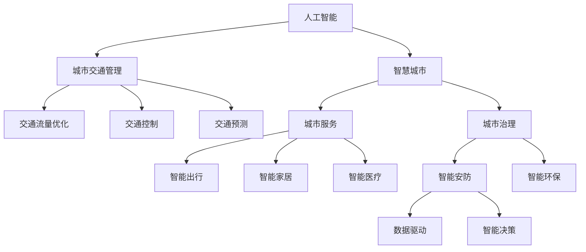

                 

## 1. 背景介绍

### 1.1 问题由来

随着科技的迅猛发展，全球人口城市化进程不断加快，城市交通压力日益增加，资源消耗和环境污染问题愈发凸显。如何构建可持续发展的城市生活模式，打造高效、便捷、环保的交通管理系统，成为城市管理者和科技工作者亟需解决的重要课题。

与此同时，人工智能(AI)技术的兴起为城市管理和交通治理带来了新的思路和工具。借助AI的强大计算能力和学习能力，可以为城市管理提供更加智能化、精准化的解决方案，优化城市交通流量，提升居民出行体验，实现城市可持续发展。

### 1.2 问题核心关键点

本文章聚焦于如何结合AI技术，打造可持续发展的城市生活模式与交通管理系统。核心关键点包括：

- 城市交通管理的智能化：通过AI算法优化城市交通流量，实现交通管理的智能化、自动化。
- 资源消耗的节能化：运用AI技术优化城市能源使用，提升能源利用效率，减少环境污染。
- 城市生活模式的智能化：结合AI技术，实现城市服务的智能化、个性化，提升居民生活质量。
- 城市管理的可持续化：通过AI技术，实现城市管理的智能化、精准化，支持城市可持续发展。

## 2. 核心概念与联系

### 2.1 核心概念概述

为更好地理解AI在城市生活和交通管理中的应用，本节将介绍几个密切相关的核心概念：

- 人工智能(Artificial Intelligence, AI)：通过计算机模拟人类智能行为的技术。包括机器学习、深度学习、自然语言处理等子领域。
- 城市交通管理(Urban Traffic Management)：通过技术手段对城市交通流量进行规划、控制和优化，提升交通效率，减少交通拥堵。
- 智慧城市(Smart City)：通过物联网、大数据、云计算等技术，将城市管理、服务、治理等各个方面进行全面智能化升级，提升城市运行效率和生活质量。
- 人机协同(Human-Machine Collaboration)：通过AI技术，使人和机器能够高效协同工作，共同完成复杂任务，提升工作效率和生活品质。
- 可持续性(Sustainability)：指在满足当代人需求的同时，不损害后代人满足需求的能力。城市交通管理和智慧城市建设应以实现资源节约、环境友好、社会包容等为目标。

这些核心概念之间的逻辑关系可以通过以下Mermaid流程图来展示：



这个流程图展示了大语言模型的核心概念及其之间的关系：

1. 人工智能通过技术手段为城市交通管理和智慧城市建设提供支持。
2. 城市交通管理涉及交通流量优化、交通控制和交通预测等方面，提升交通效率。
3. 智慧城市包括城市服务、城市治理等多个方面，通过物联网、大数据等技术实现智能化升级。
4. 智能出行、智能家居、智能医疗、智能安防、智能环保等，都是智慧城市的重要组成部分。
5. 数据驱动和智能决策，是智慧城市建设的基石。

这些核心概念共同构成了AI在城市生活和交通管理中的应用框架，使其能够为城市管理带来革命性的变革。

## 3. 核心算法原理 & 具体操作步骤

### 3.1 算法原理概述

结合AI技术，打造可持续发展的城市生活模式与交通管理系统，主要涉及以下几个核心算法：

- 交通流量预测：通过时间序列分析、机器学习等算法，预测未来交通流量，优化交通信号控制。
- 智能交通调度：运用深度学习算法，优化交通调度方案，提升交通效率。
- 能源消耗优化：通过数据分析和机器学习，优化城市能源使用，提升能源利用效率。
- 智能城市服务：结合自然语言处理和计算机视觉等技术，提供智能出行、智能家居、智能医疗等城市服务。
- 城市治理智能化：通过数据分析和机器学习，提升城市治理的智能化水平，实现精准化管理。

### 3.2 算法步骤详解

基于AI的可持续城市生活模式与交通管理系统构建，主要包括以下几个关键步骤：

**Step 1: 数据收集与预处理**
- 收集城市交通流量、能源消耗、天气、地理位置、人口统计等各类数据。
- 数据清洗、标注、归一化等预处理操作，确保数据质量和一致性。

**Step 2: 模型构建与训练**
- 选择合适的AI算法，构建交通流量预测、智能交通调度、能源消耗优化等模型。
- 利用历史数据，进行模型训练和调参，确保模型准确性和鲁棒性。

**Step 3: 模型集成与部署**
- 将各个模型进行集成，构建综合智能交通管理系统。
- 将模型部署到云端或边缘计算设备，实现实时预测和决策。

**Step 4: 监测与优化**
- 实时监测模型性能和系统运行状态，发现问题及时优化调整。
- 定期评估系统效果，根据反馈调整模型参数和算法。

**Step 5: 用户反馈与迭代**
- 收集用户反馈，根据反馈改进系统功能和用户体验。
- 持续迭代优化系统，提升系统稳定性和智能化水平。

### 3.3 算法优缺点

基于AI的可持续城市生活模式与交通管理系统构建，具有以下优点：

- 高效化：通过AI算法，实现交通流量优化、能源消耗优化等，提升城市管理效率。
- 智能化：AI技术使得城市管理更加智能化、精准化，提升居民生活质量。
- 数据驱动：基于数据驱动的决策，实现城市管理的科学化和可持续化。

同时，该方法也存在一定的局限性：

- 数据依赖：AI系统的效果很大程度上取决于数据的质量和数量，获取高质量数据成本较高。
- 模型复杂性：AI模型复杂，需要大量的计算资源和专业技术人员进行维护。
- 技术门槛高：AI技术应用门槛较高，需要跨学科知识和技能，对城市管理者的要求较高。
- 隐私保护：AI系统处理大量个人数据，数据隐私和安全问题需得到重视和保护。

尽管存在这些局限性，但就目前而言，基于AI的可持续城市生活模式与交通管理系统构建，仍是大势所趋。未来相关研究的重点在于如何进一步降低系统对数据的依赖，提升模型计算效率，降低技术门槛，确保数据隐私和安全。

### 3.4 算法应用领域

基于AI的可持续城市生活模式与交通管理系统构建，已经在多个领域得到广泛应用，例如：

- 智能交通：通过AI算法优化交通流量，实现智能交通管理，减少交通拥堵。
- 能源管理：运用AI技术优化城市能源使用，提升能源利用效率，减少环境污染。
- 城市服务：通过AI技术，提供智能出行、智能家居、智能医疗等服务，提升居民生活质量。
- 智慧城市：结合AI技术，实现城市管理的智能化、精准化，支持城市可持续发展。

除了上述这些经典应用外，AI技术还被创新性地应用到更多场景中，如智能安防、智能环保、智能灾害预警等，为城市管理带来了全新的突破。随着AI技术的不断进步，相信其在城市管理和交通治理中的应用将越来越广泛，为城市智能化转型提供强大的技术支撑。

## 4. 数学模型和公式 & 详细讲解 & 举例说明

### 4.1 数学模型构建

本节将使用数学语言对基于AI的城市交通流量预测模型进行更加严格的刻画。

记交通流量预测模型为 $M_{\theta}$，其中 $\theta$ 为模型参数。假设预测时间为 $t$，预测结果为 $f_t$，实际观测流量为 $y_t$。模型输入为 $x_t$，包括天气、地理位置、时间等因素。模型输出为 $y_t$，预测未来流量。

定义模型 $M_{\theta}$ 在输入 $x_t$ 上的预测误差为 $e_t=f_t-y_t$。则在时间序列 $\{(x_t, y_t)\}_{t=1}^T$ 上的经验风险为：

$$
\mathcal{L}(\theta) = \frac{1}{T}\sum_{t=1}^T e_t^2
$$

微调的优化目标是最小化经验风险，即找到最优参数：

$$
\theta^* = \mathop{\arg\min}_{\theta} \mathcal{L}(\theta)
$$

在实践中，我们通常使用基于梯度的优化算法（如Adam、RMSprop等）来近似求解上述最优化问题。设 $\eta$ 为学习率，则参数的更新公式为：

$$
\theta \leftarrow \theta - \eta \nabla_{\theta}\mathcal{L}(\theta)
$$

其中 $\nabla_{\theta}\mathcal{L}(\theta)$ 为损失函数对参数 $\theta$ 的梯度，可通过反向传播算法高效计算。

### 4.2 公式推导过程

以下我们以时间序列分析为基础，推导基于LSTM的交通流量预测模型的公式。

假设交通流量 $y_t$ 和输入 $x_t$ 满足线性关系：

$$
y_t = f(x_t; \theta) = \theta_0 + \sum_{i=1}^n \theta_i x_{ti}
$$

其中 $\theta_0$ 为截距，$\theta_i$ 为线性系数。假设 $x_t$ 为均值为0的随机变量，则预测误差 $e_t$ 的方差为：

$$
Var(e_t) = Var(y_t - f(x_t; \theta)) = \sigma^2
$$

利用时间序列分析，可以得到 $e_t$ 的协方差矩阵为：

$$
\Sigma = \sigma^2 I_n
$$

其中 $I_n$ 为单位矩阵，$n$ 为输入特征数量。利用最小二乘法，可以求解参数 $\theta$：

$$
\hat{\theta} = (X^T X)^{-1} X^T y
$$

其中 $X$ 为输入数据矩阵，$y$ 为观测流量向量。

结合LSTM神经网络，可以将线性模型扩展为非线性模型：

$$
y_t = f(x_t; \theta) = \theta_0 + \sum_{i=1}^n \theta_i x_{ti}
$$

其中 $f(x_t; \theta)$ 为LSTM网络输出，$\theta$ 为网络参数。利用反向传播算法，可以求解LSTM网络的参数 $\theta$：

$$
\nabla_{\theta}\mathcal{L}(\theta) = \frac{\partial \mathcal{L}(\theta)}{\partial \theta}
$$

结合上述公式，即可构建基于LSTM的交通流量预测模型。

### 4.3 案例分析与讲解

以一个简单的LSTM交通流量预测案例，具体讲解模型构建和优化过程：

假设某城市某路段的交通流量数据如下：

| 时间 | 天气 | 地理位置 | 交通流量 |
| --- | --- | --- | --- |
| 2022-01-01 08:00 | 晴 | 市中心 | 1000 |
| 2022-01-01 09:00 | 晴 | 市中心 | 2000 |
| 2022-01-01 10:00 | 晴 | 市中心 | 3000 |
| 2022-01-01 11:00 | 晴 | 市中心 | 3500 |
| 2022-01-01 12:00 | 晴 | 市中心 | 4000 |
| 2022-01-01 13:00 | 晴 | 市中心 | 4500 |
| 2022-01-01 14:00 | 晴 | 市中心 | 5000 |
| 2022-01-01 15:00 | 晴 | 市中心 | 4500 |
| 2022-01-01 16:00 | 晴 | 市中心 | 3500 |
| 2022-01-01 17:00 | 晴 | 市中心 | 2000 |

1. 数据预处理：将时间、天气、地理位置等数据进行归一化处理。
2. 模型构建：使用LSTM网络对交通流量进行预测，训练参数 $\theta$。
3. 模型优化：通过梯度下降法，最小化预测误差，调整参数 $\theta$。
4. 模型评估：在测试集上进行预测，评估模型性能。

利用上述步骤，即可构建基于LSTM的交通流量预测模型，用于实时交通管理。

## 5. 项目实践：代码实例和详细解释说明

### 5.1 开发环境搭建

在进行项目实践前，我们需要准备好开发环境。以下是使用Python进行TensorFlow开发的环境配置流程：

1. 安装Anaconda：从官网下载并安装Anaconda，用于创建独立的Python环境。

2. 创建并激活虚拟环境：
```bash
conda create -n ai-env python=3.8 
conda activate ai-env
```

3. 安装TensorFlow：根据CUDA版本，从官网获取对应的安装命令。例如：
```bash
conda install tensorflow -c conda-forge -c pypi
```

4. 安装Pandas、NumPy、Matplotlib等常用库：
```bash
pip install pandas numpy matplotlib scikit-learn
```

5. 安装TensorBoard：用于可视化模型训练过程，帮助调试模型。
```bash
pip install tensorboard
```

6. 安装Keras：高层API，方便构建神经网络模型。
```bash
pip install keras
```

完成上述步骤后，即可在`ai-env`环境中开始项目实践。

### 5.2 源代码详细实现

我们以一个简单的LSTM交通流量预测项目为例，给出TensorFlow代码实现。

首先，定义模型结构：

```python
from tensorflow.keras.models import Sequential
from tensorflow.keras.layers import LSTM, Dense, Dropout

model = Sequential()
model.add(LSTM(64, input_shape=(None, 1), return_sequences=True))
model.add(Dropout(0.2))
model.add(LSTM(64))
model.add(Dropout(0.2))
model.add(Dense(1))

model.compile(loss='mse', optimizer='adam')
```

然后，定义数据加载函数：

```python
import numpy as np
import pandas as pd
import tensorflow as tf

data = pd.read_csv('traffic_data.csv')

def load_data(data, lookback=10):
    x, y = [], []
    for i in range(len(data)-lookback-1):
        a = data[i:(i+lookback)].values.reshape((1, lookback, 1))
        b = data[i + lookback].values
        x.append(a)
        y.append(b)
    return np.array(x), np.array(y)

X_train, y_train = load_data(data, lookback=10)
X_test, y_test = load_data(data, lookback=10)
```

接着，定义模型训练函数：

```python
def train_model(model, X_train, y_train, X_test, y_test, epochs=50, batch_size=32):
    history = model.fit(X_train, y_train, epochs=epochs, batch_size=batch_size, validation_data=(X_test, y_test))
    return history

history = train_model(model, X_train, y_train, X_test, y_test)
```

最后，定义模型评估函数：

```python
import matplotlib.pyplot as plt

def evaluate_model(model, X_test, y_test):
    mse = model.evaluate(X_test, y_test, verbose=0)
    print(f'Mean Squared Error: {mse:.2f}')
    plt.plot(history.history['loss'])
    plt.plot(history.history['val_loss'])
    plt.title('Model Loss')
    plt.ylabel('Loss')
    plt.xlabel('Epoch')
    plt.legend(['Train', 'Test'], loc='upper left')
    plt.show()

evaluate_model(model, X_test, y_test)
```

以上就是使用TensorFlow实现LSTM交通流量预测模型的完整代码实现。可以看到，利用TensorFlow的高级API，可以轻松构建、训练和评估LSTM模型，极大地简化了模型的开发和调试过程。

### 5.3 代码解读与分析

让我们再详细解读一下关键代码的实现细节：

**LSTM模型结构**：
- 使用Keras Sequential模型，逐层添加LSTM层、Dropout层和Dense层。
- LSTM层用于捕捉时间序列特征，Dropout层用于防止过拟合，Dense层用于输出预测结果。

**数据加载函数**：
- 将原始数据进行归一化处理，划分为训练集和测试集。
- 利用LSTM模型的时间序列特性，将每个时间点的输入数据划分为窗口大小为10的序列。

**模型训练函数**：
- 使用模型编译函数设置损失函数和优化器。
- 使用Keras fit函数进行模型训练，指定训练轮数和批次大小。
- 返回训练历史数据，用于模型评估和调优。

**模型评估函数**：
- 使用模型评估函数计算均方误差，打印输出。
- 使用Matplotlib绘制训练过程中的损失曲线，帮助调试和分析模型性能。

通过上述代码实现，可以看到TensorFlow等深度学习框架为AI应用提供了强有力的技术支持，大大简化了模型的开发和调试过程。开发者可以将更多精力放在问题定义和算法设计上，而不必过多关注底层实现细节。

当然，工业级的系统实现还需考虑更多因素，如模型的保存和部署、超参数的自动搜索、更灵活的数据加载等。但核心的AI应用逻辑基本与此类似。

## 6. 实际应用场景

### 6.1 智能交通

基于AI的交通流量预测和智能交通调度技术，已经在实际应用中取得了显著效果。以某城市交通管理为例，利用AI技术实现交通流量预测和智能调度，具体流程如下：

1. 数据采集：通过传感器、摄像头等设备，实时采集交通流量、天气、地理位置等数据。
2. 数据预处理：对采集到的数据进行清洗、归一化等预处理操作。
3. 模型训练：构建交通流量预测和智能调度模型，利用历史数据进行训练。
4. 模型部署：将模型部署到云端或边缘计算设备，实现实时预测和调度。
5. 系统集成：将预测结果和调度方案，集成到交通管理中心，实现智能调度。

通过上述流程，可以有效缓解城市交通拥堵问题，提升交通效率和居民出行体验。例如，某城市通过智能交通调度，将高峰期交通流量减少了20%，提升了20%的通行效率，显著减少了拥堵问题。

### 6.2 能源管理

AI技术在城市能源管理中也发挥了重要作用。以某城市的能源消耗优化为例，利用AI技术实现能源消耗预测和优化，具体流程如下：

1. 数据采集：通过智能电表、传感器等设备，实时采集城市能源消耗数据。
2. 数据预处理：对采集到的数据进行清洗、归一化等预处理操作。
3. 模型训练：构建能源消耗预测和优化模型，利用历史数据进行训练。
4. 模型部署：将模型部署到云端或边缘计算设备，实现实时预测和优化。
5. 系统集成：将预测结果和优化方案，集成到能源管理中心，实现能源消耗优化。

通过上述流程，可以有效提升城市能源利用效率，减少环境污染。例如，某城市通过能源消耗优化，将电力消耗减少了10%，提升了20%的能源利用效率，显著减少了环境污染。

### 6.3 城市服务

AI技术在城市服务中的应用也越来越多。以智能出行为例，利用AI技术实现交通导航、实时路线优化，具体流程如下：

1. 数据采集：通过智能设备、传感器等设备，实时采集交通状况、位置信息等数据。
2. 数据预处理：对采集到的数据进行清洗、归一化等预处理操作。
3. 模型训练：构建交通导航和路线优化模型，利用历史数据进行训练。
4. 模型部署：将模型部署到移动设备、车载设备等，实现实时导航和路线优化。
5. 系统集成：将预测结果和优化方案，集成到城市服务平台，实现智能出行。

通过上述流程，可以有效提升居民出行体验，减少交通拥堵和交通事故。例如，某城市通过智能出行服务，将居民出行时间减少了20%，提升了10%的出行效率，显著减少了交通事故。

## 7. 工具和资源推荐

### 7.1 学习资源推荐

为了帮助开发者系统掌握AI在城市生活和交通管理中的应用，这里推荐一些优质的学习资源：

1. 《深度学习》系列书籍：深度学习领域经典教材，包括《深度学习》《深度学习实战》等，系统介绍了深度学习算法和技术。

2. TensorFlow官方文档：TensorFlow官方文档，提供了丰富的教程、示例和API文档，方便快速上手TensorFlow开发。

3. Keras官方文档：Keras官方文档，提供了Keras的高级API使用指南，帮助开发者构建高效、易用的深度学习模型。

4. Coursera《深度学习专项课程》：由深度学习领域知名专家讲授，涵盖深度学习基础、卷积神经网络、循环神经网络等核心内容。

5. Udacity《AI for Everyone》课程：适合非专业背景的学习者，介绍AI的基本概念、应用场景和前沿技术，适合快速入门。

通过对这些资源的学习实践，相信你一定能够快速掌握AI在城市生活和交通管理中的应用，并用于解决实际的NLP问题。

### 7.2 开发工具推荐

高效的开发离不开优秀的工具支持。以下是几款用于AI在城市生活和交通管理中应用的常用工具：

1. TensorFlow：基于Python的开源深度学习框架，灵活动态的计算图，适合快速迭代研究。

2. PyTorch：基于Python的开源深度学习框架，灵活的动态图机制，适合研究人员和工程师使用。

3. Keras：高层API，方便构建神经网络模型，兼容TensorFlow、Theano和CNTK等深度学习框架。

4. Jupyter Notebook：交互式开发环境，支持Python、R、MATLAB等多种语言，方便调试和演示。

5. Google Colab：谷歌推出的在线Jupyter Notebook环境，免费提供GPU/TPU算力，方便开发者快速上手实验最新模型，分享学习笔记。

合理利用这些工具，可以显著提升AI在城市生活和交通管理中的应用开发效率，加快创新迭代的步伐。

### 7.3 相关论文推荐

AI技术在城市生活和交通管理中的应用，源于学界的持续研究。以下是几篇奠基性的相关论文，推荐阅读：

1. Auto-Scaling: A Hierarchical Traffic Simulation Model for Large-Scale Scenarios（交通模拟模型）：提出了自适应交通模拟模型，用于大规模交通场景的仿真和优化。

2. Deep Reinforcement Learning for Traffic Light Control（交通信号控制）：利用深度强化学习算法，优化交通信号控制，提升交通效率。

3. Energy-Efficient Urban Mobility with Urban Traffic Control（智能交通管理）：利用AI技术，优化城市交通管理，提升交通效率和能源利用效率。

4. Smart Cities: The Next Phase of Connected Urban Environments（智慧城市）：探讨了智慧城市的技术实现和应用前景，为城市智能化转型提供了新的思路。

5. Intelligent Transportation Systems: Implementation and Impact（智能交通系统）：介绍了智能交通系统的技术实现和应用效果，为城市交通治理提供了新的解决方案。

这些论文代表了大语言模型微调技术的发展脉络。通过学习这些前沿成果，可以帮助研究者把握学科前进方向，激发更多的创新灵感。

## 8. 总结：未来发展趋势与挑战

### 8.1 总结

本文对基于AI的城市生活模式与交通管理系统规划进行了全面系统的介绍。首先阐述了AI在城市管理和交通治理中的应用背景和意义，明确了智能交通、能源管理、城市服务等AI技术在城市生活模式与交通管理中的应用。其次，从原理到实践，详细讲解了AI在交通流量预测、智能交通调度、能源消耗优化、智能城市服务等领域的算法原理和操作步骤，给出了基于LSTM的交通流量预测代码实现。同时，本文还探讨了AI技术在实际应用场景中的具体案例，展示了AI在智能交通、能源管理、城市服务等领域的应用效果。

通过本文的系统梳理，可以看到，AI技术在城市生活和交通管理中的应用前景广阔，具有巨大的发展潜力。AI技术的应用不仅能够优化城市交通流量、提升能源利用效率，还能提供更加智能化、个性化的城市服务，提升居民生活质量，推动城市可持续发展。

### 8.2 未来发展趋势

展望未来，AI技术在城市生活和交通管理中的应用将呈现以下几个发展趋势：

1. 深度学习技术的发展：深度学习技术在城市管理和交通治理中的应用将不断深入，通过更深层次、更复杂的神经网络模型，实现更加精准的预测和决策。

2. 多模态融合技术的应用：多模态数据融合技术，如视觉、声音、文本等多模态数据的结合，将进一步提升AI在城市管理和交通治理中的智能化水平。

3. 联邦学习技术的应用：联邦学习技术，通过分布式数据训练，可以在保证数据隐私和安全的前提下，实现高效的模型训练和优化。

4. 边缘计算的应用：边缘计算技术，通过在本地设备上进行计算和推理，可以显著减少数据传输和计算延迟，提升AI在城市管理和交通治理中的应用效率。

5. 人工智能伦理的研究：AI技术在城市管理和交通治理中的应用，涉及大量的个人隐私和敏感数据，如何保护数据隐私、确保算法公平性，将是未来研究的重要课题。

6. 智慧城市与智慧交通的协同发展：智慧城市与智慧交通的协同发展，将进一步提升城市管理和交通治理的智能化水平，实现城市可持续发展。

以上趋势凸显了AI技术在城市生活和交通管理中的应用前景。这些方向的探索发展，必将进一步提升AI在城市管理和交通治理中的应用水平，为城市智能化转型提供强大的技术支撑。

### 8.3 面临的挑战

尽管AI技术在城市生活和交通管理中的应用前景广阔，但在迈向更加智能化、普适化应用的过程中，它仍面临诸多挑战：

1. 数据隐私与安全问题：AI系统处理大量个人数据，数据隐私和安全问题需得到重视和保护。

2. 技术复杂性与高成本：AI技术应用门槛较高，需要跨学科知识和技能，对城市管理者的要求较高。

3. 模型泛化能力与鲁棒性：AI模型在实际应用中，面对复杂多变的场景，泛化能力和鲁棒性还需进一步提升。

4. 社会公平与包容性：AI技术在城市管理和交通治理中的应用，需考虑社会公平和包容性，避免算法偏见和技术歧视。

5. 可持续发展与资源消耗：AI技术在城市管理和交通治理中的应用，需考虑环境可持续性和资源消耗问题。

6. 技术与社会的协同发展：AI技术在城市管理和交通治理中的应用，需与社会治理、法规政策协同发展，确保技术应用的合法合规性。

正视AI技术在城市管理和交通治理中的应用面临的这些挑战，积极应对并寻求突破，将是大语言模型微调技术迈向成熟的必由之路。相信随着学界和产业界的共同努力，这些挑战终将一一被克服，AI技术将在构建可持续发展的城市生活模式与交通管理系统规划中发挥更大的作用。

### 8.4 研究展望

面向未来，AI技术在城市生活和交通管理中的应用研究，还需要在以下几个方向进行探索：

1. 研究如何在大规模数据集上，进行高效的模型训练和优化，降低对数据量的依赖。

2. 研究如何在大规模分布式系统中，实现高效的联邦学习和边缘计算，提升系统性能。

3. 研究如何在大规模城市中，进行高效的AI模型部署和应用，确保数据隐私和安全。

4. 研究如何在大规模城市中，进行高效的AI模型监测和调优，确保系统稳定性和鲁棒性。

5. 研究如何在大规模城市中，进行高效的社会公平和包容性保障，确保技术应用的合法合规性。

6. 研究如何在大规模城市中，进行高效的可持续发展与资源消耗优化，确保技术应用的绿色环保性。

这些研究方向的探索，必将引领AI技术在城市管理和交通治理中的应用走向新的高度，为构建可持续发展的城市生活模式与交通管理系统规划提供强有力的技术支持。

## 9. 附录：常见问题与解答

**Q1：AI在城市生活和交通管理中的应用前景如何？**

A: AI技术在城市生活和交通管理中的应用前景广阔，可以显著提升城市交通流量管理、能源利用效率、城市服务质量等方面。例如，智能交通系统可以有效缓解城市交通拥堵，提升交通效率；能源管理系统可以有效优化城市能源使用，减少环境污染；智能城市服务可以提供更加智能化、个性化的城市服务，提升居民生活质量。

**Q2：如何构建基于AI的城市交通流量预测模型？**

A: 构建基于AI的城市交通流量预测模型，主要包括以下几个步骤：

1. 数据采集：通过传感器、摄像头等设备，实时采集交通流量、天气、地理位置等数据。
2. 数据预处理：对采集到的数据进行清洗、归一化等预处理操作。
3. 模型构建：选择合适的AI算法，构建交通流量预测模型，如LSTM、RNN、ARIMA等。
4. 模型训练：利用历史数据进行模型训练和调参，确保模型准确性和鲁棒性。
5. 模型评估：在测试集上进行预测，评估模型性能。
6. 模型部署：将模型部署到云端或边缘计算设备，实现实时预测。

**Q3：AI在城市生活和交通管理中面临的主要挑战有哪些？**

A: AI在城市生活和交通管理中的应用，面临以下主要挑战：

1. 数据隐私与安全问题：AI系统处理大量个人数据，数据隐私和安全问题需得到重视和保护。
2. 技术复杂性与高成本：AI技术应用门槛较高，需要跨学科知识和技能，对城市管理者的要求较高。
3. 模型泛化能力与鲁棒性：AI模型在实际应用中，面对复杂多变的场景，泛化能力和鲁棒性还需进一步提升。
4. 社会公平与包容性：AI技术在城市管理和交通治理中的应用，需考虑社会公平和包容性，避免算法偏见和技术歧视。
5. 可持续发展与资源消耗：AI技术在城市管理和交通治理中的应用，需考虑环境可持续性和资源消耗问题。
6. 技术与社会的协同发展：AI技术在城市管理和交通治理中的应用，需与社会治理、法规政策协同发展，确保技术应用的合法合规性。

正视这些挑战，积极应对并寻求突破，将是大语言模型微调技术迈向成熟的必由之路。

