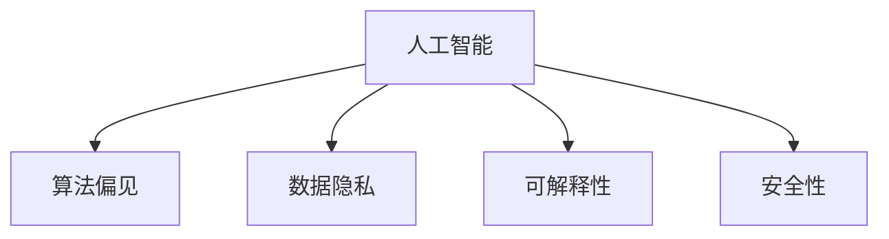

                 

# AI伦理：在开发过程中的重要考量

在AI技术的飞速发展过程中，伦理问题逐渐成为不可忽视的重要考量。随着AI系统在各行各业的应用日益广泛，如何确保其决策的公正性、透明性和安全性，成为科技界和公众共同关注的焦点。本文将探讨AI伦理在开发过程中的关键考量，为AI技术的健康发展提供理论基础和实践指导。

## 1. 背景介绍

### 1.1 问题由来

随着AI技术的不断进步，其应用场景从传统的计算机视觉、语音识别等领域扩展到医疗、金融、司法等高风险行业。AI系统在提升效率、降低成本的同时，也可能带来不平等、偏见、误导等问题，从而对社会产生深远影响。例如，人脸识别技术的误判可能导致无辜者被错误识别，医疗AI系统的错误决策可能危及患者生命。这些伦理问题逐渐成为社会广泛关注的热点。

### 1.2 问题核心关键点

AI伦理的核心关键点包括：
- 决策公正性：AI系统是否对所有群体公平对待，不产生歧视。
- 数据隐私：如何保护用户隐私，防止数据滥用。
- 透明性：AI系统是否能够解释其决策过程，让用户理解其工作原理。
- 安全性：AI系统是否能够避免攻击和滥用，确保系统稳定和安全。
- 责任归属：当AI系统出现错误或不当行为时，谁应承担责任。

## 2. 核心概念与联系

### 2.1 核心概念概述

为了更好地理解AI伦理问题，本节将介绍几个密切相关的核心概念：

- 人工智能(Artificial Intelligence, AI)：指能够模拟人类智能行为的技术体系，包括感知、学习、推理、决策等能力。
- 算法偏见(Bias in Algorithms)：指算法在设计和实现过程中，因数据不均衡、模型偏差等因素导致的不公平决策。
- 数据隐私(Portecting Privacy)：指保护用户数据的机密性、完整性和可用性，防止未经授权的访问和使用。
- 可解释性(Explainability)：指AI系统能够清晰、合理地解释其决策过程，使得用户能够理解和信任其输出结果。
- 安全性(Security)：指AI系统能够抵御各种攻击和滥用，确保系统自身的安全性和稳定性。

这些概念之间的逻辑关系可以通过以下Mermaid流程图来展示：



这个流程图展示出AI伦理的核心概念及其相互关系：

- AI系统基于算法、数据和模型进行决策。
- 算法偏见可能存在于AI决策中，导致不公正的决策。
- 数据隐私问题影响AI系统的可信度和用户信任。
- 可解释性是AI系统可信度和透明度的关键因素。
- 安全性是AI系统稳定运行的前提条件。

## 3. 核心算法原理 & 具体操作步骤

### 3.1 算法原理概述

AI伦理问题并非技术问题，而更多关乎社会、法律和道德的考量。然而，在AI系统的开发和应用过程中，算法和数据的使用无疑会对伦理产生深远影响。以下是AI伦理开发过程中需要考虑的几个关键点：

1. 数据收集和处理：确保数据的代表性和多样性，防止数据偏差。
2. 算法设计：避免算法设计中的偏见和歧视，实现公正决策。
3. 可解释性：通过模型解释技术，提高AI系统的透明性和可信度。
4. 隐私保护：采取技术手段保护用户隐私，防止数据滥用。
5. 安全性：建立安全机制，防止攻击和滥用，确保系统稳定。

### 3.2 算法步骤详解

AI伦理的开发和应用可以分为以下几个步骤：

**Step 1: 数据收集与处理**

- 确保数据的多样性和代表性，防止数据偏差。
- 清洗数据，处理缺失值和异常值，提高数据质量。
- 匿名化处理，防止个人信息泄露。
- 数据去标识化，保护用户隐私。

**Step 2: 算法设计**

- 避免算法中的偏见和歧视，确保算法公平。
- 使用公平性评估指标，如 demographic parity、equalized odds等。
- 进行算法解释和可解释性研究，确保决策过程透明。

**Step 3: 隐私保护**

- 采取差分隐私技术，确保数据匿名化。
- 使用加密技术，保护数据传输和存储安全。
- 进行隐私影响评估，识别和降低隐私风险。

**Step 4: 安全性设计**

- 采用安全编码实践，防止漏洞和安全攻击。
- 使用安全框架和工具，如TensorFlow-Secure、ONNX-IR等。
- 进行安全审计和测试，发现和修复安全漏洞。

**Step 5: 可解释性和透明性**

- 使用可解释模型，如线性模型、决策树等。
- 开发可解释性工具，如LIME、SHAP等。
- 进行可解释性测试和评估，确保系统透明性和可信度。

### 3.3 算法优缺点

AI伦理开发的主要优点包括：
1. 促进公平和公正：通过设计和实施公正算法，减少数据和算法偏见，提高决策的公平性。
2. 增强用户信任：通过透明性和可解释性，使用户理解并信任AI系统。
3. 保护隐私和安全：通过隐私保护和安全性设计，确保数据和系统的安全。

同时，也存在一定的局限性：
1. 技术复杂性：伦理问题涉及多学科知识，增加了开发复杂性。
2. 资源消耗：隐私保护和安全设计需要额外的计算和存储资源。
3. 法律和标准缺失：现有法律法规和标准尚未完全覆盖AI伦理问题，存在法律和标准不确定性。

## 4. 数学模型和公式 & 详细讲解 & 举例说明

### 4.1 数学模型构建

AI伦理问题的数学模型构建主要关注于如何评估和改进算法偏见、数据隐私和可解释性。以下是几个常见的数学模型：

- 算法偏见评估模型：使用统计学方法评估算法中的偏差，如t-test、ANOVA等。
- 数据隐私模型：采用差分隐私技术，通过添加噪声保护用户隐私，数学模型为$\epsilon$-差分隐私。
- 可解释性模型：通过特征重要性评估和模型解释技术，帮助理解模型决策过程，如SHAP值、LIME模型等。

### 4.2 公式推导过程

以差分隐私为例，推导其核心公式。

假设有一个数据集$D$，包含$n$条记录。每次查询时，从$D$中随机抽样一条记录$r$，并对其加入噪声$\epsilon$，然后返回结果。差分隐私的核心公式为：

$$
\mathbb{P}[D'] = \frac{1}{n}\sum_{r \in D} \mathbb{P}[\text{抽样} r \in D']
$$

其中$D'$表示查询结果，$\mathbb{P}$表示概率。差分隐私保证每次查询的结果分布与原始数据分布的$L_2$距离不超过$\epsilon$。

### 4.3 案例分析与讲解

假设有一个医疗AI系统，用于辅助医生进行疾病诊断。该系统的输入数据包括患者的症状描述和历史病例，输出为疾病诊断结果。为了确保系统的公平性和可信度，需要采取以下措施：

1. 数据收集和处理：确保数据的代表性和多样性，清洗数据，处理缺失值和异常值，确保数据质量。
2. 算法设计：使用公平性评估指标，如均衡性、相反性等，确保算法不产生偏见。
3. 隐私保护：采用差分隐私技术，保护患者隐私。
4. 安全性设计：使用安全框架和工具，防止攻击和滥用。
5. 可解释性：开发可解释性工具，帮助医生理解系统的决策过程。

## 5. 项目实践：代码实例和详细解释说明

### 5.1 开发环境搭建

在进行AI伦理开发和应用实践前，需要准备好开发环境。以下是使用Python进行开发的环境配置流程：

1. 安装Anaconda：从官网下载并安装Anaconda，用于创建独立的Python环境。

2. 创建并激活虚拟环境：
```bash
conda create -n ai-env python=3.8 
conda activate ai-env
```

3. 安装必要的库：
```bash
pip install numpy pandas scikit-learn torch transformers torchvision
```

4. 安装隐私保护和安全工具：
```bash
pip install fougere cryptography
```

完成上述步骤后，即可在`ai-env`环境中进行AI伦理开发实践。

### 5.2 源代码详细实现

以下是一个基于差分隐私技术的医疗AI系统的代码实现：

```python
import numpy as np
from cryptography.fernet import Fernet

# 生成密钥
key = Fernet.generate_key()
cipher_suite = Fernet(key)

# 加密函数
def encrypt(data):
    cipher_text = cipher_suite.encrypt(data)
    return cipher_text

# 解密函数
def decrypt(cipher_text):
    plain_text = cipher_suite.decrypt(cipher_text)
    return plain_text

# 生成随机噪声
def generate_noise(data, epsilon):
    noise = np.random.normal(0, epsilon, len(data))
    return noise

# 差分隐私查询函数
def differential_privacy_query(data, epsilon):
    ciphered_data = encrypt(data)
    ciphered_result = encrypt(np.random.normal(0, epsilon, len(data)))
    result = decrypt(ciphered_result) + ciphered_data
    return result

# 数据生成函数
def generate_data():
    data = np.array([1, 2, 3, 4, 5, 6, 7, 8, 9, 10])
    return data

# 示例代码
data = generate_data()
result = differential_privacy_query(data, 0.5)
print(result)
```

### 5.3 代码解读与分析

让我们再详细解读一下关键代码的实现细节：

**生成密钥**：使用`Fernet`库生成加密密钥，用于后续数据加密和解密。

**加密和解密函数**：定义`encrypt`和`decrypt`函数，分别用于加密和解密数据。

**生成随机噪声**：定义`generate_noise`函数，生成符合差分隐私要求的随机噪声，添加到原始数据中。

**差分隐私查询函数**：定义`differential_privacy_query`函数，使用加密和噪声生成技术，实现差分隐私查询。

**数据生成函数**：定义`generate_data`函数，生成示例数据，供后续差分隐私查询使用。

**示例代码**：使用`generate_data`函数生成数据，调用`differential_privacy_query`函数进行差分隐私查询，输出结果。

## 6. 实际应用场景

### 6.1 医疗健康

医疗AI系统在提升诊断准确性和效率的同时，也面临诸多伦理问题。以下是几个实际应用场景：

1. 疾病诊断：医疗AI系统在诊断中需要处理大量患者数据，涉及个人隐私。为保护患者隐私，可以采用差分隐私技术，确保数据匿名化。

2. 药物研发：AI系统在药物研发中，需要处理临床试验数据。为保护患者隐私，可以采用安全计算和差分隐私技术，确保数据安全。

3. 健康监测：智能穿戴设备收集用户健康数据，需要进行隐私保护和安全性设计，防止数据滥用和攻击。

### 6.2 金融风险管理

金融AI系统在风险管理中需要处理大量交易数据，涉及敏感信息。以下是几个实际应用场景：

1. 信用评分：金融AI系统在评估信用时，需要处理大量个人信息。为保护用户隐私，可以采用差分隐私技术，确保数据匿名化。

2. 欺诈检测：AI系统在检测欺诈时，需要处理大量交易数据。为保护数据安全，可以采用安全计算和加密技术，防止数据泄露。

3. 投资决策：AI系统在投资决策中，需要处理大量市场数据。为保护数据安全，可以采用安全计算和差分隐私技术，确保数据安全。

### 6.3 智能制造

智能制造系统在提升生产效率和产品质量的同时，也面临诸多伦理问题。以下是几个实际应用场景：

1. 设备维护：AI系统在预测设备故障时，需要处理大量传感器数据。为保护数据安全，可以采用差分隐私技术，确保数据匿名化。

2. 质量检测：AI系统在检测产品缺陷时，需要处理大量生产数据。为保护数据安全，可以采用安全计算和加密技术，防止数据泄露。

3. 供应链管理：AI系统在优化供应链时，需要处理大量交易数据。为保护数据安全，可以采用差分隐私技术，确保数据匿名化。

### 6.4 未来应用展望

随着AI技术的不断演进，AI伦理问题将更加复杂和多样。未来，AI伦理将在以下几个方向得到进一步发展：

1. 跨学科研究：AI伦理问题涉及多学科知识，未来的研究需要跨学科协作，综合考虑技术、法律和伦理等多个方面。

2. 法律法规完善：随着AI技术的广泛应用，法律法规需要不断完善，确保AI伦理问题得到有效解决。

3. 技术手段创新：差分隐私、安全计算等技术手段将继续创新发展，为AI伦理问题提供更多的解决方案。

4. 公众参与和教育：提高公众对AI伦理问题的认知和理解，加强AI伦理教育，促进公众参与和监督。

## 7. 工具和资源推荐

### 7.1 学习资源推荐

为了帮助开发者系统掌握AI伦理问题的相关知识，这里推荐一些优质的学习资源：

1. 《人工智能伦理与治理》系列博文：由AI伦理专家撰写，深入浅出地介绍了AI伦理的核心概念和最新研究成果。

2. 《AI伦理与道德》课程：斯坦福大学开设的AI伦理课程，涵盖AI伦理的基本理论和前沿研究。

3. 《AI伦理与法律》书籍：系统介绍了AI伦理和法律之间的关系，以及如何应对AI伦理问题。

4. 《AI伦理与技术》系列视频：Google AI团队制作的AI伦理视频，介绍AI伦理的多个热点问题。

5. 《AI伦理与隐私保护》在线课程：由MIT等名校提供的在线课程，涵盖AI伦理和隐私保护的基本知识和实用技巧。

通过对这些资源的学习实践，相信你一定能够系统掌握AI伦理问题的理论和实践知识，并在开发过程中有效应用。

### 7.2 开发工具推荐

高效的工具能够显著提高开发效率，以下是几款用于AI伦理开发的工具：

1. Anaconda：创建和管理Python环境，确保开发环境的一致性和稳定性。

2. PyTorch：基于Python的深度学习框架，支持差分隐私、安全计算等技术，便于AI伦理问题的实现。

3. Fougere：Python加密库，支持多种加密算法，确保数据安全。

4. TensorFlow-Secure：基于TensorFlow的安全计算库，支持差分隐私和安全计算。

5. TensorBoard：可视化工具，监控和记录AI系统的运行状态，确保系统稳定。

合理利用这些工具，可以显著提升AI伦理问题的开发效率，加快创新迭代的步伐。

### 7.3 相关论文推荐

AI伦理问题的研究源于学界的持续探索，以下是几篇奠基性的相关论文，推荐阅读：

1. AI Bias Mitigation in Machine Learning：介绍机器学习中的偏见问题，提出多种缓解方法，如公平性评估、数据重采样等。

2. Differential Privacy in Machine Learning：介绍差分隐私技术，提出多种差分隐私算法，如Laplace机制、高斯机制等。

3. Explainable AI：介绍可解释AI技术，提出多种模型解释方法，如LIME、SHAP等。

4. Fairness and Accountability for AI：系统介绍AI公平性问题，提出多种公平性评估指标和缓解方法。

5. Secure Multi-Party Computation for AI：介绍安全多方计算技术，确保数据隐私和安全。

这些论文代表了大数据、隐私保护、可解释性等AI伦理问题的研究进展，帮助开发者理解和应用这些技术。

## 8. 总结：未来发展趋势与挑战

### 8.1 研究成果总结

AI伦理问题在过去几年中得到了广泛关注，取得了一些重要的研究成果。以下是对相关研究的主要总结：

1. 数据隐私：差分隐私技术得到了广泛应用，多个开源库和框架提供了差分隐私支持。

2. 算法公平性：公平性评估指标和缓解方法得到了广泛研究，多个开源库和框架提供了公平性支持。

3. 可解释性：多种可解释性方法得到了广泛研究，多个开源库和框架提供了可解释性支持。

4. 安全性：安全计算和加密技术得到了广泛研究，多个开源库和框架提供了安全性支持。

### 8.2 未来发展趋势

未来的AI伦理问题研究将呈现以下几个趋势：

1. 跨学科研究：AI伦理问题涉及多学科知识，未来的研究需要跨学科协作，综合考虑技术、法律和伦理等多个方面。

2. 法律法规完善：随着AI技术的广泛应用，法律法规需要不断完善，确保AI伦理问题得到有效解决。

3. 技术手段创新：差分隐私、安全计算等技术手段将继续创新发展，为AI伦理问题提供更多的解决方案。

4. 公众参与和教育：提高公众对AI伦理问题的认知和理解，加强AI伦理教育，促进公众参与和监督。

### 8.3 面临的挑战

尽管AI伦理问题已经得到了广泛关注，但在实践中仍面临诸多挑战：

1. 技术复杂性：AI伦理问题涉及多学科知识，增加了开发复杂性。

2. 资源消耗：隐私保护和安全设计需要额外的计算和存储资源。

3. 法律和标准缺失：现有法律法规和标准尚未完全覆盖AI伦理问题，存在法律和标准不确定性。

### 8.4 研究展望

面对AI伦理问题所面临的种种挑战，未来的研究需要在以下几个方面寻求新的突破：

1. 探索无监督和半监督伦理方法：摆脱对大量标注数据的依赖，利用自监督学习、主动学习等无监督和半监督范式，最大限度利用非结构化数据。

2. 研究伦理方法和工具的集成：将伦理方法和工具与AI系统进行深度集成，确保伦理问题在各个环节得到有效解决。

3. 加强跨学科合作：与伦理学、法律学、社会学等多学科专家合作，共同研究和解决AI伦理问题。

这些研究方向的探索，必将引领AI伦理问题研究迈向更高的台阶，为构建公平、可信、安全的AI系统铺平道路。

## 9. 附录：常见问题与解答

**Q1：如何评估AI系统的公平性？**

A: 评估AI系统的公平性通常使用公平性评估指标，如 demographic parity、equalized odds、false positive rate等。通过计算这些指标，可以评估模型在不同群体之间的公平性。

**Q2：如何保护用户数据隐私？**

A: 保护用户数据隐私通常使用差分隐私技术，通过添加噪声保护数据匿名化。具体的差分隐私算法包括Laplace机制、高斯机制、指数机制等。

**Q3：如何确保AI系统的安全性？**

A: 确保AI系统的安全性通常使用安全计算技术，防止攻击和滥用。具体的安全计算技术包括安全多方计算、差分隐私、加密技术等。

**Q4：如何提高AI系统的可解释性？**

A: 提高AI系统的可解释性通常使用可解释模型和可解释技术，如LIME、SHAP等。通过这些方法，可以清晰、合理地解释AI系统的决策过程。

**Q5：如何确保AI系统的稳定性和鲁棒性？**

A: 确保AI系统的稳定性和鲁棒性通常使用安全计算技术和测试工具，如安全计算框架TensorFlow-Secure、安全测试工具Fuzzing等。通过这些技术，可以发现和修复系统漏洞，提高系统的稳定性和鲁棒性。

总之，AI伦理问题在AI技术的开发和应用过程中起着至关重要的作用。只有从数据、算法、法律、伦理等多个维度全面考虑，才能构建出公平、透明、安全的AI系统，推动人工智能技术的健康发展。

