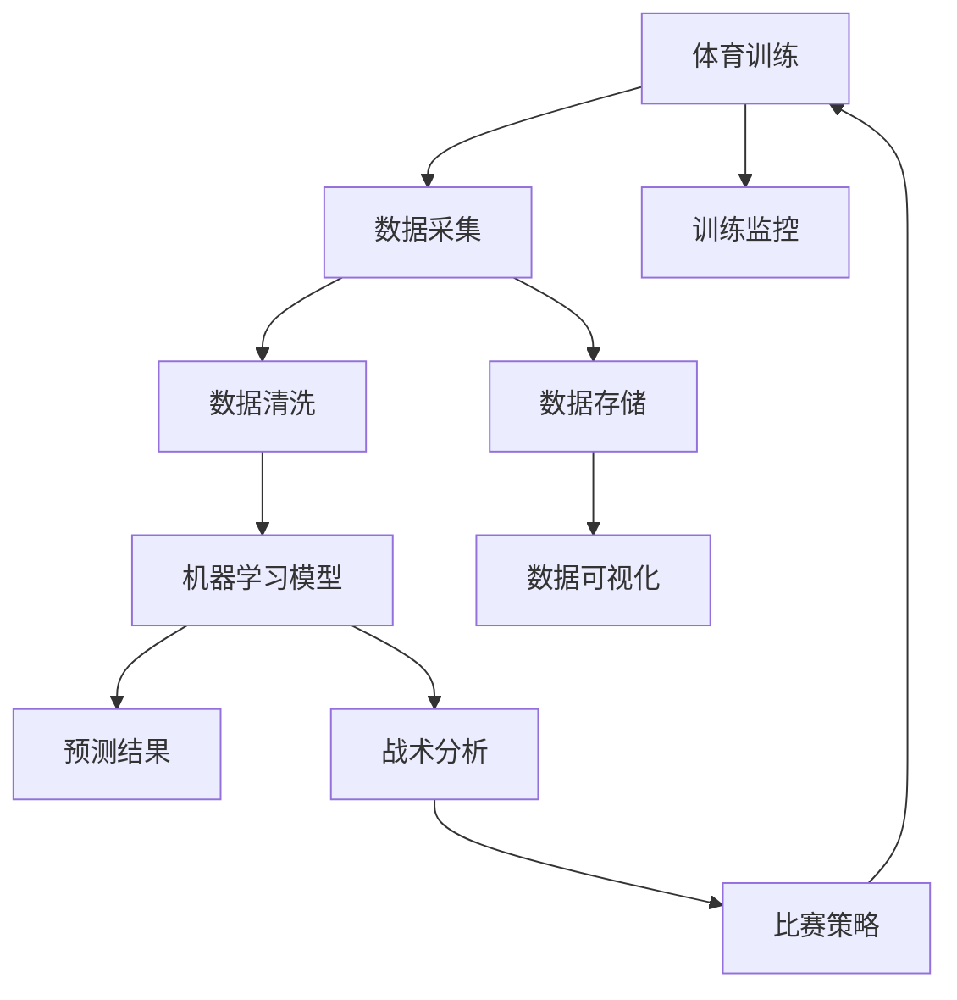

                 

# AI在体育训练和战术分析中的作用

> 关键词：体育训练、战术分析、人工智能、机器学习、数据挖掘、数据可视化、大数据、体育科技

## 1. 背景介绍

体育训练和战术分析是现代体育赛事中不可或缺的环节。传统的训练方式主要依赖教练的观察和经验，而战术分析则需要耗费大量的时间和精力进行数据收集和分析。近年来，随着人工智能技术的发展，AI在体育训练和战术分析中的应用已经逐渐普及，为体育赛事带来了革命性的变化。

本文将从体育训练和战术分析的基本概念出发，探讨AI如何通过机器学习、数据挖掘和数据可视化等技术，提升体育训练和战术分析的效率和准确性，帮助教练和运动员更科学地进行训练和比赛。

## 2. 核心概念与联系

### 2.1 核心概念概述

- **体育训练**：指运动员通过有计划的锻炼，提高体能、技术和战术水平的过程。体育训练通常包括力量、速度、耐力、灵活性等方面的训练，旨在提升运动员的综合能力。
- **战术分析**：指对体育比赛中的各种战术手段进行系统分析，以指导教练制定比赛策略，提升团队整体水平。战术分析通常包括对手的阵型、球员的特点、比分变化等。
- **人工智能**：一种模拟人类智能行为的技术，包括机器学习、数据挖掘、自然语言处理等子领域。在体育训练和战术分析中，AI主要通过深度学习、神经网络等算法，对数据进行处理和分析。

### 2.2 核心概念原理和架构的 Mermaid 流程图



这个流程图展示了体育训练和战术分析的核心环节及其相互联系。数据采集是基础，数据清洗和存储为机器学习模型的训练和战术分析提供了支持。机器学习模型通过预测结果，结合战术分析，最终指导比赛策略的制定。数据可视化技术帮助教练和运动员更好地理解分析结果。

## 3. 核心算法原理 & 具体操作步骤

### 3.1 算法原理概述

AI在体育训练和战术分析中的核心算法原理主要包括以下几个方面：

1. **机器学习**：通过训练数据集，构建出能够对特定问题进行预测或分类的模型，用于训练监控和战术分析。
2. **数据挖掘**：从大量数据中挖掘出有价值的信息，如运动员的表现趋势、对手的战术特点等，用于指导训练和比赛策略。
3. **数据可视化**：将复杂的统计数据和分析结果转化为直观的图表和图形，帮助教练和运动员更容易理解数据，做出决策。

### 3.2 算法步骤详解

#### 3.2.1 数据采集

数据采集是AI在体育训练和战术分析中的第一步。这包括收集运动员的训练数据、比赛数据、对手数据等。

1. **训练数据**：包括运动员的训练记录、身体数据、技术数据等。可以通过传感器、相机、GPS等设备采集。
2. **比赛数据**：包括比赛结果、比分变化、球员表现等。可以通过电视直播、比赛录像、官方数据等获取。
3. **对手数据**：包括对手的阵型、球员特点、训练记录等。可以通过网络公开信息、比赛录像、对手分析报告等获取。

#### 3.2.2 数据清洗和存储

采集的数据通常存在缺失、噪声等问题，需要进行清洗和预处理。

1. **数据清洗**：去除缺失值、异常值，处理重复数据，确保数据质量。
2. **数据存储**：将清洗后的数据存储在数据库或数据仓库中，便于后续分析和检索。

#### 3.2.3 机器学习模型训练

机器学习模型训练是AI在体育训练和战术分析中的核心环节。

1. **特征工程**：提取训练数据的特征，如运动员的速度、力量、技术指标等。
2. **模型选择**：选择适合的机器学习模型，如回归模型、分类模型、神经网络等。
3. **模型训练**：使用训练数据集训练模型，调整超参数，优化模型性能。

#### 3.2.4 战术分析

战术分析是通过机器学习模型对比赛数据进行处理，提取有价值的信息，用于指导比赛策略。

1. **对手分析**：使用机器学习模型分析对手的阵型、球员特点等，生成战术分析报告。
2. **比赛策略**：根据战术分析结果，制定比赛策略，如调整阵型、球员轮换等。

#### 3.2.5 数据可视化

数据可视化是将机器学习模型和战术分析结果转化为直观的图表和图形，帮助教练和运动员更好地理解数据，做出决策。

1. **图表生成**：使用数据可视化工具，生成各种统计图表和热图。
2. **图形展示**：将图表展示在教练和运动员的屏幕上，辅助决策。

### 3.3 算法优缺点

#### 3.3.1 优点

1. **提升训练效率**：AI可以通过大数据分析和机器学习，找到训练数据中的规律，指导训练，提升效率。
2. **精确度提升**：AI可以处理大量数据，找到传统方式难以发现的趋势和规律，提高训练和战术分析的精确度。
3. **动态调整**：AI可以根据实时数据，动态调整训练和战术策略，提高应对能力。

#### 3.3.2 缺点

1. **数据质量要求高**：AI需要高质量的数据进行训练和分析，数据采集和清洗成本较高。
2. **模型复杂度**：复杂的机器学习模型训练和调优需要较高的技术门槛。
3. **依赖设备**：AI需要各种传感器和设备采集数据，设备成本较高。

### 3.4 算法应用领域

AI在体育训练和战术分析中的应用领域包括：

1. **体能训练**：通过分析运动员的体能数据，制定个性化的训练计划。
2. **技术分析**：分析运动员的技术数据，找出技术上的弱点和优势。
3. **战术分析**：分析比赛数据，制定战术策略，提升团队的整体水平。
4. **比赛模拟**：使用AI进行比赛模拟，预测比赛结果，指导训练和比赛策略。

## 4. 数学模型和公式 & 详细讲解 & 举例说明

### 4.1 数学模型构建

AI在体育训练和战术分析中，通常使用以下数学模型：

1. **回归模型**：用于预测连续型数据，如运动员的体能表现、比赛中的比分变化等。
2. **分类模型**：用于分类任务，如球员的战术特点、对手的阵型等。
3. **神经网络模型**：用于处理复杂数据，如比赛录像、运动员的表现数据等。

### 4.2 公式推导过程

以回归模型为例，其公式推导过程如下：

设训练数据集为 $(x_1, y_1), (x_2, y_2), \ldots, (x_n, y_n)$，其中 $x_i$ 为输入变量，$y_i$ 为输出变量。

假设回归模型为 $y = \hat{y} = \beta_0 + \beta_1 x_1 + \beta_2 x_2 + \ldots + \beta_k x_k + \epsilon$，其中 $\beta_i$ 为回归系数，$\epsilon$ 为随机误差项。

最小二乘法（Least Squares）的目标是最小化误差平方和：

$$
SSE = \sum_{i=1}^n (y_i - \hat{y}_i)^2
$$

通过求解 $SSE$ 的最小值，得到回归系数 $\beta_i$ 的估计值：

$$
\hat{\beta} = (X^TX)^{-1}X^Ty
$$

其中 $X = [x_1, x_2, \ldots, x_k]$，$y = [y_1, y_2, \ldots, y_n]$。

### 4.3 案例分析与讲解

假设有一个篮球运动员的体能数据，包括训练次数、力量、速度、技术指标等。

1. **数据采集**：通过传感器和相机，采集运动员在训练中的数据。
2. **数据清洗**：去除缺失值，处理异常数据，确保数据质量。
3. **模型训练**：选择回归模型，使用训练数据集进行训练，得到回归系数 $\hat{\beta}$。
4. **战术分析**：根据回归模型，预测运动员的体能表现，指导训练计划。

## 5. 项目实践：代码实例和详细解释说明

### 5.1 开发环境搭建

#### 5.1.1 环境配置

1. **Python环境**：选择Python 3.x版本，安装Anaconda或Miniconda。
2. **机器学习库**：安装scikit-learn、numpy、pandas等常用库。
3. **数据可视化库**：安装matplotlib、seaborn等数据可视化库。

#### 5.1.2 数据集准备

1. **体能数据**：收集运动员的训练记录、力量、速度等数据。
2. **比赛数据**：收集比赛结果、比分变化、球员表现等数据。
3. **对手数据**：收集对手的阵型、球员特点等数据。

### 5.2 源代码详细实现

#### 5.2.1 数据预处理

```python
import pandas as pd
import numpy as np
from sklearn.model_selection import train_test_split

# 读取体能数据
df = pd.read_csv('athlete_data.csv')

# 数据清洗和预处理
df.dropna(inplace=True)
X = df.drop(['id', 'name'], axis=1)
y = df['performance']
X_train, X_test, y_train, y_test = train_test_split(X, y, test_size=0.2)
```

#### 5.2.2 模型训练

```python
from sklearn.linear_model import LinearRegression
from sklearn.metrics import mean_squared_error

# 建立线性回归模型
model = LinearRegression()
model.fit(X_train, y_train)

# 预测体能表现
y_pred = model.predict(X_test)

# 计算误差
mse = mean_squared_error(y_test, y_pred)
print('Mean Squared Error:', mse)
```

#### 5.2.3 数据可视化

```python
import matplotlib.pyplot as plt
import seaborn as sns

# 绘制散点图
sns.scatterplot(x=X_test['strength'], y=y_test, hue=y_pred, palette='viridis')
plt.xlabel('Strength')
plt.ylabel('Performance')
plt.title('Strength vs Performance')
plt.show()
```

### 5.3 代码解读与分析

1. **数据采集**：通过传感器和相机采集运动员的训练数据。
2. **数据清洗**：去除缺失值和异常值，确保数据质量。
3. **模型训练**：使用线性回归模型，训练运动员的体能表现预测模型。
4. **数据可视化**：使用散点图展示运动员的体能数据和预测结果，帮助教练和运动员理解数据。

## 6. 实际应用场景

### 6.1 体能训练

AI在体能训练中的应用可以体现在以下几个方面：

1. **个性化训练计划**：根据运动员的体能数据，生成个性化的训练计划，提高训练效果。
2. **训练监控**：实时监控运动员的训练数据，调整训练强度和节奏。
3. **恢复策略**：分析运动员的恢复数据，制定合理的恢复策略，避免过度训练。

### 6.2 技术分析

AI在技术分析中的应用可以体现在以下几个方面：

1. **技术动作分析**：分析运动员的技术数据，找出技术上的弱点和优势。
2. **技术趋势分析**：分析技术数据的变化趋势，指导训练和比赛策略。
3. **技术模拟**：使用AI进行技术模拟，预测技术效果，指导训练。

### 6.3 战术分析

AI在战术分析中的应用可以体现在以下几个方面：

1. **对手分析**：分析对手的阵型、球员特点等，生成战术分析报告。
2. **比赛策略**：根据战术分析结果，制定比赛策略，如调整阵型、球员轮换等。
3. **比赛模拟**：使用AI进行比赛模拟，预测比赛结果，指导训练和比赛策略。

## 7. 工具和资源推荐

### 7.1 学习资源推荐

1. **《机器学习基础》课程**：Coursera上的机器学习课程，由斯坦福大学教授Andrew Ng主讲，系统讲解机器学习的基本概念和算法。
2. **《深度学习与体育》书籍**：介绍深度学习在体育训练和战术分析中的应用，涵盖大量实际案例。
3. **《数据可视化实践》书籍**：讲解数据可视化工具的使用方法，帮助理解数据和结果。

### 7.2 开发工具推荐

1. **Jupyter Notebook**：Python环境下的交互式编程工具，支持代码、数学公式、图表等混合显示。
2. **Scikit-learn**：常用的机器学习库，提供各种机器学习算法的实现。
3. **TensorFlow**：常用的深度学习库，支持各种神经网络模型的构建和训练。

### 7.3 相关论文推荐

1. **《深度学习在体育中的应用》**：研究深度学习在体育训练和战术分析中的潜力。
2. **《基于机器学习的体育训练优化》**：介绍机器学习在体育训练中的应用，提供优化建议。
3. **《体育比赛中的战术分析》**：研究战术分析的算法和技术，提供实例。

## 8. 总结：未来发展趋势与挑战

### 8.1 研究成果总结

AI在体育训练和战术分析中的应用已经取得了显著的成果，提升了训练效率和比赛策略的精准度。未来，随着技术的不断进步，AI将在更多领域得到应用，推动体育赛事的进步。

### 8.2 未来发展趋势

1. **技术融合**：AI将与其他技术进行更深入的融合，如大数据、物联网、人工智能等，构建更智能的体育生态系统。
2. **实时分析**：实时数据分析和决策将变得越来越重要，帮助教练和运动员实时调整策略。
3. **个性化服务**：AI将提供更个性化的服务，根据运动员的特点和需求，制定更科学的训练计划和比赛策略。
4. **跨领域应用**：AI将应用于更多的领域，如体育健康、体育教育等，推动体育产业的发展。

### 8.3 面临的挑战

1. **数据隐私**：运动员的数据隐私问题需要得到重视，确保数据安全。
2. **技术门槛**：AI技术的应用需要高技术门槛，需要更多的培训和支持。
3. **设备成本**：AI设备成本较高，需要更多的投资。
4. **算法透明性**：AI算法需要更高的透明性，确保教练和运动员能够理解和使用。

### 8.4 研究展望

未来，AI在体育训练和战术分析中的应用将继续深化，推动体育赛事的发展。

1. **技术创新**：探索新的技术方法，提升AI的性能和应用范围。
2. **跨学科研究**：将AI与体育训练和战术分析中的其他学科进行跨学科研究，提升AI的实用性。
3. **国际合作**：加强国际合作，推动全球体育训练和战术分析的标准化和规范化。

## 9. 附录：常见问题与解答

**Q1：AI在体育训练和战术分析中主要解决了哪些问题？**

A: AI在体育训练和战术分析中主要解决了以下几个问题：

1. **训练效率提升**：AI能够从大量数据中提取规律，指导训练计划，提升训练效率。
2. **战术分析精确度提高**：AI能够处理复杂数据，提高战术分析的精确度，帮助教练制定更科学的策略。
3. **个性化服务**：AI能够根据运动员的特点，制定个性化的训练计划和比赛策略。

**Q2：AI在体育训练和战术分析中面临哪些挑战？**

A: AI在体育训练和战术分析中面临以下挑战：

1. **数据隐私问题**：运动员的数据隐私需要得到保护，确保数据安全。
2. **技术门槛高**：AI技术的应用需要高技术门槛，需要更多的培训和支持。
3. **设备成本高**：AI设备成本较高，需要更多的投资。
4. **算法透明性不足**：AI算法需要更高的透明性，确保教练和运动员能够理解和使用。

**Q3：AI在体育训练和战术分析中的应用前景如何？**

A: AI在体育训练和战术分析中的应用前景广阔，具体体现在以下几个方面：

1. **个性化服务**：AI将提供更个性化的服务，根据运动员的特点和需求，制定更科学的训练计划和比赛策略。
2. **实时分析**：实时数据分析和决策将变得越来越重要，帮助教练和运动员实时调整策略。
3. **跨领域应用**：AI将应用于更多的领域，如体育健康、体育教育等，推动体育产业的发展。

**Q4：AI在体育训练和战术分析中的技术实现难点是什么？**

A: AI在体育训练和战术分析中的技术实现难点主要包括以下几个方面：

1. **数据采集和清洗**：数据采集和清洗成本较高，需要大量的传感器和设备。
2. **模型选择和优化**：选择适合的机器学习模型，并对其优化调整，需要较高的技术门槛。
3. **数据可视化**：将复杂的统计数据和分析结果转化为直观的图表和图形，需要掌握高级的数据可视化技术。

作者：禅与计算机程序设计艺术 / Zen and the Art of Computer Programming

