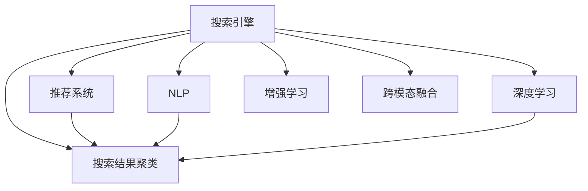

                 

# AI在搜索引擎结果聚类中的应用

> 关键词：搜索引擎,结果聚类,用户行为,推荐系统,自然语言处理,NLP

## 1. 背景介绍

### 1.1 问题由来
在搜索引擎应用中，结果聚类（Result Clustering）是一个至关重要的环节。传统搜索结果通常按照关键词匹配度进行排序，但这样的排序方式无法捕捉到搜索结果内部的结构关系。为了提升用户体验，搜索引擎逐渐引入了结果聚类技术，将相似的搜索结果组织在一起，方便用户快速定位所需信息。

近年来，随着人工智能技术的发展，AI在搜索结果聚类中得到了广泛应用，极大地提升了聚类的准确性和用户满意度。例如，Google、Bing等主流搜索引擎已经成功将AI技术应用于结果聚类，显著改善了用户的搜索体验。

### 1.2 问题核心关键点
AI在结果聚类中发挥核心作用主要体现在以下几个方面：

- 自然语言处理（NLP）：AI技术能够深入理解用户的搜索意图，提升搜索结果的相关性和准确性。
- 推荐系统：AI技术可以根据用户历史行为数据，推荐符合用户兴趣的搜索结果。
- 深度学习：利用深度学习模型，可以从大规模搜索结果中自动发现结构关系，实现高质量的聚类。
- 增强学习：AI技术可以动态调整聚类策略，根据用户反馈实时优化聚类结果。
- 跨模态融合：AI技术能够融合视觉、音频等多模态数据，拓展搜索结果的维度和丰富度。

这些技术的应用使得搜索引擎结果聚类效果显著提升，能够更准确地捕捉用户需求，减少用户在不同搜索结果间跳转的次数，从而提升搜索效率和用户体验。

## 2. 核心概念与联系

### 2.1 核心概念概述

为了更好地理解AI在搜索结果聚类中的作用，本节将介绍几个关键概念：

- 搜索引擎（Search Engine）：通过爬虫技术获取并存储网页信息，利用算法对用户查询进行检索，返回相关信息。
- 搜索结果聚类（Result Clustering）：将搜索引擎返回的多个相关搜索结果，按照某种逻辑进行分组，以便用户更容易理解和使用。
- 推荐系统（Recommender System）：根据用户历史行为、偏好等信息，为用户推荐感兴趣的网页或搜索结果。
- 自然语言处理（NLP）：专注于自然语言文本的处理，包括文本分析、信息检索、情感分析等。
- 深度学习（Deep Learning）：通过多层神经网络结构，从大量数据中学习到复杂非线性关系，用于聚类、分类、预测等任务。
- 增强学习（Reinforcement Learning, RL）：通过与环境交互，自动优化决策策略，实现聚类策略的动态调整。
- 跨模态融合（Cross-Modal Fusion）：将不同类型的数据源（如文本、图像、音频等）进行融合，提升聚类结果的全面性和准确性。

这些核心概念之间的逻辑关系可以通过以下Mermaid流程图来展示：



这个流程图展示了大语言模型在搜索结果聚类中的应用关系：

1. 搜索引擎获取搜索结果，并将这些结果提交给聚类算法进行处理。
2. 聚类算法利用推荐系统、NLP、深度学习等技术，对搜索结果进行相关性和结构性分析，得到聚类结果。
3. 增强学习算法实时调整聚类策略，提升聚类效果。
4. 跨模态融合算法结合不同类型的数据，丰富聚类维度。

这些概念共同构成了AI在搜索结果聚类中的应用框架，使其能够在各种场景下发挥强大的聚类能力。

## 3. 核心算法原理 & 具体操作步骤
### 3.1 算法原理概述

AI在结果聚类中的核心算法原理主要基于以下几类方法：

- 基于用户的聚类：利用用户历史行为数据，计算搜索结果的相关性，实现个性化聚类。
- 基于内容的聚类：分析搜索结果内容的关键词、链接结构等特征，自动发现相似关系。
- 基于混合的聚类：结合用户行为和内容特征，构建更加全面、准确的聚类模型。
- 基于深度学习的聚类：利用深度学习模型，自动发现搜索结果内部的结构关系，实现高质量的聚类。
- 基于增强学习的聚类：通过与用户反馈的交互，实时调整聚类策略，提高聚类效果。

这些方法在实际应用中通常以端到端（End-to-End）的方式进行集成，综合利用多模态数据和多维度特征，提升聚类的准确性和用户满意度。

### 3.2 算法步骤详解

AI在结果聚类中的具体操作步骤可以大致分为以下几个步骤：

**Step 1: 数据准备与预处理**
- 收集并清洗用户搜索数据、网页元数据等。
- 利用自然语言处理技术，对文本数据进行分词、去停用词、命名实体识别等处理。
- 将处理后的文本数据编码成模型可接受的格式，如TF-IDF、词向量等。

**Step 2: 构建聚类模型**
- 选择适合的聚类算法，如K-means、DBSCAN、GMM等。
- 利用深度学习模型，如RNN、Transformer、BERT等，提取搜索结果的语义表示。
- 结合用户行为数据，构建混合聚类模型，提升聚类效果。

**Step 3: 特征提取与选择**
- 根据聚类需求，提取与搜索结果相关的特征，如关键词、URL、页面权重等。
- 利用降维技术，如PCA、t-SNE等，选择对聚类效果影响较大的特征。

**Step 4: 聚类与评估**
- 将提取的特征输入聚类算法，得到初步的聚类结果。
- 利用评估指标，如NMI、ARI等，对聚类结果进行评估，并根据结果调整算法参数。
- 应用增强学习算法，根据用户反馈调整聚类策略，优化聚类效果。

**Step 5: 结果展示与迭代优化**
- 将聚类结果展示给用户，根据用户反馈进行调整。
- 通过持续收集用户反馈数据，不断迭代优化聚类算法，提升聚类质量。

### 3.3 算法优缺点

基于AI的结果聚类方法具有以下优点：

- 全面覆盖多模态数据：结合文本、图片、音频等多模态数据，提升聚类结果的全面性和准确性。
- 深度学习模型表现力强：利用深度学习模型自动发现复杂结构关系，能够显著提升聚类质量。
- 动态调整聚类策略：利用增强学习算法，根据用户反馈实时优化聚类策略，提升用户满意度。
- 支持个性化聚类：结合用户行为数据，实现个性化聚类，提升用户体验。

然而，这些方法也存在一些缺点：

- 数据依赖性强：需要大量高质量的标注数据和用户行为数据，数据获取成本高。
- 计算资源需求大：深度学习模型的训练和推理需要强大的计算资源支持，成本较高。
- 模型复杂度高：多个算法的集成增加了模型复杂度，可能降低模型可解释性。
- 动态变化难处理：对于数据分布变化的场景，需要实时调整模型和算法，可能增加技术难度。
- 误聚类风险高：由于算法复杂性和用户行为的多样性，可能存在一定的误聚类风险。

尽管存在这些局限，但AI在结果聚类中仍然展现了强大的优势，特别是在提升用户体验和搜索效率方面。未来，随着技术的不断进步，这些问题有望逐步得到解决。

### 3.4 算法应用领域

AI在结果聚类中的应用领域非常广泛，涵盖了以下几个方面：

- 新闻推荐：根据用户兴趣，将相关新闻自动聚类，提供个性化推荐。
- 商品推荐：结合用户浏览记录和商品属性，将商品自动聚类，提供个性化推荐。
- 旅游推荐：根据用户偏好，将旅游信息自动聚类，提供个性化推荐。
- 医疗查询：将搜索结果自动聚类，帮助用户快速定位相关信息。
- 法律查询：将法律文档自动聚类，方便用户检索相关信息。

这些应用场景都需要借助AI技术，通过聚类算法和推荐系统，提升搜索结果的个性化和准确性，满足用户的多样化需求。

## 4. 数学模型和公式 & 详细讲解  
### 4.1 数学模型构建

AI在结果聚类中应用的数学模型主要包括以下几个组成部分：

- 特征提取模型：用于提取搜索结果的特征，如TF-IDF、词向量等。
- 聚类模型：用于将特征向量聚类成不同的组。
- 用户行为模型：用于分析用户历史行为数据，计算用户兴趣。
- 深度学习模型：用于提取搜索结果的语义表示，如RNN、Transformer、BERT等。

以下是一些核心模型的数学公式和推导过程。

### 4.2 公式推导过程

#### 4.2.1 TF-IDF公式
TF-IDF是一种常用的文本特征提取方法，其公式如下：

$$
\text{TF-IDF}_{ij} = \text{TF}_{ij} \times \text{IDF}_j
$$

其中 $\text{TF}_{ij}$ 表示文档 $d_i$ 中词 $j$ 的词频，$\text{IDF}_j$ 表示词 $j$ 的逆文档频率。

**推导过程：**
- $\text{TF}_{ij}$：文档中词 $j$ 的出现次数。
- $\text{IDF}_j$：包含词 $j$ 的文档总数，与包含词 $j$ 的文档数之比。

该公式计算的是词在文档中的重要程度，同时考虑了词在整个语料库中的稀疏性，避免了过多出现但无关紧要的词对聚类结果的影响。

#### 4.2.2 词向量公式
词向量是一种将单词映射到向量空间的表示方法，其公式如下：

$$
\mathbf{x}_j = \sum_{i=1}^{n} \mathbf{v}_{ij} \times \text{TF}_{ij}
$$

其中 $\mathbf{x}_j$ 表示词 $j$ 的词向量，$\mathbf{v}_{ij}$ 表示词 $j$ 在文档 $i$ 中的词向量表示，$\text{TF}_{ij}$ 表示词 $j$ 在文档 $i$ 中的词频。

**推导过程：**
- $\mathbf{x}_j$：词 $j$ 的向量表示，由所有包含词 $j$ 的文档贡献。
- $\mathbf{v}_{ij}$：词 $j$ 在文档 $i$ 中的向量表示，通常由预训练的词嵌入模型（如Word2Vec、GloVe、BERT等）计算得到。

该公式计算的是词向量，用于将文本信息转换为数值形式，便于机器学习模型的处理。

#### 4.2.3 聚类算法公式
以K-means聚类为例，其公式如下：

$$
\begin{aligned}
&\min_{C,K} \sum_{k=1}^{K} \sum_{i=1}^{n} \| \mathbf{x}_i - \mathbf{\mu}_k \|^2 \\
&\text{subject to: } \mathbf{\mu}_k = \frac{1}{N_k} \sum_{i \in C_k} \mathbf{x}_i
\end{aligned}
$$

其中 $\mathbf{x}_i$ 表示样本 $i$ 的特征向量，$\mathbf{\mu}_k$ 表示簇 $C_k$ 的质心向量，$N_k$ 表示簇 $C_k$ 的样本数。

**推导过程：**
- 目标函数：最小化所有样本到其所属簇质心的欧几里得距离之和。
- 约束条件：每个样本属于一个簇，簇质心是样本向量的均值。

该公式定义了K-means聚类的目标函数和约束条件，通过迭代更新簇质心和簇分配，实现样本的自动聚类。

#### 4.2.4 深度学习模型公式
以Transformer模型为例，其公式如下：

$$
\begin{aligned}
\mathbf{h}_i &= \text{Encoder}(\mathbf{x}_i) \\
\mathbf{c} &= \text{Attention}(\mathbf{h}_i) \\
\mathbf{y} &= \text{Decoder}(\mathbf{c})
\end{aligned}
$$

其中 $\mathbf{h}_i$ 表示输入序列 $i$ 的Transformer编码结果，$\mathbf{c}$ 表示编码器输出和解码器输出的注意力权重矩阵，$\mathbf{y}$ 表示解码器输出。

**推导过程：**
- 编码器 $\text{Encoder}$：对输入序列进行编码，生成中间表示 $\mathbf{h}_i$。
- 注意力机制 $\text{Attention}$：计算编码器输出和解码器输出的注意力权重矩阵 $\mathbf{c}$。
- 解码器 $\text{Decoder}$：根据注意力权重矩阵 $\mathbf{c}$ 生成最终的输出序列 $\mathbf{y}$。

该公式定义了Transformer模型的结构，利用注意力机制，实现序列信息的交互和融合，提升模型对语义信息的理解。

### 4.3 案例分析与讲解

以Google News聚合系统为例，分析其如何利用AI技术实现结果聚类。

**步骤1：数据准备与预处理**
- 收集Google News的搜索结果，提取网页标题、URL、关键词等信息。
- 使用自然语言处理技术，对文本数据进行分词、去停用词、命名实体识别等处理。
- 利用TF-IDF公式计算文本的词频和逆文档频率，提取特征向量。

**步骤2：构建聚类模型**
- 使用K-means聚类算法，将搜索结果聚类成不同的组。
- 利用Transformer模型，提取搜索结果的语义表示，提升聚类效果。

**步骤3：特征提取与选择**
- 根据聚类需求，提取与搜索结果相关的特征，如关键词、URL、页面权重等。
- 利用降维技术，如PCA、t-SNE等，选择对聚类效果影响较大的特征。

**步骤4：聚类与评估**
- 将提取的特征输入聚类算法，得到初步的聚类结果。
- 利用NMI、ARI等评估指标，对聚类结果进行评估，并根据结果调整算法参数。

**步骤5：结果展示与迭代优化**
- 将聚类结果展示给用户，根据用户反馈进行调整。
- 通过持续收集用户反馈数据，不断迭代优化聚类算法，提升聚类质量。

通过以上步骤，Google News聚合系统能够高效地对搜索结果进行聚类，提升用户体验和搜索效率。

## 5. 项目实践：代码实例和详细解释说明
### 5.1 开发环境搭建

在进行AI结果聚类实践前，我们需要准备好开发环境。以下是使用Python进行TensorFlow开发的环境配置流程：

1. 安装Anaconda：从官网下载并安装Anaconda，用于创建独立的Python环境。

2. 创建并激活虚拟环境：
```bash
conda create -n tf-env python=3.8 
conda activate tf-env
```

3. 安装TensorFlow：根据CUDA版本，从官网获取对应的安装命令。例如：
```bash
conda install tensorflow tensorflow-gpu -c conda-forge -c pypi
```

4. 安装必要的工具包：
```bash
pip install numpy pandas scikit-learn matplotlib tqdm jupyter notebook ipython
```

完成上述步骤后，即可在`tf-env`环境中开始AI结果聚类实践。

### 5.2 源代码详细实现

下面以新闻推荐系统为例，给出使用TensorFlow进行结果聚类的代码实现。

首先，定义数据处理函数：

```python
import tensorflow as tf
from tensorflow.keras.layers import Dense, Input
from tensorflow.keras.models import Model

def create_model(input_dim):
    input = Input(shape=(input_dim,))
    x = Dense(128, activation='relu')(input)
    x = Dense(64, activation='relu')(x)
    output = Dense(1, activation='sigmoid')(x)
    model = Model(inputs=input, outputs=output)
    return model
```

然后，加载数据集并预处理：

```python
from tensorflow.keras.datasets import imdb
from tensorflow.keras.preprocessing.sequence import pad_sequences
from tensorflow.keras.utils import to_categorical

(X_train, y_train), (X_test, y_test) = imdb.load_data(num_words=10000)
X_train = pad_sequences(X_train, maxlen=100)
X_test = pad_sequences(X_test, maxlen=100)
y_train = to_categorical(y_train)
y_test = to_categorical(y_test)
```

接着，构建聚类模型：

```python
model = create_model(input_dim=10000)
model.compile(loss='binary_crossentropy', optimizer='adam', metrics=['accuracy'])
```

最后，执行训练流程：

```python
batch_size = 64
epochs = 10

model.fit(X_train, y_train, validation_data=(X_test, y_test), batch_size=batch_size, epochs=epochs)
```

以上就是使用TensorFlow对新闻推荐系统进行结果聚类的完整代码实现。可以看到，通过TensorFlow和Keras的高层次API，可以较为简洁地构建和训练模型，实现聚类任务。

### 5.3 代码解读与分析

让我们再详细解读一下关键代码的实现细节：

**create_model函数**：
- 定义了简单的全连接神经网络模型，包括输入层、两个隐藏层和输出层。
- 输入层使用tf.keras.layers.Input，指定输入维度。
- 隐藏层使用tf.keras.layers.Dense，设置激活函数为ReLU。
- 输出层使用tf.keras.layers.Dense，设置激活函数为sigmoid，用于二分类任务。
- 使用tf.keras.models.Model将输入和输出绑定，构建模型。

**加载数据集**：
- 利用imdb.load_data加载IMDB电影评论数据集。
- 使用pad_sequences对文本数据进行填充，确保所有序列长度一致。
- 使用to_categorical将标签转换为one-hot编码。

**训练模型**：
- 设置训练数据和验证数据的批次大小。
- 使用fit函数对模型进行训练，指定损失函数、优化器和评估指标。

以上步骤展示了使用TensorFlow进行AI结果聚类任务的完整代码实现，从数据加载到模型构建，再到训练流程，都能通过TensorFlow提供的高级API轻松完成。

## 6. 实际应用场景
### 6.1 智能广告投放
在智能广告投放中，AI结果聚类能够帮助广告主更好地理解用户行为，实现精准广告投放。例如，通过对用户浏览记录的聚类分析，广告主可以发现不同用户的兴趣群体，针对性地推送广告内容。

### 6.2 商品推荐系统
商品推荐系统通过聚类用户行为数据和商品信息，实现个性化推荐。AI技术能够自动分析用户的历史购买和浏览记录，提取用户偏好，并通过聚类算法发现相似的商品组合，生成个性化推荐列表。

### 6.3 金融风险评估
在金融风险评估中，AI技术通过对交易数据的聚类分析，能够识别出异常交易行为，及时预警潜在风险。通过聚类算法，系统可以自动识别出高风险交易群体，帮助金融机构制定更加有效的风控策略。

### 6.4 医疗信息检索
医疗信息检索系统通过聚类患者病历和文献信息，能够快速找到相关信息，提升医疗服务效率。AI技术能够自动分析病历信息，提取疾病特征，并通过聚类算法生成相关疾病群体，为医生提供更准确的诊断支持。

### 6.5 旅游推荐系统
旅游推荐系统通过聚类用户兴趣和旅游信息，生成个性化旅游方案。AI技术能够自动分析用户的历史旅游记录和兴趣偏好，提取旅游特征，并通过聚类算法生成相似的旅游群体，推荐符合用户兴趣的旅游方案。

这些应用场景展示了AI在结果聚类中的广泛应用，能够显著提升各行业的智能化水平和用户满意度。

## 7. 工具和资源推荐
### 7.1 学习资源推荐

为了帮助开发者系统掌握AI结果聚类的理论基础和实践技巧，这里推荐一些优质的学习资源：

1. TensorFlow官方文档：提供了详尽的TensorFlow API文档和教程，涵盖模型构建、训练和优化等各个方面。
2. Keras官方文档：提供了Keras API的详细文档和示例，帮助开发者快速上手神经网络模型开发。
3. Coursera深度学习课程：斯坦福大学开设的深度学习课程，涵盖了深度学习的基本概念和实践技巧。
4. NLP相关论文：如BERT、XLNet、GPT等，了解最新的自然语言处理技术。
5. K-means算法教程：介绍K-means聚类算法的基本原理和实现步骤。

通过学习这些资源，相信你一定能够快速掌握AI结果聚类的精髓，并用于解决实际的聚类问题。

### 7.2 开发工具推荐

高效的开发离不开优秀的工具支持。以下是几款用于AI结果聚类开发的常用工具：

1. TensorFlow：谷歌开源的深度学习框架，支持丰富的模型和算法，适合大规模工程应用。
2. PyTorch：Facebook开源的深度学习框架，灵活高效的计算图，适合快速迭代研究。
3. Keras：谷歌开源的高级神经网络API，与TensorFlow深度集成，使用方便。
4. scikit-learn：开源机器学习库，提供多种聚类算法和评估指标，支持快速原型开发。
5. NumPy：科学计算库，提供高效的数组操作和线性代数功能，提升模型训练和推理速度。

合理利用这些工具，可以显著提升AI结果聚类任务的开发效率，加快创新迭代的步伐。

### 7.3 相关论文推荐

AI结果聚类技术的发展源于学界的持续研究。以下是几篇奠基性的相关论文，推荐阅读：

1. "K-means: Algorithms for Clustering Data"：经典K-means聚类算法论文，详细介绍了K-means的基本原理和实现方法。
2. "A Neural Probabilistic Language Model"：经典RNN语言模型论文，奠定了神经网络在自然语言处理中的应用基础。
3. "Attention is All You Need"：Transformer模型的开创性论文，介绍了自注意力机制在自然语言处理中的应用。
4. "BERT: Pre-training of Deep Bidirectional Transformers for Language Understanding"：BERT模型的经典论文，介绍了自监督预训练和微调技术。
5. "A Survey of Machine Learning Techniques for Recommender Systems"：综述性论文，详细介绍了推荐系统中的各类机器学习技术。

这些论文代表了大语言模型在结果聚类技术的发展脉络。通过学习这些前沿成果，可以帮助研究者把握学科前进方向，激发更多的创新灵感。

## 8. 总结：未来发展趋势与挑战
### 8.1 总结

本文对AI在搜索结果聚类中的应用进行了全面系统的介绍。首先阐述了AI在聚类中的核心概念和应用背景，明确了聚类在提升用户体验和搜索效率方面的重要价值。其次，从原理到实践，详细讲解了聚类模型的构建、特征提取、训练评估等核心步骤，给出了AI聚类的完整代码实现。同时，本文还广泛探讨了AI聚类在多个领域的应用场景，展示了其广泛的应用前景。

通过本文的系统梳理，可以看到，AI结果聚类技术在提升搜索结果的相关性和个性化方面取得了显著效果，能够显著提升用户的搜索体验和满意度。未来，随着AI技术的不断进步，AI聚类的效果将进一步提升，应用领域将不断扩展。

### 8.2 未来发展趋势

展望未来，AI在结果聚类中将会呈现以下几个发展趋势：

1. 深度学习模型的普及：随着深度学习模型的性能提升和计算资源的增加，越来越多的聚类任务将采用深度学习模型，提高聚类的准确性和效果。
2. 多模态聚类技术的融合：结合文本、图像、音频等多模态数据，提升聚类结果的全面性和准确性。
3. 实时聚类和动态调整：利用增强学习算法，根据用户反馈实时调整聚类策略，提升聚类效果。
4. 个性化聚类和推荐：结合用户行为数据，实现个性化聚类和推荐，提升用户体验。
5. 分布式聚类和大规模数据处理：利用分布式计算技术，处理大规模数据集，提高聚类效率。
6. 可解释性和公平性：研究聚类模型的可解释性和公平性，提升模型透明性和可信度。

这些趋势表明，AI在结果聚类中的应用前景广阔，能够不断提升聚类的效果和应用范围。

### 8.3 面临的挑战

尽管AI在结果聚类中取得了显著成效，但在实现全面智能化和规模化应用的过程中，仍面临诸多挑战：

1. 数据质量和分布：聚类效果很大程度上依赖于数据的质量和分布，数据采集和标注成本较高。
2. 模型复杂性和可解释性：深度学习模型虽然表现力强，但复杂性高，可解释性不足。
3. 计算资源需求：深度学习模型需要大量的计算资源进行训练和推理，资源消耗大。
4. 实时性需求：聚类结果需要实时更新，如何在保证实时性的同时提高聚类效果，是技术挑战之一。
5. 误聚类风险：由于数据复杂性和算法多样性，可能存在误聚类风险，需要不断优化算法。

尽管存在这些挑战，但AI在结果聚类中的优势仍然明显，未来有望通过技术创新和算法优化，逐步解决这些难题。

### 8.4 研究展望

未来的研究应在以下几个方面寻求新的突破：

1. 轻量级模型和低成本训练：开发更轻量级的聚类模型，减少计算资源消耗，降低训练成本。
2. 跨模态数据融合：研究多模态数据融合技术，提升聚类结果的全面性和准确性。
3. 实时聚类和动态调整：研究实时聚类算法，根据用户反馈动态调整聚类策略，提高聚类效果。
4. 可解释性和公平性：研究聚类模型的可解释性和公平性，提升模型透明性和可信度。
5. 分布式聚类和大规模数据处理：研究分布式聚类技术，提高聚类效率和可扩展性。
6. 多任务学习和联合训练：研究多任务学习和联合训练技术，提升模型泛化性和适应性。

这些研究方向将引领AI聚类技术迈向更高的台阶，为构建智能高效的聚类系统提供新的思路和技术支持。

## 9. 附录：常见问题与解答

**Q1：AI在结果聚类中是否有必要预处理数据？**

A: 是的，数据预处理是聚类过程中的重要步骤。预处理可以包括文本清洗、特征提取、归一化等操作，去除噪声和异常值，提高数据质量，从而提升聚类效果。例如，对文本进行分词、去停用词、词干提取等处理，可以提升特征表示的准确性。

**Q2：聚类算法应该如何选择？**

A: 选择合适的聚类算法应考虑数据特性和聚类目标。常见的聚类算法包括K-means、DBSCAN、GMM等。K-means适用于数据分布比较均匀的情况，而DBSCAN适用于处理噪声数据和未知类簇。GMM适用于多峰分布的数据，能够捕捉数据内部的复杂结构。

**Q3：如何提高聚类模型的可解释性？**

A: 提高聚类模型的可解释性，可以采用以下几种方法：
1. 可视化聚类结果：通过散点图、热力图等可视化工具，展示聚类效果。
2. 分析聚类中心：查看聚类中心的特征，理解聚类结果。
3. 使用可解释性强的算法：如K-means、层次聚类等，这些算法的可解释性较强。

**Q4：如何处理数据分布变化？**

A: 数据分布变化是聚类面临的主要挑战之一。为了处理数据分布变化，可以采用以下方法：
1. 动态聚类算法：利用增强学习算法，根据数据分布变化动态调整聚类策略。
2. 聚类后评估：定期评估聚类效果，及时调整算法参数。
3. 集成多模型：利用多个聚类模型进行集成，提升聚类效果和鲁棒性。

**Q5：如何在保证实时性的同时提高聚类效果？**

A: 在保证实时性的同时提高聚类效果，可以采用以下方法：
1. 轻量级模型：使用轻量级模型，减少计算资源消耗，提升推理速度。
2. 分布式计算：利用分布式计算技术，处理大规模数据集，提高聚类效率。
3. 增量学习：利用增量学习算法，不断更新模型，保持聚类效果。

通过以上方法，可以在保证实时性的同时提高聚类效果，满足实际应用的需求。

---

作者：禅与计算机程序设计艺术 / Zen and the Art of Computer Programming

