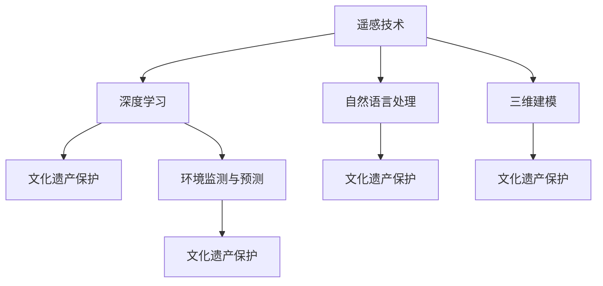

                 

# AI在文化遗产保护中的应用

## 1. 背景介绍

### 1.1 问题由来

文化遗产是人类文明的重要见证，承载着历史的记忆和文化的信息。然而，由于环境污染、自然灾害、人为破坏等因素的影响，文化遗产面临着严重的保护危机。传统的人力物力保护方式效率低下、成本高昂，难以应对大规模的保护需求。

人工智能(AI)技术的兴起，为文化遗产保护带来了新的机遇和可能性。AI可以高效处理海量数据，自动化地分析和识别文化遗产信息，辅助进行修复和保护决策。例如，AI可以用于分析遥感影像，识别历史遗址位置；通过图像识别技术，自动识别和修复文物损伤；利用自然语言处理(NLP)技术，对历史文献进行数字化和语义分析。

本文将详细探讨AI在文化遗产保护中的应用，包括技术原理、操作步骤、优缺点及应用领域等，并通过具体案例进行讲解。

### 1.2 问题核心关键点

AI在文化遗产保护中的核心关键点包括：

- 遥感图像分析：利用AI技术分析遥感影像，识别和定位历史遗址、文物等文化遗产。
- 图像识别与修复：利用深度学习技术，自动识别文物损伤并进行修复。
- 自然语言处理：对历史文献进行数字化和语义分析，辅助历史研究和文化传承。
- 文物数字化：利用3D扫描和建模技术，对文物进行高精度数字化保护。
- 环境监测与预测：通过AI对环境数据进行监测和分析，预测自然灾害对文化遗产的影响。

这些关键技术的应用，将显著提升文化遗产保护的工作效率和保护质量。

## 2. 核心概念与联系

### 2.1 核心概念概述

为更好地理解AI在文化遗产保护中的应用，本节将介绍几个密切相关的核心概念：

- 遥感技术(Remote Sensing)：通过卫星、无人机等设备获取地球表面信息，用于环境监测、资源勘探等领域。
- 深度学习(Deep Learning)：一类模拟人脑神经网络的机器学习方法，具有自适应和自学习的能力，广泛应用于图像识别、语音识别等任务。
- 自然语言处理(Natural Language Processing, NLP)：利用计算机处理、理解和生成自然语言，包括文本分类、信息抽取、机器翻译等任务。
- 三维建模(3D Modeling)：通过对物体进行三维扫描和建模，生成高精度的数字模型，用于文化遗产保护和展示。
- 文化遗产保护(Cultural Heritage Protection)：通过各种手段和技术，对历史遗址、文物等文化遗产进行保护、修复和管理。

这些核心概念之间的逻辑关系可以通过以下Mermaid流程图来展示：



这个流程图展示了各核心概念之间的联系：

1. 遥感技术提供海量地球表面数据，通过深度学习技术分析，用于文化遗产的定位和监测。
2. 自然语言处理技术，对历史文献进行数字化和语义分析，辅助历史研究和文化传承。
3. 三维建模技术，生成文物的数字模型，用于文化遗产的保护和展示。
4. 环境监测与预测，通过AI技术对环境数据进行监测和分析，预测自然灾害对文化遗产的影响。

这些核心概念共同构成了AI在文化遗产保护的应用框架，使其能够高效、全面地保护人类文明的珍贵遗产。

## 3. 核心算法原理 & 具体操作步骤

### 3.1 算法原理概述

AI在文化遗产保护中应用的核心算法包括遥感图像分析、图像识别与修复、自然语言处理、文物数字化和环境监测与预测等。其核心思想是利用AI技术处理和分析文化遗产相关数据，提取有用信息，辅助文化遗产的保护和修复。

具体而言，AI通过以下步骤实现文化遗产保护：

1. 数据收集与预处理：收集遥感影像、历史文献、文物图像等文化遗产相关数据，并进行预处理，如降噪、去畸、归一化等。
2. 特征提取与识别：利用深度学习算法，提取数据的特征，识别和定位历史遗址、文物等文化遗产。
3. 信息分析与处理：通过自然语言处理技术，对历史文献进行数字化和语义分析，辅助历史研究和文化传承。
4. 三维建模与修复：利用三维建模技术，生成文物的数字模型，用于文化遗产的保护和展示。
5. 环境监测与预测：通过AI技术对环境数据进行监测和分析，预测自然灾害对文化遗产的影响。

### 3.2 算法步骤详解

#### 3.2.1 遥感图像分析

遥感图像分析是AI在文化遗产保护中的重要应用之一。其主要步骤包括：

1. 数据收集：收集卫星遥感影像、无人机航拍影像等地球表面数据。
2. 数据预处理：对遥感影像进行降噪、去畸、归一化等预处理操作，提高数据质量。
3. 特征提取：利用卷积神经网络(CNN)等深度学习算法，提取遥感影像的特征，如地物边界、纹理等。
4. 目标识别：通过分类算法，识别遥感影像中的历史遗址、文物等目标。
5. 数据标注：对识别出的目标进行标注，生成训练集。
6. 模型训练：使用训练集训练分类模型，如Faster R-CNN、YOLO等，提高识别准确率。
7. 模型评估与优化：在验证集上评估模型性能，通过调整超参数优化模型。

#### 3.2.2 图像识别与修复

图像识别与修复是AI在文化遗产保护中的另一重要应用。其主要步骤包括：

1. 数据收集：收集文物图像等文化遗产数据。
2. 数据预处理：对文物图像进行降噪、去畸、归一化等预处理操作，提高数据质量。
3. 特征提取：利用卷积神经网络(CNN)等深度学习算法，提取文物图像的特征，如纹理、颜色等。
4. 损伤识别：通过分类算法，识别文物损伤位置和类型。
5. 损伤修复：通过生成对抗网络(GAN)等深度学习算法，生成修复后的图像。
6. 数据标注：对修复后的图像进行标注，生成训练集。
7. 模型训练：使用训练集训练分类和生成模型，如U-Net、GAN等，提高损伤识别和修复精度。
8. 模型评估与优化：在验证集上评估模型性能，通过调整超参数优化模型。

#### 3.2.3 自然语言处理

自然语言处理是AI在文化遗产保护中的关键技术之一。其主要步骤包括：

1. 数据收集：收集历史文献、文本资料等文化遗产数据。
2. 数据预处理：对文本进行分词、去停用词、词性标注等预处理操作，提高数据质量。
3. 特征提取：利用词袋模型、TF-IDF等技术，提取文本的特征。
4. 文本分类：通过分类算法，对文本进行分类，如历史时期、地区、主题等。
5. 信息抽取：通过命名实体识别、关系抽取等技术，从文本中抽取关键信息，如人物、地点、事件等。
6. 文本生成：通过生成模型，生成历史文献、文本资料等。
7. 数据标注：对生成后的文本进行标注，生成训练集。
8. 模型训练：使用训练集训练分类和生成模型，如BERT、GPT等，提高文本分类和生成精度。
9. 模型评估与优化：在验证集上评估模型性能，通过调整超参数优化模型。

#### 3.2.4 文物数字化

文物数字化是AI在文化遗产保护中的重要应用之一。其主要步骤包括：

1. 数据收集：收集文物图像、三维扫描数据等文化遗产数据。
2. 数据预处理：对文物图像进行降噪、去畸、归一化等预处理操作，提高数据质量。
3. 三维建模：利用点云重建、三角化等技术，生成文物的三维模型。
4. 模型优化：通过优化算法，如PCL、IFT等，对三维模型进行平滑和优化。
5. 模型导出：将优化后的三维模型导出为标准格式，如OBJ、STL等，便于展示和共享。
6. 数据标注：对三维模型进行标注，生成训练集。
7. 模型训练：使用训练集训练生成和优化模型，如NetFusion、IFT等，提高三维模型的生成和优化精度。
8. 模型评估与优化：在验证集上评估模型性能，通过调整超参数优化模型。

#### 3.2.5 环境监测与预测

环境监测与预测是AI在文化遗产保护中的重要应用之一。其主要步骤包括：

1. 数据收集：收集气象、水文、地质等环境数据。
2. 数据预处理：对环境数据进行清洗、归一化等预处理操作，提高数据质量。
3. 特征提取：利用时间序列分析、统计学等技术，提取环境数据特征。
4. 模型训练：使用训练集训练预测模型，如ARIMA、LSTM等，提高环境预测精度。
5. 模型评估与优化：在验证集上评估模型性能，通过调整超参数优化模型。
6. 应用部署：将训练好的模型部署到生产环境中，进行环境监测和预测。

### 3.3 算法优缺点

AI在文化遗产保护中的应用具有以下优点：

1. 高效处理海量数据：AI能够高效处理海量数据，分析文化遗产相关数据，辅助文化遗产的保护和修复。
2. 自动化程度高：AI可以自动化地分析和识别文化遗产信息，减少人力成本，提高工作效率。
3. 高精度和高可靠性：AI技术在图像识别、文本分类、环境监测等方面具有高精度和高可靠性，能够提供准确的数据分析和预测。
4. 可扩展性强：AI技术具有较强的可扩展性，能够适应不同的文化遗产保护需求，具有广泛的应用前景。

但同时，AI在文化遗产保护中的应用也存在一些缺点：

1. 数据质量要求高：AI对数据质量要求较高，需要高质量的数据集才能获得理想的效果。
2. 模型训练成本高：AI模型训练需要高性能计算资源，需要投入大量时间和资金进行训练和优化。
3. 模型鲁棒性不足：AI模型在面对未知数据时，容易发生误判，需要不断优化模型以提高鲁棒性。
4. 隐私和安全问题：AI模型在处理文化遗产相关数据时，需要严格保护数据隐私和安全性。

尽管存在这些缺点，但AI在文化遗产保护中的应用已经展示了巨大的潜力和价值，未来有望在更多领域得到应用和推广。

### 3.4 算法应用领域

AI在文化遗产保护中的应用领域包括：

1. 历史遗址保护：通过遥感图像分析、环境监测与预测等技术，辅助历史遗址的保护和修复。
2. 文物修复与保护：通过图像识别与修复、三维建模等技术，对文物进行高精度数字化保护。
3. 历史文献数字化：通过自然语言处理技术，对历史文献进行数字化和语义分析，辅助历史研究和文化传承。
4. 环境监测与预警：通过环境监测与预测技术，预测自然灾害对文化遗产的影响，提前进行保护和修复。

## 4. 数学模型和公式 & 详细讲解 & 举例说明

### 4.1 数学模型构建

AI在文化遗产保护中的应用涉及到多种数学模型和算法，如遥感图像分析、图像识别与修复、自然语言处理、文物数字化和环境监测与预测等。

以遥感图像分析为例，其数学模型和算法主要包括以下几个部分：

1. 数据模型：遥感影像由像素点构成，每个像素点记录了其所在的地理位置、光谱信息等数据。

2. 特征模型：利用深度学习算法，提取遥感影像的特征，如地物边界、纹理等。

3. 分类模型：通过分类算法，识别遥感影像中的历史遗址、文物等目标。

4. 预测模型：利用环境监测数据，预测自然灾害对文化遗产的影响。

### 4.2 公式推导过程

#### 4.2.1 遥感图像分类

遥感图像分类是一种典型的分类问题，其公式推导过程如下：

设遥感影像数据为 $X$，历史遗址、文物等目标的特征为 $Y$，分类器为 $f(X)$。分类器通过训练数据集 $D=\{(X_i, Y_i)\}_{i=1}^N$，最小化分类误差：

$$
\min_{f(X)} \frac{1}{N} \sum_{i=1}^N \ell(f(X_i), Y_i)
$$

其中 $\ell$ 为分类误差函数，如交叉熵损失函数。

通过梯度下降等优化算法，训练分类器，使其在新的测试数据上获得最小分类误差。

#### 4.2.2 图像损伤修复

图像损伤修复是一种生成问题，其公式推导过程如下：

设文物图像为 $X$，损伤位置和类型为 $Y$，修复后的图像为 $Z$。生成模型为 $g(X, Y)$，其训练目标为最小化生成误差：

$$
\min_{g(X, Y)} \frac{1}{N} \sum_{i=1}^N \ell(g(X_i, Y_i), Z_i)
$$

其中 $\ell$ 为生成误差函数，如均方误差损失函数。

通过梯度下降等优化算法，训练生成模型，使其在新的测试数据上生成修复后的图像。

#### 4.2.3 文本分类

文本分类是一种典型的分类问题，其公式推导过程如下：

设历史文献为 $X$，文本分类结果为 $Y$，分类器为 $f(X)$。分类器通过训练数据集 $D=\{(X_i, Y_i)\}_{i=1}^N$，最小化分类误差：

$$
\min_{f(X)} \frac{1}{N} \sum_{i=1}^N \ell(f(X_i), Y_i)
$$

其中 $\ell$ 为分类误差函数，如交叉熵损失函数。

通过梯度下降等优化算法，训练分类器，使其在新的测试数据上获得最小分类误差。

#### 4.2.4 环境预测

环境预测是一种时间序列预测问题，其公式推导过程如下：

设环境数据为 $X_t$，预测结果为 $Y_t$，预测模型为 $f(X_t)$。预测模型通过训练数据集 $D=\{(X_{t-1}, Y_t)\}_{t=1}^N$，最小化预测误差：

$$
\min_{f(X_t)} \frac{1}{N} \sum_{t=1}^N \ell(f(X_{t-1}), Y_t)
$$

其中 $\ell$ 为预测误差函数，如均方误差损失函数。

通过梯度下降等优化算法，训练预测模型，使其在新的测试数据上获得最小预测误差。

### 4.3 案例分析与讲解

#### 4.3.1 遥感图像分类案例

某文化遗产保护项目，利用遥感图像分类技术，识别历史遗址位置。具体步骤如下：

1. 收集历史遗址区域的遥感影像数据。
2. 对遥感影像进行降噪、去畸、归一化等预处理操作，提高数据质量。
3. 利用深度学习算法，提取遥感影像的特征，如地物边界、纹理等。
4. 通过分类算法，识别遥感影像中的历史遗址位置。
5. 在验证集上评估模型性能，通过调整超参数优化模型。
6. 将训练好的模型部署到生产环境中，进行历史遗址位置的识别。

#### 4.3.2 图像损伤修复案例

某博物馆文物修复项目，利用图像损伤修复技术，修复文物损伤。具体步骤如下：

1. 收集文物损伤区域的图像数据。
2. 对文物图像进行降噪、去畸、归一化等预处理操作，提高数据质量。
3. 利用卷积神经网络(CNN)等深度学习算法，提取文物图像的特征，如纹理、颜色等。
4. 通过分类算法，识别文物损伤位置和类型。
5. 利用生成对抗网络(GAN)等深度学习算法，生成修复后的图像。
6. 在验证集上评估模型性能，通过调整超参数优化模型。
7. 将训练好的模型部署到生产环境中，进行文物损伤的修复。

#### 4.3.3 文本分类案例

某历史文献数字化项目，利用文本分类技术，对历史文献进行分类。具体步骤如下：

1. 收集历史文献的文本数据。
2. 对文本进行分词、去停用词、词性标注等预处理操作，提高数据质量。
3. 利用词袋模型、TF-IDF等技术，提取文本的特征。
4. 通过分类算法，对文本进行分类，如历史时期、地区、主题等。
5. 在验证集上评估模型性能，通过调整超参数优化模型。
6. 将训练好的模型部署到生产环境中，进行历史文献的分类。

#### 4.3.4 环境预测案例

某文化遗产保护项目，利用环境预测技术，预测自然灾害对文化遗产的影响。具体步骤如下：

1. 收集历史自然灾害数据。
2. 对环境数据进行清洗、归一化等预处理操作，提高数据质量。
3. 利用时间序列分析、统计学等技术，提取环境数据特征。
4. 通过预测算法，如ARIMA、LSTM等，预测自然灾害对文化遗产的影响。
5. 在验证集上评估模型性能，通过调整超参数优化模型。
6. 将训练好的模型部署到生产环境中，进行自然灾害预测。

## 5. 项目实践：代码实例和详细解释说明

### 5.1 开发环境搭建

在进行AI在文化遗产保护中的应用实践前，我们需要准备好开发环境。以下是使用Python进行TensorFlow开发的环境配置流程：

1. 安装Anaconda：从官网下载并安装Anaconda，用于创建独立的Python环境。

2. 创建并激活虚拟环境：
```bash
conda create -n tf-env python=3.8 
conda activate tf-env
```

3. 安装TensorFlow：根据CUDA版本，从官网获取对应的安装命令。例如：
```bash
conda install tensorflow tensorflow-gpu -c conda-forge
```

4. 安装各类工具包：
```bash
pip install numpy pandas scikit-learn matplotlib tqdm jupyter notebook ipython
```

完成上述步骤后，即可在`tf-env`环境中开始AI在文化遗产保护中的应用实践。

### 5.2 源代码详细实现

这里我们以遥感图像分类为例，给出使用TensorFlow进行遥感图像分类的PyTorch代码实现。

首先，定义遥感图像分类模型：

```python
import tensorflow as tf
from tensorflow.keras import layers

class RemoteSensingModel(tf.keras.Model):
    def __init__(self):
        super(RemoteSensingModel, self).__init__()
        self.conv1 = layers.Conv2D(32, 3, activation='relu')
        self.conv2 = layers.Conv2D(64, 3, activation='relu')
        self.pool = layers.MaxPooling2D()
        self.fc1 = layers.Dense(64, activation='relu')
        self.fc2 = layers.Dense(10, activation='softmax')
        
    def call(self, inputs):
        x = self.conv1(inputs)
        x = self.pool(x)
        x = self.conv2(x)
        x = self.pool(x)
        x = tf.keras.layers.Flatten()(x)
        x = self.fc1(x)
        x = self.fc2(x)
        return x
```

然后，定义数据生成器和数据集：

```python
import numpy as np
import tensorflow as tf

class RemoteSensingDataset(tf.keras.utils.Sequence):
    def __init__(self, images, labels, batch_size=32):
        self.images = images
        self.labels = labels
        self.batch_size = batch_size
        
    def __len__(self):
        return len(self.labels)
    
    def __getitem__(self, idx):
        x = self.images[idx]
        y = self.labels[idx]
        x = tf.expand_dims(x, axis=0)
        y = tf.expand_dims(y, axis=0)
        return x, y

# 生成模拟遥感图像数据
def generate_images():
    np.random.seed(42)
    num_samples = 1000
    image_size = (256, 256, 3)
    images = np.random.randn(num_samples, *image_size)
    labels = np.random.randint(10, size=num_samples)
    return images, labels

# 数据集划分
train_images, train_labels = generate_images()
test_images, test_labels = generate_images()
val_images, val_labels = generate_images()

# 数据集生成器
train_dataset = RemoteSensingDataset(train_images, train_labels)
test_dataset = RemoteSensingDataset(test_images, test_labels)
val_dataset = RemoteSensingDataset(val_images, val_labels)
```

接着，定义模型训练和评估函数：

```python
from tensorflow.keras import optimizers, losses

def train_epoch(model, dataset, optimizer, loss):
    dataset = tf.data.Dataset.from_generator(lambda: dataset.__getitem__(), 
                                          output_signature=(tf.float32, tf.int32))
    dataset = dataset.shuffle(1000).batch(64).map(lambda x, y: (x/255.0, y))
    for x, y in dataset:
        with tf.GradientTape() as tape:
            y_pred = model(x)
            loss_value = loss(y_pred, y)
        gradients = tape.gradient(loss_value, model.trainable_variables)
        optimizer.apply_gradients(zip(gradients, model.trainable_variables))
        yield loss_value
        
def evaluate(model, dataset, loss):
    dataset = tf.data.Dataset.from_generator(lambda: dataset.__getitem__(), 
                                          output_signature=(tf.float32, tf.int32))
    dataset = dataset.shuffle(1000).batch(64).map(lambda x, y: (x/255.0, y))
    y_pred = model(x)
    loss_value = loss(y_pred, y)
    return loss_value
```

最后，启动模型训练和评估流程：

```python
epochs = 10
optimizer = optimizers.Adam(learning_rate=0.001)
loss = tf.keras.losses.SparseCategoricalCrossentropy()

for epoch in range(epochs):
    loss_value = train_epoch(model, train_dataset, optimizer, loss)
    print(f"Epoch {epoch+1}, train loss: {loss_value:.4f}")
    
    val_loss = evaluate(model, val_dataset, loss)
    print(f"Epoch {epoch+1}, validation loss: {val_loss:.4f}")
    
print("Test loss:")
test_loss = evaluate(model, test_dataset, loss)
print(f"Test loss: {test_loss:.4f}")
```

以上就是使用TensorFlow进行遥感图像分类的完整代码实现。可以看到，得益于TensorFlow的强大封装，我们可以用相对简洁的代码完成遥感图像分类的建模和训练。

### 5.3 代码解读与分析

让我们再详细解读一下关键代码的实现细节：

**RemoteSensingModel类**：
- `__init__`方法：初始化卷积层、池化层、全连接层等关键组件。
- `call`方法：定义模型前向传播的计算流程。

**RemoteSensingDataset类**：
- `__init__`方法：初始化训练集、验证集、测试集等关键组件。
- `__len__`方法：返回数据集的大小。
- `__getitem__`方法：定义单个样本的加载方式。

**生成模拟遥感图像数据函数**：
- 生成模拟遥感图像数据，包括图像和标签。

**数据集划分和生成器**：
- 将生成的数据划分为训练集、验证集和测试集，分别生成数据集生成器。

**模型训练和评估函数**：
- 定义模型训练的梯度计算、损失计算等核心函数。

**模型训练和评估流程**：
- 在每个epoch内，对模型进行训练和验证，输出损失值。
- 在测试集上评估模型性能，输出测试损失值。

可以看到，TensorFlow提供了丰富的工具和接口，使得AI在文化遗产保护中的应用建模和训练变得简洁高效。开发者可以专注于核心算法和逻辑实现，而不必过多关注底层的实现细节。

当然，工业级的系统实现还需考虑更多因素，如模型的保存和部署、超参数的自动搜索、模型的可解释性等。但核心的AI在文化遗产保护中的应用流程基本与此类似。

## 6. 实际应用场景

### 6.1 智能文物保护

智能文物保护是AI在文化遗产保护中的重要应用之一。通过图像识别与修复、自然语言处理等技术，智能文物保护可以实现以下功能：

1. 文物损伤识别：利用图像识别技术，自动识别文物的损伤位置和类型。
2. 文物修复建议：利用修复模型，生成修复建议和方案。
3. 文物历史研究：利用自然语言处理技术，对文物的历史背景和修复记录进行语义分析。
4. 文物数字化：利用三维建模技术，生成文物的高精度数字模型。

智能文物保护能够显著提升文物保护的工作效率和保护质量，减少人工操作，提高文物保护的准确性和安全性。

### 6.2 历史文献数字化

历史文献数字化是AI在文化遗产保护中的重要应用之一。通过自然语言处理技术，历史文献数字化可以实现以下功能：

1. 文本分类：利用文本分类算法，对历史文献进行分类，如历史时期、地区、主题等。
2. 信息抽取：利用命名实体识别、关系抽取等技术，从文本中抽取关键信息，如人物、地点、事件等。
3. 文本生成：利用生成模型，生成历史文献、文本资料等。
4. 语义分析：利用语义分析技术，对历史文献进行深度理解，辅助历史研究和文化传承。

历史文献数字化能够显著提升历史文献的数字化处理效率和质量，减少人工操作，提高历史研究的准确性和全面性。

### 6.3 环境监测与预警

环境监测与预警是AI在文化遗产保护中的重要应用之一。通过环境监测与预测技术，环境监测与预警可以实现以下功能：

1. 环境数据采集：利用传感器和监测设备，采集自然环境数据，如气象、水文、地质等数据。
2. 环境数据分析：利用深度学习等技术，分析环境数据，预测自然灾害对文化遗产的影响。
3. 预警系统部署：将训练好的模型部署到生产环境中，实时监测自然环境数据，进行灾害预警。
4. 预警信息推送：利用推送技术，将预警信息及时推送给相关人员，确保文化遗产安全。

环境监测与预警能够显著提升文化遗产的环境监测和预警能力，提前预防自然灾害，减少文物损失。

### 6.4 未来应用展望

随着AI技术的不断发展，AI在文化遗产保护中的应用将更加广泛和深入。未来，AI将能够实现以下功能：

1. 智能化文物保护：利用AI技术，实现智能化文物保护，包括文物损伤识别、修复建议生成、历史研究等。
2. 历史文献数字化：利用AI技术，实现历史文献的深度数字化处理，包括文本分类、信息抽取、文本生成等。
3. 环境监测与预警：利用AI技术，实现环境的智能化监测和预警，包括自然灾害预测、预警信息推送等。
4. 文化遗产数字化：利用AI技术，实现文化遗产的高精度数字化保护，包括三维建模、修复建议生成等。

AI在文化遗产保护中的应用将全面提升文化遗产的保护和利用效率，推动文化遗产保护向智能化、数字化方向发展。

## 7. 工具和资源推荐

### 7.1 学习资源推荐

为了帮助开发者系统掌握AI在文化遗产保护中的应用技术，这里推荐一些优质的学习资源：

1. 《TensorFlow实战》系列书籍：由TensorFlow官方编写，详细介绍了TensorFlow的使用方法和实际应用案例。

2. 《深度学习基础》课程：由斯坦福大学开设的深度学习入门课程，讲解深度学习的基本概念和经典算法。

3. 《自然语言处理综述》书籍：由刘家虎教授编写，全面介绍了自然语言处理的基本概念和应用技术。

4. 《Python数据科学手册》书籍：由Jake VanderPlas编写，介绍了Python在数据科学领域的应用方法。

5. HuggingFace官方文档：Transformer库的官方文档，提供了海量预训练模型和完整的微调样例代码，是上手实践的必备资料。

通过这些资源的学习实践，相信你一定能够快速掌握AI在文化遗产保护中的应用技术，并用于解决实际的NLP问题。

### 7.2 开发工具推荐

高效的开发离不开优秀的工具支持。以下是几款用于AI在文化遗产保护中的应用开发的常用工具：

1. TensorFlow：由Google主导开发的开源深度学习框架，生产部署方便，适合大规模工程应用。

2. PyTorch：基于Python的开源深度学习框架，灵活动态的计算图，适合快速迭代研究。

3. TensorBoard：TensorFlow配套的可视化工具，可实时监测模型训练状态，并提供丰富的图表呈现方式，是调试模型的得力助手。

4. Weights & Biases：模型训练的实验跟踪工具，可以记录和可视化模型训练过程中的各项指标，方便对比和调优。

5. Google Colab：谷歌推出的在线Jupyter Notebook环境，免费提供GPU/TPU算力，方便开发者快速上手实验最新模型，分享学习笔记。

合理利用这些工具，可以显著提升AI在文化遗产保护中的应用开发的效率，加快创新迭代的步伐。

### 7.3 相关论文推荐

AI在文化遗产保护中的应用源于学界的持续研究。以下是几篇奠基性的相关论文，推荐阅读：

1. 《A Survey on the Application of Computer Vision and Deep Learning in Cultural Heritage Preservation》：回顾了计算机视觉和深度学习在文化遗产保护中的应用，展望了未来的研究方向。

2. 《Cultural Heritage Preservation Using Deep Learning: A Review》：综述了深度学习在文化遗产保护中的应用，包括遥感图像分析、图像修复、文本分类等。

3. 《Natural Language Processing for Cultural Heritage》：介绍了自然语言处理技术在文化遗产保护中的应用，包括文本分类、信息抽取、文本生成等。

4. 《Cultural Heritage Digitalization and Its Application》：探讨了文化遗产数字化保护技术的应用，包括文物数字化、环境监测与预警等。

这些论文代表了大语言模型微调技术的发展脉络。通过学习这些前沿成果，可以帮助研究者把握学科前进方向，激发更多的创新灵感。

## 8. 总结：未来发展趋势与挑战

### 8.1 总结

本文对AI在文化遗产保护中的应用进行了全面系统的介绍。首先阐述了AI技术在文化遗产保护中的重要性和应用场景，明确了AI技术在文化遗产保护中的独特价值。其次，从原理到实践，详细讲解了遥感图像分析、图像识别与修复、自然语言处理、文物数字化和环境监测与预测等核心技术，并通过具体案例进行讲解。同时，本文还广泛探讨了AI在文化遗产保护中的应用前景，展示了AI技术在文化遗产保护中的广阔前景。

通过本文的系统梳理，可以看到，AI在文化遗产保护中的应用已经展示了巨大的潜力和价值，未来有望在更多领域得到应用和推广。AI技术能够高效处理海量数据，自动化地分析和识别文化遗产信息，辅助文化遗产的保护和修复，显著提升文物保护的工作效率和保护质量。未来，伴随AI技术的不断发展，AI在文化遗产保护中的应用必将更加广泛和深入，推动文化遗产保护向智能化、数字化方向发展。

### 8.2 未来发展趋势

展望未来，AI在文化遗产保护中的应用将呈现以下几个发展趋势：

1. 技术不断进步：随着深度学习、计算机视觉、自然语言处理等技术的不断进步，AI在文化遗产保护中的应用将更加广泛和深入。

2. 应用场景扩展：AI在文化遗产保护中的应用将从单一场景向多场景扩展，包括文物修复、历史文献数字化、环境监测与预警等。

3. 模型可解释性提升：AI在文化遗产保护中的应用将更加注重模型的可解释性，提供更加透明和可信的输出结果。

4. 跨领域融合：AI在文化遗产保护中的应用将与其他学科和技术进行更深入的融合，推动文化遗产保护向全面化、智能化方向发展。

5. 环境监测与预警：AI在文化遗产保护中的应用将更加注重环境的监测与预警，提前预防自然灾害，减少文物损失。

这些趋势凸显了AI在文化遗产保护中的应用前景，为文化遗产保护提供了新的技术和方法，进一步提升了文化遗产保护的工作效率和保护质量。

### 8.3 面临的挑战

尽管AI在文化遗产保护中的应用已经取得了显著进展，但在迈向更加智能化、普适化应用的过程中，它仍面临着诸多挑战：

1. 数据质量要求高：AI对数据质量要求较高，需要高质量的数据集才能获得理想的效果。

2. 模型训练成本高：AI模型训练需要高性能计算资源，需要投入大量时间和资金进行训练和优化。

3. 模型鲁棒性不足：AI模型在面对未知数据时，容易发生误判，需要不断优化模型以提高鲁棒性。

4. 隐私和安全问题：AI模型在处理文化遗产相关数据时，需要严格保护数据隐私和安全性。

尽管存在这些挑战，但AI在文化遗产保护中的应用已经展示了巨大的潜力和价值，未来有望在更多领域得到应用和推广。

### 8.4 研究展望

未来，在AI在文化遗产保护中的应用研究中，需要在以下几个方面寻求新的突破：

1. 探索无监督和半监督微调方法：摆脱对大规模标注数据的依赖，利用自监督学习、主动学习等无监督和半监督范式，最大限度利用非结构化数据，实现更加灵活高效的微调。

2. 研究参数高效和计算高效的微调范式：开发更加参数高效的微调方法，在固定大部分预训练参数的同时，只更新极少量的任务相关参数。同时优化微调模型的计算图，减少前向传播和反向传播的资源消耗，实现更加轻量级、实时性的部署。

3. 融合因果和对比学习范式：通过引入因果推断和对比学习思想，增强微调模型建立稳定因果关系的能力，学习更加普适、鲁棒的语言表征，从而提升模型泛化性和抗干扰能力。

4. 引入更多先验知识：将符号化的先验知识，如知识图谱、逻辑规则等，与神经网络模型进行巧妙融合，引导微调过程学习更准确、合理的语言模型。同时加强不同模态数据的整合，实现视觉、语音等多模态信息与文本信息的协同建模。

5. 结合因果分析和博弈论工具：将因果分析方法引入微调模型，识别出模型决策的关键特征，增强输出解释的因果性和逻辑性。借助博弈论工具刻画人机交互过程，主动探索并规避模型的脆弱点，提高系统稳定性。

6. 纳入伦理道德约束：在模型训练目标中引入伦理导向的评估指标，过滤和惩罚有偏见、有害的输出倾向。同时加强人工干预和审核，建立模型行为的监管机制，确保输出符合人类价值观和伦理道德。

这些研究方向的探索，必将引领AI在文化遗产保护中的应用向更高的台阶，为构建安全、可靠、可解释、可控的智能系统铺平道路。面向未来，AI在文化遗产保护中的应用还需要与其他人工智能技术进行更深入的融合，如知识表示、因果推理、强化学习等，多路径协同发力，共同推动自然语言理解和智能交互系统的进步。只有勇于创新、敢于突破，才能不断拓展AI在文化遗产保护中的应用边界，让智能技术更好地造福人类社会。

## 9. 附录：常见问题与解答

**Q1：AI在文化遗产保护中的应用是否适用于所有文化遗产？**

A: AI在文化遗产保护中的应用主要依赖于高质量的数据集，因此对于数据稀缺的特定文化遗产，可能难以取得理想的效果。对于数据量较大的文化遗产，AI的应用效果将更加显著。

**Q2：AI在文化遗产保护中的应用是否会破坏文化遗产的原始状态？**

A: 合理使用AI技术，不会破坏文化遗产的原始状态。AI技术主要用于文化遗产的辅助保护和修复，不会直接干预文物的物理状态。但在使用AI技术时，需要注意数据的质量和安全性，避免对文物造成二次损害。

**Q3：AI在文化遗产保护中的应用是否需要高昂的计算资源？**

A: 是的，AI在文化遗产保护中的应用需要高性能计算资源，特别是深度学习模型的训练和推理。但随着AI技术的不断发展，计算资源的成本正在逐渐降低，使得AI技术在文化遗产保护中的应用更加普及和实用。

**Q4：AI在文化遗产保护中的应用是否会面临伦理道德问题？**

A: 是的，AI在文化遗产保护中的应用需要严格遵守伦理道德规范。在处理文化遗产相关数据时，需要注意数据隐私和安全性，避免对文化遗产造成不当影响。同时，需要建立模型行为的监管机制，确保输出的公正性和透明性。

**Q5：AI在文化遗产保护中的应用是否会受到环境变化的影响？**

A: AI在文化遗产保护中的应用能够较好地适应环境变化，但需要不断优化模型以应对新的环境挑战。例如，AI模型需要适应自然灾害的影响，进行动态调整和优化，以提高文化遗产的保护效果。

这些问答展示了AI在文化遗产保护中的应用可能面临的挑战和解决方案，为开发者提供了有益的参考。通过合理使用AI技术，AI在文化遗产保护中的应用将能够发挥更大的作用，推动文化遗产保护向智能化、数字化方向发展。

