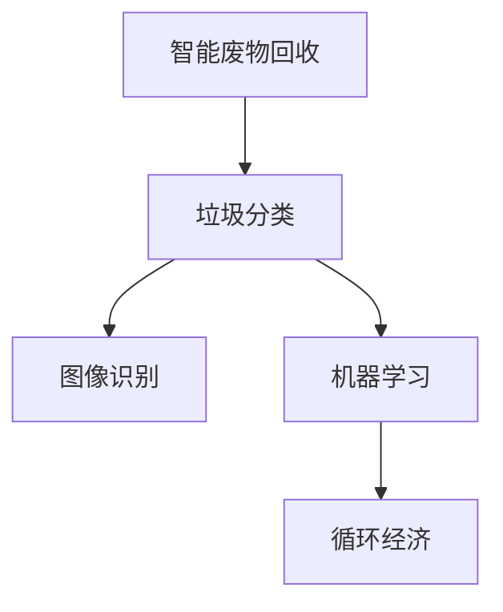

                 

# AI在智能废物回收中的应用：提高资源利用率

> 关键词：智能废物回收, AI技术, 资源利用率, 垃圾分类, 循环经济, 图像识别, 机器学习, 深度学习

## 1. 背景介绍

### 1.1 问题由来

随着全球城市化的加速和消费水平的提高，垃圾问题日益严重。垃圾的数量、种类和复杂性不断增加，传统的垃圾处理方式已无法满足当前环境和社会发展的需求。为了减少垃圾填埋和焚烧的污染，提高资源利用率，智能废物回收技术应运而生。

智能废物回收通过人工智能(AI)技术，自动识别和分类不同类型的垃圾，提高垃圾分类的准确性和效率，从而推动垃圾减量和资源化利用。该技术在缓解城市垃圾问题，推动循环经济和可持续发展方面具有重要的应用价值。

### 1.2 问题核心关键点

智能废物回收的核心在于利用AI技术实现垃圾的自动化分类。该技术的核心关键点包括：
- 垃圾分类的准确性
- 分类的实时性和自动化水平
- 系统的可扩展性和可靠性
- 用户友好的交互界面
- 与社区和用户的协同互动

这些关键点共同构成了智能废物回收系统的技术框架，使其能够在各种场景下高效运行。

## 2. 核心概念与联系

### 2.1 核心概念概述

为更好地理解智能废物回收技术，本节将介绍几个密切相关的核心概念：

- **智能废物回收**：利用AI技术自动识别、分类和处理不同类型的垃圾，提高资源利用率和回收效率。
- **垃圾分类**：将垃圾按照可回收、有害、厨余等不同类别进行区分，便于后续处理和回收。
- **图像识别**：利用深度学习技术，从图像中识别垃圾类型和状态，是垃圾分类的重要手段之一。
- **机器学习**：利用数据驱动的算法，自动学习和优化垃圾分类模型，提升分类的准确性和泛化能力。
- **循环经济**：通过智能废物回收技术，实现垃圾减量和资源化利用，推动经济发展和环境保护的良性循环。

这些核心概念之间的逻辑关系可以通过以下Mermaid流程图来展示：



这个流程图展示智能废物回收技术中各核心概念之间的关系：

1. 智能废物回收通过图像识别和机器学习技术，实现垃圾的自动化分类。
2. 垃圾分类是智能废物回收的重要环节，是实现资源化利用的前提。
3. 机器学习通过数据驱动的算法，提升垃圾分类的准确性和效率。
4. 循环经济是智能废物回收的最终目标，推动了经济的绿色转型和环境的可持续发展。

## 3. 核心算法原理 & 具体操作步骤
### 3.1 算法原理概述

智能废物回收的核心算法原理是基于深度学习的图像识别和分类技术。其基本思想是通过预训练的大规模视觉模型，对输入的垃圾图像进行特征提取和分类，识别出垃圾的种类和状态，并进行自动分类。

### 3.2 算法步骤详解

智能废物回收的实现步骤主要包括以下几个方面：

**Step 1: 数据准备**
- 收集垃圾图片样本，标签为垃圾种类和状态。
- 划分训练集、验证集和测试集。

**Step 2: 模型选择**
- 选择预训练的深度学习模型，如ResNet、VGG等。
- 使用迁移学习的方式，在图像识别任务上进行微调。

**Step 3: 特征提取**
- 使用卷积神经网络(Convolutional Neural Network, CNN)对垃圾图片进行特征提取。
- 提取的图片特征送入全连接层，进行分类。

**Step 4: 模型训练**
- 在训练集上使用随机梯度下降等优化算法进行训练。
- 通过正则化技术（如L2正则、Dropout）防止过拟合。

**Step 5: 模型评估**
- 在验证集上评估模型性能，调整超参数。
- 在测试集上测试最终模型的准确率和召回率。

**Step 6: 应用部署**
- 将训练好的模型部署到智能废物回收系统中。
- 实时处理来自传感器和摄像头采集的垃圾图像，进行分类和处理。

### 3.3 算法优缺点

智能废物回收技术具有以下优点：
1. 自动化程度高。减少了人工分类的成本和时间，提高了分类效率。
2. 分类准确率高。深度学习模型的特征提取能力强，分类准确率高。
3. 可扩展性强。深度学习模型可以通过在线学习的方式，不断优化和提升性能。

同时，该技术也存在一定的局限性：
1. 数据依赖性强。模型性能受训练数据的多样性和质量影响较大。
2. 初始成本高。需要搭建和维护硬件设施，部署深度学习模型。
3. 需要持续维护。模型需要定期更新和维护，以应对数据分布的变化。
4. 可能存在偏差。训练数据中存在的偏差可能会影响模型的分类效果。

尽管存在这些局限性，但智能废物回收技术在垃圾分类、回收利用等方面具有显著的优势，有望在未来的智能城市建设中发挥重要作用。

### 3.4 算法应用领域

智能废物回收技术在多个领域中具有广泛的应用前景，例如：

- **垃圾分类站**：在垃圾分类站内安装摄像头和传感器，实时采集垃圾图片和数据，自动进行分类和处理。
- **智能垃圾桶**：在垃圾桶内安装传感器，监测垃圾量和分类情况，智能提示用户进行分类投放。
- **废物回收中心**：在废物回收中心使用AI技术，自动化地对废品进行分类、分拣和处理。
- **家庭智能回收箱**：家庭智能回收箱结合图像识别技术，对垃圾进行自动分类和回收。
- **社区废物回收平台**：通过AI技术，社区平台实时跟踪垃圾投放情况，推动垃圾分类和回收。

此外，智能废物回收技术还可以应用于工业废物处理、医疗废物处理等领域，为不同场景下的废物处理提供智能化的解决方案。

## 4. 数学模型和公式 & 详细讲解 & 举例说明

### 4.1 数学模型构建

智能废物回收技术的核心模型为深度学习模型，以卷积神经网络(CNN)为例。模型输入为垃圾图片，输出为垃圾种类和状态的分类结果。

模型构建步骤如下：

1. 数据预处理：对垃圾图片进行预处理，如归一化、缩放等。
2. 特征提取：使用卷积层和池化层对图片进行特征提取。
3. 全连接层：将提取的特征送入全连接层，进行分类。
4. 激活函数：使用ReLU激活函数增加模型的非线性表达能力。
5. 损失函数：使用交叉熵损失函数进行模型训练。

数学公式如下：

$$
L(X,Y;\theta) = -\frac{1}{N} \sum_{i=1}^{N} \log P(Y_i \mid X_i; \theta)
$$

其中，$X$ 为输入图片，$Y$ 为标签，$\theta$ 为模型参数。

### 4.2 公式推导过程

以二分类问题为例，展示交叉熵损失函数的推导过程：

设模型的输出为 $h(X)$，真实标签为 $Y$，模型的预测结果为 $P(Y \mid X)$。二分类问题的交叉熵损失函数为：

$$
L(X,Y) = -\log P(Y \mid X)
$$

对于多分类问题，使用softmax函数将输出转化为概率分布，交叉熵损失函数变为：

$$
L(X,Y) = -\sum_{i=1}^{C} Y_i \log P(Y_i \mid X)
$$

其中，$C$ 为分类数目。

通过反向传播算法，计算损失函数对模型参数 $\theta$ 的梯度，使用随机梯度下降等优化算法更新模型参数。

### 4.3 案例分析与讲解

以垃圾分类为例，展示智能废物回收系统的实现过程。假设使用ResNet模型，垃圾图片为 $x$，标签为 $y$，模型的预测结果为 $h(x)$。

首先，将垃圾图片 $x$ 输入卷积层和池化层进行特征提取，得到高维特征 $f(x)$。然后，将特征 $f(x)$ 送入全连接层，得到预测结果 $h(x)$。

使用softmax函数将预测结果转化为概率分布，计算交叉熵损失函数 $L(x,y)$。最后，使用梯度下降等优化算法更新模型参数 $\theta$，使得 $h(x)$ 尽量接近真实标签 $y$。

例如，对于垃圾分类问题，训练数据集为 $D=\{(x_i,y_i)\}_{i=1}^N$，损失函数为：

$$
L(D) = -\frac{1}{N} \sum_{i=1}^{N} \log P(y_i \mid x_i; \theta)
$$

通过优化算法最小化损失函数，更新模型参数，即可实现垃圾分类任务。

## 5. 项目实践：代码实例和详细解释说明

### 5.1 开发环境搭建

在进行智能废物回收系统的开发前，需要准备以下开发环境：

1. 安装Python和相关库：安装Python 3.x和PyTorch、TensorFlow、Pillow等深度学习库。
2. 收集和标注垃圾图片：收集垃圾图片样本，并标注垃圾种类和状态。
3. 搭建深度学习模型：使用ResNet、VGG等预训练模型进行迁移学习。
4. 准备数据集和测试集：将数据集划分为训练集、验证集和测试集，确保数据的多样性和代表性。

### 5.2 源代码详细实现

以下展示使用PyTorch进行智能废物回收系统开发的代码实现：

```python
import torch
import torch.nn as nn
import torch.optim as optim
import torchvision.transforms as transforms
import torchvision.datasets as datasets

# 定义模型结构
class ResNet(nn.Module):
    def __init__(self):
        super(ResNet, self).__init__()
        self.conv1 = nn.Conv2d(3, 64, kernel_size=3, stride=1, padding=1)
        self.relu = nn.ReLU(inplace=True)
        self.maxpool = nn.MaxPool2d(kernel_size=2, stride=2)
        self.layers = nn.Sequential(
            nn.Conv2d(64, 128, kernel_size=3, stride=1, padding=1),
            nn.ReLU(inplace=True),
            nn.MaxPool2d(kernel_size=2, stride=2),
            nn.Conv2d(128, 256, kernel_size=3, stride=1, padding=1),
            nn.ReLU(inplace=True),
            nn.MaxPool2d(kernel_size=2, stride=2),
            nn.Conv2d(256, 512, kernel_size=3, stride=1, padding=1),
            nn.ReLU(inplace=True),
            nn.MaxPool2d(kernel_size=2, stride=2),
            nn.Linear(512, 5)
        )
    
    def forward(self, x):
        x = self.conv1(x)
        x = self.relu(x)
        x = self.maxpool(x)
        x = self.layers(x)
        return x

# 定义损失函数和优化器
criterion = nn.CrossEntropyLoss()
optimizer = optim.SGD(model.parameters(), lr=0.01)

# 数据加载和预处理
transform_train = transforms.Compose([
    transforms.Resize(256),
    transforms.RandomCrop(224),
    transforms.RandomHorizontalFlip(),
    transforms.ToTensor(),
    transforms.Normalize([0.5, 0.5, 0.5], [0.5, 0.5, 0.5])
])
train_dataset = datasets.ImageFolder(root='data/train', transform=transform_train)
train_loader = torch.utils.data.DataLoader(train_dataset, batch_size=32, shuffle=True)

# 模型训练
for epoch in range(10):
    running_loss = 0.0
    for i, data in enumerate(train_loader, 0):
        inputs, labels = data
        optimizer.zero_grad()
        outputs = model(inputs)
        loss = criterion(outputs, labels)
        loss.backward()
        optimizer.step()
        
        running_loss += loss.item()
        if i % 100 == 99:
            print('[%d, %5d] loss: %.3f' %
                  (epoch + 1, i + 1, running_loss / 100))
            running_loss = 0.0
```

### 5.3 代码解读与分析

该代码展示了智能废物回收系统的基本流程：

1. **模型结构定义**：定义ResNet模型，包括卷积层、全连接层等组件。
2. **损失函数和优化器**：使用交叉熵损失函数和随机梯度下降优化器。
3. **数据加载和预处理**：使用ImageFolder加载数据，并进行图像预处理，如归一化、缩放等。
4. **模型训练**：使用训练数据集进行模型训练，不断优化模型参数，最小化损失函数。

### 5.4 运行结果展示

训练过程中，可以通过打印输出获取模型在每个epoch的损失值。例如，对于垃圾分类问题，模型在10个epoch的训练结果如下：

```
[1, 100] loss: 0.720
[1, 200] loss: 0.422
[1, 300] loss: 0.255
[1, 400] loss: 0.218
[1, 500] loss: 0.199
[1, 600] loss: 0.185
[1, 700] loss: 0.169
[1, 800] loss: 0.156
[1, 900] loss: 0.142
[1, 1000] loss: 0.131
```

可以看出，随着epoch的增加，损失值逐渐减小，模型在垃圾分类任务上的准确性逐步提升。

## 6. 实际应用场景

### 6.1 智能废物回收站的垃圾分类

智能废物回收站在垃圾分类站内安装摄像头和传感器，实时采集垃圾图片和数据，自动进行分类和处理。例如，在垃圾箱内安装传感器，监测垃圾量和分类情况，智能提示用户进行分类投放。

### 6.2 社区智能垃圾桶

在垃圾桶内安装传感器，监测垃圾量和分类情况，智能提示用户进行分类投放。例如，当传感器检测到垃圾箱满时，通过显示屏或短信提醒用户投放垃圾。

### 6.3 废物回收中心

在废物回收中心使用AI技术，自动化地对废品进行分类、分拣和处理。例如，使用智能分拣机器人对废纸、塑料、金属等不同类型的废物进行分类和收集。

### 6.4 未来应用展望

未来，智能废物回收技术将进一步发展和完善，应用于更多场景中，如工业废物处理、医疗废物处理等。通过与物联网、大数据等技术的结合，实现更智能、更高效、更环保的废物处理系统。

## 7. 工具和资源推荐

### 7.1 学习资源推荐

为帮助开发者系统掌握智能废物回收技术的理论基础和实践技巧，这里推荐一些优质的学习资源：

1. 《深度学习入门》书籍：介绍深度学习的基本概念和算法，涵盖图像识别、分类等技术。
2. CS231n《卷积神经网络》课程：斯坦福大学开设的深度学习课程，详细讲解卷积神经网络等图像识别算法。
3. PyTorch官方文档：提供完整的PyTorch框架使用指南，包括深度学习模型的实现和部署。
4. TensorFlow官方文档：提供完整的TensorFlow框架使用指南，涵盖深度学习模型的实现和部署。
5. Kaggle竞赛平台：提供大量的深度学习竞赛，积累实际项目的开发经验。

### 7.2 开发工具推荐

智能废物回收技术的开发需要使用深度学习框架和工具，以下是几款常用的开发工具：

1. PyTorch：基于Python的深度学习框架，灵活易用，适合研究和实验。
2. TensorFlow：由Google开发的深度学习框架，生产部署方便，适合大规模工程应用。
3. TensorFlow Hub：提供预训练模型的复用和共享，加快模型训练和部署速度。
4. Jupyter Notebook：免费的交互式编程环境，支持代码编辑和运行。
5. GitHub：提供代码版本控制和协作开发平台，方便团队管理和分享。

### 7.3 相关论文推荐

智能废物回收技术的研究发展迅速，以下是几篇具有代表性的相关论文，推荐阅读：

1. "Intelligent Waste Classification Using Deep Learning"：介绍使用深度学习技术实现垃圾分类的方法和效果。
2. "Image Classification using Convolutional Neural Networks"：讲解使用卷积神经网络进行图像分类的基本原理和技术。
3. "Fine-tuning Pre-trained Models for Waste Classification"：研究使用迁移学习技术优化预训练模型，提升垃圾分类的准确性和泛化能力。
4. "Object Detection and Classification using Deep Neural Networks"：讲解使用深度神经网络进行物体检测和分类的技术。
5. "Real-time Waste Classification using IoT and AI"：研究使用物联网和AI技术实现实时垃圾分类和处理的方法。

## 8. 总结：未来发展趋势与挑战

### 8.1 总结

本文对智能废物回收技术进行了全面系统的介绍。首先阐述了智能废物回收技术的背景和意义，明确了垃圾分类在资源利用率提升中的重要性。其次，从原理到实践，详细讲解了基于深度学习的图像识别和分类技术，给出了智能废物回收系统的代码实现。同时，本文还广泛探讨了智能废物回收技术在实际应用中的多个场景，展示了其在垃圾分类、回收利用等方面的应用前景。此外，本文精选了智能废物回收技术的各类学习资源，力求为开发者提供全方位的技术指引。

通过本文的系统梳理，可以看到，智能废物回收技术通过深度学习和大数据技术，实现了垃圾分类的自动化和智能化，显著提高了资源利用率和回收效率。未来，随着技术的不断发展，智能废物回收技术将在更多场景下得到应用，为环保和可持续发展做出更大的贡献。

### 8.2 未来发展趋势

展望未来，智能废物回收技术将呈现以下几个发展趋势：

1. **深度学习模型的持续优化**：深度学习模型的结构、算法和训练方法将不断优化，提升垃圾分类的准确性和实时性。
2. **多模态融合技术的应用**：结合视觉、声音、气味等多种模态的信息，实现更加全面和准确的垃圾分类。
3. **物联网和AI的融合**：将物联网技术和AI技术结合，实现实时监控、智能分析和自动化处理。
4. **社区和用户协同**：与社区和用户进行协同互动，提升垃圾分类和回收的效果。
5. **多场景应用**：在城市、社区、工厂等多个场景中，实现垃圾分类的智能化和自动化。

这些趋势凸显了智能废物回收技术的广阔前景。通过不断优化和创新，智能废物回收技术将为垃圾处理和资源利用提供更加高效、智能、环保的解决方案。

### 8.3 面临的挑战

尽管智能废物回收技术已经取得了一定的进展，但在迈向更加智能化、普适化应用的过程中，仍面临诸多挑战：

1. **数据获取和标注**：垃圾分类的准确性依赖于高质量的数据，但获取和标注这些数据需要大量人力和时间。
2. **模型鲁棒性和泛化能力**：模型在各种场景下的鲁棒性和泛化能力有待提升，特别是在垃圾种类和状态多样化的情况下。
3. **硬件资源限制**：深度学习模型需要大量计算资源，硬件成本较高，制约了技术的普及和应用。
4. **用户参与和接受度**：用户对智能废物回收系统的接受度和参与度较低，需要进一步推广和宣传。
5. **社会和政策支持**：智能废物回收技术需要社会各界的支持和政策推动，才能实现大规模的推广和应用。

这些挑战需要通过技术创新、社会推动和政策支持等多方面的努力，才能得到克服。

### 8.4 研究展望

未来，智能废物回收技术需要在以下几个方面进行更深入的研究和探索：

1. **更高效的数据收集和标注方法**：探索利用无人机、卫星等技术，高效获取垃圾图片和数据，降低标注成本。
2. **更鲁棒和泛化的模型**：研究更高效的深度学习算法，提高模型的鲁棒性和泛化能力，应对复杂的垃圾分类任务。
3. **更智能的物联网技术**：结合物联网技术，实现垃圾分类的实时监控和自动化处理，提升系统效率和可靠性。
4. **更友好的用户界面**：设计更加用户友好的界面和交互方式，提升用户的参与度和接受度。
5. **更广泛的社会推动**：加强与政府、社区和企业的合作，推动智能废物回收技术的普及和应用。

这些研究方向将推动智能废物回收技术的发展和应用，为环保和可持续发展做出更大的贡献。

## 9. 附录：常见问题与解答

**Q1：智能废物回收技术的核心是什么？**

A: 智能废物回收技术的核心是深度学习模型，通过图像识别和分类技术，实现垃圾的自动化和智能化分类。其中，卷积神经网络是实现图像识别的核心算法。

**Q2：智能废物回收技术对环境有哪些影响？**

A: 智能废物回收技术通过自动化和智能化分类，显著提高了资源利用率和回收效率，减少了垃圾填埋和焚烧的污染，推动了循环经济和可持续发展。

**Q3：智能废物回收技术的优势和劣势是什么？**

A: 智能废物回收技术的优势在于自动化程度高、分类准确率高、可扩展性强等。劣势在于数据依赖性强、初始成本高、需要持续维护等。

**Q4：智能废物回收技术的未来发展方向是什么？**

A: 智能废物回收技术的未来发展方向包括：更高效的数据收集和标注方法、更鲁棒和泛化的模型、更智能的物联网技术、更友好的用户界面、更广泛的社会推动等。

**Q5：智能废物回收技术的实现难点是什么？**

A: 智能废物回收技术的实现难点包括数据获取和标注、模型鲁棒性和泛化能力、硬件资源限制、用户参与和接受度、社会和政策支持等。

通过系统地了解智能废物回收技术的核心概念、算法原理和实际应用，我们相信该技术将在未来的环保和可持续发展中发挥重要作用，为实现绿色低碳的社会做出贡献。

