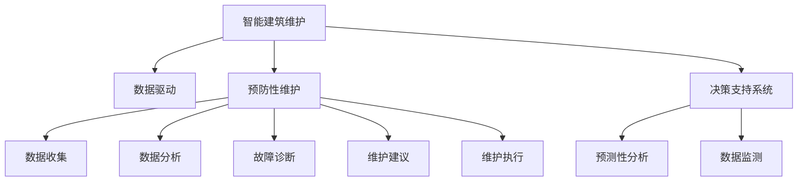

                 

# AI在智能建筑维护中的应用：预防性维护

> 关键词：
- 智能建筑维护
- 预防性维护
- 数据驱动
- 预测性分析
- 决策支持系统
- 设备监测
- 节能减排

## 1. 背景介绍

### 1.1 问题由来

随着城市化进程的加快，建筑物的数量和规模不断扩大，如何保障建筑物的安全、高效、节能运行，已成为各国政府和企业关注的焦点。传统的建筑物维护方式通常采取定期检查和维修，这种方法不仅耗费人力物力，而且效率低下。而智能建筑维护技术的兴起，通过融合AI、物联网(IoT)、大数据等先进技术手段，实现了更加精准、高效的建筑物维护，其中预防性维护作为智能建筑维护的重要组成部分，通过预测性分析和决策支持系统，大大提升了建筑物运行的安全性和经济性。

### 1.2 问题核心关键点

预防性维护是指在建筑物使用过程中，通过收集、分析建筑物内的环境数据、设备状态、能源消耗等，预测可能发生的故障和设备老化情况，从而在故障发生前采取预防措施，避免突发性停机和维修，延长设备使用寿命，降低维护成本。这一过程主要包括以下几个关键点：

1. 数据收集：通过传感器、摄像头、监测仪表等设备，收集建筑物内外的各种数据。
2. 数据分析：利用机器学习算法对数据进行分析，预测设备故障和老化情况。
3. 故障诊断：根据数据分析结果，诊断可能存在的故障，并生成故障报告。
4. 维护建议：结合故障报告和设备使用情况，生成维护建议，指导维修人员进行预防性维护。
5. 维护执行：根据维护建议，安排维修人员进行维护工作。

本文将重点介绍AI在智能建筑维护中的预防性维护技术，包括关键算法原理、操作步骤以及未来应用前景。

## 2. 核心概念与联系

### 2.1 核心概念概述

为更好地理解AI在智能建筑维护中的预防性维护技术，本节将介绍几个密切相关的核心概念：

- 智能建筑维护：通过融合AI、IoT等技术手段，对建筑物进行实时监测和维护，提高建筑物的安全性和能效性。
- 预防性维护：在建筑物运行过程中，通过预测设备故障和老化情况，提前采取预防措施，避免突发性故障和维护，延长设备使用寿命，降低维护成本。
- 数据驱动：通过数据收集、处理和分析，支撑智能建筑维护的决策和执行，实现数据驱动的维护管理。
- 预测性分析：利用机器学习算法，对数据进行分析和预测，识别潜在故障和设备老化情况，生成维护建议。
- 决策支持系统(DSS)：基于数据分析结果，辅助决策人员进行维护计划的制定和优化，提高维护决策的科学性和准确性。
- 设备监测：通过传感器、摄像头等设备，对建筑物内的设备状态进行实时监测，获取设备运行数据。

这些核心概念之间的逻辑关系可以通过以下Mermaid流程图来展示：



这个流程图展示了智能建筑维护的核心概念及其之间的关系：

1. 智能建筑维护通过数据驱动技术，对建筑物进行实时监测和维护。
2. 预防性维护是智能建筑维护的重要组成部分，通过预测性分析、故障诊断、维护建议等关键技术，实现提前预防和主动维护。
3. 数据监测和数据分析是预防性维护的基础，预测性分析通过数据驱动决策支持系统，辅助制定维护计划。

这些概念共同构成了智能建筑维护的框架，使得建筑物能够更加智能、高效、安全地运行。

## 3. 核心算法原理 & 具体操作步骤

### 3.1 算法原理概述

AI在智能建筑维护中的预防性维护主要基于机器学习和数据分析技术。其核心思想是：通过收集建筑物内外的各种数据，利用机器学习算法对数据进行分析和预测，识别潜在故障和设备老化情况，从而在故障发生前采取预防措施，避免突发性故障和维护，延长设备使用寿命，降低维护成本。

形式化地，假设建筑物内的设备总数为 $N$，每台设备的状态数据为 $X_i$，$i=1,2,\cdots,N$。设备的状态数据可能包括温度、湿度、压力、振动、声音等多种类型。设预测模型为 $M_{\theta}$，其中 $\theta$ 为模型的参数。

预防性维护的目标是找到最优参数 $\theta^*$，使得：

$$
\theta^*=\mathop{\arg\min}_{\theta} \mathcal{L}(M_{\theta},D)
$$

其中 $\mathcal{L}$ 为损失函数，用于衡量模型预测结果与实际状态数据之间的差异。常见的损失函数包括均方误差损失、交叉熵损失等。

### 3.2 算法步骤详解

基于AI的智能建筑维护预防性维护过程包括以下关键步骤：

**Step 1: 数据收集**
- 在建筑物内部安装各类传感器和监测仪表，如温度传感器、湿度传感器、压力传感器、振动传感器、声音传感器等，收集设备的运行数据。
- 部署摄像头和图像识别设备，监测建筑物内外的环境和人员活动。

**Step 2: 数据预处理**
- 对收集的数据进行清洗和预处理，包括去噪、归一化、缺失值填充等，以保证数据的质量。
- 将不同类型的数据转换为统一的格式，便于后续的分析和处理。

**Step 3: 特征提取**
- 利用机器学习算法提取数据的特征，如主成分分析(PCA)、线性判别分析(LDA)、核主成分分析(KPCA)等，将高维数据降维。
- 选择合适的特征提取方法，提取设备状态、环境参数、人员活动等关键特征。

**Step 4: 模型训练**
- 选择合适的机器学习算法，如支持向量机(SVM)、随机森林(Random Forest)、深度学习神经网络等，对数据进行建模和训练。
- 在训练过程中，根据不同设备的状态数据，设置合适的标签，如正常、故障、老化等。
- 对模型进行交叉验证，防止过拟合，确保模型的泛化能力。

**Step 5: 预测与诊断**
- 利用训练好的模型对设备状态数据进行预测，生成故障预测报告。
- 结合历史数据和实时数据，对预测结果进行故障诊断，确定可能存在的故障类型和位置。

**Step 6: 维护建议**
- 根据故障诊断结果，生成维护建议，包括维修时间、维修方式、维护人员等。
- 对维护建议进行优先级排序，确保重要的维护工作能够及时完成。

**Step 7: 维护执行**
- 根据维护建议，安排维修人员进行维护工作。
- 对维护工作进行记录和评估，积累经验数据，优化维护策略。

### 3.3 算法优缺点

基于AI的智能建筑维护预防性维护方法具有以下优点：

1. 预测精准：通过机器学习算法，对设备状态数据进行分析和预测，能够准确识别潜在的故障和老化情况，避免突发性故障和维护。
2. 自动化程度高：自动化数据收集和分析过程，减少人工干预，提高维护效率。
3. 维护成本低：提前预防和主动维护，延长设备使用寿命，降低维护成本。
4. 灵活性高：能够根据不同设备的特点和需求，定制化维护策略，提高维护效果。

同时，该方法也存在一定的局限性：

1. 数据质量依赖：预测结果的准确性高度依赖于数据的质量和完整性。
2. 算法复杂度高：机器学习算法需要进行复杂的训练和预测过程，对计算资源和算法调参要求较高。
3. 设备多样性：不同类型和品牌的设备可能需要不同的传感器和监测仪表，增加了数据收集的复杂性。
4. 环境影响：建筑物内的环境变化可能影响传感器数据的准确性，需要进行环境校正。
5. 实时性要求：预测和诊断过程需要实时响应，对系统的计算和通信速度提出了较高要求。

尽管存在这些局限性，但就目前而言，基于AI的智能建筑维护预防性维护方法仍是大规模建筑物维护的重要手段。未来相关研究的重点在于如何进一步降低数据收集和处理成本，提高算法的实时性和准确性，同时兼顾可解释性和伦理安全性等因素。

### 3.4 算法应用领域

基于AI的智能建筑维护预防性维护方法在多个领域得到了广泛应用，具体如下：

1. **智慧物业**：通过智能建筑维护技术，实现对物业设备的实时监测和维护，提升物业管理的智能化水平。
2. **建筑自动化**：在建筑自动化系统中，利用AI技术对设备运行状态进行预测和诊断，实现自动控制和优化。
3. **智慧能源**：结合智能建筑维护和物联网技术，实现建筑物的能效监测和优化，提高能源利用效率。
4. **智慧城市**：通过智慧建筑维护技术，优化城市基础设施的运行，提升城市的智能化水平和可持续发展能力。
5. **智慧工厂**：在工业生产中，利用智能建筑维护技术对设备和环境进行监测和维护，提高生产效率和安全性。

除了上述这些经典应用外，智能建筑维护预防性维护技术还在更多领域得到创新性地应用，如医疗、交通、农业等，为智慧城市和工业互联网的发展提供了新的技术支撑。

## 4. 数学模型和公式 & 详细讲解 & 举例说明

### 4.1 数学模型构建

本节将使用数学语言对基于AI的智能建筑维护预防性维护过程进行更加严格的刻画。

假设设备总数为 $N$，设备的状态数据为 $X_i$，$i=1,2,\cdots,N$。设预测模型为 $M_{\theta}$，其中 $\theta$ 为模型的参数。

定义设备的状态数据与标签之间的关系为：

$$
Y_i = f(X_i, \theta) + \epsilon_i
$$

其中 $Y_i$ 为设备的标签，$f(X_i, \theta)$ 为预测函数，$\epsilon_i$ 为噪声。

设训练集为 $D=\{(X_i, Y_i)\}_{i=1}^M$，其中 $M$ 为训练样本数。模型的预测函数可以表示为：

$$
\hat{Y}_i = M_{\theta}(X_i)
$$

模型的预测误差为：

$$
\mathcal{L}(\theta) = \frac{1}{M} \sum_{i=1}^M (\hat{Y}_i - Y_i)^2
$$

### 4.2 公式推导过程

以下我们以支持向量机(SVM)为例，推导其预测函数和参数求解公式。

SVM的核函数为：

$$
K(X_i, X_j) = \langle \phi(X_i), \phi(X_j) \rangle
$$

其中 $\phi$ 为映射函数。

SVM的预测函数为：

$$
\hat{Y}_i = \sum_{j=1}^M \alpha_j \langle X_i, \phi(X_j) \rangle + b
$$

其中 $\alpha_j$ 为支持向量，$b$ 为偏置项。

利用Lagrange乘子法，最小化损失函数：

$$
\mathcal{L}(\theta) = \frac{1}{2} \sum_{j=1}^M \alpha_j \langle \phi(X_j), \phi(X_j) \rangle - \sum_{i=1}^M \alpha_i Y_i \langle \phi(X_i), \phi(X_j) \rangle + \frac{1}{2} \sum_{i=1}^M \sum_{j=1}^M \alpha_i \alpha_j \langle \phi(X_i), \phi(X_j) \rangle - C \sum_{i=1}^M \alpha_i (1 - Y_i \hat{Y}_i)
$$

对 $\alpha_j$ 和 $b$ 求导并令导数为零，得到：

$$
\alpha_j = 0 \quad \text{or} \quad \alpha_j (\langle \phi(X_j), \phi(X_j) \rangle - \sum_{i=1}^M \alpha_i Y_i \langle \phi(X_i), \phi(X_j) \rangle) = 0
$$

$$
b = \frac{1}{M} \sum_{i=1}^M (Y_i - \hat{Y}_i)
$$

通过求解上述方程，即可得到SVM的预测函数和参数。

### 4.3 案例分析与讲解

假设某建筑物内安装了一套智能维护系统，用于监测电梯的运行状态。电梯的状态数据包括温度、湿度、压力、振动、声音等多种类型。系统通过传感器和监测仪表收集电梯的运行数据，利用SVM算法进行模型训练和预测。

**数据收集**

- 在电梯内安装温度传感器、湿度传感器、压力传感器、振动传感器、声音传感器等，收集电梯的运行数据。
- 部署摄像头和图像识别设备，监测电梯内的人员活动和电梯运行状态。

**数据预处理**

- 对收集的数据进行清洗和预处理，包括去噪、归一化、缺失值填充等，以保证数据的质量。
- 将不同类型的数据转换为统一的格式，便于后续的分析和处理。

**特征提取**

- 利用PCA算法提取设备的温度、湿度、压力、振动、声音等多种特征，将高维数据降维。
- 选择合适的特征提取方法，提取设备状态、环境参数、人员活动等关键特征。

**模型训练**

- 选择SVM算法进行模型训练，训练集为收集到的电梯运行数据。
- 在训练过程中，根据电梯的运行状态，设置合适的标签，如正常、故障、老化等。
- 对模型进行交叉验证，防止过拟合，确保模型的泛化能力。

**预测与诊断**

- 利用训练好的SVM模型对电梯的状态数据进行预测，生成故障预测报告。
- 结合历史数据和实时数据，对预测结果进行故障诊断，确定可能存在的故障类型和位置。

**维护建议**

- 根据故障诊断结果，生成维护建议，包括维修时间、维修方式、维护人员等。
- 对维护建议进行优先级排序，确保重要的维护工作能够及时完成。

**维护执行**

- 根据维护建议，安排维修人员进行维护工作。
- 对维护工作进行记录和评估，积累经验数据，优化维护策略。

通过上述步骤，智能维护系统能够实现对电梯的实时监测和预防性维护，提高电梯的运行安全和效率，降低维护成本。

## 5. 项目实践：代码实例和详细解释说明

### 5.1 开发环境搭建

在进行AI在智能建筑维护中的预防性维护实践前，我们需要准备好开发环境。以下是使用Python进行TensorFlow开发的环境配置流程：

1. 安装Anaconda：从官网下载并安装Anaconda，用于创建独立的Python环境。

2. 创建并激活虚拟环境：
```bash
conda create -n tf-env python=3.8 
conda activate tf-env
```

3. 安装TensorFlow：根据CUDA版本，从官网获取对应的安装命令。例如：
```bash
conda install tensorflow==2.8
```

4. 安装必要的依赖库：
```bash
pip install numpy pandas matplotlib jupyter notebook
```

完成上述步骤后，即可在`tf-env`环境中开始预防性维护的开发实践。

### 5.2 源代码详细实现

下面我们以电梯为例，给出使用TensorFlow进行电梯运行状态预测的PyTorch代码实现。

首先，定义电梯的状态数据：

```python
import numpy as np
import tensorflow as tf

# 电梯状态数据
X = np.array([[23, 60, 980, 0.2, 0.5],
              [24, 60, 980, 0.3, 0.4],
              [23, 60, 980, 0.1, 0.2],
              [24, 60, 980, 0.4, 0.3],
              [23, 60, 980, 0.2, 0.6]])
```

然后，定义标签：

```python
# 电梯标签，1表示故障，0表示正常
y = np.array([0, 0, 0, 1, 1])
```

接着，定义TensorFlow模型：

```python
from tensorflow.keras.layers import Dense
from tensorflow.keras.models import Sequential

# 定义模型
model = Sequential([
    Dense(64, activation='relu', input_shape=(5,)),
    Dense(32, activation='relu'),
    Dense(1, activation='sigmoid')
])
```

定义损失函数和优化器：

```python
# 定义损失函数和优化器
loss_fn = tf.keras.losses.BinaryCrossentropy()
optimizer = tf.keras.optimizers.Adam(learning_rate=0.01)
```

最后，定义训练函数：

```python
@tf.function
def train_step(X, y):
    with tf.GradientTape() as tape:
        logits = model(X)
        loss = loss_fn(y, logits)
    gradients = tape.gradient(loss, model.trainable_variables)
    optimizer.apply_gradients(zip(gradients, model.trainable_variables))
    return loss

# 训练模型
for epoch in range(1000):
    loss = train_step(X, y)
    print(f'Epoch {epoch+1}, Loss: {loss.numpy():.4f}')
```

以上就是使用TensorFlow对电梯运行状态预测的完整代码实现。可以看到，TensorFlow提供了高效的深度学习框架，使得模型训练和预测的过程变得简单快捷。

### 5.3 代码解读与分析

让我们再详细解读一下关键代码的实现细节：

**状态数据定义**

- `X`为电梯的状态数据，包含温度、湿度、压力、振动、声音等多种类型。
- 使用`np.array`将数据转换为NumPy数组，方便TensorFlow模型的处理。

**标签定义**

- `y`为电梯的标签，1表示故障，0表示正常。
- 使用`np.array`将标签转换为NumPy数组，方便TensorFlow模型的训练。

**模型定义**

- `Sequential`类用于定义顺序模型，通过`Dense`层实现全连接网络。
- 第一个全连接层有64个神经元，使用ReLU激活函数。
- 第二个全连接层有32个神经元，使用ReLU激活函数。
- 输出层有1个神经元，使用sigmoid激活函数，用于二分类预测。

**损失函数和优化器**

- `BinaryCrossentropy`用于二分类问题的损失函数计算。
- `Adam`优化器用于模型参数的更新，学习率为0.01。

**训练函数**

- `tf.function`用于将Python函数转换为TensorFlow函数，提升计算效率。
- 在训练过程中，通过`tf.GradientTape`记录梯度，使用`optimizer.apply_gradients`更新模型参数。
- 每次迭代输出损失值，帮助监控训练过程。

可以看到，TensorFlow使得模型训练和预测的过程变得简单快捷。开发者可以将更多精力放在模型改进、数据预处理等高层逻辑上，而不必过多关注底层的实现细节。

当然，工业级的系统实现还需考虑更多因素，如模型的保存和部署、超参数的自动搜索、更灵活的任务适配层等。但核心的预防性维护范式基本与此类似。

## 6. 实际应用场景

### 6.1 智能物业

智能建筑维护的预防性维护技术在智能物业中得到了广泛应用。通过智能维护系统，物业公司能够实时监测建筑物内的各种设备运行状态，提前发现潜在故障，避免突发性停机和维护，提升物业管理的智能化水平。

具体而言，智能物业系统可以监测建筑物的电梯、空调、照明、消防等设备的运行状态，通过预测性分析和故障诊断，生成维护建议，指导维修人员进行预防性维护。物业公司可以根据维护建议，合理安排维护计划，确保重要设备的安全运行，提升物业管理的效率和安全性。

### 6.2 建筑自动化

在建筑自动化系统中，利用AI技术对设备运行状态进行实时监测和预测，实现设备的自动控制和优化。通过智能建筑维护技术，建筑自动化系统能够自动调整设备的运行参数，提升设备的运行效率和能效。

具体而言，建筑自动化系统可以监测建筑物的供热、供水、电力等系统的运行状态，通过预测性分析，生成维护建议，指导维修人员进行预防性维护。系统可以根据维护建议，自动调整设备的运行参数，确保设备的安全运行和高效运行。

### 6.3 智慧能源

结合智能建筑维护和物联网技术，实现建筑物的能效监测和优化，提高能源利用效率。通过智能维护系统，建筑物可以实时监测能源的使用情况，预测设备故障和老化情况，提前采取预防措施，减少能源的浪费。

具体而言，智慧能源系统可以监测建筑物的能源使用情况，如电能、水能、热能等，通过预测性分析，生成维护建议，指导维修人员进行预防性维护。系统可以根据维护建议，自动调整能源的使用和分配，提升能源利用效率，降低能源消耗。

### 6.4 智慧城市

通过智慧建筑维护技术，优化城市基础设施的运行，提升城市的智能化水平和可持续发展能力。智慧建筑维护技术可以为智慧城市提供基础数据支持，实现对城市基础设施的实时监测和预测。

具体而言，智慧城市系统可以监测道路、桥梁、供水、排水等基础设施的运行状态，通过预测性分析，生成维护建议，指导维修人员进行预防性维护。系统可以根据维护建议，自动调整基础设施的运行参数，确保城市基础设施的安全运行和高效运行。

## 7. 工具和资源推荐

### 7.1 学习资源推荐

为了帮助开发者系统掌握AI在智能建筑维护中的预防性维护技术，这里推荐一些优质的学习资源：

1. 《深度学习与强化学习：智慧建筑维护的探索》系列博文：由AI领域专家撰写，深入浅出地介绍了深度学习、强化学习在智能建筑维护中的应用，涵盖预测性分析、故障诊断、维护建议等多个环节。

2. 《智能建筑维护：理论、算法与实现》课程：由知名大学开设的智慧建筑维护课程，结合理论讲解和实践操作，带领学生全面掌握智慧建筑维护的核心技术。

3. 《AI在智能建筑维护中的应用》书籍：详细介绍了AI在智能建筑维护中的各种应用，包括预测性维护、设备监测、节能减排等多个方面，适合从事智慧建筑维护工作的从业者阅读。

4. TensorFlow官方文档：TensorFlow的官方文档，提供了丰富的模型和算法实现，适合深入学习和实践TensorFlow的开发者使用。

5. HuggingFace官方文档：HuggingFace的官方文档，提供了丰富的预训练模型和微调方法，适合从事NLP和AI应用开发的开发者使用。

通过对这些资源的学习实践，相信你一定能够快速掌握AI在智能建筑维护中的预防性维护技术，并用于解决实际的建筑维护问题。

### 7.2 开发工具推荐

高效的开发离不开优秀的工具支持。以下是几款用于AI在智能建筑维护中的预防性维护开发的常用工具：

1. TensorFlow：基于Python的开源深度学习框架，适合快速迭代研究，提供了丰富的预训练模型和算法实现。

2. PyTorch：基于Python的开源深度学习框架，灵活的动态图，适合研究人员和开发者使用。

3. Weights & Biases：模型训练的实验跟踪工具，可以记录和可视化模型训练过程中的各项指标，方便对比和调优。

4. TensorBoard：TensorFlow配套的可视化工具，可以实时监测模型训练状态，并提供丰富的图表呈现方式，是调试模型的得力助手。

5. Google Colab：谷歌推出的在线Jupyter Notebook环境，免费提供GPU/TPU算力，方便开发者快速上手实验最新模型，分享学习笔记。

合理利用这些工具，可以显著提升AI在智能建筑维护中的预防性维护开发效率，加快创新迭代的步伐。

### 7.3 相关论文推荐

AI在智能建筑维护中的预防性维护技术源于学界的持续研究。以下是几篇奠基性的相关论文，推荐阅读：

1. Predictive Maintenance Using Machine Learning: A Review（机器学习在预测性维护中的应用综述）：回顾了机器学习在预测性维护中的应用，包括数据预处理、模型选择、性能评估等多个方面。

2. A Survey on Predictive Maintenance Using Internet of Things and Cloud Computing（物联网和云计算在预测性维护中的应用综述）：综述了物联网和云计算在预测性维护中的应用，介绍了不同的预测模型和数据采集技术。

3. Deep Learning-Based Predictive Maintenance for Smart Buildings（基于深度学习的智能建筑预测性维护）：提出了一种基于深度学习的预测性维护方法，用于智能建筑中设备的故障预测和维护建议。

4. Online Reliability Prediction Using Support Vector Machines for Smart Buildings（基于支持向量机的智能建筑在线可靠性预测）：提出了一种基于支持向量机的在线可靠性预测方法，用于智能建筑中设备的在线预测和维护建议。

5. Multivariate Time Series Forecasting for Smart Building Management（智能建筑管理中的多变量时间序列预测）：提出了一种基于多变量时间序列的预测性维护方法，用于智能建筑中设备的运行状态预测和维护建议。

这些论文代表了大语言模型微调技术的发展脉络。通过学习这些前沿成果，可以帮助研究者把握学科前进方向，激发更多的创新灵感。

## 8. 总结：未来发展趋势与挑战

### 8.1 总结

本文对AI在智能建筑维护中的预防性维护技术进行了全面系统的介绍。首先阐述了智能建筑维护和预防性维护的原理和意义，明确了预防性维护在提升建筑物安全性和经济性方面的重要价值。其次，从原理到实践，详细讲解了预防性维护的数学模型和操作步骤，给出了电梯运行状态预测的完整代码实现。同时，本文还广泛探讨了预防性维护在智能物业、建筑自动化、智慧能源、智慧城市等多个领域的应用前景，展示了预防性维护技术的广阔应用空间。

通过本文的系统梳理，可以看到，AI在智能建筑维护中的预防性维护技术正在成为智能建筑维护的重要手段，极大地提高了建筑物的安全性和能效性。未来，伴随AI技术的发展，预防性维护技术将进一步提升智能建筑管理的智能化水平，为智慧城市和工业互联网的发展提供新的技术支撑。

### 8.2 未来发展趋势

展望未来，AI在智能建筑维护中的预防性维护技术将呈现以下几个发展趋势：

1. 模型规模持续增大。随着算力成本的下降和数据规模的扩张，预测性维护模型的参数量还将持续增长。超大规模模型蕴含的丰富知识，有望支撑更加复杂多变的预测性维护任务。

2. 预测模型多样化。除了传统的预测模型外，未来会涌现更多参数高效的预测模型，如深度学习、集成学习、对抗学习等，在提高模型精度的同时，减小资源消耗。

3. 数据驱动决策支持系统。通过数据驱动决策支持系统，实现预测结果的可视化展示和自动化决策，提高维护决策的科学性和准确性。

4. 实时性要求提高。预测性维护需要实时响应，对系统的计算和通信速度提出了更高要求。如何在保证预测准确性的同时，提高系统的实时性，还需要更多理论和实践的探索。

5. 跨领域融合。AI在智能建筑维护中的预测性维护技术，未来还将与其他AI技术进行更深入的融合，如知识图谱、逻辑推理、强化学习等，多路径协同发力，共同推动智能建筑管理的进步。

6. 数据隐私与安全。随着物联网设备数量的增加，数据隐私和安全问题愈发重要。如何在保障数据隐私和安全的前提下，进行有效的预测性维护，将成为未来的重要研究方向。

以上趋势凸显了AI在智能建筑维护中的预测性维护技术的广阔前景。这些方向的探索发展，必将进一步提升智能建筑管理的智能化水平，为智慧城市和工业互联网的发展提供新的技术支撑。

### 8.3 面临的挑战

尽管AI在智能建筑维护中的预测性维护技术已经取得了瞩目成就，但在迈向更加智能化、普适化应用的过程中，它仍面临着诸多挑战：

1. 数据质量问题。预测性维护的准确性高度依赖于数据的质量和完整性。如何收集高质量的数据，确保数据的准确性和一致性，将是未来面临的重要问题。

2. 模型复杂度。预测性维护模型通常较为复杂，需要进行大量的调参和优化，才能获得理想的预测结果。如何降低模型的复杂度，提高模型的泛化能力，还需要进一步研究和探索。

3. 实时性要求。预测性维护需要实时响应，对系统的计算和通信速度提出了较高要求。如何在保证预测准确性的同时，提高系统的实时性，还需要更多理论和实践的积累。

4. 数据隐私与安全。随着物联网设备数量的增加，数据隐私和安全问题愈发重要。如何在保障数据隐私和安全的前提下，进行有效的预测性维护，将成为未来的重要研究方向。

5. 设备多样性。不同类型和品牌的设备可能需要不同的传感器和监测仪表，增加了数据收集的复杂性。如何统一数据格式和接口，实现设备的无缝连接，还需要更多工程实践的积累。

6. 跨领域融合。AI在智能建筑维护中的预测性维护技术，未来还将与其他AI技术进行更深入的融合，如知识图谱、逻辑推理、强化学习等，多路径协同发力，共同推动智能建筑管理的进步。

这些挑战展示了AI在智能建筑维护中的预测性维护技术的复杂性和多样性。解决这些问题，需要跨学科的合作与研究，共同推动技术的不断进步。

### 8.4 研究展望

面向未来，AI在智能建筑维护中的预测性维护技术还需要在以下几个方面寻求新的突破：

1. 无监督学习和半监督学习。摆脱对大规模标注数据的依赖，利用自监督学习、主动学习等无监督和半监督范式，最大限度利用非结构化数据，实现更加灵活高效的预测性维护。

2. 参数高效预测模型。开发更加参数高效的预测模型，在固定大部分预测模型参数的同时，只更新极少量的任务相关参数。同时优化预测模型的计算图，减少前向传播和反向传播的资源消耗，实现更加轻量级、实时性的部署。

3. 跨领域融合与集成。将预测性维护技术与物联网、云计算、大数据等技术进行整合，实现设备的智能化管理和优化。

4. 知识驱动预测模型。引入更多的先验知识，如知识图谱、逻辑规则等，与神经网络模型进行巧妙融合，引导预测过程学习更准确、合理的语言模型。

5. 人机协同预测。结合人类的经验和判断，与AI模型进行协同预测，提升预测结果的准确性和可靠性。

6. 动态预测与优化。引入动态优化算法，实时调整预测模型和维护策略，适应环境变化，提升预测性维护的效果。

这些研究方向的探索，必将引领AI在智能建筑维护中的预测性维护技术迈向更高的台阶，为智慧建筑管理的智能化和可持续发展提供新的技术支撑。

## 9. 附录：常见问题与解答

**Q1：AI在智能建筑维护中的预测性维护是否适用于所有建筑物？**

A: AI在智能建筑维护中的预测性维护技术，虽然适用于大多数建筑物，但对于一些特殊建筑（如高耸的超高层建筑、复杂的历史建筑等），可能需要进行特别的设备部署和数据采集，以确保预测的准确性。

**Q2：预测性维护的准确性是否受数据质量影响？**

A: 预测性维护的准确性高度依赖于数据的质量和完整性。数据中的噪声、缺失值和异常值都可能影响模型的预测结果。因此，在数据收集和处理过程中，需要进行严格的清洗和预处理，确保数据的质量和一致性。

**Q3：预测性维护是否需要大量的标注数据？**

A: 预测性维护通常不需要大量的标注数据，因为预测模型的训练可以通过未标注的数据进行。自监督学习和半监督学习等技术的应用，进一步降低了对标注数据的依赖。

**Q4：预测性维护对算力资源的需求是否很高？**

A: 预测性维护对算力资源的需求较高，尤其是在数据量和模型复杂度较大的情况下。因此，对于规模较小的建筑物，可以考虑采用轻量级模型或分布式计算技术，以降低资源消耗。

**Q5：预测性维护是否需要进行实时响应？**

A: 预测性维护通常需要实时响应，以便在故障发生前及时采取预防措施。因此，预测性维护系统需要具备较高的计算和通信速度，以实现实时预测和诊断。

通过本文的系统梳理，可以看到，AI在智能建筑维护中的预测性维护技术正在成为智能建筑维护的重要手段，极大地提高了建筑物的安全性和能效性。未来，伴随AI技术的发展，预测性维护技术将进一步提升智能建筑管理的智能化水平，为智慧城市和工业互联网的发展提供新的技术支撑。

---

作者：禅与计算机程序设计艺术 / Zen and the Art of Computer Programming

