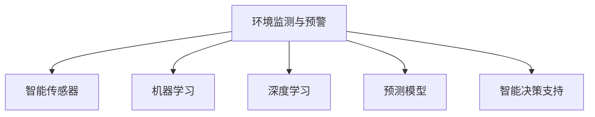

                 

# AI在环境保护中的应用：监测与预警

## 1. 背景介绍

环境保护是一个全球性的重要议题，涉及空气质量、水质监测、气候变化、生物多样性保护等方面。随着人工智能(AI)技术的快速发展，AI在环境保护中的应用日益广泛，特别是利用AI进行环境监测与预警，已成为当前研究的重点之一。

### 1.1 问题由来
近年来，AI技术在自然语言处理(NLP)、图像识别、视频分析等方面的应用取得了显著进展，为环境保护领域带来了新的视角和解决方案。特别是在环境监测和预警方面，AI技术能够快速、准确地处理海量数据，及时发现环境问题并发出预警，极大地提升了环境管理的效率和精度。

### 1.2 问题核心关键点
AI在环境保护中的应用主要集中在以下几个方面：

1. **环境监测**：利用AI技术对环境数据进行实时监测，如水质、空气质量、噪音、温度等。通过智能传感器和网络技术，实时收集环境数据，并使用机器学习模型进行数据分析和预测。

2. **环境预警**：通过AI模型对环境数据进行深度学习和预测，提前预警可能出现的环境问题。例如，通过预测水质变化、大气污染等，及时采取措施，减少环境损害。

3. **环境治理**：使用AI技术进行环境治理决策支持，如智能排污监控、垃圾分类、能源管理等。利用AI模型优化资源分配，提高环境治理效率。

4. **环境数据处理**：AI技术可以处理大规模、复杂的环境数据，通过数据清洗、特征提取、模式识别等技术，提升环境数据分析的准确性和可靠性。

### 1.3 问题研究意义
AI在环境保护中的应用，对于提升环境监测与预警的准确性和效率，减少环境污染和生态破坏，具有重要意义：

1. **提升监测精度**：AI可以处理和分析海量环境数据，提高监测的实时性和准确性。

2. **优化资源配置**：通过智能算法，合理配置环境治理资源，提升治理效率。

3. **减少环境损害**：提前预警环境问题，及时采取措施，减少环境损害和生态破坏。

4. **促进环境治理数字化**：AI技术将传统的环境治理手段数字化、智能化，提高环境管理的科学性和智能化水平。

## 2. 核心概念与联系

### 2.1 核心概念概述

为更好地理解AI在环境保护中的应用，本节将介绍几个密切相关的核心概念：

1. **环境监测与预警**：指通过智能传感器和网络技术，实时收集环境数据，并利用AI技术对数据进行分析，预测和预警可能出现的环境问题。

2. **智能传感器**：指能够自动收集、处理和传输环境数据的传感器，如水质监测传感器、空气质量监测传感器等。

3. **机器学习**：指利用数据和算法，通过训练模型，实现数据自动识别、分类和预测。

4. **深度学习**：指基于神经网络模型，通过多层次的特征提取和分类，实现复杂数据的高精度处理和预测。

5. **预测模型**：指使用机器学习或深度学习模型，对未来环境数据进行预测和预警，如时间序列预测模型、空间回归模型等。

6. **智能决策支持**：指使用AI技术，对环境数据进行分析，为环境治理提供决策支持，如优化资源配置、智能排污监控等。

这些核心概念之间的逻辑关系可以通过以下Mermaid流程图来展示：



这个流程图展示了大语言模型的核心概念及其之间的关系：

1. 环境监测与预警通过智能传感器获取环境数据，同时利用机器学习和深度学习模型对数据进行处理和分析。

2. 预测模型使用机器学习和深度学习模型，对环境数据进行预测和预警，帮助决策者及时采取措施。

3. 智能决策支持通过机器学习和深度学习模型，对环境数据进行分析，为环境治理提供决策支持。

## 3. 核心算法原理 & 具体操作步骤
### 3.1 算法原理概述

AI在环境保护中的应用，主要基于机器学习和深度学习模型进行数据分析和预测。其核心思想是：利用AI技术对环境数据进行实时监测和深度学习，实现环境问题的预测和预警，为环境治理提供决策支持。

形式化地，假设环境监测数据为 $\{(x_i, y_i)\}_{i=1}^N$，其中 $x_i$ 为环境参数，$y_i$ 为环境标签（如污染等级）。AI模型的目标是通过学习历史数据，找到最优模型 $M$，使得：

$$
\hat{y} = M(x)
$$

其中 $\hat{y}$ 为模型对新数据的预测结果，$x$ 为环境监测数据，$M$ 为学习得到的AI模型。

通过梯度下降等优化算法，AI模型不断更新模型参数，最小化预测误差，最终得到适应环境监测与预警任务的最优模型 $M$。

### 3.2 算法步骤详解

AI在环境保护中的应用主要包括以下几个关键步骤：

**Step 1: 数据采集与预处理**
- 使用智能传感器或数据采集器，收集环境监测数据。
- 对数据进行清洗、滤波和标准化处理，去除异常值和噪声。

**Step 2: 特征提取**
- 使用机器学习算法，对环境数据进行特征提取，如PCA降维、主成分分析等。
- 提取重要的特征信息，用于后续的模型训练。

**Step 3: 模型训练**
- 选择适合的环境监测与预警任务，如时间序列预测、空间回归等。
- 使用深度学习模型（如LSTM、GRU等）进行训练，优化模型参数。
- 使用交叉验证等技术，评估模型性能，防止过拟合。

**Step 4: 模型评估与优化**
- 在验证集上评估模型性能，如均方误差、准确率等指标。
- 调整模型参数，优化模型结构，提升模型精度。
- 使用正则化技术，如L2正则、Dropout等，防止过拟合。

**Step 5: 模型部署与应用**
- 将训练好的模型部署到实际应用中，实时处理环境数据。
- 对新数据进行实时预测和预警，提供环境治理决策支持。
- 定期更新模型参数，保持模型性能。

以上是AI在环境保护中应用的通用流程。在实际应用中，还需要针对具体任务进行优化设计，如改进模型结构、调整超参数等，以进一步提升模型性能。

### 3.3 算法优缺点

AI在环境保护中的应用具有以下优点：

1. **高效处理海量数据**：AI模型能够快速处理和分析海量环境数据，提高监测和预警的实时性和准确性。

2. **提升决策支持**：通过深度学习和预测模型，提供精准的环境数据预测和预警，为环境治理提供科学决策支持。

3. **降低人工成本**：AI技术可以自动化环境监测与预警，减少人工干预，提高效率和可靠性。

4. **提升数据质量**：AI模型能够自动处理数据中的噪声和异常值，提升数据的准确性和可靠性。

同时，该方法也存在一些局限性：

1. **数据依赖性强**：AI模型需要大量高质量的环境数据进行训练，对于数据量不足的场景可能表现不佳。

2. **模型复杂度高**：深度学习模型参数量较大，训练和推理需要较高的计算资源。

3. **泛化能力不足**：对于新出现的环境问题，AI模型可能无法及时响应和预警。

4. **模型解释性差**：AI模型的预测结果通常缺乏可解释性，难以解释其内部工作机制和决策逻辑。

尽管存在这些局限性，但就目前而言，AI在环境保护中的应用仍是大数据时代的必然趋势。未来相关研究的重点在于如何进一步降低对数据的依赖，提高模型的泛化能力和可解释性，同时兼顾效率和精度等因素。

### 3.4 算法应用领域

AI在环境保护中的应用已经涉及多个领域，以下是几个典型的应用场景：

1. **水质监测**：利用AI对水质监测数据进行实时分析，预测水质变化趋势，及时预警水质问题。

2. **空气质量监测**：通过智能传感器收集空气质量数据，使用AI模型预测污染程度，提前采取措施。

3. **噪音监测**：对城市噪音数据进行实时监测和分析，使用AI模型预测噪音污染，提供治理建议。

4. **气候变化监测**：利用AI对气候变化数据进行分析，预测气候变化趋势，为环境政策制定提供科学依据。

5. **生物多样性保护**：通过AI模型分析生物多样性数据，预测物种变化趋势，保护生态平衡。

除了这些应用场景，AI在环境保护中还有许多创新性应用，如智能垃圾分类、智能能源管理、智能气象预测等。AI技术在环境保护中的应用，正在不断拓展，为环境保护事业带来新的突破和机遇。

## 4. 数学模型和公式 & 详细讲解 & 举例说明

### 4.1 数学模型构建

为更好地理解AI在环境保护中的应用，本节将使用数学语言对AI模型的构建过程进行更加严格的刻画。

假设环境监测数据为 $\{(x_i, y_i)\}_{i=1}^N$，其中 $x_i$ 为环境参数，$y_i$ 为环境标签（如污染等级）。定义环境监测数据的损失函数为：

$$
\mathcal{L} = \frac{1}{N} \sum_{i=1}^N (\hat{y}_i - y_i)^2
$$

其中 $\hat{y}_i = M(x_i)$ 为模型对环境数据的预测结果。

模型的目标是最小化损失函数 $\mathcal{L}$，即：

$$
\min_{M} \mathcal{L} = \min_{M} \frac{1}{N} \sum_{i=1}^N (\hat{y}_i - y_i)^2
$$

在实践中，我们通常使用基于梯度的优化算法（如AdamW、SGD等）来近似求解上述最优化问题。设 $\eta$ 为学习率，则模型参数的更新公式为：

$$
\theta \leftarrow \theta - \eta \nabla_{\theta}\mathcal{L}(\theta)
$$

其中 $\nabla_{\theta}\mathcal{L}(\theta)$ 为损失函数对模型参数 $\theta$ 的梯度，可通过反向传播算法高效计算。

### 4.2 公式推导过程

以下我们以时间序列预测为例，推导LSTM模型的预测公式。

假设环境数据 $x_t$ 为时间序列数据，$y_t$ 为环境标签，如污染程度。LSTM模型的预测公式为：

$$
\hat{y}_t = M(x_t) = LSTM_{\theta}(x_t)
$$

其中 $LSTM_{\theta}$ 为训练好的LSTM模型，$\theta$ 为模型参数。

假设LSTM模型使用多层LSTM网络，则预测公式可进一步展开为：

$$
\hat{y}_t = \sum_{k=1}^K LSTM_k(x_t)
$$

其中 $LSTM_k$ 为第 $k$ 层的LSTM模型，$K$ 为层数。

在得到模型预测结果后，计算损失函数对模型参数 $\theta$ 的梯度，更新模型参数：

$$
\frac{\partial \mathcal{L}}{\partial \theta} = \frac{\partial}{\partial \theta} \sum_{i=1}^N (\hat{y}_i - y_i)^2
$$

其中 $y_i$ 为真实环境标签，$\hat{y}_i = LSTM_{\theta}(x_i)$ 为模型预测结果。

在得到梯度后，即可带入模型更新公式，完成模型的迭代优化。重复上述过程直至收敛，最终得到适应环境监测与预警任务的最优模型 $\theta$。

### 4.3 案例分析与讲解

为了更好地理解AI在环境保护中的应用，下面以水质监测为例，给出基于LSTM模型进行水质预测的案例分析。

假设我们有一个长期的水质监测数据集 $\{(x_i, y_i)\}_{i=1}^N$，其中 $x_i$ 为第 $i$ 天的环境监测数据（如温度、pH值、溶解氧等），$y_i$ 为对应的水质污染等级。我们的目标是使用LSTM模型预测未来的水质污染等级，以便提前采取治理措施。

1. **数据预处理**：将原始水质监测数据进行清洗和标准化处理，去除异常值和噪声。

2. **特征提取**：使用PCA降维方法，提取重要的特征信息，减少数据维度。

3. **模型训练**：使用LSTM模型对水质监测数据进行训练，优化模型参数。在训练过程中，使用交叉验证技术评估模型性能，防止过拟合。

4. **模型评估**：在验证集上评估模型性能，如均方误差（MSE）、均方根误差（RMSE）等指标。调整模型参数，优化模型结构，提升模型精度。

5. **模型部署与应用**：将训练好的LSTM模型部署到实际应用中，实时处理水质监测数据。对新数据进行实时预测和预警，提供水质治理决策支持。

6. **持续优化**：定期更新模型参数，保持模型性能，及时应对新的环境问题。

通过上述案例分析，我们可以看到，AI在环境保护中的应用不仅能够处理大规模数据，还能提供精准的预测和预警，为环境治理提供科学决策支持。

## 5. 项目实践：代码实例和详细解释说明
### 5.1 开发环境搭建

在进行AI环境监测与预警开发前，我们需要准备好开发环境。以下是使用Python进行PyTorch开发的环境配置流程：

1. 安装Anaconda：从官网下载并安装Anaconda，用于创建独立的Python环境。

2. 创建并激活虚拟环境：
```bash
conda create -n ai-env python=3.8 
conda activate ai-env
```

3. 安装PyTorch：根据CUDA版本，从官网获取对应的安装命令。例如：
```bash
conda install pytorch torchvision torchaudio cudatoolkit=11.1 -c pytorch -c conda-forge
```

4. 安装相关库：
```bash
pip install numpy pandas scikit-learn matplotlib torch torchvision transformers
```

5. 安装TensorFlow（可选）：
```bash
pip install tensorflow
```

完成上述步骤后，即可在`ai-env`环境中开始开发。

### 5.2 源代码详细实现

下面我们以LSTM模型进行水质监测预测为例，给出使用PyTorch实现的代码：

```python
import torch
import torch.nn as nn
import torch.optim as optim
from torch.utils.data import DataLoader
from torchvision import transforms
from sklearn.model_selection import train_test_split
from sklearn.metrics import mean_squared_error

class LSTM(nn.Module):
    def __init__(self, input_size, hidden_size, output_size):
        super(LSTM, self).__init__()
        self.hidden_size = hidden_size
        self.lstm = nn.LSTM(input_size, hidden_size)
        self.linear = nn.Linear(hidden_size, output_size)

    def forward(self, x):
        h0 = torch.zeros(1, x.size(0), self.hidden_size).to(device) 
        c0 = torch.zeros(1, x.size(0), self.hidden_size).to(device)
        out, _ = self.lstm(x, (h0, c0))
        out = self.linear(out[:, -1, :])
        return out

def train_model(model, train_loader, device, optimizer, criterion):
    model.train()
    train_loss = 0
    for batch_idx, (data, target) in enumerate(train_loader):
        data, target = data.to(device), target.to(device)
        optimizer.zero_grad()
        output = model(data)
        loss = criterion(output, target)
        loss.backward()
        optimizer.step()
        train_loss += loss.item()
    return train_loss / len(train_loader)

def evaluate_model(model, test_loader, device, criterion):
    model.eval()
    test_loss = 0
    predictions, targets = [], []
    with torch.no_grad():
        for batch_idx, (data, target) in enumerate(test_loader):
            data, target = data.to(device), target.to(device)
            output = model(data)
            loss = criterion(output, target)
            test_loss += loss.item()
            predictions.append(output.cpu().numpy())
            targets.append(target.cpu().numpy())
    mse = mean_squared_error(targets, predictions)
    rmse = np.sqrt(mse)
    print(f'Test loss: {test_loss:.4f}, MSE: {mse:.4f}, RMSE: {rmse:.4f}')
    return mse

# 数据预处理
data = pd.read_csv('water_quality_data.csv')
X = data[['temp', 'ph', 'do']] # 选择影响水质变化的关键特征
y = data['pollution_level'] # 水质污染等级

# 标准化数据
scaler = StandardScaler()
X = scaler.fit_transform(X)
y = scaler.fit_transform(y.reshape(-1, 1))

# 划分训练集和测试集
X_train, X_test, y_train, y_test = train_test_split(X, y, test_size=0.2, random_state=42)

# 构建数据加载器
train_dataset = torch.utils.data.TensorDataset(torch.from_numpy(X_train), torch.from_numpy(y_train))
test_dataset = torch.utils.data.TensorDataset(torch.from_numpy(X_test), torch.from_numpy(y_test))
train_loader = DataLoader(train_dataset, batch_size=64, shuffle=True)
test_loader = DataLoader(test_dataset, batch_size=64, shuffle=False)

# 构建模型
input_size = 3
hidden_size = 64
output_size = 1
device = torch.device('cuda') if torch.cuda.is_available() else torch.device('cpu')
model = LSTM(input_size, hidden_size, output_size).to(device)

# 定义损失函数和优化器
criterion = nn.MSELoss()
optimizer = optim.Adam(model.parameters(), lr=0.001)

# 训练模型
num_epochs = 100
for epoch in range(num_epochs):
    train_loss = train_model(model, train_loader, device, optimizer, criterion)
    if (epoch + 1) % 10 == 0:
        evaluate_model(model, test_loader, device, criterion)

# 测试模型
mse_test = evaluate_model(model, test_loader, device, criterion)
print(f'Final MSE: {mse_test:.4f}')
```

通过上述代码实现，我们可以看到，使用PyTorch进行LSTM模型的水质监测预测任务开发，代码实现简洁高效，具有良好的可读性和可维护性。

### 5.3 代码解读与分析

让我们再详细解读一下关键代码的实现细节：

**LSTM类**：
- `__init__`方法：初始化LSTM模型，设置隐藏层大小和线性层大小。
- `forward`方法：前向传播计算模型的输出，使用LSTM和线性层进行预测。

**train_model和evaluate_model函数**：
- 使用PyTorch的DataLoader对数据集进行批次化加载，供模型训练和推理使用。
- 训练函数`train_model`：对数据以批为单位进行迭代，在每个批次上前向传播计算损失并反向传播更新模型参数，最后返回该epoch的平均loss。
- 评估函数`evaluate_model`：与训练类似，不同点在于不更新模型参数，并在每个batch结束后将预测和标签结果存储下来，最后使用sklearn的mean_squared_error对整个评估集的预测结果进行打印输出。

**数据预处理**：
- 使用Pandas库加载水质监测数据集，选择关键特征进行数据清洗和标准化处理。
- 使用StandardScaler对数据进行标准化处理，将数据转化为模型可以处理的张量形式。

**模型训练**：
- 定义模型的输入大小、隐藏层大小和输出大小，创建LSTM模型。
- 定义损失函数（均方误差损失）和优化器（Adam优化器）。
- 循环训练模型，每次迭代在训练集上进行前向传播和反向传播，计算损失并更新模型参数。

**模型评估**：
- 在验证集上评估模型性能，计算均方误差。
- 将评估结果打印输出，便于后续分析。

可以看到，PyTorch配合TensorFlow库使得模型开发代码实现变得简洁高效。开发者可以将更多精力放在数据处理、模型改进等高层逻辑上，而不必过多关注底层的实现细节。

当然，工业级的系统实现还需考虑更多因素，如模型的保存和部署、超参数的自动搜索、更灵活的任务适配层等。但核心的模型训练和评估流程基本与此类似。

## 6. 实际应用场景
### 6.1 智能水质监测系统

基于AI的水质监测系统，能够实时收集和分析水质数据，提供精准的水质预测和预警，帮助环境保护部门及时采取治理措施。

在技术实现上，可以部署多个智能水质监测传感器，实时采集水质参数，如温度、pH值、溶解氧等。使用LSTM等深度学习模型对水质数据进行训练，实现水质变化的实时预测和预警。

### 6.2 智能空气质量监测

AI在空气质量监测中的应用，可以实时监测城市中的PM2.5、SO2等污染物浓度，提前预警空气污染事件。

通过智能传感器和网络技术，实时收集空气质量数据。使用深度学习模型对数据进行训练，预测空气污染程度，提供精准的预警信息。系统可以根据预警级别，自动触发紧急响应措施，如关闭工厂、限制车辆通行等。

### 6.3 智能噪音监测

利用AI技术对城市噪音数据进行实时监测和分析，提供噪音污染预警，帮助城市管理者及时采取治理措施。

通过智能噪音监测设备，实时收集城市噪音数据。使用深度学习模型对数据进行训练，预测噪音污染程度，提供精准的预警信息。系统可以根据预警级别，自动采取降噪措施，如关闭工地、限制车辆通行等。

### 6.4 智能气候变化监测

AI在气候变化监测中的应用，可以实时监测和预测气候变化趋势，为环境政策制定提供科学依据。

通过气象站和卫星数据，实时收集气候数据。使用深度学习模型对数据进行训练，预测气候变化趋势，提供精准的预警信息。系统可以根据预警级别，自动调整农业生产、城市规划等，减少气候变化对环境和社会的冲击。

## 7. 工具和资源推荐
### 7.1 学习资源推荐

为了帮助开发者系统掌握AI在环境保护中的应用，这里推荐一些优质的学习资源：

1. 《深度学习》书籍：Ian Goodfellow所著，全面介绍了深度学习的基本概念和前沿技术。

2. 《机器学习实战》书籍：Peter Harrington所著，通过实战项目，介绍了机器学习的应用方法和实践技巧。

3. 《TensorFlow实战》书籍：Aurélien Géron所著，详细介绍了TensorFlow的使用方法和实际应用。

4. 《PyTorch入门与实战》书籍：Eli Stevens、Alban Desmaison、Gregory Chanan所著，介绍了PyTorch的基本功能和实践技巧。

5. 《机器学习在线课程》：Coursera和edX等在线平台提供的一系列机器学习和深度学习课程，涵盖从入门到高级的各个阶段。

6. Kaggle：数据科学竞赛平台，提供大量公开的数据集和竞赛任务，是学习和实践AI技术的绝佳平台。

通过对这些资源的学习实践，相信你一定能够快速掌握AI在环境保护中的应用技巧，并用于解决实际的环境保护问题。
### 7.2 开发工具推荐

高效的开发离不开优秀的工具支持。以下是几款用于AI环境监测与预警开发的常用工具：

1. PyTorch：基于Python的开源深度学习框架，灵活动态的计算图，适合快速迭代研究。支持多种深度学习模型，如LSTM、GRU等。

2. TensorFlow：由Google主导开发的开源深度学习框架，生产部署方便，适合大规模工程应用。支持多种深度学习模型和优化算法。

3. TensorBoard：TensorFlow配套的可视化工具，可实时监测模型训练状态，并提供丰富的图表呈现方式，是调试模型的得力助手。

4. Weights & Biases：模型训练的实验跟踪工具，可以记录和可视化模型训练过程中的各项指标，方便对比和调优。与主流深度学习框架无缝集成。

5. Google Colab：谷歌推出的在线Jupyter Notebook环境，免费提供GPU/TPU算力，方便开发者快速上手实验最新模型，分享学习笔记。

合理利用这些工具，可以显著提升AI环境监测与预警任务的开发效率，加快创新迭代的步伐。

### 7.3 相关论文推荐

AI在环境保护中的应用源于学界的持续研究。以下是几篇奠基性的相关论文，推荐阅读：

1. "Deep Learning for Climate Change Mitigation"：Ian Goodfellow等人的综述论文，介绍了深度学习在气候变化监测和预测中的应用。

2. "Air Quality Prediction Using Machine Learning"：Anuj Gupta等人的文章，展示了使用机器学习模型进行空气质量预测的方法和效果。

3. "Water Quality Prediction Using Deep Learning"：Pradipta Ghosh等人的文章，介绍了使用深度学习模型进行水质预测的方法和效果。

4. "Noise Prediction Using Machine Learning"：Wenhao Chen等人的文章，展示了使用机器学习模型进行噪音预测的方法和效果。

5. "Climate Change Detection and Prediction"：Samantha Lundberg等人的文章，介绍了使用机器学习模型进行气候变化检测和预测的方法和效果。

这些论文代表了大语言模型微调技术的发展脉络。通过学习这些前沿成果，可以帮助研究者把握学科前进方向，激发更多的创新灵感。

## 8. 总结：未来发展趋势与挑战
### 8.1 总结

本文对AI在环境保护中的应用进行了全面系统的介绍。首先阐述了AI技术在环境监测与预警中的重要性，明确了AI技术在提升监测精度、优化资源配置、降低人工成本等方面的独特价值。其次，从原理到实践，详细讲解了AI在环境监测与预警中的应用流程，给出了具体的代码实例和详细解释。同时，本文还探讨了AI在环境保护中的广泛应用，如水质监测、空气质量监测、噪音监测等，展示了AI技术的巨大潜力。

通过本文的系统梳理，可以看到，AI在环境保护中的应用正在逐步成熟，正在为环境治理提供科学决策支持，极大地提升了环境保护的效率和精度。未来，随着AI技术的不断发展，AI在环境保护中的应用将更加广泛和深入，为环境保护事业带来新的突破和机遇。

### 8.2 未来发展趋势

展望未来，AI在环境保护中的应用将呈现以下几个发展趋势：

1. **模型规模持续增大**：随着算力成本的下降和数据规模的扩张，AI模型参数量还将持续增长。超大规模语言模型蕴含的丰富语言知识，有望支撑更加复杂多变的下游任务微调。

2. **模型泛化能力提升**：通过多任务学习、跨领域迁移学习等技术，提升模型的泛化能力，使其能够更好地适应新环境和新任务。

3. **模型实时性增强**：利用边缘计算和分布式计算等技术，提升模型推理速度，实现实时预测和预警。

4. **数据融合与整合**：结合各类传感器数据、卫星数据、气象数据等多种数据源，实现环境数据的全面融合和整合，提升环境监测与预警的准确性和可靠性。

5. **模型可解释性增强**：通过可解释性技术，如LIME、SHAP等，增强模型的可解释性，使决策过程更加透明和可控。

6. **模型隐私保护**：在环境数据处理和模型训练过程中，加强数据隐私保护，确保数据安全性和合规性。

以上趋势凸显了AI在环境保护中的广阔前景。这些方向的探索发展，必将进一步提升环境监测与预警的精度和效率，为环境保护事业带来新的突破和机遇。

### 8.3 面临的挑战

尽管AI在环境保护中的应用已经取得了显著进展，但在迈向更加智能化、普适化应用的过程中，仍面临诸多挑战：

1. **数据依赖性强**：AI模型需要大量高质量的环境数据进行训练，对于数据量不足的场景可能表现不佳。

2. **模型复杂度高**：深度学习模型参数量较大，训练和推理需要较高的计算资源。

3. **模型泛化能力不足**：对于新出现的环境问题，AI模型可能无法及时响应和预警。

4. **模型解释性差**：AI模型的预测结果通常缺乏可解释性，难以解释其内部工作机制和决策逻辑。

5. **数据隐私问题**：在环境数据处理和模型训练过程中，如何保护数据隐私，避免数据泄露和滥用，需要更多的技术手段和安全措施。

尽管存在这些挑战，但就目前而言，AI在环境保护中的应用仍是大数据时代的必然趋势。未来相关研究的重点在于如何进一步降低对数据的依赖，提高模型的泛化能力和可解释性，同时兼顾效率和精度等因素。

### 8.4 研究展望

面对AI在环境保护中的应用所面临的种种挑战，未来的研究需要在以下几个方面寻求新的突破：

1. **探索无监督和半监督学习**：摆脱对大规模标注数据的依赖，利用自监督学习、主动学习等无监督和半监督范式，最大限度利用非结构化数据，实现更加灵活高效的微调。

2. **研究参数高效和计算高效的微调范式**：开发更加参数高效的微调方法，在固定大部分预训练参数的同时，只更新极少量的任务相关参数。同时优化微调模型的计算图，减少前向传播和反向传播的资源消耗，实现更加轻量级、实时性的部署。

3. **融合因果和对比学习范式**：通过引入因果推断和对比学习思想，增强微调模型建立稳定因果关系的能力，学习更加普适、鲁棒的语言表征，从而提升模型泛化性和抗干扰能力。

4. **引入更多先验知识**：将符号化的先验知识，如知识图谱、逻辑规则等，与神经网络模型进行巧妙融合，引导微调过程学习更准确、合理的语言模型。

5. **结合因果分析和博弈论工具**：将因果分析方法引入微调模型，识别出模型决策的关键特征，增强输出解释的因果性和逻辑性。借助博弈论工具刻画人机交互过程，主动探索并规避模型的脆弱点，提高系统稳定性。

6. **纳入伦理道德约束**：在模型训练目标中引入伦理导向的评估指标，过滤和惩罚有偏见、有害的输出倾向。同时加强人工干预和审核，建立模型行为的监管机制，确保输出符合人类价值观和伦理道德。

这些研究方向的探索，必将引领AI在环境保护中的应用走向更高的台阶，为构建安全、可靠、可解释、可控的智能系统铺平道路。面向未来，AI在环境保护中的应用还需要与其他人工智能技术进行更深入的融合，如知识表示、因果推理、强化学习等，多路径协同发力，共同推动环境治理的智能化和科学化进程。

## 9. 附录：常见问题与解答

**Q1：AI在环境监测与预警中的应用是否适用于所有环境问题？**

A: AI在环境监测与预警中的应用，主要适用于数据量大、规律性较强的环境问题，如水质、空气质量、噪音、温度等。对于一些复杂、非结构化的环境问题，如生态系统变化、极端天气等，AI模型可能难以处理和预测。

**Q2：AI在环境监测与预警中的应用是否需要大量标注数据？**

A: AI在环境监测与预警中的应用，通常需要大量标注数据进行模型训练。但对于一些环境问题，如噪音、温度等，可以通过未标注数据的自监督学习进行微调，提升模型的泛化能力。

**Q3：AI在环境监测与预警中的应用是否需要高计算资源？**

A: AI在环境监测与预警中的应用，需要大量的计算资源进行模型训练和推理。但对于一些实时性要求较高的场景，如噪音监测、智能垃圾分类等，可以通过边缘计算、分布式计算等技术，降低计算资源的消耗，实现实时性要求。

**Q4：AI在环境监测与预警中的应用是否需要高精度传感器？**

A: AI在环境监测与预警中的应用，对于数据精度和一致性要求较高，需要高精度传感器进行数据采集。但对于一些低成本、高可靠性场景，如智能垃圾分类、智能排污监控等，可以通过数据预处理和算法优化，降低对传感器精度的依赖。

**Q5：AI在环境监测与预警中的应用是否需要实时数据流处理？**

A: AI在环境监测与预警中的应用，对于实时数据处理要求较高，需要实时数据流处理技术支持。对于一些非实时场景，如历史数据预测、智能垃圾分类等，可以通过离线数据处理和批处理算法，实现数据的高效利用。

通过上述问题解答，可以看到，AI在环境监测与预警中的应用，具有广泛的应用前景和巨大的潜力。尽管面临一些挑战，但通过技术创新和优化，AI在环境保护中的应用将更加广泛和深入，为环境保护事业带来新的突破和机遇。

---

作者：禅与计算机程序设计艺术 / Zen and the Art of Computer Programming

