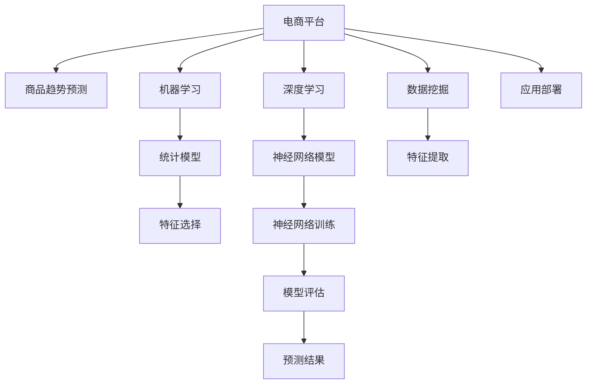

                 

# AI在电商平台商品趋势预测中的应用

## 1. 背景介绍

在电子商务的数字化时代，预测商品趋势已成为各大电商平台重要的运营决策支撑工具。通过分析大量历史交易数据，预测商品未来的销售趋势，电商平台能够制定更精准的市场策略，优化商品库存管理，提升用户体验，从而实现更高的运营效率和盈利能力。

### 1.1 问题由来

电商平台通过大量的用户行为数据（如点击、浏览、购买、评论等），形成了海量的数据资源。如何高效地利用这些数据，预测商品未来的销售趋势，是电商平台面临的关键问题。

现有方法主要包括统计分析、机器学习和深度学习等。传统的统计分析方法依赖专家经验，灵活性差；机器学习通过构建特征，利用线性模型、随机森林等算法进行预测，但特征工程复杂；深度学习方法通过神经网络模型对数据进行非线性拟合，预测精度高，但需要大量标注数据和高计算资源。

AI技术在电商平台商品趋势预测中的应用，有望融合多种方法的优点，构建高精度、高效率的预测系统，为电商平台提供强有力的数据支持。

### 1.2 问题核心关键点

AI在电商平台商品趋势预测中的核心关键点在于：

1. **数据采集与清洗**：电商平台的交易数据通常存在噪声和缺失，需要进行有效的清洗和预处理。
2. **特征工程**：从原始数据中提取关键特征，生成输入到模型的数据。
3. **模型选择与训练**：选择适合的预测模型，并利用历史数据进行训练。
4. **预测与评估**：使用训练好的模型对新数据进行预测，并评估预测效果。
5. **应用部署与优化**：将模型部署到实际应用环境中，并进行性能优化。

## 2. 核心概念与联系

### 2.1 核心概念概述

为更好地理解AI在电商平台商品趋势预测中的应用，本节将介绍几个密切相关的核心概念：

- **电商平台**：通过互联网提供商品交易和服务的平台，包括B2B、B2C、C2C等多种形式。
- **商品趋势预测**：通过分析历史销售数据，预测未来商品的市场需求和销售趋势。
- **机器学习(ML)**：利用算法和统计模型对数据进行分析和预测，常用于商品趋势预测。
- **深度学习(DL)**：基于神经网络模型进行数据表示学习和复杂关系建模，提高预测精度。
- **数据挖掘**：通过数据清洗、特征提取、模式识别等技术，从大数据中挖掘有用信息，支持商品趋势预测。

这些核心概念之间的逻辑关系可以通过以下Mermaid流程图来展示：



这个流程图展示了几大核心概念及其之间的关系：

1. 电商平台通过机器学习、深度学习和数据挖掘等技术手段，对商品销售数据进行分析和预测，生成商品趋势预测结果。
2. 机器学习主要采用统计模型，深度学习主要利用神经网络模型，两者在商品趋势预测中均有应用。
3. 数据挖掘通过特征提取和特征选择，生成输入到模型的关键数据。
4. 预测结果经过评估后，部署到实际应用环境，用于指导电商平台运营决策。

## 3. 核心算法原理 & 具体操作步骤
### 3.1 算法原理概述

基于AI的电商平台商品趋势预测，通常采用以下算法框架：

1. **数据预处理**：清洗和标准化数据，去除噪声和缺失值。
2. **特征工程**：提取和选择关键特征，生成输入到模型的数据。
3. **模型训练**：选择和训练预测模型，如线性回归、随机森林、神经网络等。
4. **预测与评估**：利用训练好的模型对新数据进行预测，并评估预测效果。
5. **应用部署**：将模型部署到实际应用环境中，并进行性能优化。

### 3.2 算法步骤详解

#### 3.2.1 数据预处理

电商平台的数据通常包含多种格式和类型，如原始交易数据、用户行为数据、商品描述数据等。数据预处理包括：

1. **数据清洗**：去除重复、错误和无效数据，补全缺失值。
2. **数据标准化**：将数据转化为标准格式，如统一时间格式、统一商品编号等。
3. **特征提取**：将原始数据转化为数值型特征，如商品类别、购买时间、购买金额等。

#### 3.2.2 特征工程

特征工程是模型预测的关键步骤，通过提取和选择关键特征，生成输入到模型的数据。常见特征包括：

1. **时间特征**：如小时、日、周、月等时间单位。
2. **商品特征**：如商品类别、价格、评分、评论数量等。
3. **用户特征**：如用户ID、用户行为序列、用户购买历史等。

特征工程的方法包括：

1. **特征选择**：从所有特征中选择最相关和最有效的特征。
2. **特征组合**：通过特征组合生成新的特征，提高模型预测能力。
3. **特征转换**：将原始特征转化为新的特征，如对数值型特征进行归一化。

#### 3.2.3 模型训练

选择和训练预测模型是商品趋势预测的核心步骤。常见模型包括：

1. **线性回归模型**：基于历史数据训练线性回归模型，预测商品销售量。
2. **随机森林模型**：通过多个决策树进行投票，生成预测结果。
3. **神经网络模型**：如RNN、CNN、LSTM等，通过多层神经网络对数据进行拟合。

模型训练的流程包括：

1. **数据划分**：将数据划分为训练集、验证集和测试集。
2. **超参数调优**：通过网格搜索或随机搜索，选择最优的模型超参数。
3. **模型训练**：利用训练集对模型进行训练，使用验证集评估模型效果。
4. **模型保存**：保存训练好的模型，便于后续使用。

#### 3.2.4 预测与评估

利用训练好的模型对新数据进行预测，并评估预测效果。评估方法包括：

1. **均方误差(MSE)**：计算预测值与真实值之间的差异。
2. **平均绝对误差(MAE)**：计算预测值与真实值之间的绝对差值。
3. **均方根误差(RMSE)**：计算预测值与真实值之间的标准差。
4. **R^2分数**：衡量模型预测的准确度。

预测与评估流程包括：

1. **数据准备**：将新数据预处理为模型输入格式。
2. **模型加载**：加载训练好的模型。
3. **预测生成**：利用模型对新数据进行预测。
4. **结果评估**：计算预测值与真实值之间的误差，评估模型效果。

#### 3.2.5 应用部署

将训练好的模型部署到实际应用环境中，并进行性能优化。部署流程包括：

1. **模型部署**：将模型部署到服务器或云平台，实现实时预测。
2. **性能优化**：对模型进行优化，提高预测速度和准确性。
3. **监控与维护**：实时监控模型性能，定期维护模型，确保模型效果。

## 4. 数学模型和公式 & 详细讲解 & 举例说明

### 4.1 数学模型构建

基于AI的电商平台商品趋势预测，通常构建以下数学模型：

1. **时间序列模型**：如ARIMA模型、季节性ARIMA模型(SARIMA)等，基于历史时间序列数据进行预测。
2. **回归模型**：如线性回归、岭回归、LASSO回归等，利用历史数据训练回归模型进行预测。
3. **决策树模型**：如CART、随机森林等，通过多个决策树进行投票生成预测结果。
4. **神经网络模型**：如多层感知器(MLP)、RNN、LSTM等，利用神经网络对数据进行拟合。

以线性回归模型为例，其数学模型为：

$$
y = \theta_0 + \sum_{i=1}^{n} \theta_i x_i + \epsilon
$$

其中，$y$为预测值，$\theta_0$为截距，$\theta_i$为系数，$x_i$为自变量，$\epsilon$为误差项。

### 4.2 公式推导过程

以线性回归模型为例，推导其梯度下降优化过程。

假设模型为：

$$
y = \theta_0 + \theta_1 x_1 + \theta_2 x_2 + \cdots + \theta_n x_n
$$

其中，$y$为预测值，$\theta_0, \theta_1, \cdots, \theta_n$为模型参数，$x_1, x_2, \cdots, x_n$为自变量，$y_i$为真实值。

损失函数为均方误差：

$$
L = \frac{1}{2m} \sum_{i=1}^{m} (y_i - \hat{y}_i)^2
$$

其中，$m$为样本数量。

对参数$\theta_j$求偏导，得到梯度：

$$
\frac{\partial L}{\partial \theta_j} = \frac{1}{m} \sum_{i=1}^{m} (y_i - \hat{y}_i) x_{ij}
$$

利用梯度下降算法更新模型参数：

$$
\theta_j \leftarrow \theta_j - \eta \frac{\partial L}{\partial \theta_j}
$$

其中，$\eta$为学习率。

### 4.3 案例分析与讲解

#### 4.3.1 案例一：服装销售预测

某服装电商平台利用AI进行商品趋势预测，模型选择线性回归和随机森林。步骤如下：

1. **数据预处理**：清洗和标准化交易数据，提取时间特征、商品特征和用户特征。
2. **特征工程**：选择最相关和最有效的特征，生成输入到模型的数据。
3. **模型训练**：利用历史数据训练线性回归和随机森林模型，选择最优模型进行预测。
4. **预测与评估**：对新数据进行预测，评估预测效果。
5. **应用部署**：将模型部署到实际应用环境中，实现实时预测。

案例二：某电子商品电商平台利用深度学习进行商品趋势预测，模型选择RNN。步骤如下：

1. **数据预处理**：清洗和标准化交易数据，提取时间特征、商品特征和用户特征。
2. **特征工程**：选择最相关和最有效的特征，生成输入到模型的数据。
3. **模型训练**：利用历史数据训练RNN模型，选择最优模型进行预测。
4. **预测与评估**：对新数据进行预测，评估预测效果。
5. **应用部署**：将模型部署到实际应用环境中，实现实时预测。

## 5. 项目实践：代码实例和详细解释说明

### 5.1 开发环境搭建

在进行商品趋势预测项目开发前，我们需要准备好开发环境。以下是使用Python进行PyTorch开发的环境配置流程：

1. 安装Anaconda：从官网下载并安装Anaconda，用于创建独立的Python环境。

2. 创建并激活虚拟环境：
```bash
conda create -n pytorch-env python=3.8 
conda activate pytorch-env
```

3. 安装PyTorch：根据CUDA版本，从官网获取对应的安装命令。例如：
```bash
conda install pytorch torchvision torchaudio cudatoolkit=11.1 -c pytorch -c conda-forge
```

4. 安装相关库：
```bash
pip install numpy pandas scikit-learn torch sklearn tensorboard
```

完成上述步骤后，即可在`pytorch-env`环境中开始商品趋势预测项目的开发。

### 5.2 源代码详细实现

下面以服装销售预测为例，给出使用PyTorch进行商品趋势预测的PyTorch代码实现。

首先，定义数据处理函数：

```python
import pandas as pd
import numpy as np
from sklearn.preprocessing import MinMaxScaler

def load_data(file_path):
    data = pd.read_csv(file_path)
    # 时间特征：日期，转换为数值型
    data['date'] = pd.to_datetime(data['date'])
    data['hour'] = data['date'].dt.hour
    data['day'] = data['date'].dt.day
    data['month'] = data['date'].dt.month
    data['weekday'] = data['date'].dt.weekday
    # 商品特征：价格、评分、评论数量
    data['sale'] = data['sale'].apply(lambda x: 1 if x != 0 else 0)
    # 用户特征：用户ID、购买次数
    data['user_id'] = data['user_id'].astype('category').cat.codes
    # 数据标准化
    scaler = MinMaxScaler()
    data = scaler.fit_transform(data)
    return data

# 加载数据
data = load_data('sales_data.csv')
```

然后，定义模型和优化器：

```python
from torch.utils.data import Dataset, DataLoader
from torch import nn, optim
import torch.nn.functional as F

class SalesDataset(Dataset):
    def __init__(self, data, target):
        self.data = data
        self.target = target
        
    def __len__(self):
        return len(self.target)
    
    def __getitem__(self, item):
        x = torch.tensor(self.data[item], dtype=torch.float32)
        y = torch.tensor(self.target[item], dtype=torch.float32)
        return x, y

# 定义模型
class SalesModel(nn.Module):
    def __init__(self, input_dim, hidden_dim, output_dim):
        super(SalesModel, self).__init__()
        self.fc1 = nn.Linear(input_dim, hidden_dim)
        self.fc2 = nn.Linear(hidden_dim, hidden_dim)
        self.fc3 = nn.Linear(hidden_dim, output_dim)
        
    def forward(self, x):
        x = F.relu(self.fc1(x))
        x = F.relu(self.fc2(x))
        x = self.fc3(x)
        return x

# 定义优化器和损失函数
input_dim = 10 # 时间特征和商品特征
hidden_dim = 32
output_dim = 1 # 销售量预测

model = SalesModel(input_dim, hidden_dim, output_dim)
criterion = nn.MSELoss()
optimizer = optim.Adam(model.parameters(), lr=0.001)

# 训练函数
def train(model, dataset, epochs, batch_size, device):
    dataloader = DataLoader(dataset, batch_size=batch_size, shuffle=True)
    model.to(device)
    for epoch in range(epochs):
        for batch in dataloader:
            x, y = batch
            x = x.to(device)
            y = y.to(device)
            optimizer.zero_grad()
            outputs = model(x)
            loss = criterion(outputs, y)
            loss.backward()
            optimizer.step()
            if (epoch+1) % 10 == 0:
                print(f'Epoch {epoch+1}, Loss: {loss.item():.4f}')

# 预测函数
def predict(model, dataset, device):
    model.eval()
    with torch.no_grad():
        dataloader = DataLoader(dataset, batch_size=64, shuffle=False)
        y_pred = []
        for batch in dataloader:
            x, y = batch
            x = x.to(device)
            y = y.to(device)
            outputs = model(x)
            y_pred.append(outputs.numpy())
    return np.vstack(y_pred)
```

最后，启动训练流程并在测试集上评估：

```python
from sklearn.model_selection import train_test_split
from sklearn.metrics import mean_squared_error, mean_absolute_error

# 划分训练集和测试集
X = data[:,:-1]
y = data[:,-1]
X_train, X_test, y_train, y_test = train_test_split(X, y, test_size=0.2, random_state=42)

# 定义数据集
train_dataset = SalesDataset(X_train, y_train)
test_dataset = SalesDataset(X_test, y_test)

# 定义设备
device = torch.device('cuda' if torch.cuda.is_available() else 'cpu')

# 训练模型
epochs = 100
batch_size = 64
train(model, train_dataset, epochs, batch_size, device)

# 预测并评估
y_pred = predict(model, test_dataset, device)
print(f'Test MSE: {mean_squared_error(y_test, y_pred)}')
print(f'Test MAE: {mean_absolute_error(y_test, y_pred)}')
```

以上就是使用PyTorch进行服装销售预测的完整代码实现。可以看到，通过自定义数据集和模型类，我们能够方便地实现商品趋势预测的预测模型。

### 5.3 代码解读与分析

让我们再详细解读一下关键代码的实现细节：

**load_data函数**：
- 加载原始数据，并进行数据清洗和预处理，包括日期转换为时间特征、标准化处理等。

**SalesModel模型类**：
- 定义了一个简单的前向传播过程，包括两个全连接层和一个线性输出层。
- 使用ReLU作为激活函数，提高模型的非线性拟合能力。

**train函数**：
- 定义了模型的训练函数，利用Adam优化器进行梯度下降优化。
- 每十个epoch输出一次损失，以便实时监控模型训练效果。

**predict函数**：
- 定义了模型的预测函数，利用测试集数据进行预测。
- 返回预测结果的numpy数组，便于后续分析。

## 6. 实际应用场景

### 6.1 智能推荐系统

电商平台通过商品趋势预测技术，可以为每个用户推荐个性化的商品，提升用户满意度和转化率。智能推荐系统的构建步骤如下：

1. **数据采集**：收集用户的浏览、点击、购买等行为数据，生成用户行为序列。
2. **数据预处理**：清洗和标准化数据，提取关键特征。
3. **模型训练**：利用历史数据训练商品趋势预测模型，生成商品推荐列表。
4. **推荐生成**：利用训练好的模型生成推荐结果，根据用户行为序列动态调整推荐列表。
5. **效果评估**：评估推荐结果，并根据用户反馈进行调整。

### 6.2 库存管理

电商平台通过商品趋势预测技术，可以优化商品库存管理，避免库存积压或断货。库存管理的构建步骤如下：

1. **数据采集**：收集历史销售数据、用户行为数据等，生成销售预测数据。
2. **数据预处理**：清洗和标准化数据，提取关键特征。
3. **模型训练**：利用历史数据训练商品趋势预测模型，生成销售预测结果。
4. **库存管理**：根据销售预测结果，调整库存水平，避免库存积压或断货。
5. **效果评估**：评估库存管理效果，并根据实际情况进行调整。

### 6.3 价格策略优化

电商平台通过商品趋势预测技术，可以优化商品价格策略，提升销售收益。价格策略优化的构建步骤如下：

1. **数据采集**：收集历史销售数据、用户行为数据等，生成销售预测数据。
2. **数据预处理**：清洗和标准化数据，提取关键特征。
3. **模型训练**：利用历史数据训练商品趋势预测模型，生成销售预测结果。
4. **价格策略优化**：根据销售预测结果，调整商品定价策略，提升销售收益。
5. **效果评估**：评估价格策略优化效果，并根据实际情况进行调整。

## 7. 工具和资源推荐
### 7.1 学习资源推荐

为了帮助开发者系统掌握商品趋势预测的理论基础和实践技巧，这里推荐一些优质的学习资源：

1. **《Python深度学习》**：深度学习领域的经典教材，介绍了深度学习模型的构建和应用。
2. **《机器学习实战》**：实战教程，介绍了机器学习算法的实现和应用。
3. **Kaggle平台**：提供了大量数据集和竞赛，可以实践各种机器学习项目。
4. **Google Colab**：免费的Jupyter Notebook环境，可以方便地进行数据分析和机器学习实验。
5. **PyTorch官方文档**：提供了丰富的API文档和示例代码，是学习PyTorch的必备资源。

通过对这些资源的学习实践，相信你一定能够快速掌握商品趋势预测的精髓，并用于解决实际的电商问题。

### 7.2 开发工具推荐

高效的开发离不开优秀的工具支持。以下是几款用于商品趋势预测开发的常用工具：

1. **PyTorch**：基于Python的开源深度学习框架，灵活动态的计算图，适合快速迭代研究。
2. **TensorFlow**：由Google主导开发的开源深度学习框架，生产部署方便，适合大规模工程应用。
3. **Scikit-learn**：Python的数据科学库，提供了各种机器学习算法和工具，适合快速原型开发。
4. **TensorBoard**：TensorFlow配套的可视化工具，可实时监测模型训练状态，并提供丰富的图表呈现方式。
5. **Jupyter Notebook**：强大的交互式编程环境，适合记录实验过程和共享代码。

合理利用这些工具，可以显著提升商品趋势预测任务的开发效率，加快创新迭代的步伐。

### 7.3 相关论文推荐

商品趋势预测技术的发展源于学界的持续研究。以下是几篇奠基性的相关论文，推荐阅读：

1. **《时间序列分析与预测》**：介绍时间序列分析的基本方法，包括ARIMA、SARIMA等模型。
2. **《回归分析与预测》**：介绍回归分析的基本方法，包括线性回归、岭回归、LASSO回归等模型。
3. **《机器学习实战》**：介绍了各种机器学习算法的实现和应用，适合初学者入门。
4. **《深度学习》**：介绍了深度学习模型的构建和应用，适合深入研究。
5. **《Kaggle数据集》**：提供了大量商品销售数据集，适合进行各种机器学习实验。

这些论文代表了大数据挖掘和商品趋势预测技术的发展脉络。通过学习这些前沿成果，可以帮助研究者把握学科前进方向，激发更多的创新灵感。

## 8. 总结：未来发展趋势与挑战

### 8.1 研究成果总结

本文对基于AI的电商平台商品趋势预测方法进行了全面系统的介绍。首先阐述了商品趋势预测在电商平台中的重要性和现状，明确了预测技术在优化运营决策、提升用户体验、提升运营效率等方面的独特价值。其次，从原理到实践，详细讲解了商品趋势预测的数学模型和核心算法，给出了完整的代码实现。同时，本文还探讨了商品趋势预测在智能推荐、库存管理、价格策略优化等多个实际应用场景中的应用，展示了预测技术的广泛应用前景。此外，本文精选了商品趋势预测的各类学习资源，力求为读者提供全方位的技术指引。

通过本文的系统梳理，可以看到，基于AI的电商平台商品趋势预测技术正在成为电商运营决策的重要支撑工具，极大地提升了电商平台的运营效率和盈利能力。未来，伴随深度学习模型的不断进步，商品趋势预测技术必将进一步发展，为电商平台提供更精准、高效的预测结果。

### 8.2 未来发展趋势

展望未来，商品趋势预测技术将呈现以下几个发展趋势：

1. **深度学习模型的发展**：深度学习模型在商品趋势预测中的应用将越来越广泛，尤其是神经网络模型、卷积神经网络(CNN)、循环神经网络(RNN)等，将进一步提高预测精度和效果。
2. **多模态数据的融合**：将商品图像、视频、评论等多模态数据融合到预测模型中，提升预测结果的准确度和多样性。
3. **个性化推荐**：通过结合用户行为数据、历史数据等，生成个性化的推荐结果，提升用户体验。
4. **实时预测**：通过实时数据流，实现实时预测，满足动态变化的预测需求。
5. **智能决策支持**：通过将预测结果与业务规则、专家知识等结合，生成智能化的决策支持。

### 8.3 面临的挑战

尽管商品趋势预测技术已经取得了瞩目成就，但在迈向更加智能化、普适化应用的过程中，它仍面临诸多挑战：

1. **数据质量问题**：电商平台的交易数据存在噪声和缺失，需要进行有效的清洗和预处理。
2. **模型复杂度**：深度学习模型的复杂度较高，需要大量计算资源和较长的训练时间。
3. **模型泛化能力**：预测模型需要在不同场景下保持较高的泛化能力，避免过拟合。
4. **实时预测的延迟**：实时预测需要高效的数据流处理和模型优化，保证预测结果的实时性。
5. **可解释性问题**：预测模型通常缺乏可解释性，难以理解其内部工作机制和决策逻辑。

### 8.4 研究展望

面向未来，商品趋势预测技术需要在以下几个方面寻求新的突破：

1. **数据预处理技术**：探索更高效的数据清洗和预处理技术，提升数据质量。
2. **模型优化技术**：研究模型压缩、量化加速等技术，优化模型复杂度和计算资源消耗。
3. **多模态融合技术**：探索多模态数据融合技术，提升预测结果的准确度和多样性。
4. **实时预测技术**：研究实时数据流处理技术，实现实时预测。
5. **可解释性技术**：研究可解释性技术，提升模型的可解释性和可理解性。

这些研究方向的探索，必将引领商品趋势预测技术迈向更高的台阶，为电商平台提供更精准、高效的预测结果。面向未来，商品趋势预测技术还需要与其他人工智能技术进行更深入的融合，如知识表示、因果推理、强化学习等，多路径协同发力，共同推动电商平台的数字化转型和智能化升级。

## 9. 附录：常见问题与解答

**Q1：商品趋势预测模型的选择原则是什么？**

A: 商品趋势预测模型的选择原则包括以下几个方面：

1. **预测精度**：选择预测精度高的模型，如深度学习模型。
2. **计算资源**：根据计算资源和训练时间，选择适合的模型。
3. **可解释性**：选择可解释性好的模型，便于理解和调试。
4. **泛化能力**：选择泛化能力强的模型，避免过拟合。

**Q2：如何提高商品趋势预测模型的泛化能力？**

A: 提高商品趋势预测模型的泛化能力，可以从以下几个方面进行改进：

1. **数据多样性**：收集多种类型的数据，提高数据的丰富性和多样性。
2. **特征工程**：通过特征工程提取和选择关键特征，提高模型的表达能力。
3. **正则化技术**：引入正则化技术，如L2正则、Dropout等，防止模型过拟合。
4. **模型融合**：通过集成多个模型的预测结果，提高模型的泛化能力。
5. **模型优化**：通过超参数调优、模型压缩等技术，优化模型的计算资源消耗和预测精度。

**Q3：如何在电商平台上实现实时预测？**

A: 在电商平台上实现实时预测，需要以下几个关键步骤：

1. **数据流处理**：将实时数据流输入到模型中进行处理。
2. **模型优化**：对模型进行优化，提高预测速度和准确性。
3. **缓存机制**：建立缓存机制，保存历史数据，提高实时预测的速度和准确性。
4. **监控与维护**：实时监控模型性能，定期维护模型，确保模型效果。

**Q4：如何进行商品趋势预测的模型评估？**

A: 商品趋势预测的模型评估主要包括以下几个方面：

1. **均方误差(MSE)**：计算预测值与真实值之间的差异。
2. **平均绝对误差(MAE)**：计算预测值与真实值之间的绝对差值。
3. **均方根误差(RMSE)**：计算预测值与真实值之间的标准差。
4. **R^2分数**：衡量模型预测的准确度。
5. **精度-召回率曲线(PR曲线)**：衡量模型在不同阈值下的精确率和召回率。

**Q5：如何处理电商平台的噪声数据？**

A: 电商平台的数据通常存在噪声和缺失，需要进行有效的清洗和预处理，具体步骤如下：

1. **数据清洗**：去除重复、错误和无效数据，补全缺失值。
2. **数据标准化**：将数据转化为标准格式，如统一时间格式、统一商品编号等。
3. **异常检测**：使用统计方法或机器学习方法检测异常值，并去除或修正。
4. **数据归一化**：对数据进行归一化处理，减少数据分布的不确定性。

---

作者：禅与计算机程序设计艺术 / Zen and the Art of Computer Programming

