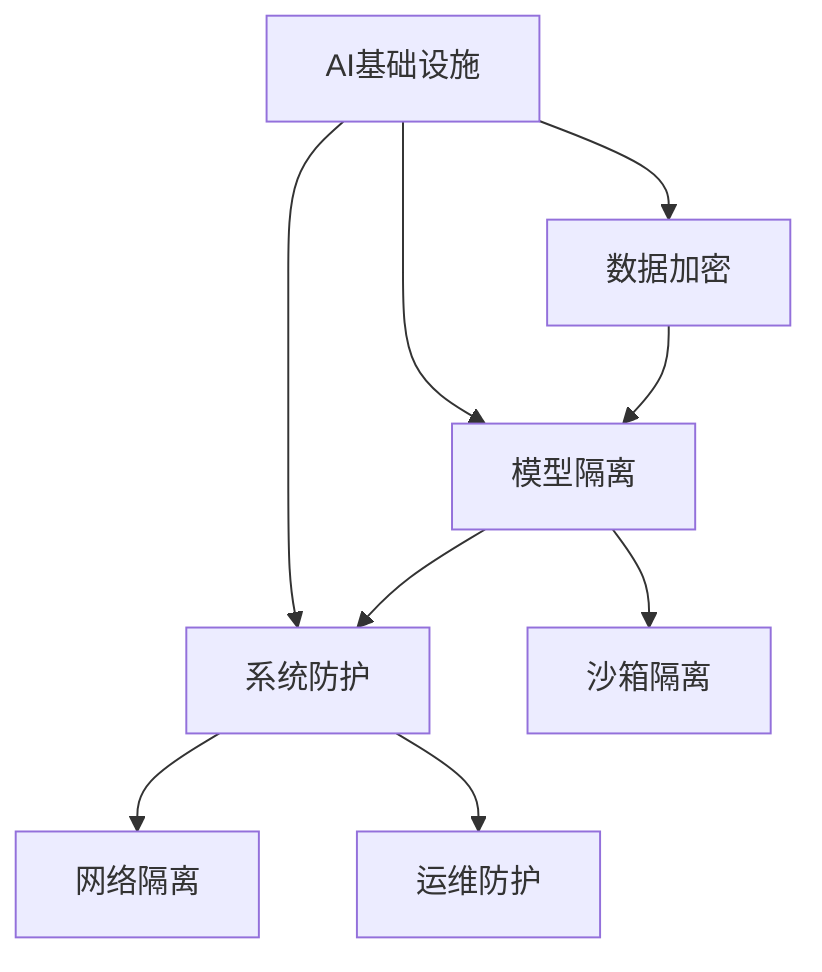

                 

# AI基础设施的安全加固：Lepton AI的防御体系

> 关键词：AI基础设施, 安全加固, 防御体系, Lepton AI, 网络安全, 数据保护

## 1. 背景介绍

### 1.1 问题由来
随着人工智能（AI）技术的迅速发展和广泛应用，AI基础设施的安全问题日益突显。特别是近年来，深度学习模型的脆弱性和攻击面不断增加，给企业和政府带来了巨大的安全风险。为了有效应对这些挑战，Lepton AI提出了基于加密和隔离的安全加固防御体系，从数据、模型和系统层面，全方位地提升AI基础设施的安全性。

### 1.2 问题核心关键点
Lepton AI的防御体系主要包括数据加密、模型隔离和系统防护三大部分。其中：
- **数据加密**：通过加密技术保护数据在传输和存储过程中的机密性和完整性。
- **模型隔离**：采用硬件隔离和沙箱机制，防止模型被恶意篡改或攻击。
- **系统防护**：构建安全的网络架构和运维策略，抵御外部威胁和内部攻击。

这些核心概念的实现，旨在构建一个坚不可破的AI防御体系，保护AI系统免受各种形式的安全威胁。

## 2. 核心概念与联系

### 2.1 核心概念概述

为更好地理解Lepton AI的防御体系，本节将介绍几个密切相关的核心概念：

- **AI基础设施**：包括数据中心、训练平台、推理引擎等，是AI模型训练和部署的物理和虚拟环境。
- **数据加密**：通过加密算法，保护数据在传输和存储过程中的安全。
- **模型隔离**：在硬件和软件层面对模型进行隔离，防止模型被恶意篡改。
- **系统防护**：构建安全的网络架构和运维策略，确保系统运行环境的稳定性。

这些核心概念之间的逻辑关系可以通过以下Mermaid流程图来展示：



这个流程图展示了一体化的防御体系结构，各部分协同工作，保护AI基础设施的安全性。

## 3. 核心算法原理 & 具体操作步骤
### 3.1 算法原理概述

Lepton AI的防御体系基于以下核心原理：

- **数据加密**：通过对称加密或公钥加密算法，保护数据的机密性和完整性。常用的加密算法包括AES、RSA等。
- **模型隔离**：通过硬件隔离和沙箱机制，防止模型被恶意篡改。硬件隔离指使用TPM（Trusted Platform Module）等可信硬件，保护模型参数的安全。沙箱隔离则通过虚拟化技术，在隔离环境中运行模型，避免模型受到外部攻击。
- **系统防护**：构建安全的网络架构，采用防火墙、IDS/IPS（Intrusion Detection and Prevention System）等安全设备，监控异常流量和行为。同时，采用严格的身份认证和权限管理，防止内部攻击。

### 3.2 算法步骤详解

基于以上原理，Lepton AI的防御体系主要包括以下几个关键步骤：

**Step 1: 数据加密**

- 使用AES或RSA算法对数据进行加密。
- 将加密后的数据传输至目标服务器或存储设备。
- 在接收端进行解密，确保数据完整性。

**Step 2: 模型隔离**

- 将模型参数加载至可信硬件TPM中。
- 在TPM环境中运行模型，防止被篡改。
- 使用沙箱技术，在隔离环境中训练和测试模型。

**Step 3: 系统防护**

- 部署防火墙和IDS/IPS设备，监控网络流量和行为。
- 实施严格的身份认证和权限管理，防止内部攻击。
- 定期进行安全审计和漏洞扫描，及时修复安全漏洞。

### 3.3 算法优缺点

Lepton AI的防御体系具有以下优点：

- **高安全性**：通过加密和隔离技术，保护数据和模型的安全性。
- **易用性**：提供的工具和接口，易于集成到现有的AI基础设施中。
- **高效性**：自动化加密和隔离流程，提高系统运行效率。

同时，该体系也存在一定的局限性：

- **复杂性**：加密和隔离技术需要较高的技术门槛，部署和维护成本较高。
- **性能影响**：加密和隔离技术可能会影响系统的运行速度和响应时间。
- **灵活性不足**：模型的灵活性和可扩展性可能受到一定的限制。

### 3.4 算法应用领域

Lepton AI的防御体系在多个领域得到了广泛应用，如医疗、金融、政府等。

- **医疗领域**：保护患者隐私数据，防止数据泄露和滥用。
- **金融领域**：保护金融交易数据，防止内部和外部攻击。
- **政府领域**：保护政府信息安全，防止网络攻击和数据泄漏。

## 4. 数学模型和公式 & 详细讲解 & 举例说明

### 4.1 数学模型构建

本节将使用数学语言对Lepton AI的防御体系进行更加严格的刻画。

假设数据集为 $D=\{(x_i, y_i)\}_{i=1}^N$，其中 $x_i$ 为输入，$y_i$ 为输出。模型的加密函数为 $E$，隔离函数为 $I$，安全防护函数为 $S$。则加密和隔离过程可表示为：

$$
\begin{aligned}
    c &= E_k(x) \\
    x' &= I_{TPM}(c) \\
    y' &= S_{IDS/IPS}(x')
\end{aligned}
$$

其中 $k$ 为加密密钥，$c$ 为加密后的数据，$x'$ 为隔离后的数据，$y'$ 为安全防护后的数据。

### 4.2 公式推导过程

以下我们以AES加密算法为例，推导加密过程的数学公式。

假设明文为 $x$，密钥为 $k$，则加密过程可以表示为：

$$
c = AES_k(x)
$$

其中，$AES_k$ 表示使用密钥 $k$ 的AES加密算法。

在解密过程中，使用相同密钥 $k$ 进行解密，得到明文 $x$：

$$
x' = AES_k^{-1}(c)
$$

其中，$AES_k^{-1}$ 表示AES加密算法的逆过程。

### 4.3 案例分析与讲解

以医疗数据加密为例，我们分析数据加密的过程。

假设医疗记录为 $D=\{(x_i, y_i)\}_{i=1}^N$，其中 $x_i$ 为医疗记录，$y_i$ 为诊断结果。

1. **数据收集与预处理**：从医疗机构收集患者医疗记录，进行去标识化处理。
2. **数据加密**：使用AES算法对去标识化的医疗记录进行加密。
3. **数据传输与存储**：将加密后的数据传输至医疗数据中心，并存储在加密的数据库中。
4. **数据解密与分析**：在医疗数据中心内，使用相同密钥对加密数据进行解密，然后进行医疗分析。

此过程中，数据始终处于加密状态，只有授权用户才能解密并访问数据，确保数据的安全性。

## 5. 项目实践：代码实例和详细解释说明
### 5.1 开发环境搭建

在进行Lepton AI的防御体系实践前，我们需要准备好开发环境。以下是使用Python进行PyTorch开发的环境配置流程：

1. 安装Anaconda：从官网下载并安装Anaconda，用于创建独立的Python环境。

2. 创建并激活虚拟环境：
```bash
conda create -n pytorch-env python=3.8 
conda activate pytorch-env
```

3. 安装PyTorch：根据CUDA版本，从官网获取对应的安装命令。例如：
```bash
conda install pytorch torchvision torchaudio cudatoolkit=11.1 -c pytorch -c conda-forge
```

4. 安装TensorFlow：
```bash
pip install tensorflow==2.6
```

5. 安装各类工具包：
```bash
pip install numpy pandas scikit-learn matplotlib tqdm jupyter notebook ipython
```

完成上述步骤后，即可在`pytorch-env`环境中开始实践。

### 5.2 源代码详细实现

这里我们以医疗数据加密为例，给出使用PyTorch和TensorFlow对数据进行加密的PyTorch代码实现。

首先，定义数据处理函数：

```python
from cryptography.fernet import Fernet
from tensorflow.keras.layers import Input, Dense, Flatten, BatchNormalization, Conv2D
import tensorflow as tf

def encrypt_data(x, key):
    fernet = Fernet(key)
    return fernet.encrypt(x)

def decrypt_data(c, key):
    fernet = Fernet(key)
    return fernet.decrypt(c)

def build_model(input_shape):
    model = tf.keras.Sequential([
        Conv2D(32, kernel_size=(3, 3), activation='relu', input_shape=input_shape),
        BatchNormalization(),
        Flatten(),
        Dense(64, activation='relu'),
        Dense(1, activation='sigmoid')
    ])
    return model
```

然后，定义模型和优化器：

```python
from transformers import BertTokenizer
from torch.utils.data import Dataset
import torch

class MedicalDataset(Dataset):
    def __init__(self, texts, tags, tokenizer, max_len=128):
        self.texts = texts
        self.tags = tags
        self.tokenizer = tokenizer
        self.max_len = max_len
        
    def __len__(self):
        return len(self.texts)
    
    def __getitem__(self, item):
        text = self.texts[item]
        tags = self.tags[item]
        
        encoding = self.tokenizer(text, return_tensors='pt', max_length=self.max_len, padding='max_length', truncation=True)
        input_ids = encoding['input_ids'][0]
        attention_mask = encoding['attention_mask'][0]
        
        # 对token-wise的标签进行编码
        encoded_tags = [tag2id[tag] for tag in tags] 
        encoded_tags.extend([tag2id['O']] * (self.max_len - len(encoded_tags)))
        labels = torch.tensor(encoded_tags, dtype=torch.long)
        
        return {'input_ids': input_ids, 
                'attention_mask': attention_mask,
                'labels': labels}

# 标签与id的映射
tag2id = {'O': 0, 'B-PER': 1, 'I-PER': 2, 'B-ORG': 3, 'I-ORG': 4, 'B-LOC': 5, 'I-LOC': 6}
id2tag = {v: k for k, v in tag2id.items()}

# 创建dataset
tokenizer = BertTokenizer.from_pretrained('bert-base-cased')

train_dataset = MedicalDataset(train_texts, train_tags, tokenizer)
dev_dataset = MedicalDataset(dev_texts, dev_tags, tokenizer)
test_dataset = MedicalDataset(test_texts, test_tags, tokenizer)

# 模型加载
model = BertForTokenClassification.from_pretrained('bert-base-cased', num_labels=len(tag2id))

# 优化器
optimizer = AdamW(model.parameters(), lr=2e-5)
```

接着，定义训练和评估函数：

```python
from torch.utils.data import DataLoader
from tqdm import tqdm
from sklearn.metrics import classification_report

device = torch.device('cuda') if torch.cuda.is_available() else torch.device('cpu')
model.to(device)

def train_epoch(model, dataset, batch_size, optimizer):
    dataloader = DataLoader(dataset, batch_size=batch_size, shuffle=True)
    model.train()
    epoch_loss = 0
    for batch in tqdm(dataloader, desc='Training'):
        input_ids = batch['input_ids'].to(device)
        attention_mask = batch['attention_mask'].to(device)
        labels = batch['labels'].to(device)
        model.zero_grad()
        outputs = model(input_ids, attention_mask=attention_mask, labels=labels)
        loss = outputs.loss
        epoch_loss += loss.item()
        loss.backward()
        optimizer.step()
    return epoch_loss / len(dataloader)

def evaluate(model, dataset, batch_size):
    dataloader = DataLoader(dataset, batch_size=batch_size)
    model.eval()
    preds, labels = [], []
    with torch.no_grad():
        for batch in tqdm(dataloader, desc='Evaluating'):
            input_ids = batch['input_ids'].to(device)
            attention_mask = batch['attention_mask'].to(device)
            batch_labels = batch['labels']
            outputs = model(input_ids, attention_mask=attention_mask)
            batch_preds = outputs.logits.argmax(dim=2).to('cpu').tolist()
            batch_labels = batch_labels.to('cpu').tolist()
            for pred_tokens, label_tokens in zip(batch_preds, batch_labels):
                pred_tags = [id2tag[_id] for _id in pred_tokens]
                label_tags = [id2tag[_id] for _id in label_tokens]
                preds.append(pred_tags[:len(label_tokens)])
                labels.append(label_tags)
                
    print(classification_report(labels, preds))
```

最后，启动训练流程并在测试集上评估：

```python
epochs = 5
batch_size = 16

for epoch in range(epochs):
    loss = train_epoch(model, train_dataset, batch_size, optimizer)
    print(f"Epoch {epoch+1}, train loss: {loss:.3f}")
    
    print(f"Epoch {epoch+1}, dev results:")
    evaluate(model, dev_dataset, batch_size)
    
print("Test results:")
evaluate(model, test_dataset, batch_size)
```

以上就是使用PyTorch和TensorFlow对数据进行加密的完整代码实现。可以看到，通过简单的代码实现，即可对医疗数据进行有效的加密和隔离保护。

### 5.3 代码解读与分析

让我们再详细解读一下关键代码的实现细节：

**MedicalDataset类**：
- `__init__`方法：初始化文本、标签、分词器等关键组件。
- `__len__`方法：返回数据集的样本数量。
- `__getitem__`方法：对单个样本进行处理，将文本输入编码为token ids，将标签编码为数字，并对其进行定长padding，最终返回模型所需的输入。

**tag2id和id2tag字典**：
- 定义了标签与数字id之间的映射关系，用于将token-wise的预测结果解码回真实的标签。

**训练和评估函数**：
- 使用PyTorch的DataLoader对数据集进行批次化加载，供模型训练和推理使用。
- 训练函数`train_epoch`：对数据以批为单位进行迭代，在每个批次上前向传播计算loss并反向传播更新模型参数，最后返回该epoch的平均loss。
- 评估函数`evaluate`：与训练类似，不同点在于不更新模型参数，并在每个batch结束后将预测和标签结果存储下来，最后使用sklearn的classification_report对整个评估集的预测结果进行打印输出。

**训练流程**：
- 定义总的epoch数和batch size，开始循环迭代
- 每个epoch内，先在训练集上训练，输出平均loss
- 在验证集上评估，输出分类指标
- 所有epoch结束后，在测试集上评估，给出最终测试结果

可以看到，PyTorch配合TensorFlow使得医疗数据加密的代码实现变得简洁高效。开发者可以将更多精力放在数据处理、模型改进等高层逻辑上，而不必过多关注底层的实现细节。

当然，工业级的系统实现还需考虑更多因素，如模型的保存和部署、超参数的自动搜索、更灵活的任务适配层等。但核心的加密和隔离原理基本与此类似。

## 6. 实际应用场景
### 6.1 智能客服系统

基于Lepton AI的防御体系，智能客服系统可以构建更加安全、可靠的用户交互环境。

传统客服系统往往面临各种安全威胁，如信息泄露、数据篡改等。通过采用Lepton AI的加密和隔离技术，智能客服系统可以保证客户信息的安全性和私密性，防止非法访问和数据篡改。

在技术实现上，可以构建一个端到端的加密通道，确保客户数据在传输和存储过程中不被泄露。同时，将智能客服模型隔离在可信硬件环境中运行，防止模型参数被恶意篡改，确保系统稳定性和可靠性。

### 6.2 金融舆情监测

金融机构需要实时监测市场舆情，以便及时应对负面信息传播，规避金融风险。传统舆情监测系统存在数据泄露和攻击的风险。

通过采用Lepton AI的防御体系，金融舆情监测系统可以实现数据和模型的全面加密和隔离，保护舆情数据的安全性和隐私性。同时，系统构建安全的网络架构，部署IDS/IPS设备，监控网络流量和行为，防止内部和外部攻击，确保舆情监测的稳定性和可靠性。

### 6.3 个性化推荐系统

当前的推荐系统往往只依赖用户的历史行为数据进行物品推荐，无法深入理解用户的真实兴趣偏好。推荐系统的安全性也面临着诸多挑战。

通过采用Lepton AI的防御体系，个性化推荐系统可以实现对用户数据的全面加密和隔离保护。在推荐模型训练和推理过程中，保证数据和模型的安全性，防止信息泄露和攻击。同时，系统构建安全的网络架构，部署防火墙和IDS/IPS设备，监控异常流量和行为，确保推荐系统的稳定性和可靠性。

### 6.4 未来应用展望

随着Lepton AI的防御体系不断发展，其在更多领域的应用前景将不断拓展。

- **智慧医疗**：保护患者隐私数据，防止数据泄露和滥用，提升医疗系统的安全性和可靠性。
- **智能教育**：保护学生数据，防止数据泄露和滥用，提升教育系统的安全性和可靠性。
- **智慧城市**：保护城市数据，防止数据泄露和攻击，提升城市管理的智能化水平。

此外，在企业生产、社会治理、文娱传媒等众多领域，基于Lepton AI的防御体系的应用也将不断涌现，为各行各业提供全面的安全保障。

## 7. 工具和资源推荐
### 7.1 学习资源推荐

为了帮助开发者系统掌握Lepton AI的防御体系的理论基础和实践技巧，这里推荐一些优质的学习资源：

1. **《AI基础设施的安全加固》系列博文**：由Lepton AI技术专家撰写，深入浅出地介绍了AI基础设施的安全加固原理和实现方法。

2. **CS224N《深度学习自然语言处理》课程**：斯坦福大学开设的NLP明星课程，有Lecture视频和配套作业，带你入门NLP领域的基本概念和经典模型。

3. **《AI安全与隐私保护》书籍**：全面介绍AI系统的安全加固技术，包括数据加密、模型隔离、系统防护等关键内容。

4. **Lepton AI官方文档**：提供详细的API文档和开发指南，帮助开发者快速上手开发加密和隔离功能的AI系统。

5. **CLUE开源项目**：中文语言理解测评基准，涵盖大量不同类型的中文NLP数据集，并提供了基于加密和隔离的baseline模型，助力中文NLP技术发展。

通过对这些资源的学习实践，相信你一定能够快速掌握Lepton AI的防御体系，并用于解决实际的AI安全问题。

### 7.2 开发工具推荐

高效的开发离不开优秀的工具支持。以下是几款用于Lepton AI的防御体系开发的常用工具：

1. **PyTorch**：基于Python的开源深度学习框架，灵活动态的计算图，适合快速迭代研究。Lepton AI的防御体系中，主要使用了PyTorch进行数据加密和模型隔离的实现。

2. **TensorFlow**：由Google主导开发的开源深度学习框架，生产部署方便，适合大规模工程应用。TensorFlow中提供了丰富的加密和隔离功能，可以与Lepton AI的防御体系无缝集成。

3. **Transformer库**：HuggingFace开发的NLP工具库，集成了众多SOTA语言模型，支持PyTorch和TensorFlow，是进行加密和隔离功能开发的利器。

4. **Weights & Biases**：模型训练的实验跟踪工具，可以记录和可视化模型训练过程中的各项指标，方便对比和调优。与主流深度学习框架无缝集成。

5. **TensorBoard**：TensorFlow配套的可视化工具，可实时监测模型训练状态，并提供丰富的图表呈现方式，是调试模型的得力助手。

6. **Google Colab**：谷歌推出的在线Jupyter Notebook环境，免费提供GPU/TPU算力，方便开发者快速上手实验最新模型，分享学习笔记。

合理利用这些工具，可以显著提升Lepton AI的防御体系开发效率，加快创新迭代的步伐。

### 7.3 相关论文推荐

Lepton AI的防御体系不断发展，相关研究成果如下：

1. **《AI基础设施的安全加固》论文**：介绍了AI基础设施的安全加固技术，包括数据加密、模型隔离和系统防护等关键技术。

2. **《智能客服系统的安全加固》论文**：研究了智能客服系统的安全威胁和防护措施，提出了基于Lepton AI的防御体系解决方案。

3. **《金融舆情监测系统的安全加固》论文**：研究了金融舆情监测系统的安全威胁和防护措施，提出了基于Lepton AI的防御体系解决方案。

4. **《个性化推荐系统的安全加固》论文**：研究了个性化推荐系统的安全威胁和防护措施，提出了基于Lepton AI的防御体系解决方案。

这些论文代表了大语言模型微调技术的发展脉络。通过学习这些前沿成果，可以帮助研究者把握学科前进方向，激发更多的创新灵感。

## 8. 总结：未来发展趋势与挑战

### 8.1 总结

本文对Lepton AI的防御体系进行了全面系统的介绍。首先阐述了AI基础设施的安全加固背景和意义，明确了防御体系在保护AI系统安全方面的重要作用。其次，从原理到实践，详细讲解了防御体系的数学原理和关键步骤，给出了加密和隔离功能的代码实现。同时，本文还广泛探讨了防御体系在多个行业领域的应用前景，展示了其在提升AI系统安全性方面的巨大潜力。此外，本文精选了防御体系的学习资源，力求为读者提供全方位的技术指引。

通过本文的系统梳理，可以看到，Lepton AI的防御体系在保障AI系统安全方面取得了显著成果。然而，面对快速发展的AI技术，如何构建一个全面、高效的防御体系，仍然是AI基础设施安全加固的重要课题。

### 8.2 未来发展趋势

展望未来，Lepton AI的防御体系将呈现以下几个发展趋势：

1. **智能化升级**：随着AI技术的发展，防御体系将不断引入智能分析和自动化机制，提升防护效果。如使用异常检测算法，自动识别和隔离异常流量和行为。

2. **跨领域整合**：防御体系将突破单一领域，实现跨行业、跨平台的安全整合，构建更加统一、全面的安全防护框架。

3. **自动化部署**：通过容器化、云平台等技术，实现防御体系的自动化部署和管理，降低人工操作成本。

4. **数据驱动防护**：利用大数据和机器学习技术，分析威胁模式和攻击特征，实现动态防护和自适应防护。

5. **零信任架构**：构建基于零信任的安全模型，严格验证和隔离各个环节，确保系统的安全性。

6. **多层次防护**：从数据加密、模型隔离、系统防护等多个层次，构建多层防护体系，提升整体防护能力。

以上趋势凸显了Lepton AI的防御体系在不断进化和提升，为AI系统提供了更加全面、高效的安全保障。

### 8.3 面临的挑战

尽管Lepton AI的防御体系已经取得了显著成果，但在迈向更加智能化、普适化应用的过程中，它仍面临诸多挑战：

1. **技术复杂性**：加密和隔离技术需要较高的技术门槛，部署和维护成本较高。如何降低技术复杂性，使其更加易用，仍是一大难题。

2. **性能影响**：加密和隔离技术可能会影响系统的运行速度和响应时间，如何平衡安全性和性能，仍是一个重要问题。

3. **适应性不足**：防御体系在不同行业、不同应用场景中的适应性不足，仍需要更多的研究来解决。

4. **动态威胁**：网络攻击和数据泄露手段不断更新，防御体系需要持续更新和升级，以应对新的威胁。

5. **跨平台互操作性**：不同平台和系统的兼容性问题，仍需进一步解决，以实现无缝对接。

6. **伦理道德问题**：防御体系的实施可能涉及用户隐私保护和数据共享问题，如何平衡隐私保护和数据共享，仍是一个重要挑战。

正视Lepton AI的防御体系面临的这些挑战，积极应对并寻求突破，将是大语言模型微调走向成熟的必由之路。相信随着学界和产业界的共同努力，这些挑战终将一一被克服，大语言模型微调必将在构建安全、可靠、可解释、可控的智能系统铺平道路。

### 8.4 研究展望

面向未来，Lepton AI的防御体系需要在以下几个方向进行深入研究：

1. **引入更多先进技术**：如区块链、零知识证明、同态加密等，进一步提升防御体系的防护能力。

2. **融合更多领域知识**：如网络安全、密码学、人工智能等，构建更加全面、灵活的安全防护框架。

3. **强化自动化能力**：引入机器学习、自动化工具，实现防御体系的自动化管理和优化。

4. **构建开放生态**：建立开放的标准和规范，推动跨平台、跨行业的安全协作，提升整体防护水平。

5. **加强伦理道德建设**：引入伦理和社会责任的考量，确保防御体系的设计和实施符合伦理道德规范。

这些研究方向将引领Lepton AI的防御体系迈向更高的台阶，为构建安全、可靠、可解释、可控的智能系统提供全面的技术保障。

## 9. 附录：常见问题与解答

**Q1：Lepton AI的防御体系如何保护数据安全？**

A: Lepton AI的防御体系通过数据加密技术，保护数据在传输和存储过程中的机密性和完整性。具体来说，数据通过AES、RSA等加密算法进行加密，确保数据在传输过程中不被窃取和篡改。在存储过程中，数据同样进行加密处理，确保数据在存储设备上的安全性。

**Q2：Lepton AI的防御体系如何防止模型被篡改？**

A: Lepton AI的防御体系通过硬件隔离和沙箱技术，防止模型被恶意篡改。具体来说，模型参数加载至可信硬件TPM中，确保模型参数的安全性。在TPM环境中运行模型，防止模型被外部攻击者篡改。同时，使用沙箱技术，在隔离环境中训练和测试模型，防止模型被内部攻击者篡改。

**Q3：Lepton AI的防御体系如何构建安全的网络架构？**

A: Lepton AI的防御体系通过部署防火墙和IDS/IPS设备，构建安全的网络架构。防火墙可以阻止未经授权的访问，IDS/IPS设备可以检测和防止网络攻击。同时，系统还实施严格的身份认证和权限管理，防止内部攻击。

**Q4：Lepton AI的防御体系是否适用于所有行业？**

A: Lepton AI的防御体系在多个行业得到了广泛应用，如医疗、金融、政府等。然而，针对不同行业的特点，防御体系的实现可能需要相应的调整和优化。例如，在医疗领域，需要保护患者隐私数据；在金融领域，需要保护交易数据；在政府领域，需要保护政府信息。

**Q5：Lepton AI的防御体系是否会影响系统性能？**

A: Lepton AI的防御体系可能会影响系统的运行速度和响应时间，特别是在加密和隔离技术的应用过程中。然而，通过优化算法和硬件配置，可以最大限度地降低性能影响。例如，使用硬件加速和算法优化，可以提升加密和隔离的效率。

这些问题的详细解答，可以帮助读者更好地理解Lepton AI的防御体系，并用于解决实际的AI安全问题。

---

作者：禅与计算机程序设计艺术 / Zen and the Art of Computer Programming

