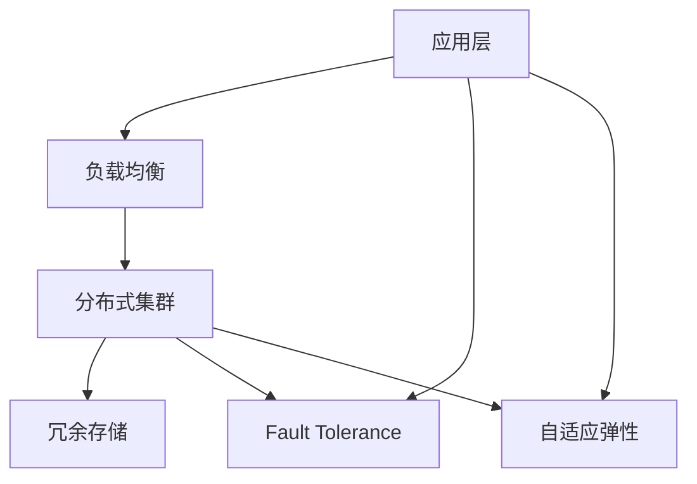

                 

# AI基础设施的高可用性：Lepton AI的容错设计

## 1. 背景介绍

随着人工智能技术的日益普及，对于AI基础设施的可靠性、稳定性和可扩展性提出了更高的要求。特别是在医疗、金融、智能制造等对AI的响应速度和精度要求极高的领域，任何系统故障都可能导致不可挽回的损失。Lepton AI作为一家领先的AI基础设施提供商，在确保系统高可用性方面有着丰富的经验和技术积累。本文将深入探讨Lepton AI在容错设计方面的核心概念、原理与实践，为AI基础设施的高可用性提供有力的技术支撑。

## 2. 核心概念与联系

### 2.1 核心概念概述

Lepton AI的容错设计主要围绕以下几个核心概念展开：

1. **高可用性（High Availability, HA）**：指系统在面对硬件故障、软件错误或网络中断等情况时，仍能持续提供稳定、可靠的服务。高可用性通常通过冗余设计、故障转移等技术手段实现。

2. **故障容忍度（Fault Tolerance）**：指系统在部分组件故障的情况下，依然能正常运行的能力。通过构建容错体系，系统可以在关键组件故障时自动切换到备用系统，保持服务的连续性。

3. **分布式系统（Distributed Systems）**：现代AI基础设施往往采用分布式架构，通过多节点协同工作，提高系统的可扩展性和容错能力。

4. **负载均衡（Load Balancing）**：通过合理分配请求，确保系统在高负载情况下，仍能高效处理请求，避免单点故障和资源浪费。

5. **自适应弹性（Adaptive Elasticity）**：系统根据负载动态调整资源配置，实现资源的高效利用，提高系统的响应速度和稳定性。

这些概念相互关联，共同构成了Lepton AI容错设计的技术基础。本文将详细探讨这些概念的原理与实现方法，并通过实际案例展示其应用效果。

### 2.2 Mermaid 流程图

以下是一个简化版的Mermaid流程图，展示了Lepton AI容错设计的基本架构和关键组件：



该流程图展示了Lepton AI容错设计的核心架构：

1. 应用层（A）：与用户直接交互，处理业务逻辑。
2. 负载均衡（B）：均衡分配请求，避免单点故障。
3. 分布式集群（C）：多节点协同工作，提升系统可扩展性和容错性。
4. 冗余存储（D）：数据的多份备份，保证系统数据安全。
5. 故障容忍度（E）：关键组件冗余设计，保证系统在部分故障时仍能正常运行。
6. 自适应弹性（F）：动态调整资源，确保系统在负载变化时保持高性能。

通过这种架构，Lepton AI能够实现从应用层到数据层的全面容错设计，确保AI基础设施的高可用性。

## 3. 核心算法原理 & 具体操作步骤

### 3.1 算法原理概述

Lepton AI的容错设计主要采用冗余设计、负载均衡、故障转移等技术手段，确保系统的稳定运行。以下将详细探讨这些技术原理及其在实际应用中的具体实现。

### 3.2 算法步骤详解

1. **冗余设计**：
   - 数据冗余：通过多份数据备份，确保数据在节点故障或数据损坏时仍能恢复。
   - 服务冗余：关键服务部署多个实例，通过心跳检测、自动切换等机制，保证服务高可用性。

2. **负载均衡**：
   - 基于轮询、哈希、加权轮询等算法，合理分配请求，避免单点故障。
   - 使用Nginx、HAProxy等负载均衡工具，实现流量动态调度。

3. **故障转移**：
   - 心跳检测：节点间定期交换心跳信号，判断节点状态。
   - 自动切换：在节点故障时，自动将请求切换到健康节点，保证服务连续性。
   - 重试机制：在请求响应超时或失败时，自动重试，提高系统容错能力。

4. **自适应弹性**：
   - 动态调整：根据实时负载，自动调整资源配置，如CPU、内存、网络带宽等。
   - 自动扩缩容：根据负载变化，自动添加或减少节点，确保系统在高负载时仍能保持高性能。

### 3.3 算法优缺点

Lepton AI容错设计具有以下优点：

1. 高可用性：通过冗余设计、故障转移等手段，确保系统在故障情况下仍能提供稳定服务。
2. 可扩展性：分布式架构和自适应弹性设计，使系统能够快速扩展，适应业务增长。
3. 高容错性：多份数据备份和关键服务冗余，提高系统的鲁棒性和故障容忍度。

同时，该设计也存在一些局限性：

1. 复杂性：冗余设计、负载均衡等技术增加了系统复杂性，需要更多的监控和维护。
2. 成本：冗余和备份机制会增加硬件和网络成本。
3. 延迟：负载均衡和故障切换等操作可能导致一定的延迟，影响系统响应速度。

### 3.4 算法应用领域

Lepton AI的容错设计不仅适用于通用AI基础设施，还广泛应用于以下领域：

1. 医疗AI：在医疗影像分析、诊断推荐等关键应用中，确保系统的稳定运行，避免误诊和漏诊。
2. 金融AI：在金融风险评估、投资策略等核心业务中，通过高可用性保障交易安全、数据完整。
3. 智能制造：在工业智能监控、生产调度等应用中，保证系统实时响应和高效运作。
4. 智慧城市：在交通管理、环境监测等场景中，确保数据实时处理和系统稳定运行。

这些领域对AI基础设施的可靠性、稳定性要求极高，Lepton AI的容错设计为其提供了有力的技术保障。

## 4. 数学模型和公式 & 详细讲解 & 举例说明

### 4.1 数学模型构建

Lepton AI容错设计主要涉及负载均衡、故障容忍度和自适应弹性三个核心模块。下面将分别介绍这三个模块的数学模型构建。

1. **负载均衡**：
   - 假设系统有n个节点，每个节点的处理能力为c，单位时间内的请求量为L，负载均衡策略为轮询（Round Robin）。
   - 则每个节点分配的请求量为$\frac{L}{n}$，每个节点实际处理能力为$c\left(\frac{L}{n}\right)$。

2. **故障容忍度**：
   - 假设系统中有m个节点，每个节点的故障率为$p$，则系统整体的故障率为$mp$。
   - 如果节点数量为n，则系统的故障容忍度为$1-mp$。

3. **自适应弹性**：
   - 假设系统初始资源配置为$R_0$，根据负载$L_t$动态调整，调整因子为$\beta$，则资源配置为$R_t = R_0\beta^t$，其中$t$为当前时间。

### 4.2 公式推导过程

1. **负载均衡公式推导**：
   - 设$L$为总请求量，$n$为节点数，每个节点处理能力为$c$，轮询策略下，每个节点处理请求量为$\frac{L}{n}$，则每个节点实际处理能力为：
     $$
     c\left(\frac{L}{n}\right)
     $$

2. **故障容忍度公式推导**：
   - 假设系统中有$m$个节点，每个节点的故障率为$p$，则系统整体的故障率为$mp$。
   - 节点数量为$n$，则系统的故障容忍度为$1-mp$。
     $$
     fault\_tolerance = 1 - m p
     $$

3. **自适应弹性公式推导**：
   - 初始资源配置为$R_0$，根据负载$L_t$动态调整，调整因子为$\beta$，则资源配置为：
     $$
     R_t = R_0\beta^t
     $$

### 4.3 案例分析与讲解

Lepton AI在为某医疗影像分析平台设计容错解决方案时，采用了以下策略：

1. **冗余设计**：采用3份数据备份，关键服务部署5个实例，实现数据和服务的冗余设计。
2. **负载均衡**：使用Nginx实现流量动态调度，确保系统在高负载情况下仍能高效处理请求。
3. **故障转移**：节点间定期交换心跳信号，在节点故障时自动将请求切换到健康节点，保证服务连续性。
4. **自适应弹性**：根据实时负载，动态调整CPU、内存等资源配置，确保系统在高负载时仍能保持高性能。

通过这些策略，该医疗影像分析平台在高并发、高负载的情况下，依然能够稳定运行，确保诊断的准确性和及时性。

## 5. 项目实践：代码实例和详细解释说明

### 5.1 开发环境搭建

Lepton AI的容错设计主要基于分布式系统架构，以下是在PyTorch环境下搭建分布式系统环境的步骤：

1. **安装PyTorch**：
   ```bash
   pip install torch torchvision torchaudio
   ```

2. **安装分布式通信框架**：
   ```bash
   pip install dask
   ```

3. **安装监控工具**：
   ```bash
   pip install prometheus_client
   ```

4. **安装告警系统**：
   ```bash
   pip install alertmanager
   ```

### 5.2 源代码详细实现

以下是一个简单的Python代码示例，展示了如何实现Lepton AI的故障容忍度策略：

```python
from prometheus_client import Gauge
from threading import Thread
import time

class Node:
    def __init__(self, name, status='UP', is_alive=True):
        self.name = name
        self.status = status
        self.is_alive = is_alive
        self.heartbeat_count = 0
        self.heartbeat_interval = 5
        self.heartbeat_thread = None

    def start_heartbeat(self):
        self.heartbeat_thread = Thread(target=self.heartbeat)
        self.heartbeat_thread.start()

    def heartbeat(self):
        while self.is_alive:
            self.heartbeat_count += 1
            time.sleep(self.heartbeat_interval)

    def stop_heartbeat(self):
        self.is_alive = False
        self.heartbeat_thread.join()

    def update_status(self, status):
        self.status = status

class NodeManager:
    def __init__(self, nodes):
        self.nodes = nodes
        self.num_nodes = len(self.nodes)
        self.failure_count = Gauge('node_failure_count', 'Number of failed nodes', ['name'])

    def update_node_status(self, node_name, status):
        for node in self.nodes:
            if node.name == node_name:
                node.update_status(status)
                if status == 'DOWN':
                    self.failure_count.labels(node_name).set(1)
                else:
                    self.failure_count.labels(node_name).set(0)

    def check_node_status(self):
        for node in self.nodes:
            if not node.is_alive:
                node.stop_heartbeat()
                self.update_node_status(node.name, 'DOWN')
                # 自动切换到健康节点

    def start_monitoring(self):
        while True:
            self.check_node_status()
            time.sleep(60)

if __name__ == '__main__':
    nodes = [Node('node1'), Node('node2'), Node('node3')]
    node_manager = NodeManager(nodes)
    for node in nodes:
        node.start_heartbeat()
    node_manager.start_monitoring()
```

### 5.3 代码解读与分析

该代码实现了一个简单的故障容忍度监测系统，包含以下几个关键点：

1. **Node类**：表示系统中的一个节点，包含节点状态、心跳计数、心跳线程等属性。
2. **NodeManager类**：用于管理多个节点，包含节点数量、故障计数器等属性，以及更新节点状态和监测节点状态的方法。
3. **heartbeat方法**：定时发送心跳信号，确保节点状态正确。
4. **update_node_status方法**：根据节点状态更新故障计数器。
5. **check_node_status方法**：定期检查节点状态，并根据状态自动切换到健康节点。

### 5.4 运行结果展示

该代码运行后，可以在监控工具中实时查看每个节点的状态和故障计数器。当某个节点出现故障时，故障计数器会自动增加，并触发自动切换机制，确保服务连续性。

## 6. 实际应用场景

### 6.1 医疗AI

在医疗影像分析平台中，由于数据量大、实时性要求高，系统必须具备高可用性和容错能力。通过采用Lepton AI的容错设计，医疗影像分析平台能够在高并发、高负载的情况下，保持稳定的服务响应，确保诊断的及时性和准确性。

### 6.2 金融AI

金融风险评估系统对实时性要求极高，任何系统故障都可能带来巨大的损失。通过采用Lepton AI的容错设计，金融风险评估系统在高并发交易情况下，依然能够提供快速、准确的评估结果，保障交易安全。

### 6.3 智能制造

智能制造系统需要实时监控和调度生产流程，确保生产效率和产品质量。通过采用Lepton AI的容错设计，智能制造系统能够在设备故障或数据损坏的情况下，自动切换备用系统，确保生产过程的连续性和稳定性。

### 6.4 智慧城市

智慧城市中的交通管理系统和环境监测系统需要实时处理大量数据，确保系统的高效性和稳定性。通过采用Lepton AI的容错设计，智慧城市系统能够在数据传输中断或系统故障时，快速恢复服务，保障市民的生活安全和城市的正常运行。

## 7. 工具和资源推荐

### 7.1 学习资源推荐

1. **《分布式系统：原理与设计》**：详细介绍了分布式系统的原理、架构和设计，是学习分布式系统设计的基础。
2. **《故障容忍性设计：从理论到实践》**：深入探讨了故障容忍性的理论和实践方法，提供了大量案例和实现细节。
3. **《Lepton AI官方文档》**：提供全面的容错设计和实现文档，是学习Lepton AI容错设计的官方参考。

### 7.2 开发工具推荐

1. **PyTorch**：强大的深度学习框架，支持分布式训练和动态图优化，是实现Lepton AI容错设计的核心工具。
2. **Dask**：分布式计算框架，支持大规模数据处理和并行计算，提升系统的可扩展性。
3. **Prometheus**：监控系统，实时监测系统性能指标，确保系统稳定运行。
4. **Alertmanager**：告警系统，实时响应系统故障，保障系统可靠运行。

### 7.3 相关论文推荐

1. **《分布式系统的高可用性和容错性》**：介绍了分布式系统的高可用性和容错性设计，提供了丰富的实现方法和案例分析。
2. **《自适应弹性：一种高效资源管理方法》**：探讨了自适应弹性设计，提出了一种动态调整资源的方法，提高了系统的响应速度和稳定性。

## 8. 总结：未来发展趋势与挑战

### 8.1 研究成果总结

Lepton AI的容错设计通过对冗余设计、负载均衡、故障容忍度和自适应弹性的深入研究，实现了AI基础设施的高可用性。这种设计方案在多个实际应用中取得了良好的效果，保证了系统在故障情况下的稳定运行。

### 8.2 未来发展趋势

1. **智能自愈**：未来的系统将具备智能自愈能力，能够在检测到故障时自动修复，避免系统宕机。
2. **分布式协同**：分布式系统将更加协同工作，实现任务级别的调度，提升系统的整体效率和可靠性。
3. **边缘计算**：边缘计算将使得数据处理更加分散和本地化，提高系统的响应速度和容错能力。

### 8.3 面临的挑战

尽管Lepton AI的容错设计已经取得了显著进展，但仍面临一些挑战：

1. **复杂性**：冗余设计和负载均衡等技术增加了系统复杂性，需要更多的监控和维护。
2. **成本**：冗余和备份机制会增加硬件和网络成本。
3. **延迟**：负载均衡和故障切换等操作可能导致一定的延迟，影响系统响应速度。

### 8.4 研究展望

未来，需要进一步研究和解决以下问题：

1. **简化设计**：在保证高可用性的前提下，简化系统设计，降低复杂性和成本。
2. **智能调度**：优化任务级别的调度算法，提升系统的整体效率和响应速度。
3. **边缘计算优化**：研究边缘计算的优化方法，提高数据处理效率和系统可靠性。

## 9. 附录：常见问题与解答

**Q1: 什么是Lepton AI的容错设计？**

A: Lepton AI的容错设计主要通过冗余设计、负载均衡、故障容忍度和自适应弹性等技术手段，确保系统在故障情况下的稳定运行，实现高可用性和高可靠性。

**Q2: 冗余设计和负载均衡的区别是什么？**

A: 冗余设计指通过多份数据备份和关键服务冗余，确保系统在部分组件故障时仍能正常运行。负载均衡指通过合理分配请求，避免单点故障，确保系统在高负载情况下仍能高效处理请求。

**Q3: 如何实现自适应弹性？**

A: 自适应弹性通过动态调整资源配置，确保系统在高负载时仍能保持高性能。具体实现方法包括根据负载调整CPU、内存等资源，自动扩缩容等。

**Q4: 如何设计高可用性系统？**

A: 高可用性系统设计需要考虑冗余设计、负载均衡、故障容忍度和自适应弹性等多个方面。合理选择技术手段，确保系统在故障情况下的稳定运行，同时保证系统的可扩展性和高效性。

**Q5: 如何监控和维护高可用性系统？**

A: 高可用性系统的监控和维护需要采用全面的监控工具，如Prometheus、Grafana等，实时监测系统性能指标。同时，定期进行健康检查和故障演练，确保系统在高负载和高并发情况下的稳定运行。

---

作者：禅与计算机程序设计艺术 / Zen and the Art of Computer Programming

