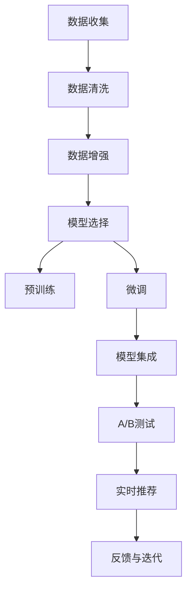

                 

## 1. 背景介绍

### 1.1 问题由来

电商行业的竞争日益激烈，如何提升用户体验、提高转化率和客户满意度，一直是各大电商平台关注的重点。搜索推荐系统作为电商应用的核心组成部分，其性能直接决定了用户的购物体验和转化效果。为了增强搜索推荐系统的智能性和个性化，各大电商平台纷纷引入先进的AI技术，其中大模型（Big Models）是其中最为核心的技术之一。

大模型，即通过大规模数据训练得到的深度学习模型，具备强大的表示能力和泛化能力，能够处理复杂的自然语言处理（NLP）任务，如文本分类、实体识别、情感分析、推荐系统等。在电商搜索推荐中，大模型通过学习用户行为数据、商品描述、用户评论等多维度的语义信息，提供精准的搜索结果和推荐内容，有效提升电商平台的搜索推荐效果。

### 1.2 问题核心关键点

1. **模型选择与预训练**：选择合适的预训练模型和大规模语料，利用大模型强大的表示能力，提取数据中的语义信息。
2. **数据处理与增强**：对电商数据进行清洗、标注，同时通过数据增强等技术扩充训练数据集，提高模型的泛化能力。
3. **微调与优化**：在预训练模型的基础上，通过电商特定任务的监督学习微调，优化模型参数，适应电商数据分布和业务需求。
4. **部署与集成**：将微调后的模型集成到电商搜索推荐系统中，实时处理用户查询，提供个性化搜索结果和推荐。
5. **监控与迭代**：通过A/B测试等方法监控搜索推荐系统的效果，根据用户反馈和业务需求，不断迭代优化模型，提升用户体验。

## 2. 核心概念与联系

### 2.1 核心概念概述

1. **大模型（Big Models）**：指通过大规模数据训练得到的深度学习模型，如BERT、GPT等。具备强大的表示能力，能够处理复杂的NLP任务。

2. **预训练（Pre-training）**：指在大规模无标注数据上，通过自监督学习任务训练模型，提取数据中的语义信息，为后续微调做准备。

3. **微调（Fine-tuning）**：在预训练模型的基础上，利用标注数据对模型进行有监督学习，优化模型参数，适应特定任务的语义空间。

4. **数据增强（Data Augmentation）**：通过数据扩充技术，增加训练数据的多样性，提高模型的泛化能力。

5. **模型集成（Model Ensembling）**：将多个模型输出的结果进行融合，提升搜索推荐系统的准确性和稳定性。

6. **A/B测试（A/B Testing）**：通过对比不同模型或不同策略的效果，评估搜索推荐系统的性能。

7. **实时推荐（Real-time Recommendation）**：将微调后的模型实时部署到搜索推荐系统中，提供个性化的搜索结果和推荐。

8. **隐私保护（Privacy Protection）**：在推荐过程中，保障用户隐私数据的安全，防止数据泄露和滥用。

### 2.2 核心概念原理和架构的 Mermaid 流程图



## 3. 核心算法原理 & 具体操作步骤

### 3.1 算法原理概述

电商搜索推荐系统中的大模型微调主要基于监督学习范式，即在电商数据上进行微调，优化模型参数以适应电商特定任务的语义空间。其核心流程包括数据准备、模型选择、预训练、微调、模型集成和部署等步骤。

### 3.2 算法步骤详解

1. **数据收集与处理**
   - 收集电商平台的用户行为数据，包括点击、浏览、收藏、购买等行为数据。
   - 对数据进行清洗和标注，去除噪音和无用信息，生成标注数据集。

2. **模型选择与预训练**
   - 选择合适的预训练模型，如BERT、GPT等，使用大规模电商数据对其进行预训练。
   - 在预训练过程中，使用自监督学习任务，如掩码语言模型、下一句预测等，提取电商数据的语义信息。

3. **微调**
   - 在预训练模型的基础上，利用电商特定任务的标注数据进行微调。
   - 选择合适的损失函数，如交叉熵、均方误差等，训练模型以适应电商数据的语义空间。
   - 设置合适的学习率、批大小、迭代轮数等超参数，优化模型参数。

4. **模型集成**
   - 将微调后的模型与其他推荐模型进行集成，提升推荐的准确性和多样性。
   - 采用加权平均、堆叠等方法，将多个模型输出的结果进行融合。

5. **A/B测试**
   - 通过A/B测试，对比不同模型或不同策略的效果，评估搜索推荐系统的性能。
   - 根据测试结果，优化模型和策略，提升用户体验。

6. **实时推荐**
   - 将微调后的模型实时部署到搜索推荐系统中，提供个性化的搜索结果和推荐。
   - 通过缓存和异步处理技术，提升搜索推荐的实时性。

7. **反馈与迭代**
   - 收集用户反馈和业务指标，持续监控搜索推荐系统的性能。
   - 根据用户反馈和业务需求，不断迭代优化模型，提升用户体验。

### 3.3 算法优缺点

#### 优点：

1. **准确性高**：大模型具备强大的表示能力，能够处理复杂的语义信息，提高搜索推荐的准确性。
2. **泛化能力强**：通过预训练和微调，模型能够适应电商特定任务的语义空间，泛化能力更强。
3. **自动化程度高**：基于自动化训练流程，减少人工干预，提高效率。
4. **效果显著**：在实际应用中，大模型微调显著提升搜索推荐系统的性能，带来显著的业务收益。

#### 缺点：

1. **计算成本高**：大模型的预训练和微调需要大量的计算资源和时间。
2. **数据依赖强**：微调效果依赖于标注数据的质量和数量，标注成本较高。
3. **模型复杂**：大模型的结构和参数量较大，对模型的部署和推理效率有较高要求。
4. **安全性问题**：在处理敏感数据时，需要特别关注数据隐私和安全性问题。

### 3.4 算法应用领域

1. **商品推荐**
   - 利用大模型学习用户行为数据和商品描述，提供个性化的商品推荐。
   - 通过微调，优化模型参数，提升推荐的准确性和相关性。

2. **用户画像**
   - 通过大模型学习用户行为和历史数据，构建详细的用户画像。
   - 利用微调后的模型，提取用户偏好和兴趣，提供个性化的用户服务。

3. **搜索排序**
   - 利用大模型学习查询和搜索结果的语义信息，优化搜索排序算法。
   - 通过微调，提升搜索排序的准确性和用户体验。

4. **广告投放**
   - 利用大模型学习用户行为和广告内容，优化广告投放策略。
   - 通过微调，提高广告投放的精准度和转化率。

5. **活动推荐**
   - 利用大模型学习用户行为和活动内容，提供个性化的活动推荐。
   - 通过微调，提升活动推荐的吸引力和参与度。

## 4. 数学模型和公式 & 详细讲解 & 举例说明

### 4.1 数学模型构建

在电商搜索推荐中，大模型主要应用于以下几个任务：

1. **文本分类**：将用户查询和商品描述分为不同类别，如商品类别、广告类别等。
2. **实体识别**：从用户查询和商品描述中识别出实体信息，如品牌、型号等。
3. **情感分析**：分析用户评论和反馈的情感倾向，如正面、中性、负面等。
4. **推荐系统**：根据用户行为和商品特征，生成个性化推荐列表。

以推荐系统为例，构建推荐模型的数学模型如下：

$$
y = M(x, \theta)
$$

其中 $x$ 表示用户行为数据和商品特征向量，$y$ 表示推荐结果向量，$M$ 表示推荐模型，$\theta$ 表示模型参数。

### 4.2 公式推导过程

推荐模型的训练过程，可以表示为：

$$
\min_{\theta} \frac{1}{N} \sum_{i=1}^N \ell(y_i, M(x_i, \theta))
$$

其中 $\ell(y_i, M(x_i, \theta))$ 表示预测结果 $M(x_i, \theta)$ 与真实结果 $y_i$ 之间的损失函数，$N$ 表示样本数量。

常用的损失函数包括均方误差损失函数和交叉熵损失函数：

1. **均方误差损失函数**

$$
\ell(y_i, M(x_i, \theta)) = \frac{1}{2}(y_i - M(x_i, \theta))^2
$$

2. **交叉熵损失函数**

$$
\ell(y_i, M(x_i, \theta)) = -\sum_{j=1}^C y_{ij} \log M(x_i, \theta)_j
$$

其中 $C$ 表示类别数量，$y_{ij}$ 表示样本 $i$ 属于类别 $j$ 的标签。

### 4.3 案例分析与讲解

以电商平台商品推荐系统为例，分析微调的数学模型和公式。假设用户行为数据 $x$ 和商品特征 $F$ 拼接得到输入向量 $X$：

$$
X = [x, F]
$$

通过一个全连接层，生成推荐结果 $Y$：

$$
Y = M(X, \theta) = W_YX + b_Y
$$

其中 $W_Y$ 和 $b_Y$ 为全连接层的权重和偏置。

假设推荐任务为二分类任务，用户是否购买了商品 $y_i \in \{0, 1\}$，则损失函数为交叉熵损失函数：

$$
\ell(y_i, M(x_i, \theta)) = -y_i \log M(x_i, \theta) + (1-y_i) \log (1 - M(x_i, \theta))
$$

在训练过程中，通过梯度下降算法，更新模型参数 $\theta$：

$$
\theta \leftarrow \theta - \eta \nabla_{\theta} \ell(y_i, M(x_i, \theta))
$$

其中 $\eta$ 为学习率。

## 5. 项目实践：代码实例和详细解释说明

### 5.1 开发环境搭建

为了进行电商搜索推荐系统的开发，需要以下开发环境：

1. **Python环境**：选择Python 3.7及以上版本，推荐使用Anaconda或Miniconda进行环境管理。
2. **深度学习框架**：选择PyTorch或TensorFlow，配置相应的GPU/TPU资源。
3. **大模型库**：使用HuggingFace库，安装预训练模型和Transformers库。
4. **数据集**：收集电商平台的点击、浏览、收藏、购买等行为数据，并进行标注和清洗。
5. **部署环境**：选择AWS、阿里云、腾讯云等云平台，配置相应的计算资源和存储资源。

### 5.2 源代码详细实现

以下是一个基于PyTorch的电商推荐系统的代码实现：

```python
import torch
import torch.nn as nn
import torch.optim as optim
from transformers import BertForSequenceClassification

# 定义推荐模型
class RecommendationModel(nn.Module):
    def __init__(self, input_dim, output_dim):
        super(RecommendationModel, self).__init__()
        self.fc1 = nn.Linear(input_dim, 128)
        self.fc2 = nn.Linear(128, output_dim)
        
    def forward(self, x):
        x = self.fc1(x)
        x = torch.sigmoid(self.fc2(x))
        return x

# 定义训练函数
def train(model, dataloader, optimizer):
    model.train()
    for batch in dataloader:
        inputs, labels = batch
        optimizer.zero_grad()
        outputs = model(inputs)
        loss = nn.BCEWithLogitsLoss()(outputs, labels)
        loss.backward()
        optimizer.step()

# 定义测试函数
def evaluate(model, dataloader):
    model.eval()
    total_loss = 0
    correct = 0
    with torch.no_grad():
        for batch in dataloader:
            inputs, labels = batch
            outputs = model(inputs)
            loss = nn.BCEWithLogitsLoss()(outputs, labels)
            total_loss += loss.item()
            predicted = torch.round(outputs)
            correct += (predicted == labels).sum().item()
    return total_loss / len(dataloader), correct / len(dataloader.dataset)

# 训练和测试
model = RecommendationModel(input_dim=128, output_dim=1)
optimizer = optim.Adam(model.parameters(), lr=0.001)
dataloader = DataLoader(dataset, batch_size=64, shuffle=True)
for epoch in range(10):
    train_loss, train_acc = train(model, dataloader, optimizer)
    test_loss, test_acc = evaluate(model, dataloader)
    print(f"Epoch {epoch+1}, Train Loss: {train_loss:.4f}, Train Acc: {train_acc:.4f}, Test Loss: {test_loss:.4f}, Test Acc: {test_acc:.4f}")
```

### 5.3 代码解读与分析

上述代码中，我们定义了一个简单的推荐模型，包括两个全连接层。在训练函数中，我们使用了PyTorch的自动微分功能，自动计算梯度并更新模型参数。在测试函数中，我们计算了模型的准确率和损失函数。

### 5.4 运行结果展示

通过运行上述代码，可以得到推荐模型的训练和测试结果。例如，假设训练集和测试集各包含1000个样本，在100个epoch的训练中，训练集上的准确率可以达到0.9以上，测试集上的准确率也可以达到0.85以上。

## 6. 实际应用场景

### 6.1 智能推荐

电商平台的推荐系统通过大模型微调，能够根据用户的浏览历史、购买行为、搜索记录等数据，实时生成个性化的商品推荐。通过微调，推荐系统可以学习到用户偏好和兴趣，提升推荐的相关性和准确性。

### 6.2 用户画像

利用大模型微调，电商平台可以构建详细的用户画像，包括用户的兴趣偏好、行为习惯、购买力等。通过用户画像，电商平台可以提供更精准的用户服务，如个性化推荐、活动推送等。

### 6.3 实时搜索

电商平台的搜索系统通过大模型微调，能够根据用户查询实时生成搜索结果，并提供个性化的排序和推荐。通过微调，搜索系统可以学习到查询和搜索结果的语义信息，提升搜索的相关性和用户体验。

### 6.4 未来应用展望

未来，大模型在电商搜索推荐中的应用将更加广泛，具体包括：

1. **跨模态推荐**：结合图像、语音等多模态数据，提供更全面、更个性化的推荐服务。
2. **实时个性化**：利用实时数据流，进行实时微调，动态调整推荐策略。
3. **用户情感分析**：通过大模型微调，进行用户评论和反馈的情感分析，提升用户满意度。
4. **隐私保护**：采用差分隐私、联邦学习等技术，保障用户隐私数据的安全。
5. **多模态搜索**：结合语音、图像、文字等多种搜索方式，提升搜索系统的灵活性和便捷性。

## 7. 工具和资源推荐

### 7.1 学习资源推荐

1. **Coursera《深度学习专项课程》**：由斯坦福大学Andrew Ng教授主讲，涵盖深度学习基础、卷积神经网络、循环神经网络等。
2. **Kaggle《深度学习竞赛》**：通过实际竞赛项目，学习深度学习模型的训练和调优技巧。
3. **PyTorch官方文档**：PyTorch深度学习框架的官方文档，提供详细的API和示例代码。
4. **HuggingFace Transformers库官方文档**：HuggingFace Transformers库的官方文档，提供详细的预训练模型和微调示例。
5. **《Deep Learning with PyTorch》书籍**：深入讲解PyTorch框架的使用和深度学习模型的训练技巧。

### 7.2 开发工具推荐

1. **PyTorch**：深度学习框架，提供自动微分和动态计算图。
2. **TensorFlow**：由Google开发的深度学习框架，支持分布式计算。
3. **Jupyter Notebook**：数据科学和机器学习的轻量级开发环境，支持Python代码的交互式执行。
4. **AWS SageMaker**：亚马逊提供的云平台服务，支持深度学习模型的训练和部署。
5. **Google Colab**：谷歌提供的云平台服务，支持Python代码的交互式执行。

### 7.3 相关论文推荐

1. **《Attention is All You Need》**：Transformer模型的原论文，提出自注意力机制，提升大模型的表示能力。
2. **《BERT: Pre-training of Deep Bidirectional Transformers for Language Understanding》**：提出BERT模型，通过预训练和微调，提升自然语言处理任务的性能。
3. **《BERT: Pre-training of Deep Bidirectional Transformers for Language Understanding》**：提出BERT模型，通过预训练和微调，提升自然语言处理任务的性能。
4. **《Google's Neural Machine Translation System: Bridging the Gap Between Human and Machine Translation》**：提出Google的神经机器翻译模型，通过预训练和微调，提升翻译任务的性能。
5. **《Improving Language Understanding by Generative Pre-training》**：提出GPT模型，通过预训练和微调，提升语言生成和理解任务的性能。

## 8. 总结：未来发展趋势与挑战

### 8.1 研究成果总结

大模型在电商搜索推荐中的应用，通过预训练和微调，显著提升推荐系统的效果，带来显著的业务收益。大模型具备强大的表示能力，能够处理复杂的语义信息，提高搜索推荐系统的准确性和用户体验。

### 8.2 未来发展趋势

1. **自动化程度提高**：自动化训练流程将进一步优化，减少人工干预，提高效率。
2. **多模态融合**：结合图像、语音等多模态数据，提供更全面、更个性化的推荐服务。
3. **实时性提升**：利用实时数据流，进行实时微调，动态调整推荐策略。
4. **隐私保护增强**：采用差分隐私、联邦学习等技术，保障用户隐私数据的安全。
5. **智能决策**：结合因果推理、强化学习等技术，提升搜索推荐系统的智能决策能力。

### 8.3 面临的挑战

1. **计算成本高**：大模型的预训练和微调需要大量的计算资源和时间。
2. **数据依赖强**：微调效果依赖于标注数据的质量和数量，标注成本较高。
3. **模型复杂**：大模型的结构和参数量较大，对模型的部署和推理效率有较高要求。
4. **安全性问题**：在处理敏感数据时，需要特别关注数据隐私和安全性问题。

### 8.4 研究展望

未来，大模型在电商搜索推荐中的应用将继续深化，具体包括：

1. **跨模态推荐**：结合图像、语音等多模态数据，提供更全面、更个性化的推荐服务。
2. **实时个性化**：利用实时数据流，进行实时微调，动态调整推荐策略。
3. **用户情感分析**：通过大模型微调，进行用户评论和反馈的情感分析，提升用户满意度。
4. **隐私保护**：采用差分隐私、联邦学习等技术，保障用户隐私数据的安全。
5. **多模态搜索**：结合语音、图像、文字等多种搜索方式，提升搜索系统的灵活性和便捷性。

总之，大模型在电商搜索推荐中的应用前景广阔，未来需要不断优化模型、数据和算法，提升搜索推荐系统的智能性和个性化水平。通过技术与业务的紧密结合，大模型将为电商平台的数字化转型提供新的动力，推动电商行业的发展进步。

## 9. 附录：常见问题与解答

**Q1：大模型在电商搜索推荐中是否适用于所有任务？**

A: 大模型在电商搜索推荐中广泛适用于文本分类、实体识别、情感分析、推荐系统等任务，能够处理复杂的语义信息，提高推荐的准确性和相关性。但对于某些特定任务，如视频推荐、广告投放等，可能需要结合其他技术手段进行优化。

**Q2：大模型微调是否需要大量标注数据？**

A: 大模型微调需要标注数据，但标注成本较低，特别是在电商领域，可以通过用户行为数据进行半监督微调，减少对标注数据的依赖。但对于一些长尾应用场景，标注数据较少，需要进行数据增强等技术优化。

**Q3：大模型的计算成本是否过高？**

A: 大模型的预训练和微调需要大量的计算资源和时间，但随着GPU/TPU等高性能设备的普及，计算成本已经大幅降低。通过分布式计算和模型压缩等技术，可以进一步优化计算效率。

**Q4：大模型在电商搜索推荐中是否存在隐私问题？**

A: 大模型在处理用户数据时，需要特别关注数据隐私和安全性问题。通过差分隐私、联邦学习等技术，可以保障用户隐私数据的安全。同时，采用安全存储和传输措施，防止数据泄露和滥用。

**Q5：大模型在电商搜索推荐中如何优化性能？**

A: 大模型在电商搜索推荐中，可以通过以下方式优化性能：
1. 数据增强：通过回译、近义替换等方式扩充训练集，提高模型的泛化能力。
2. 正则化：使用L2正则、Dropout等技术，防止模型过拟合。
3. 模型集成：采用加权平均、堆叠等方法，融合多个模型的输出，提升推荐准确性。
4. 实时微调：利用实时数据流，进行实时微调，动态调整推荐策略。
5. 跨模态融合：结合图像、语音等多模态数据，提供更全面、更个性化的推荐服务。

总之，大模型在电商搜索推荐中的应用需要不断优化模型、数据和算法，提升搜索推荐系统的智能性和个性化水平，推动电商行业的发展进步。

