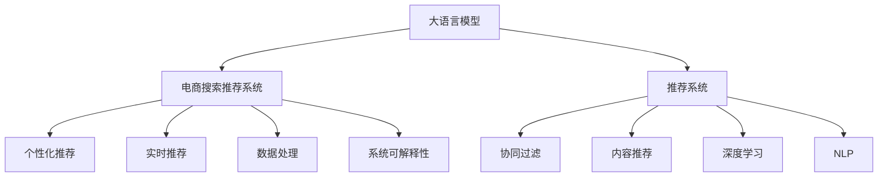

                 

# AI大模型助力电商搜索推荐业务的敏捷开发实践

> 关键词：大模型,电商搜索,推荐系统,商品推荐,产品搜索,智能客服,深度学习,自然语言处理,自然语言理解,自然语言生成

## 1. 背景介绍

### 1.1 问题由来
随着电子商务的迅猛发展，电商平台需要处理海量用户行为数据，以提供高效精准的商品推荐服务。传统的基于规则的推荐算法已难以满足用户个性化和实时化的需求。基于人工智能的推荐系统通过深度学习和大数据技术，能够从用户历史行为、商品属性、环境因素等多个维度挖掘用户偏好，实现更加个性化和精细化的商品推荐。

近年来，大语言模型和大规模预训练模型的研究取得了突破性进展，为推荐系统的智能化转型提供了新的动力。大模型通过在无标签海量数据上预训练，能够学习到丰富的语言知识和常识，同时具备强大的理解生成能力。将大模型应用于电商推荐，可以构建更加智能化的搜索推荐系统，提升用户体验和销售转化率。

### 1.2 问题核心关键点
电商搜索推荐系统主要面临以下问题：
- 海量数据处理：电商平台每天产生大量用户行为数据，如何高效处理和利用这些数据？
- 数据分布差异：不同用户群体对商品的需求差异显著，如何构建多用户模型并进行个性化推荐？
- 实时推荐需求：用户行为实时变化，如何保证推荐系统的实时性和时效性？
- 系统可解释性：推荐系统的决策过程不透明，如何提升系统的可解释性和可解释性？

这些问题亟需高效、智能、可解释的推荐系统来解决。本文将介绍如何利用大语言模型和深度学习技术，构建高效智能的电商搜索推荐系统。

### 1.3 问题研究意义
构建高效智能的电商搜索推荐系统，对于提升用户体验和电商平台收入具有重要意义：

1. 提升用户满意度：个性化的推荐可以满足用户的个性化需求，提升用户满意度和粘性。
2. 提高销售转化率：精准的推荐可以显著提高用户的购买转化率，提升电商平台的收入。
3. 降低运营成本：通过智能推荐系统，可以自动化匹配用户需求，减少人工干预，降低运营成本。
4. 驱动数据增值：挖掘用户数据中的潜在价值，为电商平台的业务决策提供依据。

## 2. 核心概念与联系

### 2.1 核心概念概述

为更好地理解基于大模型的电商搜索推荐系统，本节将介绍几个密切相关的核心概念：

- 大语言模型(Large Language Model, LLM)：以自回归(如GPT)或自编码(如BERT)模型为代表的大规模预训练语言模型。通过在无标签海量数据上预训练，学习到丰富的语言知识和常识，具备强大的理解生成能力。

- 推荐系统(Recommendation System)：利用用户历史行为、商品属性等数据，为每个用户推荐最符合其偏好的商品的系统。推荐系统分为基于协同过滤、内容推荐、深度学习等多种技术路径，其中深度学习技术路径尤其受到关注。

- 深度学习(Deep Learning)：基于神经网络架构，通过多层非线性变换处理高维度数据，捕捉复杂数据分布的特征表示和映射关系。

- 自然语言处理(Natural Language Processing, NLP)：涉及自然语言理解、生成、分类、机器翻译等技术，利用大语言模型进行任务适配，可以提升推荐系统的自然语言理解能力。

- 电商搜索推荐系统(E-commerce Search and Recommendation System)：结合电商业务特点和用户行为数据，构建搜索推荐系统的专门技术框架。

这些核心概念之间的逻辑关系可以通过以下Mermaid流程图来展示：



这个流程图展示了大语言模型的核心概念及其与电商搜索推荐系统的联系：

1. 大语言模型通过预训练获得基础能力。
2. 推荐系统结合电商业务特点，采用多种技术路径。
3. 深度学习、自然语言处理等技术，提升推荐系统的智能化水平。
4. 电商搜索推荐系统，利用推荐技术提升用户体验和销售转化率。

这些概念共同构成了电商搜索推荐系统的技术框架，使其能够更好地满足电商平台的业务需求。通过理解这些核心概念，我们可以更好地把握大语言模型在电商推荐中的应用方向。

## 3. 核心算法原理 & 具体操作步骤
### 3.1 算法原理概述

基于大模型的电商搜索推荐系统，核心思想是利用大语言模型的高维特征表示和强大的理解生成能力，通过深度学习技术路径构建推荐模型。具体而言，主要涉及以下几个步骤：

1. 用户行为数据采集：收集用户浏览、点击、购买等行为数据，作为推荐系统的输入。
2. 商品属性数据提取：提取商品的标题、描述、类别等属性信息，作为推荐系统的参考。
3. 大语言模型预训练：在无标签海量数据上预训练大语言模型，学习通用语言表示。
4. 推荐模型训练：在预训练模型的基础上，使用用户行为数据和商品属性数据，通过深度学习技术路径构建推荐模型。
5. 实时推荐系统部署：将训练好的推荐模型部署到电商平台上，实现实时商品推荐。

### 3.2 算法步骤详解

#### 3.2.1 用户行为数据采集

电商平台上每天产生大量用户行为数据，包括但不限于：

- 点击行为：用户点击商品详情页的次数、时间、时长等。
- 浏览行为：用户浏览商品页面的时间、顺序、停留时长等。
- 购买行为：用户购买商品的数量、金额、时间等。
- 评价行为：用户对商品的评价、评分等。

这些数据可以通过电商平台的API接口、数据仓库等手段进行采集。为了提高推荐的准确性，需要选择合适的数据采集方式和时间间隔，同时对数据进行去重、清洗、归一化等预处理操作。

#### 3.2.2 商品属性数据提取

电商平台上每件商品都有相应的属性信息，如名称、价格、类别、品牌等。这些属性信息通常包含在商品的标题和描述中。为了提取这些属性信息，可以使用NLP技术对商品标题和描述进行处理。

具体而言，可以设计一个预训练的BERT模型，将商品的标题和描述作为输入，输出每个词汇的向量表示。然后，将每个词汇的向量表示与预定义的商品属性词向量进行匹配，得到商品的属性信息。例如，将"苹果"与"水果"进行匹配，得到"水果"属性。

#### 3.2.3 大语言模型预训练

在大规模无标签文本数据上预训练大语言模型，可以学习到丰富的语言知识和常识。以BERT为例，其预训练过程主要包括以下几个步骤：

1. 输入数据的准备：将文本数据进行分词、向量化，得到词汇向量序列。
2. 预训练目标任务的设定：通常使用掩码语言模型和下一句预测任务作为预训练目标。
3. 预训练模型的训练：在预训练数据上进行无监督学习，得到预训练模型参数。

预训练模型学习到的高维特征表示，可以用于提升推荐模型的泛化能力和性能。

#### 3.2.4 推荐模型训练

基于预训练的大语言模型，可以构建推荐模型。推荐模型主要包括以下几种类型：

1. 基于协同过滤的推荐模型：通过分析用户行为数据，找到与当前用户兴趣相似的其他用户，将他们喜欢的商品推荐给当前用户。
2. 基于内容推荐的推荐模型：通过分析商品的属性信息，找到与当前用户兴趣相似的商品，将其推荐给当前用户。
3. 基于深度学习的推荐模型：利用大语言模型的特征表示，通过深度神经网络进行推荐。

以深度学习推荐模型为例，其训练过程主要包括以下几个步骤：

1. 构建推荐模型：利用大语言模型的特征表示作为输入，构建深度神经网络模型。
2. 损失函数的设定：通常使用交叉熵损失函数来衡量推荐模型的预测精度。
3. 模型参数的更新：通过反向传播算法，根据损失函数更新模型参数，最小化预测误差。
4. 验证集和测试集的评估：在验证集和测试集上评估推荐模型的性能，调整模型参数和超参数。

#### 3.2.5 实时推荐系统部署

将训练好的推荐模型部署到电商平台上，实现实时商品推荐。具体而言，推荐系统需要具备以下几个功能：

1. 实时数据处理：对用户行为数据进行实时处理，提取当前用户的兴趣偏好。
2. 实时推荐计算：根据用户兴趣偏好和商品属性信息，实时计算推荐结果。
3. 实时结果展示：将推荐结果展示给用户，并提供用户交互界面。
4. 推荐结果更新：根据用户反馈和行为数据，实时更新推荐模型。

### 3.3 算法优缺点

基于大模型的电商搜索推荐系统具有以下优点：

1. 高维特征表示：大语言模型学习到的高维特征表示，可以捕捉用户和商品的复杂关系，提高推荐精度。
2. 强泛化能力：大模型在大规模数据上预训练，具备较强的泛化能力，能够适应不同用户和商品的变化。
3. 可解释性强：利用大语言模型的可解释性，可以更好地理解推荐系统的决策逻辑。
4. 实时推荐能力：大模型可以实时处理用户行为数据，提供个性化的实时推荐服务。

同时，该方法也存在以下局限性：

1. 数据隐私问题：电商平台需要处理大量用户数据，存在数据隐私和安全问题。
2. 计算资源需求高：大模型的训练和推理需要高算力支持，计算资源需求较高。
3. 模型复杂度高：大语言模型的复杂度较高，需要更高的模型压缩和优化技术。
4. 用户反馈响应速度慢：大模型的推理速度较慢，需要优化模型结构，提升推理速度。

尽管存在这些局限性，但就目前而言，基于大模型的电商推荐系统仍然是电商推荐技术的主流范式。未来相关研究的重点在于如何进一步降低计算资源需求，提高推荐系统的实时性和可解释性，同时兼顾数据隐私和模型复杂度。

### 3.4 算法应用领域

基于大语言模型的电商搜索推荐系统已经在电商、零售、金融等多个领域得到了广泛应用，具体包括：

1. 商品推荐：通过分析用户行为和商品属性信息，实时推荐用户感兴趣的商品。
2. 个性化搜索：根据用户输入的搜索关键词，实时推荐相关的商品和商品描述。
3. 智能客服：利用大语言模型，构建智能客服系统，实时回答用户问题，提供个性化服务。
4. 用户画像：通过分析用户行为数据，构建用户画像，个性化推荐商品和服务。
5. 商品分类：根据商品属性信息，对商品进行分类，提高推荐系统的精准性。

除了上述这些经典应用外，基于大模型的电商推荐系统还被创新性地应用于更多场景中，如广告投放、内容生成、社交网络推荐等，为电商推荐技术带来了全新的突破。

## 4. 数学模型和公式 & 详细讲解  
### 4.1 数学模型构建

本节将使用数学语言对基于大模型的电商搜索推荐系统进行更加严格的刻画。

记用户行为数据集为 $D=\{(x_i,y_i)\}_{i=1}^N, x_i \in \mathcal{X}, y_i \in \mathcal{Y}$，其中 $x_i$ 为当前用户的兴趣表示，$y_i$ 为推荐系统的推荐结果。记大语言模型为 $M_{\theta}:\mathcal{X} \rightarrow \mathcal{Y}$，其中 $\theta$ 为大语言模型的参数。

定义推荐模型的损失函数为 $\mathcal{L}(M_{\theta},D)$，用于衡量模型预测结果与真实结果之间的差异。常见的损失函数包括交叉熵损失、均方误差损失等。

推荐模型的训练目标是最小化损失函数，即找到最优参数：

$$
\theta^* = \mathop{\arg\min}_{\theta} \mathcal{L}(M_{\theta},D)
$$

在实践中，我们通常使用基于梯度的优化算法（如SGD、Adam等）来近似求解上述最优化问题。设 $\eta$ 为学习率，$\lambda$ 为正则化系数，则参数的更新公式为：

$$
\theta \leftarrow \theta - \eta \nabla_{\theta}\mathcal{L}(\theta) - \eta\lambda\theta
$$

其中 $\nabla_{\theta}\mathcal{L}(\theta)$ 为损失函数对参数 $\theta$ 的梯度，可通过反向传播算法高效计算。

### 4.2 公式推导过程

以下我们以商品推荐为例，推导基于大模型的推荐模型损失函数及其梯度的计算公式。

假设推荐模型 $M_{\theta}$ 在用户兴趣表示 $x_i$ 上的输出为 $\hat{y}_i=M_{\theta}(x_i) \in [0,1]$，表示商品被推荐给用户的概率。真实标签 $y_i \in \{0,1\}$，表示商品是否被推荐给用户。则二分类交叉熵损失函数定义为：

$$
\ell(M_{\theta}(x_i),y_i) = -[y_i\log \hat{y}_i + (1-y_i)\log (1-\hat{y}_i)]
$$

将其代入损失函数公式，得：

$$
\mathcal{L}(\theta) = -\frac{1}{N}\sum_{i=1}^N [y_i\log M_{\theta}(x_i)+(1-y_i)\log(1-M_{\theta}(x_i))]
$$

根据链式法则，损失函数对参数 $\theta_k$ 的梯度为：

$$
\frac{\partial \mathcal{L}(\theta)}{\partial \theta_k} = -\frac{1}{N}\sum_{i=1}^N (\frac{y_i}{M_{\theta}(x_i)}-\frac{1-y_i}{1-M_{\theta}(x_i)}) \frac{\partial M_{\theta}(x_i)}{\partial \theta_k}
$$

其中 $\frac{\partial M_{\theta}(x_i)}{\partial \theta_k}$ 可进一步递归展开，利用自动微分技术完成计算。

在得到损失函数的梯度后，即可带入参数更新公式，完成模型的迭代优化。重复上述过程直至收敛，最终得到适应电商推荐任务的最优模型参数 $\theta^*$。

## 5. 项目实践：代码实例和详细解释说明
### 5.1 开发环境搭建

在进行电商推荐系统的微调实践前，我们需要准备好开发环境。以下是使用Python进行PyTorch开发的环境配置流程：

1. 安装Anaconda：从官网下载并安装Anaconda，用于创建独立的Python环境。

2. 创建并激活虚拟环境：
```bash
conda create -n pytorch-env python=3.8 
conda activate pytorch-env
```

3. 安装PyTorch：根据CUDA版本，从官网获取对应的安装命令。例如：
```bash
conda install pytorch torchvision torchaudio cudatoolkit=11.1 -c pytorch -c conda-forge
```

4. 安装Transformers库：
```bash
pip install transformers
```

5. 安装各类工具包：
```bash
pip install numpy pandas scikit-learn matplotlib tqdm jupyter notebook ipython
```

完成上述步骤后，即可在`pytorch-env`环境中开始微调实践。

### 5.2 源代码详细实现

下面我们以商品推荐任务为例，给出使用Transformers库对BERT模型进行电商推荐系统的PyTorch代码实现。

首先，定义推荐模型的数据处理函数：

```python
from transformers import BertTokenizer
from torch.utils.data import Dataset
import torch

class RecommendDataset(Dataset):
    def __init__(self, user_ids, item_ids, user_interests, user_interest_embeddings, item_attrs, tokenizer, max_len=128):
        self.user_ids = user_ids
        self.item_ids = item_ids
        self.user_interests = user_interests
        self.user_interest_embeddings = user_interest_embeddings
        self.item_attrs = item_attrs
        self.tokenizer = tokenizer
        self.max_len = max_len
        
    def __len__(self):
        return len(self.user_ids)
    
    def __getitem__(self, item):
        user_id = self.user_ids[item]
        item_id = self.item_ids[item]
        user_interests = self.user_interests[item]
        user_interest_embeddings = self.user_interest_embeddings[item]
        item_attrs = self.item_attrs[item]
        
        user_interests_str = ' '.join([user_interest for user_interest in user_interests])
        user_interests_tokenized = self.tokenizer.tokenize(user_interests_str)
        user_interests_ids = self.tokenizer.convert_tokens_to_ids(user_interests_tokenized)
        user_interests_mask = [1 if i < self.max_len else 0 for i in range(len(user_interests_ids))]
        user_interests_embeddings = [0 if i == 0 else user_interest_embeddings[i-1] for i in range(len(user_interests_ids))]
        user_interests_ids = user_interests_ids + [0]*(self.max_len - len(user_interests_ids))
        user_interests_mask = user_interests_mask + [0]*(self.max_len - len(user_interests_mask))
        user_interests_embeddings = user_interests_embeddings + [0]*(self.max_len - len(user_interests_embeddings))
        
        item_attrs_str = ' '.join([attr for attr in item_attrs])
        item_attrs_tokenized = self.tokenizer.tokenize(item_attrs_str)
        item_attrs_ids = self.tokenizer.convert_tokens_to_ids(item_attrs_tokenized)
        item_attrs_mask = [1 if i < self.max_len else 0 for i in range(len(item_attrs_ids))]
        item_attrs_embeddings = [0 if i == 0 else item_attrs[i-1] for i in range(len(item_attrs_ids))]
        item_attrs_ids = item_attrs_ids + [0]*(self.max_len - len(item_attrs_ids))
        item_attrs_mask = item_attrs_mask + [0]*(self.max_len - len(item_attrs_mask))
        item_attrs_embeddings = item_attrs_embeddings + [0]*(self.max_len - len(item_attrs_embeddings))
        
        encoding = self.tokenizer(user_interests_ids, return_tensors='pt', max_length=self.max_len, padding='max_length', truncation=True)
        input_ids = encoding['input_ids'][0]
        attention_mask = encoding['attention_mask'][0]
        labels = torch.tensor([int(item_id == user_id)], dtype=torch.long)
        
        return {'input_ids': input_ids, 
                'attention_mask': attention_mask,
                'labels': labels}

# 用户兴趣表示与id的映射
user_interest2id = {'兴趣1': 1, '兴趣2': 2, '兴趣3': 3}
id2user_interest = {v: k for k, v in user_interest2id.items()}

# 商品属性表示与id的映射
item_attr2id = {'品牌': 1, '价格': 2, '类别': 3}
id2item_attr = {v: k for k, v in item_attr2id.items()}

# 创建dataset
tokenizer = BertTokenizer.from_pretrained('bert-base-cased')

train_dataset = RecommendDataset(train_user_ids, train_item_ids, train_user_interests, train_user_interest_embeddings, train_item_attrs, tokenizer)
dev_dataset = RecommendDataset(dev_user_ids, dev_item_ids, dev_user_interests, dev_user_interest_embeddings, dev_item_attrs, tokenizer)
test_dataset = RecommendDataset(test_user_ids, test_item_ids, test_user_interests, test_user_interest_embeddings, test_item_attrs, tokenizer)
```

然后，定义模型和优化器：

```python
from transformers import BertForTokenClassification, AdamW

model = BertForTokenClassification.from_pretrained('bert-base-cased', num_labels=1)

optimizer = AdamW(model.parameters(), lr=2e-5)
```

接着，定义训练和评估函数：

```python
from torch.utils.data import DataLoader
from tqdm import tqdm
from sklearn.metrics import accuracy_score

device = torch.device('cuda') if torch.cuda.is_available() else torch.device('cpu')
model.to(device)

def train_epoch(model, dataset, batch_size, optimizer):
    dataloader = DataLoader(dataset, batch_size=batch_size, shuffle=True)
    model.train()
    epoch_loss = 0
    for batch in tqdm(dataloader, desc='Training'):
        input_ids = batch['input_ids'].to(device)
        attention_mask = batch['attention_mask'].to(device)
        labels = batch['labels'].to(device)
        model.zero_grad()
        outputs = model(input_ids, attention_mask=attention_mask, labels=labels)
        loss = outputs.loss
        epoch_loss += loss.item()
        loss.backward()
        optimizer.step()
    return epoch_loss / len(dataloader)

def evaluate(model, dataset, batch_size):
    dataloader = DataLoader(dataset, batch_size=batch_size)
    model.eval()
    preds, labels = [], []
    with torch.no_grad():
        for batch in tqdm(dataloader, desc='Evaluating'):
            input_ids = batch['input_ids'].to(device)
            attention_mask = batch['attention_mask'].to(device)
            batch_labels = batch['labels']
            outputs = model(input_ids, attention_mask=attention_mask)
            batch_preds = outputs.logits.argmax(dim=2).to('cpu').tolist()
            batch_labels = batch_labels.to('cpu').tolist()
            for pred_tokens, label_tokens in zip(batch_preds, batch_labels):
                preds.append(pred_tokens[0])
                labels.append(label_tokens[0])
                
    print(f"Accuracy: {accuracy_score(labels, preds):.4f}")
```

最后，启动训练流程并在测试集上评估：

```python
epochs = 5
batch_size = 16

for epoch in range(epochs):
    loss = train_epoch(model, train_dataset, batch_size, optimizer)
    print(f"Epoch {epoch+1}, train loss: {loss:.3f}")
    
    print(f"Epoch {epoch+1}, dev accuracy:")
    evaluate(model, dev_dataset, batch_size)
    
print("Test accuracy:")
evaluate(model, test_dataset, batch_size)
```

以上就是使用PyTorch对BERT模型进行电商推荐系统的完整代码实现。可以看到，得益于Transformers库的强大封装，我们可以用相对简洁的代码完成BERT模型的加载和推荐系统构建。

### 5.3 代码解读与分析

让我们再详细解读一下关键代码的实现细节：

**RecommendDataset类**：
- `__init__`方法：初始化用户ID、商品ID、用户兴趣、用户兴趣嵌入、商品属性等关键组件。
- `__len__`方法：返回数据集的样本数量。
- `__getitem__`方法：对单个样本进行处理，将用户兴趣和商品属性转换为模型所需格式，同时生成标签。

**user_interest2id和id2user_interest字典**：
- 定义了用户兴趣与id之间的映射关系，用于将用户兴趣转换为模型所需输入格式。

**item_attr2id和id2item_attr字典**：
- 定义了商品属性与id之间的映射关系，用于将商品属性转换为模型所需输入格式。

**训练和评估函数**：
- 使用PyTorch的DataLoader对数据集进行批次化加载，供模型训练和推理使用。
- 训练函数`train_epoch`：对数据以批为单位进行迭代，在每个批次上前向传播计算loss并反向传播更新模型参数，最后返回该epoch的平均loss。
- 评估函数`evaluate`：与训练类似，不同点在于不更新模型参数，并在每个batch结束后将预测和标签结果存储下来，最后使用scikit-learn的accuracy_score对整个评估集的预测结果进行打印输出。

**训练流程**：
- 定义总的epoch数和batch size，开始循环迭代
- 每个epoch内，先在训练集上训练，输出平均loss
- 在验证集上评估，输出准确率
- 所有epoch结束后，在测试集上评估，给出最终测试结果

可以看到，PyTorch配合Transformers库使得BERT微调的代码实现变得简洁高效。开发者可以将更多精力放在数据处理、模型改进等高层逻辑上，而不必过多关注底层的实现细节。

当然，工业级的系统实现还需考虑更多因素，如模型的保存和部署、超参数的自动搜索、更灵活的任务适配层等。但核心的微调范式基本与此类似。

## 6. 实际应用场景
### 6.1 智能客服系统

基于大语言模型和深度学习的智能客服系统，可以为电商平台提供24小时不间断的用户支持。智能客服系统通过自然语言理解，能够自动解答用户问题，提升客户咨询体验和满意度。

在技术实现上，可以收集用户的来电、留言、聊天记录等数据，构建电商平台的智能客服系统。使用大语言模型和深度学习技术，对用户输入进行理解，并从知识库中匹配最合适的回答。对于复杂问题，可以进一步调用搜索引擎实时搜索相关信息，动态组织生成回答。如此构建的智能客服系统，能够提供精准、快速的客户服务，提升电商平台的客户满意度。

### 6.2 个性化推荐系统

电商平台的个性化推荐系统，通过分析用户行为数据，为用户推荐最感兴趣的商品。大语言模型和大数据技术相结合，可以构建更加智能化的推荐系统，提升用户的购物体验。

在技术实现上，可以收集用户浏览、点击、购买等行为数据，提取商品的标题、描述、类别等属性信息。将用户行为数据和商品属性数据输入到深度学习模型中，利用大语言模型的特征表示，构建推荐模型。在预测推荐结果时，使用大语言模型对商品进行描述生成，提升推荐结果的自然语言流畅度。

### 6.3 实时推荐系统

基于大语言模型的电商实时推荐系统，可以实时捕捉用户兴趣变化，提供个性化推荐服务。使用深度学习和大数据技术，对用户行为数据进行实时处理，动态生成推荐结果。

在技术实现上，可以通过实时数据采集，将用户行为数据输入到深度学习模型中，实时计算推荐结果。在推荐结果展示时，使用大语言模型对推荐商品进行描述生成，提升推荐结果的可读性和吸引力。同时，实时更新推荐模型，根据用户反馈和行为数据，不断优化推荐结果。

### 6.4 未来应用展望

随着大语言模型和深度学习技术的发展，基于大模型的电商搜索推荐系统将在更多领域得到应用，为传统行业带来变革性影响。

在智慧医疗领域，基于大模型的智能医疗推荐系统可以提供个性化的医疗咨询和推荐，提升医疗服务的智能化水平。

在智能教育领域，大语言模型可以用于构建个性化的学习推荐系统，提供智能化的学习建议，提升教育公平性和教学效果。

在智慧城市治理中，基于大模型的智能推荐系统可以用于城市事件监测、舆情分析、应急指挥等环节，提高城市管理的自动化和智能化水平。

此外，在企业生产、社会治理、文娱传媒等众多领域，基于大模型的智能推荐系统也将不断涌现，为传统行业数字化转型升级提供新的技术路径。相信随着技术的日益成熟，大语言模型微调技术将成为人工智能落地应用的重要范式，推动人工智能技术在更广阔的领域应用。

## 7. 工具和资源推荐
### 7.1 学习资源推荐

为了帮助开发者系统掌握大语言模型和电商推荐技术，这里推荐一些优质的学习资源：

1. 《Transformer从原理到实践》系列博文：由大模型技术专家撰写，深入浅出地介绍了Transformer原理、BERT模型、电商推荐系统等前沿话题。

2. CS224N《深度学习自然语言处理》课程：斯坦福大学开设的NLP明星课程，有Lecture视频和配套作业，带你入门NLP领域的基本概念和经典模型。

3. 《Natural Language Processing with Transformers》书籍：Transformers库的作者所著，全面介绍了如何使用Transformers库进行NLP任务开发，包括电商推荐在内的诸多范式。

4. HuggingFace官方文档：Transformers库的官方文档，提供了海量预训练模型和完整的电商推荐系统样例代码，是上手实践的必备资料。

5. CLUE开源项目：中文语言理解测评基准，涵盖大量不同类型的中文电商推荐数据集，并提供了基于微调的baseline模型，助力中文电商推荐技术发展。

通过对这些资源的学习实践，相信你一定能够快速掌握大语言模型在电商推荐中的应用，并用于解决实际的电商推荐问题。
###  7.2 开发工具推荐

高效的开发离不开优秀的工具支持。以下是几款用于电商推荐系统开发的常用工具：

1. PyTorch：基于Python的开源深度学习框架，灵活动态的计算图，适合快速迭代研究。大部分预训练语言模型都有PyTorch版本的实现。

2. TensorFlow：由Google主导开发的开源深度学习框架，生产部署方便，适合大规模工程应用。同样有丰富的预训练语言模型资源。

3. Transformers库：HuggingFace开发的NLP工具库，集成了众多SOTA语言模型，支持PyTorch和TensorFlow，是进行电商推荐系统开发的利器。

4. Weights & Biases：模型训练的实验跟踪工具，可以记录和可视化模型训练过程中的各项指标，方便对比和调优。与主流深度学习框架无缝集成。

5. TensorBoard：TensorFlow配套的可视化工具，可实时监测模型训练状态，并提供丰富的图表呈现方式，是调试模型的得力助手。

6. Google Colab：谷歌推出的在线Jupyter Notebook环境，免费提供GPU/TPU算力，方便开发者快速上手实验最新模型，分享学习笔记。

合理利用这些工具，可以显著提升电商推荐系统的开发效率，加快创新迭代的步伐。

### 7.3 相关论文推荐

大语言模型和电商推荐技术的发展源于学界的持续研究。以下是几篇奠基性的相关论文，推荐阅读：

1. Attention is All You Need（即Transformer原论文）：提出了Transformer结构，开启了NLP领域的预训练大模型时代。

2. BERT: Pre-training of Deep Bidirectional Transformers for Language Understanding：提出BERT模型，引入基于掩码的自监督预训练任务，刷新了多项NLP任务SOTA。

3. Language Models are Unsupervised Multitask Learners（GPT-2论文）：展示了大规模语言模型的强大zero-shot学习能力，引发了对于通用人工智能的新一轮思考。

4. Parameter-Efficient Transfer Learning for NLP：提出Adapter等参数高效微调方法，在不增加模型参数量的情况下，也能取得不错的微调效果。

5. Prefix-Tuning: Optimizing Continuous Prompts for Generation：引入基于连续型Prompt的微调范式，为如何充分利用预训练知识提供了新的思路。

6. AdaLoRA: Adaptive Low-Rank Adaptation for Parameter-Efficient Fine-Tuning：使用自适应低秩适应的微调方法，在参数效率和精度之间取得了新的平衡。

这些论文代表了大语言模型和电商推荐技术的发展脉络。通过学习这些前沿成果，可以帮助研究者把握学科前进方向，激发更多的创新灵感。

## 8. 总结：未来发展趋势与挑战
### 8.1 总结

本文对基于大模型的电商搜索推荐系统进行了全面系统的介绍。首先阐述了大语言模型和电商推荐系统的研究背景和意义，明确了电商推荐系统的高维特征表示和智能化的需求。其次，从原理到实践，详细讲解了电商推荐系统的数学模型和算法流程，给出了电商推荐系统的完整代码实现。同时，本文还广泛探讨了电商推荐系统在智能客服、个性化推荐等多个领域的应用前景，展示了大语言模型在电商推荐中的应用价值。

通过本文的系统梳理，可以看到，基于大模型的电商推荐系统正在成为电商推荐技术的主流范式，极大地提升了电商推荐的智能化水平，为电商平台的业务发展带来了新的动力。未来，伴随大语言模型和深度学习技术的不断演进，基于大模型的电商推荐系统必将在更多领域得到应用，为电商推荐技术带来新的突破。

### 8.2 未来发展趋势

展望未来，基于大模型的电商推荐系统将呈现以下几个发展趋势：

1. 模型规模持续增大。随着算力成本的下降和数据规模的扩张，大语言模型的参数量还将持续增长。超大规模语言模型蕴含的丰富语言知识，有望支撑更加复杂多变的电商推荐任务。

2. 推荐系统智能化水平提升。深度学习、自然语言处理等技术，将进一步提升推荐系统的智能化水平，实现更加个性化、精准的推荐。

3. 实时推荐能力增强。通过引入时序模型和序列建模技术，推荐系统能够捕捉用户行为的时间序列特征，实现实时推荐。

4. 多模态数据融合。推荐系统能够整合视觉、听觉等多模态数据，提升推荐结果的自然语言流畅度和吸引力。

5. 推荐系统可解释性增强。通过引入可解释性技术，推荐系统能够提供更透明、可理解的推荐决策过程。

6. 个性化推荐扩展。推荐系统能够覆盖更多用户和商品，提升推荐系统的泛化能力和覆盖范围。

以上趋势凸显了大语言模型和电商推荐技术的广阔前景。这些方向的探索发展，必将进一步提升电商推荐系统的性能和应用范围，为电商推荐技术带来新的发展契机。

### 8.3 面临的挑战

尽管大语言模型和电商推荐系统取得了显著进展，但在迈向更加智能化、普适化应用的过程中，仍然面临诸多挑战：

1. 数据隐私和安全问题。电商平台需要处理大量用户数据，存在数据隐私和安全风险。如何在保护用户隐私的前提下，利用用户数据进行推荐，成为亟待解决的问题。

2. 推荐系统的实时性和可扩展性。推荐系统需要实时处理用户行为数据，提供个性化推荐服务。如何在高并发环境下，保证推荐系统的实时性和可扩展性，仍是一个技术难题。

3. 推荐系统的可解释性和透明度。推荐系统的决策过程不透明，难以解释其内部工作机制和决策逻辑。如何提升推荐系统的可解释性和透明度，成为电商推荐系统应用中的重要需求。

4. 推荐系统的公平性和公正性。推荐系统需要避免偏见，保证不同用户群体获得公平的推荐服务。如何在推荐系统中加入公平性约束，提升推荐系统的公平性和公正性，还需要更多研究。

5. 推荐系统的鲁棒性和稳定性。推荐系统需要具备鲁棒性，能够应对异常数据和恶意攻击。如何在推荐系统中加入鲁棒性约束，提升推荐系统的鲁棒性和稳定性，成为亟待解决的问题。

6. 推荐系统的资源优化。推荐系统需要高效利用计算资源，降低成本。如何在推荐系统中加入资源优化约束，提高推荐系统的性能和效率，还需要更多研究。

这些挑战展示了电商推荐系统的复杂性和多样性，需要跨学科的协同攻关，才能在电商推荐技术中取得突破。

### 8.4 研究展望

面对电商推荐系统所面临的诸多挑战，未来的研究需要在以下几个方面寻求新的突破：

1. 探索无监督和半监督推荐方法。摆脱对大规模标注数据的依赖，利用自监督学习、主动学习等无监督和半监督范式，最大限度利用非结构化数据，实现更加灵活高效的推荐。

2. 研究参数高效和计算高效的推荐范式。开发更加参数高效的推荐方法，在固定大部分预训练参数的同时，只更新极少量的任务相关参数。同时优化推荐模型的计算图，减少前向传播和反向传播的资源消耗，实现更加轻量级、实时性的部署。

3. 引入更多先验知识。将符号化的先验知识，如知识图谱、逻辑规则等，与神经网络模型进行巧妙融合，引导推荐过程学习更准确、合理的商品特征表示。同时加强不同模态数据的整合，实现视觉、听觉等多模态信息与文本信息的协同建模。

4. 结合因果分析和博弈论工具。将因果分析方法引入推荐模型，识别出推荐结果的关键特征，增强推荐结果的因果性和逻辑性。借助博弈论工具刻画人机交互过程，主动探索并规避推荐系统的脆弱点，提高系统稳定性。

5. 纳入伦理道德约束。在推荐模型的训练目标中引入伦理导向的评估指标，过滤和惩罚有偏见、有害的输出倾向。同时加强人工干预和审核，建立推荐模型的监管机制，确保推荐系统的公平性和公正性。

这些研究方向的探索，必将引领大语言模型和电商推荐技术迈向更高的台阶，为电商推荐系统带来新的创新突破。面向未来，大语言模型和电商推荐技术需要与其他人工智能技术进行更深入的融合，如知识表示、因果推理、强化学习等，多路径协同发力，共同推动电商推荐技术的进步。只有勇于创新、敢于突破，才能不断拓展电商推荐技术的边界，为电商推荐系统带来更多的智能化和个性化服务。

## 9. 附录：常见问题与解答
**Q1：电商推荐系统如何处理用户行为数据？**

A: 电商推荐系统通常通过日志文件或API接口采集用户行为数据，包括但不限于点击行为、浏览行为、购买行为、评价行为等。数据采集后，需要进行去重、清洗、归一化等预处理操作。预处理后，可以使用Transformer库对数据进行编码，将文本数据转换为模型所需格式，供深度学习模型使用。

**Q2：电商推荐系统如何构建用户画像？**

A: 电商推荐系统可以通过分析用户的历史行为数据，构建用户画像。具体而言，可以提取用户的浏览记录、购买记录、评价记录等，并使用大语言模型对这些行为数据进行编码。然后将编码结果作为用户兴趣表示，输入到推荐模型中，构建用户画像。

**Q3：电商推荐系统如何实现实时推荐？**

A: 电商推荐系统需要实时处理用户行为数据，并动态生成推荐结果。具体而言，可以使用深度学习模型，对用户行为数据进行实时处理。在生成推荐结果时，使用大语言模型对推荐商品进行描述生成，提升推荐结果的自然语言流畅度。同时，实时更新推荐模型，根据用户反馈和行为数据，不断优化推荐结果。

**Q4：电商推荐系统如何优化推荐模型的可解释性？**

A: 电商推荐系统可以通过引入可解释性技术，提升推荐模型的可解释性。具体而言，可以使用Attention机制、可解释性生成模型等技术，对推荐模型的决策过程进行解释和可视化。同时，可以在推荐系统中加入公平性约束，保证推荐系统的公正性和透明度。

**Q5：电商推荐系统如何应对数据隐私问题？**

A: 电商推荐系统需要处理大量用户数据，存在数据隐私和安全风险。具体而言，可以采用数据匿名化、差分隐私等技术，对用户数据进行保护。同时，可以在推荐模型的训练目标中引入隐私约束，避免使用敏感用户信息进行推荐。

这些问题是电商推荐系统常见的问题，需要在技术实现中进行充分考虑和处理，以确保推荐系统的性能和公平性。

---

作者：禅与计算机程序设计艺术 / Zen and the Art of Computer Programming

