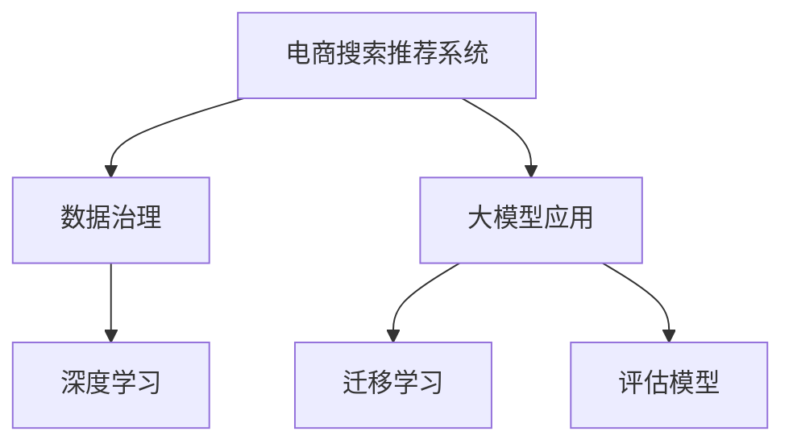

                 

# AI大模型助力电商搜索推荐业务的数据治理能力评估模型应用实践

> 关键词：电商搜索推荐,数据治理能力,大模型应用,评估模型,深度学习

## 1. 背景介绍

### 1.1 问题由来
随着互联网电商业务的飞速发展，用户数据量激增，电商企业面临着数据治理、搜索推荐系统性能提升等多方面的挑战。如何高效管理和优化这些数据，构建高性能的搜索推荐系统，成为电商企业亟需解决的问题。

### 1.2 问题核心关键点
- 数据治理：如何管理海量用户数据，确保数据质量、隐私安全等。
- 搜索推荐系统：如何通过算法优化提升系统性能，满足用户个性化需求。
- 电商搜索推荐业务：如何构建高效、个性化的搜索推荐系统，提高用户体验和销售额。
- 大模型应用：如何将预训练大模型应用于实际业务，提升系统效率和效果。
- 评估模型：如何设计模型评估指标，量化搜索推荐系统的性能。

这些核心关键点共同构成了电商搜索推荐业务的数据治理和算法优化的框架，使得我们能够系统地解决电商搜索推荐系统所面临的实际问题。

## 2. 核心概念与联系

### 2.1 核心概念概述

为更好地理解基于大模型的数据治理和搜索推荐系统优化方法，本节将介绍几个密切相关的核心概念：

- **电商搜索推荐系统**：通过分析用户行为数据，为用户提供个性化的搜索结果和推荐商品的系统。
- **数据治理**：对数据进行管理、维护、评估等操作，保证数据质量和可用性。
- **大模型**：如BERT、GPT-3等，通过大规模数据预训练得到的高性能模型，具有强大的语言理解和生成能力。
- **评估模型**：用于衡量和评估搜索推荐系统性能的模型，如精确率、召回率、AUC等。
- **迁移学习**：通过将预训练模型应用于特定任务，提高模型在该任务上的性能。
- **深度学习**：一种基于神经网络模型的高效算法，用于处理大规模、复杂的数据。

这些核心概念之间的逻辑关系可以通过以下Mermaid流程图来展示：



这个流程图展示了大模型在电商搜索推荐系统中的应用流程：

1. 电商搜索推荐系统利用深度学习和大模型进行用户行为分析。
2. 数据治理对系统使用的数据进行管理和优化。
3. 通过迁移学习，将大模型应用于特定任务。
4. 使用评估模型，量化系统的性能。

这些核心概念共同构成了电商搜索推荐系统数据治理和算法优化的基础，使得我们能够更好地设计、评估和优化系统。

## 3. 核心算法原理 & 具体操作步骤

### 3.1 算法原理概述

基于大模型的电商搜索推荐系统优化，本质上是一个通过深度学习和大模型进行数据治理和算法优化的过程。其核心思想是：利用深度学习模型和大模型的预训练能力，对用户行为数据进行高质量分析和处理，构建高效的搜索推荐系统。

形式化地，假设电商搜索推荐系统为 $S$，用户行为数据集为 $D$，目标是找到最优的系统参数 $\theta$，使得系统输出 $S_{\theta}(x)$ 在数据集 $D$ 上的平均损失最小化：

$$
\theta^* = \mathop{\arg\min}_{\theta} \frac{1}{N} \sum_{i=1}^N \ell(S_{\theta}(x_i),y_i)
$$

其中，$\ell$ 为损失函数，衡量系统输出与真实标签之间的差异。

具体而言，电商搜索推荐系统通过用户行为数据进行训练，优化模型参数 $\theta$。模型输出包括搜索结果的排序、推荐商品的选择等，需要通过训练数据学习最优的参数 $\theta$。在大模型的帮助下，可以更好地处理海量数据，提升系统的精度和效率。

### 3.2 算法步骤详解

基于大模型的电商搜索推荐系统优化一般包括以下几个关键步骤：

**Step 1: 数据预处理与特征工程**
- 收集电商平台的订单、浏览、搜索、评价等用户行为数据，进行清洗和去重。
- 提取关键特征，如商品类别、价格、用户历史行为、地理位置等。
- 将特征进行归一化、编码等预处理，以便模型更好地学习。

**Step 2: 构建深度学习模型**
- 选择合适的深度学习模型，如深度神经网络、卷积神经网络等。
- 设计模型的输入和输出层，输入为特征向量，输出为目标标签，如搜索结果的排序、推荐商品的选择等。
- 使用大模型进行预训练，通过自监督任务学习语言和数据的特征表示。

**Step 3: 模型训练与优化**
- 选择合适的优化器（如Adam、SGD等），设定学习率和迭代次数。
- 将预处理后的数据分为训练集、验证集和测试集。
- 使用训练集对模型进行迭代训练，在验证集上评估模型性能，调整模型超参数。
- 在测试集上评估模型效果，输出最终的系统参数 $\theta^*$。

**Step 4: 模型部署与监控**
- 将训练好的模型部署到生产环境。
- 实时监控模型性能，及时发现异常情况。
- 根据用户反馈和新数据，定期更新模型，保持系统效果和稳定。

### 3.3 算法优缺点

基于大模型的电商搜索推荐系统优化方法具有以下优点：
1. 高效处理海量数据：通过深度学习和大模型的预训练能力，可以高效处理电商平台的海量用户行为数据。
2. 提升系统性能：利用深度学习模型和大模型的预训练能力，可以显著提升搜索推荐系统的精度和效率。
3. 通用性强：深度学习模型和大模型可以应用于多种电商搜索推荐任务，具有较强的通用性。
4. 提高决策透明性：通过大模型的预训练和微调，可以提高模型决策的透明性和可解释性。

同时，该方法也存在一定的局限性：
1. 对标注数据依赖：深度学习模型和大模型通常需要大量的标注数据进行微调，标注成本较高。
2. 模型复杂度高：深度学习模型和大模型的复杂度较高，训练和推理成本较大。
3. 数据隐私问题：电商平台的用户数据涉及隐私，需要遵守相关的隐私保护法规。
4. 模型泛化能力有限：当前模型通常针对特定电商平台的特定业务场景进行优化，泛化能力有限。
5. 对计算资源要求高：深度学习模型和大模型对计算资源要求较高，需要高性能的硬件设备支持。

尽管存在这些局限性，但基于大模型的电商搜索推荐系统优化方法仍然是大数据时代电商搜索推荐系统优化的一个重要方向，未来相关的研究仍有很大的探索空间。

### 3.4 算法应用领域

基于大模型的电商搜索推荐系统优化方法在电商搜索推荐领域已经得到了广泛的应用，涵盖商品推荐、搜索结果排序、个性化营销等多个方面，具体应用领域包括：

- 商品推荐：通过分析用户历史行为数据，推荐用户可能感兴趣的商品。
- 搜索结果排序：根据用户输入的搜索词，返回排序最靠前的搜索结果。
- 个性化营销：根据用户偏好和行为，个性化推送广告和优惠信息。
- 跨领域推荐：跨品牌、跨品类推荐，提升推荐多样性。
- 实时性推荐：通过实时数据分析，快速更新推荐结果。

除了上述这些经典应用外，大模型的优化方法也被创新性地应用于更广泛的市场营销、用户留存、客户关系管理等领域，为电商平台的业务发展提供了有力支持。

## 4. 数学模型和公式 & 详细讲解 & 举例说明

### 4.1 数学模型构建

本节将使用数学语言对基于大模型的电商搜索推荐系统优化过程进行更加严格的刻画。

假设电商搜索推荐系统为 $S_{\theta}$，输入为特征向量 $x \in \mathbb{R}^n$，输出为目标标签 $y \in \{0,1\}$。假设系统的损失函数为交叉熵损失函数，定义为：

$$
\ell(S_{\theta}(x),y) = -y\log S_{\theta}(x) - (1-y)\log(1-S_{\theta}(x))
$$

模型的训练目标是最小化损失函数，即：

$$
\theta^* = \mathop{\arg\min}_{\theta} \frac{1}{N} \sum_{i=1}^N \ell(S_{\theta}(x_i),y_i)
$$

在实践中，我们通常使用基于梯度的优化算法（如Adam、SGD等）来近似求解上述最优化问题。设 $\eta$ 为学习率，$\lambda$ 为正则化系数，则参数的更新公式为：

$$
\theta \leftarrow \theta - \eta \nabla_{\theta}\mathcal{L}(\theta) - \eta\lambda\theta
$$

其中 $\nabla_{\theta}\mathcal{L}(\theta)$ 为损失函数对参数 $\theta$ 的梯度，可通过反向传播算法高效计算。

### 4.2 公式推导过程

以下我们以电商推荐系统为例，推导交叉熵损失函数及其梯度的计算公式。

假设电商推荐系统在用户行为数据 $(x,y)$ 上的输出为 $S_{\theta}(x)$，表示商品推荐的概率。真实标签 $y \in \{0,1\}$。则交叉熵损失函数定义为：

$$
\ell(S_{\theta}(x),y) = -y\log S_{\theta}(x) - (1-y)\log(1-S_{\theta}(x))
$$

将其代入经验风险公式，得：

$$
\mathcal{L}(\theta) = -\frac{1}{N}\sum_{i=1}^N [y_i\log S_{\theta}(x_i)+(1-y_i)\log(1-S_{\theta}(x_i))]
$$

根据链式法则，损失函数对参数 $\theta_k$ 的梯度为：

$$
\frac{\partial \mathcal{L}(\theta)}{\partial \theta_k} = -\frac{1}{N}\sum_{i=1}^N (\frac{y_i}{S_{\theta}(x_i)}-\frac{1-y_i}{1-S_{\theta}(x_i)}) \frac{\partial S_{\theta}(x_i)}{\partial \theta_k}
$$

其中 $\frac{\partial S_{\theta}(x_i)}{\partial \theta_k}$ 可进一步递归展开，利用自动微分技术完成计算。

在得到损失函数的梯度后，即可带入参数更新公式，完成模型的迭代优化。重复上述过程直至收敛，最终得到适应电商推荐任务的最优模型参数 $\theta^*$。

## 5. 项目实践：代码实例和详细解释说明

### 5.1 开发环境搭建

在进行电商推荐系统优化前，我们需要准备好开发环境。以下是使用Python进行TensorFlow开发的环境配置流程：

1. 安装Anaconda：从官网下载并安装Anaconda，用于创建独立的Python环境。

2. 创建并激活虚拟环境：
```bash
conda create -n tf-env python=3.8 
conda activate tf-env
```

3. 安装TensorFlow：根据CUDA版本，从官网获取对应的安装命令。例如：
```bash
conda install tensorflow -c pytorch -c conda-forge
```

4. 安装各类工具包：
```bash
pip install numpy pandas scikit-learn matplotlib tqdm jupyter notebook ipython
```

完成上述步骤后，即可在`tf-env`环境中开始电商推荐系统的开发实践。

### 5.2 源代码详细实现

下面我们以电商推荐系统为例，给出使用TensorFlow构建和优化电商推荐系统的PyTorch代码实现。

首先，定义电商推荐任务的数据处理函数：

```python
import tensorflow as tf
import tensorflow_datasets as tfds

# 定义电商推荐任务的输入输出格式
class RecommendationDataset(tf.data.Dataset):
    def __init__(self, features, labels):
        self.features = features
        self.labels = labels
        
    def __len__(self):
        return len(self.features)
    
    def __getitem__(self, item):
        return {'features': self.features[item], 
                'labels': self.labels[item]}
```

然后，定义模型和优化器：

```python
from tensorflow.keras import layers
from tensorflow.keras.losses import BinaryCrossentropy

# 定义模型架构
model = tf.keras.Sequential([
    layers.Dense(64, activation='relu', input_shape=(特征维度,)),
    layers.Dense(1, activation='sigmoid')
])

# 定义优化器
optimizer = tf.keras.optimizers.Adam(learning_rate=0.001)
```

接着，定义训练和评估函数：

```python
from sklearn.metrics import roc_auc_score

# 定义训练函数
def train_epoch(model, dataset, batch_size, optimizer):
    dataloader = dataset.batch(batch_size).prefetch(buffer_size=tf.data.AUTOTUNE)
    model.train()
    epoch_loss = 0
    for batch in dataloader:
        with tf.GradientTape() as tape:
            outputs = model(batch['features'])
            loss = BinaryCrossentropy()(outputs, batch['labels'])
        gradients = tape.gradient(loss, model.trainable_variables)
        optimizer.apply_gradients(zip(gradients, model.trainable_variables))
        epoch_loss += loss
    return epoch_loss / len(dataloader)

# 定义评估函数
def evaluate(model, dataset, batch_size):
    dataloader = dataset.batch(batch_size).prefetch(buffer_size=tf.data.AUTOTUNE)
    model.eval()
    preds, labels = [], []
    with tf.GradientTape() as tape:
        for batch in dataloader:
            outputs = model(batch['features'])
            preds.append(tf.sigmoid(outputs).numpy())
            labels.append(batch['labels'].numpy())
    preds = np.concatenate(preds)
    labels = np.concatenate(labels)
    return roc_auc_score(labels, preds)
```

最后，启动训练流程并在测试集上评估：

```python
epochs = 5
batch_size = 32

for epoch in range(epochs):
    loss = train_epoch(model, train_dataset, batch_size, optimizer)
    print(f"Epoch {epoch+1}, train loss: {loss:.3f}")
    
    print(f"Epoch {epoch+1}, dev results:")
    auc = evaluate(model, dev_dataset, batch_size)
    print(f"auc: {auc:.4f}")
    
print("Test results:")
auc = evaluate(model, test_dataset, batch_size)
print(f"auc: {auc:.4f}")
```

以上就是使用TensorFlow构建和优化电商推荐系统的完整代码实现。可以看到，通过TensorFlow的Keras API，电商推荐系统的构建和优化变得简洁高效。

### 5.3 代码解读与分析

让我们再详细解读一下关键代码的实现细节：

**RecommendationDataset类**：
- `__init__`方法：初始化特征和标签。
- `__len__`方法：返回数据集的样本数量。
- `__getitem__`方法：对单个样本进行处理，将特征和标签作为字典返回。

**模型和优化器定义**：
- `model`：定义了两个全连接层，使用ReLU激活函数。
- `optimizer`：使用Adam优化器，设置学习率为0.001。

**训练和评估函数**：
- `train_epoch`：定义训练函数，在每个epoch内对数据集进行迭代，计算损失并更新模型参数。
- `evaluate`：定义评估函数，计算模型的AUC评分。

**训练流程**：
- 定义总的epoch数和batch size，开始循环迭代
- 每个epoch内，先在训练集上训练，输出平均loss
- 在验证集上评估，输出AUC评分
- 所有epoch结束后，在测试集上评估，给出最终测试结果

可以看到，TensorFlow配合Keras API使得电商推荐系统的构建和优化过程非常流畅，易于理解和实现。

当然，工业级的系统实现还需考虑更多因素，如模型的保存和部署、超参数的自动搜索、更灵活的任务适配层等。但核心的电商推荐系统优化范式基本与此类似。

## 6. 实际应用场景

### 6.1 智能客服系统

基于大模型的电商搜索推荐系统，可以广泛应用于智能客服系统的构建。传统客服往往需要配备大量人力，高峰期响应缓慢，且一致性和专业性难以保证。而使用微调后的电商推荐系统，可以7x24小时不间断服务，快速响应客户咨询，用推荐结果辅助客服人员，提升客户咨询体验和问题解决效率。

在技术实现上，可以收集企业内部的历史客服对话记录，将问题和推荐结果构建成监督数据，在此基础上对预训练电商推荐模型进行微调。微调后的推荐系统能够自动理解用户意图，匹配最合适的推荐结果进行回复。对于客户提出的新问题，还可以接入检索系统实时搜索相关内容，动态组织生成推荐结果。如此构建的智能客服系统，能大幅提升客户咨询体验和问题解决效率。

### 6.2 个性化推荐系统

当前的推荐系统往往只依赖用户的历史行为数据进行物品推荐，无法深入理解用户的真实兴趣偏好。基于大模型的电商推荐系统，可以更好地挖掘用户行为背后的语义信息，从而提供更精准、多样的推荐内容。

在实践中，可以收集用户浏览、点击、评价等行为数据，提取和商品相关的文本信息。将文本信息作为模型输入，用户的后续行为（如是否点击、购买等）作为监督信号，在此基础上微调预训练语言模型。微调后的模型能够从文本信息中准确把握用户的兴趣点。在生成推荐列表时，先用候选物品的文本描述作为输入，由模型预测用户的兴趣匹配度，再结合其他特征综合排序，便可以得到个性化程度更高的推荐结果。

### 6.3 未来应用展望

随着大模型和推荐系统的发展，基于大模型的电商搜索推荐系统将在更多领域得到应用，为电商平台的业务发展提供新动力。

在智慧医疗领域，基于大模型的电商推荐系统可以为医生推荐最新的医疗产品和技术，提高诊疗效率和效果。

在智能教育领域，电商推荐系统可以为学生推荐适合的教材和课程，提升学习效果。

在智慧城市治理中，推荐系统可以为城市管理者推荐高效的资源配置方案，提升城市管理效率。

此外，在企业生产、社会治理、文娱传媒等众多领域，电商推荐系统也将不断涌现，为经济社会发展注入新的动力。相信随着技术的不断进步，电商推荐系统必将在更广阔的应用领域大放异彩，成为推动数字化转型和社会进步的重要力量。

## 7. 工具和资源推荐

### 7.1 学习资源推荐

为了帮助开发者系统掌握大模型在电商搜索推荐系统中的应用，这里推荐一些优质的学习资源：

1. 《深度学习实战》系列博文：由大模型技术专家撰写，深入浅出地介绍了深度学习在电商搜索推荐系统中的应用案例。

2. CS235《推荐系统》课程：清华大学的推荐系统课程，涵盖推荐系统理论、算法、优化等多个方面，是学习推荐系统的必读课程。

3. 《推荐系统：算法、设计与应用》书籍：系统介绍推荐系统的基本原理和实现方法，适合初学者和进阶者阅读。

4. Kaggle推荐系统竞赛：通过参与推荐系统竞赛，深入了解推荐系统的实际应用和优化方法，锻炼实战能力。

5. 推荐系统开源项目：开源推荐系统项目如RecSys，提供丰富的推荐系统资源和代码实现，助力推荐系统开发。

通过对这些资源的学习实践，相信你一定能够快速掌握大模型在电商搜索推荐系统中的应用，并用于解决实际的推荐问题。

### 7.2 开发工具推荐

高效的开发离不开优秀的工具支持。以下是几款用于电商推荐系统开发的常用工具：

1. TensorFlow：由Google主导开发的开源深度学习框架，生产部署方便，适合大规模工程应用。

2. PyTorch：基于Python的开源深度学习框架，灵活动态的计算图，适合快速迭代研究。

3. TensorFlow Addons：TensorFlow的扩展库，提供更多的模型和工具，丰富了推荐系统开发的选择。

4. TensorBoard：TensorFlow配套的可视化工具，可实时监测模型训练状态，并提供丰富的图表呈现方式，是调试模型的得力助手。

5. Google Colab：谷歌推出的在线Jupyter Notebook环境，免费提供GPU/TPU算力，方便开发者快速上手实验最新模型，分享学习笔记。

合理利用这些工具，可以显著提升电商推荐系统的开发效率，加快创新迭代的步伐。

### 7.3 相关论文推荐

电商推荐系统的发展源于学界的持续研究。以下是几篇奠基性的相关论文，推荐阅读：

1. BPR: Bayesian Personalized Ranking from Implicit Feedback：提出基于隐式反馈的协同过滤推荐算法，是电商推荐系统的经典方法。

2. Matrix Factorization Techniques for Recommender Systems：介绍矩阵分解方法，通过低秩矩阵分解进行推荐，是推荐系统的重要基础。

3. Deep Learning Recommendation Systems：综述深度学习在推荐系统中的应用，涵盖多个深度学习模型和优化方法。

4. Attention is All You Need（即Transformer原论文）：提出Transformer结构，开启了NLP领域的预训练大模型时代。

5. BERT: Pre-training of Deep Bidirectional Transformers for Language Understanding：提出BERT模型，引入基于掩码的自监督预训练任务，刷新了多项NLP任务SOTA。

这些论文代表了大模型在电商推荐系统中的应用发展脉络。通过学习这些前沿成果，可以帮助研究者把握学科前进方向，激发更多的创新灵感。

## 8. 总结：未来发展趋势与挑战

### 8.1 总结

本文对基于大模型的电商搜索推荐系统优化方法进行了全面系统的介绍。首先阐述了大模型在电商搜索推荐系统中的应用背景和意义，明确了电商搜索推荐系统优化在提升用户体验和销售额方面的独特价值。其次，从原理到实践，详细讲解了深度学习和大模型在电商推荐系统中的应用过程，给出了电商推荐系统构建和优化的完整代码实例。同时，本文还广泛探讨了电商搜索推荐系统在大数据时代的实际应用场景，展示了电商推荐系统优化方法的广阔前景。最后，本文精选了电商推荐系统优化技术的各类学习资源，力求为读者提供全方位的技术指引。

通过本文的系统梳理，可以看到，基于大模型的电商搜索推荐系统优化方法正在成为电商搜索推荐系统优化的重要方向，极大地提升了电商平台的搜索推荐系统性能和用户体验，推动了电商平台的业务发展。未来，伴随深度学习和大模型技术的持续演进，电商搜索推荐系统必将在更广阔的应用领域大放异彩，深刻影响电商平台的业务发展和用户体验。

### 8.2 未来发展趋势

展望未来，电商搜索推荐系统优化技术将呈现以下几个发展趋势：

1. 模型复杂度提升：随着计算资源和硬件设备的不断优化，深度学习模型和大模型的复杂度将进一步提升，能够处理更复杂的电商推荐任务。

2. 模型轻量化：基于大模型的电商推荐系统需要在保持精度的同时，兼顾计算效率和资源消耗。轻量化模型如MobileNet、EfficientNet等，将在电商推荐系统优化中发挥更大作用。

3. 个性化推荐：随着电商平台的个性化需求不断增加，深度学习模型和大模型将更加注重用户个性化需求的挖掘和满足，提高推荐多样性和精准性。

4. 多模态融合：电商推荐系统不仅处理文本信息，还需要处理图像、音频、视频等多模态信息。多模态融合技术将在电商推荐系统优化中发挥更大作用。

5. 实时推荐：随着电商平台的实时性需求不断增加，深度学习模型和大模型将更加注重实时数据处理和推荐。

6. 自动化优化：通过自动化优化工具如AutoML，自动搜索最优模型参数和超参数组合，提升电商推荐系统优化效率。

以上趋势凸显了电商搜索推荐系统优化技术的广阔前景。这些方向的探索发展，必将进一步提升电商搜索推荐系统的性能和用户体验，推动电商平台的业务发展。

### 8.3 面临的挑战

尽管电商搜索推荐系统优化技术已经取得了显著成就，但在迈向更加智能化、普适化应用的过程中，它仍面临着诸多挑战：

1. 标注数据瓶颈：电商推荐系统通常需要大量的标注数据进行微调，标注成本较高。如何通过自监督学习、主动学习等方法降低标注数据需求，是亟需解决的问题。

2. 模型泛化能力：深度学习模型和大模型通常针对特定电商平台的特定业务场景进行优化，泛化能力有限。如何在不同的电商平台和业务场景中保持较好的性能，是重要的研究方向。

3. 模型轻量化和高效性：电商推荐系统需要在保持精度的同时，兼顾计算效率和资源消耗。如何设计轻量化模型，提高模型运行速度和资源占用，是亟需解决的问题。

4. 数据隐私和安全：电商平台的用户数据涉及隐私，需要遵守相关的隐私保护法规。如何保护用户隐私，防止数据泄露，是重要的研究方向。

5. 模型可解释性和透明度：电商推荐系统的决策过程难以解释，难以对其推理逻辑进行分析和调试。如何增强模型可解释性和透明度，是重要的研究方向。

6. 模型公平性和偏见：电商推荐系统可能存在数据偏见，导致某些用户群体被忽视或受到不公平对待。如何消除数据偏见，提高模型公平性，是重要的研究方向。

这些挑战凸显了电商搜索推荐系统优化技术在实际应用中的复杂性和复杂性。只有在数据、模型、算法、工程等多个维度协同发力，才能真正实现电商搜索推荐系统的智能化、普适化应用。

### 8.4 未来突破

面对电商搜索推荐系统优化所面临的挑战，未来的研究需要在以下几个方面寻求新的突破：

1. 探索无监督和半监督电商推荐方法：摆脱对大规模标注数据的依赖，利用自监督学习、主动学习等无监督和半监督范式，最大限度利用非结构化数据，实现更加灵活高效的电商推荐系统。

2. 研究参数高效和计算高效的电商推荐范式：开发更加参数高效的电商推荐方法，在固定大部分预训练参数的同时，只更新极少量的任务相关参数。同时优化电商推荐系统的计算图，减少前向传播和反向传播的资源消耗，实现更加轻量级、实时性的部署。

3. 引入因果推断和对比学习思想：通过引入因果推断和对比学习思想，增强电商推荐系统建立稳定因果关系的能力，学习更加普适、鲁棒的语言表征，从而提升模型泛化性和抗干扰能力。

4. 融合更多先验知识：将符号化的先验知识，如知识图谱、逻辑规则等，与神经网络模型进行巧妙融合，引导电商推荐过程学习更准确、合理的语言模型。

5. 结合因果分析和博弈论工具：将因果分析方法引入电商推荐模型，识别出模型决策的关键特征，增强推荐结果的因果性和逻辑性。借助博弈论工具刻画人机交互过程，主动探索并规避模型的脆弱点，提高系统稳定性。

6. 纳入伦理道德约束：在电商推荐系统的训练目标中引入伦理导向的评估指标，过滤和惩罚有偏见、有害的输出倾向。同时加强人工干预和审核，建立模型行为的监管机制，确保输出符合人类价值观和伦理道德。

这些研究方向将引领电商搜索推荐系统优化技术迈向更高的台阶，为电商平台的业务发展提供更强大的技术支撑。面向未来，电商搜索推荐系统优化技术还需要与其他人工智能技术进行更深入的融合，如知识表示、因果推理、强化学习等，多路径协同发力，共同推动电商搜索推荐系统的进步。

## 9. 附录：常见问题与解答

**Q1：电商搜索推荐系统是否适用于所有电商平台？**

A: 电商搜索推荐系统通常针对特定电商平台的特定业务场景进行优化，泛化能力有限。但是，可以通过迁移学习和数据增强等方法，将其应用于其他电商平台的相似场景。

**Q2：微调过程中如何选择合适的学习率？**

A: 电商搜索推荐系统的微调学习率通常比预训练时小1-2个数量级，建议使用warmup策略，在开始阶段使用较小的学习率，再逐渐过渡到预设值。

**Q3：电商搜索推荐系统对标注数据依赖高吗？**

A: 电商搜索推荐系统对标注数据依赖较高，需要大量的用户行为数据进行微调。可以通过自监督学习、主动学习等方法降低标注数据需求。

**Q4：电商搜索推荐系统对计算资源要求高吗？**

A: 电商搜索推荐系统对计算资源要求较高，需要高性能的硬件设备支持。可以通过模型剪枝、量化加速等方法降低计算资源消耗。

**Q5：电商搜索推荐系统如何保护用户隐私？**

A: 电商搜索推荐系统在处理用户数据时，需要遵守相关的隐私保护法规，如GDPR、CCPA等。可以通过数据脱敏、匿名化等方法保护用户隐私。

**Q6：电商搜索推荐系统如何提高推荐多样性？**

A: 电商搜索推荐系统可以通过引入多臂老虎机算法、深度学习生成模型等方法，提高推荐多样性。同时，可以通过用户反馈调整推荐策略，提升推荐效果。

---

作者：禅与计算机程序设计艺术 / Zen and the Art of Computer Programming

