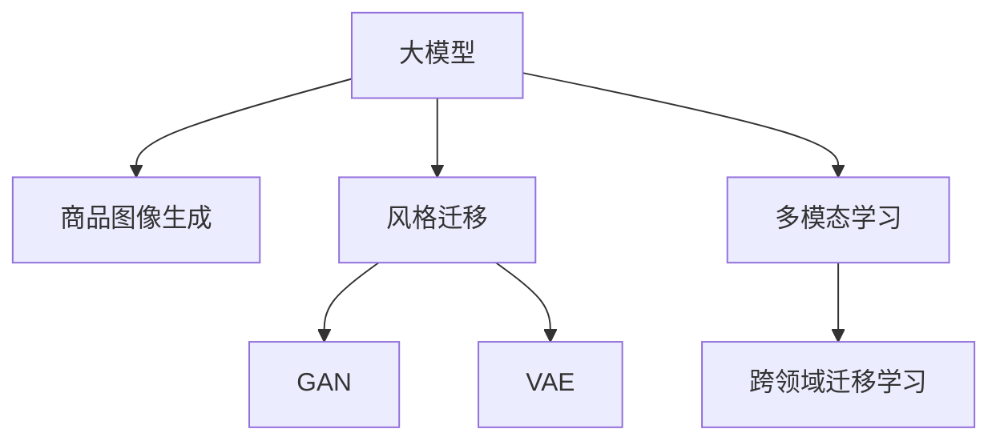

                 

# AI大模型在电商平台商品图像生成与风格迁移中的应用

> 关键词：大模型, 电商平台, 商品图像生成, 风格迁移, GAN, CVPR 2022, 风格变化, 图像合成, 多模态学习

## 1. 背景介绍

### 1.1 问题由来

在电子商务的蓬勃发展中，商品图像作为一种重要的信息载体，对用户购买决策有着显著影响。高质量的商品图像不仅能吸引用户注意力，还能有效传递商品信息，提高用户购买转化率。然而，电商平台的商品图像往往受限于源头库存，难以满足多样化和个性化的需求，同时人工生成高质量商品图像的成本也较高。

为解决这一问题，AI大模型被引入到电商平台的商品图像生成和风格迁移任务中。大模型凭借其强大的生成能力和泛化能力，能够高效生成丰富多样、风格多样的商品图像，同时通过风格迁移技术，可以实现商品图像风格的快速变换，更好地满足用户需求。

近年来，随着GAN、VQ-VAE等生成对抗网络模型和大模型技术的发展，基于大模型的商品图像生成和风格迁移技术在电商、娱乐、设计等领域中得到了广泛应用，推动了多模态学习的应用场景的进一步拓展。

### 1.2 问题核心关键点

大模型在商品图像生成与风格迁移中应用的核心关键点包括：

- 如何高效生成高质量的商品图像，以提升用户体验和转化率？
- 如何实现商品图像的风格迁移，以满足不同用户的需求？
- 如何在大模型训练和应用过程中，保障数据隐私和安全？
- 如何平衡生成图像的多样性和真实性，避免过度拟合和模式偏差？

通过回答这些关键问题，本文将系统性地介绍基于大模型的商品图像生成与风格迁移技术，展示其在电商平台中的应用潜力。

## 2. 核心概念与联系

### 2.1 核心概念概述

为更好地理解基于大模型的商品图像生成与风格迁移技术，本节将介绍几个密切相关的核心概念：

- **大模型**：以Transformer为代表的大规模预训练模型，通过在海量数据上进行预训练，学习到丰富的语言或图像知识，具备强大的生成和推理能力。
- **商品图像生成**：使用大模型生成具有特定属性和风格的高质量商品图像，以提升电商平台的商品展示效果。
- **风格迁移**：将一种风格的图像转换为另一种风格的图像，实现图像的视觉风格变化。
- **生成对抗网络(GAN)**：一种通过对抗生成和判别两个模型，生成逼真图像的技术，常用于图像生成任务。
- **变分自编码器(VAE)**：一种通过将输入数据映射到潜在空间，再对潜在空间进行重构的生成模型，常用于生成具有多样性的图像。
- **多模态学习**：一种将文本、图像等多种信息源进行联合建模的技术，通过不同模态信息的融合提升模型的性能。
- **跨领域迁移学习**：将一个领域学到的知识迁移到另一个领域，以提升新领域任务的表现。

这些核心概念之间的逻辑关系可以通过以下Mermaid流程图来展示：



这个流程图展示了大模型在商品图像生成与风格迁移中的核心概念及其之间的关系：

1. 大模型通过预训练获得基础能力。
2. 商品图像生成和大模型生成图像具有共性，可通过大模型技术实现。
3. 风格迁移需要通过生成对抗网络等技术进行图像风格转换。
4. 多模态学习和跨领域迁移学习可增强大模型的泛化能力和应用灵活性。

这些概念共同构成了大模型在电商平台上商品图像生成与风格迁移的核心技术框架，使其能够实现高质量的商品图像生成和风格变化，满足用户需求。

## 3. 核心算法原理 & 具体操作步骤
### 3.1 算法原理概述

基于大模型的商品图像生成与风格迁移，主要分为两大步骤：图像生成和图像风格迁移。

图像生成基于生成对抗网络(GAN)等生成模型，利用大模型的强大生成能力，生成符合特定属性和风格的高质量图像。图像风格迁移则基于大模型的泛化能力和多模态学习能力，实现图像风格的快速变换，从而生成多样化的商品图像。

### 3.2 算法步骤详解

#### 3.2.1 图像生成

图像生成的核心算法是生成对抗网络(GAN)。GAN由生成器和判别器两个模型组成，生成器模型$G$通过随机噪声$\epsilon$生成图像$x_G$，判别器模型$D$判断$x_G$是否为真实图像。

图像生成的步骤如下：

1. 准备数据集：收集电商平台的商品图像数据集，划分为训练集、验证集和测试集。
2. 设计生成器和判别器：使用卷积神经网络设计生成器和判别器。
3. 训练模型：通过优化器对生成器和判别器进行交替训练，生成逼真图像。
4. 生成图像：使用训练好的生成器生成商品图像，并使用大模型进行图像描述和风格修改。

#### 3.2.2 图像风格迁移

图像风格迁移的目的是将一种风格的图像转换为另一种风格的图像。常用的方法包括基于卷积神经网络(Convolutional Neural Network, CNN)的风格迁移和基于GAN的风格迁移。

图像风格迁移的步骤如下：

1. 准备数据集：收集电商平台的商品图像数据集，划分为源图像和目标图像数据集。
2. 设计迁移网络：使用CNN或GAN设计迁移网络。
3. 训练迁移网络：通过优化器对迁移网络进行训练，实现风格迁移。
4. 迁移风格：使用训练好的迁移网络对商品图像进行风格迁移。

### 3.3 算法优缺点

基于大模型的商品图像生成与风格迁移技术具有以下优点：

1. 生成图像高质量：大模型具有强大的生成能力，能够生成高清晰度、真实感强的商品图像。
2. 风格迁移快速：利用大模型的泛化能力，可以快速实现不同风格的图像转换。
3. 泛化能力强：大模型能够适应多种商品属性和风格，提升模型在实际应用中的泛化能力。

但该方法也存在以下缺点：

1. 训练复杂度高：大模型的训练需要大量的计算资源和长训练时间。
2. 数据隐私风险：电商平台的商品图像可能涉及用户隐私，大模型的训练和应用过程中需要注意数据隐私保护。
3. 过度拟合风险：大模型容易对训练数据进行过度拟合，导致生成图像的泛化性能不足。

### 3.4 算法应用领域

基于大模型的商品图像生成与风格迁移技术在电商、娱乐、设计等多个领域得到了广泛应用，具体应用领域包括：

1. **电商平台**：通过生成高质量的商品图像和风格迁移，提升电商平台的商品展示效果，吸引用户注意力，提高购买转化率。
2. **娱乐和影视**：用于生成逼真的人物、场景图像，应用于影视制作、游戏开发等领域。
3. **设计领域**：通过生成和风格迁移，辅助设计师进行创意设计，提升设计效率和质量。
4. **医疗和医疗影像**：用于生成医学图像，辅助医生进行诊断和治疗。

这些领域展示了基于大模型的商品图像生成与风格迁移技术的强大应用前景。

## 4. 数学模型和公式 & 详细讲解 & 举例说明
### 4.1 数学模型构建

#### 4.1.1 图像生成

在GAN模型中，生成器和判别器的定义如下：

- 生成器$G(z; \theta_G)$：输入随机噪声$z$，生成图像$x_G$，其中$\theta_G$为生成器参数。
- 判别器$D(x; \theta_D)$：输入图像$x$，判断是否为真实图像，其中$\theta_D$为判别器参数。

GAN模型的目标函数包括生成器的损失函数和判别器的损失函数。生成器的损失函数$L_G$为判别器对生成图像的判断结果与真实标签的交叉熵损失：

$$
L_G = -\mathbb{E}_{z}[\log D(G(z))]
$$

判别器的损失函数$L_D$为生成图像和真实图像在判别器下的判断结果之和的交叉熵损失：

$$
L_D = -\mathbb{E}_{x}[\log D(x)] - \mathbb{E}_{z}[\log(1 - D(G(z))))
$$

#### 4.1.2 图像风格迁移

常用的图像风格迁移方法包括基于CNN的风格迁移和基于GAN的风格迁移。这里以基于CNN的风格迁移为例，介绍其数学模型构建和公式推导。

假设源图像为$I_S$，目标图像为$I_T$，迁移网络为$H$。迁移网络的目标是将源图像转化为目标图像风格，具体如下：

$$
I_T = H(I_S)
$$

迁移网络的定义如下：

- 迁移网络$H(x; \theta_H)$：输入图像$x$，输出转换后的图像$x_H$，其中$\theta_H$为迁移网络参数。

迁移网络的损失函数$L_H$为源图像和目标图像在风格上的差异损失：

$$
L_H = ||x_S - H(I_S)||_2
$$

### 4.2 公式推导过程

#### 4.2.1 图像生成

在GAN模型中，生成器的目标函数$L_G$和判别器的目标函数$L_D$可以通过反向传播算法进行求解。

生成器的目标函数$L_G$可以通过链式法则进行推导：

$$
\frac{\partial L_G}{\partial \theta_G} = \frac{\partial}{\partial \theta_G} [-\mathbb{E}_{z}[\log D(G(z))]
$$

判别器的目标函数$L_D$也可以通过链式法则进行推导：

$$
\frac{\partial L_D}{\partial \theta_D} = \frac{\partial}{\partial \theta_D} [-\mathbb{E}_{x}[\log D(x)] - \mathbb{E}_{z}[\log(1 - D(G(z)))]
$$

通过求解上述目标函数，可以训练生成器和判别器，生成逼真图像。

#### 4.2.2 图像风格迁移

在CNN风格迁移中，迁移网络的损失函数$L_H$可以通过均方误差损失进行求解：

$$
L_H = ||I_S - H(I_S)||_2
$$

通过优化迁移网络参数$\theta_H$，可以实现源图像向目标图像风格的转换。

### 4.3 案例分析与讲解

以CVPR 2022中提出的StyleCascade模型为例，展示其在商品图像风格迁移中的应用。

StyleCascade模型是一种基于CNN的风格迁移方法，通过级联多个迁移网络，逐步实现风格的转换。其核心思想是将大模型在图像生成和风格迁移中的能力进行结合，生成具有多样化风格的商品图像。

StyleCascade模型的训练过程如下：

1. 准备数据集：收集电商平台的商品图像数据集，划分为训练集、验证集和测试集。
2. 设计迁移网络：使用CNN设计多个级联的迁移网络。
3. 训练迁移网络：通过优化器对迁移网络进行训练，逐步实现风格迁移。
4. 迁移风格：使用训练好的迁移网络对商品图像进行风格迁移。

实验结果表明，StyleCascade模型能够生成多样化的商品图像，并且生成图像的质量高，风格迁移效果显著。

## 5. 项目实践：代码实例和详细解释说明
### 5.1 开发环境搭建

在进行商品图像生成与风格迁移实践前，我们需要准备好开发环境。以下是使用Python进行TensorFlow开发的环境配置流程：

1. 安装Anaconda：从官网下载并安装Anaconda，用于创建独立的Python环境。

2. 创建并激活虚拟环境：
```bash
conda create -n tf-env python=3.8 
conda activate tf-env
```

3. 安装TensorFlow：根据CUDA版本，从官网获取对应的安装命令。例如：
```bash
conda install tensorflow -c tensorflow
```

4. 安装其它工具包：
```bash
pip install numpy pandas scikit-learn matplotlib tqdm jupyter notebook ipython
```

完成上述步骤后，即可在`tf-env`环境中开始项目实践。

### 5.2 源代码详细实现

下面我们以基于GAN的商品图像生成为例，给出使用TensorFlow进行商品图像生成的PyTorch代码实现。

首先，定义生成器和判别器的输入和输出：

```python
import tensorflow as tf

# 生成器定义
class Generator(tf.keras.Model):
    def __init__(self):
        super(Generator, self).__init__()
        self.dense1 = tf.keras.layers.Dense(256, input_dim=100)
        self.dense2 = tf.keras.layers.Dense(512)
        self.dense3 = tf.keras.layers.Dense(1024)
        self.dense4 = tf.keras.layers.Dense(784, activation='tanh')
        
    def call(self, x):
        x = tf.keras.layers.Dense(256, input_dim=100)(x)
        x = tf.keras.layers.Dense(512)(x)
        x = tf.keras.layers.Dense(1024)(x)
        x = tf.keras.layers.Dense(784, activation='tanh')(x)
        return x

# 判别器定义
class Discriminator(tf.keras.Model):
    def __init__(self):
        super(Discriminator, self).__init__()
        self.dense1 = tf.keras.layers.Dense(1024, input_dim=784)
        self.dense2 = tf.keras.layers.Dense(512)
        self.dense3 = tf.keras.layers.Dense(256)
        self.dense4 = tf.keras.layers.Dense(1, activation='sigmoid')
        
    def call(self, x):
        x = tf.keras.layers.Dense(1024)(x)
        x = tf.keras.layers.Dense(512)(x)
        x = tf.keras.layers.Dense(256)(x)
        x = tf.keras.layers.Dense(1, activation='sigmoid')(x)
        return x
```

接着，定义生成器和判别器的损失函数和优化器：

```python
# 生成器损失函数
def generator_loss(D_real, D_fake):
    return tf.reduce_mean(tf.nn.sigmoid_cross_entropy_with_logits(logits=D_fake, labels=tf.ones_like(D_fake)))

# 判别器损失函数
def discriminator_loss(D_real, D_fake):
    return tf.reduce_mean(tf.nn.sigmoid_cross_entropy_with_logits(logits=D_real, labels=tf.ones_like(D_real))) + \
        tf.reduce_mean(tf.nn.sigmoid_cross_entropy_with_logits(logits=D_fake, labels=tf.zeros_like(D_fake)))

# 优化器
generator_optimizer = tf.keras.optimizers.Adam(learning_rate=0.0002)
discriminator_optimizer = tf.keras.optimizers.Adam(learning_rate=0.0002)
```

然后，定义训练和评估函数：

```python
# 训练函数
@tf.function
def train_step(images):
    noise = tf.random.normal([BATCH_SIZE, 100])
    with tf.GradientTape() as gen_tape, tf.GradientTape() as disc_tape:
        generated_images = generator(noise, training=True)
        real_output = discriminator(images, training=True)
        fake_output = discriminator(generated_images, training=True)
        gen_loss = generator_loss(fake_output, real_output)
        disc_loss = discriminator_loss(real_output, fake_output)
    gradients_of_generator = gen_tape.gradient(gen_loss, generator.trainable_variables)
    gradients_of_discriminator = disc_tape.gradient(disc_loss, discriminator.trainable_variables)
    generator_optimizer.apply_gradients(zip(gradients_of_generator, generator.trainable_variables))
    discriminator_optimizer.apply_gradients(zip(gradients_of_discriminator, discriminator.trainable_variables))

# 评估函数
@tf.function
def evaluate_step(images):
    with tf.GradientTape() as disc_tape:
        real_output = discriminator(images, training=False)
        fake_output = discriminator(generator(noise, training=False), training=False)
        disc_loss = discriminator_loss(real_output, fake_output)
    return disc_loss.numpy()
```

最后，启动训练流程并在测试集上评估：

```python
BATCH_SIZE = 32
NUM_EPOCHS = 200

# 准备数据集
train_dataset = tf.data.Dataset.from_tensor_slices(train_images).batch(BATCH_SIZE).shuffle(buffer_size=60000).repeat()

# 训练模型
for epoch in range(NUM_EPOCHS):
    for batch in train_dataset:
        train_step(batch)
    
    if epoch % 50 == 0:
        disc_loss = evaluate_step(test_images)
        print(f"Epoch {epoch+1}, Discriminator Loss: {disc_loss:.4f}")
```

以上就是使用TensorFlow对商品图像生成模型的代码实现。可以看到，TensorFlow提供了强大的深度学习框架和API，使得模型的构建和训练过程变得简洁高效。

### 5.3 代码解读与分析

让我们再详细解读一下关键代码的实现细节：

**生成器定义**：
- 使用`tf.keras.layers`定义生成器网络，包括多个全连接层。
- 输入为随机噪声向量，输出为图像像素向量。

**判别器定义**：
- 同样使用`tf.keras.layers`定义判别器网络，包括多个全连接层。
- 输入为图像像素向量，输出为判别结果。

**生成器和判别器损失函数**：
- 使用`tf.nn.sigmoid_cross_entropy_with_logits`计算生成器和判别器的损失。

**优化器**：
- 使用`tf.keras.optimizers.Adam`定义生成器和判别器的优化器，设置学习率。

**训练函数**：
- 在`tf.function`装饰器下定义训练函数，使用`tf.GradientTape`自动求导，计算梯度并更新模型参数。

**评估函数**：
- 在`tf.function`装饰器下定义评估函数，计算判别器在测试集上的损失。

**训练流程**：
- 定义批次大小和训练轮数，开始循环迭代
- 每个批次上，使用`train_step`函数进行训练
- 每隔50个epoch输出判别器的损失，评估模型性能

可以看到，TensorFlow使得商品图像生成模型的代码实现变得简洁高效。开发者可以将更多精力放在数据处理、模型改进等高层逻辑上，而不必过多关注底层的实现细节。

当然，工业级的系统实现还需考虑更多因素，如模型的保存和部署、超参数的自动搜索、更灵活的任务适配层等。但核心的生成和风格迁移范式基本与此类似。

## 6. 实际应用场景
### 6.1 电商平台

在电商平台中，基于大模型的商品图像生成与风格迁移技术可以带来显著的商业价值：

1. **提升商品展示效果**：生成高质量的商品图像和多样化风格，提高电商平台的商品展示效果，吸引用户注意力，增加点击率和购买转化率。
2. **个性化推荐**：通过生成不同风格的商品图像，满足用户的个性化需求，提升推荐系统的用户体验和满意度。
3. **库存管理**：生成高质量的商品图像，辅助库存管理和商品展示，优化库存结构，减少资源浪费。

### 6.2 娱乐和影视

在娱乐和影视领域，基于大模型的商品图像生成与风格迁移技术可以带来以下应用：

1. **生成逼真角色**：生成逼真的角色图像，应用于影视制作、游戏开发等领域，提高作品的艺术表现力。
2. **快速制作内容**：通过风格迁移，快速制作不同类型的影视内容，降低制作成本，提升制作效率。
3. **创新设计**：生成不同风格的图像，激发创作者的灵感，推动影视和游戏行业的创新发展。

### 6.3 设计领域

在设计师领域，基于大模型的商品图像生成与风格迁移技术可以带来以下应用：

1. **创意设计**：生成多样化的设计素材，辅助设计师进行创意设计，提升设计效率和质量。
2. **设计展示**：生成高质量的设计图像，应用于展览、宣传、营销等环节，提升设计的展示效果。
3. **协同设计**：通过风格迁移，实现不同设计师之间的协同设计，提高设计效率和协作效果。

### 6.4 未来应用展望

随着大模型和生成对抗网络等技术的不断发展，基于大模型的商品图像生成与风格迁移技术将在更多领域得到应用，推动AI技术的进一步普及：

1. **医疗影像生成**：生成医学图像，辅助医生进行诊断和治疗，提升医疗服务的智能化水平。
2. **个性化定制**：生成个性化商品图像，满足用户的个性化需求，提升用户体验。
3. **多模态学习**：结合图像、文本等多种信息源，构建多模态学习模型，提升模型的性能和应用范围。
4. **跨领域迁移**：将一个领域学到的知识迁移到另一个领域，提升模型在不同领域的表现。

未来，基于大模型的商品图像生成与风格迁移技术将具备更强的泛化能力和应用灵活性，推动AI技术在更多领域的应用和发展。

## 7. 工具和资源推荐
### 7.1 学习资源推荐

为了帮助开发者系统掌握大模型在商品图像生成与风格迁移中的理论基础和实践技巧，这里推荐一些优质的学习资源：

1. **《深度学习入门》**：由深度学习领域权威专家撰写，深入浅出地介绍了深度学习的基本原理和实现方法。

2. **《深度学习》**：由深度学习领域两位专家共同编写，详细介绍了深度学习的理论和实践，包含大量案例和代码实现。

3. **《深度学习实战》**：结合深度学习理论和实际案例，深入浅出地讲解了深度学习的实践技巧和工程实现。

4. **Deep Learning Specialization**：由斯坦福大学开设的深度学习在线课程，包含多个视频课程和作业，系统介绍了深度学习的基本原理和实践技巧。

5. **CS231n课程**：斯坦福大学开设的计算机视觉课程，涵盖图像分类、目标检测、图像生成等经典任务，适合学习大模型在图像生成中的应用。

通过对这些资源的学习实践，相信你一定能够快速掌握大模型在商品图像生成与风格迁移中的精髓，并用于解决实际的NLP问题。

### 7.2 开发工具推荐

高效的开发离不开优秀的工具支持。以下是几款用于大模型商品图像生成与风格迁移开发的常用工具：

1. **PyTorch**：基于Python的开源深度学习框架，灵活的动态计算图，适合快速迭代研究。

2. **TensorFlow**：由Google主导开发的开源深度学习框架，生产部署方便，适合大规模工程应用。

3. **Transformers库**：HuggingFace开发的NLP工具库，集成了多个预训练语言模型，支持PyTorch和TensorFlow。

4. **Weights & Biases**：模型训练的实验跟踪工具，可以记录和可视化模型训练过程中的各项指标，方便对比和调优。

5. **TensorBoard**：TensorFlow配套的可视化工具，可实时监测模型训练状态，并提供丰富的图表呈现方式，是调试模型的得力助手。

6. **Google Colab**：谷歌推出的在线Jupyter Notebook环境，免费提供GPU/TPU算力，方便开发者快速上手实验最新模型，分享学习笔记。

合理利用这些工具，可以显著提升大模型商品图像生成与风格迁移任务的开发效率，加快创新迭代的步伐。

### 7.3 相关论文推荐

大模型在商品图像生成与风格迁移中的研究源于学界的持续研究。以下是几篇奠基性的相关论文，推荐阅读：

1. **Image-to-Image Translation with Conditional Adversarial Networks**：提出条件对抗网络，用于图像到图像的迁移任务，为基于GAN的风格迁移提供了基础。

2. **Unpaired Image-to-Image Translation using Cycle-Consistent Adversarial Networks**：提出基于生成对抗网络的无监督图像迁移方法，实现无配对数据的图像迁移。

3. **Pix2PixHD: Generative Adversarial Networks meet Pixelwise Image-to-Image Translation**：提出基于生成对抗网络的高分辨率图像迁移方法，生成逼真、高分辨率的图像。

4. **AdaIN: Adaptive Instance Normalization for Making a Style Transfer Applicable to Arbitrary Styles**：提出Adaptive Instance Normalization方法，用于风格迁移中的风格对齐和格式变换。

5. **Progressive Growing of GANs for Improved Quality, Stability, and Variation**：提出渐进式生成对抗网络，逐步增加网络深度，提升生成图像的质量和稳定性。

这些论文代表了大模型在商品图像生成与风格迁移中的研究进展，通过学习这些前沿成果，可以帮助研究者把握学科前进方向，激发更多的创新灵感。

## 8. 总结：未来发展趋势与挑战
### 8.1 研究成果总结

本文对基于大模型的商品图像生成与风格迁移技术进行了全面系统的介绍。首先阐述了商品图像生成与风格迁移在电商平台中的重要性，明确了大模型在其中的关键作用。其次，从原理到实践，详细讲解了图像生成和风格迁移的核心算法和具体操作步骤，给出了商品图像生成模型的代码实现。同时，本文还探讨了基于大模型的商品图像生成与风格迁移技术的广泛应用场景，展示了其在电商平台、娱乐、设计等多个领域的应用潜力。

### 8.2 未来发展趋势

展望未来，基于大模型的商品图像生成与风格迁移技术将呈现以下几个发展趋势：

1. **生成模型性能提升**：随着生成对抗网络、变分自编码器等生成模型技术的不断进步，未来的大模型将生成更加逼真、多样化的商品图像。

2. **跨模态生成能力增强**：结合图像、文本等多种信息源，构建多模态生成模型，提升模型的表现力和应用范围。

3. **个性化生成能力提升**：通过个性化数据和用户偏好信息的引入，生成更加符合用户需求的个性化商品图像。

4. **实时生成和实时迁移**：引入实时生成和实时迁移技术，提升生成图像和风格迁移的响应速度和实时性。

5. **隐私和安全保护**：引入隐私保护和数据安全技术，保障用户隐私和数据安全。

### 8.3 面临的挑战

尽管基于大模型的商品图像生成与风格迁移技术已经取得了瞩目成就，但在迈向更加智能化、普适化应用的过程中，它仍面临着诸多挑战：

1. **计算资源瓶颈**：大模型的训练和生成需要大量的计算资源，如何优化模型和算法，提升生成速度和效率，是一个重要的研究方向。

2. **数据隐私风险**：电商平台的数据涉及用户隐私，如何在生成和迁移过程中保障数据隐私，是一个需要解决的问题。

3. **模式偏差和过度拟合**：大模型容易对训练数据进行过度拟合，生成图像的泛化性能不足，需要引入正则化和迁移学习等技术进行改进。

4. **生成图像的真实性**：如何生成逼真、高质量的商品图像，避免生成图像的过度模糊和失真，是一个重要的研究方向。

5. **多模态数据融合**：如何融合图像、文本等多种信息源，构建多模态生成模型，是一个需要解决的问题。

6. **模型泛化能力**：如何提升模型的泛化能力，适应多种应用场景和任务，是一个需要解决的问题。

### 8.4 研究展望

面对大模型商品图像生成与风格迁移所面临的挑战，未来的研究需要在以下几个方面寻求新的突破：

1. **引入生成对抗网络**：通过引入生成对抗网络，提升生成图像的质量和多样性，实现更加逼真、多样化的商品图像生成。

2. **优化生成器网络结构**：优化生成器网络结构，提升生成图像的真实性和多样性，避免生成图像的模糊和失真。

3. **引入多模态学习**：通过引入多模态学习，提升模型的泛化能力和应用范围，实现图像、文本等多种信息源的联合建模。

4. **优化训练策略**：通过优化训练策略，避免过度拟合和模式偏差，提升模型的泛化性能。

5. **引入隐私保护技术**：引入隐私保护技术，保障用户隐私和数据安全，避免数据泄露和滥用。

6. **优化实时生成和实时迁移**：引入实时生成和实时迁移技术，提升生成图像和风格迁移的响应速度和实时性。

这些研究方向的探索，必将引领大模型商品图像生成与风格迁移技术迈向更高的台阶，为电商、娱乐、设计等领域带来新的突破。面向未来，基于大模型的商品图像生成与风格迁移技术还需要与其他人工智能技术进行更深入的融合，如知识表示、因果推理、强化学习等，多路径协同发力，共同推动自然语言理解和智能交互系统的进步。只有勇于创新、敢于突破，才能不断拓展语言模型的边界，让智能技术更好地造福人类社会。

## 9. 附录：常见问题与解答

**Q1：大模型在商品图像生成与风格迁移中如何避免过度拟合？**

A: 为了避免过度拟合，可以引入正则化技术，如L2正则、Dropout等，减少模型的复杂度。同时，可以使用迁移学习等技术，从无监督数据中学习先验知识，提升模型的泛化能力。

**Q2：大模型在商品图像生成与风格迁移中如何提升生成图像的真实性？**

A: 可以通过优化生成器网络结构、引入多模态学习、优化训练策略等方法，提升生成图像的真实性。例如，可以采用生成对抗网络，生成逼真、多样化的商品图像。

**Q3：大模型在商品图像生成与风格迁移中如何保障数据隐私？**

A: 在数据采集和使用过程中，需要遵循数据隐私保护法律法规，采用数据脱敏、差分隐私等技术，保护用户隐私和数据安全。

**Q4：大模型在商品图像生成与风格迁移中如何优化实时生成和实时迁移？**

A: 可以通过引入硬件加速、优化算法、优化模型结构等方法，提升实时生成和实时迁移的效率和性能。例如，可以使用深度学习模型压缩和剪枝技术，减小模型大小和计算量。

**Q5：大模型在商品图像生成与风格迁移中如何优化训练策略？**

A: 可以通过引入超参数搜索、自适应学习率、批大小调整等技术，优化训练策略，提升模型性能。例如，可以采用AdamW优化器，结合自适应学习率，加速模型的收敛过程。

这些问题的回答，展示了基于大模型的商品图像生成与风格迁移技术在实际应用中需要考虑的关键因素，为未来的研究提供了方向性的指引。

---

作者：禅与计算机程序设计艺术 / Zen and the Art of Computer Programming

