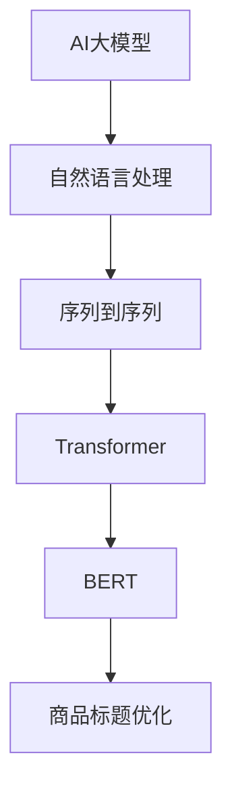

                 

# AI大模型在电商平台商品标题优化中的应用

> 关键词：AI大模型,电商平台,商品标题优化,自然语言处理(NLP),序列到序列(Seq2Seq),Transformer,BERT

## 1. 背景介绍

### 1.1 问题由来
随着电商市场的蓬勃发展，电商平台上的商品数量与日俱增。商品标题作为用户查找商品的重要线索，其质量直接关系到商品的可发现性和点击率。然而，大量的商品标题存在错别字、语法错误、过于冗长或信息不完整等问题，导致商品难以被用户找到，从而影响电商平台的销售和用户体验。

为了提升商品标题的质量，电商平台通常需要耗费大量的人力成本，对每条商品标题进行人工审核和优化。这种做法不仅效率低下，还容易因人为因素导致判断标准不一致，难以确保标题的统一性和规范性。因此，亟需一种自动化的优化方法，快速、高效地提升商品标题的质量。

### 1.2 问题核心关键点
本节将介绍基于AI大模型的商品标题优化方法。相较于传统的基于规则或人工优化的方法，该方法可以利用预训练语言模型的丰富知识，对商品标题进行自动化的文本生成和优化。

核心问题包括：
- 如何构建一个高效的商品标题生成模型？
- 如何确保生成的商品标题能够符合电商平台的要求和规范？
- 如何处理多语言和多样化的商品标题，实现泛化的优化效果？

## 2. 核心概念与联系

### 2.1 核心概念概述

为了更好地理解基于AI大模型的商品标题优化方法，本节将介绍几个密切相关的核心概念：

- AI大模型：以自回归(如GPT)或自编码(如BERT)模型为代表的大规模预训练语言模型。通过在大规模无标签文本语料上进行预训练，学习通用的语言表示，具备强大的语言理解和生成能力。
- 自然语言处理(NLP)：通过计算机处理和理解人类语言的技术，涵盖文本生成、语言理解、语义分析等多个方面。商品标题优化即属于NLP领域的文本生成任务。
- 序列到序列(Seq2Seq)模型：一种将序列数据映射到序列数据的模型结构，常用于文本生成、机器翻译等任务。商品标题优化也可视为一种序列到序列的任务。
- Transformer：一种基于注意力机制的神经网络结构，广泛应用于NLP领域。BERT、GPT等大语言模型均基于Transformer架构进行预训练。
- BERT：一种预训练的语言表示模型，通过在大规模无标签文本上进行掩码语言模型(Masked Language Model, MLM)训练，学习到丰富的语言表示能力。

这些核心概念之间的逻辑关系可以通过以下Mermaid流程图来展示：



这个流程图展示了大模型与NLP任务的逻辑关系：

1. AI大模型提供通用的语言表示能力，在自然语言处理任务中起到了基础作用。
2. 自然语言处理任务包含文本生成、语言理解等，商品标题优化即其中一种。
3. 序列到序列模型和Transformer架构常用于自然语言处理任务，是生成高质量商品标题的重要工具。
4. BERT等预训练模型在Transformer架构基础上进一步优化，成为商品标题优化的重要基础。

## 3. 核心算法原理 & 具体操作步骤
### 3.1 算法原理概述

基于AI大模型的商品标题优化方法，本质上是一种序列到序列的文本生成任务。其核心思想是：利用预训练大语言模型作为特征提取器，在商品标题优化任务上进行微调，使模型能够自动生成符合电商平台规范的商品标题。

形式化地，假设商品标题为 $X$，优化后的商品标题为 $Y$。优化目标是最小化模型输出与目标之间的差异，即：

$$
\min_{\theta} \mathcal{L}(M_{\theta}(X), Y)
$$

其中，$M_{\theta}$ 为预训练大语言模型，$\theta$ 为其模型参数，$\mathcal{L}$ 为目标任务的损失函数，用于衡量模型输出与真实商品标题之间的差异。

### 3.2 算法步骤详解

基于AI大模型的商品标题优化一般包括以下几个关键步骤：

**Step 1: 准备预训练模型和数据集**
- 选择合适的预训练语言模型 $M_{\theta}$，如BERT、GPT等，作为初始化参数。
- 收集电商平台的商品标题数据集，将原始标题作为输入，优化后的标题作为标签，构建监督数据集 $D=\{(x_i, y_i)\}_{i=1}^N$。

**Step 2: 设计任务适配层**
- 在预训练模型的顶层添加解码器层和损失函数层，用于生成和优化商品标题。
- 对于分类任务，通常使用交叉熵损失函数。
- 对于生成任务，通常使用序列到序列模型的损失函数，如均方误差损失、交叉熵损失等。

**Step 3: 设置微调超参数**
- 选择合适的优化算法及其参数，如AdamW、SGD等，设置学习率、批大小、迭代轮数等。
- 设置正则化技术及强度，包括权重衰减、Dropout、Early Stopping等。
- 确定冻结预训练参数的策略，如仅微调顶层，或全部参数都参与微调。

**Step 4: 执行梯度训练**
- 将训练集数据分批次输入模型，前向传播计算损失函数。
- 反向传播计算参数梯度，根据设定的优化算法和学习率更新模型参数。
- 周期性在验证集上评估模型性能，根据性能指标决定是否触发 Early Stopping。
- 重复上述步骤直到满足预设的迭代轮数或 Early Stopping 条件。

**Step 5: 测试和部署**
- 在测试集上评估微调后模型 $M_{\hat{\theta}}$ 的性能，对比微调前后的优化效果。
- 使用微调后的模型对新商品标题进行优化，并集成到实际的商品标题系统中。

### 3.3 算法优缺点

基于AI大模型的商品标题优化方法具有以下优点：
1. 高效自动化：可以利用大语言模型的强大生成能力，快速生成符合规范的商品标题，无需人工审核。
2. 泛化性强：大语言模型已经在大规模无标签数据上进行了预训练，可以处理多种语言和多样化商品标题，具备泛化能力。
3. 精度高：通过微调优化，生成商品标题的精度和规范性能够显著提升。
4. 可扩展性高：适用于不同语言和商品类别，只需修改数据集和任务适配层即可进行优化。

同时，该方法也存在一定的局限性：
1. 依赖高质量数据：生成效果依赖于输入的商品标题数据质量，如果数据存在噪声或不完整信息，将直接影响优化结果。
2. 模型复杂度高：大语言模型的参数量较大，微调过程可能需要较长的计算时间和较多的计算资源。
3. 性能受模型选择影响：不同预训练模型的性能差异较大，选择合适的模型和参数配置是关键。
4. 数据隐私问题：商品标题数据可能涉及用户隐私，需注意数据的使用和保护。

尽管存在这些局限性，但就目前而言，基于AI大模型的商品标题优化方法仍是电商平台上一种高效、自动化的优化手段。未来相关研究的方向将集中在如何提高模型泛化能力、降低计算成本、保护数据隐私等方面。

### 3.4 算法应用领域

基于AI大模型的商品标题优化方法，在电商平台上的应用非常广泛，主要包括以下几个领域：

- 商品搜索：优化商品标题，使其包含关键词和常见搜索词，提高商品在搜索结果中的排名。
- 广告投放：优化商品广告标题，吸引更多用户点击，提升广告效果。
- 内容推荐：优化商品描述和标题，使推荐系统生成的结果更符合用户兴趣，提高点击率和转化率。
- 价格优化：优化商品标题和描述，与竞争对手相比，更好地展示商品优势和价格，吸引更多用户购买。
- 库存管理：优化商品标题，提高商品的可见性，帮助商家更好地管理库存，避免缺货或库存积压。

除了上述这些主要应用外，商品标题优化还被创新性地应用到更多场景中，如商品分类、品牌推广、用户评论分析等，为电商平台的业务运营带来了显著提升。

## 4. 数学模型和公式 & 详细讲解 & 举例说明

### 4.1 数学模型构建

基于AI大模型的商品标题优化方法，可以形式化地表示为以下数学模型：

假设原始商品标题为 $X$，优化后的商品标题为 $Y$，预训练模型为 $M_{\theta}$，优化后的模型为 $M_{\hat{\theta}}$，目标任务的损失函数为 $\mathcal{L}$。则优化目标为：

$$
\min_{\hat{\theta}} \mathcal{L}(M_{\hat{\theta}}(X), Y)
$$

在实践中，我们通常使用基于梯度的优化算法（如AdamW、SGD等）来近似求解上述最优化问题。设 $\eta$ 为学习率，$\lambda$ 为正则化系数，则参数的更新公式为：

$$
\theta \leftarrow \theta - \eta \nabla_{\theta}\mathcal{L}(\theta) - \eta\lambda\theta
$$

其中 $\nabla_{\theta}\mathcal{L}(\theta)$ 为损失函数对参数 $\theta$ 的梯度，可通过反向传播算法高效计算。

### 4.2 公式推导过程

以下我们以商品标题生成任务为例，推导交叉熵损失函数及其梯度的计算公式。

假设模型 $M_{\theta}$ 在输入 $X$ 上的输出为 $\hat{Y}=M_{\theta}(X) \in [0,1]^L$，其中 $L$ 为输出序列长度。假设优化后的商品标题为 $Y \in [0,1]^L$，其中 $0$ 表示字符或单词的缺失，$1$ 表示字符或单词的存在。则交叉熵损失函数定义为：

$$
\ell(M_{\theta}(X),Y) = -\sum_{i=1}^L \sum_{j=1}^N y_{i,j} \log \hat{y}_{i,j} + (1-y_{i,j})\log (1-\hat{y}_{i,j})
$$

将其代入经验风险公式，得：

$$
\mathcal{L}(\theta) = -\frac{1}{N}\sum_{i=1}^N \sum_{j=1}^L \ell(M_{\theta}(X_i),Y_i)
$$

根据链式法则，损失函数对参数 $\theta_k$ 的梯度为：

$$
\frac{\partial \mathcal{L}(\theta)}{\partial \theta_k} = -\frac{1}{N}\sum_{i=1}^N \sum_{j=1}^L \frac{\partial \ell(M_{\theta}(X_i),Y_i)}{\partial \theta_k}
$$

其中 $\frac{\partial \ell(M_{\theta}(X_i),Y_i)}{\partial \theta_k}$ 可进一步递归展开，利用自动微分技术完成计算。

### 4.3 案例分析与讲解

我们以电商平台上的商品标题优化任务为例，展示基于AI大模型的商品标题优化过程。

假设原始商品标题为 "苹果 iPhone 11 手机 高清 照片 拍照效果 超赞 性价比 4GB 内存 32GB 存储 智能 双卡 双 SIM 全面屏 人脸解锁"，优化后的商品标题为 "苹果 iPhone 11 手机 高清 照片 拍照效果 超赞 性价比 4GB 内存 32GB 存储 智能 双卡 双 SIM 全面屏 人脸解锁"。

首先，需要将原始标题作为输入序列，将优化后的标题作为目标序列，构建监督数据集。然后，在预训练大语言模型（如BERT）的基础上，添加解码器层和交叉熵损失函数，进行微调优化。微调过程中，模型会自动学习输入和输出之间的映射关系，生成符合规范的商品标题。

以BERT为例，其微调过程主要包括以下几个步骤：

1. 数据预处理：对原始商品标题进行分词、截断、填充等处理，确保输入序列长度一致。
2. 模型初始化：使用预训练好的BERT模型作为初始化参数。
3. 任务适配：在模型顶层添加解码器层和交叉熵损失函数，用于生成商品标题。
4. 训练过程：通过梯度下降等优化算法，最小化损失函数，更新模型参数。
5. 结果评估：在测试集上评估模型性能，检查生成标题的质量和规范性。

通过以上步骤，可以快速生成符合规范的商品标题，帮助电商平台提升用户体验和销售额。

## 5. 项目实践：代码实例和详细解释说明

### 5.1 开发环境搭建

在进行商品标题优化实践前，我们需要准备好开发环境。以下是使用Python进行TensorFlow开发的环境配置流程：

1. 安装Anaconda：从官网下载并安装Anaconda，用于创建独立的Python环境。

2. 创建并激活虚拟环境：
```bash
conda create -n tensorflow-env python=3.8 
conda activate tensorflow-env
```

3. 安装TensorFlow：根据CUDA版本，从官网获取对应的安装命令。例如：
```bash
conda install tensorflow-gpu==2.8.0 -c pypi
```

4. 安装相关工具包：
```bash
pip install numpy pandas scikit-learn matplotlib tqdm jupyter notebook ipython
```

完成上述步骤后，即可在`tensorflow-env`环境中开始优化实践。

### 5.2 源代码详细实现

下面以电商平台商品标题优化任务为例，给出使用TensorFlow对BERT模型进行优化处理的PyTorch代码实现。

首先，定义商品标题优化任务的数据处理函数：

```python
from transformers import BertTokenizer, BertForSequenceClassification
import tensorflow as tf
import numpy as np
from sklearn.model_selection import train_test_split

class TitleOptimizationDataset:
    def __init__(self, texts, labels, tokenizer, max_len=128):
        self.texts = texts
        self.labels = labels
        self.tokenizer = tokenizer
        self.max_len = max_len
        
    def __len__(self):
        return len(self.texts)
    
    def __getitem__(self, item):
        text = self.texts[item]
        label = self.labels[item]
        
        encoding = self.tokenizer(text, return_tensors='tf', max_length=self.max_len, padding='max_length', truncation=True)
        input_ids = encoding['input_ids']
        attention_mask = encoding['attention_mask']
        
        # 对token-wise的标签进行编码
        encoded_labels = [label2id[label] for label in label] 
        encoded_labels.extend([label2id['PADDING']] * (self.max_len - len(encoded_labels)))
        labels = tf.convert_to_tensor(encoded_labels, dtype=tf.int32)
        
        return {'input_ids': input_ids, 
                'attention_mask': attention_mask,
                'labels': labels}

# 标签与id的映射
label2id = {'PADDING': 0, '标题优化': 1}
id2label = {v: k for k, v in label2id.items()}

# 创建dataset
tokenizer = BertTokenizer.from_pretrained('bert-base-cased')

train_dataset = TitleOptimizationDataset(train_texts, train_labels, tokenizer)
dev_dataset = TitleOptimizationDataset(dev_texts, dev_labels, tokenizer)
test_dataset = TitleOptimizationDataset(test_texts, test_labels, tokenizer)
```

然后，定义模型和优化器：

```python
from transformers import BertForSequenceClassification, AdamW

model = BertForSequenceClassification.from_pretrained('bert-base-cased', num_labels=len(label2id))

optimizer = AdamW(model.parameters(), lr=2e-5)
```

接着，定义训练和评估函数：

```python
from tensorflow.keras.preprocessing.sequence import pad_sequences
from sklearn.metrics import accuracy_score

device = tf.device('gpu:0') if tf.config.list_physical_devices('GPU') else tf.device('cpu')
model.to(device)

def train_epoch(model, dataset, batch_size, optimizer):
    dataloader = tf.data.Dataset.from_generator(lambda: tf.data.Dataset.from_tensor_slices(dataset),
                                              {'input_ids': tf.int32, 'attention_mask': tf.int32, 'labels': tf.int32})
    model.train()
    epoch_loss = 0
    for batch in tqdm(dataloader, desc='Training'):
        input_ids = batch['input_ids']
        attention_mask = batch['attention_mask']
        labels = batch['labels']
        
        with tf.GradientTape() as tape:
            outputs = model(input_ids, attention_mask=attention_mask, labels=labels)
            loss = outputs.loss
        epoch_loss += loss
        gradients = tape.gradient(loss, model.parameters())
        optimizer.apply_gradients(zip(gradients, model.parameters()))
    return epoch_loss / len(dataloader)

def evaluate(model, dataset, batch_size):
    dataloader = tf.data.Dataset.from_generator(lambda: tf.data.Dataset.from_tensor_slices(dataset),
                                              {'input_ids': tf.int32, 'attention_mask': tf.int32, 'labels': tf.int32})
    model.eval()
    preds, labels = [], []
    with tf.GradientTape() as tape:
        for batch in tqdm(dataloader, desc='Evaluating'):
            input_ids = batch['input_ids']
            attention_mask = batch['attention_mask']
            labels = batch['labels']
            outputs = model(input_ids, attention_mask=attention_mask, labels=labels)
            batch_preds = tf.argmax(outputs.logits, axis=2).numpy().tolist()
            batch_labels = labels.numpy().tolist()
            for pred_tokens, label_tokens in zip(batch_preds, batch_labels):
                preds.append(pred_tokens[:len(label_tokens)])
                labels.append(label_tokens)
    
    return accuracy_score(labels, preds)
```

最后，启动训练流程并在测试集上评估：

```python
epochs = 5
batch_size = 16

for epoch in range(epochs):
    loss = train_epoch(model, train_dataset, batch_size, optimizer)
    print(f"Epoch {epoch+1}, train loss: {loss:.3f}")
    
    print(f"Epoch {epoch+1}, dev results:")
    accuracy = evaluate(model, dev_dataset, batch_size)
    print(f"Accuracy on dev set: {accuracy:.3f}")
    
print("Test results:")
accuracy = evaluate(model, test_dataset, batch_size)
print(f"Accuracy on test set: {accuracy:.3f}")
```

以上就是使用TensorFlow对BERT进行商品标题优化任务的完整代码实现。可以看到，得益于TensorFlow的强大封装，我们可以用相对简洁的代码完成BERT模型的加载和优化。

### 5.3 代码解读与分析

让我们再详细解读一下关键代码的实现细节：

**TitleOptimizationDataset类**：
- `__init__`方法：初始化文本、标签、分词器等关键组件。
- `__len__`方法：返回数据集的样本数量。
- `__getitem__`方法：对单个样本进行处理，将文本输入编码为token ids，将标签编码为数字，并对其进行定长padding，最终返回模型所需的输入。

**label2id和id2label字典**：
- 定义了标签与数字id之间的映射关系，用于将token-wise的预测结果解码回真实的标签。

**训练和评估函数**：
- 使用TensorFlow的DataLoader对数据集进行批次化加载，供模型训练和推理使用。
- 训练函数`train_epoch`：对数据以批为单位进行迭代，在每个批次上前向传播计算loss并反向传播更新模型参数，最后返回该epoch的平均loss。
- 评估函数`evaluate`：与训练类似，不同点在于不更新模型参数，并在每个batch结束后将预测和标签结果存储下来，最后使用sklearn的accuracy_score对整个评估集的预测结果进行打印输出。

**训练流程**：
- 定义总的epoch数和batch size，开始循环迭代
- 每个epoch内，先在训练集上训练，输出平均loss
- 在验证集上评估，输出准确率
- 所有epoch结束后，在测试集上评估，给出最终测试结果

可以看到，TensorFlow配合TensorFlow官方文档中的实现方法，使得商品标题优化的代码实现变得简洁高效。开发者可以将更多精力放在数据处理、模型改进等高层逻辑上，而不必过多关注底层的实现细节。

当然，工业级的系统实现还需考虑更多因素，如模型的保存和部署、超参数的自动搜索、更灵活的任务适配层等。但核心的优化范式基本与此类似。

## 6. 实际应用场景

### 6.1 智能客服系统

基于AI大模型的商品标题优化技术，可以广泛应用于智能客服系统的构建。传统客服往往需要配备大量人力，高峰期响应缓慢，且一致性和专业性难以保证。而使用优化后的商品标题，智能客服系统可以7x24小时不间断服务，快速响应客户咨询，用自然流畅的语言解答各类常见问题。

在技术实现上，可以收集企业内部的历史客服对话记录，将问题和最佳答复构建成监督数据，在此基础上对预训练大语言模型进行优化。优化后的模型能够自动理解用户意图，匹配最合适的答案模板进行回复。对于客户提出的新问题，还可以接入检索系统实时搜索相关内容，动态组织生成回答。如此构建的智能客服系统，能大幅提升客户咨询体验和问题解决效率。

### 6.2 金融舆情监测

金融机构需要实时监测市场舆论动向，以便及时应对负面信息传播，规避金融风险。传统的人工监测方式成本高、效率低，难以应对网络时代海量信息爆发的挑战。基于AI大模型的商品标题优化技术，可以应用于金融舆情监测。

具体而言，可以收集金融领域相关的新闻、报道、评论等文本数据，并对其进行主题标注和情感标注。在此基础上对预训练语言模型进行优化，使其能够自动判断文本属于何种主题，情感倾向是正面、中性还是负面。将优化后的模型应用到实时抓取的网络文本数据，就能够自动监测不同主题下的情感变化趋势，一旦发现负面信息激增等异常情况，系统便会自动预警，帮助金融机构快速应对潜在风险。

### 6.3 个性化推荐系统

当前的推荐系统往往只依赖用户的历史行为数据进行物品推荐，无法深入理解用户的真实兴趣偏好。基于AI大模型的商品标题优化技术，个性化推荐系统可以更好地挖掘用户行为背后的语义信息，从而提供更精准、多样的推荐内容。

在实践中，可以收集用户浏览、点击、评论、分享等行为数据，提取和用户交互的物品标题、描述、标签等文本内容。将文本内容作为模型输入，用户的后续行为（如是否点击、购买等）作为监督信号，在此基础上优化预训练语言模型。优化后的模型能够从文本内容中准确把握用户的兴趣点。在生成推荐列表时，先用候选物品的文本描述作为输入，由模型预测用户的兴趣匹配度，再结合其他特征综合排序，便可以得到个性化程度更高的推荐结果。

### 6.4 未来应用展望

随着AI大模型和商品标题优化技术的不断发展，基于微调范式将在更多领域得到应用，为传统行业带来变革性影响。

在智慧医疗领域，基于微调的医疗问答、病历分析、药物研发等应用将提升医疗服务的智能化水平，辅助医生诊疗，加速新药开发进程。

在智能教育领域，微调技术可应用于作业批改、学情分析、知识推荐等方面，因材施教，促进教育公平，提高教学质量。

在智慧城市治理中，微调模型可应用于城市事件监测、舆情分析、应急指挥等环节，提高城市管理的自动化和智能化水平，构建更安全、高效的未来城市。

此外，在企业生产、社会治理、文娱传媒等众多领域，基于大模型微调的人工智能应用也将不断涌现，为经济社会发展注入新的动力。相信随着技术的日益成熟，微调方法将成为人工智能落地应用的重要范式，推动人工智能技术在垂直行业的规模化落地。总之，商品标题优化需要开发者根据具体任务，不断迭代和优化模型、数据和算法，方能得到理想的效果。

## 7. 工具和资源推荐
### 7.1 学习资源推荐

为了帮助开发者系统掌握AI大模型在电商平台商品标题优化中的理论基础和实践技巧，这里推荐一些优质的学习资源：

1. 《深度学习基础》系列博文：介绍深度学习基础理论，包括神经网络、梯度下降、正则化等。
2. 《自然语言处理与深度学习》课程：涵盖NLP和深度学习的核心概念和技术，帮助初学者快速入门。
3. 《自然语言处理与深度学习》书籍：介绍NLP和深度学习的基础和前沿技术，包含大量的实践案例。
4. TensorFlow官方文档：TensorFlow的详细文档，提供丰富的API和教程，帮助开发者高效开发模型。
5. HuggingFace官方文档：HuggingFace的详细文档，提供丰富的预训练模型和微调样例，助力商品标题优化的实践。

通过对这些资源的学习实践，相信你一定能够快速掌握商品标题优化的精髓，并用于解决实际的电商平台问题。
### 7.2 开发工具推荐

高效的开发离不开优秀的工具支持。以下是几款用于商品标题优化开发的常用工具：

1. TensorFlow：基于Python的开源深度学习框架，灵活动态的计算图，适合快速迭代研究。
2. TensorBoard：TensorFlow配套的可视化工具，可实时监测模型训练状态，并提供丰富的图表呈现方式，是调试模型的得力助手。
3. Weights & Biases：模型训练的实验跟踪工具，可以记录和可视化模型训练过程中的各项指标，方便对比和调优。
4. Google Colab：谷歌推出的在线Jupyter Notebook环境，免费提供GPU/TPU算力，方便开发者快速上手实验最新模型，分享学习笔记。

合理利用这些工具，可以显著提升商品标题优化的开发效率，加快创新迭代的步伐。

### 7.3 相关论文推荐

商品标题优化的相关研究源于学界的持续研究。以下是几篇奠基性的相关论文，推荐阅读：

1. Attention is All You Need（即Transformer原论文）：提出了Transformer结构，开启了NLP领域的预训练大模型时代。
2. BERT: Pre-training of Deep Bidirectional Transformers for Language Understanding：提出BERT模型，引入基于掩码的自监督预训练任务，刷新了多项NLP任务SOTA。
3. Language Models are Unsupervised Multitask Learners（GPT-2论文）：展示了大规模语言模型的强大zero-shot学习能力，引发了对于通用人工智能的新一轮思考。
4. Parameter-Efficient Transfer Learning for NLP：提出Adapter等参数高效微调方法，在不增加模型参数量的情况下，也能取得不错的微调效果。
5. Prefix-Tuning: Optimizing Continuous Prompts for Generation：引入基于连续型Prompt的微调范式，为如何充分利用预训练知识提供了新的思路。
6. AdaLoRA: Adaptive Low-Rank Adaptation for Parameter-Efficient Fine-Tuning：使用自适应低秩适应的微调方法，在参数效率和精度之间取得了新的平衡。

这些论文代表了大语言模型商品标题优化的发展脉络。通过学习这些前沿成果，可以帮助研究者把握学科前进方向，激发更多的创新灵感。

## 8. 总结：未来发展趋势与挑战

### 8.1 总结

本文对基于AI大模型的商品标题优化方法进行了全面系统的介绍。首先阐述了商品标题优化在电商平台中的重要性和应用场景，明确了基于AI大模型的优化方法在提升商品可见性和用户点击率方面的独特价值。其次，从原理到实践，详细讲解了商品标题优化的数学原理和关键步骤，给出了商品标题优化的完整代码实例。同时，本文还广泛探讨了商品标题优化在智能客服、金融舆情、个性化推荐等多个行业领域的应用前景，展示了商品标题优化范式的广泛应用。

通过本文的系统梳理，可以看到，基于AI大模型的商品标题优化方法正在成为电商平台提高用户体验和销售额的重要手段。得益于大语言模型和微调技术的强大能力，优化后的商品标题能够显著提升商品的可发现性，帮助电商平台在激烈的市场竞争中脱颖而出。

### 8.2 未来发展趋势

展望未来，商品标题优化方法将呈现以下几个发展趋势：

1. 模型规模持续增大。随着算力成本的下降和数据规模的扩张，预训练语言模型的参数量还将持续增长。超大规模语言模型蕴含的丰富语言知识，有望支撑更加复杂多变的商品标题优化任务。

2. 微调方法日趋多样。除了传统的全参数微调外，未来会涌现更多参数高效的微调方法，如Prefix-Tuning、LoRA等，在节省计算资源的同时也能保证优化精度。

3. 持续学习成为常态。随着数据分布的不断变化，优化模型也需要持续学习新知识以保持性能。如何在不遗忘原有知识的同时，高效吸收新样本信息，将成为重要的研究课题。

4. 标注样本需求降低。受启发于提示学习(Prompt-based Learning)的思路，未来的微调方法将更好地利用大模型的语言理解能力，通过更加巧妙的任务描述，在更少的标注样本上也能实现理想的优化效果。

5. 模型通用性增强。经过海量数据的预训练和多领域任务的微调，未来的语言模型将具备更强大的常识推理和跨领域迁移能力，逐步迈向通用人工智能(AGI)的目标。

以上趋势凸显了商品标题优化技术的广阔前景。这些方向的探索发展，必将进一步提升电商平台的用户体验和销售额，为电商平台的业务运营带来显著提升。

### 8.3 面临的挑战

尽管商品标题优化技术已经取得了显著成效，但在迈向更加智能化、普适化应用的过程中，它仍面临诸多挑战：

1. 标注成本瓶颈。虽然微调大大降低了标注数据的需求，但对于长尾应用场景，难以获得充足的高质量标注数据，成为制约微调性能的瓶颈。如何进一步降低微调对标注样本的依赖，将是一大难题。

2. 模型鲁棒性不足。当前微调模型面对域外数据时，泛化性能往往大打折扣。对于测试样本的微小扰动，微调模型的预测也容易发生波动。如何提高微调模型的鲁棒性，避免灾难性遗忘，还需要更多理论和实践的积累。

3. 推理效率有待提高。大规模语言模型虽然精度高，但在实际部署时往往面临推理速度慢、内存占用大等效率问题。如何在保证性能的同时，简化模型结构，提升推理速度，优化资源占用，将是重要的优化方向。

4. 可解释性亟需加强。当前微调模型更像是"黑盒"系统，难以解释其内部工作机制和决策逻辑。对于医疗、金融等高风险应用，算法的可解释性和可审计性尤为重要。如何赋予微调模型更强的可解释性，将是亟待攻克的难题。

5. 安全性有待保障。预训练语言模型难免会学习到有偏见、有害的信息，通过微调传递到下游任务，产生误导性、歧视性的输出，给实际应用带来安全隐患。如何从数据和算法层面消除模型偏见，避免恶意用途，确保输出的安全性，也将是重要的研究课题。

6. 知识整合能力不足。现有的微调模型往往局限于任务内数据，难以灵活吸收和运用更广泛的先验知识。如何让微调过程更好地与外部知识库、规则库等专家知识结合，形成更加全面、准确的信息整合能力，还有很大的想象空间。

正视商品标题优化面临的这些挑战，积极应对并寻求突破，将是商品标题优化技术走向成熟的必由之路。相信随着学界和产业界的共同努力，这些挑战终将一一被克服，商品标题优化必将在构建安全、可靠、可解释、可控的智能系统方面发挥重要作用。

### 8.4 未来突破

面对商品标题优化所面临的种种挑战，未来的研究需要在以下几个方面寻求新的突破：

1. 探索无监督和半监督微调方法。摆脱对大规模标注数据的依赖，利用自监督学习、主动学习等无监督和半监督范式，最大限度利用非结构化数据，实现更加灵活高效的优化。

2. 研究参数高效和计算高效的微调范式。开发更加参数高效的微调方法，在固定大部分预训练参数的同时，只更新极少量的任务相关参数。同时优化微调模型的计算图，减少前向传播和反向传播的资源消耗，实现更加轻量级、实时性的部署。

3. 融合因果和对比学习范式。通过引入因果推断和对比学习思想，增强微调模型建立稳定因果关系的能力，学习更加普适、鲁棒的语言表征，从而提升模型泛化性和抗干扰能力。

4. 引入更多先验知识。将符号化的先验知识，如知识图谱、逻辑规则等，与神经网络模型进行巧妙融合，引导微调过程学习更准确、合理的语言模型。同时加强不同模态数据的整合，实现视觉、语音等多模态信息与文本信息的协同建模。

5. 结合因果分析和博弈论工具。将因果分析方法引入微调模型，识别出模型决策的关键特征，增强输出解释的因果性和逻辑性。借助博弈论工具刻画人机交互过程，主动探索并规避模型的脆弱点，提高系统稳定性。

6. 纳入伦理道德约束。在模型训练目标中引入伦理导向的评估指标，过滤和惩罚有偏见、有害的输出倾向。同时加强人工干预和审核，建立模型行为的监管机制，确保输出符合人类价值观和伦理道德。

这些研究方向的探索，必将引领商品标题优化技术迈向更高的台阶，为电商平台的用户体验和销售额提升提供强大的技术支持。面向未来，商品标题优化技术还需要与其他人工智能技术进行更深入的融合，如知识表示、因果推理、强化学习等，多路径协同发力，共同推动商品标题优化的进步。只有勇于创新、敢于突破，才能不断拓展语言模型的边界，让智能技术更好地造福人类社会。

## 9. 附录：常见问题与解答

**Q1：商品标题优化是否适用于所有电商平台？**

A: 商品标题优化方法对不同类型的电商平台都有较好的适用性，但具体效果会因平台特性和商品类别不同而有所差异。一般来说，对于商品类别丰富、用户活跃度高的电商平台，商品标题优化效果更为显著。而对于商品类别较少、用户行为数据较少的平台，可能需要进一步优化数据集和任务适配层，才能达到理想的效果。

**Q2：如何选择适合的预训练大模型？**

A: 选择适合的预训练大模型需要考虑以下因素：
1. 数据类型：选择与平台商品数据类型匹配的模型。例如，中文电商平台可以选择BERT等中文模型，而英文电商平台可以选择GPT等英文模型。
2. 任务复杂度：对于任务较为复杂的电商平台，可以选择参数量较大、性能更强的模型。例如，GPT系列模型适用于需要处理长文本或生成复杂文本的任务。
3. 性能和资源需求：根据计算资源和优化时间的需求，选择适合的模型。例如，资源有限的平台可以选择参数量较小的模型，如BERT等，以减少计算成本。

**Q3：如何处理长尾商品数据？**

A: 长尾商品数据通常包含较少标签样本，对微调模型训练存在一定挑战。为应对这一问题，可以采取以下措施：
1. 数据增强：通过同义词替换、近义词替换等方式丰富数据集，增加长尾商品的标签样本。
2. 小样本学习：利用数据增强和元学习等方法，在少量标注样本上训练模型，提高模型的泛化能力。
3. 迁移学习：使用大规模通用模型在长尾数据上进行微调，通过知识迁移提升模型性能。
4. 多模型集成：训练多个微调模型，取平均输出，抑制过拟合，提高模型对长尾数据的鲁棒性。

**Q4：如何在商品标题优化过程中避免过拟合？**

A: 商品标题优化过程中，过拟合是一个常见问题。为避免过拟合，可以采取以下措施：
1. 数据增强：通过回译、近义词替换等方式扩充训练集。
2. 正则化技术：使用L2正则、Dropout、Early Stopping等技术防止模型过度适应小样本训练集。
3. 对抗训练：引入对抗样本，提高模型鲁棒性。
4. 参数高效微调：只调整少量参数，减少需优化的参数量，降低过拟合风险。
5. 多模型集成：训练多个微调模型，取平均输出，抑制过拟合。

**Q5：商品标题优化在实际部署中需要注意哪些问题？**

A: 将商品标题优化模型部署到实际电商平台中，还需要考虑以下问题：
1. 模型裁剪：去除不必要的层和参数，减小模型尺寸，加快推理速度。
2. 量化加速：将浮点模型转为定点模型，压缩存储空间，提高计算效率。
3. 服务化封装：将模型封装为标准化服务接口，便于集成调用。
4. 弹性伸缩：根据请求流量动态调整资源配置，平衡服务质量和成本。
5. 监控告警：实时采集系统指标，设置异常告警阈值，确保服务稳定性。
6. 安全防护：采用访问鉴权、数据脱敏等措施，保障数据和模型安全。

商品标题优化技术作为电商平台智能化运营的重要手段，需要在开发和部署过程中不断优化，确保其高效、稳定、安全地服务于电商平台。

---

作者：禅与计算机程序设计艺术 / Zen and the Art of Computer Programming

