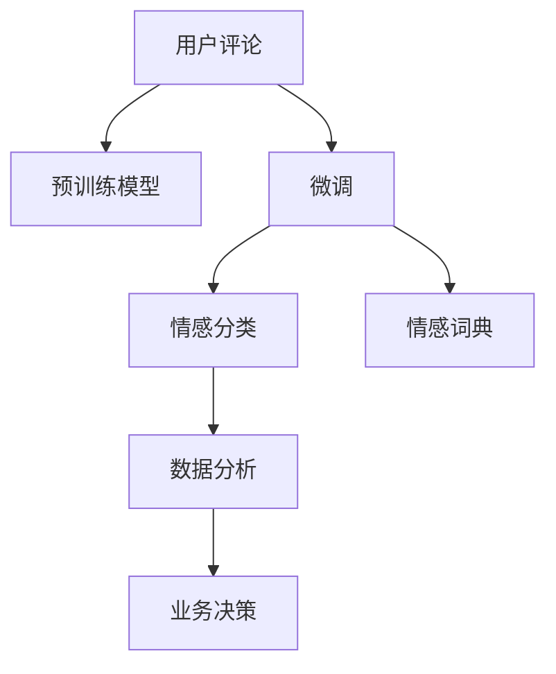

                 

# AI大模型在电商平台用户情感分析中的作用

> 关键词：电商平台,用户情感分析,大语言模型,情感分类,自然语言处理(NLP),微调,Fine-tuning,Transformer,BERT

## 1. 背景介绍

### 1.1 问题由来
电商平台作为数字经济的代表，日益成为消费者购物、交流、评论的重要平台。用户通过评论、评分等形式的反馈，为电商平台提供了大量的真实数据，这些数据对于了解用户需求、改进商品质量和提升用户体验至关重要。然而，传统的数据处理方式，如手动标签、人工审核等，既耗时又容易引入主观偏差，难以满足电商平台的实际需求。

近年来，随着大语言模型和自然语言处理技术的迅猛发展，用户情感分析的应用开始受到广泛关注。通过自动化技术对用户评论、评分等文本数据进行情感分类，电商平台能够更准确地获取用户反馈，及时发现问题并采取措施，增强用户体验，提升平台竞争力。

### 1.2 问题核心关键点
用户情感分析（Sentiment Analysis）是NLP领域的重要任务，旨在自动判断文本中的情感极性，如正面、中性、负面等。这一任务在电商平台中具有显著的应用价值：

1. **舆情监控**：通过分析用户评论，及时发现负面反馈，识别潜在危机，维护品牌形象。
2. **商品优化**：了解用户对商品质量的评价，优化产品线，提高用户满意度。
3. **个性化推荐**：基于用户情感倾向，推送更符合用户偏好的商品，提升购买转化率。
4. **市场分析**：通过情感分析数据，了解市场趋势和用户需求，辅助企业决策。

在实际应用中，用户情感分析的方法可分为两类：**基于规则的情感分析**和**基于机器学习的情感分类**。传统基于规则的方法需要大量手工规则和特征提取，难以适应复杂的自然语言变化；而基于机器学习的方法能够利用大数据训练出高性能的情感分类模型，在电商平台的实际应用中表现出显著优势。

## 2. 核心概念与联系

### 2.1 核心概念概述

用户情感分析涉及多个关键概念，以下将进行详细介绍：

- **大语言模型(Large Language Model, LLM)**：以自回归（如GPT）或自编码（如BERT）模型为代表的大规模预训练语言模型。通过在海量文本数据上进行预训练，学习到丰富的语言知识和语义表示，具备强大的文本生成和分类能力。

- **预训练(Pre-training)**：在大规模无标签文本语料上，通过自监督学习任务训练通用语言模型的过程。常见的预训练任务包括语言建模、掩码语言模型等，预训练使得模型学习到语言的通用表示。

- **微调(Fine-tuning)**：指在预训练模型的基础上，使用下游任务的少量标注数据，通过有监督学习优化模型在特定任务上的性能。通常只需调整顶层分类器或解码器，并以较小的学习率更新全部或部分的模型参数。

- **情感分类(Sentiment Classification)**：将用户评论等文本数据分为正面、中性、负面等情感类别，以判断用户情感倾向。

- **情感词典(Sentiment Lexicon)**：包含大量词语的情感极性信息，用于词向量的情感标注和情感分析。

- **自然语言处理(Natural Language Processing, NLP)**：涉及文本预处理、词向量表示、情感分类等任务的计算机科学领域，旨在使机器能够理解、生成自然语言。

这些概念之间的联系通过以下Mermaid流程图展示：



该流程图展示了用户评论数据的处理流程：

1. 用户评论数据首先进入预训练模型进行表示学习。
2. 在微调过程中，模型针对特定的情感分类任务进行优化。
3. 通过情感词典，对评论中的情感词进行标注和计算。
4. 分析情感分类结果，输出情感分析报告。
5. 根据分析结果，对电商业务进行决策优化。

## 3. 核心算法原理 & 具体操作步骤
### 3.1 算法原理概述

用户情感分析的算法核心在于将用户评论转化为模型可以理解的向量表示，并在此基础上进行情感分类。其基本流程如下：

1. **文本预处理**：去除停用词、标点等噪声，将评论转化为标准化的文本。
2. **词向量表示**：通过预训练模型（如BERT）将文本转化为词向量表示。
3. **情感计算**：根据预定义的情感词典，计算文本中每个词的情感得分，并加权求和。
4. **情感分类**：使用训练好的情感分类器对情感得分进行分类，得到最终的情感极性。

### 3.2 算法步骤详解

以下将详细介绍用户情感分析的算法步骤：

**Step 1: 数据预处理**
- 使用正则表达式去除评论中的标点、数字、特殊字符等，保留纯文本内容。
- 使用NLTK、SpaCy等库对文本进行分词、去除停用词等预处理。
- 将处理后的评论数据转化为小写，便于模型处理。

**Step 2: 词向量表示**
- 使用预训练的BERT模型将评论文本转化为词向量表示。
- 从BERT预训练的词向量中，取出[CLS]标记向量的嵌入值，作为句子的整体向量表示。

**Step 3: 情感计算**
- 引入情感词典，将评论中的词语映射到情感得分。
- 计算每个词的情感得分，并根据其在评论中的权重（如词频、位置等）进行加权求和，得到评论的情感得分。
- 引入阈值参数，将情感得分转化为0或1的极性标签。

**Step 4: 情感分类**
- 使用微调后的情感分类器对评论的情感得分进行分类，得到情感极性。
- 微调模型可以使用简单的全连接神经网络或RNN，也可以采用预训练的Transformer模型。

**Step 5: 模型评估与优化**
- 使用交叉验证等方法评估模型性能，选择最优模型。
- 定期更新模型，引入新数据，提高模型鲁棒性。

### 3.3 算法优缺点

用户情感分析算法具有以下优点：
1. **自动化**：完全自动化处理用户评论，提高效率。
2. **实时性**：实时分析评论数据，支持业务即时决策。
3. **扩展性**：可以处理大规模评论数据，且模型具有高度的可扩展性。

同时，算法也存在以下缺点：
1. **数据依赖**：算法效果依赖于评论数据的标注质量，标注成本较高。
2. **语言变化**：评论文本的情感表达方式可能随语言变化，影响算法泛化能力。
3. **情感词典问题**：情感词典的构建和维护复杂，且可能存在偏差。
4. **模型复杂性**：模型构建和微调需要一定专业知识和资源。

### 3.4 算法应用领域

用户情感分析在电商平台中具有广泛的应用场景：

- **客户服务**：通过分析用户评论，识别常见问题和投诉，提升客户服务质量。
- **商品优化**：了解用户对商品的评价，优化产品设计和服务流程，提高用户满意度。
- **市场分析**：通过情感分析数据，了解市场趋势和用户需求，辅助企业决策。
- **个性化推荐**：基于用户情感倾向，推送更符合用户偏好的商品，提升购买转化率。
- **品牌管理**：及时发现负面评论，采取措施，维护品牌形象。

## 4. 数学模型和公式 & 详细讲解  
### 4.1 数学模型构建

用户情感分析的数学模型构建如下：

设评论文本为 $x = (w_1, w_2, ..., w_n)$，其中 $w_i$ 表示第 $i$ 个词。情感词典为 $D = \{(w_i, s_i)\}_{i=1}^{n}$，其中 $s_i$ 表示词 $w_i$ 的情感得分。

设预训练模型输出的[CLS]标记向量的嵌入值为 $h_{CLS}$，则评论 $x$ 的情感得分 $S(x)$ 可以表示为：

$$
S(x) = \sum_{i=1}^{n} s_i \times \text{weight}_i \times h_{CLS}
$$

其中 $\text{weight}_i$ 表示词 $w_i$ 在评论中的权重。

情感分类器可以使用简单的全连接神经网络或RNN，其输出为情感极性标签 $y$：

$$
y = \text{softmax}(h_{CLS} \times W_1 + b_1)
$$

其中 $W_1$ 和 $b_1$ 为分类器的权重和偏置。

### 4.2 公式推导过程

设评论文本为 $x = (w_1, w_2, ..., w_n)$，情感词典为 $D = \{(w_i, s_i)\}_{i=1}^{n}$，其中 $s_i$ 表示词 $w_i$ 的情感得分。

预训练模型输出的[CLS]标记向量的嵌入值为 $h_{CLS}$，则评论 $x$ 的情感得分 $S(x)$ 可以表示为：

$$
S(x) = \sum_{i=1}^{n} s_i \times \text{weight}_i \times h_{CLS}
$$

其中 $\text{weight}_i$ 表示词 $w_i$ 在评论中的权重。

情感分类器的输出为情感极性标签 $y$：

$$
y = \text{softmax}(h_{CLS} \times W_1 + b_1)
$$

其中 $W_1$ 和 $b_1$ 为分类器的权重和偏置。

通过上述公式，用户情感分析的过程可以概括为以下步骤：

1. **文本预处理**：去除停用词、标点等噪声，将评论转化为标准化的文本。
2. **词向量表示**：使用预训练的BERT模型将评论文本转化为词向量表示。
3. **情感计算**：根据预定义的情感词典，计算文本中每个词的情感得分，并加权求和。
4. **情感分类**：使用训练好的情感分类器对情感得分进行分类，得到情感极性。

### 4.3 案例分析与讲解

以电商平台的商品评论分析为例，介绍情感分析的详细过程：

**Step 1: 数据预处理**
- 去除停用词、标点等噪声，将评论转化为标准化的文本。
- 将处理后的评论数据转化为小写，便于模型处理。

**Step 2: 词向量表示**
- 使用预训练的BERT模型将评论文本转化为词向量表示。
- 从BERT预训练的词向量中，取出[CLS]标记向量的嵌入值，作为句子的整体向量表示。

**Step 3: 情感计算**
- 引入情感词典，将评论中的词语映射到情感得分。
- 计算每个词的情感得分，并根据其在评论中的权重（如词频、位置等）进行加权求和，得到评论的情感得分。
- 引入阈值参数，将情感得分转化为0或1的极性标签。

**Step 4: 情感分类**
- 使用微调后的情感分类器对评论的情感得分进行分类，得到情感极性。
- 微调模型可以使用简单的全连接神经网络或RNN，也可以采用预训练的Transformer模型。

## 5. 项目实践：代码实例和详细解释说明
### 5.1 开发环境搭建

在进行情感分析项目开发前，我们需要准备好开发环境。以下是使用Python进行NLP开发的环境配置流程：

1. 安装Anaconda：从官网下载并安装Anaconda，用于创建独立的Python环境。

2. 创建并激活虚拟环境：
```bash
conda create -n nlp-env python=3.8 
conda activate nlp-env
```

3. 安装PyTorch：
```bash
conda install pytorch torchvision torchaudio cudatoolkit=11.1 -c pytorch -c conda-forge
```

4. 安装Transformers库：
```bash
pip install transformers
```

5. 安装各类工具包：
```bash
pip install numpy pandas scikit-learn matplotlib tqdm jupyter notebook ipython
```

完成上述步骤后，即可在`nlp-env`环境中开始情感分析项目的开发。

### 5.2 源代码详细实现

下面我们以电商平台用户评论情感分析为例，给出使用Transformers库对BERT模型进行情感分析的PyTorch代码实现。

首先，定义情感分析任务的数据处理函数：

```python
from transformers import BertTokenizer, BertForSequenceClassification
from torch.utils.data import Dataset
import torch

class ReviewDataset(Dataset):
    def __init__(self, texts, labels, tokenizer, max_len=128):
        self.texts = texts
        self.labels = labels
        self.tokenizer = tokenizer
        self.max_len = max_len
        
    def __len__(self):
        return len(self.texts)
    
    def __getitem__(self, item):
        text = self.texts[item]
        label = self.labels[item]
        
        encoding = self.tokenizer(text, return_tensors='pt', max_length=self.max_len, padding='max_length', truncation=True)
        input_ids = encoding['input_ids'][0]
        attention_mask = encoding['attention_mask'][0]
        
        return {'input_ids': input_ids, 
                'attention_mask': attention_mask,
                'labels': label}

# 情感词典
sentiment_dict = {'positive': 1, 'negative': 0}

# 创建dataset
tokenizer = BertTokenizer.from_pretrained('bert-base-cased')

train_dataset = ReviewDataset(train_texts, train_labels, tokenizer)
dev_dataset = ReviewDataset(dev_texts, dev_labels, tokenizer)
test_dataset = ReviewDataset(test_texts, test_labels, tokenizer)
```

然后，定义模型和优化器：

```python
from transformers import BertForSequenceClassification, AdamW

model = BertForSequenceClassification.from_pretrained('bert-base-cased', num_labels=2)

optimizer = AdamW(model.parameters(), lr=2e-5)
```

接着，定义训练和评估函数：

```python
from torch.utils.data import DataLoader
from tqdm import tqdm
from sklearn.metrics import classification_report

device = torch.device('cuda') if torch.cuda.is_available() else torch.device('cpu')
model.to(device)

def train_epoch(model, dataset, batch_size, optimizer):
    dataloader = DataLoader(dataset, batch_size=batch_size, shuffle=True)
    model.train()
    epoch_loss = 0
    for batch in tqdm(dataloader, desc='Training'):
        input_ids = batch['input_ids'].to(device)
        attention_mask = batch['attention_mask'].to(device)
        labels = batch['labels'].to(device)
        model.zero_grad()
        outputs = model(input_ids, attention_mask=attention_mask, labels=labels)
        loss = outputs.loss
        epoch_loss += loss.item()
        loss.backward()
        optimizer.step()
    return epoch_loss / len(dataloader)

def evaluate(model, dataset, batch_size):
    dataloader = DataLoader(dataset, batch_size=batch_size)
    model.eval()
    preds, labels = [], []
    with torch.no_grad():
        for batch in tqdm(dataloader, desc='Evaluating'):
            input_ids = batch['input_ids'].to(device)
            attention_mask = batch['attention_mask'].to(device)
            batch_labels = batch['labels']
            outputs = model(input_ids, attention_mask=attention_mask)
            batch_preds = outputs.logits.argmax(dim=2).to('cpu').tolist()
            batch_labels = batch_labels.to('cpu').tolist()
            for pred, label in zip(batch_preds, batch_labels):
                preds.append(pred[0])
                labels.append(label)
                
    print(classification_report(labels, preds))
```

最后，启动训练流程并在测试集上评估：

```python
epochs = 5
batch_size = 16

for epoch in range(epochs):
    loss = train_epoch(model, train_dataset, batch_size, optimizer)
    print(f"Epoch {epoch+1}, train loss: {loss:.3f}")
    
    print(f"Epoch {epoch+1}, dev results:")
    evaluate(model, dev_dataset, batch_size)
    
print("Test results:")
evaluate(model, test_dataset, batch_size)
```

以上就是使用PyTorch对BERT进行电商平台用户评论情感分析的完整代码实现。可以看到，得益于Transformers库的强大封装，我们可以用相对简洁的代码完成BERT模型的加载和情感分析任务的微调。

### 5.3 代码解读与分析

让我们再详细解读一下关键代码的实现细节：

**ReviewDataset类**：
- `__init__`方法：初始化文本、标签、分词器等关键组件。
- `__len__`方法：返回数据集的样本数量。
- `__getitem__`方法：对单个样本进行处理，将文本输入编码为token ids，将标签转换为数值，并对其进行定长padding，最终返回模型所需的输入。

**sentiment_dict字典**：
- 定义了情感标签与数值的映射关系，用于将预测结果解码回真实的情感标签。

**训练和评估函数**：
- 使用PyTorch的DataLoader对数据集进行批次化加载，供模型训练和推理使用。
- 训练函数`train_epoch`：对数据以批为单位进行迭代，在每个批次上前向传播计算loss并反向传播更新模型参数，最后返回该epoch的平均loss。
- 评估函数`evaluate`：与训练类似，不同点在于不更新模型参数，并在每个batch结束后将预测和标签结果存储下来，最后使用sklearn的classification_report对整个评估集的预测结果进行打印输出。

**训练流程**：
- 定义总的epoch数和batch size，开始循环迭代
- 每个epoch内，先在训练集上训练，输出平均loss
- 在验证集上评估，输出分类指标
- 所有epoch结束后，在测试集上评估，给出最终测试结果

可以看到，PyTorch配合Transformers库使得BERT微调的代码实现变得简洁高效。开发者可以将更多精力放在数据处理、模型改进等高层逻辑上，而不必过多关注底层的实现细节。

当然，工业级的系统实现还需考虑更多因素，如模型的保存和部署、超参数的自动搜索、更灵活的任务适配层等。但核心的微调范式基本与此类似。

## 6. 实际应用场景
### 6.1 智能客服系统

基于大语言模型微调的情感分析技术，可以广泛应用于智能客服系统的构建。传统客服往往需要配备大量人力，高峰期响应缓慢，且一致性和专业性难以保证。而使用情感分析技术，客服系统能够实时监测用户情感，快速响应用户需求，提高服务质量。

在技术实现上，可以收集企业内部的客服对话记录，将用户情绪分类为正面、中性、负面等，并在客服对话中实时监测用户情感变化。对于情绪负面用户，系统可以自动转接到人工客服，甚至识别出可能存在的投诉风险，及时介入处理。通过情感分析技术，智能客服系统能够大幅提升客户咨询体验和问题解决效率。

### 6.2 金融舆情监测

金融机构需要实时监测市场舆论动向，以便及时应对负面信息传播，规避金融风险。传统的人工监测方式成本高、效率低，难以应对网络时代海量信息爆发的挑战。基于大语言模型微调的情感分析技术，为金融舆情监测提供了新的解决方案。

具体而言，可以收集金融领域相关的新闻、报道、评论等文本数据，并对其进行情感标注。在此基础上对预训练语言模型进行微调，使其能够自动判断文本情感，实时监测市场舆情。一旦发现负面情绪激增等异常情况，系统便会自动预警，帮助金融机构快速应对潜在风险。

### 6.3 个性化推荐系统

当前的推荐系统往往只依赖用户的历史行为数据进行物品推荐，无法深入理解用户的真实兴趣偏好。基于大语言模型微调的情感分析技术，可以结合用户评论情感，更好地了解用户兴趣，从而实现个性化推荐。

在实践中，可以收集用户浏览、点击、评论、分享等行为数据，提取和用户交互的物品标题、描述、标签等文本内容。将文本内容作为模型输入，用户的后续行为（如是否点击、购买等）作为监督信号，在此基础上微调预训练语言模型。微调后的模型能够从文本内容中准确把握用户的兴趣点。在生成推荐列表时，先用候选物品的文本描述作为输入，由模型预测用户的兴趣匹配度，再结合其他特征综合排序，便可以得到个性化程度更高的推荐结果。

### 6.4 未来应用展望

随着大语言模型微调技术的发展，其在电商平台用户情感分析中的应用前景将更加广阔：

1. **智能决策**：通过情感分析数据，实时监测用户反馈，辅助企业做出快速反应和决策。
2. **用户画像**：结合情感分析和用户行为数据，构建更全面、准确的用户画像，提升用户体验。
3. **市场洞察**：通过情感分析数据，了解市场趋势和用户需求，辅助企业战略规划。
4. **产品优化**：实时监测用户对产品的反馈，快速迭代产品设计，提升产品质量。
5. **客户服务**：通过情感分析技术，实现自动化客服，提升服务效率和用户体验。

未来，随着技术的进步和应用场景的拓展，基于大语言模型的情感分析技术将在更多领域得到应用，为社会生产和生活中的各个环节注入新的智慧。

## 7. 工具和资源推荐
### 7.1 学习资源推荐

为了帮助开发者系统掌握大语言模型微调的理论基础和实践技巧，这里推荐一些优质的学习资源：

1. 《Transformer从原理到实践》系列博文：由大模型技术专家撰写，深入浅出地介绍了Transformer原理、BERT模型、情感分析等前沿话题。

2. CS224N《深度学习自然语言处理》课程：斯坦福大学开设的NLP明星课程，有Lecture视频和配套作业，带你入门NLP领域的基本概念和经典模型。

3. 《Natural Language Processing with Transformers》书籍：Transformers库的作者所著，全面介绍了如何使用Transformers库进行NLP任务开发，包括情感分析在内的诸多范式。

4. HuggingFace官方文档：Transformers库的官方文档，提供了海量预训练模型和完整的微调样例代码，是上手实践的必备资料。

5. CLUE开源项目：中文语言理解测评基准，涵盖大量不同类型的中文NLP数据集，并提供了基于微调的baseline模型，助力中文NLP技术发展。

通过对这些资源的学习实践，相信你一定能够快速掌握大语言模型微调的精髓，并用于解决实际的NLP问题。
### 7.2 开发工具推荐

高效的开发离不开优秀的工具支持。以下是几款用于大语言模型微调开发的常用工具：

1. PyTorch：基于Python的开源深度学习框架，灵活动态的计算图，适合快速迭代研究。大部分预训练语言模型都有PyTorch版本的实现。

2. TensorFlow：由Google主导开发的开源深度学习框架，生产部署方便，适合大规模工程应用。同样有丰富的预训练语言模型资源。

3. Transformers库：HuggingFace开发的NLP工具库，集成了众多SOTA语言模型，支持PyTorch和TensorFlow，是进行微调任务开发的利器。

4. Weights & Biases：模型训练的实验跟踪工具，可以记录和可视化模型训练过程中的各项指标，方便对比和调优。与主流深度学习框架无缝集成。

5. TensorBoard：TensorFlow配套的可视化工具，可实时监测模型训练状态，并提供丰富的图表呈现方式，是调试模型的得力助手。

6. Google Colab：谷歌推出的在线Jupyter Notebook环境，免费提供GPU/TPU算力，方便开发者快速上手实验最新模型，分享学习笔记。

合理利用这些工具，可以显著提升大语言模型微调任务的开发效率，加快创新迭代的步伐。

### 7.3 相关论文推荐

大语言模型和微调技术的发展源于学界的持续研究。以下是几篇奠基性的相关论文，推荐阅读：

1. Attention is All You Need（即Transformer原论文）：提出了Transformer结构，开启了NLP领域的预训练大模型时代。

2. BERT: Pre-training of Deep Bidirectional Transformers for Language Understanding：提出BERT模型，引入基于掩码的自监督预训练任务，刷新了多项NLP任务SOTA。

3. Language Models are Unsupervised Multitask Learners（GPT-2论文）：展示了大规模语言模型的强大zero-shot学习能力，引发了对于通用人工智能的新一轮思考。

4. Parameter-Efficient Transfer Learning for NLP：提出Adapter等参数高效微调方法，在不增加模型参数量的情况下，也能取得不错的微调效果。

5. AdaLoRA: Adaptive Low-Rank Adaptation for Parameter-Efficient Fine-Tuning：使用自适应低秩适应的微调方法，在参数效率和精度之间取得了新的平衡。

6. Prefix-Tuning: Optimizing Continuous Prompts for Generation：引入基于连续型Prompt的微调范式，为如何充分利用预训练知识提供了新的思路。

这些论文代表了大语言模型微调技术的发展脉络。通过学习这些前沿成果，可以帮助研究者把握学科前进方向，激发更多的创新灵感。

## 8. 总结：未来发展趋势与挑战

### 8.1 总结

本文对基于大语言模型微调的电商平台用户情感分析方法进行了全面系统的介绍。首先阐述了用户情感分析的背景和应用意义，明确了情感分析在电商平台中的关键作用。其次，从原理到实践，详细讲解了情感分析的数学模型和关键步骤，给出了情感分析任务开发的完整代码实例。同时，本文还探讨了情感分析技术在多个行业领域的应用前景，展示了其巨大的应用潜力。此外，本文精选了情感分析技术的各类学习资源，力求为读者提供全方位的技术指引。

通过本文的系统梳理，可以看到，基于大语言模型的情感分析方法在电商平台中具有广阔的应用前景，能够有效提升用户体验和平台竞争力。未来，随着技术的不断发展，情感分析技术将在更多领域得到应用，为社会生产和生活带来更多智慧。

### 8.2 未来发展趋势

展望未来，电商平台用户情感分析技术将呈现以下几个发展趋势：

1. **模型规模持续增大**：随着算力成本的下降和数据规模的扩张，预训练语言模型的参数量还将持续增长。超大规模语言模型蕴含的丰富语言知识，有望支撑更加复杂多变的情感分析任务。

2. **情感词典改进**：当前的情感词典主要基于情感极性，未来有望引入更丰富的语义信息和情感维度，增强情感分类的准确性。

3. **多模态融合**：情感分析不仅限于文本数据，未来的模型将融合视觉、音频等多模态信息，提升情感识别的全面性和鲁棒性。

4. **实时性提升**：通过引入GPU/TPU等高性能设备，并优化计算图，情感分析模型的实时性将显著提升，满足电商平台的即时需求。

5. **联邦学习**：为了保护用户隐私，未来的情感分析模型将采用联邦学习等分布式训练方法，在保护隐私的同时实现模型优化。

6. **模型压缩与加速**：通过模型裁剪、量化等技术，将大模型压缩至轻量级，并加速推理过程，提升实际应用效率。

以上趋势凸显了电商平台用户情感分析技术的广阔前景。这些方向的探索发展，必将进一步提升情感分析模型的性能和应用范围，为电商平台带来更多智慧。

### 8.3 面临的挑战

尽管电商平台用户情感分析技术已经取得了显著成果，但在迈向更加智能化、普适化应用的过程中，仍面临以下挑战：

1. **数据质量问题**：情感分析依赖于高质量的标注数据，但标注数据往往存在噪音和不一致性，影响模型效果。

2. **语言变化**：电商平台的销售语言可能随时间变化，模型需要不断更新情感词典和训练数据，以适应新语言环境。

3. **模型鲁棒性**：情感分析模型对输入噪声、语言变化等具有较高的敏感性，需要进一步提高模型的鲁棒性。

4. **隐私保护**：在分布式环境中，如何保护用户隐私，防止数据泄露，是情感分析技术面临的重要问题。

5. **资源需求**：大规模模型和大规模数据对计算资源和存储资源的要求较高，需要强大的硬件支持。

6. **可解释性**：情感分析模型通常被认为是"黑盒"系统，难以解释其内部工作机制和决策逻辑，影响模型的可解释性和可信度。

这些挑战需要研究者在模型设计、数据处理、分布式训练、隐私保护等多个方面进行深入研究和创新，以推动情感分析技术的进一步发展。

### 8.4 研究展望

面对情感分析技术面临的挑战，未来的研究需要在以下几个方面寻求新的突破：

1. **半监督学习和无监督学习**：利用有限的标注数据和无标签数据，探索更高效的情感分类方法，降低对标注数据的依赖。

2. **多任务学习**：通过多任务联合学习，提升模型的泛化能力和鲁棒性，同时减少对标注数据的依赖。

3. **元学习**：引入元学习思想，使模型能够自动适应新语言环境，提高模型的泛化性和适应性。

4. **知识图谱融合**：将符号化的先验知识与神经网络模型进行融合，提升情感分析的全面性和准确性。

5. **因果推理**：引入因果推断方法，增强情感分析模型的因果关系，提高模型的解释性和可信度。

6. **隐私保护技术**：采用差分隐私、联邦学习等技术，保护用户隐私，同时提高情感分析模型的安全性。

这些研究方向的探索，必将引领电商平台用户情感分析技术迈向更高的台阶，为电商平台带来更多智慧和价值。

## 9. 附录：常见问题与解答

**Q1：电商平台用户情感分析中，如何处理评论噪声？**

A: 评论噪声包括拼写错误、语法错误、无关词汇等，严重影响情感分析的准确性。常用的处理方式包括：

1. 使用正则表达式去除特殊字符和标点符号。
2. 利用NLTK、SpaCy等库进行分词和停用词去除。
3. 引入词向量预训练模型，如BERT，过滤掉低质量词汇。
4. 使用基于统计的方法，如TF-IDF，去除常见但无意义的停用词。

这些处理方式可以有效减少评论噪声，提高情感分析的准确性。

**Q2：情感词典对情感分析的影响是什么？**

A: 情感词典是情感分析中重要的组成部分，其质量直接影响情感分类的准确性。情感词典通常包含大量词语的情感极性信息，用于词向量的情感标注和情感分析。理想情况下，情感词典应覆盖广泛的语言表达方式，且标注准确，无歧义。情感词典构建和维护复杂，且可能存在偏差，因此需要定期更新和优化。

**Q3：如何选择合适的情感分析模型？**

A: 选择合适的情感分析模型需要综合考虑以下几个因素：

1. 数据规模：对于大规模数据，应选择能够高效处理高并发的模型。
2. 计算资源：对于资源受限环境，应选择轻量级模型。
3. 任务需求：根据具体任务需求，选择适合的情感分类模型，如全连接神经网络、RNN、Transformer等。

在选择模型时，应根据数据规模、计算资源和任务需求进行综合评估，选择最合适的模型。

**Q4：情感分析模型的训练流程是怎样的？**

A: 情感分析模型的训练流程包括以下几个关键步骤：

1. 数据预处理：去除停用词、标点等噪声，将评论转化为标准化的文本。
2. 词向量表示：使用预训练的BERT模型将评论文本转化为词向量表示。
3. 情感计算：根据预定义的情感词典，计算文本中每个词的情感得分，并加权求和。
4. 情感分类：使用训练好的情感分类器对情感得分进行分类，得到情感极性。
5. 模型评估与优化：使用交叉验证等方法评估模型性能，选择最优模型，并定期更新模型，引入新数据。

**Q5：情感分析在电商平台中的应用场景有哪些？**

A: 情感分析在电商平台中的应用场景主要包括：

1. 客户服务：通过情感分析实时监测用户情绪，快速响应用户需求，提升服务质量。
2. 商品优化：了解用户对商品的评价，优化产品设计和服务流程，提高用户满意度。
3. 市场洞察：通过情感分析数据，了解市场趋势和用户需求，辅助企业决策。
4. 个性化推荐：结合情感分析和用户行为数据，构建更全面、准确的用户画像，提升用户体验。

这些应用场景展示了情感分析技术在电商平台中的广阔前景。

---

作者：禅与计算机程序设计艺术 / Zen and the Art of Computer Programming

