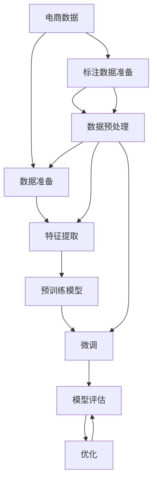

                 

## 1. 背景介绍

### 1.1 问题由来

随着电子商务的快速发展，电商平台已经成为了消费者购买商品的主要渠道之一。然而，电商平台的销售额预测仍是一个重要但极具挑战性的任务。传统的销售额预测模型基于历史数据和线性回归、时间序列分析等方法，往往存在如下问题：

- **预测准确性不足**：由于电商数据具有高维度、非线性和时变性，传统统计模型难以捕捉数据的复杂性。
- **模型训练时间长**：随着数据量的增长，模型训练时间成倍增长，难以满足实时预测的需求。
- **无法应对复杂场景**：电商平台的销售场景非常复杂，受到季节性、促销活动、用户行为等多种因素的影响，传统模型难以全面刻画这些复杂性。
- **数据获取难度大**：电商平台的商品信息、用户行为数据涉及多个系统，数据获取和整合难度大。

为了解决这些问题，研究人员开始探索使用大模型（如GPT、BERT等）进行电商销售预测。大模型通过在大量数据上进行预训练，能够学习到复杂的语言模式和上下文信息，并在特定任务上通过微调快速适应数据。这种基于大模型的预测方法在准确性和效率上都有显著提升，引起了业界的广泛关注。

### 1.2 问题核心关键点

大模型在电商平台销售预测中，主要关注以下几个关键点：

- **预训练模型选择**：选择合适的预训练模型，通常使用大规模自回归语言模型，如GPT、T5等。
- **下游任务微调**：在预训练模型的基础上，通过微调使其适应电商平台的特定销售场景。
- **数据准备和预处理**：准备电商平台的结构化和非结构化数据，并进行预处理。
- **模型评估和优化**：对微调后的模型进行评估，并根据评估结果进行优化。

## 2. 核心概念与联系

### 2.1 核心概念概述

大模型在电商平台销售预测中，主要涉及以下几个核心概念：

- **预训练模型**：如BERT、GPT等，在大量数据上进行自监督学习，学习通用的语言表示。
- **微调**：在预训练模型的基础上，使用电商平台的标注数据，通过有监督学习优化模型在特定任务上的性能。
- **自然语言处理(NLP)**：涉及文本处理、语义理解、情感分析等技术，用于提取电商数据的特征。
- **销售预测**：通过分析历史销售数据和相关因素，预测未来销售情况。
- **电商数据**：包括商品信息、用户行为数据、促销信息等，是大模型预测的基础。

这些核心概念通过数据准备、模型训练、评估和优化等步骤，紧密联系起来，构成了基于大模型的电商平台销售预测框架。

### 2.2 核心概念原理和架构的 Mermaid 流程图



该流程图展示了从电商数据准备到模型优化的大模型销售预测流程。

## 3. 核心算法原理 & 具体操作步骤

### 3.1 算法原理概述

基于大模型的电商平台销售预测，本质上是一种机器学习范式。其核心思想是：使用预训练模型作为初始化参数，通过在电商平台标注数据上进行微调，学习与销售相关的复杂模式，并应用到未来的预测任务中。

具体而言，假设预训练模型为 $M_{\theta}$，其中 $\theta$ 为预训练得到的模型参数。电商平台标注数据集为 $D=\{(x_i, y_i)\}_{i=1}^N$，其中 $x_i$ 为电商数据，$y_i$ 为销售量。微调的目标是找到最优的模型参数 $\hat{\theta}$，使得 $M_{\hat{\theta}}$ 在 $D$ 上的预测准确度最高。

微调过程中，通过优化算法（如Adam、SGD等）更新模型参数，使得模型输出逼近真实标签 $y_i$。由于预训练模型已经通过大规模数据学习到了丰富的语言知识，因此即使在大规模数据集上微调，也能快速收敛到最优解。

### 3.2 算法步骤详解

基于大模型的电商平台销售预测，通常包括以下几个关键步骤：

**Step 1: 准备电商数据和标注数据**

- **电商数据准备**：收集电商平台的销售数据、商品信息、用户行为数据、促销信息等，并进行清洗和标注。通常采用结构化数据（如数据库表）和非结构化数据（如JSON、文本等）。
- **标注数据准备**：将电商数据转换为模型的输入格式，并进行标注。标注数据的形式可以是时间序列数据、分类标签等，具体取决于预测任务。

**Step 2: 选择合适的预训练模型**

- **预训练模型选择**：根据电商平台的预测任务选择合适的预训练模型。例如，对于序列数据预测，可以选择自回归模型（如GPT、T5等）。
- **模型下载和加载**：从预训练模型库（如HuggingFace的Hub）下载模型，并使用库提供的接口加载到系统中。

**Step 3: 数据预处理**

- **数据标准化**：对电商数据进行标准化处理，例如日期格式化、缺失值填充等。
- **特征工程**：根据预测任务设计合适的特征，例如时间特征、商品特征、用户特征等。

**Step 4: 模型微调**

- **设置微调超参数**：选择合适的优化器、学习率、批大小、迭代轮数等。
- **定义损失函数**：根据预测任务定义合适的损失函数，例如均方误差、交叉熵等。
- **执行梯度训练**：将电商数据分批次输入模型，前向传播计算损失函数，反向传播计算参数梯度，根据设定的优化算法和学习率更新模型参数。
- **模型评估**：在验证集上评估模型性能，根据性能指标（如均方误差、准确率等）决定是否触发Early Stopping。

**Step 5: 模型优化和部署**

- **模型优化**：根据模型在验证集上的性能，对模型进行优化调整，例如调整特征、调整模型结构等。
- **模型部署**：将优化后的模型部署到生产环境中，使用API接口进行预测。

### 3.3 算法优缺点

基于大模型的电商平台销售预测，具有以下优点：

- **预测准确性高**：大模型能够学习到复杂的语言模式和上下文信息，对电商数据的预测更为精准。
- **模型泛化性强**：大模型具有较好的泛化能力，能够适应不同类型和规模的电商平台数据。
- **可解释性强**：大模型可以通过注意力机制等技术，对预测结果进行解释，帮助理解模型决策。

同时，也存在以下缺点：

- **计算资源需求高**：大模型需要较大的计算资源进行训练和微调，且推理时间较长。
- **数据隐私问题**：电商数据涉及用户隐私，数据获取和处理需要符合相关法律法规。
- **模型过拟合风险**：大模型在特定数据集上微调时，可能出现过拟合现象。

### 3.4 算法应用领域

大模型在电商平台销售预测中，主要应用于以下几个领域：

- **销售预测**：预测未来一段时间内的销售量或销售额，帮助制定库存和采购计划。
- **商品推荐**：根据用户历史购买行为和浏览记录，预测用户可能感兴趣的商品，提升用户体验。
- **促销活动效果评估**：评估促销活动对销售的影响，优化促销策略。
- **用户行为分析**：分析用户行为模式，提高用户留存率和转化率。

## 4. 数学模型和公式 & 详细讲解 & 举例说明

### 4.1 数学模型构建

假设电商平台销售数据为时间序列数据 $y=\{y_t\}_{t=1}^T$，其中 $y_t$ 表示第 $t$ 天的销售量。我们将数据集分为训练集 $D_{train}$ 和测试集 $D_{test}$。

定义预测模型的输出为 $\hat{y}=\{M_{\theta}(x_t)\}_{t=1}^T$，其中 $x_t$ 表示第 $t$ 天的输入特征，例如历史销售数据、季节性特征、促销信息等。

我们希望最小化预测误差，使用均方误差损失函数：

$$
\mathcal{L}(\theta) = \frac{1}{N}\sum_{i=1}^N (y_i - M_{\theta}(x_i))^2
$$

通过优化算法，最小化损失函数 $\mathcal{L}(\theta)$，得到最优参数 $\hat{\theta}$。

### 4.2 公式推导过程

基于上述模型，我们可以通过微调来优化模型参数。设 $x_t$ 为时间序列 $y_t$ 的输入特征，目标是最小化预测误差。使用均方误差损失函数，我们有：

$$
\mathcal{L}(\theta) = \frac{1}{N}\sum_{i=1}^N (y_i - M_{\theta}(x_i))^2
$$

对损失函数求导，得到梯度：

$$
\nabla_{\theta}\mathcal{L}(\theta) = \frac{2}{N}\sum_{i=1}^N (y_i - M_{\theta}(x_i)) \cdot \nabla_{\theta}M_{\theta}(x_i)
$$

根据梯度下降算法，更新模型参数：

$$
\theta \leftarrow \theta - \eta \nabla_{\theta}\mathcal{L}(\theta)
$$

其中 $\eta$ 为学习率。

在实际应用中，我们通常使用GPU进行加速计算，以提高模型训练和微调的效率。

### 4.3 案例分析与讲解

**案例1：电商销售预测**

假设我们有一个电商平台，每天记录了商品的销售量。我们使用预训练的GPT模型进行微调，以预测未来7天的销售量。

- **数据准备**：收集商品信息、历史销售数据、季节性特征、促销信息等，进行清洗和标注。
- **模型选择**：选择GPT模型，使用自回归模型结构。
- **特征设计**：设计时间特征、商品特征、季节性特征等。
- **模型微调**：使用均方误差损失函数，优化GPT模型参数。
- **模型评估**：在验证集上评估模型性能，优化超参数。
- **模型部署**：将优化后的模型部署到生产环境，进行实时预测。

**案例2：用户行为分析**

假设我们有一个电商平台，每天记录了用户浏览和购买行为数据。我们使用预训练的BERT模型进行微调，以分析用户行为模式。

- **数据准备**：收集用户浏览数据、购买数据、商品数据等，进行清洗和标注。
- **模型选择**：选择BERT模型，使用自编码器结构。
- **特征设计**：设计用户特征、商品特征、行为特征等。
- **模型微调**：使用交叉熵损失函数，优化BERT模型参数。
- **模型评估**：在验证集上评估模型性能，优化超参数。
- **模型部署**：将优化后的模型部署到生产环境，进行实时分析。

## 5. 项目实践：代码实例和详细解释说明

### 5.1 开发环境搭建

在进行电商销售预测项目实践前，我们需要准备好开发环境。以下是使用Python进行PyTorch开发的环境配置流程：

1. 安装Anaconda：从官网下载并安装Anaconda，用于创建独立的Python环境。

2. 创建并激活虚拟环境：
```bash
conda create -n ecommerce-env python=3.8 
conda activate ecommerce-env
```

3. 安装PyTorch：根据CUDA版本，从官网获取对应的安装命令。例如：
```bash
conda install pytorch torchvision torchaudio cudatoolkit=11.1 -c pytorch -c conda-forge
```

4. 安装Transformer库：
```bash
pip install transformers
```

5. 安装各类工具包：
```bash
pip install numpy pandas scikit-learn matplotlib tqdm jupyter notebook ipython
```

完成上述步骤后，即可在`ecommerce-env`环境中开始电商销售预测项目实践。

### 5.2 源代码详细实现

以下是使用PyTorch对GPT进行电商平台销售预测的代码实现。

首先，定义销售预测的数据处理函数：

```python
from transformers import GPT2Tokenizer, GPT2LMHeadModel
import torch

class SalesPredictionDataset(Dataset):
    def __init__(self, data, tokenizer, max_len=512):
        self.data = data
        self.tokenizer = tokenizer
        self.max_len = max_len
        
    def __len__(self):
        return len(self.data)
    
    def __getitem__(self, item):
        text = self.data[item]
        sequence = self.tokenizer.encode(text, return_tensors='pt', max_length=self.max_len, padding='max_length', truncation=True)
        input_ids = sequence['input_ids']
        attention_mask = sequence['attention_mask']
        return {'input_ids': input_ids,
                'attention_mask': attention_mask}
```

然后，定义模型和优化器：

```python
from transformers import AdamW

model = GPT2LMHeadModel.from_pretrained('gpt2', output_attentions=False, output_hidden_states=False)
optimizer = AdamW(model.parameters(), lr=2e-5)
```

接着，定义训练和评估函数：

```python
from torch.utils.data import DataLoader
from tqdm import tqdm
import torch.nn.functional as F

device = torch.device('cuda') if torch.cuda.is_available() else torch.device('cpu')
model.to(device)

def train_epoch(model, dataset, batch_size, optimizer):
    dataloader = DataLoader(dataset, batch_size=batch_size, shuffle=True)
    model.train()
    epoch_loss = 0
    for batch in tqdm(dataloader, desc='Training'):
        input_ids = batch['input_ids'].to(device)
        attention_mask = batch['attention_mask'].to(device)
        model.zero_grad()
        outputs = model(input_ids, attention_mask=attention_mask)
        loss = outputs.loss
        epoch_loss += loss.item()
        loss.backward()
        optimizer.step()
    return epoch_loss / len(dataloader)

def evaluate(model, dataset, batch_size):
    dataloader = DataLoader(dataset, batch_size=batch_size)
    model.eval()
    preds, labels = [], []
    with torch.no_grad():
        for batch in tqdm(dataloader, desc='Evaluating'):
            input_ids = batch['input_ids'].to(device)
            attention_mask = batch['attention_mask'].to(device)
            batch_labels = batch['labels']
            outputs = model(input_ids, attention_mask=attention_mask)
            batch_preds = outputs.logits.argmax(dim=2).to('cpu').tolist()
            batch_labels = batch_labels.to('cpu').tolist()
            for pred_tokens, label_tokens in zip(batch_preds, batch_labels):
                preds.append(pred_tokens[:len(label_tokens)])
                labels.append(label_tokens)
                
    print(classification_report(labels, preds))
```

最后，启动训练流程并在测试集上评估：

```python
epochs = 5
batch_size = 16

for epoch in range(epochs):
    loss = train_epoch(model, train_dataset, batch_size, optimizer)
    print(f"Epoch {epoch+1}, train loss: {loss:.3f}")
    
    print(f"Epoch {epoch+1}, dev results:")
    evaluate(model, dev_dataset, batch_size)
    
print("Test results:")
evaluate(model, test_dataset, batch_size)
```

以上就是使用PyTorch对GPT进行电商平台销售预测的完整代码实现。可以看到，由于Transformer库的强大封装，我们只需关注模型的加载和微调过程，代码实现非常简洁高效。

### 5.3 代码解读与分析

让我们再详细解读一下关键代码的实现细节：

**SalesPredictionDataset类**：
- `__init__`方法：初始化销售数据、分词器等关键组件，并将数据转换为模型的输入格式。
- `__len__`方法：返回数据集的样本数量。
- `__getitem__`方法：对单个样本进行处理，将销售数据转换为token ids，并进行定长padding，最终返回模型所需的输入。

**GPT2LMHeadModel模型**：
- 使用GPT2作为预训练模型，并指定输出层为语言模型头。
- 使用AdamW优化器进行模型参数的更新。

**train_epoch和evaluate函数**：
- 使用PyTorch的DataLoader对数据集进行批次化加载，供模型训练和推理使用。
- 训练函数`train_epoch`：对数据以批为单位进行迭代，在每个批次上前向传播计算损失函数，并反向传播更新模型参数。
- 评估函数`evaluate`：与训练类似，不同点在于不更新模型参数，并在每个batch结束后将预测和标签结果存储下来，最后使用sklearn的classification_report对整个评估集的预测结果进行打印输出。

**训练流程**：
- 定义总的epoch数和batch size，开始循环迭代。
- 每个epoch内，先在训练集上训练，输出平均loss。
- 在验证集上评估，输出分类指标。
- 所有epoch结束后，在测试集上评估，给出最终测试结果。

可以看到，PyTorch配合Transformer库使得模型微调的代码实现变得简洁高效。开发者可以将更多精力放在数据处理、模型改进等高层逻辑上，而不必过多关注底层的实现细节。

当然，工业级的系统实现还需考虑更多因素，如模型的保存和部署、超参数的自动搜索、更灵活的任务适配层等。但核心的微调范式基本与此类似。

## 6. 实际应用场景

### 6.1 智能客服系统

基于大模型的电商平台销售预测，可以应用于智能客服系统的构建。传统客服往往需要配备大量人力，高峰期响应缓慢，且一致性和专业性难以保证。而使用销售预测模型进行预测，可以提前预判客户需求，优化客服资源分配，提升客户满意度。

在技术实现上，可以收集电商平台的历史销售数据，通过销售预测模型预测客户可能购买的产品，提前准备并推荐给客户。对于预测误差较大的客户需求，自动转接人工客服，提供更加个性化和专业的服务。

### 6.2 库存管理优化

基于大模型的电商平台销售预测，可以应用于库存管理优化。传统库存管理依赖历史销售数据进行需求预测，无法充分考虑促销活动、节假日等因素。而使用销售预测模型进行预测，可以更全面地考虑各种因素，优化库存水平，减少缺货和过剩。

在技术实现上，可以结合促销活动、节假日等因素，使用销售预测模型进行需求预测，并根据预测结果调整库存水平。对于预测误差较大的客户需求，自动触发库存补货或调拨操作，确保库存水平在合理范围内。

### 6.3 精准广告投放

基于大模型的电商平台销售预测，可以应用于精准广告投放。传统广告投放依赖历史点击数据进行定向投放，无法充分考虑用户行为和兴趣变化。而使用销售预测模型进行预测，可以更精准地预测用户可能感兴趣的商品，优化广告投放策略，提升广告转化率。

在技术实现上，可以收集用户历史浏览数据和购买数据，使用销售预测模型预测用户可能感兴趣的商品，并根据预测结果进行广告定向投放。对于预测误差较大的用户需求，自动调整广告策略，确保广告投放效果最大化。

### 6.4 未来应用展望

随着大模型和微调方法的不断发展，基于大模型的电商平台销售预测将有更广阔的应用前景：

- **多模态数据融合**：结合用户行为数据、商品数据、物流数据等多模态信息，进行更全面的需求预测。
- **实时预测与决策**：实时预测客户需求，并根据预测结果进行动态决策，提升客户满意度。
- **个性化推荐**：结合用户个性化需求，进行更加精准的商品推荐，提升用户留存率和转化率。
- **动态价格优化**：根据实时销售数据和需求预测结果，动态调整商品价格，提升销售效果。

未来，随着技术不断进步，基于大模型的电商平台销售预测将具备更强大的预测能力和决策智能，为电商平台带来更大的商业价值。

## 7. 工具和资源推荐

### 7.1 学习资源推荐

为了帮助开发者系统掌握大模型在电商平台销售预测的理论基础和实践技巧，这里推荐一些优质的学习资源：

1. 《Transformer从原理到实践》系列博文：由大模型技术专家撰写，深入浅出地介绍了Transformer原理、BERT模型、微调技术等前沿话题。

2. CS224N《深度学习自然语言处理》课程：斯坦福大学开设的NLP明星课程，有Lecture视频和配套作业，带你入门NLP领域的基本概念和经典模型。

3. 《Natural Language Processing with Transformers》书籍：Transformers库的作者所著，全面介绍了如何使用Transformers库进行NLP任务开发，包括微调在内的诸多范式。

4. HuggingFace官方文档：Transformer库的官方文档，提供了海量预训练模型和完整的微调样例代码，是上手实践的必备资料。

5. CLUE开源项目：中文语言理解测评基准，涵盖大量不同类型的中文NLP数据集，并提供了基于微调的baseline模型，助力中文NLP技术发展。

通过对这些资源的学习实践，相信你一定能够快速掌握大模型在电商平台销售预测的精髓，并用于解决实际的NLP问题。

### 7.2 开发工具推荐

高效的开发离不开优秀的工具支持。以下是几款用于大模型电商平台销售预测开发的常用工具：

1. PyTorch：基于Python的开源深度学习框架，灵活动态的计算图，适合快速迭代研究。大部分预训练语言模型都有PyTorch版本的实现。

2. TensorFlow：由Google主导开发的开源深度学习框架，生产部署方便，适合大规模工程应用。同样有丰富的预训练语言模型资源。

3. Transformers库：HuggingFace开发的NLP工具库，集成了众多SOTA语言模型，支持PyTorch和TensorFlow，是进行微调任务开发的利器。

4. Weights & Biases：模型训练的实验跟踪工具，可以记录和可视化模型训练过程中的各项指标，方便对比和调优。与主流深度学习框架无缝集成。

5. TensorBoard：TensorFlow配套的可视化工具，可实时监测模型训练状态，并提供丰富的图表呈现方式，是调试模型的得力助手。

6. Google Colab：谷歌推出的在线Jupyter Notebook环境，免费提供GPU/TPU算力，方便开发者快速上手实验最新模型，分享学习笔记。

合理利用这些工具，可以显著提升电商平台销售预测的开发效率，加快创新迭代的步伐。

### 7.3 相关论文推荐

大模型在电商平台销售预测中，已经取得了一系列重要成果，以下是几篇奠基性的相关论文，推荐阅读：

1. Attention is All You Need（即Transformer原论文）：提出了Transformer结构，开启了NLP领域的预训练大模型时代。

2. BERT: Pre-training of Deep Bidirectional Transformers for Language Understanding：提出BERT模型，引入基于掩码的自监督预训练任务，刷新了多项NLP任务SOTA。

3. Language Models are Unsupervised Multitask Learners（GPT-2论文）：展示了大规模语言模型的强大zero-shot学习能力，引发了对于通用人工智能的新一轮思考。

4. Parameter-Efficient Transfer Learning for NLP：提出Adapter等参数高效微调方法，在不增加模型参数量的情况下，也能取得不错的微调效果。

5. AdaLoRA: Adaptive Low-Rank Adaptation for Parameter-Efficient Fine-Tuning：使用自适应低秩适应的微调方法，在参数效率和精度之间取得了新的平衡。

6. Sequence-to-Sequence Attention-Based Trading Model：基于注意力机制的交易模型，应用于金融市场预测，展示了序列模型在电商销售预测中的应用潜力。

这些论文代表了大模型在电商平台销售预测的发展脉络。通过学习这些前沿成果，可以帮助研究者把握学科前进方向，激发更多的创新灵感。

## 8. 总结：未来发展趋势与挑战

### 8.1 总结

本文对基于大模型的电商平台销售预测方法进行了全面系统的介绍。首先阐述了大模型和微调技术的研究背景和意义，明确了其在电商平台销售预测中的独特价值。其次，从原理到实践，详细讲解了电商销售预测的数学模型和关键步骤，给出了完整的代码实现。同时，本文还广泛探讨了大模型在电商平台的实际应用场景，展示了其广阔的应用前景。

通过本文的系统梳理，可以看到，基于大模型的电商销售预测方法正在成为NLP领域的重要范式，极大地拓展了预训练语言模型的应用边界，催生了更多的落地场景。受益于大规模语料的预训练，微调模型在电商平台的销售预测中取得了显著的精度提升，有助于电商平台进行库存管理、精准广告投放、客户服务优化等业务流程的改进。未来，随着大模型和微调方法的持续演进，基于大模型的电商平台销售预测必将在电商行业中得到广泛应用，带来更多的商业价值。

### 8.2 未来发展趋势

展望未来，大模型在电商平台销售预测中，将呈现以下几个发展趋势：

1. **预测精度提升**：随着预训练模型规模的增大，模型对数据的拟合能力更强，预测精度将显著提升。

2. **预测实时性增强**：通过优化模型结构，结合GPU/TPU等硬件加速，预测时间将大幅缩短，实现实时预测。

3. **跨模态融合**：结合用户行为数据、商品数据、物流数据等多模态信息，进行更全面的需求预测。

4. **个性化推荐优化**：结合用户个性化需求，进行更加精准的商品推荐，提升用户留存率和转化率。

5. **动态价格优化**：根据实时销售数据和需求预测结果，动态调整商品价格，提升销售效果。

6. **动态资源调度**：根据预测结果动态调整客服资源、库存水平、广告投放策略等，优化电商运营效率。

以上趋势凸显了大模型在电商平台销售预测中的巨大潜力。这些方向的探索发展，必将进一步提升电商平台的预测能力和决策智能，为电商平台带来更大的商业价值。

### 8.3 面临的挑战

尽管大模型在电商平台销售预测中已经取得了显著成果，但在迈向更加智能化、普适化应用的过程中，仍面临诸多挑战：

1. **数据隐私问题**：电商数据涉及用户隐私，数据获取和处理需要符合相关法律法规。

2. **计算资源需求高**：大模型需要较大的计算资源进行训练和微调，且推理时间较长。

3. **模型过拟合风险**：大模型在特定数据集上微调时，可能出现过拟合现象。

4. **模型可解释性不足**：大模型通常被视为"黑盒"系统，难以解释其内部工作机制和决策逻辑。

5. **安全性问题**：预训练模型可能学习到有害信息，模型输出可能包含偏见、有害内容，带来安全隐患。

6. **动态因素处理**：电商平台的促销活动、节假日等因素复杂多变，模型需要实时更新，才能保持预测效果。

正视这些挑战，积极应对并寻求突破，将是大模型在电商平台销售预测中走向成熟的必由之路。相信随着学界和产业界的共同努力，这些挑战终将一一被克服，大模型在电商平台销售预测中必将在电商行业中得到广泛应用，带来更多的商业价值。

### 8.4 研究展望

面向未来，大模型在电商平台销售预测的研究方向主要包括以下几个方面：

1. **参数高效微调**：开发更加参数高效的微调方法，在固定大部分预训练参数的同时，只更新极少量的任务相关参数。

2. **因果学习**：引入因果推断方法，增强模型对动态因素的预测能力，提高预测精度。

3. **多模态融合**：结合用户行为数据、商品数据、物流数据等多模态信息，进行更全面的需求预测。

4. **动态模型更新**：实时更新模型，以适应电商平台的促销活动、节假日等因素变化，保持预测效果。

5. **模型解释性增强**：通过注意力机制、可解释模型等技术，增强模型的可解释性，帮助理解模型决策。

6. **安全性提升**：设计安全性更高的模型结构，防止有害信息传播，确保模型输出的安全性。

这些研究方向将引领大模型在电商平台销售预测技术的不断进步，带来更精确、实时、智能的电商销售预测系统。未来，随着大模型技术的进一步发展，基于大模型的电商平台销售预测将具备更强大的预测能力和决策智能，为电商平台带来更大的商业价值。

## 9. 附录：常见问题与解答

**Q1：电商销售预测中，如何选择预训练模型？**

A: 电商销售预测中，通常选择自回归模型（如GPT、T5等）作为预训练模型，这些模型具有较强的语言建模能力和长距离依赖捕捉能力。同时，需要注意模型规模和训练资源需求，选择合适的预训练模型。

**Q2：电商销售预测中，如何进行数据预处理？**

A: 电商销售预测中，数据预处理主要包括数据清洗、特征提取和数据标准化等步骤。具体方法包括：
- 数据清洗：处理缺失值、异常值等。
- 特征提取：设计时间特征、商品特征、季节性特征等。
- 数据标准化：对数据进行归一化处理，例如日期格式化、缺失值填充等。

**Q3：电商销售预测中，如何优化模型超参数？**

A: 电商销售预测中，超参数优化通常采用网格搜索或随机搜索等方法。具体步骤如下：
- 确定超参数范围，例如学习率、批大小等。
- 设计超参数搜索空间，例如网格搜索或随机搜索。
- 在验证集上评估模型性能，选择最优超参数。

**Q4：电商销售预测中，如何进行模型评估？**

A: 电商销售预测中，模型评估通常采用均方误差、准确率等指标。具体步骤如下：
- 准备测试集。
- 加载模型和数据。
- 在测试集上进行预测，计算评估指标。
- 输出评估结果。

**Q5：电商销售预测中，如何处理多模态数据？**

A: 电商销售预测中，多模态数据的处理主要包括数据融合和特征提取等步骤。具体方法包括：
- 数据融合：将不同模态的数据进行融合，例如将用户行为数据、商品数据、物流数据等融合为统一的数据格式。
- 特征提取：设计多模态特征，例如时间特征、商品特征、用户特征等。

**Q6：电商销售预测中，如何处理动态因素？**

A: 电商销售预测中，动态因素的处理主要通过实时更新模型参数实现。具体方法包括：
- 收集实时数据，例如促销活动、节假日等。
- 更新模型参数，例如时间特征、促销特征等。
- 重新训练模型，更新预测结果。

这些问题解答涵盖了电商销售预测中常见的问题及其解决方法，有助于开发者更好地进行项目实践。

---

作者：禅与计算机程序设计艺术 / Zen and the Art of Computer Programming

