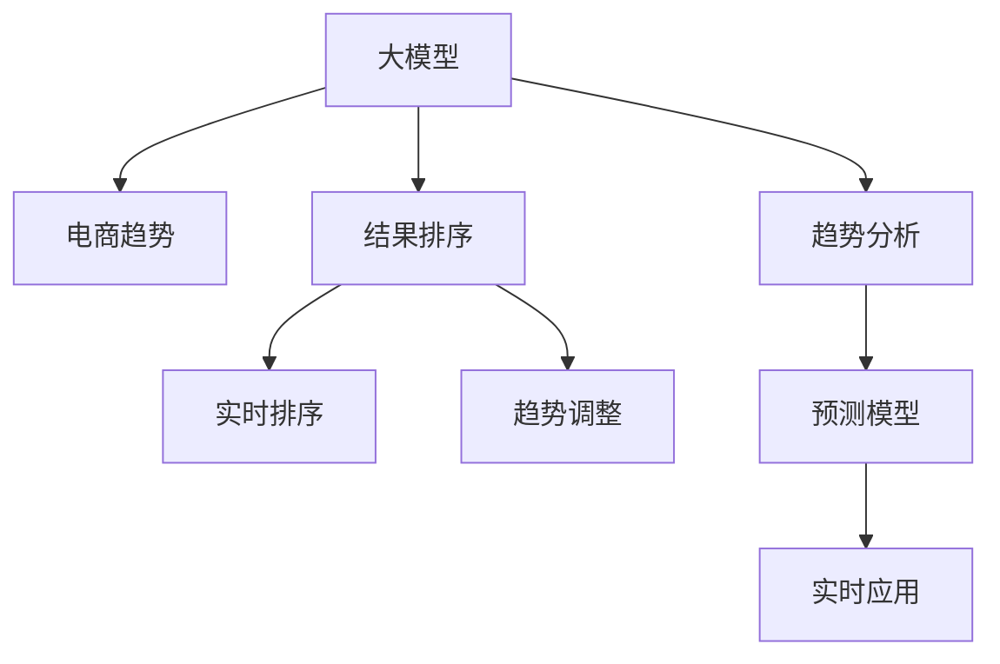

                 

# AI大模型在电商搜索结果趋势分析中的应用

## 1. 背景介绍

### 1.1 电商背景
电子商务已成为人们购物的重要方式，各大电商平台如淘宝、京东、拼多多等，拥有数亿用户和海量商品。电商平台通过提供优质的搜索结果，帮助用户迅速找到所需商品，提升用户体验，增加交易转化率。随着商品种类和用户需求的不断增长，对搜索结果排序算法的精确度和效率要求也变得越来越高。

### 1.2 电商问题
电商搜索排序涉及多个维度，包括商品价格、销量、评价、品牌、类别等。这些维度相互关联，需要综合考虑，才能找到最适合用户的商品。传统的排序算法基于静态特征，难以实时捕捉用户需求的变化。例如，用户可能对不同商品的需求随时间动态变化，而价格和销量等动态特征需要实时处理。此外，电商搜索结果的展示效果和点击率也是一个重要考量，需要优化排序策略，提高点击转化率。

## 2. 核心概念与联系

### 2.1 核心概念概述

为了解决电商搜索排序的问题，我们需要引入AI大模型和趋势分析技术。以下是几个关键概念：

- **大模型**：以Transformer架构为代表的深度学习模型，通过在大规模数据上进行预训练，学习到通用的语言表示，具备强大的文本处理和理解能力。
- **电商趋势**：用户在电商平台上对商品需求的动态变化趋势，通常基于用户搜索历史、行为数据等进行分析。
- **结果排序**：根据用户输入的搜索词，通过计算模型评估各商品的相关性和优先级，进行排名排序，展示给用户。
- **趋势分析**：通过分析用户行为和商品销量变化，预测用户未来需求趋势，优化排序算法，提升用户体验。

这些概念通过以下Mermaid流程图展示：



通过以上流程，我们可以构建一个综合考虑用户行为和商品动态特征的电商搜索结果排序系统。

## 3. 核心算法原理 & 具体操作步骤

### 3.1 算法原理概述

电商搜索结果排序的目标是，根据用户输入的搜索词和实时数据，计算各商品的相关性评分，并按照评分进行排序，展示给用户。基于大模型的电商搜索结果排序可以分为三个步骤：

1. **用户行为建模**：构建用户行为特征向量，通过大模型学习用户的历史行为，生成用户兴趣表示。
2. **商品特征提取**：利用大模型对商品标题、描述、评价等文本信息进行特征提取，生成商品表示。
3. **结果排序优化**：结合用户兴趣和商品特征，计算每个商品的相关性评分，根据评分进行排序，优化搜索结果展示。

### 3.2 算法步骤详解

#### 3.2.1 用户行为建模

用户行为建模的目的是构建用户行为特征向量，表示用户的长期兴趣和短期行为。具体的建模流程如下：

1. **行为数据收集**：收集用户的历史搜索、点击、购买等行为数据，包括搜索词、点击位置、浏览时间、商品ID等。
2. **行为特征提取**：使用大模型对行为数据进行处理，生成用户行为向量。例如，可以使用BERT模型对搜索词进行嵌入，生成词向量表示，作为用户兴趣的一部分。
3. **特征融合**：将用户行为向量与其他特征（如时间戳、点击位置、浏览时间等）进行融合，生成用户行为表示。

#### 3.2.2 商品特征提取

商品特征提取的目的是对商品标题、描述、评价等文本信息进行特征提取，生成商品表示。具体的提取流程如下：

1. **文本数据预处理**：对商品标题、描述、评价等文本信息进行分词、去除停用词、词性标注等预处理操作。
2. **文本嵌入**：使用大模型（如BERT）对预处理后的文本信息进行嵌入，生成商品特征向量。
3. **特征融合**：将文本嵌入与其他商品特征（如价格、销量、评分等）进行融合，生成商品表示。

#### 3.2.3 结果排序优化

结果排序优化的目的是根据用户兴趣和商品特征，计算每个商品的相关性评分，并根据评分进行排序，优化搜索结果展示。具体的优化流程如下：

1. **评分计算**：将用户兴趣表示和商品表示输入大模型，计算相关性评分。例如，可以使用Attention机制，计算用户兴趣和商品特征之间的注意力权重，生成商品相关性评分。
2. **排序展示**：根据评分对商品进行排序，展示给用户。通常使用简单的排序算法，如Top-k排序，展示评分最高的商品。

### 3.3 算法优缺点

#### 3.3.1 算法优点

1. **灵活性高**：大模型具有强大的泛化能力，可以根据不同的任务和数据进行调整，适应不同电商平台的个性化需求。
2. **性能优越**：大模型可以处理大规模数据，提供高效的特征提取和计算，提升搜索结果排序的准确性和效率。
3. **可解释性高**：大模型通常包含多种特征融合和注意力机制，可以提供详细的解释和分析，帮助优化搜索结果。

#### 3.3.2 算法缺点

1. **模型复杂度高**：大模型参数量庞大，对计算资源和内存占用较高，需要高性能的硬件设备和算法优化。
2. **数据依赖性强**：大模型的效果高度依赖于数据的质量和多样性，需要采集和处理大量的行为数据和商品数据。
3. **部署复杂**：大模型通常需要复杂的部署环境，需要进行参数调优和超参数设置，才能达到最佳性能。

### 3.4 算法应用领域

基于大模型的电商搜索结果排序算法，可以应用于多种电商场景，包括但不限于：

1. **商品推荐**：根据用户的历史行为和实时查询，推荐最相关的商品。
2. **搜索结果排序**：对用户输入的搜索词进行排序，展示最相关的商品。
3. **个性化展示**：根据用户行为和商品特征，生成个性化的搜索结果，提升用户体验。
4. **广告投放**：根据用户行为和商品特征，优化广告展示位置和内容，提升广告效果。

## 4. 数学模型和公式 & 详细讲解 & 举例说明

### 4.1 数学模型构建

为了实现电商搜索结果排序，我们可以构建一个基于大模型的数学模型，包含用户行为建模、商品特征提取和结果排序优化三个部分。

设用户行为表示为 $\mathbf{u} \in \mathbb{R}^d$，商品表示为 $\mathbf{v} \in \mathbb{R}^d$，相关性评分为 $s(\mathbf{u},\mathbf{v}) \in \mathbb{R}$。用户行为建模的目标是生成用户行为向量 $\mathbf{u}$，商品特征提取的目标是生成商品向量 $\mathbf{v}$，结果排序优化的目标是计算相关性评分 $s(\mathbf{u},\mathbf{v})$。

### 4.2 公式推导过程

#### 4.2.1 用户行为建模

用户行为建模的公式如下：

$$
\mathbf{u} = \mathbf{f}(\mathbf{b})
$$

其中 $\mathbf{b}$ 表示用户行为特征，$\mathbf{f}$ 表示用户行为映射函数，通常使用大模型进行建模。例如，可以使用BERT模型对用户搜索词进行嵌入，生成用户兴趣向量。

#### 4.2.2 商品特征提取

商品特征提取的公式如下：

$$
\mathbf{v} = \mathbf{g}(\mathbf{x})
$$

其中 $\mathbf{x}$ 表示商品特征，$\mathbf{g}$ 表示商品特征映射函数，通常使用大模型进行建模。例如，可以使用BERT模型对商品描述进行嵌入，生成商品特征向量。

#### 4.2.3 结果排序优化

结果排序优化的公式如下：

$$
s(\mathbf{u},\mathbf{v}) = \mathbf{h}(\mathbf{u},\mathbf{v})
$$

其中 $\mathbf{h}$ 表示相关性评分函数，通常使用大模型进行建模。例如，可以使用Transformer模型对用户行为和商品特征进行注意力计算，生成相关性评分。

### 4.3 案例分析与讲解

假设用户输入搜索词为 "iPhone"，电商平台上共有1000个商品，需要进行排序展示。我们可以使用如下步骤进行电商搜索结果排序：

1. **用户行为建模**：收集用户的历史搜索、点击、购买等行为数据，使用BERT模型对搜索词进行嵌入，生成用户兴趣向量 $\mathbf{u}$。
2. **商品特征提取**：对商品标题、描述、评价等文本信息进行分词、去除停用词、词性标注等预处理操作，使用BERT模型对预处理后的文本信息进行嵌入，生成商品特征向量 $\mathbf{v}$。
3. **结果排序优化**：将用户兴趣向量 $\mathbf{u}$ 和商品特征向量 $\mathbf{v}$ 输入Transformer模型，计算相关性评分 $s(\mathbf{u},\mathbf{v})$，根据评分对商品进行排序，展示评分最高的商品。

## 5. 项目实践：代码实例和详细解释说明

### 5.1 开发环境搭建

为了实现电商搜索结果排序，我们需要搭建一个包含大模型的开发环境。以下是具体的搭建流程：

1. **安装Python**：安装最新版本的Python，建议3.8及以上版本。
2. **安装PyTorch**：使用以下命令安装PyTorch，注意选择与CPU/GPU兼容的版本。
   ```bash
   pip install torch torchvision torchaudio
   ```
3. **安装Transformers库**：使用以下命令安装Transformers库，支持BERT、GPT等大模型。
   ```bash
   pip install transformers
   ```
4. **安装相关库**：安装TensorBoard、tqdm等辅助工具，以及Pandas、NumPy、Scikit-learn等数据分析库。
   ```bash
   pip install tensorboard tqdm pandas numpy scikit-learn
   ```

### 5.2 源代码详细实现

以下是使用PyTorch和Transformers库进行电商搜索结果排序的代码实现：

```python
import torch
from transformers import BertModel, BertTokenizer

# 初始化BERT模型和分词器
model = BertModel.from_pretrained('bert-base-cased')
tokenizer = BertTokenizer.from_pretrained('bert-base-cased')

# 用户行为建模
def user_behavior_model(user_search):
    encoded_input = tokenizer(user_search, return_tensors='pt')
    user_vector = model(**encoded_input).last_hidden_state.mean(dim=1)
    return user_vector

# 商品特征提取
def product_feature_model(product_description):
    encoded_input = tokenizer(product_description, return_tensors='pt')
    product_vector = model(**encoded_input).last_hidden_state.mean(dim=1)
    return product_vector

# 结果排序优化
def product_sorting(user_vector, product_vectors):
    scores = torch.matmul(user_vector.unsqueeze(-1), product_vectors).squeeze(-1)
    sorted_indices = scores.argsort(descending=True)
    return sorted_indices[:10]

# 电商搜索结果排序
def ecommerce_search_sorting(user_search, product_descriptions):
    user_vector = user_behavior_model(user_search)
    product_vectors = [product_feature_model(product_description) for product_description in product_descriptions]
    sorted_indices = product_sorting(user_vector, product_vectors)
    return sorted_indices

# 测试
user_search = 'iPhone'
product_descriptions = [
    'iPhone 13 Pro Max 256GB',
    'iPhone 12 Pro Max 256GB',
    'iPhone 13 Pro 256GB',
    'iPhone 12 128GB',
    'iPhone 13 128GB',
    'iPhone SE 2022'
]
sorted_indices = ecommerce_search_sorting(user_search, product_descriptions)
print(sorted_indices)
```

### 5.3 代码解读与分析

上述代码实现了基于大模型的电商搜索结果排序。以下是关键代码的解读和分析：

1. **BERT模型初始化**：使用 `BertModel.from_pretrained` 方法初始化BERT模型，设置预训练模型为 `bert-base-cased`。
2. **分词器初始化**：使用 `BertTokenizer.from_pretrained` 方法初始化BERT分词器，设置预训练模型为 `bert-base-cased`。
3. **用户行为建模**：定义 `user_behavior_model` 函数，将用户搜索词输入BERT模型，生成用户行为向量。
4. **商品特征提取**：定义 `product_feature_model` 函数，将商品描述输入BERT模型，生成商品特征向量。
5. **结果排序优化**：定义 `product_sorting` 函数，计算用户行为向量与商品特征向量之间的相关性评分，进行Top-k排序。
6. **电商搜索结果排序**：定义 `ecommerce_search_sorting` 函数，根据用户搜索词和商品描述，调用以上函数进行排序。
7. **测试**：在测试代码中，输入用户搜索词和商品描述，调用电商搜索结果排序函数，输出排序结果。

## 6. 实际应用场景

### 6.1 电商商品推荐

电商商品推荐系统通过分析用户的历史行为和实时查询，推荐最相关的商品。具体流程如下：

1. **数据收集**：收集用户的历史搜索、点击、购买等行为数据，包括搜索词、点击位置、浏览时间、商品ID等。
2. **用户行为建模**：使用大模型对用户搜索词进行嵌入，生成用户兴趣向量。
3. **商品特征提取**：对商品标题、描述、评价等文本信息进行分词、去除停用词、词性标注等预处理操作，使用大模型对预处理后的文本信息进行嵌入，生成商品特征向量。
4. **推荐排序**：根据用户兴趣和商品特征，计算相关性评分，进行推荐排序。

### 6.2 搜索结果展示

搜索结果展示系统通过优化搜索结果排序，提升用户体验。具体流程如下：

1. **数据收集**：收集用户输入的搜索词和搜索结果。
2. **用户行为建模**：使用大模型对用户搜索词进行嵌入，生成用户兴趣向量。
3. **商品特征提取**：对商品标题、描述、评价等文本信息进行分词、去除停用词、词性标注等预处理操作，使用大模型对预处理后的文本信息进行嵌入，生成商品特征向量。
4. **排序展示**：根据用户兴趣和商品特征，计算相关性评分，进行排序展示。

### 6.3 广告投放优化

广告投放系统通过优化广告展示位置和内容，提升广告效果。具体流程如下：

1. **数据收集**：收集用户的历史搜索、点击、购买等行为数据，包括搜索词、点击位置、浏览时间、广告ID等。
2. **用户行为建模**：使用大模型对用户搜索词进行嵌入，生成用户兴趣向量。
3. **广告特征提取**：对广告标题、描述、评分等文本信息进行分词、去除停用词、词性标注等预处理操作，使用大模型对预处理后的文本信息进行嵌入，生成广告特征向量。
4. **广告排序**：根据用户兴趣和广告特征，计算相关性评分，进行广告排序展示。

## 7. 工具和资源推荐

### 7.1 学习资源推荐

为了帮助开发者掌握电商搜索结果排序技术，推荐以下学习资源：

1. **《深度学习与自然语言处理》课程**：斯坦福大学开设的深度学习课程，详细讲解深度学习模型和大模型，包括BERT等预训练模型。
2. **《Transformer: From原理到实践》系列博文**：由大模型技术专家撰写，全面介绍Transformer模型和电商搜索排序技术。
3. **HuggingFace官方文档**：包含详细的BERT模型和电商搜索排序样例代码，方便快速上手。
4. **CLUE开源项目**：提供丰富的电商数据集和模型评估工具，支持电商搜索排序任务的实验。

### 7.2 开发工具推荐

电商搜索结果排序的开发需要以下工具支持：

1. **PyTorch**：深度学习框架，支持高效计算图和模型训练。
2. **Transformers库**：包含丰富的预训练模型和大模型，支持电商搜索排序任务的实现。
3. **TensorBoard**：可视化工具，实时监控模型训练状态和指标。
4. **tqdm**：进度条工具，提升训练调试效率。
5. **TensorFlow**：支持大规模工程应用，方便模型部署和推理。

### 7.3 相关论文推荐

电商搜索结果排序领域的研究文献众多，推荐以下经典论文：

1. **《Electra: Pre-training Text Encoders as Discriminators Rather than Generators》**：提出Electra模型，通过判别式训练方式，提升电商搜索排序效果。
2. **《Neural Masked Language Model Pretraining for Dynamic Recommender Systems》**：利用BERT等大模型，提升电商推荐系统的动态特征捕捉能力。
3. **《Dynamic Ranking of E-Commerce Products with NLP》**：提出动态排序模型，实时捕捉电商商品需求变化。
4. **《Multi-view Attention for Dynamic E-Commerce Ranking》**：结合多视角注意力机制，提升电商搜索排序的准确性。

## 8. 总结：未来发展趋势与挑战

### 8.1 总结

本文详细介绍了基于大模型的电商搜索结果排序技术，探讨了用户行为建模、商品特征提取和结果排序优化的核心算法。通过实际案例，展示了该技术的应用效果，提供了详细的代码实现和分析。此外，还推荐了相关学习资源和工具，帮助开发者系统掌握电商搜索结果排序技术。

基于大模型的电商搜索结果排序，能够灵活处理大规模数据，提升排序结果的准确性和效率。在电商推荐、搜索结果展示、广告投放等场景中，大模型微调技术已经展现出广泛的应用前景，为电商平台提供了强大的技术支撑。

### 8.2 未来发展趋势

未来，电商搜索结果排序技术将呈现以下几个发展趋势：

1. **多模态融合**：结合图像、视频等多模态数据，提升搜索结果的展示效果和用户体验。
2. **实时更新**：通过实时收集用户行为和商品销量数据，动态更新搜索结果，提升实时性。
3. **个性化推荐**：根据用户个性化需求，进行实时推荐，提升推荐效果。
4. **跨平台应用**：将电商搜索结果排序技术应用于更多场景，如社交媒体、旅游、金融等领域。
5. **联邦学习**：利用联邦学习技术，保护用户隐私的同时，提升模型性能。

### 8.3 面临的挑战

电商搜索结果排序技术在发展过程中，仍面临一些挑战：

1. **数据隐私**：电商平台需要处理大量用户数据，数据隐私和安全成为重要问题。
2. **模型复杂度**：大模型复杂度高，对计算资源和硬件设备要求较高，需要优化部署和训练。
3. **模型解释性**：大模型黑盒性质较强，需要提升模型的可解释性和可解释性分析。
4. **模型鲁棒性**：电商搜索结果排序需要应对各种异常和噪声数据，提升模型鲁棒性。

### 8.4 研究展望

未来的研究需要关注以下几个方向：

1. **联邦学习**：通过联邦学习技术，保护用户隐私的同时，提升电商搜索结果排序的模型性能。
2. **跨领域迁移**：将电商搜索结果排序技术应用于更多领域，提升多领域任务的模型泛化能力。
3. **深度强化学习**：结合深度强化学习技术，提升电商搜索结果排序的优化效果。
4. **多模态融合**：结合图像、视频等多模态数据，提升搜索结果的展示效果和用户体验。
5. **模型压缩**：通过模型压缩技术，降低大模型的计算资源和存储需求。

## 9. 附录：常见问题与解答

### Q1: 电商搜索结果排序的主要难点是什么？

A: 电商搜索结果排序的主要难点在于处理大规模数据和多维特征。具体难点如下：
1. **数据量巨大**：电商平台有海量商品和用户数据，需要处理大规模数据。
2. **特征多样性**：搜索结果排序需要考虑用户行为、商品特征、时间因素等多个维度，特征维度高。
3. **实时性要求高**：用户搜索行为实时变化，需要实时更新排序结果。
4. **模型复杂度高**：大模型复杂度高，需要优化模型部署和训练。

### Q2: 电商搜索结果排序的优势是什么？

A: 电商搜索结果排序的优势在于利用大模型处理大规模数据和多维特征，提升排序结果的准确性和实时性。具体优势如下：
1. **准确性高**：大模型可以捕捉复杂的语言表示，提升排序结果的准确性。
2. **实时性高**：大模型可以实时处理用户搜索行为和商品销量数据，动态更新排序结果。
3. **可解释性高**：大模型可以提供详细的解释和分析，帮助优化排序结果。
4. **泛化能力强**：大模型具备强大的泛化能力，可以应用于多个电商场景和领域。

### Q3: 电商搜索结果排序的主要算法有哪些？

A: 电商搜索结果排序的主要算法包括：
1. **用户行为建模算法**：通过BERT等大模型，生成用户兴趣向量。
2. **商品特征提取算法**：通过BERT等大模型，生成商品特征向量。
3. **结果排序优化算法**：通过Transformer等大模型，计算相关性评分，进行排序展示。

### Q4: 电商搜索结果排序的评价指标有哪些？

A: 电商搜索结果排序的评价指标包括：
1. **点击率（CTR）**：用户点击排序结果的概率，衡量排序结果的相关性。
2. **转化率（CVR）**：用户购买排序结果中的商品的概率，衡量排序结果的转化效果。
3. **平均位置（AP）**：排序结果的平均位置，衡量排序结果的展示效果。
4. **相关性评分（Cosine similarity）**：用户兴趣和商品特征的相似度，衡量排序结果的相关性。

## 结束语

基于大模型的电商搜索结果排序技术，通过灵活处理大规模数据和多维特征，提升排序结果的准确性和实时性。该技术已经在电商推荐、搜索结果展示、广告投放等多个场景中展现出广泛的应用前景。未来，随着大模型和算法技术的不断进步，电商搜索结果排序将更加智能和个性化，为电商平台提供更优质的用户体验。

---

作者：禅与计算机程序设计艺术 / Zen and the Art of Computer Programming

