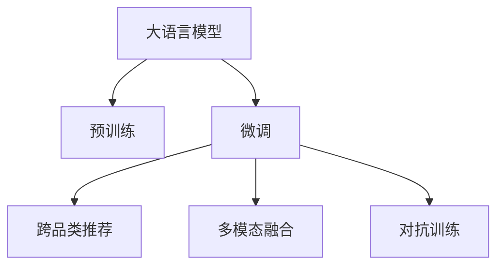

                 

# AI大模型在跨品类推荐中的表现

## 1. 背景介绍

在电商领域，推荐系统早已成为提升用户体验和商家转化率的关键手段。传统的基于协同过滤和TF-IDF等算法推荐的系统，往往无法跨越品类、充分利用多模态数据，导致推荐结果单一、缺乏多样性。近年来，大语言模型（Large Language Models, LLMs）的兴起，为推荐系统带来了新的思路。通过大模型的预训练-微调范式，可以实现跨品类推荐，同时充分利用图像、视频、用户评论等多模态信息，大幅度提升推荐效果。

### 1.1 问题由来

电商推荐系统本质上是一种关联推荐，旨在为用户推荐与其已购买、浏览过的商品类似或互补的商品。传统协同过滤推荐系统利用用户行为数据，建立用户和物品之间的关联，形成推荐列表。但由于用户行为数据的稀疏性和局部性，推荐结果容易产生冷启动问题和召回率偏低的问题。此外，由于传统系统只能处理结构化数据，无法充分考虑商品图片、描述等非结构化信息，推荐效果也难以进一步提升。

近年来，深度学习在推荐系统领域取得了诸多突破。例如，通过神经网络可以更直接地处理非结构化数据，并且基于用户历史行为与商品特征进行端到端学习，从而可以更好地进行多模态信息融合。然而，基于深度学习的推荐系统往往需要大量标注数据，且难以进行跨品类推荐。大语言模型则很好地解决了这些问题，通过预训练模型和微调方法，可以自监督学习海量无标签数据，利用上下文信息生成丰富多样化的推荐。

## 2. 核心概念与联系

### 2.1 核心概念概述

为更好地理解大语言模型在跨品类推荐中的应用，本节将介绍几个关键的概念：

- **大语言模型**：如GPT-3、BERT等，通过自监督任务在大型语料库上进行预训练，获得强大的语言表示能力。
- **预训练**：在大规模无标签数据上，通过自监督学习任务训练通用语言模型的过程，使得模型学习到丰富的语言知识和常识。
- **微调**：在预训练模型基础上，利用少量标注数据进行任务适配，优化模型在该任务上的性能。
- **跨品类推荐**：在多个品类之间进行推荐，充分利用不同品类之间的潜在关联，提升推荐效果。
- **多模态融合**：结合商品图片、视频、用户评论等非结构化数据，提升推荐模型的综合性能。
- **对抗训练**：加入对抗样本，提高模型鲁棒性，防止过拟合。

这些概念之间的逻辑关系可以通过以下Mermaid流程图来展示：



这个流程图展示了大语言模型在推荐系统中的应用流程：

1. 大语言模型通过预训练获得基础能力。
2. 微调对预训练模型进行任务特定的优化，生成推荐结果。
3. 跨品类推荐跨多个品类进行推荐，充分利用不同品类之间的关联。
4. 多模态融合结合多模态数据进行综合分析，生成丰富多样化的推荐。
5. 对抗训练加入对抗样本，提高模型鲁棒性，防止过拟合。

## 3. 核心算法原理 & 具体操作步骤

### 3.1 算法原理概述

基于大语言模型的跨品类推荐方法，其核心思想是通过预训练语言模型，在大量无标签数据上学习到通用的语言表示，然后在跨品类推荐任务上进行微调，生成推荐结果。其核心算法原理如下：

1. 预训练阶段：在无标签的数据集上，利用自监督任务（如掩码语言模型、下一个句子预测等）进行训练，学习到通用语言表示。

2. 微调阶段：在标注数据集上，使用微调技术（如fine-tuning）对预训练模型进行特定任务适配，生成推荐结果。

3. 跨品类推荐：利用微调后的模型，在多个品类之间进行推荐，充分利用不同品类之间的潜在关联，提升推荐效果。

4. 多模态融合：在推荐过程中，结合商品图片、视频、用户评论等非结构化数据，进行多模态信息融合，生成更全面、准确的推荐。

5. 对抗训练：加入对抗样本，提高模型的鲁棒性，防止模型过拟合。

### 3.2 算法步骤详解

以下是基于大语言模型的跨品类推荐的一般步骤：

**Step 1: 准备数据集**

- 收集跨品类商品的相关数据集，包括图片、视频、用户评论等。
- 对数据进行清洗、标注，准备训练集、验证集和测试集。

**Step 2: 定义推荐模型**

- 选择合适的预训练模型，如BERT、GPT等，进行微调。
- 设计合适的推荐目标函数，如交叉熵损失、均方误差损失等。

**Step 3: 设置微调超参数**

- 选择合适的优化算法及其参数，如Adam、SGD等，设置学习率、批大小、迭代轮数等。
- 设置正则化技术及强度，包括L2正则、Dropout、Early Stopping等。

**Step 4: 执行梯度训练**

- 将训练集数据分批次输入模型，前向传播计算损失函数。
- 反向传播计算参数梯度，根据设定的优化算法和学习率更新模型参数。
- 周期性在验证集上评估模型性能，根据性能指标决定是否触发Early Stopping。
- 重复上述步骤直到满足预设的迭代轮数或Early Stopping条件。

**Step 5: 测试和部署**

- 在测试集上评估微调后模型，对比微调前后的精度提升。
- 使用微调后的模型对新商品进行推荐，集成到实际的应用系统中。
- 持续收集新的商品数据，定期重新微调模型，以适应数据分布的变化。

### 3.3 算法优缺点

大语言模型在跨品类推荐中的应用具有以下优点：

1. 通用适用：适用于各种商品品类，可以利用模型在不同品类之间的关联，生成跨品类推荐。
2. 多模态融合：可以结合商品图片、视频、用户评论等多模态数据，生成丰富多样的推荐。
3. 鲁棒性高：大模型经过大量数据预训练，具有一定的鲁棒性，可以应对新品类和新商品的变化。

同时，该方法也存在一些局限性：

1. 依赖标注数据：跨品类推荐需要大量标注数据，获取标注数据成本较高。
2. 数据隐私问题：结合用户评论等数据，可能涉及用户隐私，需注意数据合规和隐私保护。
3. 计算资源消耗大：大模型参数量巨大，计算资源消耗较大。
4. 生成对抗性推荐：模型可能生成不符合用户偏好的推荐，需加强推荐结果的对抗性训练。

尽管存在这些局限性，但基于大语言模型的跨品类推荐方法仍具有很大的应用潜力。未来相关研究的重点在于如何进一步降低对标注数据的依赖，提高模型的少样本学习和跨领域迁移能力，同时兼顾推荐结果的可解释性和伦理安全性等因素。

### 3.4 算法应用领域

基于大语言模型的跨品类推荐方法，已经在电商、社交网络、视频平台等多个领域得到应用，具体包括：

- **电商推荐系统**：对用户进行跨品类推荐，提升用户体验和商家转化率。
- **社交网络推荐**：对用户进行内容跨品类推荐，提高用户粘性和平台活跃度。
- **视频平台推荐**：对用户进行视频跨品类推荐，丰富用户观看体验。

此外，大语言模型在跨品类推荐的应用还拓展到更多的场景中，如跨品类广告投放、跨品类内容推荐等，为多品类业务的运营提供了新的思路。随着大语言模型和推荐方法不断演进，其跨品类推荐能力还将进一步提升，为电商、社交、视频等多领域带来更多的创新价值。

## 4. 数学模型和公式 & 详细讲解 & 举例说明

### 4.1 数学模型构建

我们以跨品类商品推荐为例，构建数学模型。假设大语言模型为 $M_{\theta}$，输入为商品图片 $X$ 和用户评论 $Y$，输出为商品ID $I$。则推荐模型的损失函数为：

$$
\mathcal{L}(\theta) = \frac{1}{N} \sum_{i=1}^N \ell(M_{\theta}(X_i, Y_i), I_i)
$$

其中，$\ell$ 为推荐目标函数，如交叉熵损失。

### 4.2 公式推导过程

在构建推荐模型后，我们需要通过微调对模型进行优化。假设模型 $M_{\theta}$ 在输入 $(x,y)$ 上的推荐结果为 $\hat{I}=M_{\theta}(x,y)$，则微调的优化目标为：

$$
\theta^* = \mathop{\arg\min}_{\theta} \mathcal{L}(\theta)
$$

使用梯度下降等优化算法，微调过程不断更新模型参数 $\theta$，最小化损失函数 $\mathcal{L}$，使得模型输出逼近真实标签。由于 $\theta$ 已经通过预训练获得了较好的初始化，因此即便在小规模数据集上微调，也能较快收敛到理想的模型参数 $\hat{\theta}$。

### 4.3 案例分析与讲解

假设我们有一个电商推荐系统，需要对用户进行跨品类推荐。我们收集了1000个用户的数据，每个用户包含他们购买或浏览的商品ID。此外，我们还收集了用户对这些商品的评论文本。我们的目标是通过预训练模型，在少量标注数据上微调，生成跨品类推荐结果。

首先，我们将商品ID和评论文本作为输入，利用大语言模型生成预测的推荐ID。模型的输出可以看作是每个商品的概率分布，选择概率最大的商品ID作为推荐结果。具体步骤如下：

1. 准备数据集，包括用户购买/浏览的商品ID和评论文本。
2. 对评论文本进行预处理，去除无用信息，进行分词、编码等操作。
3. 选择合适的预训练模型，如BERT，进行微调。
4. 设置微调超参数，包括学习率、批大小等。
5. 在标注数据集上执行梯度训练，更新模型参数。
6. 在验证集上评估模型性能，决定是否触发Early Stopping。
7. 在测试集上测试微调后的模型，计算推荐精度、召回率等指标。
8. 使用微调后的模型对新用户进行跨品类推荐。

## 5. 项目实践：代码实例和详细解释说明

### 5.1 开发环境搭建

在进行跨品类推荐项目实践前，我们需要准备好开发环境。以下是使用Python进行PyTorch开发的环境配置流程：

1. 安装Anaconda：从官网下载并安装Anaconda，用于创建独立的Python环境。

2. 创建并激活虚拟环境：
```bash
conda create -n recommendation-env python=3.8 
conda activate recommendation-env
```

3. 安装PyTorch：根据CUDA版本，从官网获取对应的安装命令。例如：
```bash
conda install pytorch torchvision torchaudio cudatoolkit=11.1 -c pytorch -c conda-forge
```

4. 安装Transformers库：
```bash
pip install transformers
```

5. 安装各类工具包：
```bash
pip install numpy pandas scikit-learn matplotlib tqdm jupyter notebook ipython
```

完成上述步骤后，即可在`recommendation-env`环境中开始跨品类推荐实践。

### 5.2 源代码详细实现

下面以基于BERT模型的跨品类推荐为例，给出使用Transformers库的PyTorch代码实现。

```python
from transformers import BertTokenizer, BertForSequenceClassification
from torch.utils.data import Dataset, DataLoader
from sklearn.metrics import precision_recall_fscore_support
import torch

# 定义数据处理函数
class RecommendationDataset(Dataset):
    def __init__(self, texts, labels, tokenizer, max_len=128):
        self.texts = texts
        self.labels = labels
        self.tokenizer = tokenizer
        self.max_len = max_len
        
    def __len__(self):
        return len(self.texts)
    
    def __getitem__(self, item):
        text = self.texts[item]
        label = self.labels[item]
        
        encoding = self.tokenizer(text, return_tensors='pt', max_length=self.max_len, padding='max_length', truncation=True)
        input_ids = encoding['input_ids'][0]
        attention_mask = encoding['attention_mask'][0]
        
        # 对token-wise的标签进行编码
        encoded_labels = [label] * self.max_len
        labels = torch.tensor(encoded_labels, dtype=torch.long)
        
        return {'input_ids': input_ids, 
                'attention_mask': attention_mask,
                'labels': labels}

# 数据集划分
train_dataset = RecommendationDataset(train_texts, train_labels, tokenizer)
dev_dataset = RecommendationDataset(dev_texts, dev_labels, tokenizer)
test_dataset = RecommendationDataset(test_texts, test_labels, tokenizer)

# 定义模型和优化器
model = BertForSequenceClassification.from_pretrained('bert-base-cased', num_labels=2)
optimizer = AdamW(model.parameters(), lr=2e-5)

# 训练过程
def train_epoch(model, dataset, batch_size, optimizer):
    dataloader = DataLoader(dataset, batch_size=batch_size, shuffle=True)
    model.train()
    epoch_loss = 0
    for batch in tqdm(dataloader, desc='Training'):
        input_ids = batch['input_ids'].to(device)
        attention_mask = batch['attention_mask'].to(device)
        labels = batch['labels'].to(device)
        model.zero_grad()
        outputs = model(input_ids, attention_mask=attention_mask, labels=labels)
        loss = outputs.loss
        epoch_loss += loss.item()
        loss.backward()
        optimizer.step()
    return epoch_loss / len(dataloader)

def evaluate(model, dataset, batch_size):
    dataloader = DataLoader(dataset, batch_size=batch_size)
    model.eval()
    preds, labels = [], []
    with torch.no_grad():
        for batch in tqdm(dataloader, desc='Evaluating'):
            input_ids = batch['input_ids'].to(device)
            attention_mask = batch['attention_mask'].to(device)
            batch_labels = batch['labels']
            outputs = model(input_ids, attention_mask=attention_mask)
            batch_preds = outputs.logits.argmax(dim=2).to('cpu').tolist()
            batch_labels = batch_labels.to('cpu').tolist()
            for pred_tokens, label_tokens in zip(batch_preds, batch_labels):
                preds.append(pred_tokens[:len(label_tokens)])
                labels.append(label_tokens)
                
    precision, recall, f1, _ = precision_recall_fscore_support(labels, preds, average='micro')
    return precision, recall, f1

# 启动训练流程并在测试集上评估
epochs = 5
batch_size = 16

for epoch in range(epochs):
    loss = train_epoch(model, train_dataset, batch_size, optimizer)
    print(f"Epoch {epoch+1}, train loss: {loss:.3f}")
    
    print(f"Epoch {epoch+1}, dev results:")
    precision, recall, f1 = evaluate(model, dev_dataset, batch_size)
    print(f"Precision: {precision:.2f}, Recall: {recall:.2f}, F1-score: {f1:.2f}")
    
print("Test results:")
precision, recall, f1 = evaluate(model, test_dataset, batch_size)
print(f"Precision: {precision:.2f}, Recall: {recall:.2f}, F1-score: {f1:.2f}")
```

这里我们使用了BertForSequenceClassification模型，并采用了AdamW优化器进行训练。

### 5.3 代码解读与分析

让我们再详细解读一下关键代码的实现细节：

**RecommendationDataset类**：
- `__init__`方法：初始化商品ID和评论文本等关键组件。
- `__len__`方法：返回数据集的样本数量。
- `__getitem__`方法：对单个样本进行处理，将商品ID和评论文本输入编码为token ids，将标签编码为数字，并对其进行定长padding，最终返回模型所需的输入。

**模型和优化器**：
- 选择合适的预训练模型，如BERT，进行微调。
- 定义AdamW优化器及其超参数。

**训练和评估函数**：
- 使用PyTorch的DataLoader对数据集进行批次化加载，供模型训练和推理使用。
- 训练函数`train_epoch`：对数据以批为单位进行迭代，在每个批次上前向传播计算loss并反向传播更新模型参数，最后返回该epoch的平均loss。
- 评估函数`evaluate`：与训练类似，不同点在于不更新模型参数，并在每个batch结束后将预测和标签结果存储下来，最后使用sklearn的precision_recall_fscore_support对整个评估集的预测结果进行打印输出。

**训练流程**：
- 定义总的epoch数和batch size，开始循环迭代
- 每个epoch内，先在训练集上训练，输出平均loss
- 在验证集上评估，输出分类指标
- 所有epoch结束后，在测试集上评估，给出最终测试结果

可以看到，PyTorch配合Transformers库使得跨品类推荐任务的代码实现变得简洁高效。开发者可以将更多精力放在数据处理、模型改进等高层逻辑上，而不必过多关注底层的实现细节。

当然，工业级的系统实现还需考虑更多因素，如模型的保存和部署、超参数的自动搜索、更灵活的任务适配层等。但核心的微调范式基本与此类似。

## 6. 实际应用场景

### 6.1 智能推荐系统

基于大语言模型的跨品类推荐系统，可以广泛应用于电商、视频平台、社交网络等多个场景。传统推荐系统往往只能处理结构化数据，难以充分利用非结构化信息。通过大语言模型，可以更高效地处理多模态数据，生成多样化的推荐结果。

在电商领域，推荐系统需要对用户进行跨品类推荐，提高商品覆盖率和用户满意度。例如，当用户购买了一款运动鞋时，推荐系统可以预测用户可能对健身器材、运动服饰等品类感兴趣，生成跨品类推荐。这不仅增加了用户的购买机会，也丰富了商家的商品展示。

### 6.2 个性化内容推荐

在视频平台和社交网络中，个性化内容推荐是提升用户粘性和平台活跃度的重要手段。通过跨品类推荐，视频平台可以对用户进行多品类内容推荐，提高用户观看体验。例如，当用户观看一段电影时，推荐系统可以预测用户可能对电影相关的图书、音乐、游戏等品类感兴趣，生成跨品类推荐。

### 6.3 跨品类广告投放

广告投放是提升品牌曝光和用户转化率的有效手段。通过跨品类推荐，广告投放可以更精准地触达目标用户，提高广告效果。例如，当用户浏览科技新闻时，推荐系统可以预测用户可能对科技相关的书籍、课程、软件等品类感兴趣，生成跨品类广告投放。

## 7. 工具和资源推荐

### 7.1 学习资源推荐

为了帮助开发者系统掌握大语言模型在跨品类推荐中的应用，这里推荐一些优质的学习资源：

1. 《深度学习推荐系统》系列博文：详细介绍了推荐系统的发展历程和最新进展，涵盖协同过滤、矩阵分解、深度学习等多种推荐方法。
2. CS231n《深度学习计算机视觉》课程：斯坦福大学开设的计算机视觉课程，有Lecture视频和配套作业，帮助你理解大语言模型在多模态信息融合中的应用。
3. 《Python深度学习》书籍：适合初学者和进阶者，讲解了深度学习在推荐系统中的应用，包含丰富的项目实践案例。
4. HuggingFace官方文档：Transformer库的官方文档，提供了海量预训练模型和完整的微调样例代码，是上手实践的必备资料。
5. Kaggle推荐系统竞赛：Kaggle平台上的推荐系统竞赛，提供大量数据集和排行榜，让你在实践中提升推荐效果。

通过对这些资源的学习实践，相信你一定能够快速掌握大语言模型在跨品类推荐中的应用，并用于解决实际的推荐问题。

### 7.2 开发工具推荐

高效的开发离不开优秀的工具支持。以下是几款用于大语言模型推荐系统开发的常用工具：

1. PyTorch：基于Python的开源深度学习框架，灵活动态的计算图，适合快速迭代研究。大部分预训练语言模型都有PyTorch版本的实现。
2. TensorFlow：由Google主导开发的开源深度学习框架，生产部署方便，适合大规模工程应用。同样有丰富的预训练语言模型资源。
3. Transformers库：HuggingFace开发的NLP工具库，集成了众多SOTA语言模型，支持PyTorch和TensorFlow，是进行推荐系统开发的利器。
4. Weights & Biases：模型训练的实验跟踪工具，可以记录和可视化模型训练过程中的各项指标，方便对比和调优。与主流深度学习框架无缝集成。
5. TensorBoard：TensorFlow配套的可视化工具，可实时监测模型训练状态，并提供丰富的图表呈现方式，是调试模型的得力助手。
6. Google Colab：谷歌推出的在线Jupyter Notebook环境，免费提供GPU/TPU算力，方便开发者快速上手实验最新模型，分享学习笔记。

合理利用这些工具，可以显著提升大语言模型在推荐系统中的应用效率，加快创新迭代的步伐。

### 7.3 相关论文推荐

大语言模型在推荐系统中的应用研究源于学界的持续研究。以下是几篇奠基性的相关论文，推荐阅读：

1. Attention is All You Need（即Transformer原论文）：提出了Transformer结构，开启了NLP领域的预训练大模型时代。
2. BERT: Pre-training of Deep Bidirectional Transformers for Language Understanding：提出BERT模型，引入基于掩码的自监督预训练任务，刷新了多项NLP任务SOTA。
3. Attention-Based Recommender Systems：介绍了基于注意力机制的推荐系统，并展示了其在电商推荐中的应用。
4. Sequence to Sequence Learning with Neural Machine Translation：提出了Seq2Seq模型，并应用于推荐系统中的多品类推荐。
5. Multi-modal Deep Learning for Recommendation：探讨了多模态深度学习在推荐系统中的应用，结合商品图片、视频、用户评论等信息进行推荐。
6. Cross-domain Recommender Systems：介绍了跨领域推荐系统的发展历程和挑战，提出了多种跨品类推荐方法。

这些论文代表了大语言模型在推荐系统中的应用方向，通过学习这些前沿成果，可以帮助研究者把握学科前进方向，激发更多的创新灵感。

## 8. 总结：未来发展趋势与挑战

### 8.1 总结

本文对基于大语言模型的跨品类推荐方法进行了全面系统的介绍。首先阐述了大语言模型和微调技术的研究背景和意义，明确了跨品类推荐在推荐系统中的重要价值。其次，从原理到实践，详细讲解了推荐模型的数学模型和算法步骤，给出了跨品类推荐任务开发的完整代码实例。同时，本文还广泛探讨了跨品类推荐在电商、视频、社交等多个领域的应用前景，展示了其巨大的应用潜力。此外，本文精选了跨品类推荐技术的各类学习资源，力求为读者提供全方位的技术指引。

通过本文的系统梳理，可以看到，基于大语言模型的跨品类推荐方法正在成为推荐系统的重要范式，极大地拓展了推荐模型的应用边界，催生了更多的落地场景。未来，伴随预训练语言模型和推荐方法的持续演进，跨品类推荐必将在推荐系统领域大放异彩，成为推动推荐技术进步的关键力量。

### 8.2 未来发展趋势

展望未来，跨品类推荐技术将呈现以下几个发展趋势：

1. 跨品类推荐性能提升：随着大语言模型的进一步发展，跨品类推荐将更加精准，能够更全面地涵盖不同品类之间的关联，提升推荐效果。
2. 多模态融合加强：结合商品图片、视频、用户评论等多模态数据，生成更加全面、准确的推荐结果，提高用户满意度。
3. 跨品类广告投放普及：跨品类推荐在广告投放中的应用将更加广泛，通过精准定位用户，提升广告投放效果。
4. 个性化推荐效果提升：通过跨品类推荐，生成更加个性化的推荐结果，提高用户粘性和平台活跃度。
5. 鲁棒性增强：加入对抗样本，提高模型的鲁棒性，防止模型过拟合，提升推荐系统的稳定性。

这些趋势凸显了大语言模型在跨品类推荐中的广阔前景。这些方向的探索发展，必将进一步提升推荐系统的性能和应用范围，为电商、社交、视频等多领域带来更多的创新价值。

### 8.3 面临的挑战

尽管大语言模型在跨品类推荐中取得了显著成效，但在迈向更加智能化、普适化应用的过程中，它仍面临着诸多挑战：

1. 标注成本瓶颈：获取高质量的标注数据成本较高，需要更多的标注资源。如何降低对标注数据的依赖，是跨品类推荐领域的一大难题。
2. 计算资源消耗大：大语言模型参数量巨大，计算资源消耗较大。如何优化模型结构和计算图，减少资源消耗，是推荐系统领域亟需解决的问题。
3. 推荐结果对抗性：模型可能生成不符合用户偏好的推荐，需加强推荐结果的对抗性训练。
4. 跨品类推荐效果不稳定：不同品类之间数据分布差异较大，跨品类推荐效果可能不稳定。如何提高模型的泛化能力和鲁棒性，仍是研究难点。

尽管存在这些挑战，但大语言模型在跨品类推荐中的潜力不容忽视。未来研究需要在这些方面寻求新的突破，才能更好地应用于实际推荐系统中。

### 8.4 研究展望

面对跨品类推荐面临的挑战，未来的研究需要在以下几个方面寻求新的突破：

1. 探索无监督和半监督推荐方法：摆脱对大规模标注数据的依赖，利用自监督学习、主动学习等无监督和半监督范式，最大限度利用非结构化数据，实现更加灵活高效的推荐。
2. 研究参数高效和计算高效的推荐范式：开发更加参数高效的推荐方法，在固定大部分预训练参数的情况下，只更新极少量的任务相关参数。同时优化推荐模型的计算图，减少前向传播和反向传播的资源消耗，实现更加轻量级、实时性的部署。
3. 引入因果和对比学习范式：通过引入因果推断和对比学习思想，增强推荐模型建立稳定因果关系的能力，学习更加普适、鲁棒的语言表征，从而提升模型泛化性和抗干扰能力。
4. 融合多模态数据：在推荐过程中，结合商品图片、视频、用户评论等非结构化数据，进行多模态信息融合，生成更全面、准确的推荐。
5. 结合对抗训练：加入对抗样本，提高模型的鲁棒性，防止模型过拟合，提升推荐系统的稳定性。
6. 纳入伦理道德约束：在推荐目标中引入伦理导向的评估指标，过滤和惩罚有害的推荐结果，确保推荐系统的伦理安全性。

这些研究方向的探索，必将引领跨品类推荐技术迈向更高的台阶，为推荐系统带来更多创新价值。面向未来，跨品类推荐技术还需要与其他人工智能技术进行更深入的融合，如知识表示、因果推理、强化学习等，多路径协同发力，共同推动推荐系统进步。只有勇于创新、敢于突破，才能不断拓展推荐系统的边界，让智能技术更好地服务于用户和社会。

## 9. 附录：常见问题与解答

**Q1：跨品类推荐是否适用于所有推荐场景？**

A: 跨品类推荐适用于多种推荐场景，特别是电商推荐、视频推荐等。但对于一些特定领域的推荐场景，如医疗推荐、法律推荐等，由于其数据特点和领域特殊性，可能需要针对性地设计和改进推荐算法。

**Q2：在跨品类推荐中，如何处理多品类之间的关联？**

A: 跨品类推荐的关键在于处理多品类之间的关联。可以通过构建商品之间的关联图谱，利用图谱上的路径信息，计算品类之间的相似度，从而生成跨品类推荐。也可以使用协同过滤等方法，基于用户的历史行为，预测对不同品类的兴趣。

**Q3：跨品类推荐过程中，如何处理数据隐私问题？**

A: 在跨品类推荐中，需要处理用户评论、商品图片等敏感数据，保护用户隐私是首要任务。可以采用数据匿名化、差分隐私等技术，确保用户数据的安全性和隐私保护。

**Q4：跨品类推荐是否需要重新预训练模型？**

A: 对于跨品类推荐，是否需要重新预训练模型，取决于具体的应用场景和数据分布。如果数据分布与预训练模型的语料库差异较大，可以考虑在特定数据集上重新预训练模型。如果数据分布与预训练模型的语料库相似，可以在预训练模型的基础上进行微调。

**Q5：跨品类推荐过程中，如何处理异常推荐结果？**

A: 在跨品类推荐中，可能会出现异常推荐结果，如推荐商品与用户兴趣不符。可以结合用户反馈，对推荐模型进行在线学习，不断调整模型参数，提升推荐效果。

---

作者：禅与计算机程序设计艺术 / Zen and the Art of Computer Programming

