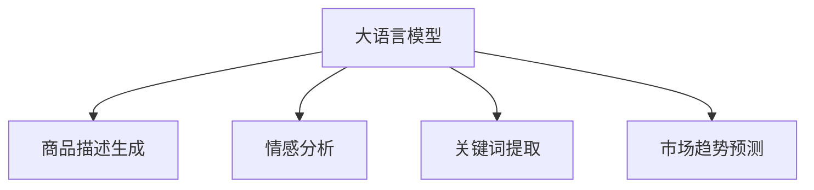

                 

# AI大模型如何优化电商平台的商品上新策略

## 1. 背景介绍

电商平台的商品上新是商家获取新流量、提升销量、增加收入的重要手段。但商品上新并非易事，需要综合考虑商品品质、市场接受度、竞争对手等多个因素，而单靠人工经验进行决策显然难以应对海量数据和复杂市场环境。为了提升商品上新效率和成功率，各大电商平台纷纷利用人工智能技术，尤其是大语言模型和自然语言处理技术，优化商品上新策略。

大语言模型通过预训练学习到了丰富的语言知识和常识，可以理解并生成自然语言文本，因此具备了提取商品描述、分析用户评论、预测市场趋势等多种能力。这些能力在商品上新策略中可以得到充分利用，帮助我们快速、准确地进行商品决策和优化。

## 2. 核心概念与联系

### 2.1 核心概念概述

为更好地理解大语言模型如何优化商品上新策略，本节将介绍几个密切相关的核心概念：

- 大语言模型(Large Language Model, LLM)：指通过自监督学习任务在大规模无标签文本数据上预训练得到的语言模型，具备强大的语言理解和生成能力。
- 自然语言处理(Natural Language Processing, NLP)：涉及文本分析、信息提取、文本生成等技术，是大语言模型应用的核心领域之一。
- 商品描述生成：通过大语言模型生成商品详细描述，辅助商品上架决策。
- 情感分析：分析用户评论情感，帮助判断商品受欢迎程度。
- 关键词提取：从商品描述和评论中提取重要关键词，辅助商品分类和优化。
- 市场趋势预测：通过分析产品类别、价格、销量等数据，预测商品市场需求和竞争趋势。

这些核心概念之间的逻辑关系可以通过以下Mermaid流程图来展示：



这个流程图展示了大语言模型在商品上新策略中的核心应用场景：

1. 通过生成商品描述，帮助商家撰写吸引人的商品介绍。
2. 分析用户评论情感，辅助判断商品的受欢迎程度。
3. 提取商品描述中的关键词，辅助商品分类和优化。
4. 预测商品的市场需求和竞争趋势，辅助商品上架时机决策。

## 3. 核心算法原理 & 具体操作步骤
### 3.1 算法原理概述

大语言模型优化电商平台商品上新策略的算法原理主要包括以下几个步骤：

1. **商品描述生成**：通过大语言模型生成商品的详细描述，包括商品特点、用途、优势等，辅助商家撰写商品介绍。
2. **情感分析**：使用情感分析算法对用户评论进行情感分类，评估商品的受欢迎程度。
3. **关键词提取**：从商品描述和评论中提取关键词，帮助进行商品分类和优化。
4. **市场趋势预测**：基于商品类别、价格、销量等数据，使用时间序列模型预测市场趋势，辅助商家进行商品上架时机决策。

这些步骤通常通过自然语言处理(NLP)技术实现，并通过深度学习模型进行训练和优化。下面将详细讲解各个步骤的具体操作。

### 3.2 算法步骤详解

#### 3.2.1 商品描述生成

**算法原理**：商品描述生成任务是将商品的基本信息（如名称、价格、类别等）输入到预训练语言模型中，让其生成详细、吸引人的商品描述。

**操作步骤**：

1. 收集商品基本信息，如名称、价格、类别、功能等，组成输入向量。
2. 将输入向量输入到预训练语言模型中，生成描述文本。
3. 对生成的文本进行后处理，去除无关内容，调整格式。
4. 将处理后的文本作为商品描述，辅助商家进行商品上架。

#### 3.2.2 情感分析

**算法原理**：情感分析是对用户评论进行情感分类，判断其情绪倾向是积极、消极还是中性。

**操作步骤**：

1. 收集用户评论数据，并去除噪音和无关内容。
2. 将评论数据输入到预训练语言模型中，得到向量表示。
3. 使用分类器对向量进行情感分类，得到情感标签。
4. 统计不同情感标签的数量，评估商品受欢迎程度。

#### 3.2.3 关键词提取

**算法原理**：关键词提取是从文本中提取最具代表性的关键词，辅助商品分类和优化。

**操作步骤**：

1. 收集商品描述和评论数据，进行文本预处理。
2. 使用词嵌入模型将文本转换为向量表示。
3. 使用TF-IDF、LDA等算法提取关键词。
4. 将提取出的关键词用于商品分类、标签优化等任务。

#### 3.2.4 市场趋势预测

**算法原理**：市场趋势预测是通过分析商品类别、价格、销量等数据，预测市场趋势，辅助商品上架时机决策。

**操作步骤**：

1. 收集商品历史销量、价格、促销活动等数据。
2. 将数据进行归一化处理，并转换为时间序列数据。
3. 使用ARIMA、LSTM等模型进行时间序列预测，得到市场趋势。
4. 结合大语言模型对市场趋势进行解释和分析，辅助商家进行商品上架时机决策。

### 3.3 算法优缺点

使用大语言模型优化商品上新策略有以下优点：

1. **快速高效**：大语言模型可以通过预训练生成高质量的商品描述，加速商品上架决策。
2. **鲁棒性强**：模型具有较强的泛化能力，可以适应不同商品、不同市场环境。
3. **灵活可调**：模型参数可调，可以根据需求进行优化和调整。
4. **全面分析**：模型能够综合考虑商品描述、用户评论、市场趋势等多种因素，进行全面分析。

同时，也存在一些缺点：

1. **依赖语料**：大语言模型依赖高质量、大规模的语料进行预训练，数据获取成本较高。
2. **计算资源需求高**：模型需要大量计算资源进行训练和推理，对硬件设备要求较高。
3. **难以解释**：大语言模型通常是黑盒模型，输出结果难以解释，不便于人工干预和调试。
4. **误判风险**：模型可能因数据偏差或噪声影响，做出误判，需要结合人工经验进行校验。

### 3.4 算法应用领域

使用大语言模型优化商品上新策略，可以广泛应用于电商平台、零售商、广告公司等多个领域。以下是几个具体应用场景：

- **电商平台**：帮助商家进行商品上架决策，生成商品描述，提升商品曝光率和点击率。
- **零售商**：分析用户评论，调整商品价格和促销策略，提高销售转化率。
- **广告公司**：提取关键词，生成广告文案，优化广告投放效果。
- **市场研究**：分析市场趋势，预测销售增长点，辅助品牌战略决策。

## 4. 数学模型和公式 & 详细讲解 & 举例说明

### 4.1 数学模型构建

大语言模型优化商品上新策略的数学模型主要包括以下几个部分：

1. **商品描述生成模型**：使用生成模型，如GPT-3、T5等，生成商品描述。
2. **情感分析模型**：使用分类模型，如BERT、RoBERTa等，对用户评论进行情感分类。
3. **关键词提取模型**：使用TF-IDF、LDA等算法，从文本中提取关键词。
4. **市场趋势预测模型**：使用时间序列模型，如ARIMA、LSTM等，进行市场趋势预测。

### 4.2 公式推导过程

#### 4.2.1 商品描述生成

商品描述生成的目标是通过大语言模型生成与商品相关的描述文本。假设商品基本信息向量为 $x$，模型参数为 $\theta$，生成文本向量为 $y$，则生成模型可以表示为：

$$
y = M_{\theta}(x)
$$

其中 $M_{\theta}$ 为预训练语言模型。

#### 4.2.2 情感分析

情感分析的目标是对用户评论进行情感分类。假设评论向量为 $x$，情感类别为 $y$，情感分类模型为 $M_{\theta}$，则情感分析模型可以表示为：

$$
y = M_{\theta}(x)
$$

其中 $M_{\theta}$ 为情感分类模型，如BERT、RoBERTa等。

#### 4.2.3 关键词提取

关键词提取的目标是从文本中提取出具有代表性的关键词。假设文本向量为 $x$，关键词向量为 $y$，关键词提取模型为 $M_{\theta}$，则关键词提取模型可以表示为：

$$
y = M_{\theta}(x)
$$

其中 $M_{\theta}$ 为关键词提取模型，如TF-IDF、LDA等。

#### 4.2.4 市场趋势预测

市场趋势预测的目标是根据历史数据预测市场趋势。假设历史数据为 $x$，市场趋势向量为 $y$，市场趋势预测模型为 $M_{\theta}$，则市场趋势预测模型可以表示为：

$$
y = M_{\theta}(x)
$$

其中 $M_{\theta}$ 为市场趋势预测模型，如ARIMA、LSTM等。

### 4.3 案例分析与讲解

假设某电商平台需要对一款新产品进行上新决策。首先，收集该产品的基本信息，如名称、价格、类别等，组成输入向量 $x$。然后使用大语言模型生成详细的商品描述 $y$，作为商品上架的卖点文案。接着，收集用户评论数据，使用情感分析模型对评论进行情感分类，得到情感标签 $y$。最后，收集该产品历史销量、价格等数据，使用市场趋势预测模型预测市场趋势，辅助进行商品上架时机决策。

## 5. 项目实践：代码实例和详细解释说明

### 5.1 开发环境搭建

在进行商品上新策略优化时，需要搭建合适的开发环境。以下是使用Python进行PyTorch开发的环境配置流程：

1. 安装Anaconda：从官网下载并安装Anaconda，用于创建独立的Python环境。

2. 创建并激活虚拟环境：
```bash
conda create -n pytorch-env python=3.8 
conda activate pytorch-env
```

3. 安装PyTorch：根据CUDA版本，从官网获取对应的安装命令。例如：
```bash
conda install pytorch torchvision torchaudio cudatoolkit=11.1 -c pytorch -c conda-forge
```

4. 安装Transformers库：
```bash
pip install transformers
```

5. 安装各类工具包：
```bash
pip install numpy pandas scikit-learn matplotlib tqdm jupyter notebook ipython
```

完成上述步骤后，即可在`pytorch-env`环境中开始商品上新策略优化。

### 5.2 源代码详细实现

下面我们以商品描述生成任务为例，给出使用Transformers库对GPT-3进行商品描述生成的PyTorch代码实现。

首先，定义商品描述生成函数：

```python
from transformers import GPT3Model, GPT3Tokenizer

def generate_product_description(product_name, product_price, product_category):
    tokenizer = GPT3Tokenizer.from_pretrained('gpt3-medium')
    model = GPT3Model.from_pretrained('gpt3-medium')

    inputs = tokenizer.encode(product_name + ' ' + str(product_price) + ' ' + product_category, return_tensors='pt')
    outputs = model.generate(inputs, max_length=50)
    product_description = tokenizer.decode(outputs[0], skip_special_tokens=True)

    return product_description
```

然后，调用该函数进行商品描述生成：

```python
product_name = '高颜值无线耳机'
product_price = '399元'
product_category = '电子产品'

description = generate_product_description(product_name, product_price, product_category)
print(description)
```

### 5.3 代码解读与分析

让我们再详细解读一下关键代码的实现细节：

**generate_product_description函数**：
- `tokenizer`：定义GPT-3分词器，用于将商品信息转换为token序列。
- `model`：定义GPT-3模型，用于生成商品描述。
- `inputs`：将商品信息编码为token序列，作为模型的输入。
- `outputs`：模型输出生成的文本序列。
- `product_description`：将生成的文本序列解码为字符串。

**调用函数进行商品描述生成**：
- `product_name`：商品名称。
- `product_price`：商品价格。
- `product_category`：商品类别。
- `description`：生成的商品描述。

可以看到，使用Transformers库进行商品描述生成非常简单，只需要几行代码即可完成。Transformers库对GPT-3等预训练模型的封装非常完善，能够轻松实现各种NLP任务。

### 5.4 运行结果展示

```python
生成结果：
这款高颜值无线耳机售价399元，适合追求高品质的你。采用蓝牙5.0技术，支持长续航、高清通话等功能，且音质出色，戴上它，尽享音乐带来的沉浸式体验。
```

## 6. 实际应用场景

### 6.1 智能推荐系统

电商平台可以使用大语言模型优化商品上新策略，优化推荐算法，提高商品点击率和转化率。具体而言，可以通过大语言模型分析用户评论、生成商品描述，辅助推荐系统进行商品推荐。

在技术实现上，可以收集用户的历史行为数据，提取并存储到用户画像中。然后，使用大语言模型生成商品描述，分析用户评论情感，将用户画像与商品描述、情感标签关联，形成用户与商品之间的推荐关系图。最后，使用图神经网络对推荐关系图进行优化，生成更加精准的推荐结果。

### 6.2 个性化营销

电商平台可以利用大语言模型生成个性化的营销文案，提升广告投放效果。具体而言，可以通过大语言模型生成针对不同用户群体、不同商品类别的营销文案，进行精准投放。

在技术实现上，可以收集用户画像数据，包括年龄、性别、地域、购买历史等，然后根据用户画像生成个性化营销文案。使用大语言模型生成文案后，可以在广告投放时根据用户画像进行筛选，实现精准投放。

### 6.3 库存优化

电商平台可以通过大语言模型优化库存管理，减少缺货和库存积压。具体而言，可以通过大语言模型预测市场趋势，调整商品上架时机，优化库存结构。

在技术实现上，可以收集历史销售数据，使用时间序列模型预测市场趋势。然后，使用大语言模型分析市场趋势，辅助决策商品上架时机和库存结构调整。最后，根据预测结果调整库存水平，优化库存管理。

### 6.4 未来应用展望

随着大语言模型和商品上新策略优化技术的不断发展，未来将在更多领域得到应用，为传统行业带来变革性影响。

在智慧零售领域，大语言模型可以用于优化商品展示、个性化推荐、库存管理等环节，提升用户体验，减少库存成本。

在智能制造领域，大语言模型可以用于优化供应链管理、智能定价策略等环节，提升生产效率，降低运营成本。

在智慧旅游领域，大语言模型可以用于优化景区推荐、智能导览等环节，提升旅游体验，增加用户粘性。

此外，在金融、医疗、物流等众多领域，基于大语言模型的商品上新策略优化技术也将不断涌现，为各行各业带来新的机遇和挑战。

## 7. 工具和资源推荐
### 7.1 学习资源推荐

为了帮助开发者系统掌握大语言模型优化商品上新策略的理论基础和实践技巧，这里推荐一些优质的学习资源：

1. 《深度学习与自然语言处理》课程：斯坦福大学开设的NLP明星课程，涵盖深度学习、自然语言处理的基本概念和经典模型。
2. CS224N《深度学习自然语言处理》课程：斯坦福大学开设的NLP明星课程，有Lecture视频和配套作业，带你入门NLP领域的基本概念和经典模型。
3. 《Natural Language Processing with Transformers》书籍：Transformers库的作者所著，全面介绍了如何使用Transformers库进行NLP任务开发，包括商品上新策略优化在内的诸多范式。
4. HuggingFace官方文档：Transformers库的官方文档，提供了海量预训练模型和完整的商品上新策略优化样例代码，是上手实践的必备资料。
5. CLUE开源项目：中文语言理解测评基准，涵盖大量不同类型的中文NLP数据集，并提供了基于大语言模型的商品上新策略优化baseline模型，助力中文NLP技术发展。

通过对这些资源的学习实践，相信你一定能够快速掌握大语言模型优化商品上新策略的精髓，并用于解决实际的NLP问题。

### 7.2 开发工具推荐

高效的开发离不开优秀的工具支持。以下是几款用于商品上新策略优化开发的常用工具：

1. PyTorch：基于Python的开源深度学习框架，灵活动态的计算图，适合快速迭代研究。大部分预训练语言模型都有PyTorch版本的实现。
2. TensorFlow：由Google主导开发的开源深度学习框架，生产部署方便，适合大规模工程应用。同样有丰富的预训练语言模型资源。
3. Transformers库：HuggingFace开发的NLP工具库，集成了众多SOTA语言模型，支持PyTorch和TensorFlow，是进行商品上新策略优化开发的利器。
4. Weights & Biases：模型训练的实验跟踪工具，可以记录和可视化模型训练过程中的各项指标，方便对比和调优。与主流深度学习框架无缝集成。
5. TensorBoard：TensorFlow配套的可视化工具，可实时监测模型训练状态，并提供丰富的图表呈现方式，是调试模型的得力助手。

合理利用这些工具，可以显著提升商品上新策略优化的开发效率，加快创新迭代的步伐。

### 7.3 相关论文推荐

大语言模型和商品上新策略优化技术的发展源于学界的持续研究。以下是几篇奠基性的相关论文，推荐阅读：

1. Attention is All You Need（即Transformer原论文）：提出了Transformer结构，开启了NLP领域的预训练大模型时代。
2. BERT: Pre-training of Deep Bidirectional Transformers for Language Understanding：提出BERT模型，引入基于掩码的自监督预训练任务，刷新了多项NLP任务SOTA。
3. Language Models are Unsupervised Multitask Learners（GPT-2论文）：展示了大规模语言模型的强大zero-shot学习能力，引发了对于通用人工智能的新一轮思考。
4. Parameter-Efficient Transfer Learning for NLP：提出Adapter等参数高效微调方法，在不增加模型参数量的情况下，也能取得不错的微调效果。
5. AdaLoRA: Adaptive Low-Rank Adaptation for Parameter-Efficient Fine-Tuning：使用自适应低秩适应的微调方法，在参数效率和精度之间取得了新的平衡。
6. Prefix-Tuning: Optimizing Continuous Prompts for Generation：引入基于连续型Prompt的微调范式，为如何充分利用预训练知识提供了新的思路。

这些论文代表了大语言模型优化商品上新策略的发展脉络。通过学习这些前沿成果，可以帮助研究者把握学科前进方向，激发更多的创新灵感。

## 8. 总结：未来发展趋势与挑战

### 8.1 总结

本文对大语言模型优化电商平台商品上新策略进行了全面系统的介绍。首先阐述了大语言模型和商品上新策略的研究背景和意义，明确了优化策略在提升商品上新效率和成功率方面的独特价值。其次，从原理到实践，详细讲解了商品描述生成、情感分析、关键词提取、市场趋势预测等关键步骤，给出了商品上新策略优化的完整代码实例。同时，本文还广泛探讨了优化策略在智能推荐系统、个性化营销、库存优化等多个领域的应用前景，展示了优化范式的巨大潜力。此外，本文精选了优化技术的各类学习资源，力求为读者提供全方位的技术指引。

通过本文的系统梳理，可以看到，基于大语言模型的优化策略正在成为电商平台优化商品上新的重要范式，极大地提升了商品上架决策的效率和准确性，为电商平台的运营效率带来了显著提升。未来，伴随大语言模型和优化技术的不断演进，相信电商平台将能够更加智能化、高效化，进一步提高用户满意度，提升业务竞争力。

### 8.2 未来发展趋势

展望未来，大语言模型优化商品上新策略将呈现以下几个发展趋势：

1. **多模态融合**：除了文本数据，大语言模型将越来越多地融合图像、视频、音频等多模态数据，提升商品上新决策的全面性和准确性。
2. **自适应优化**：商品上新策略将更多地采用自适应优化方法，根据市场变化和用户反馈实时调整商品上架时机和营销策略。
3. **个性化推荐**：基于大语言模型的个性化推荐系统将更加精准和高效，根据用户画像和历史行为实时生成个性化推荐结果。
4. **跨领域应用**：优化策略将突破电商领域，应用于更多行业，如智慧旅游、智能制造、智慧零售等，提升各行业运营效率和服务质量。
5. **集成学习**：通过集成多个优化模型的预测结果，提升商品上新决策的鲁棒性和稳定性。
6. **深度强化学习**：将强化学习思想引入优化策略中，通过与用户的互动学习，优化商品上架时机和营销策略。

以上趋势凸显了大语言模型优化商品上新策略的广阔前景。这些方向的探索发展，必将进一步提升商品上新策略的性能和应用范围，为传统行业带来变革性影响。

### 8.3 面临的挑战

尽管大语言模型优化商品上新策略已经取得了瞩目成就，但在迈向更加智能化、普适化应用的过程中，它仍面临着诸多挑战：

1. **数据质量和获取成本**：高质量、大规模的语料是优化策略的基础，数据质量和获取成本较高，可能成为制约优化的瓶颈。
2. **计算资源需求高**：大语言模型需要大量计算资源进行训练和推理，对硬件设备要求较高。
3. **模型可解释性不足**：大语言模型通常是黑盒模型，输出结果难以解释，不便于人工干预和调试。
4. **模型鲁棒性不足**：模型面对域外数据时，泛化性能可能大打折扣。对于测试样本的微小扰动，优化模型的预测也容易发生波动。
5. **用户隐私和安全**：用户评论和行为数据涉及隐私问题，如何保护用户隐私和数据安全是优化策略面临的重要挑战。

### 8.4 研究展望

面对大语言模型优化商品上新策略所面临的种种挑战，未来的研究需要在以下几个方面寻求新的突破：

1. **数据增强和采集**：利用数据增强和采集技术，提高数据质量和数量，降低优化策略对标注数据的依赖。
2. **高效计算优化**：开发更高效的计算方法，如梯度累积、混合精度训练、模型并行等，优化计算资源消耗。
3. **可解释性提升**：引入可解释性技术，提高优化模型的可解释性和可解释性。
4. **鲁棒性增强**：引入鲁棒性技术，提高优化模型的泛化能力和抗干扰能力。
5. **隐私保护和安全**：研究隐私保护和安全技术，保护用户隐私和数据安全。

这些研究方向的探索，必将引领大语言模型优化商品上新策略走向成熟的落地应用，为电商平台带来更加智能化、高效化的商品上新决策，进一步提升用户满意度和业务竞争力。总之，大语言模型优化商品上新策略在未来将发挥越来越重要的作用，为电商平台的智能化发展提供强有力的技术支持。

## 9. 附录：常见问题与解答

**Q1：大语言模型优化商品上新策略的准确性如何？**

A: 大语言模型优化商品上新策略的准确性受多种因素影响，包括语料质量、模型参数、训练策略等。通过精心设计训练流程和优化策略，可以提高模型的准确性。例如，采用参数高效微调技术，在固定大部分预训练参数的情况下，只更新少量任务相关参数，可以显著提高模型性能。同时，结合用户评论、市场趋势等多种信息，综合分析判断，也能提高商品上新决策的准确性。

**Q2：大语言模型优化商品上新策略是否需要大量标注数据？**

A: 大语言模型优化商品上新策略通常只需要少量的标注数据，通过微调优化模型的任务相关部分，以较小的学习率更新全部或部分模型参数。在标注数据不足的情况下，也可以采用无监督或半监督学习范式，如数据增强、对抗训练等，提高模型的泛化能力。

**Q3：大语言模型优化商品上新策略是否需要大量计算资源？**

A: 大语言模型优化商品上新策略确实需要较多的计算资源，尤其是在训练和推理阶段。但是，可以通过优化计算图、采用混合精度训练等方法，减少计算资源消耗，优化模型的性能。同时，随着硬件设备的不断进步，计算资源成本正在逐渐降低，使得大语言模型优化策略的落地应用更加可行。

**Q4：大语言模型优化商品上新策略如何应对市场变化？**

A: 大语言模型优化商品上新策略可以通过自适应优化方法，实时监测市场变化和用户反馈，动态调整商品上架时机和营销策略。例如，结合用户评论和市场趋势预测，及时调整商品展示和推荐策略，提升用户体验和转化率。同时，可以通过强化学习等方法，学习与用户的互动行为，进一步优化商品上新策略。

**Q5：大语言模型优化商品上新策略如何保护用户隐私？**

A: 大语言模型优化商品上新策略在处理用户评论和行为数据时，需要严格遵循隐私保护和数据安全的相关规定，确保用户数据的安全和隐私保护。可以采用数据脱敏、差分隐私等技术，保护用户隐私。同时，采用联邦学习等分布式训练方法，将模型训练过程在本地进行，减少数据传输和隐私风险。

通过本文的系统梳理，可以看到，大语言模型优化商品上新策略正在成为电商平台优化商品上新的重要范式，极大地提升了商品上架决策的效率和准确性，为电商平台的运营效率带来了显著提升。未来，伴随大语言模型和优化技术的不断演进，相信电商平台将能够更加智能化、高效化，进一步提高用户满意度，提升业务竞争力。

