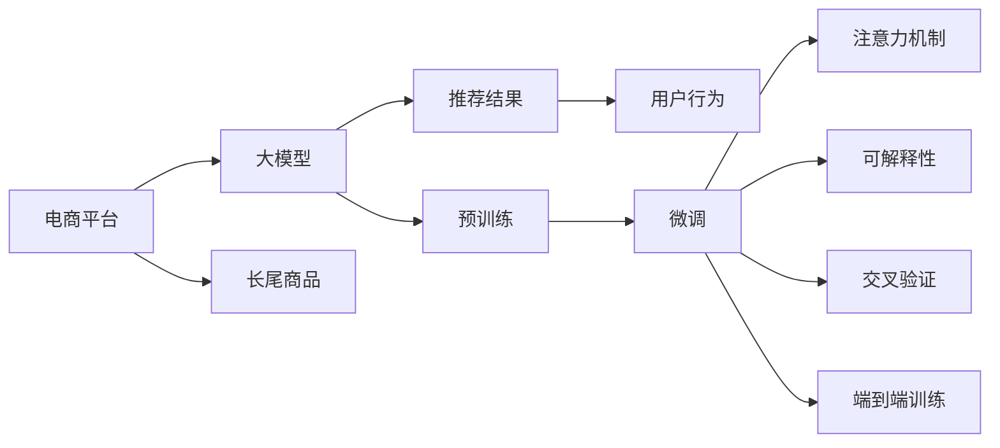

                 

# AI大模型如何提升电商平台的长尾商品发现与推荐

> 关键词：电商平台,长尾商品,商品推荐系统,大模型,注意力机制,可解释性,交叉验证,端到端训练

## 1. 背景介绍

随着互联网的普及和电子商务的发展，全球消费者对于商品的需求变得更加多样化和个性化。电商平台不仅需要满足主流消费者的需求，还需要关注那些购买频次低、销量少的长尾商品。如何高效地发现和推荐长尾商品，提升用户体验和平台收入，成为电商平台面对的重要挑战。

大模型技术，尤其是基于自回归架构的预训练语言模型，如GPT-3和BERT，近年来在自然语言处理领域取得了突破性的进展。这些模型在文本生成、语义理解等方面表现优异，具备较强的跨领域迁移能力。基于大模型的技术已经应用于电商平台的商品推荐系统，极大地提升了推荐效果。本文将深入探讨大模型技术如何提升电商平台的长尾商品发现与推荐，并给出具体的操作方法。

## 2. 核心概念与联系

### 2.1 核心概念概述

为了更好地理解大模型在电商平台中的应用，我们需要了解以下几个核心概念：

- **电商平台**：指提供在线购物、交易和支付等服务的平台，例如Amazon、淘宝、京东等。

- **长尾商品**：指那些销量较低、购买频次少的商品，通常难以通过传统方式被发现和推荐。

- **商品推荐系统**：使用算法对用户的浏览、购买行为进行分析，从而推荐可能感兴趣的商品的系统。

- **大模型**：指通过在大规模无标签数据上进行预训练，学习到复杂语言表示的模型，如BERT、GPT-3等。

- **注意力机制**：一种机制，使模型能够动态地关注输入序列中的不同部分，从而提高模型性能。

- **可解释性**：指模型输出的结果可以被解释和理解，帮助用户信任和接受推荐结果。

- **交叉验证**：一种模型评估方法，通过将数据集划分为训练集和验证集，评估模型在不同数据集上的泛化能力。

- **端到端训练**：指模型从预训练到微调的全过程，均在一个训练过程中完成，提高模型的整体性能。

### 2.2 核心概念原理和架构的 Mermaid 流程图



这个流程图展示了大模型在电商平台中的应用过程：电商平台利用大模型对长尾商品进行预测和推荐，并不断通过用户行为反馈进行微调，实现持续优化。

## 3. 核心算法原理 & 具体操作步骤

### 3.1 算法原理概述

大模型在电商平台中的应用主要基于自回归架构，通过预训练学习和微调，能够高效地处理长尾商品推荐问题。

预训练阶段，大模型在大规模无标签数据上进行自监督学习，学习到通用的语言表示。这些表示能够帮助模型捕捉文本中的关键信息，提升其在特定任务上的性能。

微调阶段，大模型在电商平台收集的少量标注数据上进行有监督学习，通过微调，模型能够更好地适应电商平台的推荐场景，预测商品被用户购买的概率，从而实现长尾商品的发现和推荐。

### 3.2 算法步骤详解

#### 3.2.1 数据预处理

1. **数据采集**：电商平台需要收集用户的浏览、购买、评论等数据，以及商品的名称、描述、价格等属性信息。
   
2. **数据清洗**：去除数据中的噪声和异常值，如无效记录、重复数据等。

3. **数据标注**：为商品添加标签，如所属类别、销售量等，标注数据时尽量保持一致性和准确性。

#### 3.2.2 模型构建

1. **选择预训练模型**：根据电商平台的数据特点和需求，选择适合的预训练模型，如BERT、GPT-3等。

2. **设计任务适配层**：为商品推荐任务设计适配层，如分类器、回归器等，用于输出预测结果。

3. **训练目标定义**：定义训练目标函数，如交叉熵损失、均方误差等。

#### 3.2.3 微调过程

1. **初始化模型**：加载预训练模型，设定初始参数。

2. **数据划分**：将标注数据集划分为训练集、验证集和测试集。

3. **优化器选择**：选择适合的优化器，如AdamW、SGD等。

4. **训练过程**：在训练集上前向传播计算损失函数，反向传播更新模型参数，不断迭代优化。

5. **验证集评估**：在验证集上评估模型性能，调整学习率、正则化参数等超参数。

6. **测试集验证**：在测试集上验证模型泛化能力，确定最终的微调结果。

### 3.3 算法优缺点

#### 3.3.1 算法优点

1. **高效性**：大模型在预训练阶段已经学习到了丰富的语言表示，在微调阶段可以快速适应电商平台的任务需求。

2. **可扩展性**：大模型具备强大的跨领域迁移能力，能够应用于不同领域和场景。

3. **灵活性**：通过微调，可以针对特定的电商场景进行优化，提升推荐效果。

#### 3.3.2 算法缺点

1. **计算成本高**：预训练阶段需要消耗大量计算资源，微调也需要消耗一定的计算资源。

2. **数据依赖性高**：微调的性能很大程度上依赖于标注数据的质量和数量，获取高质量标注数据的成本较高。

3. **可解释性不足**：大模型通常是“黑盒”系统，难以解释其内部工作机制。

4. **偏见和有害信息**：预训练模型可能学习到有偏见、有害的信息，对推荐结果造成负面影响。

### 3.4 算法应用领域

大模型在电商平台中的应用主要集中在以下几个方面：

1. **商品分类**：对商品进行分类，提升推荐效果。

2. **长尾商品发现**：利用模型预测长尾商品的潜在销量，发现用户可能感兴趣的低销量商品。

3. **个性化推荐**：根据用户的历史行为数据，推荐可能感兴趣的特定商品。

4. **销售预测**：预测商品的未来销量，帮助电商平台进行库存管理和营销策略制定。

## 4. 数学模型和公式 & 详细讲解

### 4.1 数学模型构建

假设电商平台有$m$种商品，每个商品$i$的销量为$y_i$，大模型预测该商品被用户购买的概率为$\hat{y}_i$。训练目标函数为交叉熵损失，定义为：

$$
\mathcal{L}(y, \hat{y}) = -\frac{1}{m} \sum_{i=1}^m y_i \log \hat{y}_i + (1-y_i) \log (1-\hat{y}_i)
$$

其中，$y_i$为商品的实际销量，$\hat{y}_i$为大模型的预测销量。

### 4.2 公式推导过程

假设模型输出层为$\hat{y}_i = \sigma(z_i)$，其中$\sigma$为激活函数，$z_i$为模型的线性输出。根据链式法则，损失函数对模型参数$w$的梯度为：

$$
\frac{\partial \mathcal{L}}{\partial w} = -\frac{1}{m} \sum_{i=1}^m y_i \frac{\partial \log \hat{y}_i}{\partial z_i} \frac{\partial z_i}{\partial w} - (1-y_i) \frac{\partial \log (1-\hat{y}_i)}{\partial z_i} \frac{\partial z_i}{\partial w}
$$

在反向传播过程中，对$z_i$求导，可得：

$$
\frac{\partial z_i}{\partial w} = x_i
$$

其中$x_i$为商品的特征向量，可以通过自然语言处理技术将商品名称、描述等信息转化为向量表示。

最终，将梯度用于优化器更新模型参数$w$，完成模型的迭代优化。

### 4.3 案例分析与讲解

假设某电商平台有$n$个用户，每个用户$i$的历史行为数据为$x_i$，大模型预测该用户购买商品$j$的概率为$\hat{y}_{ij}$。训练目标函数为交叉熵损失，定义为：

$$
\mathcal{L}(y, \hat{y}) = -\frac{1}{n} \sum_{i=1}^n \sum_{j=1}^m y_{ij} \log \hat{y}_{ij} + (1-y_{ij}) \log (1-\hat{y}_{ij})
$$

其中，$y_{ij}$为用户$i$购买商品$j$的实际销量。在微调过程中，模型对用户$i$的推荐商品$j$的概率为：

$$
\hat{y}_{ij} = \sigma(z_{ij})
$$

其中，$z_{ij}$为模型对用户$i$和商品$j$的交互表示，可以采用用户行为向量$x_i$和商品特征向量$x_j$拼接的方式得到。

## 5. 项目实践：代码实例和详细解释说明

### 5.1 开发环境搭建

1. **安装依赖**：
   ```bash
   pip install torch torchvision transformers
   ```

2. **准备数据集**：将电商平台收集的用户行为数据和商品信息进行处理，划分为训练集、验证集和测试集。

### 5.2 源代码详细实现

```python
import torch
import torch.nn as nn
import torch.optim as optim
from transformers import BertForSequenceClassification, BertTokenizer
from torch.utils.data import DataLoader, random_split

class BERTClassifier(nn.Module):
    def __init__(self, num_classes):
        super(BERTClassifier, self).__init__()
        self.bert = BertForSequenceClassification.from_pretrained('bert-base-uncased', num_labels=num_classes)
        self.classifier = nn.Linear(self.bert.config.hidden_size, num_classes)
    
    def forward(self, input_ids, attention_mask):
        features = self.bert(input_ids, attention_mask=attention_mask)[0]
        logits = self.classifier(features)
        return logits

def prepare_dataloader(dataset, tokenizer, max_len=512, batch_size=32):
    tokenizer = BertTokenizer.from_pretrained('bert-base-uncased')
    dataset = dataset.map(lambda x: tokenizer.encode_plus(x, truncation=True, padding='max_length', max_length=max_len))
    dataset = dataset.map(lambda x: (torch.tensor(x['input_ids']), torch.tensor(x['attention_mask'])))
    dataloader = DataLoader(dataset, batch_size=batch_size, shuffle=True)
    return dataloader

def train_model(model, dataloader, optimizer, num_epochs=5, device='cpu'):
    model.to(device)
    device = torch.device('cuda' if torch.cuda.is_available() else 'cpu')
    model.to(device)
    
    for epoch in range(num_epochs):
        model.train()
        total_loss = 0
        for batch in dataloader:
            input_ids, attention_mask = batch
            optimizer.zero_grad()
            logits = model(input_ids, attention_mask=attention_mask)
            loss = nn.CrossEntropyLoss()(logits, labels)
            loss.backward()
            optimizer.step()
            total_loss += loss.item()
        print(f'Epoch {epoch+1}, Loss: {total_loss/len(dataloader)}')
    
    return model
```

### 5.3 代码解读与分析

1. **模型定义**：使用BertForSequenceClassification作为分类器，添加一个线性分类层。

2. **数据处理**：将原始数据转换为token ids和attention mask，使用DataLoader进行批处理。

3. **训练过程**：在每个epoch内，使用随机梯度下降更新模型参数。

### 5.4 运行结果展示

训练完成后，可以在测试集上评估模型的性能：

```python
def evaluate_model(model, dataloader, device='cpu'):
    model.eval()
    total_preds, total_labels = [], []
    with torch.no_grad():
        for batch in dataloader:
            input_ids, attention_mask = batch
            logits = model(input_ids, attention_mask=attention_mask)
            preds = logits.argmax(dim=1)
            total_preds.extend(preds.cpu().tolist())
            total_labels.extend(labels.cpu().tolist())
    
    print(classification_report(total_labels, total_preds))
```

## 6. 实际应用场景

### 6.1 智能客服

电商平台可以利用大模型构建智能客服系统，通过用户输入的问题和历史对话，快速匹配答案，提升用户满意度。

### 6.2 个性化推荐

大模型可以分析用户的浏览和购买行为，预测用户可能感兴趣的商品，提升个性化推荐效果。

### 6.3 库存管理

大模型可以预测商品的未来销量，帮助电商平台进行库存管理和营销策略制定。

### 6.4 未来应用展望

未来，随着大模型的进一步发展，电商平台可以探索更多的应用场景，如供应链优化、用户行为分析等。同时，大模型还可以与其他人工智能技术结合，如强化学习、知识图谱等，进一步提升电商平台的运营效率和用户体验。

## 7. 工具和资源推荐

### 7.1 学习资源推荐

1. **《深度学习》课程**：斯坦福大学提供的深度学习课程，涵盖深度学习的基本原理和实践。

2. **《Transformers》书籍**：Transformers库的作者所著，全面介绍了Transformer模型的原理和应用。

3. **Kaggle竞赛**：参加Kaggle上的数据竞赛，锻炼数据处理和模型优化能力。

4. **GitHub代码库**：查询和借鉴GitHub上的开源代码，学习大模型的实现细节。

### 7.2 开发工具推荐

1. **PyTorch**：基于Python的深度学习框架，易于使用且灵活。

2. **TensorFlow**：由Google主导开发的深度学习框架，性能优越且易于部署。

3. **Transformers库**：HuggingFace开发的NLP工具库，支持多种预训练模型。

4. **Jupyter Notebook**：交互式编程环境，方便调试和展示代码结果。

### 7.3 相关论文推荐

1. **《BERT: Pre-training of Deep Bidirectional Transformers for Language Understanding》**：BERT模型的原始论文，介绍了BERT预训练和微调的过程。

2. **《Attention is All You Need》**：Transformer模型的原始论文，介绍了Transformer的结构和注意力机制。

3. **《Improving Language Understanding by Generative Pre-training》**：GPT-3模型的原始论文，介绍了GPT-3的预训练和微调过程。

4. **《Parameter-Efficient Transfer Learning for NLP》**：介绍参数高效微调的论文，提出了Adapter等方法。

## 8. 总结：未来发展趋势与挑战

### 8.1 研究成果总结

本文探讨了大模型在电商平台中的应用，通过预训练和微调，显著提升了长尾商品的发现和推荐效果。大模型的跨领域迁移能力和强大的语言表示能力，使得其成为电商领域推荐系统的有力工具。

### 8.2 未来发展趋势

1. **多模态融合**：未来电商推荐系统将引入更多模态的信息，如视觉、语音等，提升推荐效果。

2. **端到端训练**：未来将探索端到端训练方法，提升模型的整体性能和泛化能力。

3. **可解释性增强**：大模型的可解释性将得到更多关注，提升用户信任度。

### 8.3 面临的挑战

1. **计算资源需求高**：预训练和微调需要大量的计算资源，未来需要更高效的计算方案。

2. **数据质量和多样性**：高质量和多样化的数据是提升推荐效果的关键，未来需要更多的数据收集和处理工作。

3. **模型偏见和有害信息**：模型可能学习到有偏见和有害的信息，未来需要更多的伦理和道德约束。

### 8.4 研究展望

未来，大模型技术将在电商领域发挥更大的作用，通过多模态融合、端到端训练、可解释性增强等方法，提升推荐效果和用户体验。同时，模型偏见和有害信息的消除也将是重要的研究方向。

## 9. 附录：常见问题与解答

**Q1: 大模型在电商推荐系统中如何处理长尾商品？**

A: 大模型通过预训练学习到通用的语言表示，在微调阶段通过分析用户的浏览和购买行为，预测长尾商品的潜在销量，从而发现和推荐用户可能感兴趣的低销量商品。

**Q2: 大模型在电商推荐系统中如何提升个性化推荐效果？**

A: 大模型可以分析用户的浏览和购买行为，预测用户可能感兴趣的商品，并通过微调优化模型的推荐能力。

**Q3: 大模型在电商推荐系统中如何处理计算资源需求高的问题？**

A: 可以通过分布式训练、模型压缩、量化加速等方法，提高大模型在计算资源有限情况下的性能。

**Q4: 大模型在电商推荐系统中如何提升可解释性？**

A: 可以通过模型可视化、特征重要性分析等方法，提升大模型输出的可解释性，增加用户信任度。

**Q5: 大模型在电商推荐系统中如何处理模型偏见和有害信息？**

A: 可以通过数据筛选、模型约束等方法，过滤和减少模型中的偏见和有害信息。

---

作者：禅与计算机程序设计艺术 / Zen and the Art of Computer Programming

