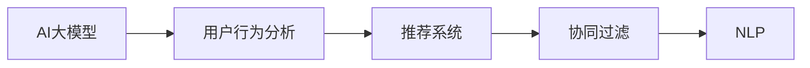

                 

# AI大模型如何改善电商平台的用户留存率

> 关键词：大模型,用户行为分析,推荐系统,自然语言处理,NLP

## 1. 背景介绍

随着电子商务的迅猛发展，电商平台已经不仅仅是商品的展示和销售平台，更是用户体验的中心。如何在竞争激烈的市场环境中留住用户，提升用户粘性，成为电商平台经营者们面临的重大挑战。传统的方法，如提高商品质量、降低价格、优化客服等，虽能带来一定程度的短期效果，但难以从根本上提升用户留存率。

近年来，随着人工智能技术的飞速发展，尤其是深度学习和大模型技术的广泛应用，电商平台开始探索新方法，利用AI大模型对用户行为进行深入分析，并据此提供个性化推荐，提升用户体验，从而提高用户留存率。这些方法包括了基于用户历史行为的协同过滤、基于内容特征的协同过滤、基于深度学习模型的推荐系统等。本文将重点介绍AI大模型在电商平台用户行为分析及推荐系统中的应用。

## 2. 核心概念与联系

### 2.1 核心概念概述

在探索AI大模型如何改善电商平台的用户留存率之前，我们先来梳理一些相关核心概念：

- **AI大模型**：指在深度学习领域内，使用大量数据进行训练的非常庞大的模型，其参数量在亿级以上，可以处理复杂的自然语言处理任务，如语义理解、情感分析、文本生成等。

- **用户行为分析**：指通过数据分析手段，挖掘用户在使用电商平台时的行为模式，识别用户偏好，以便更准确地进行个性化推荐。

- **推荐系统**：利用AI技术对用户行为进行分析，从而向用户推荐可能感兴趣的商品或内容，提高用户体验，提升用户留存率。

- **协同过滤**：基于用户历史行为记录进行推荐的一种方法，包括基于用户的协同过滤和基于物品的协同过滤。

- **自然语言处理(NLP)**：涉及文本的表示、处理和分析的学科，如文本分类、信息抽取、文本生成等。

这些概念之间的关系可以用以下的Mermaid流程图来展示：



这个流程图展示了AI大模型在电商平台中的应用逻辑：大模型通过对用户行为进行深度学习，识别出用户偏好和兴趣，然后推荐系统根据这些信息，向用户推荐可能感兴趣的商品或内容，最终提升用户留存率。其中协同过滤和NLP技术都是推荐系统的组成部分。

## 3. 核心算法原理 & 具体操作步骤

### 3.1 算法原理概述

基于AI大模型的推荐系统，其核心思想是：利用大模型的强大表达能力，从海量用户行为数据中学习用户的兴趣和偏好，然后针对每个用户生成个性化的推荐列表。具体流程包括以下几个步骤：

1. **数据收集**：收集用户的历史行为数据，包括浏览记录、购买记录、评价记录等。

2. **数据预处理**：对收集到的数据进行清洗、去重、归一化等处理，得到可用于模型训练的数据集。

3. **模型训练**：使用AI大模型对数据集进行训练，学习用户行为模式和物品属性。

4. **推荐生成**：根据每个用户的行为模式和偏好，生成个性化推荐列表。

5. **结果评估**：对推荐结果进行评估，优化模型性能。

### 3.2 算法步骤详解

#### 3.2.1 数据收集

电商平台的推荐系统需要大量的用户行为数据作为训练素材。这些数据主要包括：

- **浏览记录**：用户点击、浏览的商品信息，包括商品ID、名称、类别、价格等。

- **购买记录**：用户购买商品的信息，包括商品ID、价格、购买时间等。

- **评价记录**：用户对商品进行的评价，包括评分、评论文本等。

- **互动记录**：用户与客服、朋友之间的互动信息，如聊天记录、邮件往来等。

#### 3.2.2 数据预处理

数据预处理是确保数据质量和模型训练效果的关键步骤。预处理包括以下几个方面：

- **数据清洗**：去除无关字段、处理缺失值和异常值，确保数据一致性。

- **特征工程**：提取并构造有意义的特征，如商品类别、价格区间、用户评分等。

- **数据归一化**：将不同尺度的特征值进行归一化处理，确保模型能够公平地处理所有特征。

- **数据划分**：将数据集划分为训练集、验证集和测试集，供模型训练、调优和评估使用。

#### 3.2.3 模型训练

模型训练是利用AI大模型进行推荐系统开发的重中之重。训练过程包括：

- **模型选择**：选择合适的AI大模型，如BERT、GPT-3、Transformer等。

- **超参数调优**：调整模型超参数，如学习率、批大小、迭代轮数等，以提升训练效果。

- **模型训练**：使用训练集对模型进行迭代训练，最小化损失函数。

- **模型评估**：在验证集上评估模型性能，选择表现最优的模型进行应用。

#### 3.2.4 推荐生成

推荐生成是推荐系统的最终目的，过程如下：

- **用户画像生成**：通过用户的历史行为数据，生成用户画像，捕捉用户兴趣和偏好。

- **推荐列表生成**：根据用户画像和物品特征，生成推荐列表，包含用户可能感兴趣的商品或内容。

#### 3.2.5 结果评估

推荐系统的效果评估是一个持续的过程，具体包括：

- **精确度（Precision）**：衡量推荐结果中与用户兴趣相关物品的占比。

- **召回率（Recall）**：衡量推荐结果中实际感兴趣物品的占比。

- **F1分数**：综合精确度和召回率，是推荐系统整体性能的评价指标。

### 3.3 算法优缺点

#### 3.3.1 优点

- **个性化推荐**：AI大模型可以深入挖掘用户行为数据，生成个性化推荐，提升用户体验。

- **推荐多样性**：大模型在处理大量数据时，可以生成更多样化的推荐，减少用户的选择疲劳。

- **实时推荐**：基于大模型的推荐系统可以实时根据用户行为动态更新推荐内容，适应用户的即时需求。

#### 3.3.2 缺点

- **数据依赖**：推荐系统的效果高度依赖于数据质量，数据收集和处理成本较高。

- **模型复杂度**：大模型复杂度高，需要高性能计算资源进行训练和推理，资源消耗较大。

- **训练周期长**：大模型训练需要大量时间，可能无法迅速迭代更新推荐内容。

### 3.4 算法应用领域

基于AI大模型的推荐系统已经广泛应用于多个电商领域，以下是几个典型应用场景：

- **商品推荐**：根据用户浏览和购买历史，为用户推荐可能感兴趣的商品。

- **内容推荐**：根据用户阅读和评价行为，为用户推荐相关文章、视频、书籍等。

- **跨域推荐**：将不同领域的数据进行融合，为用户推荐跨域的推荐内容，如音乐、电影等。

- **实时推荐**：在用户浏览商品或页面时，实时生成推荐内容，提升用户体验。

## 4. 数学模型和公式 & 详细讲解 & 举例说明

### 4.1 数学模型构建

AI大模型的推荐系统通常基于以下数学模型进行构建：

- **用户-物品评分矩阵**：构建用户和物品之间的评分矩阵，用于表示用户对物品的兴趣。

- **隐向量表示**：将用户和物品表示为隐向量，利用向量之间的相似度进行推荐。

- **深度学习模型**：利用深度学习模型，如卷积神经网络、循环神经网络、注意力机制等，对用户行为数据进行建模，生成推荐结果。

### 4.2 公式推导过程

以基于隐向量表示的推荐系统为例，公式推导如下：

设用户 $u$ 对物品 $i$ 的评分记为 $r_{ui}$，其中 $r_{ui} \in [0,1]$。构建用户和物品的隐向量 $h_u$ 和 $h_i$，表示用户对物品的兴趣程度。推荐函数可以表示为：

$$
\hat{r}_{ui} = \langle h_u, h_i \rangle
$$

其中 $\langle \cdot, \cdot \rangle$ 表示向量的点积，即 $h_u \cdot h_i = \sum_{j=1}^n h_{uj}h_{ij}$，$n$ 为隐向量维度。

根据上述推荐函数，模型可以通过最大化点积来预测用户对物品的评分，进而生成推荐列表。

### 4.3 案例分析与讲解

以亚马逊平台为例，其推荐系统使用了基于隐向量表示的方法，具体实现步骤如下：

1. **数据收集**：亚马逊平台收集了大量的用户行为数据，包括浏览记录、购买记录、评价记录等。

2. **数据预处理**：对数据进行清洗、归一化处理，并构建用户-物品评分矩阵。

3. **模型训练**：使用深度学习模型对评分矩阵进行训练，学习用户和物品的隐向量表示。

4. **推荐生成**：基于隐向量表示，生成用户个性化推荐列表。

5. **结果评估**：通过评估模型的精确度和召回率，优化模型参数，提升推荐效果。

## 5. 项目实践：代码实例和详细解释说明

### 5.1 开发环境搭建

项目开发前，我们需要搭建一个Python开发环境，具体步骤如下：

1. **安装Python**：安装Python 3.x版本，推荐使用Anaconda或Miniconda进行环境管理。

2. **安装Pip包**：安装必要的Python包，如Numpy、Pandas、Scikit-learn、Tensorflow、Keras等。

3. **安装Docker**：使用Docker容器进行模型训练和推理，方便部署和扩展。

4. **安装GPU驱动**：确保开发机安装有最新的NVIDIA GPU驱动，并能够正常工作。

### 5.2 源代码详细实现

以下是一个基于Tensorflow和Keras框架实现AI大模型推荐系统的示例代码：

```python
import tensorflow as tf
from tensorflow.keras.layers import Input, Dense, Embedding, Dot, Activation
from tensorflow.keras.models import Model
from tensorflow.keras.optimizers import Adam

# 定义用户和物品的隐向量维度
DIMENSION = 100

# 定义用户和物品的输入层
user_input = Input(shape=(num_users,), name='user_input')
item_input = Input(shape=(num_items,), name='item_input')

# 定义用户和物品的嵌入层
user_embedding = Embedding(num_users, DIMENSION)(user_input)
item_embedding = Embedding(num_items, DIMENSION)(item_input)

# 定义用户和物品的隐向量表示
user_vector = Dense(DIMENSION)(user_embedding)
item_vector = Dense(DIMENSION)(item_embedding)

# 定义推荐函数的点积表示
dot_product = Dot(axes=[2, 1])([user_vector, item_vector])

# 定义激活函数和损失函数
activation = Activation('sigmoid')
loss = tf.keras.losses.BinaryCrossentropy()
optimizer = Adam(lr=0.001)

# 定义模型
model = Model(inputs=[user_input, item_input], outputs=activation(dot_product))

# 编译模型
model.compile(optimizer=optimizer, loss=loss)

# 训练模型
model.fit([train_users, train_items], train_ratings, epochs=10, batch_size=32, validation_data=(val_users, val_items, val_ratings))

# 生成推荐列表
test_ratings = model.predict([test_users, test_items])
```

### 5.3 代码解读与分析

以上代码实现了一个简单的基于隐向量表示的推荐系统，其中：

- `user_input`和`item_input`表示用户和物品的输入层，`num_users`和`num_items`表示用户和物品的总数。
- `user_embedding`和`item_embedding`表示用户和物品的嵌入层，将用户和物品转化为隐向量表示。
- `user_vector`和`item_vector`表示用户和物品的隐向量表示。
- `dot_product`表示用户和物品隐向量的点积表示，即推荐函数。
- `activation`表示激活函数，这里使用了sigmoid函数。
- `loss`表示损失函数，这里使用了二分类交叉熵。
- `optimizer`表示优化器，这里使用了Adam。
- `model`表示推荐系统的模型。

代码通过定义输入层、嵌入层、隐向量表示、推荐函数、激活函数、损失函数、优化器，并编译和训练模型，生成推荐列表。

### 5.4 运行结果展示

训练完成后，我们可以使用模型对测试数据进行预测，并输出推荐结果。以下是一个示例：

```python
# 输出测试数据的推荐结果
for i in range(num_test_users):
    test_user = test_users[i]
    test_items = test_items[i]
    test_ratings = test_ratings[i]
    print(f"User {test_user}: Recommendations are {test_ratings}")
```

## 6. 实际应用场景

### 6.1 智能客服系统

智能客服系统是电商平台用户留存率提升的重要手段之一。通过AI大模型，电商平台可以实现智能客服机器人，提升用户互动体验。

具体而言，可以通过用户与客服的对话记录，训练AI大模型，生成智能客服机器人。当用户提出问题时，机器人可以迅速理解并给出精准的回复，提升用户满意度。

### 6.2 个性化推荐系统

个性化推荐系统是电商平台用户留存率提升的核心手段。通过AI大模型，电商平台可以实现更加精准和多样化的个性化推荐，提升用户体验。

具体而言，可以通过用户的历史浏览和购买记录，训练AI大模型，生成个性化推荐列表。用户可以根据推荐列表快速找到感兴趣的商品，提升购物体验。

### 6.3 跨域推荐系统

跨域推荐系统可以将不同领域的数据进行融合，为用户提供更丰富和多样化的推荐内容。

具体而言，可以通过将音乐、电影、书籍等不同领域的数据进行融合，训练AI大模型，生成跨域推荐列表。用户可以在一个平台上，获取到不同领域的推荐内容，提升平台粘性。

## 7. 工具和资源推荐

### 7.1 学习资源推荐

为了帮助开发者系统掌握AI大模型在电商平台中的应用，以下是一些推荐的学习资源：

1. **《深度学习入门》**：李沐老师所著，讲解深度学习的基本原理和算法，适合初学者入门。

2. **《自然语言处理综论》**：北京大学教材，涵盖自然语言处理的各个方面，包括语言模型、文本分类、情感分析等。

3. **Deep Learning Specialization**：由Andrew Ng教授主讲的Coursera课程，讲解深度学习在各个领域的应用。

4. **Kaggle竞赛**：Kaggle平台上有多个关于电商平台推荐系统的竞赛，可以学习和借鉴其他选手的思路。

### 7.2 开发工具推荐

以下是一些用于AI大模型在电商平台中应用开发的常用工具：

1. **Tensorflow**：谷歌开源的深度学习框架，支持分布式训练和推理。

2. **Keras**：谷歌开源的高层深度学习框架，易于使用，支持Tensorflow等后端。

3. **PyTorch**：Facebook开源的深度学习框架，支持动态计算图，易于调试和扩展。

4. **Jupyter Notebook**：用于编写和运行Python代码，支持丰富的展示和可视化功能。

5. **GitHub**：用于版本控制和协作开发，方便代码管理和共享。

### 7.3 相关论文推荐

以下是一些与AI大模型在电商平台中应用相关的经典论文：

1. **《深度协同过滤》**：一篇关于协同过滤推荐系统的经典论文，提出了矩阵分解的方法。

2. **《自然语言处理中的深度学习》**：一篇关于深度学习在NLP中应用的综述论文，介绍了多种深度学习模型及其在推荐系统中的应用。

3. **《基于用户-物品隐向量表示的推荐系统》**：一篇关于基于隐向量表示推荐系统的论文，介绍了隐向量表示的构建和优化方法。

## 8. 总结：未来发展趋势与挑战

### 8.1 总结

本文通过分析AI大模型在电商平台用户留存率提升中的应用，展示了大模型在电商平台推荐系统中的强大潜力。通过深度学习和大模型，电商平台可以更好地了解用户需求，提升用户体验，从而提高用户留存率。未来，随着AI技术的不断发展，AI大模型在电商平台中的应用将更加广泛，带来更多的商业价值。

### 8.2 未来发展趋势

1. **AI技术进一步普及**：AI大模型和推荐系统将逐步普及到各个电商平台，提升用户体验和效率。

2. **推荐系统智能化**：推荐系统将更加智能化，能够根据用户行为实时调整推荐内容，提升用户体验。

3. **跨域推荐**：跨域推荐系统将更加成熟，能够实现不同领域内容的协同推荐，提升平台粘性。

4. **个性化推荐**：个性化推荐将更加精准，能够根据用户兴趣和行为生成个性化推荐列表。

5. **多模态融合**：多模态数据融合将更加深入，能够将文本、图像、语音等多种信息进行协同推荐，提升推荐效果。

### 8.3 面临的挑战

1. **数据质量问题**：推荐系统的效果高度依赖于数据质量，数据收集和处理成本较高。

2. **模型复杂度**：大模型复杂度高，需要高性能计算资源进行训练和推理，资源消耗较大。

3. **用户隐私问题**：推荐系统需要收集大量用户数据，用户隐私保护问题亟待解决。

### 8.4 研究展望

1. **优化数据收集和处理**：通过数据清洗、特征工程等手段，优化数据质量和处理效率。

2. **优化模型复杂度**：通过模型压缩、剪枝等手段，优化模型复杂度和资源消耗。

3. **保护用户隐私**：通过匿名化、差分隐私等手段，保护用户隐私和数据安全。

4. **跨域推荐系统**：通过多模态融合、知识图谱等手段，实现跨域推荐系统的构建。

总之，AI大模型在电商平台中的应用，为提升用户留存率提供了新的可能性。未来，随着技术的不断进步和应用的不断深入，AI大模型将带来更多的商业价值和社会影响。

## 9. 附录：常见问题与解答

### Q1：AI大模型如何提升电商平台的用户留存率？

A: AI大模型通过深度学习对用户行为进行建模，生成个性化推荐列表，提升用户体验，从而提高用户留存率。具体而言，通过分析用户的历史行为数据，生成精准的推荐内容，减少用户选择疲劳，提升购物体验。

### Q2：推荐系统的数据质量如何保证？

A: 推荐系统的数据质量取决于数据收集和处理的质量。需要定期清洗数据，去除异常值和噪声，确保数据一致性。同时，需要对数据进行归一化和特征工程，提取有意义的特征，提高数据质量。

### Q3：AI大模型在推荐系统中如何进行实时推荐？

A: 实时推荐系统需要对用户行为进行实时监控和分析，根据用户行为动态调整推荐内容。可以通过将推荐模型部署到分布式系统中，实现实时推荐。

### Q4：AI大模型在电商平台中的应用有哪些？

A: AI大模型在电商平台中的应用包括智能客服系统、个性化推荐系统、跨域推荐系统等。这些应用通过分析用户行为，生成个性化推荐内容，提升用户体验，从而提高用户留存率。

### Q5：AI大模型的推荐系统存在哪些缺点？

A: AI大模型的推荐系统存在数据依赖、模型复杂度高等缺点。数据收集和处理成本较高，模型训练和推理资源消耗较大。

---

作者：禅与计算机程序设计艺术 / Zen and the Art of Computer Programming

