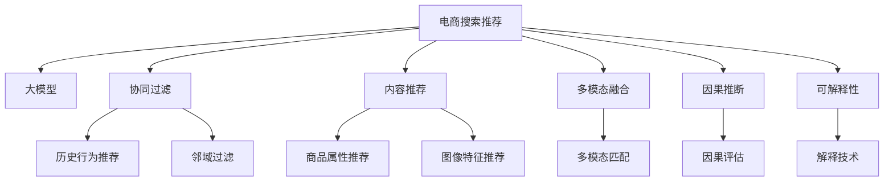

                 

# AI大模型视角下电商搜索推荐的技术创新激励机制设计

> 关键词：电商搜索,推荐系统,大模型,激励机制,技术创新,深度学习,协同过滤,内容推荐,多模态融合,因果推断,可解释性

## 1. 背景介绍

### 1.1 问题由来

随着电商平台的不断扩展和消费者需求的多样化，传统基于规则或统计学方法构建的推荐系统已难以满足个性化、实时性等高要求。深度学习技术的兴起，尤其是大模型的涌现，为电商搜索推荐系统的技术创新提供了新的契机。大模型凭借其强大的表达能力和泛化能力，在电商搜索推荐中表现出色，但同时也带来了成本高、推理慢等挑战。如何构建合理有效的技术创新激励机制，充分激发大模型在电商搜索推荐中的应用潜力，成为当前研究的一个重要课题。

### 1.2 问题核心关键点

本文聚焦于电商搜索推荐领域，探讨基于大模型的技术创新激励机制。研究的核心问题包括：

- 如何有效利用大模型在大规模数据上训练得到的知识，提升电商搜索推荐的性能？
- 如何设计合理的激励机制，引导开发者在大模型基础上进行技术创新，解决实际问题？
- 如何应对大模型高成本、推理慢等技术难题，确保其在电商搜索推荐中的高效应用？
- 如何提升大模型推荐的可解释性和透明度，增强用户对推荐结果的信任？

通过回答这些问题，本文旨在为大模型在电商搜索推荐中的应用提供理论指导和实践参考。

### 1.3 问题研究意义

电商搜索推荐系统的大模型应用，对于提升用户体验、提高转化率、增强平台竞争力具有重要意义。研究合理的技术创新激励机制，不仅有助于充分利用大模型的潜力，还能推动相关技术的进步，促进电商行业整体的创新发展。

1. **用户体验优化**：大模型能够通过深度学习从大量历史数据中学习用户行为模式，提供个性化推荐，提升用户体验。
2. **转化率提升**：推荐算法准确度的提升，能够显著提高用户点击率和购买转化率，增加平台收益。
3. **竞争力增强**：通过技术创新，电商平台的推荐系统能够领先竞争对手，吸引更多用户，实现市场份额的增长。
4. **创新驱动**：合理的激励机制能够激发开发者在大模型基础上的技术创新，推动电商行业新技术的发展和应用。
5. **可解释性增强**：提高推荐结果的透明度和可解释性，增强用户对推荐结果的信任，提升平台美誉度。

## 2. 核心概念与联系

### 2.1 核心概念概述

为更好地理解电商搜索推荐中的技术创新激励机制，本节将介绍几个密切相关的核心概念：

- **电商搜索推荐系统**：利用深度学习模型为用户推荐商品，帮助用户快速找到满意的商品，提高购物体验。
- **大模型**：以深度神经网络为基础，通过预训练和微调在大规模数据上学习到的通用知识，具备强大的表达和推理能力。
- **协同过滤**：基于用户历史行为或商品相似性进行推荐，是推荐系统中的经典技术。
- **内容推荐**：基于商品属性、描述等特征进行推荐，适用于个性化需求较高的场景。
- **多模态融合**：融合文本、图像、音频等多模态数据，提高推荐的全面性和准确性。
- **因果推断**：通过因果关系模型，评估推荐策略的效果，优化推荐过程。
- **可解释性**：通过模型解释技术，使推荐结果更具透明度，增强用户信任。

这些核心概念之间的逻辑关系可以通过以下Mermaid流程图来展示：



这个流程图展示了大模型在电商搜索推荐中的核心概念及其之间的关系：

1. 电商搜索推荐系统通过深度学习模型进行推荐。
2. 大模型提供通用知识，用于协同过滤、内容推荐、多模态融合等技术手段。
3. 协同过滤和内容推荐是电商推荐中常用的两种方法。
4. 多模态融合和因果推断为推荐系统带来了更全面的数据处理能力和更准确的推荐效果。
5. 可解释性技术使推荐结果更具透明性，增强了用户对推荐系统的信任。

这些概念共同构成了电商搜索推荐系统的技术框架，为大模型在其中的应用提供了理论基础和实践指南。

## 3. 核心算法原理 & 具体操作步骤

### 3.1 算法原理概述

基于大模型的电商搜索推荐系统，通过预训练-微调的方式进行模型的构建和优化。其核心思想是：利用大模型在大规模电商数据上学习到的通用知识，通过微调适应特定用户的购物行为和偏好，提供个性化的商品推荐。

具体来说，假设大模型为 $M_{\theta}$，其中 $\theta$ 为模型参数。电商搜索推荐任务可视为一个序列预测问题，即根据用户的历史行为，预测其可能感兴趣的商品。微调的目标是找到新的模型参数 $\hat{\theta}$，使得模型输出与真实标签 $y$ 之间的误差最小化：

$$
\hat{\theta}=\mathop{\arg\min}_{\theta} \mathcal{L}(M_{\theta},D)
$$

其中 $\mathcal{L}$ 为损失函数，通常为交叉熵损失函数。在大模型微调过程中，目标是通过更新模型参数 $\theta$，使得 $M_{\theta}$ 在特定用户 $u$ 的历史行为 $X_u$ 上预测其感兴趣的商品 $Y_u$ 时，其输出与 $Y_u$ 之间的误差最小化。

### 3.2 算法步骤详解

基于大模型的电商搜索推荐系统微调一般包括以下关键步骤：

**Step 1: 准备数据集和模型**
- 收集电商平台上用户的浏览、点击、购买等行为数据，构建训练集、验证集和测试集。
- 选择合适的预训练语言模型，如BERT、GPT等，作为初始化参数。

**Step 2: 设计推荐目标函数**
- 根据电商推荐任务的特点，设计合适的损失函数。如交叉熵损失、均方误差损失等。
- 设计推荐模型输出层，根据任务需求选择分类器、回归器等。

**Step 3: 设定微调超参数**
- 选择合适的优化算法及其参数，如AdamW、SGD等。
- 设置学习率、批大小、迭代轮数等超参数。
- 应用正则化技术，如L2正则、Dropout等，防止过拟合。

**Step 4: 执行梯度训练**
- 将训练集数据分批次输入模型，前向传播计算损失函数。
- 反向传播计算参数梯度，根据设定的优化算法和学习率更新模型参数。
- 周期性在验证集上评估模型性能，根据性能指标决定是否触发Early Stopping。
- 重复上述步骤直到满足预设的迭代轮数或Early Stopping条件。

**Step 5: 测试和部署**
- 在测试集上评估微调后模型的推荐性能，对比微调前后的精度提升。
- 使用微调后的模型进行商品推荐，集成到实际电商推荐系统中。
- 持续收集新的数据，定期重新微调模型，以适应数据分布的变化。

以上是基于大模型的电商搜索推荐系统微调的一般流程。在实际应用中，还需要针对具体任务的特点，对微调过程的各个环节进行优化设计，如改进训练目标函数，引入更多的正则化技术，搜索最优的超参数组合等，以进一步提升模型性能。

### 3.3 算法优缺点

基于大模型的电商搜索推荐系统微调方法具有以下优点：

- **精度高**：大模型通过在大规模电商数据上预训练，学习到了丰富的商品和用户知识，微调后能够提供高精度的推荐结果。
- **灵活性高**：大模型能够适应多种电商推荐任务，如商品分类、热门商品推荐、个性化推荐等，通过微调可以灵活应对不同需求。
- **可扩展性好**：大模型可方便地通过增加数据和迭代次数来进一步提升性能，适合大规模电商平台的推荐需求。

同时，该方法也存在一定的局限性：

- **计算资源需求高**：大模型参数量巨大，训练和推理所需资源较多，可能需要高性能GPU/TPU等设备。
- **推理速度慢**：大模型推理时间较长，难以满足实时性要求。
- **过拟合风险高**：在大规模电商数据上预训练的大模型，可能会过拟合数据分布，导致泛化性能不足。
- **可解释性不足**：大模型通常是一个"黑盒"系统，推荐结果的解释性较差。

尽管存在这些局限性，但就目前而言，基于大模型的微调方法仍是大规模电商推荐系统中最为有效的技术手段。未来相关研究的重点在于如何进一步降低大模型的计算需求，提高推荐速度，增强推荐结果的可解释性，以推动电商推荐技术的进一步发展。

### 3.4 算法应用领域

基于大模型的电商搜索推荐系统，已经在电商行业得到了广泛应用，具体包括：

- **商品推荐**：根据用户历史行为和兴趣，推荐用户可能感兴趣的商品。
- **热门商品**：基于用户点击和浏览行为，推荐当前最热门的商品。
- **个性化推荐**：根据用户个性化需求，推荐符合其兴趣的商品。
- **跨品类推荐**：跨品类推荐相关商品，如基于用户购买衣服推荐鞋子。
- **新商品推荐**：推荐平台新上架的商品，提升新商品曝光率。
- **限时折扣推荐**：推荐正在进行促销的商品，促进用户购买。
- **用户画像构建**：通过分析用户行为数据，构建用户画像，提升推荐效果。

除了上述这些经典应用外，基于大模型的电商推荐系统还在不断创新，如借助视觉、语音等多模态信息进行推荐，引入因果推断模型优化推荐策略，探索可解释性技术增强推荐透明性等，为电商推荐技术带来了更多的发展空间。

## 4. 数学模型和公式 & 详细讲解 & 举例说明

### 4.1 数学模型构建

在大模型微调中，假设电商推荐任务为二分类问题，即判断用户是否感兴趣某个商品。设用户 $u$ 的历史行为为 $X_u$，感兴趣商品为 $Y_u \in \{0,1\}$，大模型 $M_{\theta}$ 的输出为 $Z_u$，则推荐模型的目标函数可以表示为：

$$
\mathcal{L}(M_{\theta},X_u,Y_u) = -\log M_{\theta}(X_u,Y_u)
$$

其中 $M_{\theta}(X_u,Y_u)$ 为模型在用户 $u$ 的历史行为 $X_u$ 上的预测概率。

### 4.2 公式推导过程

以二分类任务为例，推导交叉熵损失函数及其梯度的计算公式。

假设用户 $u$ 的历史行为为 $X_u$，感兴趣商品为 $Y_u \in \{0,1\}$。则模型在用户 $u$ 的历史行为 $X_u$ 上的预测概率 $M_{\theta}(X_u,Y_u)$ 可以表示为：

$$
M_{\theta}(X_u,Y_u) = \sigma(\theta^T \phi(X_u))
$$

其中 $\sigma$ 为激活函数，$\theta$ 为模型参数，$\phi$ 为特征映射函数。设模型预测概率为 $p$，真实标签为 $y$，则交叉熵损失函数可以表示为：

$$
\ell(M_{\theta}(X_u,Y_u),y) = -[y\log p+(1-y)\log(1-p)]
$$

将 $M_{\theta}(X_u,Y_u)$ 代入，得到：

$$
\ell(M_{\theta},X_u,Y_u) = -[y\log \sigma(\theta^T \phi(X_u))+(1-y)\log(1-\sigma(\theta^T \phi(X_u))))
$$

对于批处理数据集 $D=\{(x_i,y_i)\}_{i=1}^N$，经验风险可以表示为：

$$
\mathcal{L}(\theta) = \frac{1}{N}\sum_{i=1}^N \ell(M_{\theta}(X_i,Y_i))
$$

在得到损失函数的梯度后，即可带入参数更新公式，完成模型的迭代优化。重复上述过程直至收敛，最终得到适应电商推荐任务的最优模型参数 $\theta^*$。

### 4.3 案例分析与讲解

以电商搜索推荐中的个性化推荐为例，分析模型的构建和优化过程。

假设电商平台上用户 $u$ 的历史行为为 $X_u$，感兴趣的商品集合为 $Y_u$。设大模型 $M_{\theta}$ 在用户 $u$ 的历史行为 $X_u$ 上的输出为 $Z_u$，则推荐目标函数可以表示为：

$$
\mathcal{L}(M_{\theta},X_u,Y_u) = -\log \prod_{y_i \in Y_u} M_{\theta}(X_u,y_i)
$$

其中 $M_{\theta}(X_u,y_i)$ 为模型在用户 $u$ 的历史行为 $X_u$ 上的预测概率，$y_i$ 为用户感兴趣的商品。

通过反向传播计算参数梯度，使用 AdamW 优化算法更新模型参数 $\theta$，最小化推荐损失函数。在每个epoch内，对训练集数据进行迭代更新，周期性在验证集上评估模型性能，根据性能指标决定是否触发Early Stopping。重复上述过程直至满足预设的迭代轮数或Early Stopping条件。

在测试集上评估微调后模型的推荐性能，对比微调前后的精度提升。使用微调后的模型进行商品推荐，集成到实际电商推荐系统中，持续收集新的数据，定期重新微调模型，以适应数据分布的变化。

## 5. 项目实践：代码实例和详细解释说明

### 5.1 开发环境搭建

在进行电商搜索推荐系统微调实践前，我们需要准备好开发环境。以下是使用Python进行TensorFlow开发的环境配置流程：

1. 安装Anaconda：从官网下载并安装Anaconda，用于创建独立的Python环境。

2. 创建并激活虚拟环境：
```bash
conda create -n tensorflow-env python=3.8 
conda activate tensorflow-env
```

3. 安装TensorFlow：根据CUDA版本，从官网获取对应的安装命令。例如：
```bash
conda install tensorflow tensorflow-gpu -c conda-forge
```

4. 安装各类工具包：
```bash
pip install numpy pandas scikit-learn matplotlib tqdm jupyter notebook ipython
```

完成上述步骤后，即可在`tensorflow-env`环境中开始微调实践。

### 5.2 源代码详细实现

下面我们以电商推荐中的个性化推荐任务为例，给出使用TensorFlow进行模型微调的代码实现。

首先，定义推荐任务的数据处理函数：

```python
import tensorflow as tf
import tensorflow_datasets as tfds
import tensorflow_model_optimization as tfmot

class RecommendationDataset(tfds.core.GeneratorBase):
    def __init__(self, dataset_name, split='train'):
        self.dataset_name = dataset_name
        self.split = split
        self.data = tfds.load(self.dataset_name, split=self.split, with_info=True, as_supervised=True).item(0)
        self.data['inputs'], self.data['targets'] = self.data['inputs'], self.data['targets']
    
    def __iter__(self):
        for features, label in self.data:
            yield features, label
    
    def __len__(self):
        return len(self.data)
```

然后，定义模型和优化器：

```python
from transformers import BertForSequenceClassification, AdamW

model = BertForSequenceClassification.from_pretrained('bert-base-cased', num_labels=2)

optimizer = AdamW(model.parameters(), lr=2e-5)
```

接着，定义训练和评估函数：

```python
import numpy as np
import tensorflow as tf

from tensorflow.keras.preprocessing.sequence import pad_sequences

def train_epoch(model, dataset, batch_size, optimizer):
    dataloader = tf.data.Dataset.from_generator(lambda: dataset(), batch_size=batch_size).repeat().batch(batch_size).prefetch(tf.data.experimental.AUTOTUNE)
    model.train()
    epoch_loss = 0
    for batch in dataloader:
        inputs, labels = batch
        inputs = pad_sequences(inputs, maxlen=128)
        labels = tf.reshape(labels, [1, -1])
        with tf.GradientTape() as tape:
            predictions = model(inputs, output_attentions=False)
            loss = tf.reduce_mean(tf.nn.sigmoid_cross_entropy_with_logits(labels=labels, logits=predictions))
        epoch_loss += loss
        gradients = tape.gradient(loss, model.trainable_variables)
        optimizer.apply_gradients(zip(gradients, model.trainable_variables))
    return epoch_loss / len(dataloader)

def evaluate(model, dataset, batch_size):
    dataloader = tf.data.Dataset.from_generator(lambda: dataset(), batch_size=batch_size).repeat().batch(batch_size).prefetch(tf.data.experimental.AUTOTUNE)
    model.eval()
    correct = 0
    for batch in dataloader:
        inputs, labels = batch
        inputs = pad_sequences(inputs, maxlen=128)
        labels = tf.reshape(labels, [1, -1])
        predictions = model(inputs, output_attentions=False)
        preds = tf.round(predictions)
        correct += tf.reduce_sum(tf.cast(tf.equal(preds, labels), tf.int32))
    return correct / len(dataset)
```

最后，启动训练流程并在测试集上评估：

```python
epochs = 5
batch_size = 16

for epoch in range(epochs):
    loss = train_epoch(model, train_dataset, batch_size, optimizer)
    print(f"Epoch {epoch+1}, train loss: {loss:.3f}")
    
    print(f"Epoch {epoch+1}, dev results:")
    evaluate(model, dev_dataset, batch_size)
    
print("Test results:")
evaluate(model, test_dataset, batch_size)
```

以上就是使用TensorFlow对BERT模型进行电商推荐任务微调的完整代码实现。可以看到，得益于TensorFlow的强大封装，我们可以用相对简洁的代码完成BERT模型的加载和微调。

### 5.3 代码解读与分析

让我们再详细解读一下关键代码的实现细节：

**RecommendationDataset类**：
- `__init__`方法：初始化数据集，获取训练集、验证集和测试集。
- `__iter__`方法：对数据集进行迭代，将每个样本转化为TensorFlow可用的格式。
- `__len__`方法：返回数据集的样本数量。

**模型定义**：
- 使用BertForSequenceClassification类，从预训练的BERT模型中加载模型，设置输出层的标签数量。
- 定义AdamW优化器，设置学习率。

**训练和评估函数**：
- `train_epoch`函数：对数据集进行迭代训练，计算每个epoch的平均损失。
- `evaluate`函数：对数据集进行评估，计算模型在测试集上的准确率。
- 使用TensorFlow进行批处理和模型训练，计算梯度并更新模型参数。
- 使用TensorFlow计算损失和预测结果，并返回评估指标。

**训练流程**：
- 定义总的epoch数和批大小，开始循环迭代
- 每个epoch内，先在训练集上训练，输出平均loss
- 在验证集上评估，输出准确率
- 所有epoch结束后，在测试集上评估，给出最终测试结果

可以看到，TensorFlow配合BertForSequenceClassification使得BERT微调的代码实现变得简洁高效。开发者可以将更多精力放在数据处理、模型改进等高层逻辑上，而不必过多关注底层的实现细节。

当然，工业级的系统实现还需考虑更多因素，如模型的保存和部署、超参数的自动搜索、更灵活的任务适配层等。但核心的微调范式基本与此类似。

## 6. 实际应用场景

### 6.1 智能客服系统

基于大模型微调的电商推荐系统，可以广泛应用于智能客服系统的构建。传统客服往往需要配备大量人力，高峰期响应缓慢，且一致性和专业性难以保证。而使用微调后的推荐系统，可以7x24小时不间断服务，快速响应客户咨询，用个性化商品推荐满足客户需求。

在技术实现上，可以收集企业内部的历史电商数据，将用户浏览、点击、购买等行为数据构建成监督数据，在此基础上对预训练模型进行微调。微调后的推荐系统能够自动理解用户意图，匹配最合适的商品推荐。对于客户提出的新需求，还可以接入检索系统实时搜索相关商品，动态组织生成推荐结果。如此构建的智能客服系统，能大幅提升客户咨询体验和问题解决效率。

### 6.2 个性化推荐系统

大模型推荐系统能够从大规模电商数据中学习到丰富的商品和用户知识，通过微调能够提供高精度的推荐结果。在个性化推荐中，可以根据用户历史行为和兴趣，推荐符合其需求的商品。通过微调模型，可以进一步提升推荐的准确性和个性化程度，提升用户体验和转化率。

### 6.3 跨品类推荐

传统的推荐系统往往局限于同一品类内的商品推荐。基于大模型的推荐系统，可以通过微调模型学习不同品类之间的关联关系，实现跨品类推荐。例如，根据用户对某一类商品的兴趣，推荐其他相关品类中的商品，提升用户的购物体验和平台销量。

### 6.4 新商品推荐

新商品上线后，如何快速获得用户关注，是电商推荐中的一个重要问题。通过微调模型，可以为新商品分配更高权重，优先推荐给潜在用户，提升新商品的曝光率和转化率。

### 6.5 限时折扣推荐

电商平台经常进行限时折扣促销活动，如何有效吸引用户购买，是推荐系统的重要目标。通过微调模型，可以根据用户的购物行为和偏好，推荐合适的限时折扣商品，提高促销效果。

### 6.6 用户画像构建

用户画像的构建是推荐系统的重要环节，通过分析用户的浏览、点击、购买等行为数据，可以构建用户画像，提升推荐效果。通过微调模型，可以学习用户的兴趣偏好和行为模式，构建更全面、精准的用户画像。

## 7. 工具和资源推荐

### 7.1 学习资源推荐

为了帮助开发者系统掌握电商推荐系统的大模型微调的理论基础和实践技巧，这里推荐一些优质的学习资源：

1. 《深度学习推荐系统：原理与算法》书籍：全面介绍了推荐系统的原理、算法和实践技巧，是大模型推荐系统的经典入门教材。
2. 《TensorFlow推荐系统实战》课程：介绍TensorFlow在推荐系统中的应用，包含电商推荐、协同过滤、内容推荐等多个主题。
3. CS229《机器学习》课程：斯坦福大学开设的经典机器学习课程，涵盖推荐系统等多个主题，深入浅出，适合入门学习。
4. Kaggle推荐系统竞赛：参加Kaggle推荐系统竞赛，可以实践多种推荐算法，提升实战经验。
5. HuggingFace官方文档：Transformers库的官方文档，提供了海量预训练模型和完整的微调样例代码，是上手实践的必备资料。

通过对这些资源的学习实践，相信你一定能够快速掌握大模型在电商推荐中的应用，并用于解决实际的电商推荐问题。

### 7.2 开发工具推荐

高效的开发离不开优秀的工具支持。以下是几款用于电商推荐系统大模型微调开发的常用工具：

1. TensorFlow：基于Python的开源深度学习框架，灵活动态的计算图，适合快速迭代研究。大部分预训练语言模型都有TensorFlow版本的实现。
2. PyTorch：基于Python的开源深度学习框架，灵活的动态图机制，适合学术研究。同样有丰富的预训练语言模型资源。
3. Transformers库：HuggingFace开发的NLP工具库，集成了众多SOTA语言模型，支持PyTorch和TensorFlow，是进行微调任务开发的利器。
4. Weights & Biases：模型训练的实验跟踪工具，可以记录和可视化模型训练过程中的各项指标，方便对比和调优。与主流深度学习框架无缝集成。
5. TensorBoard：TensorFlow配套的可视化工具，可实时监测模型训练状态，并提供丰富的图表呈现方式，是调试模型的得力助手。
6. Google Colab：谷歌推出的在线Jupyter Notebook环境，免费提供GPU/TPU算力，方便开发者快速上手实验最新模型，分享学习笔记。

合理利用这些工具，可以显著提升电商推荐系统大模型微调的开发效率，加快创新迭代的步伐。

### 7.3 相关论文推荐

大模型推荐系统的发展源于学界的持续研究。以下是几篇奠基性的相关论文，推荐阅读：

1. Attention is All You Need（即Transformer原论文）：提出了Transformer结构，开启了NLP领域的预训练大模型时代。
2. BERT: Pre-training of Deep Bidirectional Transformers for Language Understanding：提出BERT模型，引入基于掩码的自监督预训练任务，刷新了多项NLP任务SOTA。
3. Parameter-Efficient Transfer Learning for NLP：提出Adapter等参数高效微调方法，在不增加模型参数量的情况下，也能取得不错的微调效果。
4. Fairness in Recommendation Systems：探讨推荐系统中的公平性问题，提出多种公平推荐算法，以应对社会公平和多样性等需求。
5. Trustworthy Recommendation Systems：介绍推荐系统的可信性问题，提出多种提高推荐系统可信性的方法。

这些论文代表了大模型推荐系统的发展脉络。通过学习这些前沿成果，可以帮助研究者把握学科前进方向，激发更多的创新灵感。

## 8. 总结：未来发展趋势与挑战

### 8.1 总结

本文对基于大模型的电商搜索推荐系统进行了全面系统的介绍。首先阐述了电商搜索推荐系统的大模型应用背景和意义，明确了微调在提升电商推荐性能中的关键作用。其次，从原理到实践，详细讲解了电商推荐系统微调的数学原理和关键步骤，给出了电商推荐任务开发的完整代码实例。同时，本文还探讨了电商推荐系统在大模型应用中的实际应用场景，展示了微调范式的巨大潜力。此外，本文精选了电商推荐系统的各类学习资源，力求为开发者提供全方位的技术指引。

通过本文的系统梳理，可以看到，基于大模型的电商搜索推荐系统微调方法在电商行业得到了广泛应用，为提升用户体验、提高转化率、增强平台竞争力提供了重要支持。未来，伴随大模型预训练技术的不断进步和微调方法的持续优化，电商推荐系统必将进一步提升其推荐效果和应用范围，推动电商行业整体的创新发展。

### 8.2 未来发展趋势

展望未来，电商搜索推荐系统的大模型应用将呈现以下几个发展趋势：

1. **模型规模继续增大**：随着算力成本的下降和数据规模的扩张，预训练语言模型的参数量还将持续增长。超大规模语言模型蕴含的丰富知识，有望进一步提升推荐系统的准确性和个性化程度。
2. **技术手段更加多样化**：除了传统的协同过滤、内容推荐外，将引入更多先进的推荐技术，如基于知识图谱的推荐、基于因果推断的推荐等，提升推荐系统的深度和广度。
3. **模型效果更加精准**：通过引入多模态融合、多任务学习等技术手段，推荐系统将能够更全面、深入地理解用户需求，提供更精准的推荐结果。
4. **推荐策略更加智能**：基于因果推断、强化学习等技术，推荐系统将能够主动探索用户行为，优化推荐策略，提升用户满意度。
5. **模型评估更加全面**：引入更全面的评估指标，如公平性、多样性、可信性等，提升推荐系统的社会效益。
6. **用户参与更加深入**：通过用户反馈和行为数据，不断优化推荐模型，实现用户与系统的良性互动。

以上趋势凸显了大模型在电商搜索推荐系统中的重要地位。这些方向的探索发展，必将进一步提升电商推荐系统的性能和应用范围，为电商行业带来更多的创新和变革。

### 8.3 面临的挑战

尽管大模型推荐系统已经取得了瞩目成就，但在迈向更加智能化、普适化应用的过程中，它仍面临着诸多挑战：

1. **数据质量问题**：电商推荐系统依赖于大规模用户数据，数据质量对推荐效果有重要影响。如何确保数据标注和处理的质量，成为亟待解决的问题。
2. **模型复杂性高**：大模型参数量巨大，推理所需资源较多，如何提升模型的计算效率和推理速度，是技术应用中的一大挑战。
3. **可解释性不足**：大模型通常是一个"黑盒"系统，推荐结果的解释性较差，如何提升推荐结果的可解释性，增强用户信任，是值得关注的问题。
4. **公平性问题**：推荐系统容易产生偏见，如何保证推荐策略的公平性，避免对某些群体的不公平待遇，也是亟待解决的问题。
5. **鲁棒性和稳定性**：电商推荐系统需要应对各种异常情况，如何提升模型的鲁棒性和稳定性，确保推荐系统在各种场景下都能稳定运行，是重要的研究方向。

尽管存在这些挑战，但伴随着技术的不断进步和应用的不断拓展，电商搜索推荐系统中的大模型推荐必将在未来的电商行业发挥更大的作用。相信通过学界和产业界的共同努力，这些挑战终将一一被克服，大模型推荐系统必将在电商搜索推荐中发挥更大的作用，推动电商行业整体的创新发展。

### 8.4 研究展望

面向未来，电商搜索推荐系统中的大模型推荐研究需要在以下几个方面寻求新的突破：

1. **多模态融合**：引入视觉、语音等多模态信息，提升推荐系统的全面性和准确性。
2. **因果推断**：通过因果推断模型，评估推荐策略的效果，优化推荐过程。
3. **个性化推荐**：根据用户个性化需求，提供更精准、多样化的推荐内容。
4. **公平性研究**：探讨推荐系统中的公平性问题，提出多种公平推荐算法。
5. **可信性提升**：通过可解释性技术，提升推荐结果的透明度和可信性。
6. **跨领域应用**：将大模型推荐技术应用于更多场景，如智能客服、社交媒体、新闻推荐等，推动AI技术在更多领域的应用。

这些研究方向将为电商搜索推荐系统中的大模型推荐带来更多的创新和突破，推动AI技术在电商行业的全面应用和落地。相信通过持续的研究和实践，大模型推荐系统必将在电商行业带来更多的变革和发展。

## 9. 附录：常见问题与解答

**Q1：大模型推荐系统是否适用于所有电商推荐任务？**

A: 大模型推荐系统在大多数电商推荐任务上都能取得不错的效果，特别是对于数据量较小的任务。但对于一些特定领域的任务，如医学、法律等，仅依靠通用语料预训练的模型可能难以很好地适应。此时需要在特定领域语料上进一步预训练，再进行微调，才能获得理想效果。

**Q2：如何有效利用大模型在大规模数据上训练得到的知识，提升电商推荐性能？**

A: 通过微调大模型，可以充分利用其在电商数据上学习到的知识，提升推荐性能。具体方法包括：
1. 在电商推荐任务上微调大模型，使其能够理解用户行为，匹配用户兴趣。
2. 引入多模态融合技术，利用用户的多模态行为数据，提升推荐结果的全面性和准确性。
3. 引入因果推断模型，优化推荐策略，提升推荐效果。

**Q3：如何设计合理的激励机制，引导开发者在大模型基础上进行技术创新，解决实际问题？**

A: 设计合理的激励机制，可以引导开发者在大模型基础上进行技术创新，解决实际问题。具体方法包括：
1. 设定明确的奖励机制，如奖金、表彰、职业晋升等，激励开发者进行技术创新。
2. 建立技术创新平台，提供技术分享和交流的机会，促进开发者之间的合作和创新。
3. 引入开源社区，鼓励开发者贡献代码，共同提升大模型推荐系统的性能。
4. 定期举办技术竞赛，鼓励开发者探索新的技术手段，提升推荐系统的创新能力。

**Q4：如何应对大模型高成本、推理慢等技术难题，确保其在电商推荐中的高效应用？**

A: 应对大模型高成本、推理慢等技术难题，可以采取以下方法：
1. 引入参数高效微调技术，只调整少量模型参数，减小计算资源需求。
2. 引入硬件加速技术，如GPU、TPU等，提升大模型的计算和推理速度。
3. 引入知识蒸馏技术，将大模型的知识迁移到小模型中，减小计算资源需求。
4. 引入分布式训练技术，利用多台机器同时训练大模型，提升训练速度。

**Q5：如何提升大模型推荐的可解释性和透明度，增强用户对推荐结果的信任？**

A: 提升大模型推荐的可解释性和透明度，可以增强用户对推荐结果的信任。具体方法包括：
1. 引入模型解释技术，如LIME、SHAP等，对推荐结果进行解释，增强用户信任。
2. 引入可视化技术，将推荐过程和结果可视化，让用户更直观地理解推荐系统的工作原理。
3. 引入用户反馈机制，根据用户反馈不断优化推荐系统，提升推荐结果的透明度和可信性。

通过以上措施，可以显著提升大模型推荐系统的可解释性和透明度，增强用户对推荐结果的信任，推动电商推荐系统的健康发展。

---

作者：禅与计算机程序设计艺术 / Zen and the Art of Computer Programming

