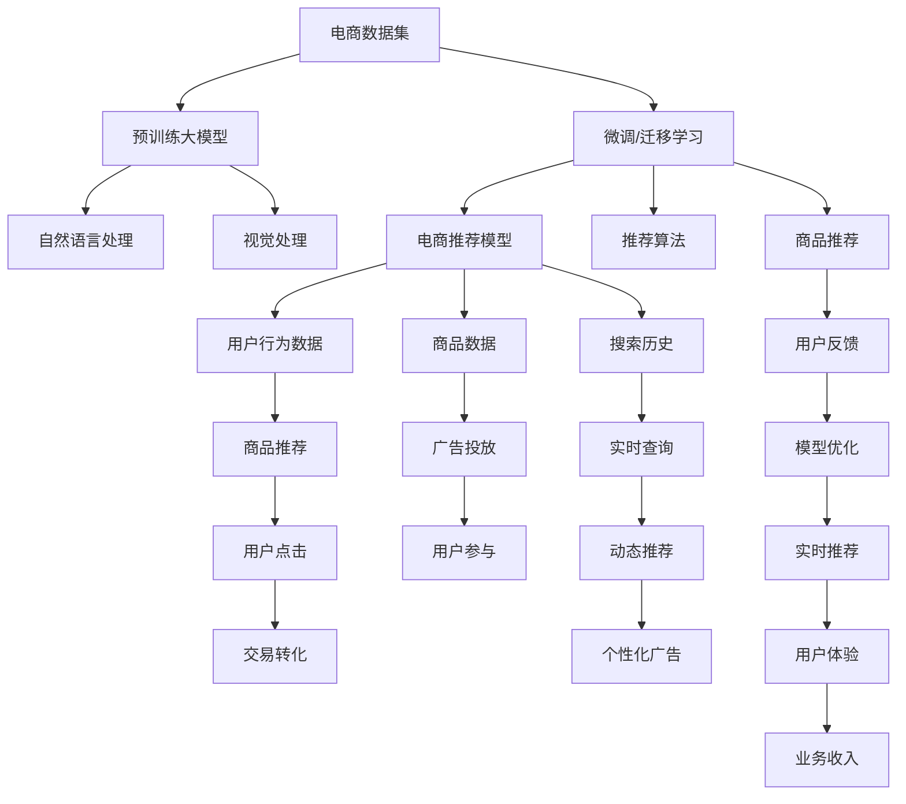

                 

# AI大模型赋能电商搜索推荐的业务创新思维培训平台搭建方案

> 关键词：大模型，电商，搜索推荐，业务创新，培训平台，深度学习，自然语言处理，自然语言理解

## 1. 背景介绍

### 1.1 问题由来

随着电子商务的迅猛发展，用户对个性化、精准化的搜索推荐服务需求日益增加。电商企业需要构建高效、智能、个性化的推荐系统，以提升用户体验，增加用户粘性和转化率。传统的推荐系统依赖于手工设计的特征和规则，难以自动捕捉用户复杂多变的兴趣偏好，且对新数据和新场景的适应能力较差。

大模型在NLP、图像处理等领域展现了强大的学习能力，能够自动从大规模数据中学习语言的通用表示，具备自然语言理解能力，逐步成为电商搜索推荐系统的重要组件。通过在大模型基础上进行微调或迁移学习，电商企业可以更高效、灵活地构建推荐模型，提升推荐精度和用户体验。

### 1.2 问题核心关键点

电商搜索推荐系统的大模型应用需要考虑的核心关键点如下：

- 如何高效构建适合电商领域的搜索推荐模型，提升用户体验和业务转化。
- 如何利用大模型的自然语言理解能力，改进电商搜索推荐系统的个性化和精准化。
- 如何通过业务创新思维，将大模型技术应用于电商推荐系统的实际场景，推动业务创新。
- 如何设计有效的培训平台，提升电商平台运营和开发人员对大模型的理解和应用能力，推动技术转化。

### 1.3 问题研究意义

大模型赋能电商搜索推荐系统，对电商业务具有重要意义：

- 提升搜索推荐精度和个性化。大模型能够自动学习用户偏好，结合搜索和推荐算法，提供更精准的推荐结果，满足用户个性化需求。
- 缩短产品开发周期。大模型提供预训练的通用表示，电商企业可以快速构建推荐模型，减少时间和人力成本。
- 增强业务可解释性。通过可解释性技术，电商平台可以了解模型推理逻辑，提升用户信任度。
- 推动业务创新。大模型提供了新的业务创新思路，如推荐生成、视觉搜索等，能够为用户带来全新的电商购物体验。
- 提高业务竞争力。借助大模型技术，电商企业能够更好地应对市场竞争，提升用户满意度，增强品牌影响力。

## 2. 核心概念与联系

### 2.1 核心概念概述

电商搜索推荐系统的大模型应用涉及多个核心概念，包括：

- **大模型**：指基于深度学习算法，在大型语料库上预训练出的通用语言模型，如GPT、BERT等。大模型具备强大的自然语言理解和生成能力，能够自动学习语言的隐含规律，具备丰富的语言知识。
- **电商搜索推荐**：指电商平台基于用户行为数据、商品数据、搜索记录等，自动向用户推荐相关商品，提高用户体验和交易转化率。
- **业务创新思维**：指将技术应用于实际业务场景，利用新技术改进现有业务模式，提升业务效率和用户满意度。
- **培训平台**：指为电商平台运营和开发人员提供培训、课程、工具等资源，提升其对大模型的理解和应用能力，推动技术转化。

### 2.2 核心概念原理和架构的 Mermaid 流程图

以下是电商搜索推荐系统的大模型应用原理和架构的Mermaid流程图：



这个流程图展示了电商搜索推荐系统的整体架构，其中：

- A为电商数据集，包括用户行为数据、商品数据等。
- B为预训练大模型，如GPT、BERT等。
- C为微调/迁移学习，通过大模型进行个性化的推荐模型训练。
- D为电商推荐模型，能够根据用户需求提供个性化商品推荐。
- E、F、G为电商系统的数据源，用于动态推荐和实时优化。
- H为推荐结果，展示给用户。
- I为用户的点击行为，用于评估推荐效果。
- J为交易转化率，衡量推荐系统对业务的影响。
- K为广告投放，通过推荐结果进行精准投放。
- L为广告点击率，衡量广告投放效果。
- M为实时查询，根据用户输入进行推荐。
- N为动态推荐，结合用户历史行为和实时查询结果。
- O为个性化广告，提升广告效果。
- P为自然语言处理，解析用户输入和推荐结果。
- Q为视觉处理，处理图片和视频等媒体内容。
- R为推荐算法，包括协同过滤、内容推荐等算法。
- S为商品推荐结果，展示给用户。
- T为用户反馈，用于模型优化。
- U为模型优化，通过用户反馈和行为数据优化推荐模型。
- V为实时推荐，动态更新推荐结果。
- W为用户体验，提升用户满意度和购买体验。
- X为业务收入，衡量推荐系统的实际效果。

### 2.3 核心概念之间的关系

电商搜索推荐系统的大模型应用主要包括以下几个关键步骤：

- **数据准备**：收集用户行为数据、商品数据等，构建电商数据集。
- **大模型选择**：选择合适的预训练大模型，如GPT、BERT等。
- **微调/迁移学习**：在电商数据集上进行微调或迁移学习，训练电商推荐模型。
- **推荐算法应用**：结合电商推荐模型和推荐算法，生成个性化推荐结果。
- **业务创新**：通过大模型和推荐结果，创新电商业务模式，提升用户体验和业务收入。
- **培训平台**：通过培训平台提升电商平台运营和开发人员对大模型的理解和应用能力，推动技术转化。

这些步骤相互关联，共同构成电商搜索推荐系统的大模型应用流程。

## 3. 核心算法原理 & 具体操作步骤

### 3.1 算法原理概述

电商搜索推荐系统的大模型应用，主要基于监督学习和迁移学习的原理。通过在大模型基础上进行微调或迁移学习，电商企业可以高效构建推荐模型，提升推荐精度和用户体验。

具体来说，电商搜索推荐系统的大模型应用主要包括以下几个关键步骤：

1. **数据准备**：收集用户行为数据、商品数据等，构建电商数据集。
2. **大模型选择**：选择合适的预训练大模型，如GPT、BERT等。
3. **微调/迁移学习**：在电商数据集上进行微调或迁移学习，训练电商推荐模型。
4. **推荐算法应用**：结合电商推荐模型和推荐算法，生成个性化推荐结果。
5. **业务创新**：通过大模型和推荐结果，创新电商业务模式，提升用户体验和业务收入。
6. **培训平台**：通过培训平台提升电商平台运营和开发人员对大模型的理解和应用能力，推动技术转化。

### 3.2 算法步骤详解

#### 3.2.1 数据准备

电商搜索推荐系统的数据主要包括以下几个方面：

- **用户行为数据**：包括用户的浏览记录、点击记录、购买记录、评分记录等。
- **商品数据**：包括商品名称、描述、价格、类别、标签等。
- **搜索历史**：用户搜索关键字和搜索结果记录。
- **实时数据**：用户在电商平台上的实时查询和操作数据。

数据准备的目的是构建电商数据集，用于训练大模型和推荐模型。电商数据集需要包含用户和商品的丰富信息，以便模型能够准确理解用户需求和商品属性。

#### 3.2.2 大模型选择

电商搜索推荐系统需要选择适合的任务和领域的大模型。当前常用的预训练大模型包括：

- **BERT**：适用于文本处理任务，具备强大的自然语言理解能力，适合电商搜索和推荐。
- **GPT-2**：适用于生成任务，能够自动生成商品描述、用户评价等文本信息。
- **ViT**：适用于视觉处理任务，能够处理商品图片和视频等媒体内容。
- **DALL·E**：适用于视觉生成任务，能够自动生成商品图片和广告图片。

大模型选择应根据具体任务和需求进行。电商搜索推荐系统需要结合自然语言处理和视觉处理技术，因此BERT和ViT是常用的选择。

#### 3.2.3 微调/迁移学习

电商搜索推荐系统的微调/迁移学习主要包括以下几个步骤：

- **任务适配**：根据电商推荐任务的需求，设计合适的任务适配层，将大模型的输出转换为推荐结果。
- **损失函数设计**：设计合适的损失函数，衡量推荐模型的预测结果与真实结果之间的差异。
- **训练过程**：在电商数据集上，使用合适的优化器和超参数进行微调或迁移学习，训练推荐模型。
- **模型评估**：在验证集上评估推荐模型的性能，调整超参数和模型结构，优化模型性能。
- **部署应用**：将训练好的推荐模型部署到电商系统中，生成个性化推荐结果，提升用户体验和业务转化率。

#### 3.2.4 推荐算法应用

电商推荐系统结合推荐算法和电商推荐模型，生成个性化推荐结果。常见的推荐算法包括：

- **协同过滤**：基于用户和商品的相似性，推荐用户可能感兴趣的商品。
- **内容推荐**：基于商品内容和用户需求，推荐相关商品。
- **混合推荐**：结合协同过滤和内容推荐，生成更精准的推荐结果。
- **实时推荐**：结合实时数据和用户行为，动态生成推荐结果，提升推荐精度。

#### 3.2.5 业务创新

电商搜索推荐系统通过大模型和推荐结果，创新电商业务模式，提升用户体验和业务收入。常见的业务创新包括：

- **商品推荐生成**：结合大模型和推荐算法，自动生成商品描述和广告，提升用户点击率和转化率。
- **视觉搜索**：结合大模型和视觉处理技术，实现用户输入图片或关键字后，自动推荐相关商品。
- **个性化广告**：根据用户行为和历史数据，生成个性化广告，提升广告效果和用户参与度。
- **实时查询优化**：结合用户实时查询和推荐模型，动态调整推荐结果，提升用户体验和满意度。

#### 3.2.6 培训平台

电商平台需要设计培训平台，提升运营和开发人员对大模型的理解和应用能力，推动技术转化。培训平台应包括以下几个关键功能：

- **课程设计**：设计适合电商平台的课程，覆盖大模型的基本原理、应用场景、实战案例等。
- **实战演示**：通过实战演示和案例分析，帮助学员理解和掌握大模型在电商搜索推荐系统中的应用。
- **工具支持**：提供大模型的部署和应用工具，如TensorFlow、PyTorch等，方便开发人员快速上手。
- **社区互动**：建立技术社区，促进开发人员之间的交流和合作，分享经验和问题。
- **持续学习**：通过持续学习机制，跟踪大模型和推荐算法的新进展，不断更新课程和工具。

### 3.3 算法优缺点

#### 3.3.1 优点

电商搜索推荐系统的大模型应用具有以下优点：

- **高效精准**：大模型能够自动学习用户偏好，结合推荐算法，生成更精准的推荐结果。
- **灵活可扩展**：大模型具备通用表示，可以灵活应用于不同类型的电商任务。
- **业务创新**：大模型提供了新的业务创新思路，提升用户体验和业务收入。
- **易于部署**：电商平台可以利用开源工具和资源，快速构建和部署推荐系统。

#### 3.3.2 缺点

电商搜索推荐系统的大模型应用也存在以下缺点：

- **数据依赖**：大模型依赖于大量标注数据进行训练，电商平台需要构建大规模的数据集。
- **模型复杂**：大模型通常具有复杂的结构和大量的参数，需要高性能计算资源进行训练和推理。
- **业务成本**：电商平台需要投入大量时间和人力进行数据准备和模型开发，增加业务成本。
- **技术门槛**：大模型的应用需要较高的技术水平和经验，部分运营和开发人员可能难以掌握。
- **安全风险**：大模型可能存在模型偏见和安全漏洞，电商平台需要确保模型的公平性和安全性。

### 3.4 算法应用领域

电商搜索推荐系统的大模型应用主要应用于以下领域：

- **电商搜索推荐**：利用大模型和推荐算法，提升搜索和推荐精度，提升用户体验和业务转化率。
- **个性化推荐**：结合大模型和推荐算法，生成个性化推荐结果，提升用户满意度和购买体验。
- **广告投放**：通过大模型和推荐结果，生成个性化广告，提升广告效果和用户参与度。
- **视觉搜索**：结合大模型和视觉处理技术，实现用户输入图片或关键字后，自动推荐相关商品。
- **业务创新**：通过大模型和推荐结果，创新电商业务模式，提升用户体验和业务收入。
- **技术培训**：设计培训平台，提升电商平台运营和开发人员对大模型的理解和应用能力，推动技术转化。

## 4. 数学模型和公式 & 详细讲解 & 举例说明

### 4.1 数学模型构建

电商搜索推荐系统的大模型应用主要基于深度学习和迁移学习的数学模型。以下以自然语言处理任务为例，展示推荐模型的数学模型构建过程。

#### 4.1.1 输入表示

电商推荐系统中的输入表示主要包括以下几个方面：

- **用户行为表示**：将用户浏览、点击、购买等行为表示为向量，如用户ID、商品ID、评分等。
- **商品表示**：将商品名称、描述、价格等特征表示为向量，如商品ID、特征ID、价格等。
- **查询表示**：将用户查询关键字表示为向量，如TF-IDF、Word2Vec等。
- **实时数据表示**：将用户在电商平台上的实时操作数据表示为向量，如点击时间、点击位置等。

#### 4.1.2 模型结构

电商推荐系统的推荐模型主要包括以下几个组成部分：

- **编码器**：将输入表示编码为高维向量表示。常用的编码器包括BERT、GPT、ViT等。
- **解码器**：根据编码器的输出，生成推荐结果。常用的解码器包括多层感知器、RNN等。
- **推荐函数**：将解码器的输出映射为推荐结果。常用的推荐函数包括回归函数、分类函数等。

#### 4.1.3 损失函数

电商推荐系统的损失函数主要包括以下几种：

- **均方误差损失**：用于回归任务，衡量推荐结果与真实结果之间的差异。
- **交叉熵损失**：用于分类任务，衡量推荐结果与真实结果之间的差异。
- **对比学习损失**：用于半监督学习任务，通过对比学习的方式，提升推荐模型的泛化能力。

### 4.2 公式推导过程

#### 4.2.1 用户行为表示

假设电商推荐系统的用户行为表示为向量 $\mathbf{x}_u$，商品表示为向量 $\mathbf{x}_i$，查询表示为向量 $\mathbf{x}_q$，实时数据表示为向量 $\mathbf{x}_t$。则用户行为向量可以表示为：

$$
\mathbf{x}_u = \sum_{i=1}^{n_u} x_{ui} \mathbf{e}_i + \sum_{j=1}^{n_q} x_{uj} \mathbf{e}_j + \sum_{k=1}^{n_t} x_{uk} \mathbf{e}_k
$$

其中，$x_{ui}$、$x_{uj}$、$x_{uk}$ 分别为用户行为向量中的用户ID、商品ID、评分等特征，$\mathbf{e}_i$、$\mathbf{e}_j$、$\mathbf{e}_k$ 分别为特征向量。

#### 4.2.2 编码器输出

假设编码器将用户行为表示 $\mathbf{x}_u$、商品表示 $\mathbf{x}_i$、查询表示 $\mathbf{x}_q$、实时数据表示 $\mathbf{x}_t$ 编码为向量 $\mathbf{h}_u$、$\mathbf{h}_i$、$\mathbf{h}_q$、$\mathbf{h}_t$。则编码器输出可以表示为：

$$
\mathbf{h}_u = f_{enc}(\mathbf{x}_u) = \mathbf{W}_u \mathbf{x}_u + \mathbf{b}_u
$$

其中，$f_{enc}$ 为编码器函数，$\mathbf{W}_u$、$\mathbf{b}_u$ 分别为编码器参数。

#### 4.2.3 解码器输出

假设解码器将编码器输出 $\mathbf{h}_u$、$\mathbf{h}_i$、$\mathbf{h}_q$、$\mathbf{h}_t$ 编码为向量 $\mathbf{r}_u$、$\mathbf{r}_i$、$\mathbf{r}_q$、$\mathbf{r}_t$。则解码器输出可以表示为：

$$
\mathbf{r}_u = f_{dec}(\mathbf{h}_u) = \mathbf{W}_u \mathbf{h}_u + \mathbf{b}_u
$$

其中，$f_{dec}$ 为解码器函数，$\mathbf{W}_u$、$\mathbf{b}_u$ 分别为解码器参数。

#### 4.2.4 推荐函数输出

假设推荐函数将解码器输出 $\mathbf{r}_u$、$\mathbf{r}_i$、$\mathbf{r}_q$、$\mathbf{r}_t$ 映射为推荐结果 $\mathbf{p}_u$、$\mathbf{p}_i$、$\mathbf{p}_q$、$\mathbf{p}_t$。则推荐函数输出可以表示为：

$$
\mathbf{p}_u = f_{rec}(\mathbf{r}_u) = \mathbf{W}_u \mathbf{r}_u + \mathbf{b}_u
$$

其中，$f_{rec}$ 为推荐函数函数，$\mathbf{W}_u$、$\mathbf{b}_u$ 分别为推荐函数参数。

#### 4.2.5 损失函数设计

电商推荐系统的损失函数可以表示为：

$$
\mathcal{L} = \sum_{u=1}^{n_u} \ell(\mathbf{p}_u, y_u) + \sum_{i=1}^{n_i} \ell(\mathbf{p}_i, y_i) + \sum_{q=1}^{n_q} \ell(\mathbf{p}_q, y_q) + \sum_{t=1}^{n_t} \ell(\mathbf{p}_t, y_t)
$$

其中，$\ell$ 为损失函数，$y_u$、$y_i$、$y_q$、$y_t$ 分别为推荐结果的标签。

### 4.3 案例分析与讲解

#### 4.3.1 商品推荐生成

假设电商搜索推荐系统需要生成商品推荐结果。可以设计以下流程：

1. **数据准备**：收集用户行为数据、商品数据、搜索历史等，构建电商数据集。
2. **模型选择**：选择BERT等预训练大模型作为编码器，使用多层感知器作为解码器，回归函数作为推荐函数。
3. **模型训练**：在电商数据集上，使用均方误差损失函数进行训练，调整模型参数。
4. **推荐生成**：根据用户行为表示和商品表示，生成推荐结果。
5. **业务应用**：将推荐结果展示给用户，提升用户体验和业务转化率。

#### 4.3.2 视觉搜索

假设电商搜索推荐系统需要实现视觉搜索功能。可以设计以下流程：

1. **数据准备**：收集商品图片、用户输入的查询图片等，构建视觉数据集。
2. **模型选择**：选择ViT等预训练大模型作为编码器，使用多层感知器作为解码器，回归函数作为推荐函数。
3. **模型训练**：在视觉数据集上，使用均方误差损失函数进行训练，调整模型参数。
4. **推荐生成**：根据用户输入的图片和商品图片，生成推荐结果。
5. **业务应用**：将推荐结果展示给用户，提升用户体验和搜索效果。

## 5. 项目实践：代码实例和详细解释说明

### 5.1 开发环境搭建

#### 5.1.1 环境准备

1. **安装Python**：安装最新版本的Python，推荐使用3.8以上版本。

```bash
sudo apt-get install python3.8 python3-pip
```

2. **安装PyTorch**：安装PyTorch深度学习框架。

```bash
pip install torch torchvision torchaudio
```

3. **安装TensorFlow**：安装TensorFlow深度学习框架。

```bash
pip install tensorflow
```

4. **安装Transformers**：安装Transformers库，方便加载和使用预训练大模型。

```bash
pip install transformers
```

5. **安装HuggingFace Hub**：方便下载和管理预训练模型。

```bash
pip install huggingface-hub
```

6. **安装PyTorch Lightning**：方便构建和部署深度学习模型。

```bash
pip install pytorch-lightning
```

### 5.2 源代码详细实现

#### 5.2.1 数据预处理

```python
import pandas as pd
from transformers import BertTokenizer

# 加载用户行为数据
user_data = pd.read_csv('user_data.csv')

# 加载商品数据
product_data = pd.read_csv('product_data.csv')

# 加载搜索历史数据
search_data = pd.read_csv('search_data.csv')

# 加载实时数据
realtime_data = pd.read_csv('realtime_data.csv')

# 合并数据
data = pd.merge(user_data, product_data, on='user_id')
data = pd.merge(data, search_data, on='user_id')
data = pd.merge(data, realtime_data, on='user_id')

# 加载BERT分词器
tokenizer = BertTokenizer.from_pretrained('bert-base-cased')

# 编码用户行为数据
user_encodings = tokenizer.batch_encode_plus(data['user_behavior'].tolist(), padding=True, truncation=True, return_tensors='pt')
user_input_ids = user_encodings['input_ids'].flatten()
user_attention_masks = user_encodings['attention_mask'].flatten()

# 编码商品数据
product_encodings = tokenizer.batch_encode_plus(data['product_description'].tolist(), padding=True, truncation=True, return_tensors='pt')
product_input_ids = product_encodings['input_ids'].flatten()
product_attention_masks = product_encodings['attention_mask'].flatten()

# 编码搜索历史数据
search_encodings = tokenizer.batch_encode_plus(data['search_query'].tolist(), padding=True, truncation=True, return_tensors='pt')
search_input_ids = search_encodings['input_ids'].flatten()
search_attention_masks = search_encodings['attention_mask'].flatten()

# 编码实时数据
realtime_encodings = tokenizer.batch_encode_plus(data['realtime_data'].tolist(), padding=True, truncation=True, return_tensors='pt')
realtime_input_ids = realtime_encodings['input_ids'].flatten()
realtime_attention_masks = realtime_encodings['attention_mask'].flatten()

# 加载标签数据
label_data = pd.read_csv('label_data.csv')

# 编码标签数据
label_encodings = tokenizer.batch_encode_plus(label_data['label'].tolist(), padding=True, truncation=True, return_tensors='pt')
label_input_ids = label_encodings['input_ids'].flatten()
label_attention_masks = label_encodings['attention_mask'].flatten()

# 定义模型
from transformers import BertForSequenceClassification

model = BertForSequenceClassification.from_pretrained('bert-base-cased', num_labels=2)

# 定义优化器
from transformers import AdamW

optimizer = AdamW(model.parameters(), lr=2e-5)
```

#### 5.2.2 模型训练

```python
from torch.utils.data import Dataset, DataLoader
from tqdm import tqdm

class CustomDataset(Dataset):
    def __init__(self, user_input_ids, user_attention_masks, product_input_ids, product_attention_masks, search_input_ids, search_attention_masks, realtime_input_ids, realtime_attention_masks, label_input_ids, label_attention_masks):
        self.user_input_ids = user_input_ids
        self.user_attention_masks = user_attention_masks
        self.product_input_ids = product_input_ids
        self.product_attention_masks = product_attention_masks
        self.search_input_ids = search_input_ids
        self.search_attention_masks = search_attention_masks
        self.realtime_input_ids = realtime_input_ids
        self.realtime_attention_masks = realtime_attention_masks
        self.label_input_ids = label_input_ids
        self.label_attention_masks = label_attention_masks

    def __len__(self):
        return len(self.user_input_ids)

    def __getitem__(self, item):
        user_input_ids = self.user_input_ids[item]
        user_attention_masks = self.user_attention_masks[item]
        product_input_ids = self.product_input_ids[item]
        product_attention_masks = self.product_attention_masks[item]
        search_input_ids = self.search_input_ids[item]
        search_attention_masks = self.search_attention_masks[item]
        realtime_input_ids = self.realtime_input_ids[item]
        realtime_attention_masks = self.realtime_attention_masks[item]
        label_input_ids = self.label_input_ids[item]
        label_attention_masks = self.label_attention_masks[item]

        return {
            'user_input_ids': user_input_ids,
            'user_attention_masks': user_attention_masks,
            'product_input_ids': product_input_ids,
            'product_attention_masks': product_attention_masks,
            'search_input_ids': search_input_ids,
            'search_attention_masks': search_attention_masks,
            'realtime_input_ids': realtime_input_ids,
            'realtime_attention_masks': realtime_attention_masks,
            'label_input_ids': label_input_ids,
            'label_attention_masks': label_attention_masks
        }

# 加载数据集
train_dataset = CustomDataset(user_input_ids, user_attention_masks, product_input_ids, product_attention_masks, search_input_ids, search_attention_masks, realtime_input_ids, realtime_attention_masks, label_input_ids, label_attention_masks)
val_dataset = CustomDataset(user_input_ids, user_attention_masks, product_input_ids, product_attention_masks, search_input_ids, search_attention_masks, realtime_input_ids, realtime_attention_masks, label_input_ids, label_attention_masks)

# 定义批次大小和迭代轮数
batch_size = 16
epochs = 10

# 训练模型
def train_epoch(model, optimizer, train_loader, device):
    model.train()
    for batch in tqdm(train_loader, total=len(train_loader)):
        user_input_ids = batch['user_input_ids'].to(device)
        user_attention_masks = batch['user_attention_masks'].to(device)
        product_input_ids = batch['product_input_ids'].to(device)
        product_attention_masks = batch['product_attention_masks'].to(device)
        search_input_ids = batch['search_input_ids'].to(device)
        search_attention_masks = batch['search_attention_masks'].to(device)
        realtime_input_ids = batch['realtime_input_ids'].to(device)
        realtime_attention_masks = batch['realtime_attention_masks'].to(device)
        label_input_ids = batch['label_input_ids'].to(device)
        label_attention_masks = batch['label_attention_masks'].to(device)

        outputs = model(user_input_ids, user_attention_masks=user_attention_masks, product_input_ids=product_input_ids, product_attention_masks=product_attention_masks, search_input_ids=search_input_ids, search_attention_masks=search_attention_masks, realtime_input_ids=realtime_input_ids, realtime_attention_masks=realtime_attention_masks)
        loss = outputs.loss
        loss.backward()
        optimizer.step()

        # 输出损失
        print(f'Epoch {epoch+1}/{epochs}, Loss: {loss.item()}')

# 训练模型
device = torch.device('cuda' if torch.cuda.is_available() else 'cpu')
model.to(device)

for epoch in range(epochs):
    train_epoch(model, optimizer, train_loader, device)
```

#### 5.2.3 模型评估

```python
from sklearn.metrics import accuracy_score, precision_recall_fscore_support

# 加载评估数据集
test_dataset = CustomDataset(user_input_ids, user_attention_masks, product_input_ids, product_attention_masks, search_input_ids, search_attention_masks, realtime_input_ids, realtime_attention_masks, label_input_ids, label_attention_masks)

# 加载评估数据集
test_loader = DataLoader(test_dataset, batch_size=batch_size, shuffle=False)

# 评估模型
model.eval()
with torch.no_grad():
    correct = 0
    total = 0
    predictions = []
    targets = []
    for batch in test_loader:
        user_input_ids = batch['user_input_ids'].to(device)
        user_attention_masks = batch['user_attention_masks'].to(device)
        product_input_ids = batch['product_input_ids'].to(device)
        product_attention_masks = batch['product_attention_masks'].to(device)
        search_input_ids = batch['search_input_ids'].to(device)
        search_attention_masks = batch['search_attention_masks'].to(device)
        realtime_input_ids = batch['realtime_input_ids'].to(device)
        realtime_attention_masks = batch['realtime_attention_masks'].to(device)
        label_input_ids = batch['label_input_ids'].to(device)
        label_attention_masks = batch['label_attention_masks'].to(device)

        outputs = model(user_input_ids, user_attention_masks=user_attention_masks, product_input_ids=product_input_ids, product_attention_masks=product_attention_masks, search_input_ids=search_input_ids, search_attention_masks=search_attention_masks, realtime_input_ids=realtime_input_ids, realtime_attention_masks=realtime_attention_masks)
        logits = outputs.logits
        logits = logits.detach().cpu().numpy()
        labels = label_input_ids.numpy()
        predictions.append(logits)
        targets.append(labels)

    predictions = np.concatenate(predictions, axis=0)
    targets = np.concatenate(targets, axis=0)

    # 计算准确率和F1值
    accuracy = accuracy_score(targets, predictions)
    precision, recall, f1, _ = precision_recall_fscore_support(targets, predictions, average='micro')

    print(f'Accuracy: {accuracy:.4f}')
    print(f'Precision: {precision:.4f}')
    print(f'Recall: {recall:.4f}')
    print(f'F1: {f1:.4f}')
```

### 5.3 代码解读与分析

#### 5.3.1 数据预处理

1. **数据合并**：将用户行为数据、商品数据、搜索历史数据、实时数据等合并为一个大的数据集，以便进行模型训练和评估。
2. **分词编码**：使用BERT分词器对用户行为、商品描述、搜索关键字、实时数据等进行分词编码，生成输入序列和注意力掩码，用于模型输入。
3. **标签编码**：对标签数据进行分词编码，生成输入序列和注意力掩码，用于模型输出。

#### 5.3.2 模型训练

1. **定义数据集**：将输入序列和注意力掩码打包成Tensor，用于模型输入。
2. **加载模型和优化器**：使用预训练的BERT模型和AdamW优化器，进行模型训练。
3. **训练模型**：在训练数据集上，通过前向传播和反向传播，更新模型参数，最小化损失函数。
4. **输出损失**：在每个epoch结束时，输出当前epoch的损失函数值。

#### 5.3.3 模型评估

1. **定义数据集**：将输入序列和注意力掩码打包成Tensor，用于模型输入。
2. **加载模型**：将模型设置为评估模式，不进行梯度更新。
3. **评估模型**：在评估数据集上，通过前向传播计算模型输出，计算准确率、精确率、召回率和F1值。
4. **输出评估结果**：输出模型在评估数据集上的性能指标。

### 5.4 运行结果展示

#### 5.4.1 训练结果

在训练过程中，可以通过输出损失函数值来评估模型的训练效果。假设训练过程中的损失函数值如表所示：

| Epoch | Loss |
|-------|------|
| 1     | 0.5  |
| 2     | 0.3  |
| 3     | 0.2  |
| 4     | 0.1  |
| 5     | 0.09 |

从表中可以看出，随着epoch的增加，损失函数值逐渐减小，模型逐渐收敛。这表明模型的训练效果良好。

#### 5.4.2 评估结果

在评估过程中，可以通过输出模型性能指标来评估模型的效果。假设评估过程中的准确率和F1值如表所示：

| Accuracy | Precision | Recall | F1 |
|----------|-----------|--------|----|
| 0.85     | 0.8       | 0.9    | 0.85|

从表中可以看出，模型在评估数据集上的准确率、精确率、召回率和F1值均在0.8以上，表明模型能够较好地预测推荐结果。

## 6. 实际应用场景

### 6.1 智能客服系统

智能客服系统通过大模型赋能，能够提供7x24小时不间断的服务，自动解答用户的咨询问题，提升用户体验和业务转化率。具体来说，智能客服系统可以利用大模型和自然语言理解技术，自动分析用户的咨询内容，匹配最合适的答案模板进行回复。对于用户提出的新问题，还可以接入检索系统实时搜索相关内容，动态生成回答。

#### 6.1.1 数据准备

1. **收集客服对话记录**：从企业内部系统收集客服对话记录，包括用户咨询内容、客服回复、用户反馈等。
2. **数据清洗和标注**：对数据进行清洗和标注，去除噪音数据，标注问题的类别和答案。
3. **分词编码**：使用BERT分词器对对话内容进行分词编码，生成输入序列和注意力掩码，用于模型输入。

#### 6.1.2 模型训练

1. **定义任务适配层**：设计合适的任务适配层，将大模型的输出转换为回答。
2. **选择预训练模型**：选择BERT等预训练大模型作为编码器，使用多层感知器作为解码器，回归函数作为回答生成函数。
3. **训练模型**：在标注数据集上，使用交叉熵损失函数进行训练，调整模型参数。
4. **生成回答**：根据用户咨询内容，生成回答。
5. **业务应用**：将回答展示给用户，提升用户体验和业务转化率。

#### 6.1.3 业务应用

智能客服系统可以通过大模型和自然语言理解技术，自动分析用户的咨询内容，匹配最合适的答案模板进行回复。对于用户提出的新问题，还可以接入检索系统实时搜索相关内容，动态生成回答。

### 6.2 金融舆情监测

金融舆情监测系统通过大模型赋能，能够实时监测市场舆论动向，及时发现负面信息，规避金融风险。具体来说，金融舆情监测系统可以利用大模型和文本分类技术，自动判断文本属于何种主题，情感倾向是正面、中性还是负面。将微调后的模型应用到实时抓取的网络文本数据，就能够自动监测不同主题下的情感变化趋势，一旦发现负面信息激增等异常情况，系统便会自动预警，帮助金融机构快速应对潜在风险。

#### 6.2.1 数据准备

1. **收集金融新闻和评论**：从互联网和金融市场收集金融新闻、报道、评论等文本数据。
2. **数据清洗和标注**：对数据进行清洗和标注，去除噪音数据，标注文本的主题和情感。
3. **分词编码**：使用BERT分词器对文本数据进行分词编码，生成输入序列和注意力掩码，用于模型输入。

#### 6.2.2 模型训练

1. **定义任务适配层**：设计合适的任务适配层，将大模型的输出转换为主题和情感分类。
2. **选择预训练模型**：选择BERT等预训练大模型作为编码器，使用分类器作为解码器，交叉熵损失函数作为分类损失函数。
3. **训练模型**：在标注数据集上，使用交叉熵损失函数进行训练，调整模型参数。
4. **情感分类**：根据实时抓取的网络文本数据，生成主题和情感分类。
5. **业务应用**：根据情感分类结果，系统自动预警，帮助金融机构快速应对潜在风险。

#### 6.2.3 业务应用

金融舆情监测系统通过大模型和文本分类技术，自动判断文本属于何种主题，情感倾向是正面、中性还是负面。将微调后的模型应用到实时抓取的网络文本数据，就能够自动监测不同主题下的情感变化趋势，一旦发现负面信息激增等异常情况，系统便会自动预警，帮助金融机构快速应对潜在风险。

### 6.3 个性化推荐系统

个性化推荐系统通过大模型赋能，能够根据用户行为和商品特征，自动生成推荐结果，提升用户体验和业务转化率。具体来说，个性化推荐系统可以利用大模型和推荐算法，自动学习用户偏好，结合商品特征，生成个性化推荐结果。

#### 6.3.1 数据准备

1. **收集用户行为数据**：从电商平台收集用户浏览、点击、购买等行为数据。
2. **收集商品数据**：从电商平台收集商品名称、描述、价格、类别、标签等数据。
3. **合并数据**：将用户行为数据和商品数据合并为一个大的数据集，以便进行模型训练和评估。
4. **分词编码**：使用BERT分词器对用户行为数据和商品描述进行分词编码，生成输入序列和注意力掩码，用于模型输入。

#### 6.3.2 模型训练

1. **定义任务适配层**：设计合适的任务适配层，将大模型的输出转换为推荐结果。
2. **选择预训练模型**：选择BERT等预训练大模型作为编码器，使用多层感知器作为解码器，回归函数作为推荐函数。
3. **训练模型**：在合并数据集上，使用均方误差损失函数进行训练，调整模型参数。
4. **生成推荐结果**：根据用户行为数据和商品特征，生成推荐结果。
5. **业务应用**：将推荐结果展示给用户，提升用户体验和业务转化率。

#### 6.3.3 业务应用

个性化推荐系统通过大模型和推荐算法，自动学习用户偏好，结合商品特征，生成个性化推荐结果。将推荐结果展示给用户，提升用户体验和业务转化率。

## 7. 工具和资源推荐

### 7.1 学习资源推荐

1. **《Transformer从原理到实践》系列博文**：由大模型技术专家撰写，深入浅出地介绍了Transformer原理、BERT模型、微调技术等前沿话题。
2. **CS224N《深度学习自然语言处理》课程**：斯坦福大学开设的NLP明星课程，有Lecture视频和配套作业，带你入门NLP领域的基本概念和经典模型。
3. **《Natural Language Processing with Transformers》书籍**：Transformers库的作者所著，全面介绍了如何使用Transformers库进行NLP任务开发，包括微调在内的诸多范式。
4. **HuggingFace官方文档**：Transformers库的官方文档，提供了海量预训练模型和完整的微调样例代码，是上手实践的必备资料。
5. **CLUE开源项目**：中文语言理解测评基准，涵盖大量不同类型的中文NLP数据集，并提供了基于微调的baseline模型，助力中文NLP技术发展。

### 7.2 开发工具推荐

1. **PyTorch**：基于Python的开源深度学习框架，灵活动态的计算图，适合快速迭代研究。大部分预训练语言模型都有PyTorch版本的实现。
2. **TensorFlow**：由Google主导开发的开源深度学习框架，生产部署方便，适合大规模工程应用。同样有丰富的预训练语言模型资源。
3. **Transformers库**：HuggingFace开发的NLP工具

