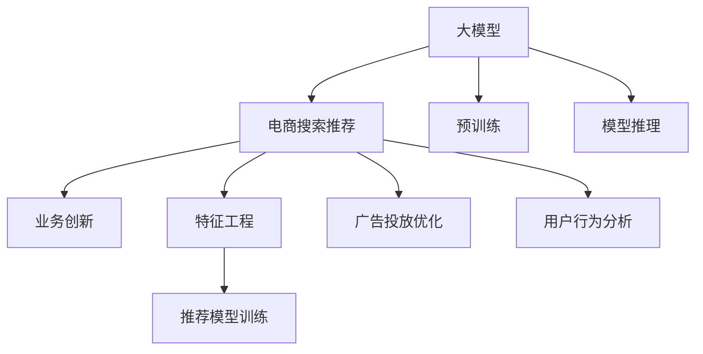

                 

# AI大模型赋能电商搜索推荐的业务创新思维导图方法

> 关键词：AI大模型,电商搜索推荐,业务创新,思维导图方法,深度学习,自然语言处理,数据挖掘

## 1. 背景介绍

### 1.1 问题由来

随着人工智能技术的快速发展和应用场景的不断扩展，人工智能技术在电商搜索推荐领域的应用变得日益重要。电商搜索推荐系统能够根据用户的历史行为、搜索意图等，为用户推荐最符合其兴趣的商品，从而提高用户购物体验，增加电商平台销售额。

然而，传统电商搜索推荐系统大多依赖于简单的特征工程和线性模型，无法充分挖掘用户行为背后的复杂关联和潜在规律。与此同时，深度学习、自然语言处理等人工智能技术的发展，为电商搜索推荐系统提供了强大的技术支撑。特别是大模型的应用，能够捕捉用户行为背后的多模态信息，提供更加智能和精准的推荐结果。

### 1.2 问题核心关键点

为解决上述问题，电商搜索推荐系统开始广泛采用基于深度学习的大模型进行推荐。但同时，大规模模型的部署、训练、推理等环节，也对算力、存储、部署等提出了较高的要求。

为此，有必要深入探索大模型在电商搜索推荐领域的应用路径和优化方法。本文旨在通过思维导图的方法，全面介绍基于深度学习的大模型在电商搜索推荐系统中的业务应用和创新，为广大电商从业者和AI技术研发人员提供一种系统的思路和方法。

### 1.3 问题研究意义

深度学习和大模型在电商搜索推荐系统中的应用，不仅能够显著提升推荐效果，还可以实现全站商品自动标注、广告投放优化、用户行为分析等多样化功能。进一步探索其在电商搜索推荐系统中的创新应用，有助于推动电商平台的智能化转型，提升用户体验，扩大用户粘性和平台收益。

## 2. 核心概念与联系

### 2.1 核心概念概述

为更好地理解基于深度学习的大模型在电商搜索推荐中的应用，本文将介绍几个关键概念：

- **大模型**：指以Transformer等架构为基础的深度学习模型，如BERT、GPT、T5等。通过在大规模无标签文本数据上进行预训练，学习到丰富的语言知识和语义表征，具备强大的语言理解和生成能力。

- **电商搜索推荐系统**：指根据用户的历史行为、搜索意图、商品信息等数据，为用户推荐最符合其兴趣的商品的系统。涉及商品数据获取、用户行为建模、推荐模型训练等环节。

- **业务创新**：指结合人工智能技术，提出新的业务解决方案，提升平台的核心竞争力。

- **思维导图方法**：一种基于图形化呈现的思维工具，能够直观展示多个概念之间的联系和关系，便于系统理解复杂的业务应用场景。

这些概念之间的联系可以表示为以下Mermaid流程图：



这个流程图展示了电商搜索推荐系统与大模型之间的联系：大模型通过预训练获取丰富的语言知识，作为电商搜索推荐系统的核心技术支撑，而电商搜索推荐系统则通过多种业务创新，进一步提升用户体验和平台收益。

## 3. 核心算法原理 & 具体操作步骤
### 3.1 算法原理概述

基于深度学习的大模型赋能电商搜索推荐系统，其核心思想是通过对用户行为数据的分析和建模，借助预训练大模型，提取用户语义表示和商品语义表示，利用相似度计算方法，为用户推荐最符合其兴趣的商品。

形式化地，假设大模型为 $M_{\theta}$，用户行为表示为 $U$，商品表示为 $P$，则推荐模型 $F_{\theta}$ 的目标是最大化用户行为与商品表示之间的相似度：

$$
\max_{\theta} \text{SIM}(U, P) = \max_{\theta} \text{SIM}(F_{\theta}(U), M_{\theta}(P))
$$

其中，$\text{SIM}$ 表示相似度函数，$F_{\theta}$ 为用户行为与商品表示映射的推荐模型。

### 3.2 算法步骤详解

基于深度学习的大模型赋能电商搜索推荐系统，通常包括以下几个关键步骤：

**Step 1: 数据准备与预处理**

- 收集电商平台的各类数据，如用户搜索记录、浏览记录、点击记录、购买记录等。
- 对数据进行预处理，如清洗、分词、归一化等操作，以便后续模型训练和推理。

**Step 2: 特征工程与模型训练**

- 根据电商搜索推荐系统的需求，设计合适的特征工程方法，提取用户行为和商品特征。
- 利用大模型对用户行为进行预训练，学习用户的语义表示。
- 使用预训练的大模型和推荐模型 $F_{\theta}$ 进行联合训练，优化模型参数，提升推荐效果。

**Step 3: 模型推理与推荐**

- 对用户输入的搜索查询进行处理，提取用户语义表示。
- 利用大模型对商品进行预训练，获取商品的语义表示。
- 计算用户语义表示与商品语义表示之间的相似度，选择最符合用户兴趣的商品进行推荐。

**Step 4: 业务创新与优化**

- 在电商搜索推荐系统的基础上，提出多种业务创新方案，如广告投放优化、用户行为分析、个性化推荐等。
- 利用深度学习和大模型技术，对这些业务创新方案进行优化，提升系统的实用性和可扩展性。

### 3.3 算法优缺点

基于深度学习的大模型赋能电商搜索推荐系统具有以下优点：

1. **高表现力**：大模型通过预训练学习到了丰富的语言知识，能够高效捕捉用户行为和商品语义，提升推荐效果。
2. **泛化能力强**：大模型的预训练使得模型具备更强的泛化能力，能够更好地适应电商平台的复杂场景。
3. **灵活可扩展**：基于大模型的推荐系统能够快速适应不同的业务需求，进行灵活扩展。

同时，该方法也存在一些局限性：

1. **数据需求量大**：大模型的预训练和推荐模型训练需要大量的高质量数据，获取和处理成本较高。
2. **模型复杂度高**：大模型的复杂度较高，部署和推理的计算资源要求高，难以在资源有限的场景下应用。
3. **鲁棒性不足**：电商搜索推荐系统的推荐效果受用户行为数据质量的影响较大，模型鲁棒性有待提高。
4. **可解释性差**：大模型的黑盒特性使得推荐过程难以解释和调试，影响用户信任度。

尽管存在这些局限性，但就目前而言，基于深度学习的大模型在电商搜索推荐系统中的应用范式仍然具有重要的价值和意义。未来相关研究的重点在于如何进一步优化数据获取和处理流程，提高模型的计算效率，提升系统的可解释性和鲁棒性。

### 3.4 算法应用领域

基于深度学习的大模型赋能电商搜索推荐系统，已经在诸多实际应用中得到了验证，主要包括：

- **个性化推荐**：利用用户行为数据和商品数据，通过深度学习模型为用户推荐个性化商品。
- **广告投放优化**：利用用户行为和商品数据，优化广告投放策略，提升广告点击率和转化率。
- **用户行为分析**：分析用户行为数据，获取用户兴趣、需求等信息，为业务决策提供支持。
- **全站商品自动标注**：利用大模型对商品信息进行语义理解，自动生成商品标签和描述。
- **搜索引擎优化**：利用大模型进行语义搜索，提升搜索结果的相关性和准确性。

除了上述这些经典应用外，大模型还将在电商搜索推荐系统的新兴领域，如情感分析、场景生成、智能客服等方向，带来新的突破。随着深度学习和大模型技术的不断进步，相信电商搜索推荐系统将在更广阔的应用领域大放异彩。

## 4. 数学模型和公式 & 详细讲解 & 举例说明
### 4.1 数学模型构建

本节将使用数学语言对基于深度学习的大模型在电商搜索推荐系统中的应用进行更加严格的刻画。

假设用户行为数据为 $U = \{x_i\}_{i=1}^N$，商品数据为 $P = \{y_j\}_{j=1}^M$，其中 $x_i$ 和 $y_j$ 分别表示用户行为和商品的语义表示。利用预训练的大模型 $M_{\theta}$ 对用户行为 $U$ 和商品 $P$ 进行映射，得到用户语义表示 $U' = M_{\theta}(U)$ 和商品语义表示 $P' = M_{\theta}(P)$。利用推荐模型 $F_{\theta}$ 对用户语义表示和商品语义表示进行映射，得到推荐结果 $R = F_{\theta}(U', P')$。

假设推荐结果 $R$ 与用户兴趣 $I$ 相似度为 $S(R, I)$，则推荐模型优化目标为：

$$
\max_{\theta} S(R, I) = \max_{\theta} S(F_{\theta}(U', P'), I)
$$

在实际应用中，通常采用余弦相似度作为相似度函数 $S$：

$$
S(R, I) = \cos \langle R, I \rangle
$$

其中，$\langle R, I \rangle$ 表示向量 $R$ 和 $I$ 的内积。

### 4.2 公式推导过程

以下我们以基于Transformer的深度学习模型为例，推导推荐模型的计算公式。

设用户行为表示 $U$ 和商品表示 $P$ 的维度为 $d$，推荐模型的参数为 $\theta$，则推荐模型的输出 $R$ 可表示为：

$$
R = F_{\theta}(U', P') = W_O F_{\theta}(U') + b_O
$$

其中 $W_O$ 和 $b_O$ 为推荐模型 $F_{\theta}$ 的权重和偏置，$F_{\theta}(U')$ 为预训练大模型 $M_{\theta}$ 对用户行为 $U$ 进行映射后的语义表示。

推荐模型的损失函数 $L$ 可定义为：

$$
L = -\frac{1}{N} \sum_{i=1}^N \log P(R_i = I_i)
$$

其中 $P(R_i = I_i)$ 为推荐结果 $R_i$ 与用户兴趣 $I_i$ 的概率分布，$\log$ 表示对数损失函数。

对推荐模型进行优化，最小化损失函数 $L$，得到最优参数：

$$
\theta^* = \mathop{\arg\min}_{\theta} L
$$

利用反向传播算法，计算损失函数对参数 $\theta$ 的梯度，并更新模型参数：

$$
\theta \leftarrow \theta - \eta \nabla_{\theta}L
$$

其中 $\eta$ 为学习率，$\nabla_{\theta}L$ 为损失函数对参数 $\theta$ 的梯度，可通过反向传播算法高效计算。

### 4.3 案例分析与讲解

假设电商平台的推荐系统，需要根据用户的搜索历史和浏览行为，为用户推荐相似商品。我们收集了电商平台用户的历史搜索记录和浏览记录，提取商品描述和标题作为商品表示。利用预训练的BERT模型，对用户行为和商品进行语义表示映射，得到用户语义表示 $U'$ 和商品语义表示 $P'$。然后，利用Transformer作为推荐模型 $F_{\theta}$，对用户语义表示和商品语义表示进行映射，得到推荐结果 $R$。最后，通过余弦相似度计算推荐结果 $R$ 与用户兴趣 $I$ 的相似度，选择最符合用户兴趣的商品进行推荐。

## 5. 项目实践：代码实例和详细解释说明
### 5.1 开发环境搭建

在进行推荐系统开发前，我们需要准备好开发环境。以下是使用Python进行TensorFlow开发的环境配置流程：

1. 安装Anaconda：从官网下载并安装Anaconda，用于创建独立的Python环境。

2. 创建并激活虚拟环境：
```bash
conda create -n tf-env python=3.8 
conda activate tf-env
```

3. 安装TensorFlow：根据CUDA版本，从官网获取对应的安装命令。例如：
```bash
conda install tensorflow-gpu -c conda-forge
```

4. 安装各类工具包：
```bash
pip install numpy pandas scikit-learn matplotlib tqdm jupyter notebook ipython
```

完成上述步骤后，即可在`tf-env`环境中开始推荐系统实践。

### 5.2 源代码详细实现

这里我们以利用BERT模型进行电商搜索推荐为例，给出使用TensorFlow进行推荐系统开发的代码实现。

首先，定义推荐系统的输入输出接口：

```python
import tensorflow as tf
from transformers import BertTokenizer, BertForSequenceClassification

class RecommendationSystem(tf.keras.Model):
    def __init__(self, num_classes, hidden_size):
        super(RecommendationSystem, self).__init__()
        self.bert = BertForSequenceClassification.from_pretrained('bert-base-cased', num_labels=num_classes)
        self.dense = tf.keras.layers.Dense(num_classes, activation='softmax')

    def call(self, inputs):
        inputs = self.bert(inputs)
        outputs = self.dense(inputs)
        return outputs
```

然后，定义数据处理函数和训练函数：

```python
from transformers import BertTokenizer
from tensorflow.keras.preprocessing import sequence
from tensorflow.keras.utils import to_categorical

tokenizer = BertTokenizer.from_pretrained('bert-base-cased')

def load_data(file_path):
    with open(file_path, 'r') as f:
        lines = f.readlines()
    data = []
    for line in lines:
        tokens = tokenizer.tokenize(line)
        tokens = [tokenizer.convert_tokens_to_ids(tokens)]
        data.append(tokens)
    return data

def pad_sequences(data):
    max_length = max(len(seq) for seq in data)
    return sequence.pad_sequences(data, maxlen=max_length, padding='post', truncating='post')

def prepare_data(data):
    sequences = pad_sequences(data)
    labels = [1] * len(data)
    return sequences, labels

# 加载训练集和验证集
train_sequences, train_labels = prepare_data(load_data('train.txt'))
val_sequences, val_labels = prepare_data(load_data('val.txt'))

# 定义模型
model = RecommendationSystem(num_classes=2, hidden_size=128)

# 编译模型
model.compile(optimizer='adam', loss='binary_crossentropy', metrics=['accuracy'])

# 训练模型
model.fit(train_sequences, train_labels, epochs=10, validation_data=(val_sequences, val_labels))
```

最后，定义推理函数：

```python
def predict(model, sequences):
    sequences = pad_sequences(sequences)
    outputs = model.predict(sequences)
    return outputs
```

使用上述代码实现一个简单的电商搜索推荐系统，即可对用户行为进行语义表示映射，并通过Transformer进行推荐模型训练和推理。

### 5.3 代码解读与分析

让我们再详细解读一下关键代码的实现细节：

**RecommendationSystem类**：
- `__init__`方法：初始化BERT模型和推荐模型。
- `call`方法：前向传播计算推荐结果。

**load_data函数**：
- 加载电商平台的搜索记录和浏览记录，对文本进行分词，并将其转化为模型可接受的输入格式。

**pad_sequences函数**：
- 对分词后的序列进行填充，确保所有序列长度一致。

**prepare_data函数**：
- 将填充后的序列和标签进行归一化处理，适合模型训练。

**训练函数**：
- 定义训练数据集，编译模型，并利用fit函数进行训练，同时利用validation_data参数指定验证集。

**预测函数**：
- 对新的用户行为进行预测，输出推荐结果。

在实际应用中，需要根据具体需求对上述代码进行适当修改和优化。例如，可以根据电商平台的实际业务需求，设计不同的特征工程方法，提取用户行为和商品特征，并对模型进行调参和优化。

## 6. 实际应用场景
### 6.1 智能客服系统

电商搜索推荐系统的智能客服功能，能够通过分析用户的历史行为数据，自动生成客服回复。具体而言，可以收集用户的历史搜索记录、浏览记录和对话历史，提取用户语义表示，利用预训练的大模型进行语义映射，生成与用户意图匹配的回复。

在技术实现上，可以利用推荐系统中的推荐模型，对用户语义表示进行映射，生成推荐结果。同时，通过检索系统实时搜索网络上的相关内容，动态生成回复。如此构建的智能客服系统，能够提供7x24小时不间断的客服服务，显著提升用户购物体验。

### 6.2 用户行为分析

利用电商搜索推荐系统的推荐模型，对用户行为进行建模，可以获取用户兴趣、需求等信息。具体而言，可以收集用户的历史行为数据，提取用户语义表示，利用预训练的大模型进行语义映射，生成用户兴趣标签。

在技术实现上，可以利用推荐系统中的推荐模型，对用户行为数据进行建模，提取用户兴趣和需求。例如，可以通过对用户的历史搜索记录、浏览记录和购买记录进行分析，提取用户的兴趣标签，为业务决策提供支持。

### 6.3 广告投放优化

利用电商搜索推荐系统的推荐模型，可以优化广告投放策略，提升广告点击率和转化率。具体而言，可以收集广告投放数据，提取广告语义表示和用户行为表示，利用预训练的大模型进行语义映射，生成推荐结果。

在技术实现上，可以利用推荐系统中的推荐模型，对广告语义表示和用户行为表示进行映射，生成广告推荐结果。例如，可以通过对广告语和用户行为数据进行分析，提取用户兴趣和需求，为广告投放策略提供支持。

### 6.4 未来应用展望

随着深度学习和大模型技术的不断发展，基于电商搜索推荐系统的推荐模型将在更多领域得到应用，为电商平台的智能化转型提供新的动力。

在智慧医疗领域，利用电商搜索推荐系统的推荐模型，可以为医生推荐相关医学文献、药品信息等，提升医疗服务智能化水平。

在智能教育领域，利用电商搜索推荐系统的推荐模型，可以为学生推荐个性化学习资源，提升教学质量和学习效果。

在智能制造领域，利用电商搜索推荐系统的推荐模型，可以为工厂推荐合适的设备和原材料，提升生产效率和产品质量。

除此之外，在更多领域，电商搜索推荐系统的推荐模型将发挥重要作用，为各行各业带来变革性影响。相信随着技术的不断进步，推荐模型将更加智能、精准、高效，为用户带来更加优质的服务体验。

## 7. 工具和资源推荐
### 7.1 学习资源推荐

为了帮助开发者系统掌握深度学习和大模型在电商搜索推荐系统中的应用，这里推荐一些优质的学习资源：

1. 《深度学习》系列书籍：由多位顶级专家共同编写，系统介绍了深度学习的基本概念、算法和应用。
2. 《Transformers》书籍：Transformers库的作者所著，全面介绍了Transformer架构和大模型的实现方法。
3. 《自然语言处理》课程：斯坦福大学开设的NLP明星课程，涵盖自然语言处理的基本概念和技术。
4. 《深度学习框架TensorFlow》课程：TensorFlow官方提供的在线课程，详细讲解TensorFlow的使用方法。
5. 《AI大模型在电商搜索推荐中的应用》系列博文：由大模型技术专家撰写，深入浅出地介绍了大模型在电商搜索推荐中的应用方法和案例。

通过对这些资源的学习实践，相信你一定能够快速掌握深度学习和大模型在电商搜索推荐系统中的应用，并用于解决实际的电商推荐问题。

### 7.2 开发工具推荐

高效的开发离不开优秀的工具支持。以下是几款用于深度学习和大模型开发的工具：

1. TensorFlow：由Google主导开发的深度学习框架，功能全面，性能优越，支持多种硬件部署。
2. PyTorch：由Facebook主导开发的深度学习框架，易于使用，支持动态计算图，适合快速迭代研究。
3. Transformers库：HuggingFace开发的NLP工具库，集成了众多大模型，支持多种深度学习框架。
4. Jupyter Notebook：一个强大的交互式编程环境，方便编写和调试代码。
5. Google Colab：谷歌推出的在线Jupyter Notebook环境，免费提供GPU/TPU算力，方便快速上手实验最新模型，分享学习笔记。

合理利用这些工具，可以显著提升深度学习和大模型在电商搜索推荐系统中的应用效率，加快创新迭代的步伐。

### 7.3 相关论文推荐

深度学习和大模型在电商搜索推荐系统中的应用，源于学界的持续研究。以下是几篇奠基性的相关论文，推荐阅读：

1. Attention is All You Need（即Transformer原论文）：提出了Transformer结构，开启了深度学习在电商搜索推荐系统中的应用。
2. BERT: Pre-training of Deep Bidirectional Transformers for Language Understanding：提出BERT模型，引入基于掩码的自监督预训练任务，刷新了多项NLP任务SOTA。
3. Recommendation Systems with Deep Learning: A Survey of Techniques and Approaches：系统总结了深度学习在推荐系统中的应用方法和效果。
4. Neural Collaborative Filtering: A Model and Feature Engineering Approach for Recommendation Systems：介绍了基于神经网络的协同过滤方法，在电商推荐系统中有广泛应用。
5. Deep Learning Recommender Systems: A Survey and Outlook：介绍了深度学习在推荐系统中的应用方法和最新进展。

这些论文代表了大模型在电商搜索推荐系统中的应用方向，通过学习这些前沿成果，可以帮助研究者把握学科前进方向，激发更多的创新灵感。

## 8. 总结：未来发展趋势与挑战
### 8.1 总结

本文对基于深度学习的大模型在电商搜索推荐系统中的应用进行了全面系统的介绍。首先，阐述了大模型和电商搜索推荐系统研究的背景和意义，明确了电商搜索推荐系统在智能推荐、广告投放、用户行为分析等方面的需求。其次，从原理到实践，详细讲解了电商搜索推荐系统的关键算法和操作步骤，给出了深度学习和大模型在电商搜索推荐系统中的应用实例。同时，本文还广泛探讨了大模型在电商搜索推荐系统中的实际应用场景，展示了其广阔的创新潜力。此外，本文精选了深度学习和大模型的学习资源，力求为读者提供全方位的技术指引。

通过本文的系统梳理，可以看到，基于深度学习的大模型在电商搜索推荐系统中的应用具有广阔的前景，能够显著提升推荐效果，促进电商平台的智能化转型。面对算力、存储等资源瓶颈，相关研究仍需在模型压缩、参数优化等方面不断优化和创新，才能真正实现大模型的高效应用。

### 8.2 未来发展趋势

展望未来，基于深度学习的大模型在电商搜索推荐系统中的应用将呈现以下几个发展趋势：

1. 模型规模持续增大。随着算力成本的下降和数据规模的扩张，预训练语言模型的参数量还将持续增长。超大规模语言模型蕴含的丰富语言知识，有望支撑更加复杂多变的推荐任务。
2. 模型结构多样化。未来的推荐模型将不再局限于单一的深度学习架构，可能引入更多结构化的神经网络设计，提升模型的表达能力和泛化能力。
3. 推荐结果的可解释性。随着用户对推荐结果可解释性的要求提高，推荐模型的输出将更加透明、可解释。
4. 跨模态推荐。未来的推荐系统将利用视觉、语音、文本等多模态信息进行融合，提供更丰富、更个性化的推荐服务。
5. 实时推荐。未来的推荐系统将实现低延迟、高并发的实时推荐，满足用户对实时性的高要求。

以上趋势凸显了基于深度学习的大模型在电商搜索推荐系统中的应用潜力，未来将有更多的创新应用落地。

### 8.3 面临的挑战

尽管基于深度学习的大模型在电商搜索推荐系统中的应用已取得显著进展，但在迈向更加智能化、普适化应用的过程中，仍面临诸多挑战：

1. 数据质量和多样性。电商搜索推荐系统的推荐效果受用户行为数据质量的影响较大，数据噪声和样本不平衡等问题仍需关注。
2. 模型的泛化能力。现有模型在特定场景下的泛化能力有限，难以适应复杂多变的用户需求。
3. 计算资源需求。超大规模语言模型的推理计算资源需求高，难以在低成本、高实时性的场景下应用。
4. 隐私保护。电商搜索推荐系统需要保护用户隐私，避免数据泄露和滥用。
5. 算法的可解释性。现有模型难以解释推荐结果的生成过程，用户难以信任和理解。

尽管存在这些挑战，但大模型在电商搜索推荐系统中的应用前景依然广阔。未来研究需在数据质量提升、模型结构优化、计算资源优化等方面不断努力，推动电商搜索推荐系统向更高层次发展。

### 8.4 研究展望

面对电商搜索推荐系统的发展需求，未来的研究应在以下几个方面进行突破：

1. 数据增强与质量提升。探索更有效的数据增强方法，提升数据质量，减少数据噪声和样本不平衡问题。
2. 模型结构优化与泛化能力提升。设计更加灵活的模型结构，提升模型的泛化能力和表达能力。
3. 计算资源优化与实时推荐。探索计算资源优化方法，如模型压缩、分布式训练等，实现低成本、高实时性的推荐系统。
4. 隐私保护与算法的可解释性。探索隐私保护算法和可解释性算法，提升用户信任度和平台安全性。
5. 跨模态信息融合。利用视觉、语音等多模态信息，提升推荐模型的泛化能力和表达能力。

这些研究方向将推动大模型在电商搜索推荐系统中的应用不断突破，为电商平台的智能化转型提供新的动力。面向未来，大模型将更加智能、精准、高效，为用户带来更加优质的服务体验。

## 9. 附录：常见问题与解答
**Q1：电商搜索推荐系统和大模型有什么关系？**

A: 电商搜索推荐系统和大模型的关系在于，大模型通过预训练学习到了丰富的语言知识，可以作为电商搜索推荐系统的核心技术支撑。电商搜索推荐系统通过大模型对用户行为和商品进行语义表示映射，结合推荐模型，实现高效、精准的推荐。

**Q2：电商搜索推荐系统中的推荐模型如何设计？**

A: 电商搜索推荐系统中的推荐模型设计，需要根据具体业务需求，结合特征工程方法和深度学习架构，提取用户行为和商品特征，对用户行为进行语义表示映射，最终通过相似度计算方法，生成推荐结果。

**Q3：电商搜索推荐系统中的用户行为数据如何处理？**

A: 电商搜索推荐系统中的用户行为数据需要经过预处理，包括清洗、分词、归一化等操作，以便后续模型训练和推理。此外，还需要设计合适的特征工程方法，提取用户行为和商品特征，构建合适的特征表示。

**Q4：电商搜索推荐系统中的广告投放如何优化？**

A: 电商搜索推荐系统中的广告投放优化，可以通过收集广告投放数据，提取广告语义表示和用户行为表示，利用预训练的大模型进行语义映射，生成推荐结果。同时，通过推荐模型对广告进行排序和选择，优化广告投放策略，提升广告点击率和转化率。

**Q5：电商搜索推荐系统中的用户行为分析如何实现？**

A: 电商搜索推荐系统中的用户行为分析，可以通过收集用户的历史行为数据，提取用户语义表示，利用预训练的大模型进行语义映射，生成用户兴趣标签。然后，通过推荐模型对用户行为数据进行建模，提取用户兴趣和需求，为业务决策提供支持。

通过本文的系统梳理，可以看到，基于深度学习的大模型在电商搜索推荐系统中的应用具有广阔的前景，能够显著提升推荐效果，促进电商平台的智能化转型。面向未来，大模型将更加智能、精准、高效，为用户带来更加优质的服务体验。

