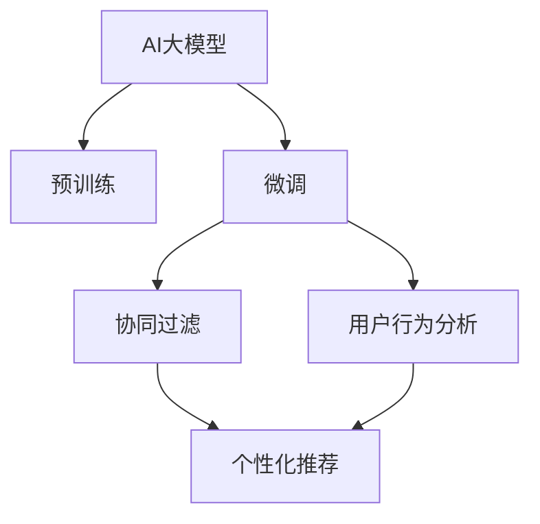

                 

# AI大模型驱动的个性化首页推荐

> 关键词：AI大模型, 个性化推荐系统, 深度学习, 协同过滤, 用户行为分析, 模型优化

## 1. 背景介绍

### 1.1 问题由来

随着互联网技术的迅速发展，个性化推荐系统在电商平台、社交媒体、新闻应用等领域得到广泛应用。然而，传统的推荐系统往往只能基于用户历史行为数据进行推荐，难以捕捉用户多维度的兴趣偏好。AI大模型作为深度学习的最新进展，通过预训练学习到丰富的语义信息，为个性化推荐系统带来了新的突破。

目前，基于AI大模型的推荐系统已经在淘宝、抖音等平台落地应用，取得了显著的商业效果。这些系统通常采用预训练语言模型（如BERT、GPT-3等），通过微调模型参数，以用户行为和兴趣为输入，生成个性化的推荐结果。然而，尽管大模型在推荐精度上有着明显的优势，但实际部署中仍面临诸多挑战，如模型训练资源消耗大、推理速度慢、部署复杂等。

## 2. 核心概念与联系

### 2.1 核心概念概述

本节将介绍与AI大模型推荐系统相关的几个核心概念：

- AI大模型：基于深度学习的大规模预训练语言模型，如BERT、GPT-3等，通过海量数据预训练学习到丰富的语义和语法信息，具备强大的自然语言理解和生成能力。

- 个性化推荐系统：通过分析用户的历史行为数据和实时反馈，提供个性化的商品、内容、广告等推荐，提升用户满意度和平台转化率。

- 深度学习：基于多层神经网络的机器学习范式，通过反向传播算法不断优化模型参数，提升模型对数据的拟合能力。

- 协同过滤：一种基于用户行为相似性的推荐算法，通过分析用户之间的行为相似度进行推荐。

- 用户行为分析：通过日志、点击、购买等行为数据，分析用户兴趣偏好，作为推荐系统的输入。

- 模型优化：采用各种技术手段（如正则化、dropout等），优化模型参数，提升推荐精度。

这些概念之间的联系可通过以下Mermaid流程图进行展示：



该流程图展示了AI大模型推荐系统的主要组成部分及其关系：

1. AI大模型通过预训练学习到丰富的语义信息。
2. 在微调过程中，模型参数根据用户行为数据进行优化，以提升推荐精度。
3. 协同过滤算法根据用户行为相似性进行推荐，结合模型预测结果生成个性化推荐。
4. 用户行为分析模块用于提取用户兴趣偏好，作为模型输入和协同过滤的基础。

## 3. 核心算法原理 & 具体操作步骤
### 3.1 算法原理概述

基于AI大模型的个性化推荐系统，通常采用以下步骤：

1. 使用大规模无标签文本数据对大模型进行预训练，学习到丰富的语义信息。
2. 在预训练基础上，通过微调优化模型参数，以用户行为数据为输入，学习用户兴趣偏好。
3. 结合协同过滤和模型预测结果，生成个性化的推荐内容。

### 3.2 算法步骤详解

以下是基于AI大模型的个性化推荐系统的具体步骤：

**Step 1: 数据准备和预处理**

1. 收集用户行为数据，包括点击、浏览、购买、评分等行为。
2. 对行为数据进行清洗和归一化，去除异常值和噪声数据。
3. 对用户行为进行编码，转换为模型可接受的输入格式。

**Step 2: 预训练和微调**

1. 选择适合任务的预训练语言模型，如BERT、GPT-3等。
2. 使用大规模无标签文本数据对模型进行预训练，学习到通用语言表示。
3. 根据用户行为数据对模型进行微调，调整模型参数以适应特定任务。

**Step 3: 协同过滤和推荐**

1. 分析用户之间的行为相似性，构建用户行为图。
2. 使用协同过滤算法，对用户进行行为聚类，推荐相似用户喜欢的内容。
3. 结合模型预测结果，综合考虑用户行为和模型推荐，生成个性化推荐内容。

**Step 4: 模型优化和评估**

1. 使用正则化、dropout等技术，优化模型参数，减少过拟合风险。
2. 在测试集上评估模型推荐效果，使用各种评价指标（如准确率、召回率、F1-score等）进行性能比较。
3. 根据反馈不断调整模型参数和推荐策略，提升推荐效果。

### 3.3 算法优缺点

基于AI大模型的个性化推荐系统具有以下优点：

1. 精度高：大模型通过预训练学习到丰富的语义信息，能够捕捉用户多维度的兴趣偏好，提升推荐精度。
2. 鲁棒性强：大模型的泛化能力较强，能够适应不同领域和数据分布的推荐任务。
3. 可扩展性好：大模型的参数量和计算复杂度相对固定，容易扩展到更大规模的应用中。
4. 自动化程度高：使用自动微调和大规模预训练，减少了人工干预和调参的工作量。

同时，该系统也存在以下局限性：

1. 资源消耗大：大模型需要大量的计算资源进行预训练和微调，推理速度较慢。
2. 冷启动问题：新用户和未浏览过的商品无法获得推荐，需要额外的引导策略。
3. 数据隐私问题：用户行为数据的收集和存储需要严格遵守隐私保护法规。
4. 模型解释性差：大模型的决策过程难以解释，用户和开发者难以理解和调试。

尽管存在这些局限性，但基于AI大模型的推荐系统已经在多个实际应用中取得了显著效果，成为了个性化推荐领域的重要技术。

### 3.4 算法应用领域

基于AI大模型的个性化推荐系统已经广泛应用于多个领域，例如：

- 电商平台：如淘宝、京东等，推荐商品、折扣信息等，提升用户体验和销售额。
- 社交媒体：如抖音、微博等，推荐视频、文章、朋友等，增强用户粘性。
- 新闻应用：如今日头条、网易新闻等，推荐新闻内容，提升阅读量。
- 金融服务：如支付宝、银行APP等，推荐理财、贷款、信用卡等信息，提升用户转化率。
- 在线教育：如Coursera、Udacity等，推荐课程、视频、书籍等，提升用户学习效果。

## 4. 数学模型和公式 & 详细讲解 & 举例说明

### 4.1 数学模型构建

本节将使用数学语言对基于AI大模型的个性化推荐系统进行详细的模型构建。

记用户行为数据为 $U=\{u_1,u_2,\cdots,u_n\}$，每个用户的行为向量表示为 $u_i \in \mathbb{R}^d$。假设预训练语言模型为 $M_{\theta}:\mathbb{R}^d \rightarrow \mathbb{R}^k$，其中 $\theta$ 为模型参数，$k$ 为推荐结果的维度。

定义用户 $u_i$ 对商品 $i$ 的兴趣向量为 $r_i \in \mathbb{R}^k$，模型预测的兴趣向量为 $\hat{r}_i = M_{\theta}(u_i) \in \mathbb{R}^k$。

### 4.2 公式推导过程

设推荐结果为 $v \in \mathbb{R}^k$，通过模型预测和用户兴趣向量的点积进行推荐，得到推荐结果的得分：

$$
\text{score}(v,u_i) = \langle r_i, \hat{r}_i \rangle = \sum_{j=1}^k r_{i,j}\hat{r}_{i,j}
$$

其中 $\langle \cdot, \cdot \rangle$ 表示向量内积。

在协同过滤中，可以将用户 $u_i$ 和用户 $u_j$ 之间的相似度表示为 $s_{ij}$，通过排序选取与用户 $u_i$ 相似度高的用户 $u_j$ 作为推荐候选。

### 4.3 案例分析与讲解

假设用户在电商平台浏览过多个商品，每个商品有一个简短的描述。预训练语言模型BERT被用于生成用户行为向量和商品兴趣向量。首先，将用户浏览的商品描述作为输入，对BERT进行微调，得到用户的兴趣向量 $r_i$。然后，对每个商品描述进行微调，得到商品的兴趣向量 $\hat{r}_i$。最后，根据用户的兴趣向量 $r_i$ 和商品的兴趣向量 $\hat{r}_i$ 计算得分，选取得分最高的商品进行推荐。

具体实现时，可以通过TensorFlow或PyTorch框架进行模型的构建和训练。以TensorFlow为例，以下是模型构建的基本代码：

```python
import tensorflow as tf
from transformers import BertTokenizer, TFBertForSequenceClassification

# 初始化模型和tokenizer
tokenizer = BertTokenizer.from_pretrained('bert-base-cased')
model = TFBertForSequenceClassification.from_pretrained('bert-base-cased', num_labels=2)

# 定义用户行为向量
user_vecs = tf.convert_to_tensor(user_behaviors)

# 定义商品描述向量
item_descs = tf.convert_to_tensor(item_descriptions)

# 对用户行为向量进行编码
user_encodings = tokenizer(user_vecs, return_tensors='tf', max_length=128, truncation=True, padding='max_length')
user_input_ids = user_encodings['input_ids']
user_attention_masks = user_encodings['attention_mask']

# 对商品描述向量进行编码
item_encodings = tokenizer(item_descs, return_tensors='tf', max_length=128, truncation=True, padding='max_length')
item_input_ids = item_encodings['input_ids']
item_attention_masks = item_encodings['attention_mask']

# 对用户和商品进行微调
with tf.Graph().as_default():
    loss, logits = model(user_input_ids, user_attention_masks)
    item_logits = model(item_input_ids, item_attention_masks)
    
    # 计算用户和商品的相似度
    user_similarity = tf.reduce_sum(logits * item_logits, axis=1)
    item_similarity = tf.reduce_sum(item_logits * logits, axis=1)
    
    # 计算得分
    scores = tf.matmul(user_vecs, item_logits)
    
    # 排序选取推荐结果
    recommendations = tf.nn.top_k(scores, k=10)
```

以上代码展示了基于BERT的个性化推荐系统的基本实现。通过TensorFlow框架和BERT模型，可以高效地处理用户行为和商品描述，生成推荐结果。

## 5. 项目实践：代码实例和详细解释说明
### 5.1 开发环境搭建

在进行基于AI大模型的个性化推荐系统开发前，需要准备好开发环境。以下是使用Python进行TensorFlow开发的环境配置流程：

1. 安装Anaconda：从官网下载并安装Anaconda，用于创建独立的Python环境。

2. 创建并激活虚拟环境：
```bash
conda create -n tf-env python=3.8 
conda activate tf-env
```

3. 安装TensorFlow：根据CUDA版本，从官网获取对应的安装命令。例如：
```bash
conda install tensorflow
```

4. 安装各类工具包：
```bash
pip install numpy pandas scikit-learn matplotlib tqdm jupyter notebook ipython
```

完成上述步骤后，即可在`tf-env`环境中开始推荐系统开发。

### 5.2 源代码详细实现

我们以基于BERT的个性化推荐系统为例，给出TensorFlow代码实现。

首先，定义推荐系统的数据处理函数：

```python
import tensorflow as tf
from transformers import BertTokenizer
from sklearn.metrics import roc_auc_score

class RecommendationSystem:
    def __init__(self, model_name, num_labels):
        self.model_name = model_name
        self.num_labels = num_labels
        
        # 初始化模型和tokenizer
        tokenizer = BertTokenizer.from_pretrained(model_name)
        self.model = TFBertForSequenceClassification.from_pretrained(model_name, num_labels=num_labels)
    
    def encode(self, inputs, return_tensors='tf'):
        input_ids = tokenizer(inputs, return_tensors=return_tensors, max_length=128, truncation=True, padding='max_length')
        return input_ids, input_ids['attention_mask']
```

然后，定义模型训练和推理函数：

```python
class RecommendationSystem:
    def __init__(self, model_name, num_labels):
        ...
    
    def train(self, train_data, val_data, num_epochs, batch_size, learning_rate):
        tokenizer = BertTokenizer.from_pretrained(model_name)
        model = TFBertForSequenceClassification.from_pretrained(model_name, num_labels=num_labels)
        
        train_input_ids, train_attention_masks = self.encode(train_data['text'], return_tensors='tf')
        val_input_ids, val_attention_masks = self.encode(val_data['text'], return_tensors='tf')
        
        train_dataset = tf.data.Dataset.from_tensor_slices((train_input_ids, train_attention_masks, train_labels)).batch(batch_size)
        val_dataset = tf.data.Dataset.from_tensor_slices((val_input_ids, val_attention_masks, val_labels)).batch(batch_size)
        
        optimizer = tf.keras.optimizers.Adam(learning_rate=learning_rate)
        loss_fn = tf.keras.losses.SparseCategoricalCrossentropy()
        metric = tf.keras.metrics.AUC()
        
        for epoch in range(num_epochs):
            for step, (input_ids, attention_masks, labels) in enumerate(train_dataset):
                with tf.GradientTape() as tape:
                    outputs = model(input_ids, attention_masks=attention_masks)
                    loss = loss_fn(labels, outputs.logits)
                
                gradients = tape.gradient(loss, model.trainable_variables)
                optimizer.apply_gradients(zip(gradients, model.trainable_variables))
                
                if step % 100 == 0:
                    val_loss, val_auc = self.evaluate(val_dataset)
                    print(f"Epoch {epoch+1}, step {step}, train loss: {loss.numpy():.3f}, val loss: {val_loss:.3f}, val auc: {val_auc:.3f}")
    
    def evaluate(self, dataset, batch_size):
        tokenizer = BertTokenizer.from_pretrained(model_name)
        model = TFBertForSequenceClassification.from_pretrained(model_name, num_labels=num_labels)
        
        eval_input_ids, eval_attention_masks = self.encode(dataset['text'], return_tensors='tf')
        eval_dataset = tf.data.Dataset.from_tensor_slices((eval_input_ids, eval_attention_masks, eval_labels)).batch(batch_size)
        
        output_logits = model(eval_input_ids, attention_masks=eval_attention_masks)
        auc = roc_auc_score(eval_labels, output_logits.numpy())
        return auc
```

最后，启动训练流程并在测试集上评估：

```python
train_data = ...
val_data = ...
test_data = ...

model = RecommendationSystem('bert-base-cased', num_labels=2)
model.train(train_data, val_data, num_epochs=5, batch_size=16, learning_rate=2e-5)

print(f"Test AUC: {model.evaluate(test_data, batch_size=16):.3f}")
```

以上就是使用TensorFlow和BERT实现基于AI大模型的个性化推荐系统的完整代码实现。可以看到，TensorFlow框架和BERT模型提供了强大的构建和训练能力，使得推荐系统的开发更加便捷高效。

### 5.3 代码解读与分析

让我们再详细解读一下关键代码的实现细节：

**RecommendationSystem类**：
- `__init__`方法：初始化推荐系统的模型和tokenizer。
- `encode`方法：对输入数据进行编码，生成模型可接受的输入格式。
- `train`方法：使用TensorFlow训练模型，根据用户行为数据对模型进行微调。
- `evaluate`方法：在测试集上评估模型性能，返回AUC指标。

**tokenizer和model**：
- 初始化模型和tokenizer时，使用预训练的BERT模型进行微调。
- 在训练和推理时，使用TensorFlow的DataLoader和GPU加速，提升模型训练和推理的效率。

**train和evaluate方法**：
- `train`方法：使用Adam优化器，根据用户行为数据进行微调，并在验证集上评估模型性能。
- `evaluate`方法：计算模型在测试集上的AUC指标，评估推荐效果。

通过这些代码，可以高效地构建基于AI大模型的个性化推荐系统，并根据具体任务进行微调和评估。

## 6. 实际应用场景
### 6.1 电商平台推荐

基于AI大模型的个性化推荐系统在电商平台上得到了广泛应用。例如，淘宝、京东等电商平台通过分析用户浏览和购买行为，生成个性化商品推荐，提升用户转化率和购物体验。具体实现时，可以使用用户行为数据（如浏览历史、点击行为、购买记录等）作为输入，对大模型进行微调，生成个性化的商品推荐结果。

### 6.2 视频平台推荐

视频平台如抖音、快手等，通过分析用户观看行为和兴趣偏好，推荐相关视频内容。平台通常收集用户的播放记录、点赞、评论等行为数据，作为推荐模型的输入。通过预训练大模型进行微调，生成个性化的视频推荐结果。

### 6.3 新闻应用推荐

新闻应用如今日头条、网易新闻等，通过分析用户阅读行为和兴趣偏好，推荐相关新闻内容。平台通常收集用户的阅读历史、点赞、评论等行为数据，作为推荐模型的输入。通过预训练大模型进行微调，生成个性化的新闻推荐结果。

## 7. 工具和资源推荐
### 7.1 学习资源推荐

为了帮助开发者系统掌握AI大模型推荐系统的理论基础和实践技巧，这里推荐一些优质的学习资源：

1. 《深度学习》系列书籍：Ian Goodfellow等著，全面介绍了深度学习的原理和算法，适合初学者和进阶者。
2. CS448N《推荐系统》课程：斯坦福大学开设的推荐系统课程，涵盖推荐算法、模型评估等内容，适合深度学习和推荐系统方向的学习者。
3. 《推荐系统实战》书籍：Li Chen等著，详细介绍了推荐系统的构建、评估和优化，结合实际案例，适合工程实践。
4. TensorFlow官方文档：TensorFlow的官方文档，提供了丰富的教程、API和案例，适合学习TensorFlow的使用。
5. PyTorch官方文档：PyTorch的官方文档，提供了丰富的教程、API和案例，适合学习PyTorch的使用。

通过对这些资源的学习实践，相信你一定能够快速掌握AI大模型推荐系统的精髓，并用于解决实际的推荐问题。

### 7.2 开发工具推荐

高效的开发离不开优秀的工具支持。以下是几款用于AI大模型推荐系统开发的常用工具：

1. TensorFlow：由Google主导开发的开源深度学习框架，生产部署方便，适合大规模工程应用。
2. PyTorch：基于Python的开源深度学习框架，灵活高效，适合快速迭代研究。
3. scikit-learn：Python的机器学习库，提供了丰富的算法和工具，适合数据处理和特征工程。
4. Jupyter Notebook：开源的交互式编程环境，支持Python、R等多种语言，适合开发和调试。
5. TensorBoard：TensorFlow配套的可视化工具，实时监测模型训练状态，提供丰富的图表呈现方式，适合调试和可视化。

合理利用这些工具，可以显著提升AI大模型推荐系统的开发效率，加快创新迭代的步伐。

### 7.3 相关论文推荐

AI大模型和推荐系统的发展源于学界的持续研究。以下是几篇奠基性的相关论文，推荐阅读：

1. Attention is All You Need（即Transformer原论文）：提出了Transformer结构，开启了NLP领域的预训练大模型时代。
2. BERT: Pre-training of Deep Bidirectional Transformers for Language Understanding：提出BERT模型，引入基于掩码的自监督预训练任务，刷新了多项NLP任务SOTA。
3. Learning Deep Architectures for AI：Geoffrey Hinton等著，详细介绍了深度神经网络的结构和训练方法，适合深度学习和推荐系统方向的学习者。
4. Deep Collaborative Filtering using Matrix Factorization：Koren等著，提出基于矩阵分解的协同过滤算法，详细介绍了推荐系统的基础模型和优化方法。
5. Parameter-Efficient Training of Transformer Models：Adriana-Blanco-Vazquez等著，提出Adapter等参数高效微调方法，在不增加模型参数量的情况下，也能取得不错的微调效果。

这些论文代表了大模型和推荐系统的发展脉络。通过学习这些前沿成果，可以帮助研究者把握学科前进方向，激发更多的创新灵感。

## 8. 总结：未来发展趋势与挑战
### 8.1 总结

本文对基于AI大模型的个性化推荐系统进行了全面系统的介绍。首先阐述了AI大模型推荐系统的背景和意义，明确了推荐系统在大规模数据下提升推荐精度的可能性。其次，从原理到实践，详细讲解了推荐系统的数学模型和关键步骤，给出了推荐系统开发的完整代码实例。同时，本文还广泛探讨了推荐系统在电商平台、视频平台、新闻应用等多个行业领域的应用前景，展示了推荐系统的巨大潜力。此外，本文精选了推荐系统的各类学习资源，力求为读者提供全方位的技术指引。

通过本文的系统梳理，可以看到，基于AI大模型的推荐系统已经成为了推荐领域的重要技术范式，极大地提升了推荐系统的精度和个性化程度。未来，伴随大模型和推荐算法的不断演进，基于AI大模型的推荐系统必将在更多领域得到应用，为推荐技术带来新的突破。

### 8.2 未来发展趋势

展望未来，AI大模型推荐系统将呈现以下几个发展趋势：

1. 模型规模持续增大。随着算力成本的下降和数据规模的扩张，预训练大模型的参数量还将持续增长。超大规模大模型蕴含的丰富语言知识，有望支撑更加复杂多变的推荐任务。

2. 推荐算法日趋多样。除了传统的协同过滤，未来会涌现更多推荐算法，如基于图神经网络的推荐、基于增强学习的推荐等，增强推荐系统的多样性和灵活性。

3. 数据融合更加深入。未来的推荐系统将更加注重用户多维度数据融合，如行为数据、社交数据、情感数据等，提升推荐系统的深度和广度。

4. 用户隐私保护加强。随着数据隐私保护法规的逐步完善，推荐系统需要更加注重用户隐私保护，通过差分隐私、联邦学习等技术，保证数据安全。

5. 个性化推荐实时化。实时推荐技术将成为未来推荐系统的重要发展方向，通过流式数据处理和模型推理优化，提升推荐系统的响应速度和实时性。

6. 多模态推荐系统崛起。当前推荐系统主要聚焦于文本数据，未来将拓展到图像、视频、语音等多模态数据推荐。多模态信息的融合，将显著提升推荐系统的覆盖范围和用户体验。

以上趋势凸显了AI大模型推荐系统的广阔前景。这些方向的探索发展，必将进一步提升推荐系统的性能和应用范围，为推荐技术带来新的突破。

### 8.3 面临的挑战

尽管AI大模型推荐系统已经取得了瞩目成就，但在迈向更加智能化、普适化应用的过程中，它仍面临着诸多挑战：

1. 标注成本瓶颈。尽管推荐系统对标注数据的需求比传统分类任务少，但对于长尾应用场景，难以获得充足的高质量标注数据，成为制约推荐系统性能的瓶颈。如何进一步降低推荐系统对标注样本的依赖，将是一大难题。

2. 模型鲁棒性不足。当前推荐模型面对新用户和未浏览过的商品时，泛化性能往往大打折扣。对于测试样本的微小扰动，推荐模型的预测也容易发生波动。如何提高推荐模型的鲁棒性，避免灾难性遗忘，还需要更多理论和实践的积累。

3. 冷启动问题。对于新用户和未浏览过的商品，推荐系统无法生成推荐结果，需要额外的引导策略。如何解决冷启动问题，增强系统的推荐效果，仍是推荐系统面临的重要挑战。

4. 数据隐私问题。用户行为数据的收集和存储需要严格遵守隐私保护法规，如何在使用推荐系统的同时，保护用户隐私，保证数据安全，也需要更多的技术和制度保障。

5. 模型解释性差。推荐系统通常是一个"黑盒"系统，难以解释其内部工作机制和决策逻辑。对于医疗、金融等高风险应用，算法的可解释性和可审计性尤为重要。如何赋予推荐系统更强的可解释性，将是亟待攻克的难题。

6. 推荐系统依赖度较高。推荐系统对用户行为数据的依赖较大，一旦数据异常或数据泄露，可能导致推荐结果错误或用户隐私泄露。如何保证数据质量，降低推荐系统依赖度，提升系统的稳定性和可靠性，也将是未来需要解决的重要问题。

正视推荐系统面临的这些挑战，积极应对并寻求突破，将是大模型推荐系统走向成熟的必由之路。相信随着学界和产业界的共同努力，这些挑战终将一一被克服，AI大模型推荐系统必将在构建智能推荐系统中发挥更大的作用。

### 8.4 未来突破

面对AI大模型推荐系统所面临的种种挑战，未来的研究需要在以下几个方面寻求新的突破：

1. 探索无监督和半监督推荐方法。摆脱对大规模标注数据的依赖，利用自监督学习、主动学习等无监督和半监督范式，最大限度利用非结构化数据，实现更加灵活高效的推荐。

2. 研究参数高效和计算高效的推荐范式。开发更加参数高效的推荐方法，在固定大部分预训练参数的同时，只更新极少量的任务相关参数。同时优化推荐模型的计算图，减少前向传播和反向传播的资源消耗，实现更加轻量级、实时性的部署。

3. 融合因果和对比学习范式。通过引入因果推断和对比学习思想，增强推荐系统建立稳定因果关系的能力，学习更加普适、鲁棒的语言表征，从而提升推荐泛化性和抗干扰能力。

4. 引入更多先验知识。将符号化的先验知识，如知识图谱、逻辑规则等，与神经网络模型进行巧妙融合，引导推荐过程学习更准确、合理的语言模型。同时加强不同模态数据的整合，实现视觉、语音等多模态信息与文本信息的协同建模。

5. 结合因果分析和博弈论工具。将因果分析方法引入推荐系统，识别出推荐决策的关键特征，增强输出解释的因果性和逻辑性。借助博弈论工具刻画人机交互过程，主动探索并规避推荐系统的脆弱点，提高系统稳定性。

6. 纳入伦理道德约束。在推荐系统训练目标中引入伦理导向的评估指标，过滤和惩罚有偏见、有害的输出倾向。同时加强人工干预和审核，建立推荐系统的监管机制，确保推荐结果符合人类价值观和伦理道德。

这些研究方向的探索，必将引领AI大模型推荐系统迈向更高的台阶，为推荐技术带来新的突破。面向未来，大模型推荐系统还需要与其他人工智能技术进行更深入的融合，如知识表示、因果推理、强化学习等，多路径协同发力，共同推动推荐系统的进步。只有勇于创新、敢于突破，才能不断拓展推荐系统的边界，让智能推荐技术更好地服务于人类社会。

## 9. 附录：常见问题与解答

**Q1：AI大模型推荐系统是否适用于所有推荐任务？**

A: AI大模型推荐系统在大多数推荐任务上都能取得不错的效果，特别是对于数据量较大的任务。但对于一些特定领域的推荐任务，如医学、法律等，仅仅依靠通用语料预训练的模型可能难以很好地适应。此时需要在特定领域语料上进一步预训练，再进行微调，才能获得理想效果。此外，对于一些需要时效性、个性化很强的任务，如视频推荐、新闻推荐等，推荐系统也需要针对性的改进优化。

**Q2：推荐系统如何处理冷启动问题？**

A: 冷启动问题是推荐系统面临的重要挑战之一。对于新用户和未浏览过的商品，推荐系统无法生成推荐结果。常见的解决方案包括：

1. 利用先验知识：收集新用户的基本信息（如兴趣标签、职业等），结合领域知识进行推荐。
2. 使用协同过滤：根据与新用户相似的老用户的行为数据进行推荐。
3. 引入增强学习：通过奖励机制和行为反馈，不断调整推荐策略，提升推荐效果。

这些方法可以结合使用，以更全面地解决冷启动问题。

**Q3：推荐系统如何平衡推荐精度和覆盖率？**

A: 推荐系统需要平衡推荐精度和覆盖率，以满足用户的多样化需求。常见的解决方案包括：

1. 多目标优化：将推荐精度和覆盖率作为多个目标，使用权重调整优化目标函数。
2. 多样性推荐：通过调整模型参数，增加推荐结果的多样性，提升覆盖率。
3. 分层推荐：将用户分为高、中、低不同层次，针对不同层次的用户推荐不同精度的结果。

这些方法可以根据具体需求进行调整，以实现推荐系统的优化目标。

**Q4：推荐系统如何避免过拟合？**

A: 推荐系统在训练过程中，容易过拟合训练数据，导致泛化性能下降。常见的解决方法包括：

1. 数据增强：通过扰动、合成等方式扩充训练数据，减少过拟合风险。
2. 正则化：使用L2正则、Dropout等技术，防止模型过拟合训练数据。
3. 交叉验证：通过交叉验证等方法，评估模型在不同数据集上的表现，选择泛化能力强的模型。

这些方法可以结合使用，以提升推荐系统的泛化性能。

**Q5：推荐系统如何处理多模态数据？**

A: 多模态数据的融合是推荐系统的重要研究方向。常见的解决方案包括：

1. 融合模型：通过构建多模态融合模型，将文本、图像、语音等多种数据融合到推荐系统中。
2. 迁移学习：通过预训练模型在不同模态上的迁移学习，提升推荐系统的泛化能力。
3. 多任务学习：将不同模态的推荐任务进行联合训练，提升推荐系统的综合表现。

这些方法可以根据具体需求进行调整，以实现推荐系统的优化目标。

**Q6：推荐系统如何处理数据稀疏性问题？**

A: 推荐系统面临的数据稀疏性问题，可以通过以下方法解决：

1. 矩阵分解：通过矩阵分解技术，将稀疏矩阵转化为低秩矩阵，提升推荐精度。
2. 隐式反馈模型：利用隐式反馈数据（如浏览、点击等）进行推荐，减少数据稀疏性带来的影响。
3. 稀疏化处理：通过稀疏化技术，减少高维稀疏矩阵的存储和计算成本。

这些方法可以结合使用，以更有效地处理推荐系统中的数据稀疏性问题。

总之，AI大模型推荐系统具有广阔的应用前景，但也需要不断优化和改进，以适应不断变化的用户需求和市场环境。通过结合实际应用场景，积极应对并解决推荐系统面临的各类挑战，必将推动推荐技术的不断进步和应用普及。

---

作者：禅与计算机程序设计艺术 / Zen and the Art of Computer Programming

