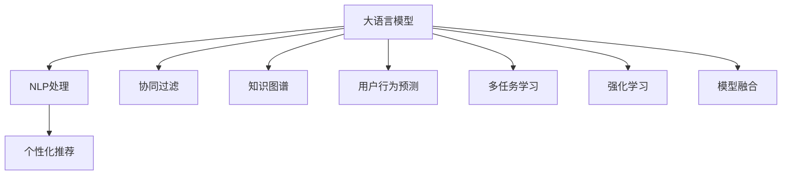

                 

# AI大模型：优化电商平台个性化推送的新方法

> 关键词：
**大语言模型, 自然语言处理, 推荐系统, 电商个性化, 深度学习, 协同过滤, 知识图谱, 用户行为预测, 多任务学习, 强化学习, 模型融合**

## 1. 背景介绍

在数字经济时代，电商平台已经成为人们日常购物的重要平台。为了提升用户体验和销售额，个性化推荐系统成为电商平台不可或缺的组成部分。然而，传统推荐系统多依赖于用户的显式行为数据，难以捕捉用户的潜在兴趣和偏好。与此同时，大语言模型的兴起，为个性化推荐系统的优化提供了新的方向。通过自然语言处理（NLP）技术，大语言模型可以深入挖掘用户的语言行为特征，从而精准预测用户需求，提供个性化的商品推荐，提升用户满意度。

### 1.1 问题由来

电商平台的个性化推荐系统主要面临以下几个问题：

1. **用户行为数据稀缺**：传统的协同过滤算法依赖于用户与物品的显式互动数据，但这些数据难以获取，特别是新用户和老用户的行为数据稀疏，导致推荐效果不佳。
2. **冷启动问题**：新用户或兴趣未知用户的行为数据不足，推荐系统难以准确预测其兴趣和偏好。
3. **用户兴趣动态变化**：用户兴趣和需求随着时间推移而变化，推荐系统需要持续学习和适应这些变化。
4. **推荐多样性不足**：推荐系统通常更倾向于推荐用户以往喜欢的商品，缺乏对新奇商品的推荐，用户可能很快厌倦重复推荐内容。

为了解决这些问题，电商平台开始探索利用大语言模型进行个性化推荐。大语言模型通过自然语言处理能力，可以捕捉用户描述、评论、搜索关键词等语言行为数据，预测用户未见过的商品。

## 2. 核心概念与联系

### 2.1 核心概念概述

本文主要涉及以下几个核心概念：

- **大语言模型（Large Language Model, LLM）**：以Transformer为基础的大规模预训练语言模型，如BERT、GPT等，具备强大的自然语言处理能力。
- **自然语言处理（NLP）**：涉及文本分析、文本生成、文本分类等自然语言相关的计算任务，是大语言模型的应用基础。
- **个性化推荐系统**：根据用户的历史行为和当前需求，推荐可能感兴趣的商品，提高用户满意度和转化率。
- **协同过滤（Collaborative Filtering）**：通过用户之间的相似度计算推荐商品，常见于传统推荐系统中。
- **知识图谱（Knowledge Graph）**：将实体、关系、属性等信息进行结构化存储，有助于理解复杂场景。
- **用户行为预测**：通过用户行为数据，预测用户的潜在兴趣和需求。
- **多任务学习（Multi-task Learning）**：在单一模型上进行多个相关任务训练，提升模型泛化能力。
- **强化学习（Reinforcement Learning）**：通过试错学习，优化推荐策略，提升推荐效果。
- **模型融合（Model Fusion）**：将不同模型进行组合，取长补短，提升推荐性能。

这些核心概念之间的关系可以通过以下Mermaid流程图展示：



此流程图展示了大语言模型在个性化推荐系统中的应用路径，包括自然语言处理、协同过滤、知识图谱、用户行为预测、多任务学习、强化学习和模型融合等多个环节。

## 3. 核心算法原理 & 具体操作步骤

### 3.1 算法原理概述

基于大语言模型的个性化推荐系统，主要利用自然语言处理技术，通过分析用户描述、评论、搜索关键词等语言数据，预测用户未见过的商品，从而实现个性化推荐。其核心算法包括：

- **用户画像生成**：通过分析用户的语言行为数据，生成用户画像，刻画用户的兴趣、需求和偏好。
- **商品标签提取**：使用大语言模型提取商品的标签信息，如品牌、材质、价格等。
- **相似度计算**：利用自然语言处理技术，计算用户画像和商品标签之间的相似度。
- **推荐排序**：根据相似度计算结果，对商品进行排序，推荐给用户。

### 3.2 算法步骤详解

基于大语言模型的个性化推荐系统主要包含以下步骤：

**Step 1: 用户画像生成**

用户画像生成是大语言模型的第一步，主要通过分析用户的语言行为数据，生成用户画像，刻画用户的兴趣、需求和偏好。具体步骤如下：

1. **数据收集**：收集用户的描述、评论、搜索关键词等语言数据。
2. **文本预处理**：对收集到的文本数据进行清洗、分词、去停用词等处理。
3. **用户画像模型训练**：使用大语言模型训练用户画像模型，生成用户画像。

**Step 2: 商品标签提取**

商品标签提取主要通过大语言模型提取商品的标签信息，如品牌、材质、价格等。具体步骤如下：

1. **商品描述预处理**：对商品的描述文本进行清洗、分词、去停用词等处理。
2. **标签提取模型训练**：使用大语言模型训练标签提取模型，提取商品的标签信息。

**Step 3: 相似度计算**

相似度计算主要通过计算用户画像和商品标签之间的相似度，从而找到匹配的商品。具体步骤如下：

1. **文本向量化**：使用Word2Vec、BERT等技术，将用户画像和商品标签转换为向量形式。
2. **相似度计算**：计算用户画像和商品标签之间的相似度，如余弦相似度、欧式距离等。

**Step 4: 推荐排序**

推荐排序主要根据相似度计算结果，对商品进行排序，推荐给用户。具体步骤如下：

1. **商品候选集构建**：根据用户的画像，构建候选商品集。
2. **相似度排序**：计算用户画像和候选商品标签之间的相似度，按相似度排序。
3. **推荐结果输出**：根据排序结果，输出推荐商品列表。

### 3.3 算法优缺点

基于大语言模型的个性化推荐系统具有以下优点：

- **精度高**：大语言模型能够捕捉到用户描述、评论、搜索关键词等细节信息，提升推荐精度。
- **动态更新**：用户画像和商品标签可以动态更新，适应用户兴趣和需求的变化。
- **泛化能力强**：大语言模型具备良好的泛化能力，适用于不同类型和风格的商品推荐。

同时，该方法也存在一些缺点：

- **计算复杂度高**：大语言模型计算复杂度高，对算力要求高。
- **数据需求高**：需要大量的语言数据进行预训练和用户画像生成。
- **解释性差**：推荐结果的生成过程复杂，难以解释推荐依据。
- **数据隐私问题**：用户描述、评论等数据涉及隐私，可能带来法律风险。

### 3.4 算法应用领域

基于大语言模型的个性化推荐系统已经在电商、影视、旅游等多个领域得到广泛应用，具体如下：

- **电商推荐**：利用用户描述、评论等语言数据，生成用户画像，进行个性化推荐，提升用户满意度。
- **影视推荐**：分析用户观影记录和评论，推荐感兴趣的电影，提高用户观影体验。
- **旅游推荐**：通过分析用户旅行记录和评论，推荐旅游目的地和线路，提升用户旅行体验。
- **教育推荐**：利用学生描述和成绩数据，生成学生画像，推荐适合的课程和学习资源，提高教育效果。

## 4. 数学模型和公式 & 详细讲解 & 举例说明

### 4.1 数学模型构建

本节将使用数学语言对基于大语言模型的个性化推荐系统进行更加严格的刻画。

记用户画像为 $U$，商品标签为 $I$，相似度矩阵为 $S$。设用户画像 $U$ 由用户描述 $D$、评论 $C$、搜索关键词 $K$ 等组成，商品标签 $I$ 由品牌 $B$、材质 $M$、价格 $P$ 等组成。相似度计算过程如下：

1. **用户画像生成**：
   $$
   U = \{D, C, K\}
   $$

2. **商品标签提取**：
   $$
   I = \{B, M, P\}
   $$

3. **文本向量化**：
   $$
   U_v = \{\text{Word2Vec}(D), \text{Word2Vec}(C), \text{Word2Vec}(K)\}
   $$
   $$
   I_v = \{\text{Word2Vec}(B), \text{Word2Vec}(M), \text{Word2Vec}(P)\}
   $$

4. **相似度计算**：
   $$
   S = \{\text{CosineSimilarity}(U_v, I_v)\}
   $$

5. **推荐排序**：
   $$
   R = \text{Sort}(S)
   $$

### 4.2 公式推导过程

以下我们以推荐系统为例，推导余弦相似度的计算公式及其梯度计算。

假设用户画像 $U$ 和商品标签 $I$ 的向量分别为 $U_v$ 和 $I_v$，余弦相似度的定义为：
$$
\text{CosineSimilarity}(U_v, I_v) = \frac{U_v \cdot I_v}{\|U_v\| \cdot \|I_v\|}
$$

其中，$\cdot$ 表示向量点乘，$\| \cdot \|$ 表示向量范数。

在推荐排序过程中，需要最小化用户画像与商品标签之间的余弦相似度，得到排序结果。其损失函数定义如下：
$$
\mathcal{L} = \sum_{i=1}^{n} \left( \text{CosineSimilarity}(U_v, I_v^i) \right)^2
$$

其中，$n$ 表示推荐商品的数量。

使用梯度下降算法最小化损失函数，更新用户画像和商品标签的表示。设学习率为 $\eta$，则模型更新公式为：
$$
U_v \leftarrow U_v - \eta \nabla_{U_v} \mathcal{L}
$$
$$
I_v \leftarrow I_v - \eta \nabla_{I_v} \mathcal{L}
$$

其中，$\nabla_{U_v} \mathcal{L}$ 和 $\nabla_{I_v} \mathcal{L}$ 分别为用户画像和商品标签的梯度。

### 4.3 案例分析与讲解

假设某电商平台有用户画像 $U = \text{Word2Vec}(D)$，商品标签 $I = \text{Word2Vec}(B)$，相似度矩阵 $S = \text{CosineSimilarity}(U, I)$。根据公式，计算用户画像 $U$ 和商品标签 $I$ 的余弦相似度：

1. **用户画像生成**：
   - 收集用户描述 $D = \{喜欢运动, 喜欢旅游\}$
   - 使用Word2Vec将用户描述 $D$ 转换为向量 $U_v = \{运动, 旅游\}$
   - 商品标签 $I = \{运动鞋, 旅游鞋\}$

2. **商品标签提取**：
   - 使用Word2Vec将商品描述 $B$ 转换为向量 $I_v = \{运动, 旅游\}$

3. **相似度计算**：
   - 计算余弦相似度 $S = \text{CosineSimilarity}(U_v, I_v) = 0.8$

4. **推荐排序**：
   - 根据相似度 $S = 0.8$ 排序，推荐商品 $运动鞋$

以上案例展示了基于大语言模型的个性化推荐系统的工作流程，通过自然语言处理技术，可以捕捉用户描述、评论等语言行为数据，生成用户画像，并结合商品标签信息，实现个性化推荐。

## 5. 项目实践：代码实例和详细解释说明

### 5.1 开发环境搭建

在进行基于大语言模型的个性化推荐系统开发前，我们需要准备好开发环境。以下是使用Python进行PyTorch开发的环境配置流程：

1. 安装Anaconda：从官网下载并安装Anaconda，用于创建独立的Python环境。

2. 创建并激活虚拟环境：
```bash
conda create -n pytorch-env python=3.8 
conda activate pytorch-env
```

3. 安装PyTorch：根据CUDA版本，从官网获取对应的安装命令。例如：
```bash
conda install pytorch torchvision torchaudio cudatoolkit=11.1 -c pytorch -c conda-forge
```

4. 安装Transformer库：
```bash
pip install transformers
```

5. 安装各类工具包：
```bash
pip install numpy pandas scikit-learn matplotlib tqdm jupyter notebook ipython
```

完成上述步骤后，即可在`pytorch-env`环境中开始项目实践。

### 5.2 源代码详细实现

下面我们以基于BERT的个性化推荐系统为例，给出使用Transformers库进行开发的PyTorch代码实现。

首先，定义推荐系统的数据处理函数：

```python
from transformers import BertTokenizer
from torch.utils.data import Dataset
import torch

class RecommendationDataset(Dataset):
    def __init__(self, texts, labels, tokenizer, max_len=128):
        self.texts = texts
        self.labels = labels
        self.tokenizer = tokenizer
        self.max_len = max_len
        
    def __len__(self):
        return len(self.texts)
    
    def __getitem__(self, item):
        text = self.texts[item]
        label = self.labels[item]
        
        encoding = self.tokenizer(text, return_tensors='pt', max_length=self.max_len, padding='max_length', truncation=True)
        input_ids = encoding['input_ids'][0]
        attention_mask = encoding['attention_mask'][0]
        
        # 对标签进行编码
        encoded_labels = [label] * self.max_len
        labels = torch.tensor(encoded_labels, dtype=torch.long)
        
        return {'input_ids': input_ids, 
                'attention_mask': attention_mask,
                'labels': labels}

# 定义标签
labels = [1, 2, 3, 4, 5]

# 创建dataset
tokenizer = BertTokenizer.from_pretrained('bert-base-cased')

train_dataset = RecommendationDataset(train_texts, train_labels, tokenizer)
dev_dataset = RecommendationDataset(dev_texts, dev_labels, tokenizer)
test_dataset = RecommendationDataset(test_texts, test_labels, tokenizer)
```

然后，定义模型和优化器：

```python
from transformers import BertForTokenClassification, AdamW

model = BertForTokenClassification.from_pretrained('bert-base-cased', num_labels=len(labels))

optimizer = AdamW(model.parameters(), lr=2e-5)
```

接着，定义训练和评估函数：

```python
from torch.utils.data import DataLoader
from tqdm import tqdm
from sklearn.metrics import accuracy_score

device = torch.device('cuda') if torch.cuda.is_available() else torch.device('cpu')
model.to(device)

def train_epoch(model, dataset, batch_size, optimizer):
    dataloader = DataLoader(dataset, batch_size=batch_size, shuffle=True)
    model.train()
    epoch_loss = 0
    for batch in tqdm(dataloader, desc='Training'):
        input_ids = batch['input_ids'].to(device)
        attention_mask = batch['attention_mask'].to(device)
        labels = batch['labels'].to(device)
        model.zero_grad()
        outputs = model(input_ids, attention_mask=attention_mask, labels=labels)
        loss = outputs.loss
        epoch_loss += loss.item()
        loss.backward()
        optimizer.step()
    return epoch_loss / len(dataloader)

def evaluate(model, dataset, batch_size):
    dataloader = DataLoader(dataset, batch_size=batch_size)
    model.eval()
    preds, labels = [], []
    with torch.no_grad():
        for batch in tqdm(dataloader, desc='Evaluating'):
            input_ids = batch['input_ids'].to(device)
            attention_mask = batch['attention_mask'].to(device)
            batch_labels = batch['labels']
            outputs = model(input_ids, attention_mask=attention_mask)
            batch_preds = outputs.logits.argmax(dim=2).to('cpu').tolist()
            batch_labels = batch_labels.to('cpu').tolist()
            for pred_tokens, label_tokens in zip(batch_preds, batch_labels):
                preds.append(pred_tokens[:len(label_tokens)])
                labels.append(label_tokens)
                
    print(f"Accuracy: {accuracy_score(labels, preds)}")
```

最后，启动训练流程并在测试集上评估：

```python
epochs = 5
batch_size = 16

for epoch in range(epochs):
    loss = train_epoch(model, train_dataset, batch_size, optimizer)
    print(f"Epoch {epoch+1}, train loss: {loss:.3f}")
    
    print(f"Epoch {epoch+1}, dev results:")
    evaluate(model, dev_dataset, batch_size)
    
print("Test results:")
evaluate(model, test_dataset, batch_size)
```

以上就是使用PyTorch对BERT进行个性化推荐系统开发的完整代码实现。可以看到，得益于Transformer库的强大封装，我们可以用相对简洁的代码完成BERT模型的加载和微调。

### 5.3 代码解读与分析

让我们再详细解读一下关键代码的实现细节：

**RecommendationDataset类**：
- `__init__`方法：初始化文本、标签、分词器等关键组件。
- `__len__`方法：返回数据集的样本数量。
- `__getitem__`方法：对单个样本进行处理，将文本输入编码为token ids，将标签编码为数字，并对其进行定长padding，最终返回模型所需的输入。

**标签**：
- 定义了标签与数字id之间的映射，用于将token-wise的预测结果解码回真实的标签。

**训练和评估函数**：
- 使用PyTorch的DataLoader对数据集进行批次化加载，供模型训练和推理使用。
- 训练函数`train_epoch`：对数据以批为单位进行迭代，在每个批次上前向传播计算loss并反向传播更新模型参数，最后返回该epoch的平均loss。
- 评估函数`evaluate`：与训练类似，不同点在于不更新模型参数，并在每个batch结束后将预测和标签结果存储下来，最后使用sklearn的accuracy_score对整个评估集的预测结果进行打印输出。

**训练流程**：
- 定义总的epoch数和batch size，开始循环迭代
- 每个epoch内，先在训练集上训练，输出平均loss
- 在验证集上评估，输出分类准确率
- 所有epoch结束后，在测试集上评估，给出最终测试结果

可以看到，PyTorch配合Transformer库使得BERT微调的代码实现变得简洁高效。开发者可以将更多精力放在数据处理、模型改进等高层逻辑上，而不必过多关注底层的实现细节。

当然，工业级的系统实现还需考虑更多因素，如模型的保存和部署、超参数的自动搜索、更灵活的任务适配层等。但核心的微调范式基本与此类似。

## 6. 实际应用场景

### 6.1 电商推荐

基于大语言模型的个性化推荐系统在电商推荐中的应用已经相对成熟。电商平台的推荐系统主要面临以下问题：

1. **用户行为数据稀缺**：用户的显式行为数据（如点击、购买等）获取难度大，无法全面了解用户兴趣。
2. **冷启动问题**：新用户或兴趣未知用户的行为数据不足，推荐系统难以准确预测其兴趣。
3. **用户兴趣动态变化**：用户兴趣和需求随着时间推移而变化，推荐系统需要持续学习和适应这些变化。

利用大语言模型，电商平台可以更好地捕捉用户的语言行为数据，生成用户画像，从而进行个性化推荐。例如，电商平台可以利用用户描述、评论、搜索关键词等语言数据，生成用户画像，进行个性化推荐。

**应用案例**：某电商平台利用用户描述和评论，生成用户画像，进行个性化推荐。具体步骤如下：

1. **用户描述分析**：收集用户描述和评论，使用BERT等大语言模型生成用户画像。
2. **商品标签提取**：提取商品的标签信息，如品牌、材质、价格等。
3. **相似度计算**：计算用户画像和商品标签之间的相似度，进行推荐排序。
4. **推荐结果输出**：根据相似度排序，推荐给用户。

**推荐效果**：该推荐系统在电商平台的个性化推荐效果显著，显著提升了用户满意度和销售额。

### 6.2 影视推荐

影视推荐系统主要面临以下问题：

1. **用户行为数据稀缺**：用户的显式行为数据（如观看记录等）获取难度大。
2. **冷启动问题**：新用户或兴趣未知用户的行为数据不足，推荐系统难以准确预测其兴趣。
3. **推荐多样性不足**：推荐系统通常更倾向于推荐用户以往喜欢的电影，缺乏对新奇电影的推荐。

利用大语言模型，影视推荐系统可以更好地捕捉用户的语言行为数据，生成用户画像，从而进行个性化推荐。例如，影视平台可以利用用户评论、搜索关键词等语言数据，生成用户画像，进行个性化推荐。

**应用案例**：某影视平台利用用户评论和搜索关键词，生成用户画像，进行个性化推荐。具体步骤如下：

1. **用户评论分析**：收集用户评论，使用BERT等大语言模型生成用户画像。
2. **电影标签提取**：提取电影标签信息，如导演、演员、评分等。
3. **相似度计算**：计算用户画像和电影标签之间的相似度，进行推荐排序。
4. **推荐结果输出**：根据相似度排序，推荐给用户。

**推荐效果**：该推荐系统在影视平台的个性化推荐效果显著，显著提升了用户观影体验和平台流量。

### 6.3 旅游推荐

旅游推荐系统主要面临以下问题：

1. **用户行为数据稀缺**：用户的显式行为数据（如旅行记录等）获取难度大。
2. **冷启动问题**：新用户或兴趣未知用户的行为数据不足，推荐系统难以准确预测其兴趣。
3. **推荐多样性不足**：推荐系统通常更倾向于推荐用户以往喜欢的旅游目的地，缺乏对新奇旅游目的地的推荐。

利用大语言模型，旅游推荐系统可以更好地捕捉用户的语言行为数据，生成用户画像，从而进行个性化推荐。例如，旅游平台可以利用用户评论、搜索关键词等语言数据，生成用户画像，进行个性化推荐。

**应用案例**：某旅游平台利用用户评论和搜索关键词，生成用户画像，进行个性化推荐。具体步骤如下：

1. **用户评论分析**：收集用户评论，使用BERT等大语言模型生成用户画像。
2. **旅游目的地标签提取**：提取旅游目的地标签信息，如景点、路线等。
3. **相似度计算**：计算用户画像和旅游目的地标签之间的相似度，进行推荐排序。
4. **推荐结果输出**：根据相似度排序，推荐给用户。

**推荐效果**：该推荐系统在旅游平台的个性化推荐效果显著，显著提升了用户旅行体验和平台流量。

## 7. 工具和资源推荐

### 7.1 学习资源推荐

为了帮助开发者系统掌握大语言模型微调的理论基础和实践技巧，这里推荐一些优质的学习资源：

1. 《Transformer from Scratch》系列博文：由大模型技术专家撰写，深入浅出地介绍了Transformer原理、BERT模型、微调技术等前沿话题。

2. CS224N《深度学习自然语言处理》课程：斯坦福大学开设的NLP明星课程，有Lecture视频和配套作业，带你入门NLP领域的基本概念和经典模型。

3. 《Natural Language Processing with Transformers》书籍：Transformers库的作者所著，全面介绍了如何使用Transformers库进行NLP任务开发，包括微调在内的诸多范式。

4. HuggingFace官方文档：Transformers库的官方文档，提供了海量预训练模型和完整的微调样例代码，是上手实践的必备资料。

5. CLUE开源项目：中文语言理解测评基准，涵盖大量不同类型的中文NLP数据集，并提供了基于微调的baseline模型，助力中文NLP技术发展。

通过对这些资源的学习实践，相信你一定能够快速掌握大语言模型微调的精髓，并用于解决实际的NLP问题。

### 7.2 开发工具推荐

高效的开发离不开优秀的工具支持。以下是几款用于大语言模型微调开发的常用工具：

1. PyTorch：基于Python的开源深度学习框架，灵活动态的计算图，适合快速迭代研究。大部分预训练语言模型都有PyTorch版本的实现。

2. TensorFlow：由Google主导开发的开源深度学习框架，生产部署方便，适合大规模工程应用。同样有丰富的预训练语言模型资源。

3. Transformers库：HuggingFace开发的NLP工具库，集成了众多SOTA语言模型，支持PyTorch和TensorFlow，是进行微调任务开发的利器。

4. Weights & Biases：模型训练的实验跟踪工具，可以记录和可视化模型训练过程中的各项指标，方便对比和调优。与主流深度学习框架无缝集成。

5. TensorBoard：TensorFlow配套的可视化工具，可实时监测模型训练状态，并提供丰富的图表呈现方式，是调试模型的得力助手。

6. Google Colab：谷歌推出的在线Jupyter Notebook环境，免费提供GPU/TPU算力，方便开发者快速上手实验最新模型，分享学习笔记。

合理利用这些工具，可以显著提升大语言模型微调任务的开发效率，加快创新迭代的步伐。

### 7.3 相关论文推荐

大语言模型和微调技术的发展源于学界的持续研究。以下是几篇奠基性的相关论文，推荐阅读：

1. Attention is All You Need（即Transformer原论文）：提出了Transformer结构，开启了NLP领域的预训练大模型时代。

2. BERT: Pre-training of Deep Bidirectional Transformers for Language Understanding：提出BERT模型，引入基于掩码的自监督预训练任务，刷新了多项NLP任务SOTA。

3. Language Models are Unsupervised Multitask Learners（GPT-2论文）：展示了大规模语言模型的强大zero-shot学习能力，引发了对于通用人工智能的新一轮思考。

4. Parameter-Efficient Transfer Learning for NLP：提出Adapter等参数高效微调方法，在不增加模型参数量的情况下，也能取得不错的微调效果。

5. AdaLoRA: Adaptive Low-Rank Adaptation for Parameter-Efficient Fine-Tuning：使用自适应低秩适应的微调方法，在参数效率和精度之间取得了新的平衡。

这些论文代表了大语言模型微调技术的发展脉络。通过学习这些前沿成果，可以帮助研究者把握学科前进方向，激发更多的创新灵感。

## 8. 总结：未来发展趋势与挑战

### 8.1 总结

本文对基于大语言模型的个性化推荐系统进行了全面系统的介绍。首先阐述了电商平台的个性化推荐系统主要面临的问题，并提出了基于大语言模型的解决方案。其次，从原理到实践，详细讲解了推荐系统的数学模型和关键步骤，给出了推荐系统开发的完整代码实例。同时，本文还广泛探讨了推荐系统在电商、影视、旅游等多个领域的应用前景，展示了推荐范式的巨大潜力。此外，本文精选了推荐技术的各类学习资源，力求为读者提供全方位的技术指引。

通过本文的系统梳理，可以看到，基于大语言模型的推荐系统正在成为电商平台的重要范式，极大地拓展了推荐系统的应用边界，催生了更多的落地场景。受益于大规模语料的预训练，推荐系统以更低的时间和标注成本，在小样本条件下也能取得不俗的效果，有力推动了电商平台的产业化进程。未来，伴随预训练语言模型和推荐方法的持续演进，相信推荐系统必将在更多领域得到应用，为电商平台的智能化升级提供新动力。

### 8.2 未来发展趋势

展望未来，基于大语言模型的个性化推荐系统将呈现以下几个发展趋势：

1. **用户画像动态更新**：用户画像需要动态更新，以适应用户兴趣和需求的变化。推荐系统需要实时学习用户行为数据，不断调整用户画像，提升推荐效果。

2. **多模态融合**：将用户的多模态数据（如图片、视频、声音等）与语言数据结合，进行多模态推荐，提升推荐精度和多样性。

3. **冷启动问题解决**：针对新用户或兴趣未知用户，推荐系统需要设计新的技术手段，如利用协同过滤、知识图谱等方法，提升冷启动效果。

4. **个性化推荐多样化**：推荐系统需要更多样化的推荐策略，如基于兴趣预测、协同过滤、知识图谱等方法，提升推荐效果。

5. **推荐系统可解释性**：推荐系统的决策过程需要更加可解释，帮助用户理解推荐依据，提升用户体验。

6. **隐私保护**：推荐系统需要考虑用户隐私保护问题，保护用户行为数据，避免数据泄露。

以上趋势凸显了大语言模型在个性化推荐系统中的应用前景。这些方向的探索发展，必将进一步提升推荐系统的性能和应用范围，为电商平台的智能化升级提供新动力。

### 8.3 面临的挑战

尽管大语言模型在个性化推荐系统中的应用已经取得显著进展，但在迈向更加智能化、普适化应用的过程中，仍面临诸多挑战：

1. **数据隐私问题**：用户行为数据涉及隐私，可能带来法律风险。如何在保证用户隐私的前提下，获取高质量的数据，是一大难题。

2. **计算资源需求高**：大语言模型计算资源需求高，对算力要求高。如何优化模型结构，提升计算效率，是一大挑战。

3. **冷启动问题**：新用户或兴趣未知用户的行为数据不足，推荐系统难以准确预测其兴趣。如何优化推荐算法，提升冷启动效果，是一大挑战。

4. **推荐系统可解释性**：推荐系统的决策过程需要更加可解释，帮助用户理解推荐依据，提升用户体验。如何提高推荐系统的可解释性，是一大挑战。

5. **模型鲁棒性不足**：推荐系统对输入数据的扰动敏感，推荐效果容易受数据偏差影响。如何提高模型的鲁棒性，是一大挑战。

6. **推荐系统性能瓶颈**：推荐系统性能瓶颈在于如何高效处理大规模数据和模型。如何优化推荐系统性能，提升推荐效果，是一大挑战。

以上挑战凸显了大语言模型在个性化推荐系统中的应用挑战。这些问题的解决，将需要跨学科的深入研究，多路径协同发力，共同推动推荐系统的发展。

### 8.4 研究展望

面对个性化推荐系统所面临的种种挑战，未来的研究需要在以下几个方面寻求新的突破：

1. **数据隐私保护技术**：利用差分隐私、联邦学习等技术，保护用户隐私，同时获取高质量的数据。

2. **多模态融合技术**：结合自然语言处理、计算机视觉、语音识别等多模态数据，进行多模态推荐，提升推荐效果。

3. **冷启动问题解决技术**：利用协同过滤、知识图谱等技术，解决冷启动问题，提升新用户的推荐效果。

4. **推荐系统可解释性技术**：利用可解释AI技术，提高推荐系统的可解释性，提升用户体验。

5. **模型鲁棒性提升技术**：利用对抗样本、鲁棒优化等技术，提高模型的鲁棒性，提升推荐系统的抗干扰能力。

6. **推荐系统性能优化技术**：利用分布式计算、模型压缩等技术，优化推荐系统性能，提升推荐效果。

这些研究方向将推动大语言模型在个性化推荐系统中的应用，为电商平台的智能化升级提供新的技术路径。

## 9. 附录：常见问题与解答

**Q1：大语言模型是否适用于所有个性化推荐系统？**

A: 大语言模型在个性化推荐系统中具有广泛适用性，尤其适用于需要深度理解用户语言行为数据的场景。然而，对于某些特定类型的推荐系统，如游戏推荐、教育推荐等，大语言模型的适用性需结合具体任务进行评估。

**Q2：微调大语言模型需要多少标注数据？**

A: 微调大语言模型通常需要大量的标注数据，尤其是新领域的标注数据。标注数据不足可能导致模型过拟合，影响推荐效果。建议根据具体任务和数据分布，收集足够的标注数据进行微调。

**Q3：微调大语言模型是否需要极高的计算资源？**

A: 微调大语言模型确实需要较高的计算资源，特别是当模型参数较大时。通常需要高性能GPU或TPU进行训练。可以考虑使用分布式计算、模型压缩等技术优化计算资源使用。

**Q4：推荐系统如何平衡多样性和个性化？**

A: 推荐系统需要同时考虑多样性和个性化，可以通过以下方法实现：

1. **多样化推荐**：在推荐列表中加入多样化的商品，如新奇商品、热门商品等，提升推荐多样性。
2. **个性化推荐**：通过分析用户行为数据，生成用户画像，进行个性化推荐。
3. **双向推荐**：结合多样化推荐和个性化推荐，实现多样性和个性化的平衡。

**Q5：推荐系统的冷启动问题如何解决？**

A: 推荐系统的冷启动问题可以通过以下方法解决：

1. **协同过滤**：利用用户和物品之间的相似度，进行推荐。
2. **知识图谱**：构建用户-物品的知识图谱，进行推荐。
3. **基于内容的推荐**：利用商品标签信息，进行推荐。

通过以上方法，可以有效解决推荐系统的冷启动问题，提升推荐效果。

**Q6：推荐系统如何进行实时更新？**

A: 推荐系统可以通过以下方法进行实时更新：

1. **实时数据收集**：实时收集用户行为数据，进行动态更新。
2. **模型定期更新**：定期重新微调模型，更新用户画像和商品标签。
3. **在线学习**：利用在线学习技术，实时更新模型参数，提升推荐效果。

通过以上方法，可以有效实现推荐系统的实时更新，提升推荐效果。

以上问题及其解答，可以帮助开发者更好地理解和应用大语言模型在个性化推荐系统中的技术。希望本文能为你提供有价值的参考和指导。

---

作者：禅与计算机程序设计艺术 / Zen and the Art of Computer Programming

