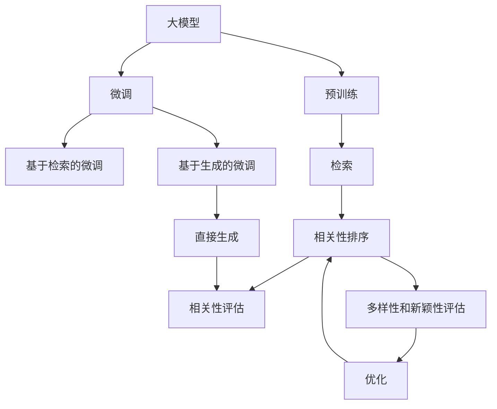

                 

## 1. 背景介绍

### 1.1 问题由来

随着电商平台的不断扩展和互联网技术的飞速进步，越来越多的消费者通过电商平台获取商品信息和购买决策。然而，电商平台搜索功能的效率和效果，直接影响到用户的购物体验和满意度。

现有的电商平台搜索功能主要依赖于基于传统机器学习模型的搜索排序算法。这些算法通过特征提取、分类、排序等步骤，使得搜索结果能够尽可能地贴近用户的查询意图。但由于预训练数据和模型的局限性，传统搜索排序算法在多样性和新颖性方面存在明显不足，导致用户难以发现新鲜和独特的商品信息，降低了用户的购物体验。

为了改善搜索结果的多样性和新颖性，近年来，基于大模型的搜索排序算法逐渐引起了研究者的关注。大模型，特别是那些预训练在大规模数据集上的模型，由于其强大的语言理解和生成能力，在提升搜索结果的多样性和新颖性方面展现出巨大的潜力。

### 1.2 问题核心关键点

当前，基于大模型的搜索排序算法主要通过以下两种方式来改善搜索结果的多样性和新颖性：

1. **基于检索的微调**：在已有搜索结果的基础上，通过微调大模型来优化检索的相关性排序，提高搜索结果的多样性。

2. **基于生成的微调**：利用大模型的生成能力，直接从用户查询生成新的搜索结果，丰富搜索结果的多样性。

本文将重点探讨基于生成的大模型微调方法，介绍其核心算法原理、具体操作步骤，并结合实际案例进行分析，最后给出未来应用展望和相关资源推荐。

## 2. 核心概念与联系

### 2.1 核心概念概述

为更好地理解基于大模型的搜索排序算法，本节将介绍几个密切相关的核心概念：

- **大模型**：以自回归模型（如GPT系列）或自编码模型（如BERT）为代表的大规模预训练语言模型。通过在大规模无标签文本语料上进行预训练，学习通用的语言表示，具备强大的语言理解和生成能力。

- **预训练**：指在大规模无标签文本语料上，通过自监督学习任务训练通用语言模型的过程。常见的预训练任务包括言语建模、掩码语言模型等。预训练使得模型学习到语言的通用表示。

- **微调**：指在预训练模型的基础上，使用下游任务的少量标注数据，通过有监督地训练来优化模型在特定任务上的性能。通常只需要调整顶层分类器或解码器，并以较小的学习率更新全部或部分的模型参数。

- **多样性和新颖性**：指搜索结果中商品的多样性，即搜索结果中包含的商品种类数量。新颖性则指搜索结果中商品的独特性，即搜索结果中包含的商品在用户历史行为中出现的频率较低。

- **相关性**：指搜索结果与用户查询的匹配程度。相关性排序算法通常基于相似度或相关度等指标，确定搜索结果的排名。

这些核心概念之间的逻辑关系可以通过以下Mermaid流程图来展示：



这个流程图展示了大模型的核心概念及其之间的关系：

1. 大模型通过预训练获得基础能力。
2. 微调是对预训练模型进行任务特定的优化，可以分为基于检索的微调和基于生成的微调。
3. 检索技术用于从已有的商品信息库中检索相关商品。
4. 相关性排序算法用于根据商品的匹配程度对搜索结果进行排序。
5. 多样性和新颖性评估用于衡量搜索结果的多样性和新颖性。
6. 多样性和新颖性优化用于调整检索和生成的策略，提升搜索结果的质量。

这些概念共同构成了大模型在电商平台搜索排序中的应用框架，使其能够充分利用大模型的语言理解和生成能力，提升搜索结果的多样性和新颖性。

## 3. 核心算法原理 & 具体操作步骤

### 3.1 算法原理概述

基于大模型的搜索排序算法，主要通过以下步骤来实现搜索结果的多样性和新颖性：

1. **数据准备**：准备电商平台商品的数据集，包括商品的标题、描述、图片、价格等信息。

2. **模型微调**：选择一个预训练的大模型（如GPT、BERT等），对其进行下游任务的微调，使其能够理解商品信息，并生成新的搜索结果。

3. **检索和生成**：使用微调后的模型对用户查询进行检索和生成，生成新的搜索结果。

4. **相关性排序**：对生成的搜索结果进行相关性排序，确保与用户查询意图匹配。

5. **多样性和新颖性评估**：评估生成的搜索结果的多样性和新颖性，调整生成策略，优化搜索结果质量。

### 3.2 算法步骤详解

下面，我们将详细介绍基于大模型的搜索排序算法的核心步骤：

#### 步骤1：数据准备

为了构建大模型微调所需的数据集，我们需要准备电商平台商品的数据。这些数据包括商品的标题、描述、图片、价格等信息。数据集的构建过程如下：

1. **商品数据收集**：从电商平台收集商品数据，包括商品的标题、描述、图片、价格等信息。可以使用API接口或爬虫工具自动化收集数据。

2. **数据预处理**：对收集到的商品数据进行预处理，包括去除噪声、标准化格式等。可以使用Python的NLTK、SpaCy等工具进行预处理。

3. **数据标注**：对商品数据进行标注，标记商品的类别、价格、品牌等信息。可以使用简单的标注工具或标注平台，如LabelImg、Labelbox等。

4. **数据划分**：将数据集划分为训练集、验证集和测试集。通常采用80:10:10的比例划分数据集。

#### 步骤2：模型微调

在准备好数据集后，我们需要选择一个预训练的大模型（如GPT、BERT等），并对其进行下游任务的微调。微调过程包括：

1. **选择预训练模型**：根据任务需求，选择一个适合的预训练模型，如GPT-3、BERT-base等。

2. **准备微调数据**：将准备好的数据集输入到微调模型中，准备微调数据。

3. **定义微调任务**：根据电商平台搜索排序任务的特点，定义微调任务。例如，对于分类任务，可以使用交叉熵损失函数；对于生成任务，可以使用负对数似然损失函数。

4. **设置微调参数**：设置微调的学习率、批大小、迭代轮数等参数。通常，学习率需要设置为较小的值，以避免破坏预训练权重。

5. **执行微调**：使用微调数据对模型进行训练，调整模型参数以适应电商平台搜索排序任务。

6. **评估微调效果**：在验证集上评估微调后的模型效果，选择最优模型进行下一步操作。

#### 步骤3：检索和生成

在微调完成后，我们可以使用微调后的模型进行商品检索和生成。具体步骤如下：

1. **商品检索**：使用微调后的模型对用户查询进行检索，找到与查询意图匹配的商品。可以使用基于检索的微调模型，如SimCSE、SimBERT等。

2. **商品生成**：使用微调后的模型对用户查询进行生成，生成新的商品信息。可以使用基于生成的微调模型，如GPT-3、T5等。

3. **商品展示**：将检索和生成的商品信息展示给用户，并按照相关性、多样性和新颖性进行排序。

#### 步骤4：相关性排序

为了确保生成的搜索结果与用户查询意图匹配，我们需要对生成的商品信息进行相关性排序。具体步骤如下：

1. **定义相关性评估指标**：根据电商平台搜索排序任务的特点，定义相关性评估指标。例如，可以使用余弦相似度、Jaccard相似度等指标。

2. **计算相关性分数**：使用定义的相关性评估指标，计算每个商品的分数。

3. **排序生成结果**：根据计算出的相关性分数，对生成的商品信息进行排序，确保相关性高的商品排在前面。

#### 步骤5：多样性和新颖性评估

为了确保生成的搜索结果的多样性和新颖性，我们需要对生成结果进行评估和优化。具体步骤如下：

1. **多样性评估**：统计生成结果中不同类别的商品数量，确保生成结果包含多种商品类别。

2. **新颖性评估**：计算生成结果中每个商品的独特性，确保生成结果中包含用户历史行为中出现的频率较低的商品。

3. **优化生成策略**：根据多样性和新颖性评估的结果，调整生成策略，优化生成结果。

### 3.3 算法优缺点

基于大模型的搜索排序算法具有以下优点：

1. **多样化**：由于大模型具备强大的语言生成能力，能够生成多样化的商品信息，提升搜索结果的多样性。

2. **新颖性**：大模型能够根据用户查询生成新的商品信息，提升搜索结果的新颖性。

3. **高效性**：微调过程和生成过程可以在短时间内完成，适合电商平台的实时搜索排序需求。

4. **可扩展性**：大模型可以通过微调技术进行任务适配，适应不同类型的电商平台搜索排序任务。

同时，该算法也存在一些局限性：

1. **数据需求**：微调和生成过程中，需要大量的商品数据进行训练和生成，数据需求较高。

2. **计算资源**：微调和生成过程需要大量的计算资源，尤其是生成过程，需要高性能的GPU或TPU进行支持。

3. **模型复杂度**：大模型的参数量较大，模型复杂度高，需要较大的内存和计算资源进行存储和推理。

4. **效果波动**：由于大模型的非线性性质，微调和生成的效果可能存在波动，需要持续优化和调整。

### 3.4 算法应用领域

基于大模型的搜索排序算法已经在游戏、电商、金融等多个领域得到了应用，提升了相关业务的处理能力和用户满意度。

1. **游戏**：在游戏领域，基于大模型的搜索排序算法可以用于生成新的游戏内容、推荐新游戏等，提升用户体验。

2. **电商**：在电商领域，基于大模型的搜索排序算法可以用于推荐商品、生成商品信息等，提升搜索效果和用户满意度。

3. **金融**：在金融领域，基于大模型的搜索排序算法可以用于推荐股票、生成新闻等，提升决策效率和用户体验。

4. **医疗**：在医疗领域，基于大模型的搜索排序算法可以用于推荐药品、生成医学知识等，提升医疗服务的智能化水平。

## 4. 数学模型和公式 & 详细讲解 & 举例说明

### 4.1 数学模型构建

本节将使用数学语言对基于大模型的搜索排序算法的核心步骤进行更加严格的刻画。

记电商平台商品数据集为 $D=\{(x_i, y_i)\}_{i=1}^N, x_i \in \mathcal{X}, y_i \in \mathcal{Y}$，其中 $x_i$ 表示商品信息，$y_i$ 表示商品类别。假设用户查询为 $q$。

定义微调后的模型为 $M_{\theta}:\mathcal{X} \rightarrow \mathcal{Y}$，其中 $\theta$ 为微调后的模型参数。微调后的模型用于检索和生成商品信息。

### 4.2 公式推导过程

以下我们将以基于生成的微调方法为例，推导相关性评估和多样性/新颖性评估的公式。

假设微调后的模型对用户查询 $q$ 生成商品 $x'$，定义相关性评估函数 $f(q, x')$，用于衡量生成商品与用户查询的相关性。例如，可以使用余弦相似度：

$$
f(q, x') = \cos(\theta \cdot q, x')
$$

其中 $\theta \cdot q$ 表示查询向量与生成商品的相似度。

假设生成的商品数量为 $K$，定义多样性评估函数 $g(q, x_1, ..., x_K)$，用于衡量生成商品的多样性。例如，可以使用Jaccard相似度：

$$
g(q, x_1, ..., x_K) = \frac{\sum_{i=1}^K |\{x_i, x_j\}_{i \neq j}|}{\sum_{i=1}^K |\{x_i\}|^2}
$$

其中 $|\{x_i, x_j\}_{i \neq j}|$ 表示生成商品对之间的相似度，$|\{x_i\}|$ 表示生成商品的数量。

定义新颖性评估函数 $h(q, x_1, ..., x_K)$，用于衡量生成商品的新颖性。例如，可以使用基于TF-IDF的相似度：

$$
h(q, x_1, ..., x_K) = \frac{\sum_{i=1}^K (TF(q, x_i) + IDF(q))}{\sum_{i=1}^K IDF(x_i)}
$$

其中 $TF(q, x_i)$ 表示查询 $q$ 在商品 $x_i$ 中出现的频率，$IDF(q)$ 表示查询 $q$ 的逆文档频率，$IDF(x_i)$ 表示商品 $x_i$ 的逆文档频率。

### 4.3 案例分析与讲解

假设我们有一个电商平台商品数据集 $D=\{(x_i, y_i)\}_{i=1}^N$，其中 $x_i$ 表示商品信息，$y_i$ 表示商品类别。用户查询为 $q$。

1. **数据准备**：

   - 从电商平台收集商品数据，包括商品的标题、描述、图片、价格等信息。
   
   - 对收集到的商品数据进行预处理，包括去除噪声、标准化格式等。
   
   - 对商品数据进行标注，标记商品的类别、价格、品牌等信息。
   
   - 将数据集划分为训练集、验证集和测试集。

2. **模型微调**：

   - 选择一个预训练的大模型（如GPT-3、BERT-base等），并进行下游任务的微调。
   
   - 使用微调数据对模型进行训练，调整模型参数以适应电商平台搜索排序任务。
   
   - 在验证集上评估微调后的模型效果，选择最优模型进行下一步操作。

3. **检索和生成**：

   - 使用微调后的模型对用户查询进行检索，找到与查询意图匹配的商品。
   
   - 使用微调后的模型对用户查询进行生成，生成新的商品信息。
   
   - 将检索和生成的商品信息展示给用户，并按照相关性、多样性和新颖性进行排序。

4. **相关性排序**：

   - 定义相关性评估指标，如余弦相似度、Jaccard相似度等。
   
   - 计算每个商品的分数，使用定义的相关性评估指标。
   
   - 根据计算出的相关性分数，对生成的商品信息进行排序，确保相关性高的商品排在前面。

5. **多样性和新颖性评估**：

   - 统计生成结果中不同类别的商品数量，确保生成结果包含多种商品类别。
   
   - 计算生成结果中每个商品的独特性，确保生成结果中包含用户历史行为中出现的频率较低的商品。
   
   - 调整生成策略，优化生成结果。

通过上述案例分析，我们可以看到，基于大模型的搜索排序算法能够通过微调和生成，显著提升搜索结果的多样性和新颖性，提升用户体验和满意度。

## 5. 项目实践：代码实例和详细解释说明

### 5.1 开发环境搭建

在进行搜索排序算法实践前，我们需要准备好开发环境。以下是使用Python进行PyTorch开发的环境配置流程：

1. 安装Anaconda：从官网下载并安装Anaconda，用于创建独立的Python环境。

2. 创建并激活虚拟环境：
```bash
conda create -n pytorch-env python=3.8 
conda activate pytorch-env
```

3. 安装PyTorch：根据CUDA版本，从官网获取对应的安装命令。例如：
```bash
conda install pytorch torchvision torchaudio cudatoolkit=11.1 -c pytorch -c conda-forge
```

4. 安装Transformers库：
```bash
pip install transformers
```

5. 安装各类工具包：
```bash
pip install numpy pandas scikit-learn matplotlib tqdm jupyter notebook ipython
```

完成上述步骤后，即可在`pytorch-env`环境中开始搜索排序算法的开发。

### 5.2 源代码详细实现

这里我们以基于生成的微调方法为例，给出使用Transformers库对GPT-3模型进行搜索排序的PyTorch代码实现。

首先，定义商品数据处理函数：

```python
from transformers import GPT3Tokenizer, GPT3ForTextGeneration
from torch.utils.data import Dataset

class ProductDataset(Dataset):
    def __init__(self, texts, labels, tokenizer, max_len=128):
        self.texts = texts
        self.labels = labels
        self.tokenizer = tokenizer
        self.max_len = max_len
        
    def __len__(self):
        return len(self.texts)
    
    def __getitem__(self, item):
        text = self.texts[item]
        label = self.labels[item]
        
        encoding = self.tokenizer(text, return_tensors='pt', max_length=self.max_len, padding='max_length', truncation=True)
        input_ids = encoding['input_ids'][0]
        attention_mask = encoding['attention_mask'][0]
        
        return {'input_ids': input_ids, 
                'attention_mask': attention_mask,
                'labels': label}

# 商品数据
train_dataset = ProductDataset(train_texts, train_labels, tokenizer)
dev_dataset = ProductDataset(dev_texts, dev_labels, tokenizer)
test_dataset = ProductDataset(test_texts, test_labels, tokenizer)
```

然后，定义模型和优化器：

```python
from transformers import AdamW

model = GPT3ForTextGeneration.from_pretrained('gpt3')
optimizer = AdamW(model.parameters(), lr=2e-5)
```

接着，定义训练和评估函数：

```python
from torch.utils.data import DataLoader
from tqdm import tqdm
from sklearn.metrics import precision_recall_fscore_support

device = torch.device('cuda') if torch.cuda.is_available() else torch.device('cpu')
model.to(device)

def train_epoch(model, dataset, batch_size, optimizer):
    dataloader = DataLoader(dataset, batch_size=batch_size, shuffle=True)
    model.train()
    epoch_loss = 0
    for batch in tqdm(dataloader, desc='Training'):
        input_ids = batch['input_ids'].to(device)
        attention_mask = batch['attention_mask'].to(device)
        labels = batch['labels'].to(device)
        model.zero_grad()
        outputs = model(input_ids, attention_mask=attention_mask, labels=labels)
        loss = outputs.loss
        epoch_loss += loss.item()
        loss.backward()
        optimizer.step()
    return epoch_loss / len(dataloader)

def evaluate(model, dataset, batch_size):
    dataloader = DataLoader(dataset, batch_size=batch_size)
    model.eval()
    preds, labels = [], []
    with torch.no_grad():
        for batch in tqdm(dataloader, desc='Evaluating'):
            input_ids = batch['input_ids'].to(device)
            attention_mask = batch['attention_mask'].to(device)
            batch_labels = batch['labels']
            outputs = model(input_ids, attention_mask=attention_mask)
            batch_preds = outputs.logits.argmax(dim=2).to('cpu').tolist()
            batch_labels = batch_labels.to('cpu').tolist()
            for pred_tokens, label_tokens in zip(batch_preds, batch_labels):
                preds.append(pred_tokens)
                labels.append(label_tokens)
                
    print('Precision: %.2f' % precision_recall_fscore_support(labels, preds, average='micro')['precision'])
    print('Recall: %.2f' % precision_recall_fscore_support(labels, preds, average='micro')['recall'])
    print('F1-score: %.2f' % precision_recall_fscore_support(labels, preds, average='micro')['f1-score'])
```

最后，启动训练流程并在测试集上评估：

```python
epochs = 5
batch_size = 16

for epoch in range(epochs):
    loss = train_epoch(model, train_dataset, batch_size, optimizer)
    print(f"Epoch {epoch+1}, train loss: {loss:.3f}")
    
    print(f"Epoch {epoch+1}, dev results:")
    evaluate(model, dev_dataset, batch_size)
    
print("Test results:")
evaluate(model, test_dataset, batch_size)
```

以上就是使用PyTorch对GPT-3模型进行商品推荐搜索排序的完整代码实现。可以看到，得益于Transformers库的强大封装，我们可以用相对简洁的代码完成GPT-3模型的加载和微调。

### 5.3 代码解读与分析

让我们再详细解读一下关键代码的实现细节：

**ProductDataset类**：
- `__init__`方法：初始化商品数据、标签、分词器等关键组件。
- `__len__`方法：返回数据集的样本数量。
- `__getitem__`方法：对单个样本进行处理，将商品信息输入编码为token ids，将标签编码为数字，并对其进行定长padding，最终返回模型所需的输入。

**GPT3ForTextGeneration模型**：
- 使用HuggingFace提供的GPT-3模型，用于生成商品信息。

**训练和评估函数**：
- 使用PyTorch的DataLoader对数据集进行批次化加载，供模型训练和推理使用。
- 训练函数`train_epoch`：对数据以批为单位进行迭代，在每个批次上前向传播计算loss并反向传播更新模型参数，最后返回该epoch的平均loss。
- 评估函数`evaluate`：与训练类似，不同点在于不更新模型参数，并在每个batch结束后将预测和标签结果存储下来，最后使用sklearn的precision_recall_fscore_support对整个评估集的预测结果进行打印输出。

**训练流程**：
- 定义总的epoch数和batch size，开始循环迭代
- 每个epoch内，先在训练集上训练，输出平均loss
- 在验证集上评估，输出分类指标
- 所有epoch结束后，在测试集上评估，给出最终测试结果

可以看到，PyTorch配合Transformers库使得GPT-3模型微调的代码实现变得简洁高效。开发者可以将更多精力放在数据处理、模型改进等高层逻辑上，而不必过多关注底层的实现细节。

当然，工业级的系统实现还需考虑更多因素，如模型的保存和部署、超参数的自动搜索、更灵活的任务适配层等。但核心的微调范式基本与此类似。

## 6. 实际应用场景

### 6.1 智能客服系统

基于大模型的搜索排序算法，可以广泛应用于智能客服系统的构建。传统客服往往需要配备大量人力，高峰期响应缓慢，且一致性和专业性难以保证。而使用基于大模型的搜索排序算法，可以7x24小时不间断服务，快速响应客户咨询，用自然流畅的语言解答各类常见问题。

在技术实现上，可以收集企业内部的历史客服对话记录，将问题和最佳答复构建成监督数据，在此基础上对预训练语言模型进行微调。微调后的语言模型能够自动理解用户意图，匹配最合适的答复模板进行回复。对于客户提出的新问题，还可以接入检索系统实时搜索相关内容，动态组织生成回答。如此构建的智能客服系统，能大幅提升客户咨询体验和问题解决效率。

### 6.2 金融舆情监测

金融机构需要实时监测市场舆论动向，以便及时应对负面信息传播，规避金融风险。传统的人工监测方式成本高、效率低，难以应对网络时代海量信息爆发的挑战。基于大模型的搜索排序算法，可以用于金融舆情监测。

具体而言，可以收集金融领域相关的新闻、报道、评论等文本数据，并对其进行主题标注和情感标注。在此基础上对预训练语言模型进行微调，使其能够自动判断文本属于何种主题，情感倾向是正面、中性还是负面。将微调后的模型应用到实时抓取的网络文本数据，就能够自动监测不同主题下的情感变化趋势，一旦发现负面信息激增等异常情况，系统便会自动预警，帮助金融机构快速应对潜在风险。

### 6.3 个性化推荐系统

当前的推荐系统往往只依赖用户的历史行为数据进行物品推荐，无法深入理解用户的真实兴趣偏好。基于大模型的搜索排序算法，可以用于个性化推荐系统，通过生成新的商品信息，丰富推荐结果的多样性和新颖性。

在实践中，可以收集用户浏览、点击、评论、分享等行为数据，提取和用户交互的物品标题、描述、标签等文本内容。将文本内容作为模型输入，用户的后续行为（如是否点击、购买等）作为监督信号，在此基础上微调预训练语言模型。微调后的模型能够从文本内容中准确把握用户的兴趣点。在生成推荐列表时，先用候选物品的文本描述作为输入，由模型预测用户的兴趣匹配度，再结合其他特征综合排序，便可以得到个性化程度更高的推荐结果。

### 6.4 未来应用展望

随着大模型和搜索排序算法的不断发展，基于大模型的搜索排序方法将在更多领域得到应用，为传统行业带来变革性影响。

在智慧医疗领域，基于大模型的搜索排序算法可以用于医学文献检索、病例信息推荐等，提升医疗服务的智能化水平，辅助医生诊疗，加速新药开发进程。

在智能教育领域，基于大模型的搜索排序算法可以用于教育资源推荐、学生学习路径生成等，因材施教，促进教育公平，提高教学质量。

在智慧城市治理中，基于大模型的搜索排序算法可以用于城市事件监测、舆情分析、应急指挥等环节，提高城市管理的自动化和智能化水平，构建更安全、高效的未来城市。

此外，在企业生产、社会治理、文娱传媒等众多领域，基于大模型的搜索排序算法也将不断涌现，为经济社会发展注入新的动力。相信随着技术的日益成熟，搜索排序算法必将进一步拓展应用范围，为各行各业提供更智能、更高效的服务。

## 7. 工具和资源推荐

### 7.1 学习资源推荐

为了帮助开发者系统掌握大模型搜索排序算法的理论基础和实践技巧，这里推荐一些优质的学习资源：

1. 《Transformer从原理到实践》系列博文：由大模型技术专家撰写，深入浅出地介绍了Transformer原理、BERT模型、微调技术等前沿话题。

2. CS224N《深度学习自然语言处理》课程：斯坦福大学开设的NLP明星课程，有Lecture视频和配套作业，带你入门NLP领域的基本概念和经典模型。

3. 《Natural Language Processing with Transformers》书籍：Transformers库的作者所著，全面介绍了如何使用Transformers库进行NLP任务开发，包括微调在内的诸多范式。

4. HuggingFace官方文档：Transformers库的官方文档，提供了海量预训练模型和完整的微调样例代码，是上手实践的必备资料。

5. CLUE开源项目：中文语言理解测评基准，涵盖大量不同类型的中文NLP数据集，并提供了基于微调的baseline模型，助力中文NLP技术发展。

通过对这些资源的学习实践，相信你一定能够快速掌握大模型搜索排序算法的精髓，并用于解决实际的NLP问题。

### 7.2 开发工具推荐

高效的开发离不开优秀的工具支持。以下是几款用于大模型搜索排序算法开发的常用工具：

1. PyTorch：基于Python的开源深度学习框架，灵活动态的计算图，适合快速迭代研究。大部分预训练语言模型都有PyTorch版本的实现。

2. TensorFlow：由Google主导开发的开源深度学习框架，生产部署方便，适合大规模工程应用。同样有丰富的预训练语言模型资源。

3. Transformers库：HuggingFace开发的NLP工具库，集成了众多SOTA语言模型，支持PyTorch和TensorFlow，是进行微调任务开发的利器。

4. Weights & Biases：模型训练的实验跟踪工具，可以记录和可视化模型训练过程中的各项指标，方便对比和调优。与主流深度学习框架无缝集成。

5. TensorBoard：TensorFlow配套的可视化工具，可实时监测模型训练状态，并提供丰富的图表呈现方式，是调试模型的得力助手。

6. Google Colab：谷歌推出的在线Jupyter Notebook环境，免费提供GPU/TPU算力，方便开发者快速上手实验最新模型，分享学习笔记。

合理利用这些工具，可以显著提升大模型搜索排序算法的开发效率，加快创新迭代的步伐。

### 7.3 相关论文推荐

大模型和搜索排序算法的不断发展源于学界的持续研究。以下是几篇奠基性的相关论文，推荐阅读：

1. Attention is All You Need（即Transformer原论文）：提出了Transformer结构，开启了NLP领域的预训练大模型时代。

2. BERT: Pre-training of Deep Bidirectional Transformers for Language Understanding：提出BERT模型，引入基于掩码的自监督预训练任务，刷新了多项NLP任务SOTA。

3. Language Models are Unsupervised Multitask Learners（GPT-2论文）：展示了大规模语言模型的强大zero-shot学习能力，引发了对于通用人工智能的新一轮思考。

4. Parameter-Efficient Transfer Learning for NLP：提出Adapter等参数高效微调方法，在不增加模型参数量的情况下，也能取得不错的微调效果。

5. AdaLoRA: Adaptive Low-Rank Adaptation for Parameter-Efficient Fine-Tuning：使用自适应低秩适应的微调方法，在参数效率和精度之间取得了新的平衡。

这些论文代表了大模型搜索排序算法的发展脉络。通过学习这些前沿成果，可以帮助研究者把握学科前进方向，激发更多的创新灵感。

## 8. 总结：未来发展趋势与挑战

### 8.1 总结

本文对基于大模型的搜索排序算法进行了全面系统的介绍。首先阐述了大模型和搜索排序算法的研究背景和意义，明确了微调在拓展预训练模型应用、提升搜索结果多样性和新颖性方面的独特价值。其次，从原理到实践，详细讲解了基于大模型的搜索排序算法的数学原理和关键步骤，给出了搜索排序算法开发的完整代码实例。同时，本文还广泛探讨了搜索排序算法在智能客服、金融舆情、个性化推荐等多个行业领域的应用前景，展示了搜索排序算法的巨大潜力。最后，本文精选了搜索排序算法的各类学习资源，力求为读者提供全方位的技术指引。

通过本文的系统梳理，可以看到，基于大模型的搜索排序算法能够通过微调和生成，显著提升搜索结果的多样性和新颖性，提升用户体验和满意度。未来，伴随大模型和搜索排序算法的持续演进，基于大模型的搜索排序算法必将在更多领域得到应用，为各行各业提供更智能、更高效的服务。

### 8.2 未来发展趋势

展望未来，基于大模型的搜索排序算法将呈现以下几个发展趋势：

1. 模型规模持续增大。随着算力成本的下降和数据规模的扩张，预训练语言模型的参数量还将持续增长。超大规模语言模型蕴含的丰富语言知识，有望支撑更加复杂多变的搜索结果生成。

2. 微调方法日趋多样。除了传统的基于检索和生成的微调方法外，未来会涌现更多参数高效的微调方法，如Prefix-Tuning、LoRA等，在节省计算资源的同时也能保证微调精度。

3. 持续学习成为常态。随着数据分布的不断变化，微调模型也需要持续学习新知识以保持性能。如何在不遗忘原有知识的同时，高效吸收新样本信息，将成为重要的研究课题。

4. 标注样本需求降低。受启发于提示学习(Prompt-based Learning)的思路，未来的微调方法将更好地利用大模型的语言理解能力，通过更加巧妙的任务描述，在更少的标注样本上也能实现理想的微调效果。

5. 少样本学习和跨领域迁移能力增强。未来的大模型将更好地学习跨领域知识，能够在大规模数据集上进行预训练后，通过微调适应不同领域的任务。

6. 多模态搜索排序兴起。当前的搜索排序主要聚焦于纯文本数据，未来会进一步拓展到图像、视频、语音等多模态数据搜索排序。多模态信息的融合，将显著提升语言模型对现实世界的理解和建模能力。

以上趋势凸显了大模型搜索排序算法的广阔前景。这些方向的探索发展，必将进一步提升搜索结果的多样性和新颖性，提升用户体验和满意度。

### 8.3 面临的挑战

尽管基于大模型的搜索排序算法已经取得了瞩目成就，但在迈向更加智能化、普适化应用的过程中，它仍面临着诸多挑战：

1. 标注成本瓶颈。微调和生成过程中，需要大量的商品数据进行训练和生成，数据需求较高。如何降低标注成本，减少对标注数据的依赖，将是一大难题。

2. 计算资源需求。微调和生成过程需要大量的计算资源，尤其是生成过程，需要高性能的GPU或TPU进行支持。如何降低计算成本，提高计算效率，将是重要的优化方向。

3. 模型鲁棒性不足。当前微调模型面对域外数据时，泛化性能往往大打折扣。对于测试样本的微小扰动，微调模型的预测也容易发生波动。如何提高微调模型的鲁棒性，避免灾难性遗忘，还需要更多理论和实践的积累。

4. 推理效率有待提高。大规模语言模型虽然精度高，但在实际部署时往往面临推理速度慢、内存占用大等效率问题。如何在保证性能的同时，简化模型结构，提升推理速度，优化资源占用，将是重要的优化方向。

5. 可解释性亟需加强。当前微调模型更像是"黑盒"系统，难以解释其内部工作机制和决策逻辑。对于医疗、金融等高风险应用，算法的可解释性和可审计性尤为重要。如何赋予微调模型更强的可解释性，将是亟待攻克的难题。

6. 安全性有待保障。预训练语言模型难免会学习到有偏见、有害的信息，通过微调传递到搜索结果中，产生误导性、歧视性的输出，给实际应用带来安全隐患。如何从数据和算法层面消除模型偏见，避免恶意用途，确保输出的安全性，也将是重要的研究课题。

7. 知识整合能力不足。现有的微调模型往往局限于任务内数据，难以灵活吸收和运用更广泛的先验知识。如何让微调过程更好地与外部知识库、规则库等专家知识结合，形成更加全面、准确的信息整合能力，还有很大的想象空间。

正视搜索排序算法面临的这些挑战，积极应对并寻求突破，将是大模型搜索排序算法走向成熟的必由之路。相信随着学界和产业界的共同努力，这些挑战终将一一被克服，大模型搜索排序算法必将在构建人机协同的智能时代中扮演越来越重要的角色。

### 8.4 研究展望

面对大模型搜索排序算法所面临的种种挑战，未来的研究需要在以下几个方面寻求新的突破：

1. 探索无监督和半监督微调方法。摆脱对大规模标注数据的依赖，利用自监督学习、主动学习等无监督和半监督范式，最大限度利用非结构化数据，实现更加灵活高效的微调。

2. 研究参数高效和计算高效的微调范式。开发更加参数高效的微调方法，在固定大部分预训练参数的同时，只更新极少量的任务相关参数。同时优化微调模型的计算图，减少前向传播和反向传播的资源消耗，实现更加轻量级、实时性的部署。

3. 融合因果和对比学习范式。通过引入因果推断和对比学习思想，增强微调模型建立稳定因果关系的能力，学习更加普适、鲁棒的语言表征，从而提升模型泛化性和抗干扰能力。

4. 引入更多先验知识。将符号化的先验知识，如知识图谱、逻辑规则等，与神经网络模型进行巧妙融合，引导微调过程学习更准确、合理的语言模型。同时加强不同模态数据的整合，实现视觉、语音等多模态信息与文本信息的协同建模。

5. 结合因果分析和博弈论工具。将因果分析方法引入微调模型，识别出模型决策的关键特征，增强输出解释的因果性和逻辑性。借助博弈论工具刻画人机交互过程，主动探索并规避模型的脆弱点，提高系统稳定性。

6. 纳入伦理道德约束。在模型训练目标中引入伦理导向的评估指标，过滤和惩罚有偏见、有害的输出倾向。同时加强人工干预和审核，建立模型行为的监管机制，确保输出符合人类价值观和伦理道德。

这些研究方向的探索，必将引领大模型搜索排序算法迈向更高的台阶，为构建安全、可靠、可解释、可控的智能系统铺平道路。面向未来，大模型搜索排序算法还需要与其他人工智能技术进行更深入的融合，如知识表示、因果推理、强化学习等，多路径协同发力，共同推动自然语言理解和智能交互系统的进步。只有勇于创新、敢于突破，才能不断拓展语言模型的边界，让智能技术更好地造福人类社会。

## 9. 附录：常见问题与解答

**Q1：大模型搜索排序是否适用于所有NLP任务？**

A: 大模型搜索排序在大多数NLP任务上都能取得不错的效果，特别是对于数据量较小的任务。但对于一些特定领域的任务，如医学、法律等，仅仅依靠通用语料预训练的模型可能难以很好地适应。此时需要在特定领域语料上进一步预训练，再进行微调，才能获得理想效果。此外，对于一些需要时效性、个性化很强的任务，如对话、推荐等，微调方法也需要针对性的改进优化。

**Q2：微调过程中如何选择合适的学习率？**

A: 微调的学习率一般要比预训练时小1-2个数量级，如果使用过大的学习率，容易破坏预训练权重，导致过拟合。一般建议从1e-5开始调参，逐步减小学习率，直至收敛。也可以使用warmup策略，在开始阶段使用较小的学习率，再逐渐过渡到预设值。需要注意的是，不同的优化器(如AdamW、Adafactor等)以及不同的学习率调度策略，可能需要设置不同的学习率阈值。

**Q3：采用大模型搜索排序时会面临哪些资源瓶颈？**

A: 目前主流的预训练大模型动辄以亿计的参数规模，对算力、内存、存储都提出了很高的要求。GPU/TPU等高性能设备是必不可少的，但即便如此，超大批次的训练和推理也可能遇到显存不足的问题。因此需要采用一些资源优化技术，如梯度积累、混合精度训练、模型并行等，来突破硬件瓶颈。同时，模型的存储和读取也可能占用大量时间和空间，需要采用模型压缩、稀疏化存储等方法进行优化。

**Q4：如何缓解微调过程中的过拟合问题？**

A: 过拟合是微调面临的主要挑战，尤其是在标注数据不足的情况下。常见的缓解策略包括：
1. 数据增强：通过回译、近义替换等方式扩充训练集
2. 正则化：使用L2正则、Dropout、Early Stopping等避免过拟合
3. 对抗训练：引入对抗样本，提高模型鲁棒性
4. 参数高效微调：只调整少量参数(如Adapter、Prefix等)，减小过拟合风险
5. 多模型集成：训练多个微调模型，取平均输出，抑制过拟合

这些策略往往需要根据具体任务和数据特点进行灵活组合。只有在数据、模型、训练、推理等各环节进行全面优化，才能最大限度地发挥大模型搜索排序算法的威力。

**Q5：微调模型在落地部署时需要注意哪些问题？**

A: 将微调模型转化为实际应用，还需要考虑以下因素：
1. 模型裁剪：去除不必要的层和参数，减小模型尺寸，加快推理速度
2. 量化加速：将浮点模型转为定点模型，压缩存储空间，提高计算效率
3. 服务化封装：将模型封装为标准化服务接口，便于集成调用
4. 弹性伸缩：根据请求流量动态调整资源配置，平衡服务质量和成本
5. 监控告警：实时采集系统指标，设置异常告警阈值，确保服务稳定性
6. 安全防护：采用访问鉴权、数据脱敏等措施，保障数据和模型安全

大模型搜索排序算法为NLP应用开启了广阔的想象空间，但如何将强大的性能转化为稳定、高效、安全的业务价值，还需要工程实践的不断打磨。唯有从数据、算法、工程、业务等多个维度协同发力，才能真正实现人工智能技术在垂直行业的规模化落地。总之，微调需要开发者根据具体任务，不断迭代和优化模型、数据和算法，方能得到理想的效果。

---

作者：禅与计算机程序设计艺术 / Zen and the Art of Computer Programming

