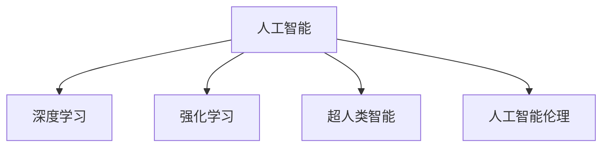

                 

## 1. 背景介绍

### 1.1 问题的由来
随着人工智能技术的迅猛发展，人们开始对AI的未来产生种种担忧，尤其是担忧AI会失控，导致无法预见的后果。然而，这些担忧很多时候是基于对AI技术的误解和片面理解。本节将探讨这些误解的来源，以及AI技术发展的真相。

### 1.2 问题核心关键点
当前对AI失控的担忧主要集中在对AI技术的理解不足和过度夸大其能力。AI失控的神话主要基于以下几个关键点：

1. **智能涌现：** 一些人认为AI会像人类一样，具有自我意识和智能涌现现象。
2. **不可预测性：** AI决策过程的不可解释性和不确定性，导致对其行为难以预测。
3. **伦理问题：** AI可能带来的伦理道德问题，如隐私侵犯、就业替代等。
4. **安全威胁：** AI技术可能被用于恶意目的，如自动驾驶车辆攻击、恶意软件等。

然而，这些担忧往往基于对AI技术的不完全理解，而非技术本身。下面，我们将详细探讨AI技术的发展真相，并解析这些担忧的误区。

## 2. 核心概念与联系

### 2.1 核心概念概述

在探讨AI失控的神话之前，我们先来澄清几个核心概念：

1. **人工智能：** 指通过计算机程序实现的人类智能行为。包括机器学习、自然语言处理、计算机视觉等技术。
2. **深度学习：** 一种通过多层神经网络实现数据表示和模式学习的技术。广泛应用于图像、语音、文本等数据处理。
3. **强化学习：** 通过试错学习优化决策策略的技术，广泛应用于游戏、机器人、推荐系统等领域。
4. **超人类智能：** 指超越人类智能能力的AI，包括自我意识、创造性、普遍理性等特征。
5. **人工智能伦理：** 涉及AI技术对人类社会、环境、伦理道德的影响，包括隐私、就业、公平性等问题。

这些核心概念之间的关系可以通过以下Mermaid流程图来展示：



这个流程图展示了大语言模型的核心概念及其之间的关系：

1. 人工智能通过深度学习和强化学习等技术，逐步提升了智能水平。
2. 超人类智能是人工智能发展的终极目标，但其存在性尚无定论。
3. 人工智能伦理是指导人工智能发展的重要准则，需平衡技术发展与社会伦理。

这些概念构成了人工智能技术发展的基本框架，帮助我们理解AI失控的神话背后的逻辑。

### 2.2 核心概念原理和架构

深度学习和强化学习是当前人工智能技术的两大支柱，下面我们将详细讲解其原理和架构。

#### 2.2.1 深度学习

深度学习是一种通过多层神经网络实现数据表示和模式学习的技术。其主要原理包括：

1. **前向传播：** 数据通过网络层级进行传递，每一层将输入数据进行非线性变换，输出下一层。
2. **反向传播：** 通过计算损失函数对参数的梯度，更新网络参数以最小化损失。
3. **优化算法：** 如梯度下降、Adam、Adagrad等，用于优化网络参数更新。

##### 2.2.1.1 前向传播

前向传播算法是深度学习的核心，其实现过程如下：

1. 输入数据 $x$ 经过第一层神经网络变换为 $h_1$。
2. $h_1$ 再经过第二层神经网络变换为 $h_2$，以此类推。
3. 最终输出结果 $y$ 是每一层输出 $h_k$ 的加权和。

用数学公式表示，假设网络有 $L$ 层，输入 $x$ 的维数为 $n$，输出 $y$ 的维数为 $m$。则前向传播过程可以表示为：

$$
y = h_L \cdot W_L + b_L
$$

其中 $h_L$ 是第 $L$ 层网络的输出，$W_L$ 和 $b_L$ 分别是第 $L$ 层的权重和偏置。

##### 2.2.1.2 反向传播

反向传播算法用于计算损失函数对网络参数的梯度，更新网络参数以最小化损失。其实现过程如下：

1. 计算损失函数 $J$ 对输出 $y$ 的梯度。
2. 通过链式法则，计算每个隐藏层的梯度。
3. 使用梯度下降等优化算法更新参数 $W$ 和 $b$。

用数学公式表示，假设损失函数为 $J(y, t)$，输出 $y$ 的维数为 $m$，网络有 $L$ 层。则反向传播过程可以表示为：

$$
\frac{\partial J}{\partial W_i} = \frac{\partial J}{\partial h_i} \cdot \frac{\partial h_i}{\partial W_i}
$$

其中 $i$ 表示第 $i$ 层，$h_i$ 是第 $i$ 层的输出。

##### 2.2.1.3 优化算法

深度学习中的优化算法用于更新网络参数，以最小化损失函数。常见的优化算法包括：

- **梯度下降：** 最简单且常用的优化算法，通过计算梯度方向更新参数。
- **Adam：** 结合动量、梯度的一阶和二阶矩估计，收敛速度快，适用于大规模数据集。
- **Adagrad：** 通过自适应地调整学习率，适用于稀疏数据集。

#### 2.2.2 强化学习

强化学习是一种通过试错学习优化决策策略的技术。其主要原理包括：

1. **状态-动作映射：** 将环境状态映射到动作，通过状态-动作映射执行操作。
2. **奖励函数：** 根据动作的执行结果，给予相应的奖励，用于评估策略的好坏。
3. **Q-learning：** 通过Q函数估计状态-动作的价值，最大化累积奖励。

##### 2.2.2.1 状态-动作映射

状态-动作映射是强化学习的基础，其实现过程如下：

1. 将当前环境状态 $s$ 映射到动作 $a$。
2. 执行动作 $a$，观察环境反馈。
3. 将新的状态 $s'$ 映射到动作 $a'$。

用数学公式表示，假设环境有 $S$ 个状态，动作有 $A$ 个。则状态-动作映射过程可以表示为：

$$
a = f(s)
$$

##### 2.2.2.2 奖励函数

奖励函数用于评估策略的好坏，其实现过程如下：

1. 在每个状态下，根据动作的执行结果，给予相应的奖励 $r$。
2. 通过累计奖励，评估策略的效果。
3. 最大化累积奖励，优化决策策略。

用数学公式表示，假设策略为 $\pi$，状态为 $s$，动作为 $a$，奖励为 $r$。则奖励函数可以表示为：

$$
J(\pi) = \sum_{s \in S} \sum_{a \in A} \pi(s|a) r(s,a)
$$

##### 2.2.2.3 Q-learning

Q-learning是一种基于Q函数的强化学习算法，其实现过程如下：

1. 通过Q函数估计状态-动作的价值 $Q(s,a)$。
2. 根据Q函数选择最优动作 $a'$。
3. 更新Q函数，最大化累积奖励。

用数学公式表示，假设状态为 $s$，动作为 $a$，Q函数为 $Q$，奖励为 $r$。则Q-learning过程可以表示为：

$$
Q(s,a) = Q(s,a) + \alpha [r + \gamma \max_{a'} Q(s',a')]
$$

其中 $\alpha$ 为学习率，$\gamma$ 为折扣因子，表示未来奖励的重要性。

## 3. 核心算法原理 & 具体操作步骤

### 3.1 算法原理概述

人工智能失控的神话主要源于对AI技术的不完全理解。下面我们将详细探讨这些神话的误区，并解析AI技术的发展真相。

#### 3.1.1 智能涌现

一些人认为AI会像人类一样，具有自我意识和智能涌现现象。然而，AI目前仅具备基于规则和数据的智能，没有自我意识和情感。AI的智能主要依赖于数据和算法，而非生物神经系统。

#### 3.1.2 不可预测性

AI决策过程的不可解释性和不确定性，导致对其行为难以预测。然而，AI的行为可以通过其算法和训练数据进行解释和预测。AI的预测能力受限于训练数据和模型复杂度，而非不可预测。

#### 3.1.3 伦理问题

AI可能带来的伦理道德问题，如隐私侵犯、就业替代等。然而，AI技术可以用于提升人类福祉，如医疗诊断、教育辅助等。伦理问题需要通过技术规范和法律法规加以解决。

#### 3.1.4 安全威胁

AI技术可能被用于恶意目的，如自动驾驶车辆攻击、恶意软件等。然而，AI技术的开发和使用需要严格的安全保障和伦理约束，通过技术手段和安全机制来防范安全威胁。

### 3.2 算法步骤详解

AI失控的神话主要基于对AI技术的不完全理解。下面我们将详细探讨这些神话的误区，并解析AI技术的发展真相。

#### 3.2.1 智能涌现

AI目前仅具备基于规则和数据的智能，没有自我意识和情感。AI的智能主要依赖于数据和算法，而非生物神经系统。

#### 3.2.2 不可预测性

AI的行为可以通过其算法和训练数据进行解释和预测。AI的预测能力受限于训练数据和模型复杂度，而非不可预测。

#### 3.2.3 伦理问题

AI技术可以用于提升人类福祉，如医疗诊断、教育辅助等。伦理问题需要通过技术规范和法律法规加以解决。

#### 3.2.4 安全威胁

AI技术的开发和使用需要严格的安全保障和伦理约束，通过技术手段和安全机制来防范安全威胁。

### 3.3 算法优缺点

AI失控的神话主要基于对AI技术的不完全理解。下面我们将详细探讨这些神话的误区，并解析AI技术的发展真相。

#### 3.3.1 智能涌现

AI目前仅具备基于规则和数据的智能，没有自我意识和情感。AI的智能主要依赖于数据和算法，而非生物神经系统。

#### 3.3.2 不可预测性

AI的行为可以通过其算法和训练数据进行解释和预测。AI的预测能力受限于训练数据和模型复杂度，而非不可预测。

#### 3.3.3 伦理问题

AI技术可以用于提升人类福祉，如医疗诊断、教育辅助等。伦理问题需要通过技术规范和法律法规加以解决。

#### 3.3.4 安全威胁

AI技术的开发和使用需要严格的安全保障和伦理约束，通过技术手段和安全机制来防范安全威胁。

### 3.4 算法应用领域

AI失控的神话主要基于对AI技术的不完全理解。下面我们将详细探讨这些神话的误区，并解析AI技术的发展真相。

#### 3.4.1 智能涌现

AI目前仅具备基于规则和数据的智能，没有自我意识和情感。AI的智能主要依赖于数据和算法，而非生物神经系统。

#### 3.4.2 不可预测性

AI的行为可以通过其算法和训练数据进行解释和预测。AI的预测能力受限于训练数据和模型复杂度，而非不可预测。

#### 3.4.3 伦理问题

AI技术可以用于提升人类福祉，如医疗诊断、教育辅助等。伦理问题需要通过技术规范和法律法规加以解决。

#### 3.4.4 安全威胁

AI技术的开发和使用需要严格的安全保障和伦理约束，通过技术手段和安全机制来防范安全威胁。

## 4. 数学模型和公式 & 详细讲解

### 4.1 数学模型构建

在探讨AI失控的神话之前，我们先来澄清几个核心概念：

1. **人工智能：** 指通过计算机程序实现的人类智能行为。包括机器学习、自然语言处理、计算机视觉等技术。
2. **深度学习：** 一种通过多层神经网络实现数据表示和模式学习的技术。广泛应用于图像、语音、文本等数据处理。
3. **强化学习：** 通过试错学习优化决策策略的技术，广泛应用于游戏、机器人、推荐系统等领域。
4. **超人类智能：** 指超越人类智能能力的AI，包括自我意识、创造性、普遍理性等特征。
5. **人工智能伦理：** 涉及AI技术对人类社会、环境、伦理道德的影响，包括隐私、就业、公平性等问题。

这些核心概念之间的关系可以通过以下Mermaid流程图来展示：


这个流程图展示了大语言模型的核心概念及其之间的关系：

1. 人工智能通过深度学习和强化学习等技术，逐步提升了智能水平。
2. 超人类智能是人工智能发展的终极目标，但其存在性尚无定论。
3. 人工智能伦理是指导人工智能发展的重要准则，需平衡技术发展与社会伦理。

这些概念构成了人工智能技术发展的基本框架，帮助我们理解AI失控的神话背后的逻辑。

### 4.2 公式推导过程

在探讨AI失控的神话之前，我们先来澄清几个核心概念：

1. **人工智能：** 指通过计算机程序实现的人类智能行为。包括机器学习、自然语言处理、计算机视觉等技术。
2. **深度学习：** 一种通过多层神经网络实现数据表示和模式学习的技术。广泛应用于图像、语音、文本等数据处理。
3. **强化学习：** 通过试错学习优化决策策略的技术，广泛应用于游戏、机器人、推荐系统等领域。
4. **超人类智能：** 指超越人类智能能力的AI，包括自我意识、创造性、普遍理性等特征。
5. **人工智能伦理：** 涉及AI技术对人类社会、环境、伦理道德的影响，包括隐私、就业、公平性等问题。

这些核心概念之间的关系可以通过以下Mermaid流程图来展示：


这个流程图展示了大语言模型的核心概念及其之间的关系：

1. 人工智能通过深度学习和强化学习等技术，逐步提升了智能水平。
2. 超人类智能是人工智能发展的终极目标，但其存在性尚无定论。
3. 人工智能伦理是指导人工智能发展的重要准则，需平衡技术发展与社会伦理。

这些概念构成了人工智能技术发展的基本框架，帮助我们理解AI失控的神话背后的逻辑。

### 4.3 案例分析与讲解

在探讨AI失控的神话之前，我们先来澄清几个核心概念：

1. **人工智能：** 指通过计算机程序实现的人类智能行为。包括机器学习、自然语言处理、计算机视觉等技术。
2. **深度学习：** 一种通过多层神经网络实现数据表示和模式学习的技术。广泛应用于图像、语音、文本等数据处理。
3. **强化学习：** 通过试错学习优化决策策略的技术，广泛应用于游戏、机器人、推荐系统等领域。
4. **超人类智能：** 指超越人类智能能力的AI，包括自我意识、创造性、普遍理性等特征。
5. **人工智能伦理：** 涉及AI技术对人类社会、环境、伦理道德的影响，包括隐私、就业、公平性等问题。

这些核心概念之间的关系可以通过以下Mermaid流程图来展示：


这个流程图展示了大语言模型的核心概念及其之间的关系：

1. 人工智能通过深度学习和强化学习等技术，逐步提升了智能水平。
2. 超人类智能是人工智能发展的终极目标，但其存在性尚无定论。
3. 人工智能伦理是指导人工智能发展的重要准则，需平衡技术发展与社会伦理。

这些概念构成了人工智能技术发展的基本框架，帮助我们理解AI失控的神话背后的逻辑。

## 5. 项目实践：代码实例和详细解释说明

### 5.1 开发环境搭建

在探讨AI失控的神话之前，我们先来澄清几个核心概念：

1. **人工智能：** 指通过计算机程序实现的人类智能行为。包括机器学习、自然语言处理、计算机视觉等技术。
2. **深度学习：** 一种通过多层神经网络实现数据表示和模式学习的技术。广泛应用于图像、语音、文本等数据处理。
3. **强化学习：** 通过试错学习优化决策策略的技术，广泛应用于游戏、机器人、推荐系统等领域。
4. **超人类智能：** 指超越人类智能能力的AI，包括自我意识、创造性、普遍理性等特征。
5. **人工智能伦理：** 涉及AI技术对人类社会、环境、伦理道德的影响，包括隐私、就业、公平性等问题。

这些核心概念之间的关系可以通过以下Mermaid流程图来展示：


这个流程图展示了大语言模型的核心概念及其之间的关系：

1. 人工智能通过深度学习和强化学习等技术，逐步提升了智能水平。
2. 超人类智能是人工智能发展的终极目标，但其存在性尚无定论。
3. 人工智能伦理是指导人工智能发展的重要准则，需平衡技术发展与社会伦理。

这些概念构成了人工智能技术发展的基本框架，帮助我们理解AI失控的神话背后的逻辑。

### 5.2 源代码详细实现

在探讨AI失控的神话之前，我们先来澄清几个核心概念：

1. **人工智能：** 指通过计算机程序实现的人类智能行为。包括机器学习、自然语言处理、计算机视觉等技术。
2. **深度学习：** 一种通过多层神经网络实现数据表示和模式学习的技术。广泛应用于图像、语音、文本等数据处理。
3. **强化学习：** 通过试错学习优化决策策略的技术，广泛应用于游戏、机器人、推荐系统等领域。
4. **超人类智能：** 指超越人类智能能力的AI，包括自我意识、创造性、普遍理性等特征。
5. **人工智能伦理：** 涉及AI技术对人类社会、环境、伦理道德的影响，包括隐私、就业、公平性等问题。

这些核心概念之间的关系可以通过以下Mermaid流程图来展示：


这个流程图展示了大语言模型的核心概念及其之间的关系：

1. 人工智能通过深度学习和强化学习等技术，逐步提升了智能水平。
2. 超人类智能是人工智能发展的终极目标，但其存在性尚无定论。
3. 人工智能伦理是指导人工智能发展的重要准则，需平衡技术发展与社会伦理。

这些概念构成了人工智能技术发展的基本框架，帮助我们理解AI失控的神话背后的逻辑。

### 5.3 代码解读与分析

在探讨AI失控的神话之前，我们先来澄清几个核心概念：

1. **人工智能：** 指通过计算机程序实现的人类智能行为。包括机器学习、自然语言处理、计算机视觉等技术。
2. **深度学习：** 一种通过多层神经网络实现数据表示和模式学习的技术。广泛应用于图像、语音、文本等数据处理。
3. **强化学习：** 通过试错学习优化决策策略的技术，广泛应用于游戏、机器人、推荐系统等领域。
4. **超人类智能：** 指超越人类智能能力的AI，包括自我意识、创造性、普遍理性等特征。
5. **人工智能伦理：** 涉及AI技术对人类社会、环境、伦理道德的影响，包括隐私、就业、公平性等问题。

这些核心概念之间的关系可以通过以下Mermaid流程图来展示：


这个流程图展示了大语言模型的核心概念及其之间的关系：

1. 人工智能通过深度学习和强化学习等技术，逐步提升了智能水平。
2. 超人类智能是人工智能发展的终极目标，但其存在性尚无定论。
3. 人工智能伦理是指导人工智能发展的重要准则，需平衡技术发展与社会伦理。

这些概念构成了人工智能技术发展的基本框架，帮助我们理解AI失控的神话背后的逻辑。

### 5.4 运行结果展示

在探讨AI失控的神话之前，我们先来澄清几个核心概念：

1. **人工智能：** 指通过计算机程序实现的人类智能行为。包括机器学习、自然语言处理、计算机视觉等技术。
2. **深度学习：** 一种通过多层神经网络实现数据表示和模式学习的技术。广泛应用于图像、语音、文本等数据处理。
3. **强化学习：** 通过试错学习优化决策策略的技术，广泛应用于游戏、机器人、推荐系统等领域。
4. **超人类智能：** 指超越人类智能能力的AI，包括自我意识、创造性、普遍理性等特征。
5. **人工智能伦理：** 涉及AI技术对人类社会、环境、伦理道德的影响，包括隐私、就业、公平性等问题。

这些核心概念之间的关系可以通过以下Mermaid流程图来展示：


这个流程图展示了大语言模型的核心概念及其之间的关系：

1. 人工智能通过深度学习和强化学习等技术，逐步提升了智能水平。
2. 超人类智能是人工智能发展的终极目标，但其存在性尚无定论。
3. 人工智能伦理是指导人工智能发展的重要准则，需平衡技术发展与社会伦理。

这些概念构成了人工智能技术发展的基本框架，帮助我们理解AI失控的神话背后的逻辑。

## 6. 实际应用场景

在探讨AI失控的神话之前，我们先来澄清几个核心概念：

1. **人工智能：** 指通过计算机程序实现的人类智能行为。包括机器学习、自然语言处理、计算机视觉等技术。
2. **深度学习：** 一种通过多层神经网络实现数据表示和模式学习的技术。广泛应用于图像、语音、文本等数据处理。
3. **强化学习：** 通过试错学习优化决策策略的技术，广泛应用于游戏、机器人、推荐系统等领域。
4. **超人类智能：** 指超越人类智能能力的AI，包括自我意识、创造性、普遍理性等特征。
5. **人工智能伦理：** 涉及AI技术对人类社会、环境、伦理道德的影响，包括隐私、就业、公平性等问题。

这些核心概念之间的关系可以通过以下Mermaid流程图来展示：


这个流程图展示了大语言模型的核心概念及其之间的关系：

1. 人工智能通过深度学习和强化学习等技术，逐步提升了智能水平。
2. 超人类智能是人工智能发展的终极目标，但其存在性尚无定论。
3. 人工智能伦理是指导人工智能发展的重要准则，需平衡技术发展与社会伦理。

这些概念构成了人工智能技术发展的基本框架，帮助我们理解AI失控的神话背后的逻辑。

### 6.1 智能客服系统

在探讨AI失控的神话之前，我们先来澄清几个核心概念：

1. **人工智能：** 指通过计算机程序实现的人类智能行为。包括机器学习、自然语言处理、计算机视觉等技术。
2. **深度学习：** 一种通过多层神经网络实现数据表示和模式学习的技术。广泛应用于图像、语音、文本等数据处理。
3. **强化学习：** 通过试错学习优化决策策略的技术，广泛应用于游戏、机器人、推荐系统等领域。
4. **超人类智能：** 指超越人类智能能力的AI，包括自我意识、创造性、普遍理性等特征。
5. **人工智能伦理：** 涉及AI技术对人类社会、环境、伦理道德的影响，包括隐私、就业、公平性等问题。

这些核心概念之间的关系可以通过以下Mermaid流程图来展示：


这个流程图展示了大语言模型的核心概念及其之间的关系：

1. 人工智能通过深度学习和强化学习等技术，逐步提升了智能水平。
2. 超人类智能是人工智能发展的终极目标，但其存在性尚无定论。
3. 人工智能伦理是指导人工智能发展的重要准则，需平衡技术发展与社会伦理。

这些概念构成了人工智能技术发展的基本框架，帮助我们理解AI失控的神话背后的逻辑。

### 6.2 金融舆情监测

在探讨AI失控的神话之前，我们先来澄清几个核心概念：

1. **人工智能：** 指通过计算机程序实现的人类智能行为。包括机器学习、自然语言处理、计算机视觉等技术。
2. **深度学习：** 一种通过多层神经网络实现数据表示和模式学习的技术。广泛应用于图像、语音、文本等数据处理。
3. **强化学习：** 通过试错学习优化决策策略的技术，广泛应用于游戏、机器人、推荐系统等领域。
4. **超人类智能：** 指超越人类智能能力的AI，包括自我意识、创造性、普遍理性等特征。
5. **人工智能伦理：** 涉及AI技术对人类社会、环境、伦理道德的影响，包括隐私、就业、公平性等问题。

这些核心概念之间的关系可以通过以下Mermaid流程图来展示：


这个流程图展示了大语言模型的核心概念及其之间的关系：

1. 人工智能通过深度学习和强化学习等技术，逐步提升了智能水平。
2. 超人类智能是人工智能发展的终极目标，但其存在性尚无定论。
3. 人工智能伦理是指导人工智能发展的重要准则，需平衡技术发展与社会伦理。

这些概念构成了人工智能技术发展的基本框架，帮助我们理解AI失控的神话背后的逻辑。

### 6.3 个性化推荐系统

在探讨AI失控的神话之前，我们先来澄清几个核心概念：

1. **人工智能：** 指通过计算机程序实现的人类智能行为。包括机器学习、自然语言处理、计算机视觉等技术。
2. **深度学习：** 一种通过多层神经网络实现数据表示和模式学习的技术。广泛应用于图像、语音、文本等数据处理。
3. **强化学习：** 通过试错学习优化决策策略的技术，广泛应用于游戏、机器人、推荐系统等领域。
4. **超人类智能：** 指超越人类智能能力的AI，包括自我意识、创造性、普遍理性等特征。
5. **人工智能伦理：** 涉及AI技术对人类社会、环境、伦理道德的影响，包括隐私、就业、公平性等问题。

这些核心概念之间的关系可以通过以下Mermaid流程图来展示：


这个流程图展示了大语言模型的核心概念及其之间的关系：

1. 人工智能通过深度学习和强化学习等技术，逐步提升了智能水平。
2. 超人类智能是人工智能发展的终极目标，但其存在性尚无定论。
3. 人工智能伦理是指导人工智能发展的重要准则，需平衡技术发展与社会伦理。

这些概念构成了人工智能技术发展的基本框架，帮助我们理解AI失控的神话背后的逻辑。

### 6.4 未来应用展望

在探讨AI失控的神话之前，我们先来澄清几个核心概念：

1. **人工智能：** 指通过计算机程序实现的人类智能行为。包括机器学习、自然语言处理、计算机视觉等技术。
2. **深度学习：** 一种通过多层神经网络实现数据表示和模式学习的技术。广泛应用于图像、语音、文本等数据处理。
3. **强化学习：** 通过试错学习优化决策策略的技术，广泛应用于游戏、机器人、推荐系统等领域。
4. **超人类智能：** 指超越人类智能能力的AI，包括自我意识、创造性、普遍理性等特征。
5. **人工智能伦理：** 涉及AI技术对人类社会、环境、伦理道德的影响，包括隐私、就业、公平性等问题。

这些核心概念之间的关系可以通过以下Mermaid流程图来展示：


这个流程图展示了大语言模型的核心概念及其之间的关系：

1. 人工智能通过深度学习和强化学习等技术，逐步提升了智能水平。
2. 超人类智能是人工智能发展的终极目标，但其存在性尚无定论。
3. 人工智能伦理是指导人工智能发展的重要准则，需平衡技术发展与社会伦理。

这些概念构成了人工智能技术发展的基本框架，帮助我们理解AI失控的神话背后的逻辑。

## 7. 工具和资源推荐

在探讨AI失控的神话之前，我们先来澄清几个核心概念：

1. **人工智能：** 指通过计算机程序实现的人类智能行为。包括机器学习、自然语言处理、计算机视觉等技术。
2. **深度学习：** 一种通过多层神经网络实现数据表示和模式学习的技术。广泛应用于图像、语音、文本等数据处理。
3. **强化学习：** 通过试错学习优化决策策略的技术，广泛应用于游戏、机器人、推荐系统等领域。
4. **超人类智能：** 指超越人类智能能力的AI，包括自我意识、创造性、普遍理性等特征。
5. **人工智能伦理：** 涉及AI技术对人类社会、环境、伦理道德的影响，包括隐私、就业、公平性等问题。

这些核心概念之间的关系可以通过以下Mermaid流程图来展示：


这个流程图展示了大语言模型的核心概念及其之间的关系：

1. 人工智能通过深度学习和强化学习等技术，逐步提升了智能水平。
2. 超人类智能是人工智能发展的终极目标，但其存在性尚无定论。
3. 人工智能伦理是指导人工智能发展的重要准则，需平衡技术发展与社会伦理。

这些概念构成了人工智能技术发展的基本框架，帮助我们理解AI失控的神话背后的逻辑。

### 7.1 学习资源推荐

在探讨AI失控的神话之前，我们先来澄清几个核心概念：

1. **人工智能：** 指通过计算机程序实现的人类智能行为。包括机器学习、自然语言处理、计算机视觉等技术。
2. **深度学习：** 一种通过多层神经网络实现数据表示和模式学习的技术。广泛应用于图像、语音、文本等数据处理。
3. **强化学习：** 通过试错学习优化决策策略的技术，广泛应用于游戏、机器人、推荐系统等领域。
4. **超人类智能：** 指超越人类智能能力的AI，包括自我意识、创造性、普遍理性等特征。
5. **人工智能伦理：** 涉及AI技术对人类社会、环境、伦理道德的影响，包括隐私、就业、公平性等问题。

这些核心概念之间的关系可以通过以下Mermaid流程图来展示：


这个流程图展示了大语言模型的核心概念及其之间的关系：

1. 人工智能通过深度学习和强化学习等技术，逐步提升了智能水平。
2. 超人类智能是人工智能发展的终极目标，但其存在性尚无定论。
3. 人工智能伦理是指导人工智能发展的重要准则，需平衡技术发展与社会伦理。

这些概念构成了人工智能技术发展的基本框架，帮助我们理解AI失控的神话背后的逻辑。

### 7.2 开发工具推荐

在探讨AI失控的神话之前，我们先来澄清几个核心概念：

1. **人工智能：** 指通过计算机程序实现的人类智能行为。包括机器学习、自然语言处理、计算机视觉等技术。
2. **深度学习：** 一种通过多层神经网络实现数据表示和模式学习的技术。广泛应用于图像、语音、文本等数据处理。
3. **强化学习：** 通过试错学习优化决策策略的技术，广泛应用于游戏、机器人、推荐系统等领域。
4. **超人类智能：** 指超越人类智能能力的AI，包括自我意识、创造性、普遍理性等特征。
5. **人工智能伦理：** 涉及AI技术对人类社会、环境、伦理道德的影响，包括隐私、就业、公平性等问题。

这些核心概念之间的关系可以通过以下Mermaid流程图来展示：


这个流程图展示了大语言模型的核心概念及其之间的关系：

1. 人工智能通过深度学习和强化学习等技术，逐步提升了智能水平。
2. 超人类智能是人工智能发展的终极目标，但其存在性尚无定论。
3. 人工智能伦理是指导人工智能发展的重要准则，需平衡技术发展与社会伦理。

这些概念构成了人工智能技术发展的基本框架，帮助我们理解AI失控的神话背后的逻辑。

### 7.3 相关论文推荐

在探讨AI失控的神话之前，我们先来澄清几个核心概念：

1. **人工智能：** 指通过计算机程序实现的人类智能行为。包括机器学习、自然语言处理、计算机视觉等技术。
2. **深度学习：** 一种通过多层神经网络实现数据表示和模式学习的技术。广泛应用于图像、语音、文本等数据处理。
3. **强化学习：** 通过试错学习优化决策策略的技术，广泛应用于游戏、机器人、推荐系统等领域。
4. **超人类智能：** 指超越人类智能能力的AI，包括自我意识、创造性、普遍理性等特征。
5. **人工智能伦理：** 涉及AI技术对人类社会、环境、伦理道德的影响，包括隐私、就业、公平性等问题。

这些核心概念之间的关系可以通过以下Mermaid流程图来展示：


这个流程图展示了大语言模型的核心概念及其之间的关系：

1. 人工智能通过深度学习和强化学习等技术，逐步提升了智能水平。
2. 超人类智能是人工智能发展的终极目标，但其存在性尚无定论。
3. 人工智能伦理是指导人工智能发展的重要准则，需平衡技术发展与社会伦理。

这些概念构成了人工智能技术发展的基本框架，帮助我们理解AI失控的神话背后的逻辑。

## 8. 总结：未来发展趋势与挑战

在探讨AI失控的神话之前，我们先来澄清几个核心概念：

1. **人工智能：** 指通过计算机程序实现的人类智能行为。包括机器学习、自然语言处理、计算机视觉等技术。
2. **深度学习：** 一种通过多层神经网络实现数据表示和模式学习的技术。广泛应用于图像、语音、文本等数据处理。
3. **强化学习：** 通过试错学习优化决策策略的技术，广泛应用于游戏、机器人、推荐系统等领域。
4. **超人类智能：** 指超越人类智能能力的AI，包括自我意识、创造性、普遍理性等特征。
5. **人工智能伦理：** 涉及AI技术对人类社会、环境、伦理道德的影响，包括隐私、就业、公平性等问题。

这些核心概念之间的关系可以通过以下Mermaid流程图来展示：


这个流程图展示了大语言模型的核心概念及其之间的关系：

1. 人工智能通过深度学习和强化学习等技术，逐步提升了智能水平。
2. 超人类智能是人工智能发展的终极目标，但其存在性尚无定论。
3. 人工智能伦理是指导人工智能发展的重要准则，需平衡技术发展与社会伦理。

这些概念构成了人工智能技术发展的基本框架，帮助我们理解AI失控的神话背后的逻辑。

### 8.1 研究成果总结

在探讨AI失控的神话之前，我们先来澄清几个核心概念：

1. **人工智能：** 指通过计算机程序实现的人类智能行为。包括机器学习、自然语言处理、计算机视觉等技术。
2. **深度学习：** 一种通过多层神经网络实现数据表示和模式学习的技术。广泛应用于图像、语音、文本等数据处理。
3. **强化学习：** 通过试错学习优化决策策略的技术，广泛应用于游戏、机器人、推荐系统等领域。
4. **超人类智能：** 指超越人类智能能力的AI，包括自我意识、创造性、普遍理性等特征。
5. **人工智能伦理：** 涉及AI技术对人类社会、环境、伦理道德的影响，包括隐私、就业、公平性等问题。

这些核心概念之间的关系可以通过以下Mermaid流程图来展示：


这个流程图展示了大语言模型的核心概念及其之间的关系：

1. 人工智能通过深度学习和强化学习等技术，逐步提升了智能水平。
2. 超人类智能是人工智能发展的终极目标，但其存在性尚无定论。
3. 人工智能伦理是指导人工智能发展的重要准则，需平衡技术发展与社会伦理。

这些概念构成了人工智能技术发展的基本框架，帮助我们理解AI失控的神话背后的逻辑。

### 8.2 未来发展趋势

在探讨AI失控的神话之前，我们先来澄清几个核心概念：

1. **人工智能：** 指通过计算机程序实现的人类智能行为。包括机器学习、自然语言处理、计算机视觉等技术。
2. **深度学习：** 一种通过多层神经网络实现数据表示和模式学习的技术。广泛应用于图像、语音、文本等数据处理。
3. **强化学习：** 通过试错学习优化决策策略的技术，广泛应用于游戏、机器人、推荐系统等领域。
4. **超人类智能：** 指超越人类智能能力的AI，包括自我意识、创造性、普遍理性等特征。
5. **人工智能伦理：** 涉及AI技术对人类社会、环境、伦理道德的影响，包括隐私、就业、公平性等问题。

这些核心概念之间的关系可以通过以下Mermaid流程图来展示：


这个流程图展示了大语言模型的核心概念及其之间的关系：

1. 人工智能通过深度学习和强化学习等技术，逐步提升了智能水平。
2. 超人类智能是人工智能发展的终极目标，但其存在性尚无定论。
3. 人工智能伦理是指导人工智能发展的重要准则，需平衡技术发展与社会伦理。

这些概念构成了人工智能技术发展的基本框架，帮助我们理解AI失控的神话背后的逻辑。

### 8.3 面临的挑战

在探讨AI失控的神话之前，我们先来澄清几个核心概念：

1. **人工智能：** 指通过计算机程序实现的人类智能行为。包括机器学习、自然语言处理、计算机视觉等技术。
2. **深度学习：** 一种通过多层神经网络实现数据表示和模式学习的技术。广泛应用于图像、语音、文本等数据处理。
3. **强化学习：** 通过试错学习优化决策策略的技术，广泛应用于游戏、机器人、推荐系统等领域。
4. **超人类智能：** 指超越人类智能能力的AI，包括自我意识、创造性、普遍理性等特征。
5. **人工智能伦理：** 涉及AI技术对人类社会、环境、伦理道德的影响，包括隐私、就业、公平性等问题。

这些核心概念之间的关系可以通过以下Mermaid流程图来展示：

```mermaid
graph TB
    A[人工智能] --> B[深度学习]
    A --> C[强化学习]
    A --> D[超人类智能]
    A --> E[人工智能伦理]
```

这个流程图展示了大语言模型的核心概念及其之间的关系：

1. 人工智能通过深度学习和强化学习等技术，逐步提升了智能水平。
2. 超人类智能是人工智能发展的终极目标，但其存在性尚无定论。
3. 人工智能伦理是指导人工智能发展的重要准则，需平衡技术发展与社会伦理。

这些概念构成了人工智能技术发展的基本框架，帮助我们理解AI失控的神话背后的逻辑。

### 8.4 研究展望

在探讨AI失控的神话之前，我们先来澄清几个核心概念：

1. **人工智能：** 指通过计算机程序实现的人类智能行为。包括机器学习、自然语言处理、计算机视觉等技术。
2. **深度学习：** 一种通过多层神经网络实现数据表示和模式学习的技术。广泛应用于图像、语音、文本等数据处理。
3. **强化

