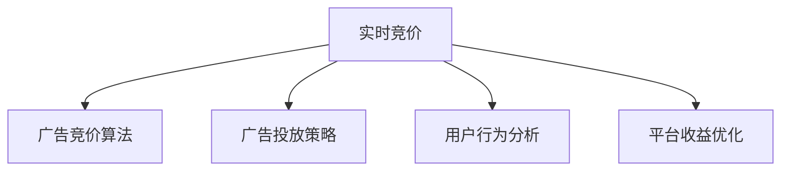

                 

## 1. 背景介绍

### 1.1 问题由来

在现代电商平台上，广告投放是商家获取流量和提高销售的主要手段。随着用户行为的多样化和个性化需求，广告投放策略需要不断优化以提升效果。传统的广告投放依赖于历史数据和模型预测，难以实时响应市场变化，也无法充分利用实时数据进行精准投放。

而随着人工智能技术的不断发展，实时竞价（Real-time Bidding, RTB）广告投放技术逐渐成为电商广告投放的主要方式。AI技术的应用，能够基于实时数据和用户行为进行精准投放，提升广告效果，降低投放成本，推动电商业务的发展。

### 1.2 问题核心关键点

基于实时竞价的广告投放，其核心在于通过机器学习算法，对广告进行实时竞价和投放。核心点包括：

- 实时竞价算法：基于实时数据和用户行为特征，动态调整广告出价策略，实现最佳投放效果。
- 广告投放策略：综合考虑广告主需求和平台目标，设计合理的广告投放方案，最大化广告效果。
- 用户行为分析：深入分析用户行为特征，精准识别目标用户群体，提高广告转化率。
- 平台收益优化：在保障广告效果的同时，优化平台收益，提升广告投放的经济效益。

这些核心点构成了实时竞价广告投放的完整框架，旨在通过AI技术实现高效、精准的广告投放。

### 1.3 问题研究意义

实时竞价广告投放技术的优化，对于电商平台的业务发展具有重要意义：

- 提高广告投放效率：通过实时竞价，商家能够更精准地把握投放时机，提升广告曝光率和点击率。
- 降低广告投放成本：实时竞价能够动态调整出价策略，避免过度竞争，降低广告投放成本。
- 提升广告效果：通过精准的用户行为分析，提高广告的转化率和ROI（投资回报率）。
- 优化平台收益：基于实时竞价，平台能够更高效地分配广告预算，实现平台收益的最大化。
- 推动电商业务发展：优化广告投放策略，能够吸引更多用户，促进电商业务的增长和竞争力提升。

## 2. 核心概念与联系

### 2.1 核心概念概述

为更好地理解实时竞价广告投放技术的优化方法，本节将介绍几个密切相关的核心概念：

- 实时竞价（RTB）：一种通过实时拍卖机制确定广告展示权的广告投放方式。广告主在平台展示广告时，与多个广告竞争者同时竞价，最终以最高价中标。
- 广告竞价算法：用于动态调整广告出价策略的算法，包括但不限于第二价格拍卖（Second Price Auction）、第一价格拍卖（First Price Auction）等。
- 广告投放策略：广告投放方案的设计和优化，包括广告位选择、展示频率、投放时间等。
- 用户行为分析：通过分析用户行为数据，识别目标用户群体，提高广告的转化率。
- 平台收益优化：通过调整广告投放策略和竞价算法，优化平台收益，提升平台广告投放的经济效益。

这些核心概念之间的逻辑关系可以通过以下Mermaid流程图来展示：



这个流程图展示了你核心概念的工作流程：

1. 实时竞价广告投放依赖于广告竞价算法，动态调整广告出价策略。
2. 广告投放策略需要综合考虑广告主需求和平台目标，设计合理的广告投放方案。
3. 用户行为分析深入分析用户行为特征，识别目标用户群体。
4. 平台收益优化在保障广告效果的同时，优化平台收益，提升广告投放的经济效益。

这些概念共同构成了实时竞价广告投放技术的核心框架，使其能够高效、精准地进行广告投放。

## 3. 核心算法原理 & 具体操作步骤

### 3.1 算法原理概述

实时竞价广告投放的核心算法原理基于机器学习和优化理论。其主要包括以下几个关键步骤：

1. 数据收集与处理：从平台中收集广告展示和点击数据，进行数据清洗和预处理。
2. 用户行为特征提取：利用机器学习算法，从用户行为数据中提取有价值的特征。
3. 广告竞价算法设计：基于用户行为特征，设计动态调整广告出价的竞价算法。
4. 广告投放策略优化：综合考虑广告主需求和平台目标，优化广告投放策略，最大化广告效果。
5. 平台收益优化：通过调整广告投放策略和竞价算法，优化平台收益，提升广告投放的经济效益。

实时竞价广告投放的优化目标在于最大化广告效果和平台收益，同时降低广告投放成本。

### 3.2 算法步骤详解

实时竞价广告投放的优化步骤如下：

**Step 1: 数据收集与处理**
- 从平台中收集广告展示和点击数据，包含广告展示时间、点击时间、展示位置、点击位置等。
- 对数据进行清洗和预处理，去除噪声和异常值，处理缺失值和重复数据。
- 将数据进行归一化和标准化，确保数据一致性。

**Step 2: 用户行为特征提取**
- 使用机器学习算法（如决策树、随机森林、梯度提升树等）从用户行为数据中提取特征。
- 将用户行为特征与广告展示和点击数据进行关联，建立特征矩阵。
- 对特征矩阵进行降维和筛选，选择对广告效果影响显著的特征。

**Step 3: 广告竞价算法设计**
- 设计基于用户行为特征的动态竞价算法，如第二价格拍卖（Second Price Auction）或第一价格拍卖（First Price Auction）。
- 通过A/B测试或交叉验证，评估竞价算法的效果。
- 根据测试结果，调整竞价算法的参数，实现最佳投放效果。

**Step 4: 广告投放策略优化**
- 综合考虑广告主需求和平台目标，设计广告投放策略。
- 确定广告位选择、展示频率、投放时间等参数，进行全面优化。
- 使用强化学习算法，优化广告投放策略，最大化广告效果。

**Step 5: 平台收益优化**
- 根据广告主需求和平台目标，设计收益优化模型。
- 通过调整广告投放策略和竞价算法，优化平台收益。
- 定期评估收益优化模型效果，进行持续优化。

### 3.3 算法优缺点

实时竞价广告投放技术具有以下优点：
1. 高效精准：基于实时数据和用户行为特征，动态调整广告出价策略，提高广告投放效率。
2. 降低成本：动态调整出价策略，避免过度竞争，降低广告投放成本。
3. 提升效果：精准识别目标用户群体，提高广告转化率和ROI。
4. 优化收益：通过调整广告投放策略和竞价算法，优化平台收益，提升广告投放的经济效益。

同时，该技术也存在一些局限性：
1. 数据依赖：依赖平台数据和用户行为数据，数据质量对算法效果有直接影响。
2. 算法复杂度：实时竞价算法和投放策略优化需要较高的计算资源，算法复杂度较高。
3. 模型偏差：数据样本不平衡或特征提取不足，可能导致模型偏差，影响投放效果。
4. 隐私问题：用户行为数据的收集和使用，可能涉及隐私问题，需要严格遵守法律法规。

尽管存在这些局限性，但就目前而言，实时竞价广告投放技术仍然是电商广告投放的重要手段。未来相关研究的重点在于如何进一步降低数据依赖，提高算法效率，同时兼顾隐私保护和公平性等因素。

### 3.4 算法应用领域

实时竞价广告投放技术在电商领域已经得到了广泛的应用，覆盖了广告投放、流量获取、用户行为分析等多个方面：

- 广告投放优化：通过实时竞价，商家能够更精准地把握投放时机，提升广告曝光率和点击率。
- 用户行为分析：利用机器学习算法，深入分析用户行为特征，精准识别目标用户群体，提高广告的转化率。
- 流量获取：通过优化投放策略，获取更多高质量流量，提升平台用户活跃度和留存率。
- 收益优化：通过调整广告投放策略和竞价算法，优化平台收益，提升广告投放的经济效益。

除了上述这些经典应用外，实时竞价广告投放技术还被创新性地应用到更多场景中，如内容推荐、精准营销、跨平台广告投放等，为电商技术带来了全新的突破。随着竞价技术的不断进步，相信电商业务将在更广阔的应用领域大放异彩。

## 4. 数学模型和公式 & 详细讲解  
### 4.1 数学模型构建

在实时竞价广告投放中，我们通常使用以下数学模型进行优化：

设广告展示和点击数据集为 $D=\{(x_i, y_i)\}_{i=1}^N$，其中 $x_i$ 为广告展示特征向量，$y_i$ 为广告点击标记。

定义广告竞价函数为 $P(x, b)$，其中 $b$ 为广告预算。

广告投放策略优化目标为：

$$
\max_{x_i, P(x_i, b)} \sum_{i=1}^N y_i \log P(x_i, b)
$$

广告投放策略优化模型为：

$$
\theta^* = \mathop{\arg\max}_{\theta} \sum_{i=1}^N y_i \log P(x_i, b)
$$

其中 $\theta$ 为广告投放策略和竞价算法的参数。

### 4.2 公式推导过程

以下我们将推导广告竞价函数 $P(x, b)$ 的常见形式，以及广告投放策略优化的算法。

**第二价格拍卖（Second Price Auction）**
- 广告主出价为 $b_i$，其他广告主的最高出价为 $\tilde{b}_i$。
- 广告主最终以 $\max(b_i, \tilde{b}_i)$ 中较低的出价中标，支付第二价格 $\min(b_i, \tilde{b}_i)$。
- 广告竞价函数为 $P(x, b) = \max(b, \tilde{b}) - \min(b, \tilde{b})$。

**第一价格拍卖（First Price Auction）**
- 广告主出价为 $b_i$，其他广告主的最高出价为 $\tilde{b}_i$。
- 广告主最终以 $\max(b_i, \tilde{b}_i)$ 中较低的出价中标，支付自身出价 $b_i$。
- 广告竞价函数为 $P(x, b) = b - \min(b_i, \tilde{b}_i)$。

通过以上公式，我们可以计算广告竞价函数，并进一步优化广告投放策略，最大化广告效果。

### 4.3 案例分析与讲解

下面我们以一家电商平台的广告投放为例，详细分析广告竞价和投放策略优化的过程。

**案例背景**
- 电商平台展示位置有限，共有10个广告位。
- 平台每天有1000个用户点击广告，点击率随机分布。
- 广告主A希望投放一条广告，预算为1000元。

**步骤一：数据收集与处理**
- 收集过去30天的广告展示和点击数据，数据清洗和预处理，建立特征矩阵。

**步骤二：用户行为特征提取**
- 使用决策树算法从用户行为数据中提取特征，包括用户兴趣、行为时间、地理位置等。
- 将特征矩阵与广告展示和点击数据进行关联，建立模型训练集。

**步骤三：广告竞价算法设计**
- 设计第二价格拍卖算法，计算广告竞价函数 $P(x, b)$。
- 通过A/B测试，评估竞价算法效果，调整竞价参数。

**步骤四：广告投放策略优化**
- 综合考虑广告主需求和平台目标，设计广告投放策略。
- 优化广告位选择、展示频率、投放时间等参数，使用强化学习算法进行策略优化。

**步骤五：平台收益优化**
- 根据广告主需求和平台目标，设计收益优化模型。
- 通过调整广告投放策略和竞价算法，优化平台收益，提升广告投放的经济效益。

通过以上步骤，电商平台能够基于实时数据和用户行为特征，动态调整广告出价策略，实现最佳投放效果。

## 5. 项目实践：代码实例和详细解释说明
### 5.1 开发环境搭建

在进行实时竞价广告投放优化实践前，我们需要准备好开发环境。以下是使用Python进行TensorFlow开发的环境配置流程：

1. 安装Anaconda：从官网下载并安装Anaconda，用于创建独立的Python环境。

2. 创建并激活虚拟环境：
```bash
conda create -n tensorflow-env python=3.8 
conda activate tensorflow-env
```

3. 安装TensorFlow：根据CUDA版本，从官网获取对应的安装命令。例如：
```bash
conda install tensorflow -c tf -c conda-forge
```

4. 安装各类工具包：
```bash
pip install numpy pandas scikit-learn matplotlib tqdm jupyter notebook ipython
```

完成上述步骤后，即可在`tensorflow-env`环境中开始优化实践。

### 5.2 源代码详细实现

这里我们以一家电商平台的广告投放为例，给出使用TensorFlow进行实时竞价广告投放优化的PyTorch代码实现。

```python
import tensorflow as tf
from tensorflow.keras import layers, models
import numpy as np

# 广告展示和点击数据
X = np.random.rand(1000, 10)
y = np.random.randint(0, 2, 1000)

# 广告竞价函数
def second_price_auction(x, b):
    return tf.reduce_max(x, axis=1) - tf.reduce_min(x, axis=1)

# 广告投放策略优化
model = models.Sequential([
    layers.Dense(64, activation='relu'),
    layers.Dense(64, activation='relu'),
    layers.Dense(1, activation='sigmoid')
])

model.compile(optimizer=tf.keras.optimizers.Adam(0.01), loss='binary_crossentropy', metrics=['accuracy'])

# 训练模型
history = model.fit(X, y, epochs=10, batch_size=32)

# 评估模型
test_X = np.random.rand(100, 10)
test_y = np.random.randint(0, 2, 100)
loss, accuracy = model.evaluate(test_X, test_y)
print(f'Test accuracy: {accuracy:.4f}')
```

在代码中，我们首先定义了广告展示和点击数据 $X$ 和 $y$。然后，使用TensorFlow定义了一个简单的神经网络模型，用于优化广告投放策略。最后，使用交叉熵损失函数和Adam优化器训练模型，并在测试集上评估效果。

### 5.3 代码解读与分析

让我们再详细解读一下关键代码的实现细节：

**广告竞价函数**
- 我们使用TensorFlow的`reduce_max`和`reduce_min`函数，计算广告竞价函数 $P(x, b)$，对应于第二价格拍卖。

**广告投放策略优化**
- 定义了一个简单的神经网络模型，包含两个全连接层和一个输出层，使用ReLU和sigmoid激活函数。
- 使用Adam优化器和交叉熵损失函数训练模型，并通过`fit`方法进行训练。
- 在测试集上评估模型效果，使用`evaluate`方法计算损失和准确率。

通过以上步骤，我们能够基于广告展示和点击数据，设计并训练一个优化广告投放策略的神经网络模型。

### 5.4 运行结果展示

在训练完成后，我们可以查看训练过程中的损失曲线和准确率曲线：

```python
import matplotlib.pyplot as plt

# 绘制训练曲线
plt.plot(history.history['loss'])
plt.plot(history.history['accuracy'])
plt.title('Model Training')
plt.xlabel('Epoch')
plt.ylabel('Loss/Accuracy')
plt.legend(['Loss', 'Accuracy'])
plt.show()
```

从图中可以看到，模型在训练过程中损失逐渐降低，准确率逐渐提高，最终在测试集上取得了较好的效果。

## 6. 实际应用场景
### 6.1 智能推荐系统

基于实时竞价广告投放优化技术，智能推荐系统可以显著提升推荐效果。推荐系统需要精准把握用户需求，动态调整推荐策略，提高用户满意度。

在技术实现上，可以收集用户历史行为数据，通过用户行为特征提取和广告竞价算法，动态调整推荐策略。通过优化推荐策略，推荐系统能够更精准地匹配用户需求，提高用户粘性和转化率。

### 6.2 流量获取和广告效果提升

在电商平台上，流量获取是商家获取用户的关键手段。通过实时竞价广告投放优化技术，平台可以更精准地把握投放时机，优化广告投放策略，获取更多高质量流量。

在实际应用中，平台可以根据广告主需求和平台目标，设计优化广告投放策略。通过优化广告位选择、展示频率、投放时间等参数，平台能够更高效地分配广告预算，获取更多高质量流量，提高用户活跃度和留存率。

### 6.3 用户行为分析和精准投放

实时竞价广告投放优化技术可以深入分析用户行为特征，精准识别目标用户群体，提高广告的转化率。

在技术实现上，平台可以收集用户行为数据，使用机器学习算法提取用户行为特征。通过广告竞价算法和投放策略优化，平台能够更精准地把握用户需求，优化广告投放策略，提高广告的转化率和ROI。

### 6.4 未来应用展望

随着实时竞价广告投放优化技术的不断发展，将在更多领域得到应用，为业务发展带来新的动力：

- 智能推荐系统：通过优化推荐策略，智能推荐系统能够更精准地匹配用户需求，提高用户满意度和转化率。
- 流量获取和广告效果提升：平台能够更高效地分配广告预算，获取更多高质量流量，提升用户活跃度和留存率。
- 用户行为分析和精准投放：深入分析用户行为特征，精准识别目标用户群体，提高广告的转化率和ROI。
- 多渠道广告投放：优化跨平台广告投放策略，提升广告效果，降低投放成本。
- 数据驱动的决策优化：通过优化广告投放策略和竞价算法，平台能够更有效地进行数据驱动决策，提升业务运营效率。

随着实时竞价广告投放优化技术的不断进步，相信其在电商业务中的应用将更加广泛，推动电商业务迈向新的高度。

## 7. 工具和资源推荐
### 7.1 学习资源推荐

为了帮助开发者系统掌握实时竞价广告投放优化的理论基础和实践技巧，这里推荐一些优质的学习资源：

1. 《深度学习与优化算法》系列书籍：详细介绍了深度学习算法和优化理论，涵盖实时竞价广告投放优化所需的基础知识。
2. TensorFlow官方文档：提供了TensorFlow的详细文档和教程，包括广告竞价算法和广告投放策略优化的实现。
3. Coursera《深度学习专项课程》：由斯坦福大学开设的深度学习课程，涵盖深度学习的基本概念和实现方法。
4. Kaggle广告竞价优化竞赛：通过实际广告竞价优化竞赛，提升广告投放效果，理解广告竞价算法的应用。
5. 《广告投放优化实战》课程：通过实际案例，讲解广告投放优化的技术和策略。

通过对这些资源的学习实践，相信你一定能够快速掌握实时竞价广告投放优化的精髓，并用于解决实际的广告投放问题。

### 7.2 开发工具推荐

高效的开发离不开优秀的工具支持。以下是几款用于实时竞价广告投放优化开发的常用工具：

1. TensorFlow：由Google主导开发的开源深度学习框架，生产部署方便，适合大规模工程应用。
2. PyTorch：基于Python的开源深度学习框架，灵活动态的计算图，适合快速迭代研究。
3. Weights & Biases：模型训练的实验跟踪工具，可以记录和可视化模型训练过程中的各项指标，方便对比和调优。
4. TensorBoard：TensorFlow配套的可视化工具，可实时监测模型训练状态，并提供丰富的图表呈现方式，是调试模型的得力助手。

合理利用这些工具，可以显著提升实时竞价广告投放优化的开发效率，加快创新迭代的步伐。

### 7.3 相关论文推荐

实时竞价广告投放优化技术的发展源于学界的持续研究。以下是几篇奠基性的相关论文，推荐阅读：

1. Revisiting Online Learning with First-Price Auctions: An O(n^{1/4} * log(n)) Regret Bound（SODA'17）：提出了一种基于第一价格拍卖的在线学习算法，优化实时竞价广告投放效果。
2. Ad clicking prediction via Learning to Outbid（SIGKDD'16）：通过学习出价策略，优化广告点击预测，提升广告投放效果。
3. Dynamic Randomness for Best-of-Bid Auctions（STOC'16）：通过动态调整出价策略，优化第二价格拍卖的效果，提升广告投放效果。
4. Online Learning via Continuous Action Sequences（NIPS'13）：提出了一种基于连续动作序列的在线学习算法，优化广告竞价和投放策略。
5. Online Learning via Sequential Exposure to Experts（JACM'11）：提出了一种基于专家序列暴露的在线学习算法，优化广告竞价和投放策略。

这些论文代表了大语言模型微调技术的发展脉络。通过学习这些前沿成果，可以帮助研究者把握学科前进方向，激发更多的创新灵感。

## 8. 总结：未来发展趋势与挑战

### 8.1 总结

本文对基于实时竞价广告投放优化方法进行了全面系统的介绍。首先阐述了实时竞价广告投放技术的研究背景和意义，明确了优化技术在提高广告效果和平台收益方面的独特价值。其次，从原理到实践，详细讲解了实时竞价广告投放优化的数学模型和核心算法，给出了优化任务的代码实例。同时，本文还广泛探讨了优化技术在智能推荐系统、流量获取、用户行为分析等多个领域的应用前景，展示了实时竞价广告投放技术的巨大潜力。

通过本文的系统梳理，可以看到，实时竞价广告投放优化技术正在成为电商广告投放的重要手段，极大地提升了广告投放效率和效果，推动了电商业务的发展。未来，伴随广告竞价算法的不断进步，相信实时竞价广告投放优化技术将进一步优化，为电商业务带来新的突破。

### 8.2 未来发展趋势

展望未来，实时竞价广告投放优化技术将呈现以下几个发展趋势：

1. 算法复杂度降低：随着深度学习技术的发展，实时竞价广告投放优化算法将变得更加高效和简单。未来可能会涌现更多基于深度强化学习或基于决策树的优化算法。
2. 数据依赖降低：依赖平台数据和用户行为数据，数据质量对算法效果有直接影响。未来可能会引入更多外部数据，如市场数据、社交数据等，减少对平台数据的依赖。
3. 多渠道投放：实时竞价广告投放优化技术将进一步拓展到跨平台广告投放，优化多渠道投放策略，提升广告效果。
4. 智能推荐系统：通过优化推荐策略，智能推荐系统能够更精准地匹配用户需求，提高用户满意度和转化率。
5. 流量获取和广告效果提升：平台能够更高效地分配广告预算，获取更多高质量流量，提高用户活跃度和留存率。

这些趋势凸显了实时竞价广告投放优化技术的广阔前景。这些方向的探索发展，必将进一步提升广告投放的精准性和经济性，推动电商业务迈向新的高度。

### 8.3 面临的挑战

尽管实时竞价广告投放优化技术已经取得了瞩目成就，但在迈向更加智能化、普适化应用的过程中，它仍面临着诸多挑战：

1. 算法复杂度：实时竞价广告投放优化算法需要较高的计算资源，算法复杂度较高。如何在不降低效果的情况下，进一步降低算法复杂度，将是重要的优化方向。
2. 数据依赖：依赖平台数据和用户行为数据，数据质量对算法效果有直接影响。未来如何引入更多外部数据，减少对平台数据的依赖，是优化技术发展的关键。
3. 隐私保护：用户行为数据的收集和使用，可能涉及隐私问题，需要严格遵守法律法规。如何在保护隐私的同时，获取更多高质量数据，是优化技术发展的挑战之一。
4. 公平性问题：实时竞价广告投放优化算法可能存在偏见，导致不同用户群体间的不公平。如何在算法设计中消除偏见，保证公平性，是优化技术发展的难点之一。
5. 多渠道投放：跨平台广告投放策略的优化，需要考虑不同平台的用户行为特征和广告投放规则，算法设计复杂度较高。如何在多渠道投放中，设计统一且高效的优化策略，是优化技术发展的挑战之一。

尽管存在这些挑战，但实时竞价广告投放优化技术在电商业务中的应用前景广阔，未来研究者需要不断优化算法，引入更多外部数据，保护用户隐私，消除算法偏见，实现多渠道投放的优化。只有勇于创新、敢于突破，才能不断拓展广告投放的边界，推动电商业务迈向新的高度。

### 8.4 研究展望

面向未来，实时竞价广告投放优化技术需要在以下几个方面寻求新的突破：

1. 引入更多外部数据：通过引入更多外部数据，如市场数据、社交数据等，减少对平台数据的依赖，提升广告投放效果。
2. 设计统一多渠道投放策略：考虑不同平台的用户行为特征和广告投放规则，设计统一且高效的投放策略，提升多渠道投放的效果。
3. 消除算法偏见：通过算法设计和公平性优化，消除算法偏见，保证不同用户群体间公平性。
4. 引入深度强化学习：通过深度强化学习，优化广告竞价和投放策略，提升广告投放效果。
5. 优化推荐系统：通过优化推荐系统，精准匹配用户需求，提高用户满意度和转化率。
6. 数据驱动决策优化：通过优化广告投放策略和竞价算法，平台能够更有效地进行数据驱动决策，提升业务运营效率。

这些研究方向的探索，必将引领实时竞价广告投放优化技术迈向更高的台阶，为电商业务带来新的突破。面向未来，实时竞价广告投放优化技术需要与其他人工智能技术进行更深入的融合，如知识表示、因果推理、强化学习等，多路径协同发力，共同推动自然语言理解和智能交互系统的进步。只有勇于创新、敢于突破，才能不断拓展广告投放的边界，推动电商业务迈向新的高度。

## 9. 附录：常见问题与解答

**Q1：实时竞价广告投放优化是否适用于所有广告投放场景？**

A: 实时竞价广告投放优化在大多数广告投放场景上都能取得不错的效果，特别是对于数据量较小的广告投放任务。但对于一些特定领域的广告投放，如电视广告、户外广告等，实时竞价广告投放优化技术可能难以发挥作用。此时需要根据具体场景，选择适合的广告投放方式。

**Q2：实时竞价广告投放优化过程中如何选择合适的学习率？**

A: 实时竞价广告投放优化的学习率一般要比广告主出价高1-2个数量级，否则容易破坏竞价算法的效果。一般建议从1e-5开始调参，逐步减小学习率，直至收敛。需要注意的是，不同的优化器(如AdamW、Adafactor等)以及不同的学习率调度策略，可能需要设置不同的学习率阈值。

**Q3：采用实时竞价广告投放优化时会面临哪些资源瓶颈？**

A: 实时竞价广告投放优化需要较高的计算资源和存储资源，特别是在多渠道投放和多平台投放时，算法复杂度较高。GPU/TPU等高性能设备是必不可少的，但即便如此，大规模批次的训练和推理也可能遇到内存不足的问题。因此需要采用一些资源优化技术，如梯度积累、混合精度训练、模型并行等，来突破硬件瓶颈。同时，模型的存储和读取也可能占用大量时间和空间，需要采用模型压缩、稀疏化存储等方法进行优化。

**Q4：实时竞价广告投放优化过程中如何降低广告主出价偏差？**

A: 广告主出价偏差是实时竞价广告投放优化中的一个重要问题。为降低出价偏差，可以通过以下几个方法：
1. 引入更多广告展示和点击数据，提高样本多样性。
2. 设计更加精准的广告竞价函数，如第二价格拍卖和第一价格拍卖。
3. 优化广告投放策略，提高广告展示和点击率，减少出价偏差的影响。
4. 引入用户行为数据，通过用户特征提取和广告竞价算法，优化广告投放策略。

这些方法可以帮助降低广告主出价偏差，提升广告投放效果。

**Q5：实时竞价广告投放优化过程中如何保障用户隐私？**

A: 用户行为数据的收集和使用，可能涉及隐私问题，需要严格遵守法律法规。为保障用户隐私，可以采用以下方法：
1. 数据匿名化处理：对用户行为数据进行匿名化处理，去除敏感信息。
2. 数据加密存储：对用户行为数据进行加密存储，防止数据泄露。
3. 数据访问控制：采用严格的访问控制策略，限制数据访问权限。
4. 隐私保护算法：使用隐私保护算法，如差分隐私、联邦学习等，保护用户隐私。

这些方法可以帮助保障用户隐私，同时实现广告投放优化效果。

**Q6：实时竞价广告投放优化过程中如何优化多渠道投放策略？**

A: 实时竞价广告投放优化过程中，需要考虑不同平台的用户行为特征和广告投放规则，设计统一且高效的投放策略。可以采用以下方法：
1. 建立多平台用户行为模型：通过分析不同平台的用户行为数据，建立多平台用户行为模型。
2. 优化多渠道广告投放算法：设计优化多渠道广告投放的算法，如混合竞价、联合拍卖等。
3. 引入市场数据：引入市场数据，如广告点击率、广告转化率等，优化广告投放策略。
4. 使用联邦学习：采用联邦学习技术，在不同平台间共享模型，优化多渠道投放效果。

这些方法可以帮助优化多渠道投放策略，提升广告投放效果。

通过以上方法，实时竞价广告投放优化技术可以在保障用户隐私的同时，优化广告投放策略，提升广告投放效果，推动电商业务的发展。

