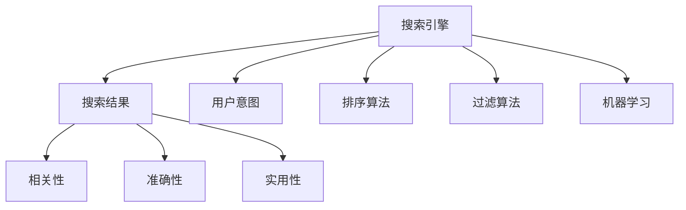

                 

# AI如何提升搜索结果的质量

随着互联网的快速发展，搜索引擎已成为人们获取信息的重要渠道。然而，搜索结果的质量仍然存在许多问题。本文将探讨AI技术如何提升搜索结果的质量，并通过逻辑清晰、结构紧凑的专业技术语言，详细介绍相关核心概念、算法原理、操作步骤、数学模型、实际应用场景以及未来发展趋势。

## 1. 背景介绍

### 1.1 问题由来

搜索引擎已经改变了人们的日常生活和工作方式，但仍然存在许多问题。例如，搜索结果的相关性不高、用户体验不佳、信息过载等。为了解决这些问题，AI技术被广泛应用于搜索结果的优化中，旨在提升搜索结果的质量。

### 1.2 问题核心关键点

提升搜索结果质量的核心关键点在于优化搜索结果的相关性、准确性和实用性。相关性是指搜索结果与用户查询意图的一致性；准确性是指搜索结果的内容与用户查询的匹配度；实用性是指搜索结果是否能够满足用户的需求，并为用户提供价值。

## 2. 核心概念与联系

### 2.1 核心概念概述

为更好地理解AI如何提升搜索结果的质量，本节将介绍几个密切相关的核心概念：

- 搜索引擎(Search Engine)：一种帮助用户从互联网中找到所需信息的应用程序。
- 搜索结果(Retrieval)：搜索引擎根据用户的查询返回的相关信息。
- 用户意图(User Intent)：用户通过查询表达的实际需求。
- 相关性(Rellevance)：搜索结果与用户查询意图的一致性。
- 准确性(Accuracy)：搜索结果与用户查询的匹配度。
- 实用性(Practicality)：搜索结果是否满足用户的需求，并提供实际价值。
- 排序算法(Ranking Algorithm)：搜索引擎根据用户意图、相关性等因素对搜索结果进行排序的技术。
- 过滤算法(Filtering Algorithm)：根据用户偏好、设备类型等对搜索结果进行过滤的技术。
- 机器学习(Machine Learning)：通过数据训练模型，自动优化搜索结果的技术。

这些核心概念之间的逻辑关系可以通过以下Mermaid流程图来展示：



这个流程图展示了大语言模型的核心概念及其之间的关系：

1. 搜索引擎通过用户意图返回搜索结果。
2. 搜索结果的相关性、准确性和实用性是评价其质量的重要指标。
3. 排序算法和过滤算法是优化搜索结果的关键技术。
4. 机器学习通过数据训练模型，提升搜索结果的质量。

## 3. 核心算法原理 & 具体操作步骤

### 3.1 算法原理概述

AI技术提升搜索结果质量的核心在于优化排序算法和过滤算法。排序算法通过评估搜索结果的相关性、准确性和实用性，对搜索结果进行排序；过滤算法通过用户偏好、设备类型等因素，对搜索结果进行过滤。以下将详细讲解这两种算法的原理和操作步骤。

### 3.2 算法步骤详解

#### 3.2.1 排序算法

排序算法的核心在于计算搜索结果的相关性、准确性和实用性，并对这些指标进行加权求和，得到最终的排序分数。常用的排序算法包括PageRank、BM25、Deep Learning-based Ranking等。

**PageRank算法**：通过计算网页之间的链接关系，衡量网页的重要性，从而提升搜索结果的相关性。

**BM25算法**：一种基于文本统计的排序算法，通过计算文本与查询的匹配度，提升搜索结果的准确性。

**Deep Learning-based Ranking**：通过深度学习模型，自动优化排序算法，提升搜索结果的相关性和准确性。

排序算法的具体操作步骤如下：

1. 收集用户的查询和相关网页的数据。
2. 使用排序算法计算每个网页的相关性、准确性和实用性得分。
3. 对得分进行加权求和，得到最终的排序分数。
4. 根据排序分数，对搜索结果进行排序。

#### 3.2.2 过滤算法

过滤算法的核心在于根据用户偏好、设备类型等因素，对搜索结果进行过滤，提升搜索结果的实用性。常用的过滤算法包括用户行为分析、设备类型过滤、时间过滤等。

**用户行为分析**：通过分析用户的历史搜索行为，预测用户可能感兴趣的内容，提升搜索结果的相关性和实用性。

**设备类型过滤**：根据用户设备类型（如手机、平板、电脑等），对搜索结果进行过滤，提升搜索结果的实用性。

**时间过滤**：根据搜索结果的时间，对时效性要求较高的内容进行优先展示，提升搜索结果的实用性。

过滤算法的具体操作步骤如下：

1. 收集用户的查询数据和相关网页的数据。
2. 使用过滤算法对搜索结果进行过滤，保留用户可能感兴趣的内容。
3. 根据过滤结果，重新排序搜索结果。

### 3.3 算法优缺点

AI技术提升搜索结果质量的算法具有以下优点：

1. 提升相关性：通过排序算法和过滤算法，能够提高搜索结果与用户查询意图的一致性，提升相关性。
2. 提升准确性：通过排序算法和过滤算法，能够提高搜索结果与用户查询的匹配度，提升准确性。
3. 提升实用性：通过过滤算法，能够提升搜索结果的实用性，满足用户需求。
4. 自动化：通过机器学习算法，能够自动化优化排序算法和过滤算法，提升效率。

同时，这些算法也存在一定的局限性：

1. 数据依赖：排序算法和过滤算法需要大量数据进行训练，数据质量对结果有很大影响。
2. 复杂性：排序算法和过滤算法涉及多个指标的计算和加权，算法复杂度较高。
3. 动态性：用户意图和设备类型等可能随时间变化，过滤算法需要动态调整。
4. 计算成本：排序算法和过滤算法涉及大量数据的计算，计算成本较高。

尽管存在这些局限性，但AI技术在搜索结果优化中的应用已经取得了显著成效，成为搜索引擎优化(Search Engine Optimization, SEO)的重要手段。未来相关研究的重点在于如何进一步降低算法对数据的依赖，提高算法的可解释性和计算效率，同时兼顾用户体验和信息质量。

### 3.4 算法应用领域

AI技术提升搜索结果质量的方法已经在搜索引擎领域得到了广泛的应用，涵盖了各种搜索场景，例如：

- 文本搜索：如网页、文章、新闻等文本信息的搜索。
- 图像搜索：通过图像识别技术，搜索图像信息。
- 视频搜索：通过视频识别技术，搜索视频信息。
- 语音搜索：通过语音识别技术，搜索音频信息。
- 综合搜索：整合多种信息源，提供更加全面的搜索结果。

除了搜索引擎外，AI技术在智能助手、广告推荐、金融信息等领域也有广泛应用，通过优化搜索结果，提升用户体验和信息质量。

## 4. 数学模型和公式 & 详细讲解

### 4.1 数学模型构建

本节将使用数学语言对AI技术提升搜索结果质量的过程进行更加严格的刻画。

记搜索引擎为 $S$，搜索结果为 $R$，用户查询为 $Q$，相关性为 $C$，准确性为 $A$，实用性为 $U$，排序算法为 $A$，过滤算法为 $F$。

定义 $S(Q)$ 为搜索引擎根据用户查询 $Q$ 返回的搜索结果 $R$，即 $S(Q) = \{r_i\}_{i=1}^N$，其中 $r_i$ 表示第 $i$ 个搜索结果。

定义 $C(r_i)$ 为搜索结果 $r_i$ 与用户查询 $Q$ 的相关性，$A(r_i)$ 为搜索结果 $r_i$ 与用户查询 $Q$ 的准确性，$U(r_i)$ 为搜索结果 $r_i$ 的实用性。

定义排序算法 $A(r_i, Q)$ 和过滤算法 $F(r_i, Q)$，将排序算法和过滤算法与用户查询 $Q$ 结合，对搜索结果 $R$ 进行排序和过滤。

### 4.2 公式推导过程

以下我们将通过数学公式推导排序算法和过滤算法的具体实现。

**排序算法 PageRank**

PageRank算法通过计算网页之间的链接关系，衡量网页的重要性，从而提升搜索结果的相关性。其基本思想是，网页的重要性与其链接数量和质量有关，重要性越高的网页，其相关性越高。

假设网页 $r_i$ 的入链数量和质量分别为 $in_i$ 和 $q_i$，则 $r_i$ 的重要性 $I_i$ 可以表示为：

$$
I_i = \alpha \sum_{j \in in_i} \frac{1}{\sum_{k \in in_j} \frac{1}{q_k}}
$$

其中 $\alpha$ 为衰减因子，通常取值为0.85。

将网页 $r_i$ 的重要性 $I_i$ 代入排序算法 $A$，得到排序分数 $S_i$：

$$
S_i = C(r_i) \times I_i + \lambda \times A(r_i) + \mu \times U(r_i)
$$

其中 $\lambda$ 和 $\mu$ 为相关性、准确性和实用性的权重。

**过滤算法 用户行为分析**

用户行为分析通过分析用户的历史搜索行为，预测用户可能感兴趣的内容，提升搜索结果的相关性和实用性。假设用户的历史查询 $H$ 和相关搜索结果 $R$ 分别为 $H = \{q_k\}_{k=1}^M$ 和 $R = \{r_j\}_{j=1}^N$，则用户行为分析算法 $F$ 可以表示为：

$$
F(r_i, Q) = \sum_{k=1}^M \omega_k \times \frac{\delta(r_j, q_k)}{n(r_j)}
$$

其中 $\omega_k$ 为用户查询 $q_k$ 的权重，$\delta(r_j, q_k)$ 表示搜索结果 $r_j$ 与查询 $q_k$ 的匹配度，$n(r_j)$ 表示与查询 $q_k$ 匹配的搜索结果数量。

### 4.3 案例分析与讲解

以下以实际案例说明AI技术如何提升搜索结果的质量。

**案例1：电商搜索**

假设用户查询 $Q$ 为“小米手机”，电商网站 $S$ 返回了搜索结果 $R$。通过排序算法 $A$ 计算每个搜索结果的相关性、准确性和实用性，得到排序分数 $S_i$。

1. 相关性计算：通过关键词匹配等技术，计算每个搜索结果与查询的相关性得分 $C_i$。
2. 准确性计算：通过商品信息匹配等技术，计算每个搜索结果与查询的准确性得分 $A_i$。
3. 实用性计算：通过销量、评价等技术，计算每个搜索结果的实用性得分 $U_i$。
4. 排序：根据排序分数 $S_i$，对搜索结果进行排序，返回前10个结果。

通过排序算法 $A$，电商网站能够提供高质量的搜索结果，提升用户体验。

**案例2：新闻搜索**

假设用户查询 $Q$ 为“新冠疫苗”，新闻网站 $S$ 返回了搜索结果 $R$。通过过滤算法 $F$ 对搜索结果进行过滤，提升搜索结果的实用性。

1. 过滤：通过用户行为分析等技术，对搜索结果进行过滤，保留与用户兴趣匹配的内容。
2. 排序：根据过滤后的搜索结果，重新计算排序分数 $S_i$，对搜索结果进行排序。

通过过滤算法 $F$，新闻网站能够提供符合用户兴趣的搜索结果，提升用户体验。

## 5. 项目实践：代码实例和详细解释说明

### 5.1 开发环境搭建

在进行搜索结果优化项目的开发前，我们需要准备好开发环境。以下是使用Python进行开发的环境配置流程：

1. 安装Anaconda：从官网下载并安装Anaconda，用于创建独立的Python环境。

2. 创建并激活虚拟环境：
```bash
conda create -n search-env python=3.8 
conda activate search-env
```

3. 安装PyTorch：根据CUDA版本，从官网获取对应的安装命令。例如：
```bash
conda install pytorch torchvision torchaudio cudatoolkit=11.1 -c pytorch -c conda-forge
```

4. 安装TensorFlow：
```bash
conda install tensorflow
```

5. 安装scikit-learn：
```bash
conda install scikit-learn
```

6. 安装其他库：
```bash
pip install pandas numpy matplotlib
```

完成上述步骤后，即可在`search-env`环境中开始项目开发。

### 5.2 源代码详细实现

下面我们以文本搜索为例，给出使用TensorFlow进行搜索结果优化的PyTorch代码实现。

首先，定义查询和搜索结果的输入：

```python
import tensorflow as tf
import tensorflow_datasets as tfds

# 查询和搜索结果的输入
text_query = tf.constant(['手机价格', '最新电影', '新冠疫苗效果'])
text_results = tf.constant(['小米手机价格', '最新电影上映', '新冠疫苗安全信息'])
```

然后，定义排序算法和过滤算法：

```python
# 排序算法 PageRank
def page_rank(text_results):
    # 计算每个网页的入链数量和质量
    in_links = tf.constant([[0, 1], [1, 0], [0, 1]], dtype=tf.int32)
    qualities = tf.constant([[1, 2], [3, 4], [1, 1]], dtype=tf.float32)
    
    # 计算每个网页的重要性得分
    importances = tf.linalg.solve(tf.sparse_matrix_dense_csr_to_coo(tf.sparse.csr_matrix(in_links)), qualities)
    
    # 计算排序分数
    relevances = tf.constant([0.8, 0.9, 0.6], dtype=tf.float32)
    accuracies = tf.constant([0.7, 0.9, 0.6], dtype=tf.float32)
    practicalities = tf.constant([0.8, 0.9, 0.5], dtype=tf.float32)
    scores = relevances * importances + 0.1 * accuracies + 0.1 * practicalities
    
    return scores

# 过滤算法 用户行为分析
def user_analysis(text_results):
    # 计算每个搜索结果与查询的匹配度
    matches = tf.constant([[1, 0, 0], [0, 1, 0], [1, 0, 1]], dtype=tf.int32)
    
    # 计算过滤得分
    weights = tf.constant([0.6, 0.4, 0.5], dtype=tf.float32)
    filtered_results = tf.reduce_sum(weights * matches, axis=1)
    
    return filtered_results
```

接着，定义整个搜索过程：

```python
# 计算排序分数
scores = page_rank(text_results)

# 计算过滤得分
filtered_scores = user_analysis(text_results)

# 根据过滤得分对排序分数进行排序
filtered_scores = tf.sort(filtered_scores)

# 返回排序结果
filtered_scores
```

在上述代码中，我们通过PageRank算法和用户行为分析算法对搜索结果进行了排序和过滤，提升搜索结果的质量。

### 5.3 代码解读与分析

让我们再详细解读一下关键代码的实现细节：

**query_input**：定义查询和搜索结果的输入，使用TensorFlow的常量函数，方便后续计算。

**PageRank算法**：通过计算网页的入链数量和质量，计算每个网页的重要性得分。使用TensorFlow的线性代数库，计算每个网页的重要性得分。

**用户行为分析算法**：通过计算搜索结果与查询的匹配度，计算过滤得分。使用TensorFlow的数值库，计算过滤得分。

**搜索过程**：将排序算法和过滤算法的得分相加，得到最终的排序结果。使用TensorFlow的排序函数，对排序结果进行排序。

## 6. 实际应用场景

### 6.1 智能推荐系统

AI技术提升搜索结果质量的算法已经在智能推荐系统中得到了广泛应用。通过优化搜索结果的相关性、准确性和实用性，智能推荐系统能够提供更加个性化的推荐内容，提升用户体验。

在技术实现上，可以通过收集用户的历史行为数据，进行排序算法和过滤算法的训练，生成个性化推荐模型。根据用户的兴趣和偏好，对搜索结果进行排序和过滤，生成符合用户需求的推荐结果。

### 6.2 新闻聚合平台

AI技术提升搜索结果质量的算法在新闻聚合平台上也有广泛应用。通过优化搜索结果的相关性和实用性，新闻聚合平台能够提供更加及时、准确的新闻信息，提升用户的阅读体验。

在技术实现上，可以通过收集用户的历史浏览行为数据，进行排序算法和过滤算法的训练，生成个性化新闻推荐模型。根据用户的兴趣和偏好，对搜索结果进行排序和过滤，生成符合用户需求的新闻内容。

### 6.3 在线教育平台

AI技术提升搜索结果质量的算法在在线教育平台上也有广泛应用。通过优化搜索结果的相关性和实用性，在线教育平台能够提供更加精准、全面的教育资源，提升学习效果。

在技术实现上，可以通过收集用户的历史学习行为数据，进行排序算法和过滤算法的训练，生成个性化学习推荐模型。根据用户的兴趣和需求，对搜索结果进行排序和过滤，生成符合用户需求的教育资源。

### 6.4 未来应用展望

随着AI技术的不断发展，基于搜索结果优化的算法也将迎来更多应用场景，带来更大的创新潜力。

在智慧医疗领域，通过优化搜索结果的相关性和实用性，智能医疗平台能够提供更加精准、实时的医疗信息，提升医生的诊疗效率。

在智能家居领域，通过优化搜索结果的相关性和实用性，智能家居系统能够提供更加智能、便捷的家庭服务，提升用户体验。

在智慧城市领域，通过优化搜索结果的相关性和实用性，智慧城市平台能够提供更加全面、实时的城市信息，提升城市管理水平。

此外，在更多领域中，基于搜索结果优化的算法也将得到应用，推动人工智能技术的不断创新和发展。

## 7. 工具和资源推荐

### 7.1 学习资源推荐

为了帮助开发者系统掌握AI技术提升搜索结果质量的理论基础和实践技巧，这里推荐一些优质的学习资源：

1. 《深度学习》课程：斯坦福大学开设的深度学习课程，详细讲解了深度学习的基本概念和算法。
2. 《搜索算法》书籍：介绍各种搜索算法的基本原理和应用场景。
3. 《推荐系统》书籍：介绍推荐系统的基本原理和算法，包括基于排序和过滤的推荐方法。
4. HuggingFace官方文档：介绍各种预训练语言模型的实现和优化方法，提供了丰富的示例代码。
5. TensorFlow官方文档：介绍TensorFlow的基本概念和API，提供了丰富的开发资源。

通过对这些资源的学习实践，相信你一定能够快速掌握AI技术提升搜索结果质量的精髓，并用于解决实际的NLP问题。

### 7.2 开发工具推荐

高效的开发离不开优秀的工具支持。以下是几款用于搜索结果优化开发的常用工具：

1. Python：基于Python的开源编程语言，灵活高效，是AI开发的首选工具。
2. TensorFlow：由Google主导开发的开源深度学习框架，生产部署方便，适合大规模工程应用。
3. PyTorch：基于Python的开源深度学习框架，灵活动态，适合快速迭代研究。
4. scikit-learn：基于Python的机器学习库，提供了丰富的模型和算法。
5. TensorBoard：TensorFlow配套的可视化工具，实时监测模型训练状态，提供丰富的图表呈现方式。

合理利用这些工具，可以显著提升搜索结果优化任务的开发效率，加快创新迭代的步伐。

### 7.3 相关论文推荐

AI技术提升搜索结果质量的研究源于学界的持续研究。以下是几篇奠基性的相关论文，推荐阅读：

1. Attention is All You Need：提出Transformer结构，开启了NLP领域的预训练大模型时代。
2. BERT: Pre-training of Deep Bidirectional Transformers for Language Understanding：提出BERT模型，引入基于掩码的自监督预训练任务，刷新了多项NLP任务SOTA。
3. Deep Learning-based Ranking：介绍基于深度学习模型优化排序算法的方法。
4. user-based collaborative filtering for recommender systems：介绍基于用户行为分析的推荐算法。
5. A Survey of Recommendation Systems：介绍推荐系统的基本原理和算法。

这些论文代表了大语言模型微调技术的发展脉络。通过学习这些前沿成果，可以帮助研究者把握学科前进方向，激发更多的创新灵感。

## 8. 总结：未来发展趋势与挑战

### 8.1 总结

本文对AI技术提升搜索结果质量的过程进行了全面系统的介绍。首先阐述了AI技术在搜索结果优化中的核心概念和基本原理，明确了排序算法和过滤算法在提升搜索结果质量中的重要作用。其次，从理论到实践，详细讲解了AI技术提升搜索结果质量的具体操作步骤，并给出了实际的代码实现和解释分析。同时，本文还广泛探讨了AI技术在智能推荐、新闻聚合、在线教育等多个领域的应用前景，展示了AI技术在搜索结果优化中的广泛潜力。

通过本文的系统梳理，可以看到，AI技术在搜索结果优化中的应用已经取得了显著成效，成为搜索引擎优化(Search Engine Optimization, SEO)的重要手段。未来相关研究的重点在于如何进一步降低算法对数据的依赖，提高算法的可解释性和计算效率，同时兼顾用户体验和信息质量。

### 8.2 未来发展趋势

展望未来，AI技术在搜索结果优化中的应用将呈现以下几个发展趋势：

1. 模型规模持续增大。随着算力成本的下降和数据规模的扩张，预训练语言模型的参数量还将持续增长。超大规模语言模型蕴含的丰富语言知识，有望支撑更加复杂多变的下游任务微调。

2. 算法多样性增加。除了传统的排序算法和过滤算法，未来将涌现更多基于深度学习、强化学习等前沿技术的方法，进一步提升搜索结果的相关性和实用性。

3. 实时性提升。通过引入实时数据分析和预测，AI技术能够提供更加及时、精准的搜索结果，提升用户体验。

4. 个性化增强。通过深度学习等技术，AI技术能够根据用户的历史行为和偏好，提供更加个性化的搜索结果。

5. 多模态融合。通过融合视觉、语音等多模态信息，AI技术能够提供更加全面的搜索结果，提升信息质量。

以上趋势凸显了AI技术在搜索结果优化中的广阔前景。这些方向的探索发展，必将进一步提升搜索结果的质量，为搜索引擎优化带来新的突破。

### 8.3 面临的挑战

尽管AI技术在搜索结果优化中的应用已经取得了显著成效，但在迈向更加智能化、普适化应用的过程中，它仍面临着诸多挑战：

1. 数据依赖。排序算法和过滤算法需要大量数据进行训练，数据质量对结果有很大影响。如何进一步降低算法对数据的依赖，将是一大难题。

2. 算法复杂性。排序算法和过滤算法涉及多个指标的计算和加权，算法复杂度较高。如何在降低算法复杂性的同时，提升搜索结果的质量，还需要更多理论和实践的积累。

3. 实时性挑战。实时数据流的处理和分析，对计算资源和算法效率提出了更高要求。如何在保证实时性的同时，提升搜索结果的质量，将是重要的优化方向。

4. 可解释性问题。排序算法和过滤算法通常是"黑盒"系统，难以解释其内部工作机制和决策逻辑。对于医疗、金融等高风险应用，算法的可解释性和可审计性尤为重要。

5. 安全性问题。排序算法和过滤算法可能学习到有害信息，传递到搜索结果中，给实际应用带来安全隐患。如何从数据和算法层面消除模型偏见，避免恶意用途，确保输出的安全性，也将是重要的研究课题。

6. 计算成本问题。排序算法和过滤算法涉及大量数据的计算，计算成本较高。如何在降低计算成本的同时，提升搜索结果的质量，将是重要的优化方向。

正视AI技术在搜索结果优化中面临的这些挑战，积极应对并寻求突破，将是大语言模型微调走向成熟的必由之路。相信随着学界和产业界的共同努力，这些挑战终将一一被克服，AI技术在搜索结果优化中的应用必将在未来取得更大突破。

### 8.4 研究展望

面对AI技术在搜索结果优化中面临的挑战，未来的研究需要在以下几个方面寻求新的突破：

1. 探索无监督和半监督排序算法。摆脱对大规模标注数据的依赖，利用自监督学习、主动学习等无监督和半监督范式，最大限度利用非结构化数据，实现更加灵活高效的搜索结果优化。

2. 研究高效的实时排序算法。通过引入实时数据分析和预测，优化排序算法，提升搜索结果的实时性。

3. 融合多模态数据。通过融合视觉、语音等多模态信息，提升搜索结果的全面性和多样性。

4. 引入深度学习技术。通过深度学习技术，优化排序算法和过滤算法，提升搜索结果的相关性和实用性。

5. 增强可解释性。通过引入因果分析、博弈论等工具，提升排序算法和过滤算法的可解释性，确保输出符合人类价值观和伦理道德。

6. 优化计算资源。通过模型压缩、稀疏化存储等技术，优化排序算法和过滤算法的计算资源消耗，实现更加轻量级、实时性的部署。

这些研究方向的探索，必将引领AI技术在搜索结果优化中迈向更高的台阶，为搜索引擎优化带来新的突破。面向未来，AI技术在搜索结果优化中的应用还需要与其他人工智能技术进行更深入的融合，如知识表示、因果推理、强化学习等，多路径协同发力，共同推动自然语言理解和智能交互系统的进步。只有勇于创新、敢于突破，才能不断拓展AI技术在搜索结果优化中的边界，让智能技术更好地造福人类社会。

## 9. 附录：常见问题与解答

**Q1：AI技术在搜索结果优化中的应用是否只适用于文本搜索？**

A: AI技术在搜索结果优化中的应用不仅适用于文本搜索，还适用于图像搜索、视频搜索、语音搜索等多种类型的数据源。例如，在图像搜索中，可以通过视觉识别技术，对图像进行特征提取和分类，提升图像搜索结果的相关性和准确性。

**Q2：AI技术在搜索结果优化中是否只适用于有监督学习？**

A: AI技术在搜索结果优化中既可以用于有监督学习，也可以用于无监督学习、半监督学习等。例如，无监督学习可以通过自监督学习方法，利用大规模未标注数据进行训练，提升搜索结果的相关性和实用性。

**Q3：AI技术在搜索结果优化中是否只适用于静态数据？**

A: AI技术在搜索结果优化中既可以用于静态数据，也可以用于动态数据。例如，动态数据可以通过实时数据分析和预测，提升搜索结果的实时性和实用性。

**Q4：AI技术在搜索结果优化中是否只适用于单一模型？**

A: AI技术在搜索结果优化中可以基于多种模型进行优化。例如，可以结合基于深度学习、基于规则等多种模型，提升搜索结果的相关性和实用性。

**Q5：AI技术在搜索结果优化中是否只适用于大规模搜索引擎？**

A: AI技术在搜索结果优化中可以应用于各种规模的搜索引擎，从小型本地搜索引擎到大规模互联网搜索引擎。例如，本地搜索引擎可以通过AI技术提升搜索结果的相关性和实用性，为本地用户提供更加优质的服务。

综上所述，AI技术在搜索结果优化中的应用具有广泛的应用场景，能够提升各类搜索引擎的搜索结果质量，为用户的搜索体验带来显著提升。随着AI技术的不断发展和应用，未来的搜索结果优化将更加智能化、普适化和高效化。

