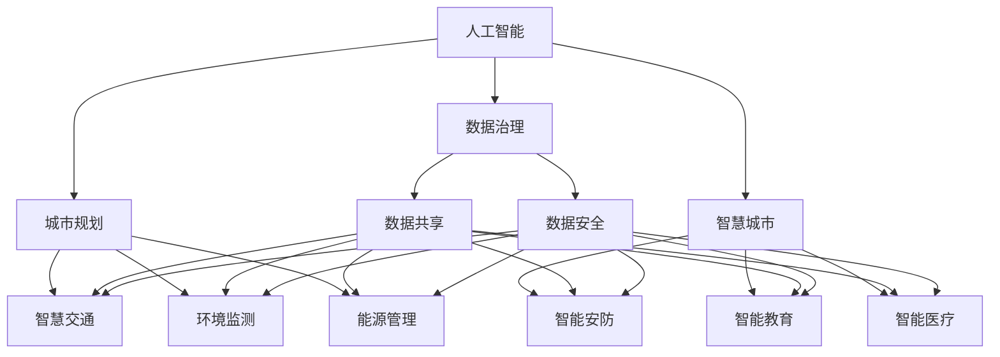

                 

## 1. 背景介绍

### 1.1 问题由来

近年来，随着人工智能（AI）技术的迅猛发展，其在城市规划和智慧城市建设中的应用逐渐增多，推动了城市治理和服务的智能化、高效化和精细化。AI技术在交通管理、环境监测、公共安全、社区服务、健康管理等多个方面都展现了巨大的潜力和价值。然而，城市规划和智慧城市建设面临诸多复杂问题，如城市数据治理、跨部门协作、用户隐私保护等。AI如何更好地应对这些挑战，推动城市发展，成为国内外学界和业界关注的焦点。

### 1.2 问题核心关键点

1. **城市治理智能化**：AI技术可以优化交通流量、环境监测、能源管理、垃圾处理等城市治理方案，提升城市治理的效率和准确性。
2. **公共服务普惠化**：通过智能分析，AI可以帮助提升教育、医疗、养老等公共服务的质量和覆盖范围，实现公共服务的普惠化。
3. **决策支持精准化**：AI技术可以提供精确的数据分析和预测，为城市规划和决策提供科学依据。
4. **跨部门协同化**：AI技术可以实现跨部门数据的整合和共享，促进城市各部门的协同工作，提高治理效率。
5. **隐私保护和伦理考量**：在AI应用过程中，如何平衡数据利用和隐私保护、伦理规范，是一个亟待解决的问题。

### 1.3 问题研究意义

AI在城市规划和智慧城市建设中的应用，不仅能够提升城市治理和服务水平，还能推动城市经济的可持续发展和社会进步。具体来说：

- **效率提升**：AI可以自动化、智能化处理大量城市数据，提升城市治理和服务的效率。
- **成本降低**：通过优化资源配置和精细化管理，AI有助于降低城市运行和维护的成本。
- **服务普惠**：AI可以推动公共服务资源的均衡分配，让更多人享受到城市发展的成果。
- **决策支持**：AI提供的数据分析和预测能力，有助于城市管理者制定更加科学和精准的规划方案。

## 2. 核心概念与联系

### 2.1 核心概念概述

为更好地理解AI在城市规划和智慧城市建设中的应用，本节将介绍几个密切相关的核心概念：

- **人工智能（AI）**：以数据驱动、模型驱动、算法驱动为核心的技术，能够模拟人类智能行为，解决复杂问题。
- **城市规划**：对城市未来发展进行设计和安排，包括土地使用、基础设施建设、交通规划等多个方面。
- **智慧城市**：通过信息通信技术（ICT）和AI技术，实现城市运行、管理、服务的智能化和高效化。
- **数据治理**：对城市数据的收集、存储、处理和共享进行管理，确保数据的质量、安全性和合规性。
- **跨部门协同**：不同城市部门之间的信息共享和合作，共同推进城市治理和服务。
- **隐私保护**：在AI应用中，保护个人和组织的隐私不受侵犯。

这些概念之间的逻辑关系可以通过以下Mermaid流程图来展示：



这个流程图展示了几大核心概念及其之间的关系：

1. AI是城市规划、智慧城市建设的基础技术。
2. 城市规划和智慧城市通过AI实现智能化和高效化。
3. 数据治理是城市运行的基础，确保数据的质量和安全。
4. 跨部门协同促进不同部门的信息共享和合作，提升治理效率。
5. 隐私保护是AI应用的重要原则，确保数据利用和隐私保护之间的平衡。

这些概念共同构成了智慧城市建设的总体框架，通过AI技术的应用，逐步实现城市治理和服务的高效化、智能化。

## 3. 核心算法原理 & 具体操作步骤

### 3.1 算法原理概述

AI在城市规划和智慧城市建设中的应用，主要涉及以下几个关键算法和技术：

- **机器学习（ML）**：通过对历史数据的分析和学习，预测未来趋势，优化决策方案。
- **深度学习（DL）**：利用神经网络等技术，处理大规模数据，实现复杂的模式识别和决策。
- **自然语言处理（NLP）**：处理文本数据，提取语义信息，实现智能分析和服务。
- **计算机视觉（CV）**：处理图像和视频数据，实现城市环境监测、智能安防等功能。
- **物联网（IoT）**：将传感器、设备与互联网连接，实现数据实时采集和监控。
- **区块链（Blockchain）**：确保数据共享和处理的透明性和安全性。

这些技术通过数据整合和算法优化，实现对城市运行、管理、服务的智能化和高效化。

### 3.2 算法步骤详解

AI在城市规划和智慧城市建设中的应用主要包括以下几个关键步骤：

**Step 1: 数据收集和处理**

- 收集城市运行和管理的各类数据，包括交通流量、环境监测、能源消耗、公共服务需求等。
- 对数据进行清洗、整理和标注，确保数据的质量和可用性。

**Step 2: 模型训练和优化**

- 选择合适的机器学习和深度学习模型，对数据进行训练和优化。
- 利用数据治理技术，确保数据隐私和安全性。
- 在模型训练过程中，引入正则化技术、交叉验证等，提高模型的泛化能力和鲁棒性。

**Step 3: 模型部署和应用**

- 将训练好的模型部署到城市治理和服务的各个环节，实现智能化和高效化。
- 通过API接口、云计算平台等方式，提供开放服务，方便用户使用。
- 实时监控模型性能，根据实际情况进行调整和优化。

**Step 4: 跨部门协同和反馈**

- 实现不同部门之间的数据共享和合作，确保信息的一致性和完整性。
- 收集用户反馈，不断改进模型和服务，提升用户体验。

### 3.3 算法优缺点

AI在城市规划和智慧城市建设中的应用，具有以下优点：

1. **效率提升**：AI能够自动化处理大量数据，提高决策和服务的效率。
2. **成本降低**：通过优化资源配置和精细化管理，AI有助于降低城市运行和维护的成本。
3. **服务普惠**：AI技术可以实现公共服务资源的均衡分配，让更多人享受到城市发展的成果。
4. **决策支持**：AI提供的数据分析和预测能力，有助于城市管理者制定更加科学和精准的规划方案。

同时，该方法也存在一定的局限性：

1. **数据依赖**：AI的性能很大程度上依赖于数据的质量和数量，数据的不完整和噪声可能影响模型的效果。
2. **算法复杂性**：AI算法模型复杂，需要大量的计算资源和时间进行训练和优化。
3. **隐私和伦理问题**：在AI应用过程中，如何平衡数据利用和隐私保护、伦理规范，是一个亟待解决的问题。
4. **跨部门协同难度**：不同部门之间的数据共享和合作，需要解决技术和管理上的障碍。

### 3.4 算法应用领域

AI在城市规划和智慧城市建设中的应用，已经广泛应用于以下多个领域：

- **智慧交通**：通过智能交通管理系统，优化交通流量，提升交通效率。
- **环境监测**：利用传感器和AI技术，实时监测环境质量，实现环境污染的预警和治理。
- **公共安全**：利用智能安防系统，提升城市安全防范能力。
- **社区服务**：通过智能分析，提升社区服务的质量和效率。
- **健康管理**：利用AI技术，实现智能医疗、健康监测等，提升公共健康水平。

除了上述这些经典应用外，AI还在城市规划的多个环节发挥着越来越重要的作用，如城市设计、规划决策、能源管理等，为城市发展注入了新的动力。

## 4. 数学模型和公式 & 详细讲解 & 举例说明

### 4.1 数学模型构建

AI在城市规划和智慧城市建设中的应用，涉及多个数学模型和技术，以下以智慧交通为例，介绍其数学模型构建。

**交通流预测模型**：
假设城市道路交通流量为 $x$，预测下一个时间点的交通流量 $y$，建立线性回归模型：

$$
y = w_0 + w_1x
$$

其中 $w_0$ 和 $w_1$ 为模型的参数，可以通过最小二乘法等方法进行估计。

### 4.2 公式推导过程

**线性回归公式推导**：
假设有一组历史交通流量数据 $(x_i, y_i)$，其中 $i$ 为时间索引。模型的目标是找到最优的 $w_0$ 和 $w_1$，使得预测值与实际值的误差最小化。

$$
\min_{w_0, w_1} \sum_{i=1}^n (y_i - (w_0 + w_1x_i))^2
$$

通过求解该最小化问题，可以求得最优的模型参数 $w_0$ 和 $w_1$，实现交通流量的预测。

### 4.3 案例分析与讲解

**智能交通信号控制**：
智能交通信号控制系统通过实时监测交通流量，动态调整信号灯的时序，实现交通流量优化。假设在一个十字路口有 $n$ 条道路，每条道路的交通流量为 $x_i$，系统根据预测的下一个时间点的交通流量，调整信号灯的时序，使得整体交通效率最大化。

假设信号灯控制模型为 $f(x)$，目标是最小化整个十字路口的交通延误时间：

$$
\min_{f(x)} \sum_{i=1}^n \int f(x_i) dt
$$

通过优化模型 $f(x)$，可以实现交通信号的智能控制，提升交通效率。

## 5. 项目实践：代码实例和详细解释说明

### 5.1 开发环境搭建

在进行智慧城市应用开发前，我们需要准备好开发环境。以下是使用Python进行TensorFlow开发的环境配置流程：

1. 安装Anaconda：从官网下载并安装Anaconda，用于创建独立的Python环境。

2. 创建并激活虚拟环境：
```bash
conda create -n tf-env python=3.8 
conda activate tf-env
```

3. 安装TensorFlow：根据CUDA版本，从官网获取对应的安装命令。例如：
```bash
conda install tensorflow
```

4. 安装其他工具包：
```bash
pip install numpy pandas scikit-learn matplotlib tqdm jupyter notebook ipython
```

完成上述步骤后，即可在`tf-env`环境中开始智慧城市应用开发。

### 5.2 源代码详细实现

这里我们以智能交通流量预测为例，给出使用TensorFlow进行模型训练和优化的PyTorch代码实现。

首先，定义交通流量预测模型的类：

```python
import tensorflow as tf
from tensorflow.keras import layers

class TrafficFlowPredictor(tf.keras.Model):
    def __init__(self, input_dim):
        super(TrafficFlowPredictor, self).__init__()
        self.model = tf.keras.Sequential([
            layers.Dense(64, activation='relu', input_shape=(input_dim,)),
            layers.Dense(64, activation='relu'),
            layers.Dense(1)
        ])
    
    def call(self, x):
        return self.model(x)
```

然后，定义训练和评估函数：

```python
from tensorflow.keras.optimizers import Adam
from tensorflow.keras.losses import MeanSquaredError
from sklearn.metrics import mean_squared_error

def train_epoch(model, x_train, y_train, x_val, y_val, batch_size):
    model.compile(optimizer=Adam(learning_rate=0.001),
                  loss=MeanSquaredError())
    
    model.fit(x_train, y_train, batch_size=batch_size, epochs=100, validation_data=(x_val, y_val))
    
    y_pred = model.predict(x_val)
    mse = mean_squared_error(y_val, y_pred)
    return mse

def evaluate(model, x_test, y_test, batch_size):
    model.evaluate(x_test, y_test, batch_size=batch_size)
```

最后，启动训练流程并在测试集上评估：

```python
epochs = 100
batch_size = 32

for epoch in range(epochs):
    mse = train_epoch(model, x_train, y_train, x_val, y_val, batch_size)
    print(f"Epoch {epoch+1}, mse: {mse:.3f}")
    
print(f"Final mse: {evaluate(model, x_test, y_test, batch_size):.3f}")
```

以上就是使用TensorFlow对智能交通流量预测进行模型训练和优化的完整代码实现。可以看到，TensorFlow提供了便捷的高级API，使得模型训练和优化变得相对简单高效。

### 5.3 代码解读与分析

让我们再详细解读一下关键代码的实现细节：

**TrafficFlowPredictor类**：
- `__init__`方法：定义模型结构，包括三个全连接层。
- `call`方法：实现模型的前向传播过程。

**train_epoch函数**：
- 使用Adam优化器和均方误差损失函数进行模型训练。
- 在每个epoch结束时，计算验证集的mse，返回该epoch的mse。

**evaluate函数**：
- 在测试集上评估模型的性能，输出mse。

**训练流程**：
- 定义总的epoch数和batch size，开始循环迭代
- 每个epoch内，先计算训练集的mse，再计算验证集的mse
- 所有epoch结束后，在测试集上评估，给出最终测试结果

可以看到，TensorFlow提供了便捷的高级API，使得模型训练和优化变得相对简单高效。开发者可以将更多精力放在数据处理、模型改进等高层逻辑上，而不必过多关注底层的实现细节。

## 6. 实际应用场景

### 6.1 智慧交通

基于AI的智能交通系统，能够实时监测交通流量，优化交通信号灯的控制，提升交通效率和安全性。具体来说，系统可以：

- 实时监测城市道路的交通流量，动态调整信号灯的时序，避免拥堵和事故。
- 利用预测模型，提前预知交通流量高峰，提前优化交通路线和信号灯设置。
- 通过智能分析，自动识别违规行为，及时采取措施，提升交通安全性。

### 6.2 环境监测

AI在环境监测中的应用，可以实时监测和预警环境污染问题，提升城市环境的治理效率。具体来说，系统可以：

- 利用传感器网络，实时监测空气质量、水质等环境指标。
- 利用预测模型，预测未来环境质量变化趋势，提前预警重大污染事件。
- 通过智能分析，自动识别和定位污染源，采取针对性治理措施。

### 6.3 公共安全

基于AI的智能安防系统，能够实时监控城市公共安全，提升城市安全防范能力。具体来说，系统可以：

- 实时监控城市公共场所的视频监控，自动识别异常行为。
- 利用预测模型，提前预警潜在的犯罪和灾害风险。
- 通过智能分析，自动识别和定位异常事件，及时采取措施。

### 6.4 社区服务

基于AI的智能社区服务系统，能够提升社区服务的质量和效率，提升居民的幸福感。具体来说，系统可以：

- 实时监测社区环境，自动识别和解决垃圾、卫生等问题。
- 利用预测模型，提前预测社区需求，提升服务的及时性和精准性。
- 通过智能分析，自动识别和解决居民的投诉和问题。

### 6.5 未来应用展望

随着AI技术的发展，未来智慧城市将涵盖更多的应用场景，推动城市治理和服务向更深层次发展。以下是一些未来可能的应用方向：

- **智能建筑**：通过AI技术，实现智能能源管理、智能安防等，提升建筑的安全和能效。
- **智能农业**：利用AI技术，实现智能灌溉、智能监控等，提升农业生产效率。
- **智能物流**：通过AI技术，实现智能路线规划、智能仓储管理等，提升物流效率。
- **智能医疗**：利用AI技术，实现智能诊断、智能健康监测等，提升医疗服务质量。
- **智能教育**：利用AI技术，实现智能辅导、智能评估等，提升教育质量。

未来，AI将在智慧城市建设中发挥更大的作用，推动城市治理和服务的高效化、智能化和普惠化。

## 7. 工具和资源推荐

### 7.1 学习资源推荐

为了帮助开发者系统掌握AI在城市规划和智慧城市建设中的应用，这里推荐一些优质的学习资源：

1. **《智慧城市建设与AI技术》课程**：由顶尖大学和研究机构开设的智慧城市课程，涵盖智慧城市的各个方面，包括AI技术的应用。

2. **《城市数据科学》书籍**：介绍城市数据科学的理论和实践，包含大量智慧城市的数据分析和建模案例。

3. **TensorFlow官方文档**：TensorFlow的官方文档，包含丰富的API和示例代码，是学习TensorFlow的重要资源。

4. **Transformers官方文档**：Transformers库的官方文档，提供了各种预训练语言模型的代码示例，是进行NLP任务开发的重要工具。

5. **CS224N《深度学习自然语言处理》课程**：斯坦福大学开设的NLP明星课程，涵盖NLP的各个方面，包括AI技术的应用。

通过对这些资源的学习实践，相信你一定能够快速掌握AI在城市规划和智慧城市建设中的应用，并用于解决实际的智慧城市问题。

### 7.2 开发工具推荐

高效的开发离不开优秀的工具支持。以下是几款用于智慧城市应用开发的常用工具：

1. **TensorFlow**：基于Python的开源深度学习框架，提供便捷的高级API，适合快速迭代研究。

2. **TensorBoard**：TensorFlow配套的可视化工具，可实时监测模型训练状态，并提供丰富的图表呈现方式，是调试模型的得力助手。

3. **Jupyter Notebook**：支持Python、R等语言的交互式编程，方便开发者进行模型训练和数据分析。

4. **Keras**：提供高级API，简化模型训练过程，适合快速原型开发和应用部署。

5. **PyTorch**：基于Python的开源深度学习框架，提供灵活的计算图和动态图，适合复杂的深度学习任务。

合理利用这些工具，可以显著提升智慧城市应用开发的效率，加快创新迭代的步伐。

### 7.3 相关论文推荐

AI在城市规划和智慧城市建设中的应用，涉及多个前沿领域，以下是几篇奠基性的相关论文，推荐阅读：

1. **《城市智慧交通系统》**：介绍智能交通系统的理论和技术，涵盖数据采集、交通预测、信号控制等方面。

2. **《环境污染监测与治理》**：介绍环境监测和治理的最新技术，包括传感器网络、数据分析、预测模型等方面。

3. **《智能安防系统》**：介绍智能安防系统的理论和技术，涵盖视频监控、行为分析、预警系统等方面。

4. **《社区服务智能化》**：介绍智能社区服务系统的理论和技术，涵盖智能监控、智能分析、服务优化等方面。

5. **《智慧城市建设与AI技术》**：介绍智慧城市的理论和技术，涵盖智慧交通、环境监测、公共安全、社区服务等方面。

这些论文代表了大规模智慧城市建设的研究前沿，通过学习这些前沿成果，可以帮助研究者把握学科前进方向，激发更多的创新灵感。

## 8. 总结：未来发展趋势与挑战

### 8.1 总结

本文对AI在城市规划和智慧城市建设中的应用进行了全面系统的介绍。首先阐述了AI在智慧城市建设中的重要性和应用前景，明确了智慧城市建设的总体框架和核心技术。其次，从原理到实践，详细讲解了AI在智慧城市建设中的应用步骤和关键算法，给出了智慧城市应用开发的完整代码实现。同时，本文还广泛探讨了AI在智慧城市建设中的实际应用场景，展示了AI技术的广阔应用前景。此外，本文精选了智慧城市建设的各类学习资源，力求为读者提供全方位的技术指引。

通过本文的系统梳理，可以看到，AI在智慧城市建设中的应用，正在逐步改变城市治理和服务的各个环节，提升城市运行效率和服务质量。AI技术的应用，不仅能够提升城市治理和服务的智能化、高效化和精细化，还能推动城市经济的可持续发展和社会进步。未来，随着AI技术的发展和普及，智慧城市建设将迎来更多的创新和突破。

### 8.2 未来发展趋势

展望未来，智慧城市建设将呈现以下几个发展趋势：

1. **智能化程度的提升**：AI技术将更加广泛地应用于城市治理和服务的各个环节，提升城市的智能化水平。
2. **跨部门协同的加强**：不同部门之间的数据共享和合作将更加紧密，提升城市治理和服务的协同效率。
3. **隐私保护的重视**：在智慧城市建设中，隐私保护将得到更多的重视，数据利用和隐私保护之间的平衡将更加重要。
4. **伦理规范的建立**：AI技术的应用将建立更加完善的伦理规范，确保技术应用的合法性和道德性。
5. **可持续发展的推动**：AI技术将推动城市资源的优化配置和精细化管理，实现城市的可持续发展。
6. **人工智能与城市规划的深度融合**：AI技术与城市规划的深度融合，将推动城市的科学规划和可持续发展。

以上趋势凸显了智慧城市建设的前景和潜力。这些方向的探索发展，将进一步提升城市治理和服务的智能化、高效化和精细化，推动城市经济的可持续发展和社会进步。

### 8.3 面临的挑战

尽管AI在智慧城市建设中取得了显著成效，但在迈向更加智能化、普惠化应用的过程中，仍面临诸多挑战：

1. **数据质量和安全**：智慧城市建设依赖大量的城市数据，数据质量和安全问题亟需解决。如何保障数据的质量、隐私和安全，是一个亟待解决的问题。
2. **跨部门协作**：不同部门之间的数据共享和合作，需要解决技术和管理上的障碍。如何实现跨部门的协同工作，提升治理效率，是一个重要挑战。
3. **技术融合与创新**：AI技术与城市规划的深度融合，需要解决技术上的兼容性和一致性问题。如何实现技术的融合与创新，是一个需要不断探索的方向。
4. **伦理规范和道德问题**：AI技术的应用需要建立完善的伦理规范，确保技术应用的合法性和道德性。如何在技术应用中平衡效率和伦理，是一个重要的研究方向。
5. **社会接受度和认知**：AI技术的应用需要社会各界的广泛接受和认知。如何提升公众对AI技术的认知和接受度，是一个需要不断努力的方向。

这些挑战需要学界和业界共同努力，通过技术创新、政策引导和社会教育，推动智慧城市建设向更高的层次发展。

### 8.4 研究展望

面对智慧城市建设中的诸多挑战，未来的研究需要在以下几个方面寻求新的突破：

1. **数据治理与隐私保护**：在智慧城市建设中，需要建立完善的数据治理机制，保障数据的质量、隐私和安全。探索数据治理与隐私保护的新技术，是一个重要的研究方向。
2. **跨部门协同与治理模型**：探索跨部门协同的治理模型和技术，实现不同部门之间的数据共享和合作，提升治理效率。
3. **人工智能与城市规划的深度融合**：探索AI技术与城市规划的深度融合，推动城市的科学规划和可持续发展。
4. **智能基础设施的建设**：探索智能基础设施的建设与应用，提升城市运行和管理的智能化水平。
5. **智能系统的可解释性和透明性**：探索智能系统的可解释性和透明性技术，提升系统的可信度和用户接受度。

这些研究方向的探索，将进一步推动智慧城市建设的发展，提升城市治理和服务的智能化、高效化和普惠化水平。通过多方面的协同努力，智慧城市建设必将迈向更加智能化和可持续发展的未来。

## 9. 附录：常见问题与解答

**Q1: AI在智慧城市建设中的应用是否仅限于大城市？**

A: AI在智慧城市建设中的应用，不仅限于大城市，中小城市和农村地区同样可以受益。智慧城市建设的目标是实现城市治理和服务的智能化、高效化和精细化，中小城市和农村地区同样需要智慧城市建设来提升其治理和服务水平。

**Q2: AI在智慧城市建设中的应用是否需要大量的数据和计算资源？**

A: 是的，AI在智慧城市建设中的应用确实需要大量的数据和计算资源。智慧城市建设依赖于数据的实时采集、存储、分析和应用，需要大量的数据和计算资源来支持。但随着云计算和大数据技术的不断发展，AI在智慧城市建设中的应用也将变得更加高效和便捷。

**Q3: 智慧城市建设中，如何平衡数据利用和隐私保护？**

A: 在智慧城市建设中，平衡数据利用和隐私保护是一个重要的研究方向。可以采取以下措施：
1. 数据匿名化处理：对数据进行匿名化处理，保护个人隐私。
2. 数据加密技术：对数据进行加密处理，确保数据在传输和存储过程中的安全。
3. 数据访问控制：对数据进行严格的访问控制，确保只有授权人员能够访问和使用数据。
4. 数据共享协议：制定数据共享协议，明确数据的使用范围和责任。
5. 隐私保护技术：采用隐私保护技术，如差分隐私、联邦学习等，保护数据隐私。

**Q4: AI在智慧城市建设中的应用是否需要跨部门的协作？**

A: 是的，AI在智慧城市建设中的应用需要跨部门的协作。智慧城市建设依赖于不同部门的数据共享和合作，只有通过跨部门的协作，才能实现数据的高效利用和治理目标。不同部门之间的数据共享和合作，需要建立完善的数据治理机制和技术支持。

**Q5: AI在智慧城市建设中的应用是否需要伦理规范的引导？**

A: 是的，AI在智慧城市建设中的应用需要伦理规范的引导。智慧城市建设涉及公共安全和隐私保护等重要问题，需要建立完善的伦理规范，确保AI技术的合法性和道德性。伦理规范的建立和引导，是智慧城市建设中的重要研究方向，需要在技术应用中不断完善和优化。

---

作者：禅与计算机程序设计艺术 / Zen and the Art of Computer Programming

