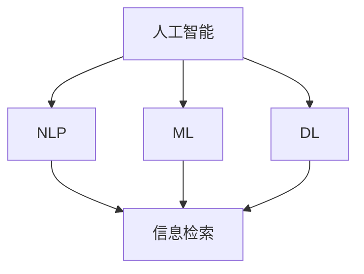

                 

## 1. 背景介绍

随着人工智能(AI)技术的快速发展和普及，其在学术研究和信息检索领域的应用日益广泛，正在改变研究者和用户的传统工作方式和信息获取途径。人工智能技术的引入，不仅提升了研究效率，也拓展了研究深度和广度，为学术界和信息检索领域带来了革命性的变革。

### 1.1 问题由来

学术研究和信息检索领域长期以来依赖于手动处理大量数据，方法繁琐且耗时，严重限制了研究进度和质量。AI技术特别是自然语言处理(NLP)、机器学习(ML)、深度学习(DL)等技术的兴起，为解决这些问题提供了新的方向。

- **学术研究**：研究人员需要阅读、理解和分析大量文献，从中提取有价值的信息和知识。传统方式如手动检索、阅读和整理数据，耗时长、效率低。
- **信息检索**：用户需要快速找到与其兴趣或需求相关的信息。传统的信息检索系统主要依赖关键词匹配，搜索结果的精准度和相关性不足，用户体验不佳。

### 1.2 问题核心关键点

1. **信息过载**：学术数据库中存储了海量的文献，如何高效地过滤和筛选出与研究需求相关的信息成为一大挑战。
2. **文献质量评估**：如何从海量文献中识别出高价值和高质量的研究成果，为研究者提供更多参考依据。
3. **深度知识挖掘**：如何从文献中提取深度知识，如关联性、主题、趋势等，辅助研究者的研究工作。
4. **个性化信息推荐**：如何根据用户的研究背景和需求，推荐个性化的文献和资源，提高信息获取的精准度。

### 1.3 问题研究意义

AI技术在学术研究和信息检索中的应用，对于提升研究效率、改善信息获取体验、推动学术交流具有重要意义：

1. **加速研究进程**：AI可以自动化处理大量数据，为研究人员节约时间，加速研究进程。
2. **提升文献质量评估**：AI可以自动识别和推荐高质量研究成果，辅助研究者筛选有用的文献。
3. **深度知识挖掘**：AI可以自动提取文献中的深度知识，帮助研究者理解和把握研究趋势和热点。
4. **个性化信息推荐**：AI可以根据用户需求，推荐个性化信息，提高信息获取的效率和精准度。
5. **推动学术交流**：AI可以辅助学术交流平台，促进研究者之间的互动和协作。

## 2. 核心概念与联系

### 2.1 核心概念概述

为更好地理解AI在学术研究和信息检索中的应用，本节将介绍几个密切相关的核心概念：

- **人工智能**：通过计算机程序实现模拟人类智能的技术，包括感知、认知、决策等方面。
- **自然语言处理(NLP)**：使用计算机处理和理解人类语言的技术，包括文本分析、信息提取、机器翻译等。
- **机器学习(ML)**：使计算机通过数据学习规律，并据此进行决策和预测的技术。
- **深度学习(DL)**：一种特殊的ML技术，通过多层神经网络实现对复杂模式的识别和处理。
- **信息检索(IR)**：使用计算机检索和推荐信息的技术，常见应用包括搜索引擎、图书馆管理系统等。

这些概念之间的逻辑关系可以通过以下Mermaid流程图来展示：



这个流程图展示了几大核心概念及其之间的关系：

1. 人工智能通过多种技术手段（包括NLP、ML、DL等）实现对人类智能的模拟。
2. 自然语言处理是人工智能在处理语言方面的关键技术。
3. 机器学习和深度学习是人工智能的两种重要方法。
4. 信息检索是人工智能技术的重要应用领域之一。

这些概念共同构成了AI在学术研究和信息检索中的应用框架，使得AI技术能够在各种场景下发挥强大的语言理解和智能决策能力。

## 3. 核心算法原理 & 具体操作步骤

### 3.1 算法原理概述

AI在学术研究和信息检索中的应用，主要基于以下几个关键算法原理：

1. **自然语言处理(NLP)**：通过分词、命名实体识别、关系抽取等技术，理解文本内容并提取关键信息。
2. **机器学习(ML)**：使用训练数据训练模型，使其能够自动识别和分类文本，进行推荐和检索。
3. **深度学习(DL)**：利用神经网络模型处理高维数据，实现更准确的文本表示和分类。
4. **信息检索(IR)**：通过关键词匹配、语义匹配等方法，高效检索相关信息。

这些算法原理的结合使用，使得AI技术在学术研究和信息检索中能够提供更高效、精准和智能的服务。

### 3.2 算法步骤详解

AI在学术研究和信息检索中的应用，通常包括以下几个关键步骤：

**Step 1: 数据预处理**

- 收集和整理研究数据，包括文献、论文、预印本等。
- 对文本数据进行清洗和标注，去除无关信息和噪声。
- 对文本数据进行分词、命名实体识别、关系抽取等预处理，提取关键信息。

**Step 2: 模型训练**

- 选择合适的NLP、ML、DL等模型作为基础模型，如BERT、GPT等。
- 收集高质量标注数据，训练模型并优化参数。
- 对模型进行评估，调整超参数以提高性能。

**Step 3: 信息检索和推荐**

- 根据用户查询或兴趣，使用训练好的模型进行信息检索和推荐。
- 利用ML或DL模型对搜索结果进行排序和过滤，提高相关性。
- 使用个性化推荐算法，如协同过滤、内容推荐等，提供个性化信息服务。

**Step 4: 结果展示和反馈**

- 展示搜索结果和推荐内容，供用户选择和使用。
- 收集用户反馈，对模型进行调优和迭代，提升用户体验。

### 3.3 算法优缺点

AI在学术研究和信息检索中的应用，具有以下优点：

1. **高效性**：自动化处理大量数据，极大地提高了研究效率和信息获取速度。
2. **精准性**：基于机器学习模型的推荐和检索，能够提供高质量和相关的信息。
3. **广泛性**：适用于各种研究领域和信息检索场景，具有较强的通用性。
4. **可扩展性**：随着数据和模型的积累，AI技术能够不断提升性能，满足不断增长的需求。

但同时也存在一些局限：

1. **数据依赖**：AI技术需要大量的高质量标注数据，数据稀缺时性能受限。
2. **模型复杂性**：部分深度学习模型结构复杂，训练和推理耗时长。
3. **偏见和偏差**：模型可能学习到数据中的偏见和偏差，影响结果的公正性和客观性。
4. **可解释性不足**：AI模型通常是"黑盒"，难以解释其决策过程和结果。
5. **隐私和伦理**：大规模数据的使用可能带来隐私和伦理问题，需要严格的数据管理和隐私保护。

### 3.4 算法应用领域

AI在学术研究和信息检索中的应用，已经覆盖了诸多领域，具体包括：

- **学术研究**：自动文献检索、引用分析和趋势预测等。
- **学术出版**：论文推荐、写作辅助和版权检测等。
- **科学计算**：数据分析、计算仿真和数值模拟等。
- **图书馆管理**：自动化借阅、书目推荐和用户服务等。
- **教育培训**：在线课程推荐、学习路径规划和互动交流等。
- **健康医疗**：疾病诊断、药物研发和临床研究等。
- **法律咨询**：法律文献检索、案件分析和司法推理等。

这些应用领域展示了AI技术在学术研究和信息检索中的广泛适用性和巨大潜力。

## 4. 数学模型和公式 & 详细讲解 & 举例说明

### 4.1 数学模型构建

在学术研究和信息检索中，常见的数学模型包括文本表示、分类、检索等。以下以文本分类为例，介绍基本的数学模型构建过程。

**文本分类**：将文本数据分为多个预定义的类别。假设文本数据集为 $\{(x_i, y_i)\}_{i=1}^N$，其中 $x_i$ 表示第 $i$ 个文本，$y_i \in \{1, 2, \ldots, K\}$ 表示 $x_i$ 所属的类别。

目标是最小化损失函数 $\mathcal{L}(\theta)$，其中 $\theta$ 为模型参数。常用的损失函数包括交叉熵损失（Cross-Entropy Loss）和感知机损失（Perceptron Loss）。

### 4.2 公式推导过程

以交叉熵损失为例，推导模型参数 $\theta$ 的更新公式。假设模型 $M_{\theta}$ 在文本 $x_i$ 上的分类概率为 $p(y_i \mid x_i)$，则交叉熵损失函数为：

$$
\mathcal{L}(\theta) = -\frac{1}{N} \sum_{i=1}^N \sum_{k=1}^K y_i \log p(y_i = k \mid x_i)
$$

其中 $y_i$ 为真实标签，$p(y_i = k \mid x_i)$ 为模型在文本 $x_i$ 上分类为类别 $k$ 的概率。

根据梯度下降法，模型参数 $\theta$ 的更新公式为：

$$
\theta \leftarrow \theta - \eta \nabla_{\theta} \mathcal{L}(\theta)
$$

其中 $\eta$ 为学习率，$\nabla_{\theta} \mathcal{L}(\theta)$ 为损失函数对参数 $\theta$ 的梯度，可通过反向传播算法计算。

### 4.3 案例分析与讲解

以BERT模型为例，介绍其在学术研究和信息检索中的具体应用。BERT模型是一种预训练的Transformer模型，通过在大量无标签文本上进行预训练，学习到丰富的语言表示。常见的应用包括：

- **文献摘要生成**：使用BERT模型对学术文献进行摘要提取，辅助研究人员快速了解文献内容。
- **研究趋势分析**：通过对大量文献的分类和聚类，分析研究趋势和热点领域。
- **知识图谱构建**：从文献中抽取实体和关系，构建知识图谱，辅助研究人员进行更深层次的学术研究。

## 5. 项目实践：代码实例和详细解释说明

### 5.1 开发环境搭建

在进行学术研究和信息检索应用的开发前，我们需要准备好开发环境。以下是使用Python进行PyTorch开发的环境配置流程：

1. 安装Anaconda：从官网下载并安装Anaconda，用于创建独立的Python环境。

2. 创建并激活虚拟环境：
```bash
conda create -n pytorch-env python=3.8 
conda activate pytorch-env
```

3. 安装PyTorch：根据CUDA版本，从官网获取对应的安装命令。例如：
```bash
conda install pytorch torchvision torchaudio cudatoolkit=11.1 -c pytorch -c conda-forge
```

4. 安装Transformers库：
```bash
pip install transformers
```

5. 安装各类工具包：
```bash
pip install numpy pandas scikit-learn matplotlib tqdm jupyter notebook ipython
```

完成上述步骤后，即可在`pytorch-env`环境中开始项目实践。

### 5.2 源代码详细实现

下面我们以BERT模型进行学术文献分类为例，给出使用Transformers库的PyTorch代码实现。

首先，定义文本分类任务的数据处理函数：

```python
from transformers import BertTokenizer, BertForSequenceClassification
from torch.utils.data import Dataset
import torch

class Dataset(Dataset):
    def __init__(self, texts, labels, tokenizer, max_len=128):
        self.texts = texts
        self.labels = labels
        self.tokenizer = tokenizer
        self.max_len = max_len
        
    def __len__(self):
        return len(self.texts)
    
    def __getitem__(self, item):
        text = self.texts[item]
        label = self.labels[item]
        
        encoding = self.tokenizer(text, return_tensors='pt', max_length=self.max_len, padding='max_length', truncation=True)
        input_ids = encoding['input_ids'][0]
        attention_mask = encoding['attention_mask'][0]
        
        # 对标签进行one-hot编码
        labels = torch.tensor(label2id[label], dtype=torch.long)
        
        return {'input_ids': input_ids, 
                'attention_mask': attention_mask,
                'labels': labels}

# 标签与id的映射
label2id = {'Economics': 0, 'Computer Science': 1, 'Biology': 2, 'Physics': 3, 'Mathematics': 4}
id2label = {v: k for k, v in label2id.items()}

# 创建dataset
tokenizer = BertTokenizer.from_pretrained('bert-base-cased')

train_dataset = Dataset(train_texts, train_labels, tokenizer)
dev_dataset = Dataset(dev_texts, dev_labels, tokenizer)
test_dataset = Dataset(test_texts, test_labels, tokenizer)
```

然后，定义模型和优化器：

```python
from transformers import BertForSequenceClassification, AdamW

model = BertForSequenceClassification.from_pretrained('bert-base-cased', num_labels=len(label2id))

optimizer = AdamW(model.parameters(), lr=2e-5)
```

接着，定义训练和评估函数：

```python
from torch.utils.data import DataLoader
from tqdm import tqdm
from sklearn.metrics import accuracy_score, precision_recall_fscore_support

device = torch.device('cuda') if torch.cuda.is_available() else torch.device('cpu')
model.to(device)

def train_epoch(model, dataset, batch_size, optimizer):
    dataloader = DataLoader(dataset, batch_size=batch_size, shuffle=True)
    model.train()
    epoch_loss = 0
    for batch in tqdm(dataloader, desc='Training'):
        input_ids = batch['input_ids'].to(device)
        attention_mask = batch['attention_mask'].to(device)
        labels = batch['labels'].to(device)
        model.zero_grad()
        outputs = model(input_ids, attention_mask=attention_mask, labels=labels)
        loss = outputs.loss
        epoch_loss += loss.item()
        loss.backward()
        optimizer.step()
    return epoch_loss / len(dataloader)

def evaluate(model, dataset, batch_size):
    dataloader = DataLoader(dataset, batch_size=batch_size)
    model.eval()
    preds, labels = [], []
    with torch.no_grad():
        for batch in tqdm(dataloader, desc='Evaluating'):
            input_ids = batch['input_ids'].to(device)
            attention_mask = batch['attention_mask'].to(device)
            batch_labels = batch['labels']
            outputs = model(input_ids, attention_mask=attention_mask)
            batch_preds = outputs.logits.argmax(dim=1).to('cpu').tolist()
            batch_labels = batch_labels.to('cpu').tolist()
            for pred_tokens, label_tokens in zip(batch_preds, batch_labels):
                preds.append(pred_tokens)
                labels.append(label_tokens)
                
    labels = torch.tensor(labels)
    preds = torch.tensor(preds)
    return accuracy_score(labels, preds)

# 训练和评估
epochs = 5
batch_size = 16

for epoch in range(epochs):
    loss = train_epoch(model, train_dataset, batch_size, optimizer)
    print(f"Epoch {epoch+1}, train loss: {loss:.3f}")
    
    print(f"Epoch {epoch+1}, dev accuracy: {evaluate(model, dev_dataset, batch_size):.4f}")
    
print("Test accuracy:")
evaluate(model, test_dataset, batch_size)
```

以上就是使用PyTorch对BERT模型进行学术文献分类任务的完整代码实现。可以看到，得益于Transformers库的强大封装，我们可以用相对简洁的代码完成BERT模型的加载和微调。

### 5.3 代码解读与分析

让我们再详细解读一下关键代码的实现细节：

**Dataset类**：
- `__init__`方法：初始化文本、标签、分词器等关键组件。
- `__len__`方法：返回数据集的样本数量。
- `__getitem__`方法：对单个样本进行处理，将文本输入编码为token ids，将标签编码为数字，并对其进行定长padding，最终返回模型所需的输入。

**label2id和id2label字典**：
- 定义了标签与数字id之间的映射关系，用于将标签进行one-hot编码。

**训练和评估函数**：
- 使用PyTorch的DataLoader对数据集进行批次化加载，供模型训练和推理使用。
- 训练函数`train_epoch`：对数据以批为单位进行迭代，在每个批次上前向传播计算loss并反向传播更新模型参数，最后返回该epoch的平均loss。
- 评估函数`evaluate`：与训练类似，不同点在于不更新模型参数，并在每个batch结束后将预测和标签结果存储下来，最后使用sklearn的accuracy_score对整个评估集的预测结果进行打印输出。

**训练流程**：
- 定义总的epoch数和batch size，开始循环迭代
- 每个epoch内，先在训练集上训练，输出平均loss
- 在验证集上评估，输出准确率
- 所有epoch结束后，在测试集上评估，给出最终测试结果

可以看到，PyTorch配合Transformers库使得BERT微调的代码实现变得简洁高效。开发者可以将更多精力放在数据处理、模型改进等高层逻辑上，而不必过多关注底层的实现细节。

当然，工业级的系统实现还需考虑更多因素，如模型的保存和部署、超参数的自动搜索、更灵活的任务适配层等。但核心的微调范式基本与此类似。

## 6. 实际应用场景

### 6.1 学术研究支持

AI技术在学术研究中的应用，已经涵盖了从文献检索到论文写作的全过程。例如：

- **文献检索**：使用BERT等预训练模型进行自动摘要和分类，辅助研究人员快速找到相关文献。
- **论文写作**：利用AI工具自动生成文献综述、研究方法等文本内容，节省写作时间。
- **研究合作**：使用自然语言处理技术自动生成会议摘要和论文简介，促进研究者之间的交流和合作。

### 6.2 信息检索优化

AI技术在信息检索中的应用，可以显著提升搜索结果的相关性和准确性。例如：

- **搜索结果排序**：使用BERT等模型对搜索结果进行排序和过滤，提高搜索结果的相关性。
- **个性化推荐**：使用协同过滤、内容推荐等算法，根据用户的历史行为和兴趣，提供个性化的搜索结果和推荐。
- **实时反馈**：实时收集用户反馈，动态调整模型参数，提高检索系统的适应性和准确性。

### 6.3 未来应用展望

随着AI技术的不断进步，AI在学术研究和信息检索中的应用前景更加广阔：

1. **多模态信息融合**：将文本、图像、视频等多种信息源融合，构建更全面的学术和信息检索系统。
2. **知识图谱构建**：通过自动抽取实体和关系，构建知识图谱，辅助研究人员进行更深层次的学术研究。
3. **跨语言检索**：通过多语言模型和翻译技术，实现跨语言的学术和信息检索。
4. **主动学习**：使用主动学习算法，在有限的标注数据下，快速提升检索系统的准确性和鲁棒性。
5. **元学习**：通过元学习技术，让检索系统能够动态适应用户需求的变化，保持高性能。

这些趋势展示了AI技术在学术研究和信息检索中的广阔应用前景，预示着未来AI将扮演更加重要的角色。

## 7. 工具和资源推荐

### 7.1 学习资源推荐

为了帮助开发者系统掌握AI在学术研究和信息检索中的应用，这里推荐一些优质的学习资源：

1. 《深度学习与自然语言处理》系列博文：由深度学习领域知名专家撰写，深入浅出地介绍了深度学习在NLP中的应用。
2. CS231n《深度学习与计算机视觉》课程：斯坦福大学开设的深度学习课程，涵盖深度学习在图像、文本等多个领域的应用。
3. 《自然语言处理综述》书籍：全面介绍了自然语言处理领域的最新进展和技术，适合初学者和研究人员。
4. arXiv和Google Scholar：最新的学术研究成果发布平台，可以快速获取最新论文和进展。
5. Kaggle：数据科学竞赛平台，可以参与实际项目，提升实战能力。

通过对这些资源的学习实践，相信你一定能够快速掌握AI在学术研究和信息检索中的应用，并用于解决实际的学术和信息获取问题。

### 7.2 开发工具推荐

高效的开发离不开优秀的工具支持。以下是几款用于AI研究和信息检索开发的常用工具：

1. Jupyter Notebook：免费的交互式编程环境，支持多种编程语言和数据可视化。
2. PyTorch：基于Python的开源深度学习框架，灵活的计算图和动态图设计，适合研究和原型开发。
3. TensorFlow：由Google主导开发的开源深度学习框架，生产部署方便，适合大规模工程应用。
4. NLTK：Python自然语言处理工具包，提供了丰富的NLP工具和语料库。
5. SpaCy：高性能的自然语言处理库，支持分词、命名实体识别等任务。
6. Scikit-learn：Python机器学习库，提供了丰富的机器学习算法和工具。

合理利用这些工具，可以显著提升AI在学术研究和信息检索开发的速度和质量，加速研究创新和应用落地。

### 7.3 相关论文推荐

AI在学术研究和信息检索领域的研究已经积累了大量成果，以下是几篇代表性的论文，推荐阅读：

1. BERT: Pre-training of Deep Bidirectional Transformers for Language Understanding：提出BERT模型，利用掩码语言模型和下一句预测任务进行预训练。
2. Attention is All You Need：提出Transformer模型，利用自注意力机制进行文本表示和分类。
3. Google Scholar：介绍Google Scholar的信息检索技术，展示了通过深度学习提升检索准确性的案例。
4. Microsoft Research: Search Understanding as a Natural Language Processing Problem：提出基于自然语言处理的信息检索模型，通过语义理解提升检索效果。
5. Natural Language Processing in the Context of Scientific Research：综述了NLP在科学研究和信息检索中的应用，包括文本分类、信息抽取等。

这些论文代表了AI在学术研究和信息检索领域的研究脉络，对于理解技术和应用实践具有重要参考价值。

## 8. 总结：未来发展趋势与挑战

### 8.1 研究成果总结

AI技术在学术研究和信息检索中的应用，已经取得了显著进展，并带来了深远的影响：

1. **效率提升**：AI技术显著提升了研究效率，减少了手动操作的时间。
2. **信息获取**：AI技术改进了信息检索的准确性和相关性，提升了用户体验。
3. **知识挖掘**：AI技术可以自动提取文本中的深度知识，辅助研究人员进行更深层次的学术研究。
4. **跨领域应用**：AI技术已经广泛应用于多个研究领域和应用场景，具有较强的通用性。

### 8.2 未来发展趋势

展望未来，AI在学术研究和信息检索中的应用将呈现以下几个发展趋势：

1. **多模态融合**：将文本、图像、视频等多种信息源融合，构建更全面的学术和信息检索系统。
2. **跨语言检索**：通过多语言模型和翻译技术，实现跨语言的学术和信息检索。
3. **元学习和主动学习**：让检索系统能够动态适应用户需求的变化，保持高性能。
4. **知识图谱构建**：通过自动抽取实体和关系，构建知识图谱，辅助研究人员进行更深层次的学术研究。
5. **实时反馈**：实时收集用户反馈，动态调整模型参数，提高检索系统的适应性和准确性。
6. **模型解释性**：提升AI模型的可解释性，确保其决策过程透明可信。

### 8.3 面临的挑战

尽管AI技术在学术研究和信息检索中的应用已经取得显著进展，但仍面临诸多挑战：

1. **数据依赖**：AI技术需要大量的高质量标注数据，数据稀缺时性能受限。
2. **模型复杂性**：部分深度学习模型结构复杂，训练和推理耗时长。
3. **偏见和偏差**：模型可能学习到数据中的偏见和偏差，影响结果的公正性和客观性。
4. **隐私和伦理**：大规模数据的使用可能带来隐私和伦理问题，需要严格的数据管理和隐私保护。
5. **可解释性不足**：AI模型通常是"黑盒"，难以解释其决策过程和结果。
6. **计算资源**：AI技术需要高性能的计算资源，包括GPU、TPU等，成本较高。

### 8.4 研究展望

面对AI在学术研究和信息检索中面临的挑战，未来的研究需要在以下几个方面寻求新的突破：

1. **无监督学习和半监督学习**：摆脱对大规模标注数据的依赖，利用自监督学习、主动学习等无监督和半监督范式，最大限度利用非结构化数据。
2. **模型简化和优化**：开发更加参数高效和计算高效的AI模型，在保证性能的同时，减小模型规模和计算资源消耗。
3. **模型解释性**：提升AI模型的可解释性，确保其决策过程透明可信。
4. **跨领域知识融合**：将符号化的先验知识，如知识图谱、逻辑规则等，与神经网络模型进行融合，提升模型的通用性和泛化能力。
5. **数据管理和隐私保护**：加强数据管理和隐私保护，确保数据安全和使用合规。

这些研究方向的研究进展，必将推动AI在学术研究和信息检索中的进一步发展，为学术界和信息检索领域带来更多创新和突破。

## 9. 附录：常见问题与解答

**Q1：AI在学术研究和信息检索中的应用是否会替代人类研究者？**

A: AI技术虽然能够显著提升研究和信息检索的效率，但并不会替代人类研究者。AI主要用于辅助研究者进行数据处理、信息检索等繁琐工作，而人类研究者仍然负责分析结果、提出新问题和进行创新性研究。AI和人类研究者的协同合作，将更好地发挥各自的优势，推动学术研究的发展。

**Q2：AI技术在学术研究和信息检索中的应用是否会造成学术不端行为？**

A: AI技术的应用不会直接导致学术不端行为，但需要注意数据质量和模型偏见。如果数据来源不合法或存在偏见，AI模型可能会学习到有害信息，生成误导性的结果。因此，研究者和开发者需要确保数据的合法性和公平性，避免偏见和伦理问题。

**Q3：AI技术在学术研究和信息检索中的应用是否需要严格的监管？**

A: 是的，AI技术在学术研究和信息检索中的应用，需要严格的监管和管理。特别是在涉及隐私数据、医疗信息等领域，必须遵守相关法律法规和伦理规范，确保数据的安全和公正使用。

**Q4：AI技术在学术研究和信息检索中的应用是否会导致信息过载？**

A: 尽管AI技术可以提升信息检索的效率，但如果数据规模过大且未经过有效的筛选和分类，仍然可能导致信息过载。因此，研究者和开发者需要关注数据的多样性和质量，采用多模态信息融合、主动学习等技术，提高信息的精炼和可理解性。

**Q5：AI技术在学术研究和信息检索中的应用是否会导致数据隐私泄露？**

A: 是的，大规模数据的使用可能带来隐私和伦理问题。因此，研究者和开发者需要严格遵守数据保护法律法规，采用数据脱敏、加密等技术，确保数据的隐私和安全。

---

作者：禅与计算机程序设计艺术 / Zen and the Art of Computer Programming

