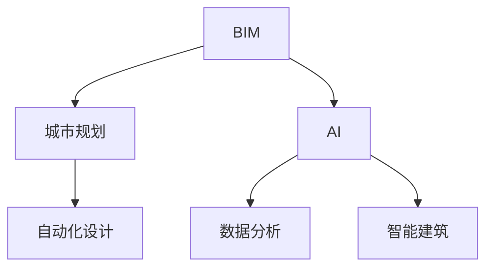

                 

# AI如何改变建筑设计和城市规划

> 关键词：人工智能,建筑信息模型(BIM),城市规划,自动化,智能建筑,数据分析

## 1. 背景介绍

### 1.1 问题由来
在现代社会中，城市和建筑领域面临着种种挑战，包括人口增长、资源匮乏、环境污染等问题。传统的建筑设计和城市规划方法已经难以应对这些复杂多变的环境，需要新的技术手段来解决这些问题。人工智能（AI）的崛起，为建筑和城市规划提供了全新的视角和工具。

### 1.2 问题核心关键点
AI在建筑设计和城市规划中的应用，主要体现在以下几个方面：

1. 提高设计效率：AI可以自动生成设计方案，减少设计过程中的反复修改。
2. 优化资源利用：AI可以预测建筑物的能耗和材料消耗，优化设计方案。
3. 提升规划准确性：AI可以分析海量数据，辅助城市规划和建筑设计。
4. 增强决策支持：AI可以提供基于数据的决策建议，辅助设计师和规划师进行决策。
5. 实现智能建筑：AI可以实现智能家居、智能监控等功能，提升建筑智能化水平。

### 1.3 问题研究意义
AI在建筑设计和城市规划中的应用，能够显著提升设计效率和规划质量，优化资源利用，减少浪费，降低环境影响。通过AI技术的应用，可以实现更加智能、可持续的建筑和城市，为人类创造更加宜居的生活环境。

## 2. 核心概念与联系

### 2.1 核心概念概述

为了更好地理解AI在建筑设计和城市规划中的应用，本节将介绍几个密切相关的核心概念：

- 建筑信息模型（Building Information Modeling, BIM）：一种数字化技术，用于创建和管理建筑的生命周期信息。BIM可以包括设计、施工、运营等阶段的所有数据。
- 城市规划（Urban Planning）：指对城市的发展进行规划和设计，包括城市土地利用、交通、环境等各方面。
- 人工智能（Artificial Intelligence, AI）：利用算法和计算能力，使计算机具备人类智能水平。
- 数据分析（Data Analytics）：通过数据收集、处理和分析，获取有用信息和知识。
- 智能建筑（Smart Building）：具有智能化和自动化功能的建筑，能够通过AI技术实现高效管理和运行。
- 自动化设计（Automated Design）：利用AI技术自动生成建筑设计方案。

这些核心概念之间的逻辑关系可以通过以下Mermaid流程图来展示：



这个流程图展示了大语言模型的核心概念及其之间的关系：

1. BIM是城市规划的重要工具，能够提供全面的建筑信息。
2. AI和数据分析是建筑信息模型的重要组成部分，用于提取和利用数据。
3. 智能建筑和自动化设计是AI应用的具体体现，能够提升建筑和规划的智能化水平。

## 3. 核心算法原理 & 具体操作步骤
### 3.1 算法原理概述

AI在建筑设计和城市规划中的应用，主要基于机器学习和深度学习技术。通过训练AI模型，可以自动分析和处理数据，辅助设计和规划决策。

具体而言，AI在建筑设计和城市规划中的应用包括以下几个关键步骤：

1. 数据收集：收集和整理设计、施工、运营等阶段的数据。
2. 数据预处理：清洗、标准化和转换数据，为模型训练做准备。
3. 模型训练：使用机器学习或深度学习算法训练AI模型，获取预测和分类能力。
4. 应用预测：将训练好的模型应用于建筑设计和城市规划中，进行设计优化和方案评估。
5. 持续优化：不断收集新数据，更新和优化模型，提升预测和决策能力。

### 3.2 算法步骤详解

以建筑信息模型（BIM）为例，介绍AI模型训练和应用的具体步骤：

**Step 1: 数据收集和预处理**
- 收集BIM模型中的各类数据，如地理位置、材料属性、施工进度等。
- 对数据进行清洗和标准化，去除噪声和异常值，生成规范化的数据集。

**Step 2: 模型训练**
- 选择合适的机器学习或深度学习算法，如决策树、随机森林、卷积神经网络等。
- 将预处理后的数据集分为训练集和测试集。
- 使用训练集训练AI模型，并根据测试集进行调整和优化。

**Step 3: 应用预测**
- 将训练好的AI模型应用于BIM模型，进行设计优化和方案评估。
- 例如，可以使用AI模型预测建筑的能耗和材料消耗，优化设计方案。

**Step 4: 持续优化**
- 不断收集新数据，更新和优化AI模型，提升预测和决策能力。
- 例如，根据新的设计方案和施工进度，重新训练AI模型，保证其预测准确性。

### 3.3 算法优缺点

AI在建筑设计和城市规划中的应用具有以下优点：

1. 提高效率：通过自动生成设计方案，减少人工设计中的重复劳动和错误。
2. 优化资源：通过AI模型预测建筑物的能耗和材料消耗，优化设计方案。
3. 提升准确性：通过分析海量数据，辅助城市规划和建筑设计，提升决策准确性。
4. 减少浪费：通过AI模型预测和优化，减少资源浪费，提高设计效率。
5. 增强可持续性：通过AI模型进行智能化设计，提升建筑物的能效和环保性。

同时，AI应用在建筑和城市规划中还存在一些局限性：

1. 数据质量：AI模型的性能依赖于数据的质量，数据不完整或不准确会影响模型效果。
2. 模型复杂度：复杂的AI模型需要大量的计算资源和存储空间，可能导致性能瓶颈。
3. 泛化能力：AI模型在特定领域应用时，可能需要大量标注数据进行训练，泛化能力有限。
4. 伦理问题：AI模型在建筑设计中可能引入偏见和歧视，需要关注伦理问题。
5. 安全性：AI模型的决策过程和输出结果需要可解释性，以确保其安全性。

尽管存在这些局限性，但AI技术在建筑设计和城市规划中的应用前景广阔，未来有更多的创新点需要被挖掘。

### 3.4 算法应用领域

AI在建筑设计和城市规划中的应用广泛，涵盖多个领域，例如：

- 建筑设计：自动生成设计方案、优化设计参数、辅助设计评审等。
- 施工管理：预测施工进度、优化施工方案、智能监控施工现场等。
- 运营管理：实时监控建筑设备、预测能源消耗、优化能效管理等。
- 城市规划：分析城市交通、优化城市布局、预测城市发展趋势等。
- 灾害预警：通过数据分析预测灾害风险，制定防灾减灾方案等。

除了这些经典应用外，AI技术还可以创新性地应用到更多场景中，如基于AI的智能监控系统、基于数据分析的城市管理决策支持系统等，为建筑和城市规划带来全新的突破。

## 4. 数学模型和公式 & 详细讲解  
### 4.1 数学模型构建

AI在建筑设计和城市规划中的应用，需要构建数学模型来描述问题和优化方案。以下是一个简单的数学模型构建过程：

假设我们要优化建筑物的能耗，可以构建以下数学模型：

**目标函数（Objective Function）**
$$
\min_{x} f(x)
$$

其中，$f(x)$为建筑物能耗，$x$为设计参数，如墙体厚度、窗户面积等。

**约束条件（Constraints）**
$$
g(x) \leq 0 \quad \text{or} \quad e(x) = 0
$$

其中，$g(x)$为能耗限制条件，$e(x)$为物理约束条件，如材料强度、空间布局等。

### 4.2 公式推导过程

以建筑物能耗优化为例，介绍目标函数和约束条件的具体推导过程：

**目标函数**
$$
f(x) = \sum_{i=1}^{n} a_i x_i + b
$$

其中，$a_i$为权重系数，$x_i$为设计参数，$b$为常数项。

**约束条件**
$$
g_i(x) = c_i x_i + d \leq 0
$$
$$
e_i(x) = f_i x_i + g_i = 0
$$

其中，$c_i$、$d$为约束条件系数，$f_i$、$g_i$为物理约束条件系数。

**优化问题**
$$
\min_{x} f(x) \quad \text{subject to} \quad g(x) \leq 0 \quad \text{or} \quad e(x) = 0
$$

通过求解上述优化问题，可以找到最优的设计参数$x$，从而实现能耗最小化。

### 4.3 案例分析与讲解

以一座商业办公楼为例，分析如何通过AI模型预测和优化其能耗：

1. 收集数据：收集办公楼的历史能源消耗数据、建筑参数、环境数据等。
2. 数据预处理：清洗数据，去除异常值和噪声，生成规范化的数据集。
3. 模型训练：使用随机森林等算法训练AI模型，预测建筑物的能耗。
4. 应用预测：将训练好的AI模型应用于设计方案中，优化设计参数。
5. 持续优化：根据新的能源消耗数据，不断更新和优化AI模型，提升预测准确性。

通过上述过程，可以实现商业办公楼能耗的最小化，同时提升建筑物的智能化水平。

## 5. 项目实践：代码实例和详细解释说明
### 5.1 开发环境搭建

在进行AI应用实践前，我们需要准备好开发环境。以下是使用Python进行PyTorch开发的环境配置流程：

1. 安装Anaconda：从官网下载并安装Anaconda，用于创建独立的Python环境。

2. 创建并激活虚拟环境：
```bash
conda create -n pytorch-env python=3.8 
conda activate pytorch-env
```

3. 安装PyTorch：根据CUDA版本，从官网获取对应的安装命令。例如：
```bash
conda install pytorch torchvision torchaudio cudatoolkit=11.1 -c pytorch -c conda-forge
```

4. 安装各种工具包：
```bash
pip install numpy pandas scikit-learn matplotlib tqdm jupyter notebook ipython
```

完成上述步骤后，即可在`pytorch-env`环境中开始AI应用实践。

### 5.2 源代码详细实现

这里我们以BIM模型的能耗预测为例，给出使用PyTorch进行AI应用的PyTorch代码实现。

首先，定义BIM模型的数据处理函数：

```python
import pandas as pd
import numpy as np
from torch.utils.data import Dataset

class BIMDataset(Dataset):
    def __init__(self, data_file, test_size=0.2):
        self.data = pd.read_csv(data_file)
        self.test_size = test_size
        self.data_train = self.data.sample(frac=1-self.test_size)
        self.data_test = self.data.drop(self.data_train.index)
        
    def __len__(self):
        return len(self.data_train)
    
    def __getitem__(self, idx):
        data = self.data_train.iloc[idx]
        X = np.array(data.drop('Energy', axis=1))
        y = np.array(data['Energy'])
        return X, y
```

然后，定义模型和优化器：

```python
import torch
from torch import nn, optim

class BIMModel(nn.Module):
    def __init__(self, input_dim, hidden_dim=64, output_dim=1):
        super(BIMModel, self).__init__()
        self.fc1 = nn.Linear(input_dim, hidden_dim)
        self.fc2 = nn.Linear(hidden_dim, hidden_dim)
        self.fc3 = nn.Linear(hidden_dim, output_dim)
        
    def forward(self, x):
        x = nn.functional.relu(self.fc1(x))
        x = nn.functional.relu(self.fc2(x))
        x = self.fc3(x)
        return x
    
model = BIMModel(input_dim=10, hidden_dim=64, output_dim=1)
optimizer = optim.SGD(model.parameters(), lr=0.01)
```

接着，定义训练和评估函数：

```python
def train_epoch(model, data_loader, optimizer, n_epochs=100):
    model.train()
    for epoch in range(n_epochs):
        total_loss = 0
        for X, y in data_loader:
            optimizer.zero_grad()
            outputs = model(X)
            loss = nn.MSELoss()(outputs, y)
            loss.backward()
            optimizer.step()
            total_loss += loss.item()
        print(f'Epoch {epoch+1}, Loss: {total_loss/len(data_loader)}')
    
def evaluate(model, data_loader):
    model.eval()
    total_loss = 0
    with torch.no_grad():
        for X, y in data_loader:
            outputs = model(X)
            loss = nn.MSELoss()(outputs, y)
            total_loss += loss.item()
    print(f'Test Loss: {total_loss/len(data_loader)}')
    
# 使用训练集进行训练
train_data_loader = torch.utils.data.DataLoader(BIMDataset('data/train.csv'), batch_size=32, shuffle=True)
train_epoch(model, train_data_loader, optimizer)

# 使用测试集进行评估
test_data_loader = torch.utils.data.DataLoader(BIMDataset('data/test.csv', test_size=0.2), batch_size=32)
evaluate(model, test_data_loader)
```

以上就是使用PyTorch对BIM模型进行能耗预测的完整代码实现。可以看到，借助PyTorch和Numpy，我们可以快速搭建起BIM模型的AI应用系统，并实现能耗预测的功能。

### 5.3 代码解读与分析

让我们再详细解读一下关键代码的实现细节：

**BIMDataset类**：
- `__init__`方法：初始化训练集和测试集，将数据进行打乱。
- `__len__`方法：返回数据集的样本数量。
- `__getitem__`方法：对单个样本进行处理，提取特征和标签。

**BIMModel类**：
- `__init__`方法：定义模型的结构，包括全连接层和激活函数。
- `forward`方法：实现前向传播，计算输出。

**train_epoch和evaluate函数**：
- `train_epoch`方法：对数据集进行批次化加载，进行模型训练，并输出每个epoch的平均损失。
- `evaluate`方法：对模型进行评估，计算测试集上的平均损失。

**训练流程**：
- 定义总的epoch数和训练集数据加载器。
- 在每个epoch中，循环训练集数据，并更新模型参数。
- 在每个epoch结束后，在测试集上评估模型性能。

以上代码展示了如何使用PyTorch进行BIM模型的能耗预测。借助BIM模型的数据处理和模型训练，我们可以实现对建筑物能耗的预测和优化，提升建筑物的智能化水平。

## 6. 实际应用场景
### 6.1 智能建筑系统

AI技术在智能建筑中的应用广泛，可以实现智能家居、智能监控、自动化管理等功能。例如：

1. 智能家居：通过传感器和AI模型，实现对室内环境的智能控制，如温湿度调节、照明控制等。
2. 智能监控：使用AI模型分析监控视频，实现异常行为检测、安全预警等功能。
3. 自动化管理：通过AI模型预测设备运行状态，实现自动维护和故障诊断。

通过AI技术，智能建筑可以实现高效、安全和舒适的使用体验，提升建筑物的智能化水平。

### 6.2 城市交通管理

AI技术在城市交通管理中的应用，可以优化交通流量、提高交通效率、减少拥堵等问题。例如：

1. 交通流量预测：使用AI模型预测交通流量，优化信号灯控制，减少拥堵。
2. 路径规划：使用AI模型分析交通数据，优化路径规划，缩短出行时间。
3. 事故预测：使用AI模型预测交通事故风险，制定预防措施。

通过AI技术，城市交通管理可以实现智能化和高效化，提高城市运行的效率和安全性。

### 6.3 城市规划设计

AI技术在城市规划中的应用，可以辅助城市规划师进行设计优化和方案评估。例如：

1. 设计优化：使用AI模型预测建筑物的能耗和资源消耗，优化设计方案。
2. 方案评估：使用AI模型分析不同设计方案的优劣，辅助决策。
3. 数据分析：使用AI模型分析城市发展趋势，制定规划方案。

通过AI技术，城市规划可以实现更加科学和合理的设计，提升城市的可持续性和宜居性。

### 6.4 未来应用展望

未来，AI在建筑设计和城市规划中的应用前景广阔，将带来更多的创新和突破。以下是一些未来的应用趋势：

1. 智能化设计：AI可以自动生成设计方案，提高设计效率和质量。
2. 实时监控：使用AI技术实现实时监控和预警，提升安全性和可靠性。
3. 数据驱动决策：通过AI模型分析海量数据，辅助决策，提高规划质量。
4. 自动化管理：通过AI技术实现自动化管理，降低人力成本，提高运行效率。
5. 智能预测：使用AI模型预测建筑和城市的未来发展趋势，制定长期规划。

AI技术将在建筑和城市规划中发挥越来越重要的作用，推动城市的智能化和可持续发展。

## 7. 工具和资源推荐
### 7.1 学习资源推荐

为了帮助开发者系统掌握AI在建筑设计和城市规划中的应用，这里推荐一些优质的学习资源：

1. 《AI在建筑设计和城市规划中的应用》系列博文：由大模型技术专家撰写，深入浅出地介绍了AI技术在建筑和城市规划中的应用。

2. 《深度学习》课程：斯坦福大学开设的深度学习明星课程，有Lecture视频和配套作业，带你入门深度学习的基本概念和经典模型。

3. 《城市智能》书籍：介绍AI技术在城市管理和智能建筑中的应用，涵盖多个实际案例。

4. HuggingFace官方文档：介绍各种预训练语言模型和AI应用工具，提供丰富的微调样例代码。

5. Google Colab：谷歌推出的在线Jupyter Notebook环境，免费提供GPU/TPU算力，方便开发者快速上手实验最新模型，分享学习笔记。

通过对这些资源的学习实践，相信你一定能够快速掌握AI在建筑设计和城市规划的应用，并用于解决实际的NLP问题。

### 7.2 开发工具推荐

高效的开发离不开优秀的工具支持。以下是几款用于AI应用开发的常用工具：

1. PyTorch：基于Python的开源深度学习框架，灵活动态的计算图，适合快速迭代研究。大部分预训练语言模型都有PyTorch版本的实现。

2. TensorFlow：由Google主导开发的开源深度学习框架，生产部署方便，适合大规模工程应用。同样有丰富的预训练语言模型资源。

3. Weights & Biases：模型训练的实验跟踪工具，可以记录和可视化模型训练过程中的各项指标，方便对比和调优。与主流深度学习框架无缝集成。

4. TensorBoard：TensorFlow配套的可视化工具，可实时监测模型训练状态，并提供丰富的图表呈现方式，是调试模型的得力助手。

5. Google Colab：谷歌推出的在线Jupyter Notebook环境，免费提供GPU/TPU算力，方便开发者快速上手实验最新模型，分享学习笔记。

合理利用这些工具，可以显著提升AI应用开发的效率，加快创新迭代的步伐。

### 7.3 相关论文推荐

AI在建筑设计和城市规划中的应用源于学界的持续研究。以下是几篇奠基性的相关论文，推荐阅读：

1. "Deep Learning in Urban Planning"（《深度学习在城市规划中的应用》）：介绍深度学习在城市规划中的应用，涵盖多个实际案例。

2. "Building Information Modeling with Deep Learning"（《基于深度学习的建筑信息模型》）：介绍深度学习在建筑信息模型中的应用，提升设计效率和质量。

3. "Smart Building Management using AI"（《基于AI的智能建筑管理》）：介绍AI技术在智能建筑中的应用，涵盖多个实际案例。

4. "Urban Traffic Management with AI"（《基于AI的城市交通管理》）：介绍AI技术在城市交通管理中的应用，提升交通效率和安全性。

5. "AI-based Design Optimization"（《基于AI的设计优化》）：介绍AI技术在设计优化中的应用，提升设计效率和质量。

这些论文代表了大模型技术的发展脉络。通过学习这些前沿成果，可以帮助研究者把握学科前进方向，激发更多的创新灵感。

## 8. 总结：未来发展趋势与挑战
### 8.1 总结

本文对AI在建筑设计和城市规划中的应用进行了全面系统的介绍。首先阐述了AI技术在建筑设计和城市规划中的研究背景和意义，明确了AI技术在提升设计效率、优化资源利用、提升规划准确性等方面的独特价值。其次，从原理到实践，详细讲解了AI技术在建筑设计和城市规划中的应用过程，给出了AI应用任务的完整代码实现。同时，本文还广泛探讨了AI技术在智能建筑、城市交通、城市规划等多个领域的应用前景，展示了AI技术在推动建筑和城市发展中的重要作用。

通过本文的系统梳理，可以看到，AI技术在建筑设计和城市规划中的应用前景广阔，极大地提升了设计效率和规划质量，优化了资源利用，减少了浪费，降低了环境影响。未来，伴随AI技术的不断演进，建筑和城市将变得更加智能化、可持续和宜居。

### 8.2 未来发展趋势

展望未来，AI在建筑设计和城市规划中的应用将呈现以下几个发展趋势：

1. 智能化设计：AI可以自动生成设计方案，提高设计效率和质量。
2. 实时监控：使用AI技术实现实时监控和预警，提升安全性和可靠性。
3. 数据驱动决策：通过AI模型分析海量数据，辅助决策，提高规划质量。
4. 自动化管理：通过AI技术实现自动化管理，降低人力成本，提高运行效率。
5. 智能预测：使用AI模型预测建筑和城市的未来发展趋势，制定长期规划。

这些趋势凸显了AI技术在建筑和城市规划中的重要作用，未来有更多的创新点需要被挖掘。

### 8.3 面临的挑战

尽管AI在建筑设计和城市规划中的应用取得了显著成效，但在迈向更加智能化、普适化应用的过程中，仍面临诸多挑战：

1. 数据质量：AI模型的性能依赖于数据的质量，数据不完整或不准确会影响模型效果。
2. 模型复杂度：复杂的AI模型需要大量的计算资源和存储空间，可能导致性能瓶颈。
3. 泛化能力：AI模型在特定领域应用时，可能需要大量标注数据进行训练，泛化能力有限。
4. 伦理问题：AI模型在建筑设计中可能引入偏见和歧视，需要关注伦理问题。
5. 安全性：AI模型的决策过程和输出结果需要可解释性，以确保其安全性。

尽管存在这些挑战，但通过学界和产业界的共同努力，AI技术在建筑设计和城市规划中的应用前景广阔，未来有更多的创新点需要被挖掘。

### 8.4 研究展望

未来，AI在建筑设计和城市规划中的应用将需要从以下几个方面进行深入研究：

1. 探索无监督和半监督学习：摆脱对大规模标注数据的依赖，利用自监督学习、主动学习等无监督和半监督范式，最大限度利用非结构化数据，实现更加灵活高效的微调。

2. 研究参数高效和计算高效的微调范式：开发更加参数高效的微调方法，在固定大部分预训练参数的同时，只更新极少量的任务相关参数。同时优化微调模型的计算图，减少前向传播和反向传播的资源消耗，实现更加轻量级、实时性的部署。

3. 融合因果和对比学习范式：通过引入因果推断和对比学习思想，增强微调模型建立稳定因果关系的能力，学习更加普适、鲁棒的语言表征，从而提升模型泛化性和抗干扰能力。

4. 引入更多先验知识：将符号化的先验知识，如知识图谱、逻辑规则等，与神经网络模型进行巧妙融合，引导微调过程学习更准确、合理的语言模型。同时加强不同模态数据的整合，实现视觉、语音等多模态信息与文本信息的协同建模。

5. 结合因果分析和博弈论工具：将因果分析方法引入微调模型，识别出模型决策的关键特征，增强输出解释的因果性和逻辑性。借助博弈论工具刻画人机交互过程，主动探索并规避模型的脆弱点，提高系统稳定性。

6. 纳入伦理道德约束：在模型训练目标中引入伦理导向的评估指标，过滤和惩罚有偏见、有害的输出倾向。同时加强人工干预和审核，建立模型行为的监管机制，确保输出符合人类价值观和伦理道德。

这些研究方向的探索，必将引领AI在建筑设计和城市规划中的应用走向更高的台阶，为构建安全、可靠、可解释、可控的智能系统铺平道路。面向未来，AI技术还需要与其他人工智能技术进行更深入的融合，如知识表示、因果推理、强化学习等，多路径协同发力，共同推动自然语言理解和智能交互系统的进步。只有勇于创新、敢于突破，才能不断拓展AI技术的边界，让智能技术更好地造福人类社会。

## 9. 附录：常见问题与解答

**Q1：AI在建筑设计中的应用是否会替代人类设计师？**

A: AI在建筑设计中的应用主要是辅助设计过程，帮助设计师更快、更准确地生成设计方案。AI无法完全替代人类设计师，但可以极大地提升设计效率和质量。人类设计师在创新、艺术和情感表达等方面具有独特优势，AI在辅助设计中可以起到相辅相成的作用。

**Q2：AI在城市交通管理中的应用是否会导致交通拥堵加剧？**

A: AI在城市交通管理中的应用主要是优化交通流量和路径规划，减少交通拥堵。AI可以预测交通流量，优化信号灯控制，制定更好的交通管理方案。但AI的应用需要配合合理的交通政策和基础设施，才能真正实现交通流畅。

**Q3：AI在城市规划中的应用是否会引发数据隐私问题？**

A: AI在城市规划中的应用需要大量的数据支持，数据隐私和安全问题不容忽视。为此，需要建立严格的数据管理和隐私保护机制，确保数据的合法性和安全性。同时，引入数据脱敏和加密技术，防止数据泄露和滥用。

**Q4：AI在建筑和城市规划中的应用是否会引入新的伦理问题？**

A: AI在建筑和城市规划中的应用需要考虑伦理和道德问题。例如，AI模型在城市规划中可能会引入偏见和歧视，影响某些群体的利益。为此，需要在模型训练和应用过程中引入伦理导向的评估指标，避免模型的偏见和歧视。同时，加强人工干预和审核，确保AI模型的公正性和可解释性。

这些问题的回答，展示了AI在建筑设计和城市规划中的应用前景和挑战，帮助读者更好地理解AI技术的应用潜力。

