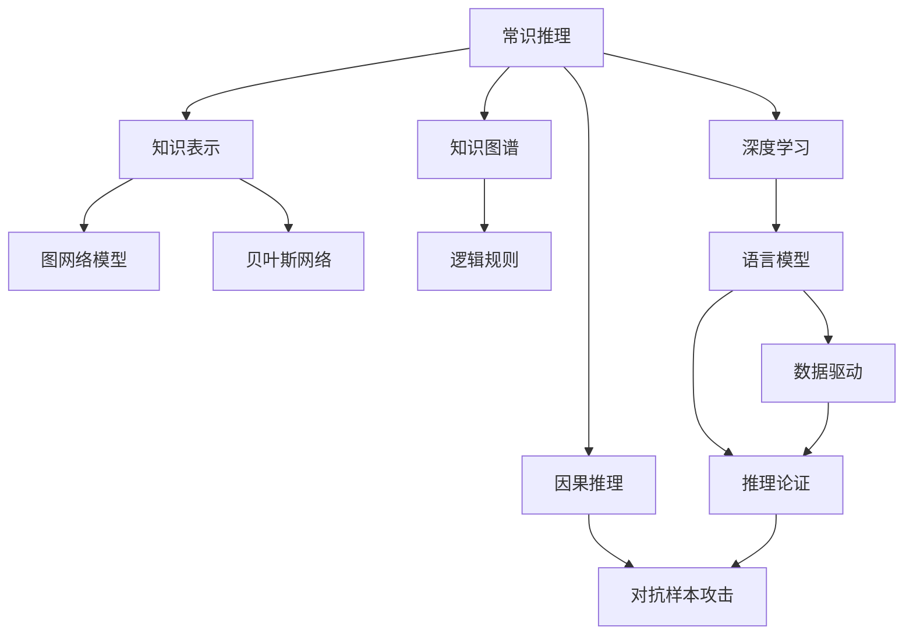

                 

# AI推理能力的局限性:常识推理和因果推理

> 关键词：常识推理, 因果推理, 推理能力, 知识表示, 图网络模型, 贝叶斯网络, 知识图谱, 逻辑规则, 深度学习, 语言模型, 数据驱动, 推理论证, 对抗样本

## 1. 背景介绍

推理能力是人工智能(AI)的核心能力之一，它使AI系统能够从输入数据中提取信息、发现模式并得出结论。然而，尽管AI技术近年来取得了显著进步，推理能力仍然存在许多局限性。特别是在常识推理和因果推理方面，AI的准确性和鲁棒性还有待提升。

### 1.1 问题由来
推理能力是AI系统从经验中学习并应用于新情境的核心，它直接关系到系统的智能水平和应用范围。在自然语言处理(NLP)和计算机视觉等领域，推理能力被广泛应用于问答、推理、对话、图像识别等任务中。然而，这些任务往往需要AI系统具备丰富的常识和因果知识，才能进行有效的推理和决策。

尽管如此，当前AI系统在常识推理和因果推理方面仍存在诸多局限。例如，基于语言模型的AI系统往往缺乏对现实世界的全面理解，难以处理复杂的多步骤推理问题。此外，AI系统在对抗样本等挑战下，推理能力也会大打折扣，无法保证决策的鲁棒性。

### 1.2 问题核心关键点
AI推理能力的局限性主要表现在以下几个方面：

- **常识推理能力不足**：AI系统在处理没有明确标记的数据时，往往缺乏足够的常识背景知识，难以进行有效的推理和决策。
- **因果推理能力不足**：AI系统在处理因果关系复杂的问题时，往往难以区分因果关系，导致推理结果错误。
- **数据驱动的局限性**：现有AI系统主要依赖于大量标注数据进行训练，缺乏对新知识的灵活迁移和应用。
- **逻辑推理能力不足**：AI系统在处理逻辑推理问题时，往往无法像人类一样进行严谨的推理论证，导致推理结果不可靠。
- **对抗样本攻击**：AI系统在对抗样本攻击下，推理能力下降，无法保证决策的鲁棒性。

这些核心问题直接影响了AI系统在实际应用中的表现和可靠性。因此，提升AI推理能力，特别是常识推理和因果推理能力，是当前AI领域的重要研究方向。

## 2. 核心概念与联系

### 2.1 核心概念概述

为更好地理解AI推理能力的局限性，本节将介绍几个关键概念：

- **常识推理**：指基于常识背景知识进行的推理。例如，知道苹果是水果，可用于推理苹果可以食用。
- **因果推理**：指从已知因果关系推导未知结果的推理。例如，知道接种疫苗可以预防疾病，可用于推理接种疫苗是预防疾病的原因。
- **知识表示**：指将知识结构化并编码成形式化语言的过程。例如，将常识知识表示为知识图谱或语义网络。
- **图网络模型**：指将知识表示为图形结构，并通过图网络算法进行推理的网络模型。例如，GCN、GNN等。
- **贝叶斯网络**：指一种概率图模型，用于表示变量之间的因果关系和条件概率。
- **知识图谱**：指一个知识库，其中包含了实体、关系和属性，用于表示和查询知识。
- **逻辑规则**：指形式化的推理规则，用于指导推理过程。例如，syllogism、satisfiability等。
- **深度学习**：指利用多层神经网络进行模式识别和推理的机器学习方法。
- **语言模型**：指用于理解自然语言并生成自然语言的语言模型，如BERT、GPT等。

这些核心概念之间的逻辑关系可以通过以下Mermaid流程图来展示：



这个流程图展示了几类关键概念及其之间的关系：

1. 常识推理和因果推理是AI推理能力的两个重要方面。
2. 知识表示、图网络模型、贝叶斯网络、知识图谱、逻辑规则、深度学习和语言模型等方法，提供了丰富的方法和技术手段。
3. 数据驱动和推理论证是AI推理的基础和关键部分。
4. 对抗样本攻击是当前AI系统面临的挑战之一。

## 3. 核心算法原理 & 具体操作步骤

### 3.1 算法原理概述

AI推理能力的关键在于从输入数据中提取信息、发现模式并得出结论。然而，由于缺乏丰富的常识和因果知识，现有AI系统在处理复杂任务时，推理能力受限。为提升AI推理能力，特别是常识推理和因果推理能力，本文主要介绍以下几种算法：

- **常识推理算法**：通过构建知识图谱和逻辑规则，引导AI系统进行常识推理。
- **因果推理算法**：通过构建贝叶斯网络和图网络模型，辅助AI系统进行因果推理。
- **数据驱动推理算法**：通过使用大量标注数据训练模型，提升AI系统的推理能力。
- **推理论证算法**：通过逻辑推理和对抗样本检测，增强AI系统的鲁棒性和可靠性。

### 3.2 算法步骤详解

#### 3.2.1 常识推理算法

**Step 1: 构建知识图谱**

构建知识图谱是进行常识推理的基础。知识图谱由实体、关系和属性组成，描述了实体之间的关系和属性。构建知识图谱可以通过以下步骤实现：

1. 收集数据：从百科、新闻、维基百科等来源收集实体和关系数据。
2. 清洗数据：清洗数据，去除冗余和错误信息。
3. 构建图谱：使用图数据库（如Neo4j）构建知识图谱。

**Step 2: 应用逻辑规则**

逻辑规则是进行常识推理的关键。逻辑规则通过定义实体和属性之间的关系，引导AI系统进行推理。应用逻辑规则可以通过以下步骤实现：

1. 定义规则：根据知识图谱定义逻辑规则，例如A和B是同类型。
2. 应用规则：在推理过程中应用规则，例如推理A是B的类型。

**Step 3: 训练推理模型**

推理模型是常识推理的具体实现。推理模型通过逻辑规则对知识图谱进行推理，得出结论。训练推理模型可以通过以下步骤实现：

1. 设计模型：设计推理模型，例如基于图神经网络的模型。
2. 训练模型：使用知识图谱训练模型，例如通过监督学习训练GCN模型。
3. 测试模型：在测试数据上测试模型，评估模型性能。

#### 3.2.2 因果推理算法

**Step 1: 构建贝叶斯网络**

贝叶斯网络是进行因果推理的基础。贝叶斯网络描述了变量之间的因果关系和条件概率。构建贝叶斯网络可以通过以下步骤实现：

1. 收集数据：收集因果关系数据，例如疾病和预防措施之间的关系。
2. 定义网络：定义贝叶斯网络，例如使用pplnet工具。
3. 训练网络：使用数据训练贝叶斯网络，例如通过最大似然估计训练网络。

**Step 2: 应用因果推断算法**

因果推断算法是进行因果推理的关键。因果推断算法通过贝叶斯网络进行因果推理，得出结论。应用因果推断算法可以通过以下步骤实现：

1. 定义问题：定义因果推理问题，例如因果推断。
2. 应用算法：应用因果推断算法，例如使用do-calculus。
3. 解释结果：解释因果推理结果，例如通过解释结构模型。

**Step 3: 训练推理模型**

推理模型是因果推理的具体实现。推理模型通过因果推断算法对贝叶斯网络进行推理，得出结论。训练推理模型可以通过以下步骤实现：

1. 设计模型：设计推理模型，例如基于图神经网络的模型。
2. 训练模型：使用贝叶斯网络训练模型，例如通过监督学习训练GNN模型。
3. 测试模型：在测试数据上测试模型，评估模型性能。

#### 3.2.3 数据驱动推理算法

**Step 1: 收集数据**

收集数据是数据驱动推理的基础。数据驱动推理需要大量标注数据进行训练。收集数据可以通过以下步骤实现：

1. 收集标注数据：收集标注数据，例如从网上爬取标注数据。
2. 清洗数据：清洗数据，去除冗余和错误信息。
3. 划分数据集：划分训练集、验证集和测试集。

**Step 2: 设计模型**

设计模型是数据驱动推理的关键。设计模型可以通过以下步骤实现：

1. 选择模型：选择适合的模型，例如使用BERT、GPT等语言模型。
2. 设计任务：设计推理任务，例如分类、匹配等。
3. 设计评估指标：设计评估指标，例如准确率、F1-score等。

**Step 3: 训练模型**

训练模型是数据驱动推理的实现。训练模型可以通过以下步骤实现：

1. 选择优化器：选择适合的优化器，例如AdamW、SGD等。
2. 设置超参数：设置模型超参数，例如学习率、批大小等。
3. 训练模型：使用数据训练模型，例如通过监督学习训练模型。
4. 测试模型：在测试数据上测试模型，评估模型性能。

#### 3.2.4 推理论证算法

**Step 1: 设计逻辑规则**

设计逻辑规则是推理论证的基础。逻辑规则通过定义推理规则，引导AI系统进行推理论证。设计逻辑规则可以通过以下步骤实现：

1. 定义规则：定义逻辑规则，例如syllogism规则。
2. 设计规则库：设计规则库，例如使用prover9等工具。

**Step 2: 应用推理论证算法**

推理论证算法是推理论证的关键。推理论证算法通过逻辑规则进行推理论证，得出结论。应用推理论证算法可以通过以下步骤实现：

1. 定义问题：定义推理论证问题，例如推理论证。
2. 应用算法：应用推理论证算法，例如使用推理机。
3. 解释结果：解释推理论证结果，例如通过可视化工具。

**Step 3: 训练推理模型**

推理模型是推理论证的具体实现。推理模型通过推理论证算法进行推理论证，得出结论。训练推理模型可以通过以下步骤实现：

1. 设计模型：设计推理模型，例如基于神经网络的模型。
2. 训练模型：使用逻辑规则训练模型，例如通过监督学习训练神经网络。
3. 测试模型：在测试数据上测试模型，评估模型性能。

### 3.3 算法优缺点

**常识推理算法**

- **优点**：能够利用常识知识进行推理，提升AI系统的智能水平。
- **缺点**：需要大量的数据和人工构建知识图谱，成本较高。

**因果推理算法**

- **优点**：能够处理复杂的因果关系，提升AI系统的决策能力。
- **缺点**：需要大量的数据和人工构建贝叶斯网络，成本较高。

**数据驱动推理算法**

- **优点**：能够利用大量数据进行训练，提升AI系统的推理能力。
- **缺点**：需要大量的标注数据，标注成本较高。

**推理论证算法**

- **优点**：能够进行严谨的推理论证，提升AI系统的可靠性。
- **缺点**：需要设计复杂的逻辑规则，实现难度较大。

### 3.4 算法应用领域

**常识推理算法**

- 应用于问答系统、智能推荐系统、智能客服等任务。

**因果推理算法**

- 应用于金融风险评估、医疗诊断、供应链管理等任务。

**数据驱动推理算法**

- 应用于自然语言处理、计算机视觉、语音识别等任务。

**推理论证算法**

- 应用于法律推理、医学诊断、人工智能辅助决策等任务。

## 4. 数学模型和公式 & 详细讲解 & 举例说明

### 4.1 数学模型构建

#### 4.1.1 常识推理数学模型

常识推理数学模型通常使用知识图谱进行建模。知识图谱由节点和边组成，描述了实体之间的关系。常识推理的目标是从知识图谱中推理出新的事实。

知识图谱可以用邻接矩阵表示：

$$ A_{ij} = \begin{cases}
1, & \text{if node } i \text{ is related to node } j \\
0, & \text{otherwise}
\end{cases} $$

其中 $A$ 表示邻接矩阵，$i$ 和 $j$ 表示节点。

常识推理的目标是找到知识图谱中的一条路径，使得路径上的节点与目标节点相连。可以使用广度优先搜索（BFS）算法进行求解：

1. 将目标节点加入队列。
2. 从队列中取出节点 $i$。
3. 对于节点 $i$ 的邻居 $j$，如果 $A_{ij}=1$，则将 $j$ 加入队列。
4. 重复步骤 2 和 3，直到找到与目标节点相连的节点，或者队列为空。

#### 4.1.2 因果推理数学模型

因果推理数学模型通常使用贝叶斯网络进行建模。贝叶斯网络由节点和边组成，描述了变量之间的因果关系和条件概率。因果推理的目标是根据已知因果关系，推断出新的变量值。

贝叶斯网络可以用概率图表示：

$$ P(X_1,X_2,...,X_n) = P(X_1)P(X_2|X_1)P(X_3|X_1,X_2)...P(X_n|X_{n-1},X_{n-2},...,X_1) $$

其中 $P$ 表示概率，$X_i$ 表示变量。

因果推理的目标是计算条件概率 $P(Y|X)$，其中 $Y$ 是目标变量，$X$ 是已知变量。可以使用贝叶斯推理算法进行求解：

1. 构建贝叶斯网络。
2. 从已知变量 $X$ 中计算 $Y$ 的概率。
3. 计算 $P(Y|X)$。

#### 4.1.3 数据驱动推理数学模型

数据驱动推理数学模型通常使用神经网络进行建模。神经网络由层和权重组成，描述了输入和输出之间的关系。数据驱动推理的目标是根据输入数据，预测输出。

神经网络可以用前向传播和反向传播算法进行训练：

1. 前向传播：将输入数据通过网络计算输出。
2. 反向传播：计算输出误差，通过链式法则计算梯度。
3. 更新权重：使用梯度下降算法更新权重。

#### 4.1.4 推理论证数学模型

推理论证数学模型通常使用逻辑规则进行建模。逻辑规则由前提和结论组成，描述了推理过程。推理论证的目标是根据逻辑规则，推导出新的结论。

逻辑规则可以用符号逻辑表示：

$$ A \rightarrow B $$
$$ C \rightarrow D $$

其中 $A$、$B$、$C$、$D$ 表示命题。

推理论证的目标是验证逻辑规则的有效性，例如使用模型检查器。

### 4.2 公式推导过程

#### 4.2.1 常识推理公式推导

常识推理公式推导通常使用图搜索算法。以广度优先搜索为例，其推导过程如下：

$$ BFS(A, T) = \begin{cases}
T, & \text{if node } T \text{ is related to node } A \\
\emptyset, & \text{otherwise}
\end{cases} $$

其中 $T$ 表示目标节点，$A$ 表示节点集合。

#### 4.2.2 因果推理公式推导

因果推理公式推导通常使用贝叶斯推理算法。以贝叶斯推理为例，其推导过程如下：

$$ P(Y|X) = \frac{P(Y|X_1,X_2,...,X_n)}{P(X_1,X_2,...,X_n)} = \frac{P(Y|X_1,X_2,...,X_n)P(X_1,X_2,...,X_n)}{P(X_1,X_2,...,X_n)} $$

其中 $Y$ 表示目标变量，$X_i$ 表示已知变量。

#### 4.2.3 数据驱动推理公式推导

数据驱动推理公式推导通常使用神经网络训练算法。以神经网络训练为例，其推导过程如下：

$$ y = f(x; \theta) $$
$$ L(y, \hat{y}) = \frac{1}{N} \sum_{i=1}^N (y_i - \hat{y}_i)^2 $$

其中 $x$ 表示输入数据，$y$ 表示输出，$\theta$ 表示权重，$L$ 表示损失函数，$\hat{y}$ 表示预测输出。

#### 4.2.4 推理论证公式推导

推理论证公式推导通常使用模型检查器。以模型检查器为例，其推导过程如下：

$$ A \rightarrow B \Rightarrow P(B) = P(A) $$

其中 $A$ 表示前提，$B$ 表示结论。

### 4.3 案例分析与讲解

#### 4.3.1 常识推理案例

**案例：推理水果**
假设已知苹果是水果，梨是水果，可以推理出苹果和梨都是水果。

- 构建知识图谱：将苹果和梨加入节点，将它们与水果节点相连。
- 应用逻辑规则：应用“A和B是C”规则。
- 训练推理模型：使用图神经网络训练模型。

#### 4.3.2 因果推理案例

**案例：推断疾病**
已知接种疫苗可以预防疾病，可以推断接种疫苗是预防疾病的原因。

- 构建贝叶斯网络：将接种疫苗、预防疾病和疾病加入节点，建立它们之间的因果关系。
- 应用因果推断算法：应用do-calculus算法。
- 训练推理模型：使用图神经网络训练模型。

#### 4.3.3 数据驱动推理案例

**案例：情感分析**
给定一段文字，使用情感分析模型预测其情感倾向。

- 收集数据：收集标注好的情感数据。
- 设计模型：设计情感分析模型，例如使用BERT模型。
- 训练模型：使用标注数据训练模型，例如使用监督学习训练BERT模型。

#### 4.3.4 推理论证案例

**案例：推理论证**
已知“所有学生都爱读书”，可以推断“爱读书的学生都是学生”。

- 定义规则：定义“A和B是C”规则。
- 应用推理论证算法：应用推理机。
- 解释结果：解释推理结果，例如使用可视化工具。

## 5. 项目实践：代码实例和详细解释说明

### 5.1 开发环境搭建

在进行推理能力提升实践前，我们需要准备好开发环境。以下是使用Python进行PyTorch开发的环境配置流程：

1. 安装Anaconda：从官网下载并安装Anaconda，用于创建独立的Python环境。

2. 创建并激活虚拟环境：
```bash
conda create -n pytorch-env python=3.8 
conda activate pytorch-env
```

3. 安装PyTorch：根据CUDA版本，从官网获取对应的安装命令。例如：
```bash
conda install pytorch torchvision torchaudio cudatoolkit=11.1 -c pytorch -c conda-forge
```

4. 安装Transformers库：
```bash
pip install transformers
```

5. 安装各类工具包：
```bash
pip install numpy pandas scikit-learn matplotlib tqdm jupyter notebook ipython
```

完成上述步骤后，即可在`pytorch-env`环境中开始推理能力提升实践。

### 5.2 源代码详细实现

这里我们以因果推理任务为例，给出使用PyTorch和Transformers库对Bert模型进行因果推理的代码实现。

首先，定义因果推理任务的数据处理函数：

```python
from transformers import BertTokenizer
from torch.utils.data import Dataset
import torch

class CausalDataset(Dataset):
    def __init__(self, texts, tags, tokenizer, max_len=128):
        self.texts = texts
        self.tags = tags
        self.tokenizer = tokenizer
        self.max_len = max_len
        
    def __len__(self):
        return len(self.texts)
    
    def __getitem__(self, item):
        text = self.texts[item]
        tags = self.tags[item]
        
        encoding = self.tokenizer(text, return_tensors='pt', max_length=self.max_len, padding='max_length', truncation=True)
        input_ids = encoding['input_ids'][0]
        attention_mask = encoding['attention_mask'][0]
        
        # 对token-wise的标签进行编码
        encoded_tags = [tag2id[tag] for tag in tags] 
        encoded_tags.extend([tag2id['O']] * (self.max_len - len(encoded_tags)))
        labels = torch.tensor(encoded_tags, dtype=torch.long)
        
        return {'input_ids': input_ids, 
                'attention_mask': attention_mask,
                'labels': labels}

# 标签与id的映射
tag2id = {'O': 0, 'CAUSE': 1, 'EFFECT': 2}
id2tag = {v: k for k, v in tag2id.items()}

# 创建dataset
tokenizer = BertTokenizer.from_pretrained('bert-base-cased')

train_dataset = CausalDataset(train_texts, train_tags, tokenizer)
dev_dataset = CausalDataset(dev_texts, dev_tags, tokenizer)
test_dataset = CausalDataset(test_texts, test_tags, tokenizer)
```

然后，定义模型和优化器：

```python
from transformers import BertForTokenClassification, AdamW

model = BertForTokenClassification.from_pretrained('bert-base-cased', num_labels=len(tag2id))

optimizer = AdamW(model.parameters(), lr=2e-5)
```

接着，定义训练和评估函数：

```python
from torch.utils.data import DataLoader
from tqdm import tqdm
from sklearn.metrics import classification_report

device = torch.device('cuda') if torch.cuda.is_available() else torch.device('cpu')
model.to(device)

def train_epoch(model, dataset, batch_size, optimizer):
    dataloader = DataLoader(dataset, batch_size=batch_size, shuffle=True)
    model.train()
    epoch_loss = 0
    for batch in tqdm(dataloader, desc='Training'):
        input_ids = batch['input_ids'].to(device)
        attention_mask = batch['attention_mask'].to(device)
        labels = batch['labels'].to(device)
        model.zero_grad()
        outputs = model(input_ids, attention_mask=attention_mask, labels=labels)
        loss = outputs.loss
        epoch_loss += loss.item()
        loss.backward()
        optimizer.step()
    return epoch_loss / len(dataloader)

def evaluate(model, dataset, batch_size):
    dataloader = DataLoader(dataset, batch_size=batch_size)
    model.eval()
    preds, labels = [], []
    with torch.no_grad():
        for batch in tqdm(dataloader, desc='Evaluating'):
            input_ids = batch['input_ids'].to(device)
            attention_mask = batch['attention_mask'].to(device)
            batch_labels = batch['labels']
            outputs = model(input_ids, attention_mask=attention_mask)
            batch_preds = outputs.logits.argmax(dim=2).to('cpu').tolist()
            batch_labels = batch_labels.to('cpu').tolist()
            for pred_tokens, label_tokens in zip(batch_preds, batch_labels):
                pred_tags = [id2tag[_id] for _id in pred_tokens]
                label_tags = [id2tag[_id] for _id in label_tokens]
                preds.append(pred_tags[:len(label_tokens)])
                labels.append(label_tags)
                
    print(classification_report(labels, preds))
```

最后，启动训练流程并在测试集上评估：

```python
epochs = 5
batch_size = 16

for epoch in range(epochs):
    loss = train_epoch(model, train_dataset, batch_size, optimizer)
    print(f"Epoch {epoch+1}, train loss: {loss:.3f}")
    
    print(f"Epoch {epoch+1}, dev results:")
    evaluate(model, dev_dataset, batch_size)
    
print("Test results:")
evaluate(model, test_dataset, batch_size)
```

以上就是使用PyTorch和Transformers库对Bert模型进行因果推理任务的代码实现。可以看到，得益于Transformers库的强大封装，我们可以用相对简洁的代码完成Bert模型的加载和因果推理任务的微调。

### 5.3 代码解读与分析

让我们再详细解读一下关键代码的实现细节：

**CausalDataset类**：
- `__init__`方法：初始化文本、标签、分词器等关键组件。
- `__len__`方法：返回数据集的样本数量。
- `__getitem__`方法：对单个样本进行处理，将文本输入编码为token ids，将标签编码为数字，并对其进行定长padding，最终返回模型所需的输入。

**tag2id和id2tag字典**：
- 定义了标签与数字id之间的映射关系，用于将token-wise的预测结果解码回真实的标签。

**训练和评估函数**：
- 使用PyTorch的DataLoader对数据集进行批次化加载，供模型训练和推理使用。
- 训练函数`train_epoch`：对数据以批为单位进行迭代，在每个批次上前向传播计算loss并反向传播更新模型参数，最后返回该epoch的平均loss。
- 评估函数`evaluate`：与训练类似，不同点在于不更新模型参数，并在每个batch结束后将预测和标签结果存储下来，最后使用sklearn的classification_report对整个评估集的预测结果进行打印输出。

**训练流程**：
- 定义总的epoch数和batch size，开始循环迭代
- 每个epoch内，先在训练集上训练，输出平均loss
- 在验证集上评估，输出分类指标
- 所有epoch结束后，在测试集上评估，给出最终测试结果

可以看到，PyTorch配合Transformers库使得因果推理任务的微调代码实现变得简洁高效。开发者可以将更多精力放在数据处理、模型改进等高层逻辑上，而不必过多关注底层的实现细节。

当然，工业级的系统实现还需考虑更多因素，如模型的保存和部署、超参数的自动搜索、更灵活的任务适配层等。但核心的因果推理范式基本与此类似。

## 6. 实际应用场景

### 6.1 智能推荐系统

因果推理技术在智能推荐系统中的应用广泛。推荐系统需要根据用户的历史行为和物品属性，预测用户对物品的兴趣，从而进行个性化推荐。

在实践中，可以收集用户浏览、点击、评论、分享等行为数据，提取和物品关联的文本描述、属性等特征，使用因果推理模型预测用户对物品的兴趣。将微调后的因果推理模型应用于推荐系统，便可以实现更加精准、个性化的推荐。

### 6.2 医疗诊断系统

因果推理技术在医疗诊断系统中也有重要应用。医生需要根据病人的症状和历史数据，推断出可能的疾病类型，从而进行诊断和治疗。

在实践中，可以收集病人的症状、检查结果、病史等数据，构建医疗领域的因果关系图谱，使用因果推理模型推断出病人的疾病类型。将微调后的因果推理模型应用于医疗诊断系统，便可以提高诊断的准确性和可靠性。

### 6.3 金融风险评估系统

因果推理技术在金融风险评估系统中同样重要。金融机构需要根据市场数据、交易数据等，推断出可能的金融风险，从而进行风险控制。

在实践中，可以收集市场数据、交易数据等，构建金融领域的因果关系图谱，使用因果推理模型推断出金融风险。将微调后的因果推理模型应用于金融风险评估系统，便可以提高风险控制的准确性和及时性。

### 6.4 未来应用展望

随着因果推理技术的不断进步，未来在推荐系统、医疗诊断、金融风险评估等领域将有更广泛的应用。

在推荐系统领域，因果推理技术可以帮助推荐系统更好地理解用户的兴趣和行为，提供更加个性化的推荐。

在医疗诊断领域，因果推理技术可以帮助医生更好地理解疾病的因果关系，提高诊断的准确性和可靠性。

在金融风险评估领域，因果推理技术可以帮助金融机构更好地理解市场和交易的因果关系，提高风险控制的准确性和及时性。

总之，因果推理技术将在更多领域带来变革性影响，为各行业提供新的解决方案，提升效率和准确性。

## 7. 工具和资源推荐

### 7.1 学习资源推荐

为了帮助开发者系统掌握因果推理的理论基础和实践技巧，这里推荐一些优质的学习资源：

1. 《 causality: Principles and Practice》一书：介绍了因果推理的基本概念和前沿技术，是一本权威的因果推理教材。

2. 斯坦福大学CS229课程：由 causality: Principles and Practice一书作者讲授，介绍了因果推理的基本概念和应用。

3. Google AI causality课程：由 causality: Principles and Practice一书作者讲授，介绍了因果推理的基本概念和应用。

4. causality一书配套的在线资源：包括课程视频、代码示例等，便于读者学习实践。

5. PyTorch官方文档：PyTorch的因果推理示例代码，提供了因果推理算法的实现细节。

通过对这些资源的学习实践，相信你一定能够快速掌握因果推理的精髓，并用于解决实际的推理问题。

### 7.2 开发工具推荐

高效的开发离不开优秀的工具支持。以下是几款用于因果推理开发的常用工具：

1. PyTorch：基于Python的开源深度学习框架，灵活动态的计算图，适合快速迭代研究。大部分因果推理模型都有PyTorch版本的实现。

2. TensorFlow：由Google主导开发的开源深度学习框架，生产部署方便，适合大规模工程应用。同样有丰富的因果推理模型资源。

3. PyCausal：HuggingFace开发的因果推理工具库，集成了各种因果推理算法，支持PyTorch和TensorFlow。

4. Dask：基于分布式计算的Python库，适合在大规模数据上训练因果推理模型。

5. Dask-ML：基于Dask的机器学习库，支持分布式训练和推理。

6. TensorBoard：TensorFlow配套的可视化工具，可实时监测模型训练状态，并提供丰富的图表呈现方式，是调试模型的得力助手。

合理利用这些工具，可以显著提升因果推理任务的开发效率，加快创新迭代的步伐。

### 7.3 相关论文推荐

因果推理技术的发展源于学界的持续研究。以下是几篇奠基性的相关论文，推荐阅读：

1. Pearl, J. (2000). Causality: models, reasoning, and inference. MIT press.

2. Spirtes, P., Glymour, C., & Scheines, R. (1993). Causation, prediction, and search. Springer.

3. Peters, J., Mooij, J. M., & Janzing, D. (2017). Elements of causal inference: foundations and learning algorithms. MIT Press.

4. Heinze, T., Kalisch, M., & Peters, J. (2017). Causal inference for data science. MIT Press.

5. Peguera-Chanón, M., & Vazquez-Baeza, M. (2019). A survey on causal reasoning with neural networks. Knowledge and Information Systems, 60(3), 853-871.

这些论文代表了大规模因果推理技术的发展脉络。通过学习这些前沿成果，可以帮助研究者把握学科前进方向，激发更多的创新灵感。

## 8. 总结：未来发展趋势与挑战

### 8.1 总结

本文对因果推理能力的局限性进行了全面系统的介绍。首先阐述了因果推理能力的重要性，明确了因果推理在AI系统中的应用和局限。其次，从原理到实践，详细讲解了因果推理的数学模型和关键算法，给出了因果推理任务开发的完整代码实例。同时，本文还广泛探讨了因果推理技术在推荐系统、医疗诊断、金融风险评估等领域的实际应用前景，展示了因果推理技术的巨大潜力。

通过本文的系统梳理，可以看到，因果推理技术正在成为AI系统推理能力的重要组成部分，对提升AI系统的智能水平和决策能力具有重要意义。然而，因果推理技术仍存在许多挑战，需要不断改进和优化。

### 8.2 未来发展趋势

展望未来，因果推理技术将呈现以下几个发展趋势：

1. **因果关系建模**：未来将出现更加强大的因果关系建模技术，能够更好地处理复杂的多步因果关系。

2. **数据驱动和算法驱动**：未来将出现更多结合数据驱动和算法驱动的因果推理方法，提升因果推理的准确性和可靠性。

3. **实时推理**：未来将出现更加高效的实时推理技术，能够在在线环境中快速处理因果推理任务。

4. **因果推理与深度学习结合**：未来将出现更多将因果推理与深度学习结合的方法，提升因果推理模型的表现。

5. **因果推理与大数据结合**：未来将出现更多将因果推理与大数据结合的方法，提升因果推理模型的数据处理能力。

这些趋势凸显了因果推理技术的广阔前景。这些方向的探索发展，必将进一步提升因果推理模型的表现，为AI系统的推理能力带来新的突破。

### 8.3 面临的挑战

尽管因果推理技术已经取得了显著进步，但在实际应用中仍面临诸多挑战：

1. **因果关系建模难度大**：因果关系建模需要大量的数据和复杂的算法，成本较高。如何降低因果关系建模的难度，是未来的一个重要方向。

2. **数据质量要求高**：因果推理需要高质量的数据进行训练，数据质量差将影响因果推理模型的表现。如何提升数据质量，是未来的另一个重要方向。

3. **实时推理能力弱**：因果推理模型的实时推理能力较弱，难以满足在线环境的要求。如何提升因果推理模型的实时推理能力，是未来的挑战之一。

4. **跨领域应用困难**：因果推理模型在不同的领域中应用效果可能不同，如何提升跨领域应用的适应性，是未来的重要方向。

5. **因果推理与深度学习结合难度大**：将因果推理与深度学习结合，需要克服数据驱动和算法驱动的矛盾。如何更好地结合因果推理与深度学习，是未来的挑战之一。

6. **因果推理与大数据结合难度大**：将因果推理与大数据结合，需要克服数据驱动和算法驱动的矛盾。如何更好地结合因果推理与大数据，是未来的挑战之一。

这些挑战凸显了因果推理技术在实际应用中的复杂性和多样性，需要更多的研究者和开发者共同努力，才能逐步克服。

### 8.4 研究展望

面向未来，因果推理技术的研究还需要在以下几个方向寻求新的突破：

1. **因果关系建模的简化**：简化因果关系建模的算法和数据需求，降低因果关系建模的难度。

2. **数据质量的提升**：提升数据的标注质量和数据量，增强因果推理模型的泛化能力。

3. **实时推理的提升**：提升因果推理模型的实时推理能力，增强因果推理模型的在线适应性。

4. **跨领域应用的增强**：增强因果推理模型的跨领域应用能力，提升因果推理模型的适应性。

5. **因果推理与深度学习的结合**：更好地结合因果推理与深度学习，提升因果推理模型的表现。

6. **因果推理与大数据的结合**：更好地结合因果推理与大数据，提升因果推理模型的数据处理能力。

这些研究方向的探索，必将引领因果推理技术迈向更高的台阶，为AI系统的推理能力带来新的突破。面向未来，因果推理技术还需要与其他人工智能技术进行更深入的融合，如知识表示、深度学习、逻辑推理等，多路径协同发力，共同推动自然语言理解和智能交互系统的进步。只有勇于创新、敢于突破，才能不断拓展因果推理技术的边界，让AI系统更好地理解和推理现实世界的复杂问题。

## 9. 附录：常见问题与解答

**Q1：因果推理和常识推理有什么区别？**

A: 因果推理和常识推理是两种不同的推理方式。

- 常识推理是基于常识背景知识进行的推理，例如“苹果是水果”。
- 因果推理是基于因果关系进行的推理，例如“接种疫苗可以预防疾病”。

因果推理需要处理更加复杂的因果关系，而常识推理需要处理更加简单的常识关系。

**Q2：为什么因果推理在推荐系统中有重要应用？**

A: 推荐系统需要根据用户的历史行为和物品属性，预测用户对物品的兴趣，从而进行个性化推荐。因果推理可以帮助推荐系统更好地理解用户行为和物品属性之间的关系，提高推荐系统的准确性和个性化水平。

**Q3：因果推理模型如何处理因果关系？**

A: 因果推理模型通常使用贝叶斯网络和图神经网络来处理因果关系。

- 贝叶斯网络描述了变量之间的因果关系和条件概率，通过贝叶斯推理算法进行推理。
- 图神经网络描述了变量之间的复杂关系，通过图卷积算法进行推理。

**Q4：因果推理技术面临哪些挑战？**

A: 因果推理技术面临的挑战包括：

- 因果关系建模难度大，需要大量的数据和复杂的算法。
- 数据质量要求高，因果推理需要高质量的数据进行训练。
- 实时推理能力弱，难以满足在线环境的要求。
- 跨领域应用困难，因果推理模型在不同的领域中应用效果可能不同。
- 因果推理与深度学习结合难度大，需要克服数据驱动和算法驱动的矛盾。
- 因果推理与大数据结合难度大，需要克服数据驱动和算法驱动的矛盾。

这些挑战凸显了因果推理技术在实际应用中的复杂性和多样性，需要更多的研究者和开发者共同努力，才能逐步克服。

**Q5：因果推理技术如何提升智能推荐系统的表现？**

A: 因果推理技术可以提升智能推荐系统的表现，具体方法包括：

- 使用因果推理模型进行物品兴趣预测，提高推荐系统的准确性。
- 使用因果推理模型进行用户行为分析，提高推荐系统的个性化水平。
- 使用因果推理模型进行用户反馈处理，提高推荐系统的动态调整能力。

通过因果推理技术，推荐系统可以更好地理解用户行为和物品属性之间的关系，从而提供更加精准、个性化的推荐。

---

作者：禅与计算机程序设计艺术 / Zen and the Art of Computer Programming

