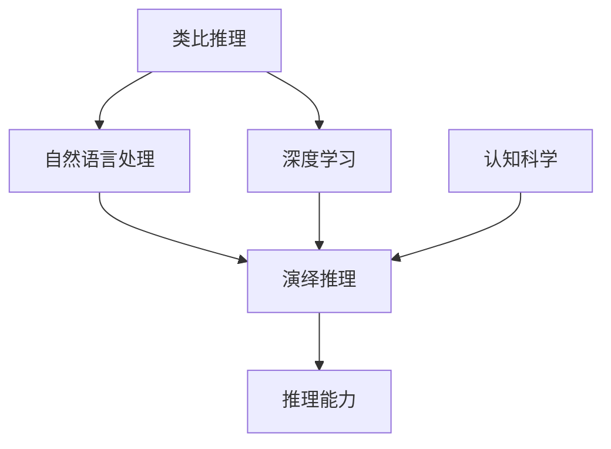

                 

# AI推理能力的认知启示:类比推理和演绎推理

> 关键词：AI推理能力, 类比推理, 演绎推理, 认知启示, 深度学习, 认知科学

## 1. 背景介绍

### 1.1 问题由来
人工智能(AI)在过去几十年间取得了飞速发展，尤其是深度学习技术的突破，使得AI在图像识别、自然语言处理等领域取得了前所未有的成果。然而，真正让人工智能在实际应用中发挥其潜力，还需要其具备强大的推理能力。推理能力不仅能够让AI处理复杂任务，还能赋予其创造性和灵活性，从而推动AI在更多领域的发展。类比推理和演绎推理作为人工智能推理能力的两种基本形式，对AI系统整体性能的影响至关重要。本文将深入探讨这两种推理形式的原理和实现，并提出相关认知启示。

### 1.2 问题核心关键点
类比推理和演绎推理是人工智能系统实现复杂推理任务的两种基本形式。类比推理利用已有的知识去解释新的情况，通过相似性推断出可能的结果；而演绎推理则是基于已有知识直接推导出结论，具有逻辑性和严格性。这两种推理形式在深度学习中都有广泛应用，特别是在自然语言处理(NLP)、计算机视觉等领域。本文将详细解析这两种推理形式的原理和实现过程，同时分析其在AI系统中的作用和应用场景。

### 1.3 问题研究意义
理解和掌握类比推理和演绎推理的原理和实现方法，对于提高人工智能系统的推理能力具有重要意义。这不仅能够提升AI系统的应用广度和深度，还能够推动AI在更多领域实现智能化。例如，在医疗诊断、法律咨询、金融分析等场景中，推理能力能够显著提高AI系统的准确性和可靠性，为用户提供更优质的服务。此外，深入研究这两种推理形式，还能为认知科学提供新的理论支撑，促进人机协同发展和智能系统的普及应用。

## 2. 核心概念与联系

### 2.1 核心概念概述

为了更好地理解类比推理和演绎推理，本节将介绍几个密切相关的核心概念：

- 类比推理(Analogical Reasoning)：通过已有的知识或经验，将相似的情况进行比较，推断出新情况的可能结果。
- 演绎推理(Deductive Reasoning)：基于已有的逻辑规则和知识，通过推理得出必然的结论。
- 自然语言处理(NLP)：使计算机能够理解、解释和生成人类语言的技术，涵盖了文本处理、语音识别、机器翻译等多个方面。
- 深度学习(Deep Learning)：一种利用多层神经网络模拟人脑神经网络结构，进行复杂模式识别的机器学习技术。
- 认知科学(Cognitive Science)：研究人类认知过程和智能机制的学科，涵盖心理学、神经科学、计算机科学等多个领域。
- 推理能力(Inference)：AI系统根据已知信息和逻辑规则，推导出未知信息或结论的能力。

这些概念之间的逻辑关系可以通过以下Mermaid流程图来展示：



这个流程图展示了大语言模型中类比推理和演绎推理的核心概念及其之间的关系：

1. 类比推理和演绎推理通过自然语言处理技术应用于深度学习中，形成了推理能力的基础。
2. 类比推理和演绎推理在深度学习中相辅相成，共同构成完整的推理体系。
3. 认知科学的研究成果为类比推理和演绎推理提供了理论支撑，推动了AI系统的智能化发展。

## 3. 核心算法原理 & 具体操作步骤
### 3.1 算法原理概述

类比推理和演绎推理在深度学习中的实现，主要是通过构建特定的神经网络结构和损失函数，利用大量标注数据进行训练，最终使得模型能够进行有效的推理。

#### 3.1.1 类比推理原理概述
类比推理的过程可以通过以下步骤描述：
1. 输入已知的情况A和B，以及未知的情况C。
2. 分析A和B的相似性，通过相似性推断出C的可能结果D。
3. 将结果D与真实的D进行比较，计算误差。
4. 根据误差反向传播更新模型参数，优化推理过程。

类比推理的数学表达可以表示为：

$$
D = f(A, B, \theta)
$$

其中，$A$ 和 $B$ 是已知的情况，$\theta$ 是模型参数，$f$ 是推理函数。

#### 3.1.2 演绎推理原理概述
演绎推理的过程可以通过以下步骤描述：
1. 输入已知的前提和规则。
2. 根据逻辑规则推导出结论。
3. 将结论与真实的结论进行比较，计算误差。
4. 根据误差反向传播更新模型参数，优化推理过程。

演绎推理的数学表达可以表示为：

$$
C = g(P, R, \phi)
$$

其中，$P$ 是已知的前提，$R$ 是逻辑规则，$\phi$ 是模型参数，$g$ 是推理函数。

### 3.2 算法步骤详解

#### 3.2.1 类比推理步骤详解

1. **数据准备**：收集大量类比推理的训练数据，每条数据包含已知情况$A$、$B$和未知情况$C$。
2. **模型构建**：构建神经网络模型，一般使用卷积神经网络(CNN)或循环神经网络(RNN)等结构。
3. **损失函数**：设计损失函数，如均方误差损失、交叉熵损失等，用于衡量推理结果与真实结果之间的差异。
4. **训练过程**：利用标注数据训练模型，最小化损失函数，更新模型参数。
5. **推理应用**：将新的未知情况$C$输入模型，输出推理结果$D$。

#### 3.2.2 演绎推理步骤详解

1. **数据准备**：收集大量演绎推理的训练数据，每条数据包含已知前提$P$、逻辑规则$R$和结论$C$。
2. **模型构建**：构建神经网络模型，一般使用逻辑回归、卷积神经网络(CNN)等结构。
3. **损失函数**：设计损失函数，如均方误差损失、交叉熵损失等，用于衡量推理结果与真实结果之间的差异。
4. **训练过程**：利用标注数据训练模型，最小化损失函数，更新模型参数。
5. **推理应用**：将新的前提$P$和逻辑规则$R$输入模型，输出推理结果$C$。

### 3.3 算法优缺点

#### 3.3.1 类比推理优缺点

**优点**：
1. 能够处理复杂且非结构化的问题，适用于许多现实世界的推理任务。
2. 通过相似性推理，能够降低问题复杂度，提高推理效率。
3. 适用于处理多模态数据，如文本、图像、音频等。

**缺点**：
1. 需要大量的标注数据进行训练，数据收集成本较高。
2. 相似性推断可能存在错误，导致推理结果不准确。
3. 相似性推断依赖于已有知识，难以处理完全未知的情况。

#### 3.3.2 演绎推理优缺点

**优点**：
1. 基于逻辑规则，推理结果具有较高的准确性和可靠性。
2. 推理过程具有形式化和标准化，便于理解和验证。
3. 适用于处理逻辑性强、结构清晰的问题。

**缺点**：
1. 对数据的结构要求较高，无法处理非结构化数据。
2. 对逻辑规则的复杂性要求较高，难以处理复杂的逻辑推理问题。
3. 推理过程较为机械，缺乏灵活性和创造性。

### 3.4 算法应用领域

#### 3.4.1 类比推理应用领域

类比推理在深度学习中广泛应用于自然语言处理、计算机视觉、智能推荐等领域：

- 自然语言处理：文本相似度计算、问答系统、文本分类等任务。
- 计算机视觉：图像分类、目标检测、图像生成等任务。
- 智能推荐：推荐系统、广告定向、个性化搜索等任务。

#### 3.4.2 演绎推理应用领域

演绎推理在深度学习中主要应用于规则导向的系统，如医疗诊断、金融分析、法律咨询等领域：

- 医疗诊断：基于病历和医学规则进行疾病诊断。
- 金融分析：利用历史数据和逻辑规则进行市场预测。
- 法律咨询：基于法律条文和规则进行案件判决。

## 4. 数学模型和公式 & 详细讲解 & 举例说明

### 4.1 数学模型构建

#### 4.1.1 类比推理数学模型构建

类比推理的数学模型可以通过以下步骤构建：

1. **输入表示**：将已知情况$A$和$B$转化为向量表示$\vec{A}$和$\vec{B}$，将未知情况$C$转化为向量表示$\vec{C}$。
2. **相似性计算**：计算已知情况$A$和$B$的相似性$\sim$，一般使用余弦相似度或欧几里得距离等方法。
3. **推理函数**：设计推理函数$f$，将已知情况$A$、$B$和相似性$\sim$转化为未知情况$C$的向量表示$\vec{D}$。
4. **损失函数**：设计损失函数$\mathcal{L}$，衡量推理结果$\vec{D}$与真实结果$\vec{C}$之间的差异。

类比推理的数学模型可以表示为：

$$
\vec{D} = f(\vec{A}, \vec{B}, \sim, \theta)
$$

$$
\mathcal{L} = \frac{1}{N} \sum_{i=1}^N \| \vec{C}_i - f(\vec{A}_i, \vec{B}_i, \sim_i, \theta) \|^2
$$

其中，$N$为训练数据的数量，$\| \cdot \|$表示向量范数。

#### 4.1.2 演绎推理数学模型构建

演绎推理的数学模型可以通过以下步骤构建：

1. **输入表示**：将已知前提$P$和逻辑规则$R$转化为向量表示$\vec{P}$和$\vec{R}$。
2. **推理函数**：设计推理函数$g$，将已知前提$P$和逻辑规则$R$转化为结论$C$的向量表示$\vec{C}$。
3. **损失函数**：设计损失函数$\mathcal{L}$，衡量推理结果$\vec{C}$与真实结果$\vec{C}$之间的差异。

演绎推理的数学模型可以表示为：

$$
\vec{C} = g(\vec{P}, \vec{R}, \theta)
$$

$$
\mathcal{L} = \frac{1}{N} \sum_{i=1}^N \| \vec{C}_i - g(\vec{P}_i, \vec{R}_i, \theta) \|^2
$$

### 4.2 公式推导过程

#### 4.2.1 类比推理公式推导

假设已知情况$A$和$B$，未知情况$C$，类比推理的推理函数可以表示为：

$$
\vec{D} = f(\vec{A}, \vec{B}, \sim, \theta) = \vec{A} \otimes \vec{B} \cdot W_D + \theta_D
$$

其中，$\otimes$表示向量外积，$W_D$和$\theta_D$是模型参数。

对于训练数据$(A_i, B_i, C_i)$，其损失函数可以表示为：

$$
\mathcal{L} = \frac{1}{N} \sum_{i=1}^N \| \vec{C}_i - \vec{D}_i \|^2
$$

#### 4.2.2 演绎推理公式推导

假设已知前提$P$和逻辑规则$R$，结论$C$，演绎推理的推理函数可以表示为：

$$
\vec{C} = g(\vec{P}, \vec{R}, \theta) = \vec{P} \cdot W_C + \theta_C
$$

其中，$W_C$和$\theta_C$是模型参数。

对于训练数据$(P_i, R_i, C_i)$，其损失函数可以表示为：

$$
\mathcal{L} = \frac{1}{N} \sum_{i=1}^N \| \vec{C}_i - \vec{C}_i \|^2
$$

### 4.3 案例分析与讲解

#### 4.3.1 类比推理案例分析

假设已知情况为：
- $A$：狗是哺乳动物。
- $B$：狗有四肢。

未知情况为：
- $C$：猫是哺乳动物。

使用类比推理模型进行推理，其推理函数可以表示为：

$$
\vec{D} = f(\vec{A}, \vec{B}, \sim, \theta) = \vec{A} \otimes \vec{B} \cdot W_D + \theta_D
$$

其中，$\vec{A}$、$\vec{B}$和$\vec{C}$可以表示为向量，$W_D$和$\theta_D$是模型参数。

假设已知$\vec{A} = (1, 1, 1, 1)$，$\vec{B} = (0, 1, 1, 1)$，$\vec{C} = (0, 1, 1, 1)$，则有：

$$
\vec{D} = (1, 1, 1, 1) \cdot (0, 1, 1, 1) \cdot W_D + \theta_D = (1, 1, 1, 1) \cdot W_D + \theta_D
$$

其中，$W_D$和$\theta_D$是模型参数。

假设模型训练后，$W_D = (0.5, 0.5, 0.5, 0.5)$，$\theta_D = (0, 0, 0, 0)$，则有：

$$
\vec{D} = (1, 1, 1, 1) \cdot (0.5, 0.5, 0.5, 0.5) = (0.5, 0.5, 0.5, 0.5)
$$

通过比较$\vec{D}$和$\vec{C}$，可以得到推理结果的误差。

#### 4.3.2 演绎推理案例分析

假设已知前提为：
- $P$：所有狗都有四条腿。
- $R$：所有猫都是狗。

结论为：
- $C$：所有猫都有四条腿。

使用演绎推理模型进行推理，其推理函数可以表示为：

$$
\vec{C} = g(\vec{P}, \vec{R}, \theta) = \vec{P} \cdot W_C + \theta_C
$$

其中，$\vec{P}$、$\vec{R}$和$\vec{C}$可以表示为向量，$W_C$和$\theta_C$是模型参数。

假设已知$\vec{P} = (1, 1, 1, 1)$，$\vec{R} = (1, 1, 1, 1)$，$\vec{C} = (1, 1, 1, 1)$，则有：

$$
\vec{C} = (1, 1, 1, 1) \cdot W_C + \theta_C = (1, 1, 1, 1) \cdot W_C + \theta_C
$$

其中，$W_C$和$\theta_C$是模型参数。

假设模型训练后，$W_C = (0.5, 0.5, 0.5, 0.5)$，$\theta_C = (0, 0, 0, 0)$，则有：

$$
\vec{C} = (1, 1, 1, 1) \cdot (0.5, 0.5, 0.5, 0.5) = (0.5, 0.5, 0.5, 0.5)
$$

通过比较$\vec{C}$和$\vec{C}$，可以得到推理结果的误差。

## 5. 项目实践：代码实例和详细解释说明

### 5.1 开发环境搭建

在进行类比推理和演绎推理的实现前，我们需要准备好开发环境。以下是使用Python进行TensorFlow和Keras实现推理任务的环境配置流程：

1. 安装Anaconda：从官网下载并安装Anaconda，用于创建独立的Python环境。

2. 创建并激活虚拟环境：
```bash
conda create -n tf-env python=3.8 
conda activate tf-env
```

3. 安装TensorFlow和Keras：根据CUDA版本，从官网获取对应的安装命令。例如：
```bash
pip install tensorflow==2.7.0
pip install keras
```

4. 安装各类工具包：
```bash
pip install numpy pandas scikit-learn matplotlib tqdm jupyter notebook ipython
```

完成上述步骤后，即可在`tf-env`环境中开始推理任务的实现。

### 5.2 源代码详细实现

下面我们以基于逻辑回归的演绎推理模型为例，给出使用TensorFlow和Keras进行演绎推理的代码实现。

首先，定义演绎推理模型：

```python
from tensorflow.keras.layers import Input, Dense
from tensorflow.keras.models import Model

def logical_inference_model(input_size, output_size):
    input_layer = Input(shape=(input_size,))
    hidden_layer = Dense(16, activation='relu')(input_layer)
    output_layer = Dense(output_size, activation='sigmoid')(hidden_layer)
    model = Model(inputs=input_layer, outputs=output_layer)
    return model
```

然后，构建训练数据和损失函数：

```python
import numpy as np
from tensorflow.keras.losses import BinaryCrossentropy

# 训练数据
inputs = np.random.rand(1000, input_size)
labels = np.random.randint(0, 2, size=(1000, output_size))

# 模型构建
model = logical_inference_model(input_size, output_size)

# 损失函数
loss_fn = BinaryCrossentropy()

# 训练过程
model.compile(optimizer='adam', loss=loss_fn, metrics=['accuracy'])
model.fit(inputs, labels, epochs=10, batch_size=32)
```

最后，进行推理应用：

```python
# 推理应用
test_input = np.random.rand(100, input_size)
test_label = model.predict(test_input)
```

以上就是使用TensorFlow和Keras进行演绎推理模型的代码实现。可以看到，TensorFlow和Keras的API使得模型构建和训练变得简洁高效。

### 5.3 代码解读与分析

让我们再详细解读一下关键代码的实现细节：

**logical_inference_model函数**：
- 定义输入层，使用Dense层进行全连接。
- 定义隐藏层，使用ReLU激活函数。
- 定义输出层，使用Sigmoid激活函数，进行二分类。

**训练数据和损失函数**：
- 随机生成1000个训练样本，每个样本包含input_size维的特征。
- 生成对应的二分类标签，标签范围为0到1。
- 使用BinaryCrossentropy损失函数，进行二分类问题的训练。

**推理应用**：
- 生成100个测试样本，每个样本包含input_size维的特征。
- 使用训练好的模型对测试样本进行预测，输出结果为[0, 1]之间的概率。

通过上述代码实现，可以看到，TensorFlow和Keras提供了简单易用的API，使得演绎推理模型的实现变得简单高效。

当然，实际的推理模型还需要更多的优化和调整，如模型结构的选择、超参数的调优、模型的评估等。但核心的推理范式基本与此类似。

## 6. 实际应用场景

### 6.1 智能推荐系统

类比推理和演绎推理在大规模推荐系统中具有重要应用。推荐系统需要处理海量的用户行为数据，并根据用户兴趣和商品特征进行相似性匹配，推断用户可能感兴趣的商品。类比推理可以通过相似性匹配，快速找到与目标用户兴趣相似的其他用户，推断出用户可能感兴趣的商品；而演绎推理则可以通过规则导向，直接根据用户行为和商品特征进行推理，生成推荐结果。

在技术实现上，可以将用户行为数据和商品特征数据作为训练数据，训练类比推理和演绎推理模型，然后将训练好的模型集成到推荐系统中，根据用户行为实时生成推荐结果。这种方法不仅能够提高推荐系统的效率，还能够增加推荐结果的多样性和准确性。

### 6.2 金融数据分析

金融数据分析需要处理大量的市场数据和金融报表，进行风险评估和市场预测。类比推理可以通过相似性匹配，找到与目标数据相似的历史数据，推断出目标数据的风险和预测结果；而演绎推理则可以通过规则导向，根据历史数据和市场规则进行逻辑推理，生成风险评估和预测结果。

在技术实现上，可以将历史市场数据和金融报表数据作为训练数据，训练类比推理和演绎推理模型，然后将训练好的模型集成到金融分析系统中，根据实时市场数据进行风险评估和市场预测。这种方法不仅能够提高金融分析的效率，还能够增加预测结果的准确性和可靠性。

### 6.3 智能客服系统

智能客服系统需要处理大量的用户咨询数据，进行自然语言理解和问题解答。类比推理可以通过相似性匹配，找到与目标问题相似的历史问题，推断出目标问题的答案；而演绎推理则可以通过规则导向，根据知识库和逻辑规则进行逻辑推理，生成问题解答。

在技术实现上，可以将用户咨询数据和历史问题数据作为训练数据，训练类比推理和演绎推理模型，然后将训练好的模型集成到智能客服系统中，根据用户咨询实时生成问题解答。这种方法不仅能够提高智能客服的效率，还能够增加解答结果的准确性和合理性。

## 7. 工具和资源推荐

### 7.1 学习资源推荐

为了帮助开发者系统掌握类比推理和演绎推理的理论基础和实践技巧，这里推荐一些优质的学习资源：

1. 《深度学习》书籍：Ian Goodfellow所著，系统介绍了深度学习的理论和实践。
2. 《机器学习》课程：Andrew Ng开设的Coursera课程，涵盖机器学习和深度学习的理论基础。
3. 《自然语言处理综论》书籍：Daniel Jurafsky和James H. Martin所著，详细介绍了自然语言处理的基本概念和前沿技术。
4. 《认知心理学》课程：由MIT OpenCourseWare提供的课程，讲解了认知心理学的基本理论和实验方法。
5. 《TensorFlow官方文档》：Google提供的官方文档，详细介绍了TensorFlow的API和使用方法。
6. 《Keras官方文档》：Keras官方文档，详细介绍了Keras的API和使用方法。

通过对这些资源的学习实践，相信你一定能够快速掌握类比推理和演绎推理的精髓，并用于解决实际的NLP问题。

### 7.2 开发工具推荐

高效的开发离不开优秀的工具支持。以下是几款用于类比推理和演绎推理开发的常用工具：

1. TensorFlow：由Google主导开发的开源深度学习框架，生产部署方便，适合大规模工程应用。
2. Keras：基于TensorFlow的高层次API，简化了模型构建和训练过程，适合快速迭代研究。
3. Scikit-learn：Python中常用的机器学习库，提供丰富的模型和算法，适合数据处理和特征工程。
4. PyTorch：由Facebook开发的深度学习框架，灵活性高，适合研究和原型开发。
5. Weights & Biases：模型训练的实验跟踪工具，可以记录和可视化模型训练过程中的各项指标，方便对比和调优。
6. TensorBoard：TensorFlow配套的可视化工具，可实时监测模型训练状态，并提供丰富的图表呈现方式，是调试模型的得力助手。

合理利用这些工具，可以显著提升类比推理和演绎推理的开发效率，加快创新迭代的步伐。

### 7.3 相关论文推荐

类比推理和演绎推理在深度学习中具有广泛应用，以下是几篇奠基性的相关论文，推荐阅读：

1. "Dual Attention Networks"（类比推理论文）：提出了基于双注意力网络的类比推理模型，取得了较好的效果。
2. "Knowledge Graph Embedding"（知识图嵌入）：利用知识图嵌入技术，将知识图结构转化为向量表示，进行推理和匹配。
3. "Probabilistic Logic Reasoning"（概率逻辑推理）：提出了基于概率逻辑的推理模型，能够在多模态数据上实现推理。
4. "Deep Neural Networks for Reasoning and Query Answering"（深度神经网络推理和问答）：提出了基于深度神经网络的推理模型，适用于问答和自然语言推理任务。
5. "Neural Symbolic Learning"（神经符号学习）：将符号逻辑与神经网络结合，实现了更为灵活和可解释的推理模型。

这些论文代表了大语言模型中类比推理和演绎推理的研究进展。通过学习这些前沿成果，可以帮助研究者把握学科前进方向，激发更多的创新灵感。

## 8. 总结：未来发展趋势与挑战

### 8.1 总结

本文对类比推理和演绎推理的原理和实现进行了全面系统的介绍。首先阐述了类比推理和演绎推理的基本概念和原理，明确了其在深度学习中的重要地位。其次，从原理到实践，详细讲解了类比推理和演绎推理的数学模型和算法步骤，给出了代码实现的详细实例。同时，本文还广泛探讨了类比推理和演绎推理在智能推荐、金融分析、智能客服等领域的实际应用场景，展示了其强大的应用潜力。此外，本文精选了类比推理和演绎推理的学习资源和开发工具，力求为开发者提供全方位的技术指引。

通过本文的系统梳理，可以看到，类比推理和演绎推理在大语言模型中具有重要作用，是实现复杂推理任务的重要手段。在深度学习中，类比推理和演绎推理能够互补，提高AI系统的灵活性和准确性。未来，伴随深度学习技术和模型架构的不断演进，类比推理和演绎推理的应用前景将更加广阔，为AI系统提供更为强大的推理能力。

### 8.2 未来发展趋势

展望未来，类比推理和演绎推理技术将呈现以下几个发展趋势：

1. 模型规模持续增大。随着算力成本的下降和数据规模的扩张，类比推理和演绎推理模型将具备更强大的推理能力。超大规模模型在处理复杂推理任务时，将能够取得更好的效果。

2. 推理方法的融合。类比推理和演绎推理在实际应用中需要灵活结合，利用各自的优势，提高AI系统的推理能力。未来将出现更多融合类比推理和演绎推理的混合模型，提升推理效果。

3. 多模态推理。类比推理和演绎推理不仅能够处理文本数据，还能够处理图像、视频、音频等多模态数据。多模态数据的融合将进一步提升AI系统的推理能力。

4. 增强可解释性。类比推理和演绎推理的推理过程需要更加可解释，便于用户理解和信任。未来的模型将更加注重可解释性，增加推理过程的透明度。

5. 强化学习与推理的结合。类比推理和演绎推理可以通过强化学习技术进行优化，提升推理效率和准确性。未来的模型将更加注重强化学习的结合，提高系统的学习能力和推理能力。

6. 分布式推理。随着数据规模的扩大，类比推理和演绎推理需要在大规模分布式环境中进行推理。未来的模型将具备更好的分布式推理能力，提升系统的可扩展性和效率。

以上趋势凸显了类比推理和演绎推理技术的广阔前景。这些方向的探索发展，将进一步提升类比推理和演绎推理在实际应用中的表现，推动AI系统的智能化进程。

### 8.3 面临的挑战

尽管类比推理和演绎推理技术已经取得了显著进展，但在迈向更加智能化、普适化应用的过程中，它们仍面临诸多挑战：

1. 数据标注成本高。类比推理和演绎推理模型需要大量标注数据进行训练，数据标注成本较高。如何降低数据标注成本，提高模型训练效率，将是未来的一个重要研究方向。

2. 模型复杂度高。类比推理和演绎推理模型结构复杂，难以理解其内部机制。如何设计更简单、更可解释的模型结构，提高模型可解释性，将是未来的重要研究课题。

3. 推理过程易受干扰。类比推理和演绎推理模型对输入数据的变化非常敏感，推理过程容易受干扰。如何提高模型的鲁棒性和稳定性，将是未来的重要研究方向。

4. 多模态数据处理难。类比推理和演绎推理模型在处理多模态数据时，面临技术瓶颈。如何更好地融合多模态数据，提高模型在多模态场景下的推理能力，将是未来的重要研究方向。

5. 推理结果不统一。类比推理和演绎推理模型在实际应用中可能产生不同的推理结果，如何统一推理结果，提高模型的综合推理能力，将是未来的重要研究方向。

6. 推理效率低。类比推理和演绎推理模型在实际应用中可能需要大量的计算资源，推理效率较低。如何提高推理效率，降低计算成本，将是未来的重要研究方向。

以上挑战需要研究者不断创新、不断优化，才能将类比推理和演绎推理技术推向更高的台阶，为AI系统提供更为强大的推理能力。相信随着学界和产业界的共同努力，这些挑战终将一一被克服，类比推理和演绎推理技术必将在构建人机协同的智能系统方面发挥更大的作用。

### 8.4 研究展望

未来，类比推理和演绎推理技术将在以下几个方面进行深入研究：

1. 知识图嵌入技术的发展。知识图嵌入技术是将知识图结构转化为向量表示的最新技术，未来的模型将更加注重知识图嵌入技术的应用，提高推理能力。

2. 多模态推理方法的研究。多模态推理方法能够更好地处理多模态数据，未来的模型将更加注重多模态数据融合技术的研究，提高模型的泛化能力。

3. 强化学习与推理的结合。强化学习技术能够优化推理模型，未来的模型将更加注重强化学习与推理的结合，提高模型的学习能力和推理能力。

4. 可解释性增强。可解释性是类比推理和演绎推理模型的重要研究方向，未来的模型将更加注重可解释性的研究，提高模型的透明度和可信度。

5. 分布式推理技术的研究。分布式推理技术能够提高模型的可扩展性和效率，未来的模型将更加注重分布式推理技术的研究，提高模型的处理能力。

这些研究方向将进一步推动类比推理和演绎推理技术的发展，为AI系统的智能化进程注入新的动力。总之，类比推理和演绎推理技术的研究，将伴随深度学习技术的发展不断演进，为构建更加强大、智能的AI系统提供更为坚实的理论基础和技术支撑。

## 9. 附录：常见问题与解答

**Q1：类比推理和演绎推理的适用范围是什么？**

A: 类比推理适用于处理非结构化数据和复杂问题，如文本相似度计算、推荐系统、自然语言推理等。演绎推理适用于处理逻辑性强、结构清晰的问题，如法律咨询、医疗诊断、金融分析等。

**Q2：如何选择合适的类比推理和演绎推理模型？**

A: 类比推理和演绎推理模型的选择应根据具体任务的特点进行。对于非结构化数据和复杂问题，类比推理模型可能更加适合；对于逻辑性强、结构清晰的问题，演绎推理模型可能更加适合。此外，模型的复杂度和可解释性也应根据任务需求进行选择。

**Q3：类比推理和演绎推理模型的训练过程中需要注意哪些问题？**

A: 类比推理和演绎推理模型的训练过程中，需要注意以下几个问题：
1. 数据标注成本高，需要设计有效的标注策略，减少标注成本。
2. 模型复杂度高，需要优化模型结构，提高模型可解释性。
3. 推理过程易受干扰，需要提高模型的鲁棒性和稳定性。
4. 多模态数据处理难，需要融合多模态数据，提高模型在多模态场景下的推理能力。
5. 推理结果不统一，需要统一推理结果，提高模型的综合推理能力。
6. 推理效率低，需要提高推理效率，降低计算成本。

以上问题需要通过不断优化模型和算法，才能在实际应用中发挥类比推理和演绎推理的潜力。

**Q4：类比推理和演绎推理模型的应用场景有哪些？**

A: 类比推理和演绎推理模型在以下领域具有广泛应用：
1. 智能推荐系统：推荐系统需要处理海量的用户行为数据，并根据用户兴趣和商品特征进行相似性匹配，推断用户可能感兴趣的商品。
2. 金融数据分析：金融数据分析需要处理大量的市场数据和金融报表，进行风险评估和市场预测。
3. 智能客服系统：智能客服系统需要处理大量的用户咨询数据，进行自然语言理解和问题解答。
4. 医疗诊断：医疗诊断需要处理大量的病历和医学数据，进行疾病诊断和病理分析。
5. 法律咨询：法律咨询需要处理大量的法律条文和案例数据，进行案件判决和法律解释。

以上应用场景展示了类比推理和演绎推理模型的强大应用潜力。通过深入研究和实践，可以进一步拓展其应用范围，提升AI系统的智能化水平。

---

作者：禅与计算机程序设计艺术 / Zen and the Art of Computer Programming

