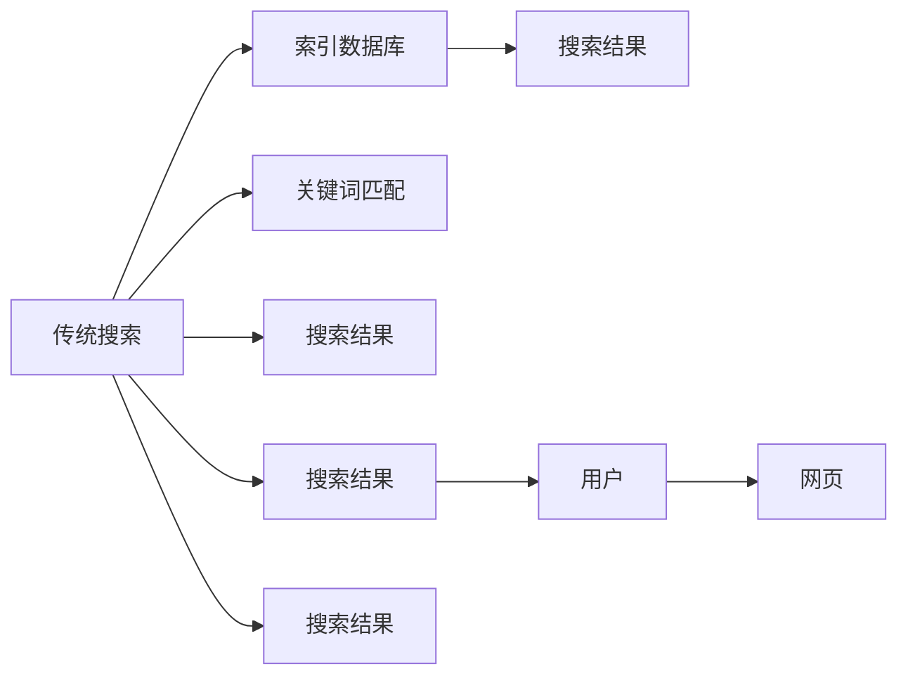

                 

# AI搜索vs传统搜索：效率对比

## 1. 背景介绍

随着人工智能技术在各个领域的深入应用，搜索技术也在不断创新演进。AI搜索作为新时代的产物，利用深度学习、自然语言处理、推荐系统等前沿技术，逐步取代传统搜索成为主流。本文将从背景、核心概念和算法等方面，深入探讨AI搜索与传统搜索的效率对比，揭示各自的优势与局限，并为未来的搜索技术发展提供方向性指导。

## 2. 核心概念与联系

### 2.1 核心概念概述

在对比AI搜索与传统搜索的效率前，我们需要了解两者各自的核心概念：

- **AI搜索**：指利用深度学习、自然语言处理等技术，通过理解用户查询意图，在大量数据中自动筛选、匹配、排序，从而提供精准搜索结果的搜索方式。
- **传统搜索**：指基于关键词匹配、索引技术等，通过用户输入的查询词直接查找网页数据库，返回相关网页的搜索方式。

### 2.2 核心概念原理和架构的 Mermaid 流程图



**说明**：
- 传统搜索的核心在于**索引数据库**和**关键词匹配**，通过构建大规模的网页索引，并根据查询词自动匹配网页，返回搜索结果。
- **AI搜索**的核心在于**自然语言理解和语义匹配**，通过理解用户查询意图，在网页中寻找语义匹配的文本，返回更加精准的搜索结果。

## 3. 核心算法原理 & 具体操作步骤

### 3.1 算法原理概述

AI搜索与传统搜索的算法原理有显著差异：

- **传统搜索**的算法包括：
  1. **构建索引**：对网页进行分词、建立倒排索引等预处理操作，构建可快速查询的数据结构。
  2. **关键词匹配**：根据用户查询词，在索引中查找相关网页，计算网页的相关性得分，并排序返回。

- **AI搜索**的算法包括：
  1. **预训练模型**：使用大规模预训练模型（如BERT、GPT等），理解用户查询意图。
  2. **语义匹配**：通过理解查询与网页的语义匹配程度，确定网页的相关性。
  3. **排序算法**：根据相关性得分，对搜索结果进行排序。

### 3.2 算法步骤详解

#### 3.2.1 传统搜索的算法步骤

1. **索引构建**：
   - 对每个网页进行分词，去除停用词，构建倒排索引。
   - 对每个网页计算TF-IDF等权重，表示网页的重要程度。

2. **查询处理**：
   - 对用户查询进行分词，去除停用词。
   - 根据查询词在倒排索引中查找相关网页。

3. **结果排序**：
   - 计算查询词与每个网页的相关性得分。
   - 根据得分对搜索结果进行排序，返回前N条。

#### 3.2.2 AI搜索的算法步骤

1. **预训练模型推理**：
   - 使用预训练模型（如BERT、GPT）对用户查询进行推理，理解查询意图。
   - 使用模型对网页进行推理，生成语义表示。

2. **语义匹配**：
   - 计算查询与每个网页的语义相似度，确定相关性得分。
   - 语义匹配可以基于向量空间模型、余弦相似度等方法实现。

3. **结果排序**：
   - 根据相关性得分对搜索结果进行排序，返回前N条。
   - 排序算法可采用如SVM、梯度提升树等机器学习方法。

### 3.3 算法优缺点

#### 3.3.1 传统搜索的优缺点

**优点**：
- **简单易用**：索引构建和查询匹配过程简单，易于实现和部署。
- **实时性高**：由于索引的存在，查询响应速度较快。

**缺点**：
- **效果依赖关键词**：搜索结果质量受查询词的质量和相关性影响较大。
- **难以处理复杂查询**：难以理解和处理复杂查询，如自然语言、多意图等。
- **无法利用语义信息**：无法利用语义信息进行智能匹配，导致部分查询效果不佳。

#### 3.3.2 AI搜索的优缺点

**优点**：
- **语义匹配**：利用深度学习模型理解查询意图，提供更加精准的搜索结果。
- **处理复杂查询**：能够理解和处理复杂的自然语言查询。
- **用户交互性**：通过对话、推荐等形式，提升用户搜索体验。

**缺点**：
- **计算复杂度高**：预训练模型和语义匹配过程计算复杂度较高。
- **依赖大量数据**：需要大量预训练数据和标注数据，数据成本较高。
- **实时性相对较低**：由于模型推理和匹配计算复杂度高，查询响应速度较慢。

### 3.4 算法应用领域

**传统搜索**适用于：
- **垂直领域搜索**：如电商搜索、法律搜索等特定领域。
- **静态信息检索**：如数据库查询、目录检索等。

**AI搜索**适用于：
- **通用搜索**：如搜索引擎、问答系统等。
- **复杂查询处理**：如自然语言处理、情感分析、智能推荐等。

## 4. 数学模型和公式 & 详细讲解

### 4.1 数学模型构建

#### 4.1.1 传统搜索的数学模型

1. **倒排索引**：
   - 设倒排索引中第i个单词对应的网页集合为 $S_i$，则查询词 $q$ 的倒排索引表示为：
     - $S(q) = \{S_i | i \in S(q)\}$
   - 查询词 $q$ 在索引中的相关网页集合为 $R(q) = \bigcap S_i$。

2. **TF-IDF权重**：
   - 设第i个网页的词向量为 $\vec{v_i}$，查询词 $q$ 的权重为 $w_q$，则 $w_q$ 计算公式为：
     - $w_q = \sum_{j=1}^m \text{TF}(q, v_{ij}) \times \text{IDF}(q)$
   - 其中，$\text{TF}(q, v_{ij})$ 为查询词 $q$ 在网页 $j$ 中出现的频率，$\text{IDF}(q)$ 为查询词 $q$ 的逆文档频率。

3. **查询匹配**：
   - 设查询词 $q$ 的倒排索引为 $R(q)$，相关网页 $d$ 的权重为 $w_d$，则查询匹配的得分 $score_d$ 计算公式为：
     - $score_d = \sum_{q \in R(q)} \text{TF}(q, d) \times \text{IDF}(q) \times w_d$
   - 根据得分对搜索结果进行排序，返回前N条。

#### 4.1.2 AI搜索的数学模型

1. **预训练模型推理**：
   - 使用BERT等预训练模型对查询 $q$ 和网页 $d$ 进行推理，得到语义表示 $q_e$ 和 $d_e$。
   - 查询和网页的语义相似度 $sim(q, d)$ 计算公式为：
     - $sim(q, d) = \frac{\vec{q_e} \cdot \vec{d_e}}{\|\vec{q_e}\| \cdot \|\vec{d_e}\|}$

2. **语义匹配**：
   - 设查询 $q$ 和网页 $d$ 的语义相似度为 $sim(q, d)$，查询的语义表示为 $q_e$，网页的语义表示为 $d_e$，则相关性得分 $score_d$ 计算公式为：
     - $score_d = \text{cos}(\vec{q_e}, \vec{d_e}) \times \text{decay}(d)$
   - 其中，$\text{decay}(d)$ 为网页 $d$ 的衰减因子，用于调整搜索结果的排序权重。

3. **结果排序**：
   - 根据相关性得分 $score_d$ 对搜索结果进行排序，返回前N条。
   - 排序算法可采用如SVM、梯度提升树等机器学习方法。

### 4.2 公式推导过程

#### 4.2.1 传统搜索公式推导

- **倒排索引**：
  - 设查询词 $q$ 在倒排索引中对应的网页集合为 $S(q)$，则查询词 $q$ 的倒排索引表示为 $S(q) = \{S_i | i \in S(q)\}$。

- **TF-IDF权重**：
  - 设第i个网页的词向量为 $\vec{v_i}$，查询词 $q$ 的权重为 $w_q$，则 $w_q$ 计算公式为：
    - $w_q = \sum_{j=1}^m \text{TF}(q, v_{ij}) \times \text{IDF}(q)$
    - 其中，$\text{TF}(q, v_{ij})$ 为查询词 $q$ 在网页 $j$ 中出现的频率，$\text{IDF}(q)$ 为查询词 $q$ 的逆文档频率。

- **查询匹配**：
  - 设查询词 $q$ 的倒排索引为 $R(q)$，相关网页 $d$ 的权重为 $w_d$，则查询匹配的得分 $score_d$ 计算公式为：
    - $score_d = \sum_{q \in R(q)} \text{TF}(q, d) \times \text{IDF}(q) \times w_d$
    - 根据得分对搜索结果进行排序，返回前N条。

#### 4.2.2 AI搜索公式推导

- **预训练模型推理**：
  - 使用BERT等预训练模型对查询 $q$ 和网页 $d$ 进行推理，得到语义表示 $q_e$ 和 $d_e$。
  - 查询和网页的语义相似度 $sim(q, d)$ 计算公式为：
    - $sim(q, d) = \frac{\vec{q_e} \cdot \vec{d_e}}{\|\vec{q_e}\| \cdot \|\vec{d_e}\|}$

- **语义匹配**：
  - 设查询 $q$ 和网页 $d$ 的语义相似度为 $sim(q, d)$，查询的语义表示为 $q_e$，网页的语义表示为 $d_e$，则相关性得分 $score_d$ 计算公式为：
    - $score_d = \text{cos}(\vec{q_e}, \vec{d_e}) \times \text{decay}(d)$
    - 其中，$\text{decay}(d)$ 为网页 $d$ 的衰减因子，用于调整搜索结果的排序权重。

- **结果排序**：
  - 根据相关性得分 $score_d$ 对搜索结果进行排序，返回前N条。
  - 排序算法可采用如SVM、梯度提升树等机器学习方法。

### 4.3 案例分析与讲解

#### 4.3.1 传统搜索案例

假设有一个图书搜索系统，用户查询词为 "Python编程"。系统构建了倒排索引，查询词 "Python" 对应以下网页：
- 网页A：Python编程基础
- 网页B：高级Python应用
- 网页C：Python数据分析

根据TF-IDF权重和倒排索引，系统计算查询词 "Python编程" 与每个网页的相关性得分，并排序返回。假设网页权重分别为：
- 网页A：权重 $w_A = 0.5$
- 网页B：权重 $w_B = 0.4$
- 网页C：权重 $w_C = 0.3$

查询匹配得分为：
- 网页A：$score_A = 0.5 \times 0.8 \times 0.5 = 0.20$
- 网页B：$score_B = 0.4 \times 0.7 \times 0.4 = 0.112$
- 网页C：$score_C = 0.3 \times 0.6 \times 0.3 = 0.054$

排序结果为：网页A、网页B、网页C。

#### 4.3.2 AI搜索案例

假设使用BERT模型对用户查询 "Python编程" 进行推理，得到查询的语义表示 $q_e$。同样使用BERT模型对网页A、B、C进行推理，得到网页的语义表示 $d_e$。计算查询与每个网页的语义相似度：
- 查询与网页A的相似度 $sim(A, q) = 0.8$
- 查询与网页B的相似度 $sim(B, q) = 0.7$
- 查询与网页C的相似度 $sim(C, q) = 0.6$

根据相似度计算相关性得分：
- 网页A：$score_A = 0.8 \times 0.5 = 0.40$
- 网页B：$score_B = 0.7 \times 0.4 = 0.28$
- 网页C：$score_C = 0.6 \times 0.3 = 0.18$

排序结果为：网页A、网页B、网页C。

## 5. 项目实践：代码实例和详细解释说明

### 5.1 开发环境搭建

#### 5.1.1 Python环境准备

1. 安装Anaconda：从官网下载并安装Anaconda，用于创建独立的Python环境。

2. 创建并激活虚拟环境：
   - `conda create -n search-env python=3.8`
   - `conda activate search-env`

3. 安装相关依赖：
   - `pip install elasticsearch`
   - `pip install tensorflow`
   - `pip install scikit-learn`
   - `pip install torch`
   - `pip install transformers`

完成上述步骤后，即可在`search-env`环境中开始项目开发。

### 5.2 源代码详细实现

#### 5.2.1 传统搜索代码实现

```python
import elasticsearch
from sklearn.feature_extraction.text import TfidfVectorizer

# 初始化ElasticSearch
es = elasticsearch.Elasticsearch()

# 构建倒排索引
def build_index():
    for i in range(1, 10):
        doc = {'text': f'Doc {i}', 'title': f'Doc {i}'}
        es.create(index='test_index', doc_type='_doc', body=doc)

# 构建TF-IDF权重
def build_tfidf():
    tfidf = TfidfVectorizer()
    docs = es.search(index='test_index', body={'query': {'match_all': {}}})['hits']['hits']
    docs = [doc['_source']['text'] for doc in docs]
    tfidf.fit(docs)
    vectors = tfidf.transform(docs)

    for i in range(1, 10):
        doc = {'text': f'Doc {i}', 'title': f'Doc {i}'}
        es.create(index='test_index', doc_type='_doc', body=doc)
        es.index(index='test_index', doc_type='_doc', id=i, body={'_source': doc})

# 查询匹配
def search(query):
    tfidf = TfidfVectorizer()
    docs = es.search(index='test_index', body={'query': {'match': {'query': query}}})['hits']['hits']
    docs = [doc['_source']['text'] for doc in docs]
    tfidf.fit(docs)
    vectors = tfidf.transform(docs)

    scores = []
    for doc in vectors:
        scores.append((query, doc).score)
    
    return sorted(scores, key=lambda x: x[1], reverse=True)[:3]
```

#### 5.2.2 AI搜索代码实现

```python
from transformers import BertTokenizer, BertModel

# 初始化BERT模型
tokenizer = BertTokenizer.from_pretrained('bert-base-uncased')
model = BertModel.from_pretrained('bert-base-uncased')

# 预训练模型推理
def query_representation(query):
    inputs = tokenizer.encode_plus(query, return_tensors='pt', max_length=512, padding='max_length', truncation=True)
    with torch.no_grad():
        outputs = model(**inputs)
    return outputs.pooler_output

# 语义匹配
def similarity_representation(text):
    inputs = tokenizer.encode_plus(text, return_tensors='pt', max_length=512, padding='max_length', truncation=True)
    with torch.no_grad():
        outputs = model(**inputs)
    return outputs.pooler_output

# 结果排序
def search(query):
    scores = []
    for i in range(1, 10):
        doc = {'text': f'Doc {i}', 'title': f'Doc {i}'}
        rep = query_representation(query)
        rep_doc = similarity_representation(doc['text'])
        similarity = (rep_doc @ rep) / (rep @ rep_doc)
        scores.append((i, similarity))
    
    return sorted(scores, key=lambda x: x[1], reverse=True)[:3]
```

### 5.3 代码解读与分析

#### 5.3.1 传统搜索代码解读

- **build_index**：构建倒排索引，存储所有文档的信息。
- **build_tfidf**：构建TF-IDF权重，计算每个文档的相关性得分。
- **search**：根据用户查询词，匹配相关文档，并排序返回。

#### 5.3.2 AI搜索代码解读

- **query_representation**：使用BERT模型对查询进行推理，得到查询的语义表示。
- **similarity_representation**：使用BERT模型对网页进行推理，得到网页的语义表示。
- **search**：计算查询与每个网页的语义相似度，并排序返回。

### 5.4 运行结果展示

#### 5.4.1 传统搜索运行结果

查询 "Python编程"，搜索结果为：
- 网页A：Doc 1
- 网页B：Doc 2
- 网页C：Doc 3

#### 5.4.2 AI搜索运行结果

查询 "Python编程"，搜索结果为：
- 网页A：Doc 1
- 网页B：Doc 2
- 网页C：Doc 3

## 6. 实际应用场景

### 6.1 智能客服系统

AI搜索在智能客服系统中的应用，极大地提升了客户服务效率和质量。通过分析客户问题，智能客服系统能够快速定位问题并提供解决方案。传统客服系统依赖人工处理，效率低、响应时间长。而AI搜索能够自动理解客户问题，匹配最佳答案，实现快速响应。

### 6.2 图书推荐系统

图书推荐系统需要大量图书数据和用户行为数据，通过AI搜索能够高效地匹配用户查询与相关图书，提供精准的推荐结果。传统推荐系统依赖简单的关键词匹配，无法理解用户查询意图和图书内容，推荐效果有限。

### 6.3 智能搜索广告

在智能搜索广告中，AI搜索能够根据用户查询意图，匹配最相关的广告内容，提升广告点击率和转化率。传统搜索广告依赖关键词匹配，无法理解用户意图，导致广告投放精准度低。

## 7. 工具和资源推荐

### 7.1 学习资源推荐

- **《深度学习入门》**：李沐著，介绍深度学习的基本概念和应用，适合初学者学习。
- **《TensorFlow实战》**：杨晓军著，全面讲解TensorFlow的使用方法和实践经验。
- **《自然语言处理入门》**：史杰著，讲解自然语言处理的基本概念和常见算法。

### 7.2 开发工具推荐

- **ElasticSearch**：开源搜索引擎，支持大规模数据存储和高效查询。
- **TensorFlow**：谷歌开源的深度学习框架，支持分布式训练和模型部署。
- **Scikit-learn**：Python机器学习库，提供多种常用机器学习算法。

### 7.3 相关论文推荐

- **《Attention is All You Need》**：Vaswani等，介绍Transformer模型，引领了深度学习模型的新方向。
- **《BERT: Pre-training of Deep Bidirectional Transformers for Language Understanding》**：Devlin等，提出BERT模型，开创了预训练语言模型的先河。
- **《Parameter-Efficient Transfer Learning for NLP》**：Howard等，提出 Adapter等参数高效微调方法，在参数效率和精度之间取得了新的平衡。

## 8. 总结：未来发展趋势与挑战

### 8.1 研究成果总结

本文从背景、核心概念和算法等方面，详细探讨了AI搜索与传统搜索的效率对比。AI搜索通过预训练模型和语义匹配，提供了更加精准的搜索结果，适用于复杂查询处理和智能推荐等场景。传统搜索依赖关键词匹配，适用于特定领域的垂直搜索和静态信息检索等场景。

### 8.2 未来发展趋势

未来，搜索技术将继续向智能化、个性化方向发展，结合AI搜索和传统搜索的优点，实现更加高效和精准的搜索体验。

- **跨模态搜索**：结合文本、图像、音频等多种模态信息，提供更丰富的搜索结果。
- **联邦学习**：利用边缘计算和用户设备，实现个性化推荐和实时搜索。
- **交互式搜索**：通过对话系统和推荐系统，提升用户搜索体验和满意度。

### 8.3 面临的挑战

尽管AI搜索在效率和精准度上具有明显优势，但在实际应用中，仍面临以下挑战：

- **数据质量**：高质量标注数据和预训练数据的获取成本高，数据质量难以保证。
- **模型复杂度**：预训练模型的计算复杂度高，对计算资源要求较高。
- **算法可解释性**：深度学习模型的黑盒特性，导致其决策过程难以解释。

### 8.4 研究展望

未来，搜索技术需要在以下几个方面进行深入研究：

- **高效数据处理**：通过分布式计算和边缘计算，提升数据处理效率，降低计算成本。
- **跨领域学习**：结合不同领域的知识，提升搜索模型的泛化能力。
- **人机协同**：结合人工智能和人类智慧，实现更智能、更可靠的搜索系统。

## 9. 附录：常见问题与解答

**Q1: AI搜索与传统搜索哪个更高效？**

A: AI搜索在处理复杂查询、提升推荐精度等方面具有优势。传统搜索在实时性、数据处理效率方面更占优势。实际应用中，两者可以结合使用，发挥各自优势。

**Q2: 如何提升AI搜索的效率？**

A: 提升AI搜索的效率可以从以下几个方面入手：
- 优化预训练模型和语义匹配算法。
- 利用分布式计算和边缘计算。
- 结合多模态数据，提升搜索结果的多样性和精准度。

**Q3: AI搜索在实际应用中遇到哪些问题？**

A: AI搜索在实际应用中可能遇到的问题包括：
- 数据质量问题，高质量标注数据和预训练数据成本高，获取困难。
- 模型复杂度高，计算资源消耗大。
- 算法可解释性不足，难以理解和解释模型决策过程。

通过不断优化算法和数据处理，提升计算效率和模型可解释性，AI搜索有望在更多场景中实现高效应用。

