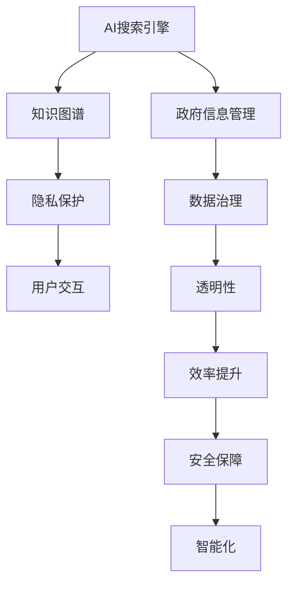

                 

# AI搜索引擎在提高政府效率和透明度方面的潜力

> 关键词：人工智能,政府,搜索引擎,数据治理,透明度,效率,智能化

## 1. 背景介绍

### 1.1 问题由来
在全球数字化转型的浪潮下，各国政府正逐步从传统的纸质办公转向电子政务，利用信息技术提高公共服务的效率和透明度。然而，由于数据量大、种类繁多、分布复杂，传统的数据管理和查询方式已难以满足现代治理需求。人工智能(AI)搜索引擎技术的应用，为政府信息的智能化管理和高效查询提供了新的可能性。

### 1.2 问题核心关键点
AI搜索引擎的核心思想是利用先进的搜索算法和大规模语义理解技术，将无序的海量数据转化为结构化的信息，并提供精准、高效的查询服务。AI搜索引擎的关键点包括：

1. **数据处理能力**：能够处理各类复杂数据，如文本、图像、视频、音频等，构建语义丰富的信息索引。
2. **搜索算法优化**：通过智能排序和过滤算法，提升搜索结果的相关性和准确性。
3. **知识图谱融合**：结合知识图谱技术，增强对实体关系和语义的理解，提供深度信息检索。
4. **实时更新与维护**：能够及时更新索引数据，保证搜索结果的时效性和准确性。
5. **用户交互优化**：通过自然语言处理技术，实现用户查询的自然化、个性化和智能化。

### 1.3 问题研究意义
AI搜索引擎的应用，有助于提升政府信息管理的智能化水平，实现信息的高效检索、快速响应和精准服务。具体意义包括：

1. **提高透明度**：通过公开透明的信息检索，增强政府决策的透明度，提升公众信任度。
2. **提升效率**：利用智能搜索技术，减少人工搜索成本，加速信息处理速度，提升政府工作效率。
3. **促进创新**：通过数据深度挖掘和分析，提供决策支持，推动政府治理模式的创新。
4. **增强安全**：实现对敏感信息的安全访问控制，确保数据隐私和安全。
5. **优化资源配置**：利用智能化的资源配置机制，优化公共资源的使用和分配。

## 2. 核心概念与联系

### 2.1 核心概念概述

为更好地理解AI搜索引擎在政府中的应用，本节将介绍几个密切相关的核心概念：

- **AI搜索引擎**：基于人工智能技术，利用深度学习、自然语言处理、知识图谱等技术，提供高效、精准、智能的搜索服务。
- **政府信息管理**：指政府机构对自身及公共领域的数据进行收集、存储、处理和查询的过程。
- **数据治理**：通过规范数据标准、治理数据质量、确保数据安全，提升数据利用效率的过程。
- **知识图谱**：利用图数据库技术，构建语义丰富的实体关系网络，辅助信息检索和知识发现。
- **隐私保护**：在信息检索过程中，对敏感数据进行脱敏和加密，保障数据隐私和安全。

这些核心概念之间的逻辑关系可以通过以下Mermaid流程图来展示：



这个流程图展示了几大核心概念及其之间的关系：

1. AI搜索引擎通过知识图谱技术增强对实体的理解，提供深度信息检索。
2. 在数据治理的框架下，政府信息管理得以规范化、标准化。
3. 通过隐私保护机制，确保信息检索的安全性。
4. 用户交互的优化，提升搜索的智能化水平。
5. 数据治理、知识图谱和隐私保护共同构成透明性，提升政府工作的透明度。
6. 透明性、效率提升和安全保障共同作用于智能化，增强AI搜索引擎的实际应用效果。

## 3. 核心算法原理 & 具体操作步骤
### 3.1 算法原理概述

AI搜索引擎的核心算法主要包括深度学习模型、自然语言处理(NLP)、信息检索和知识图谱等技术。其核心原理是利用深度学习模型对大量无标签数据进行预训练，获得丰富的语义表示能力，通过自然语言处理技术将用户查询转化为结构化的查询向量，结合信息检索算法和知识图谱技术，快速定位到相关的信息。

### 3.2 算法步骤详解

基于AI搜索引擎的政府信息管理通常包括以下几个关键步骤：

**Step 1: 数据预处理**
- 收集政府机构和公共领域的各类数据，包括文本、图片、音频、视频等。
- 对数据进行清洗、去重、标准化处理，构建统一的语义空间。

**Step 2: 知识图谱构建**
- 利用知识图谱技术，提取数据中的实体和关系，构建语义丰富的实体关系网络。
- 将实体和关系进行标准化处理，形成结构化的数据集合。

**Step 3: 深度学习模型训练**
- 使用深度学习模型（如BERT、GPT等）对预处理后的数据进行训练，学习语义表示能力。
- 将训练得到的模型参数保存，用于后续的信息检索和查询优化。

**Step 4: 信息检索算法优化**
- 选择合适的信息检索算法（如BM25、TF-IDF等），对索引数据进行排序和过滤。
- 引入智能排序算法，提升搜索结果的相关性和准确性。

**Step 5: 用户查询处理**
- 利用自然语言处理技术，将用户查询转换为结构化的查询向量。
- 结合深度学习模型的语义表示能力和知识图谱技术，快速定位到相关数据。

**Step 6: 结果展示与反馈**
- 将检索结果展示给用户，并提供高级搜索功能，如筛选、排序、分页等。
- 收集用户反馈，不断优化查询算法和搜索结果。

### 3.3 算法优缺点

AI搜索引擎在政府信息管理中的应用，具有以下优点：
1. **高效性**：利用深度学习模型和智能算法，大大提高了信息检索的速度和准确性。
2. **智能化**：结合自然语言处理和知识图谱技术，实现了对实体的深度理解，提供了智能化的查询体验。
3. **扩展性**：可以处理多种数据类型，适应不同领域的政府信息管理需求。
4. **透明性**：通过公开透明的查询过程，增强了政府工作的透明度。

同时，AI搜索引擎也存在一些局限性：
1. **数据依赖性**：高度依赖高质量、标准化数据的输入，对数据质量要求较高。
2. **算法复杂性**：深度学习模型和自然语言处理技术的实现复杂，需要较高的技术门槛。
3. **资源消耗大**：深度学习模型和知识图谱的构建需要大量的计算资源和存储空间。
4. **隐私风险**：对敏感数据需要进行严格的安全管理和隐私保护。
5. **用户依赖性**：依赖于用户输入的准确性和完整性，用户输入错误可能导致搜索结果不准确。

### 3.4 算法应用领域

AI搜索引擎在政府信息管理中的应用领域广泛，主要包括以下几个方面：

1. **公开信息查询**：构建政府网站和政务App的搜索功能，方便公众查询各类公开信息，如政策法规、统计数据、公共服务指南等。
2. **内部信息检索**：为政府机构提供内网信息检索服务，帮助员工快速查找相关文件、会议记录、项目资料等。
3. **决策支持系统**：结合知识图谱和深度学习模型，提供数据驱动的决策支持，帮助政府部门制定更科学的决策。
4. **应急响应系统**：在突发事件发生时，快速检索和整合相关信息，为应急响应提供决策支持。
5. **智能客服系统**：通过AI搜索引擎技术，构建智能客服系统，提供7x24小时服务，提升客户满意度。

## 4. 数学模型和公式 & 详细讲解  
### 4.1 数学模型构建

本节将使用数学语言对AI搜索引擎的构建过程进行更加严格的刻画。

记数据集为 $D=\{x_1, x_2, ..., x_n\}$，其中 $x_i$ 为第 $i$ 条记录，包含文本、图片、音频等多种类型。设 $T$ 为查询向量，表示用户输入的查询请求。

定义深度学习模型为 $M_{\theta}(x_i)$，其中 $\theta$ 为模型参数。则模型的语义表示能力可以表示为 $M_{\theta}(x_i)$ 在向量空间中的表示 $\vec{v}_i = M_{\theta}(x_i)$。

信息检索算法的目标是找到与查询向量 $T$ 最匹配的数据记录。常见的信息检索算法包括 BM25、TF-IDF、向量空间模型等，其基本思想是计算每个记录与查询向量之间的相似度，然后按照相似度进行排序。例如，BM25算法中，相似度计算公式为：

$$
S(i) = \frac{(q, D_i) \cdot (q, q)}{(q, D_i) + \beta \log(\frac{1}{k} + \frac{N - D_i}{k - 1})}
$$

其中 $(q, D_i)$ 表示查询向量 $q$ 与记录 $D_i$ 之间的点积，$\beta$ 为平滑参数，$N$ 为记录总数，$k$ 为结果集大小。

### 4.2 公式推导过程

下面以BM25算法为例，推导信息检索的相似度计算公式。

假设查询向量 $T$ 和数据记录 $x_i$ 在向量空间中的表示分别为 $\vec{t}$ 和 $\vec{v}_i$。则BM25算法的相似度计算公式为：

$$
S(i) = \frac{(\vec{t}, \vec{v}_i)^2 \cdot (q, q)}{(\vec{t}, \vec{v}_i)^2 + \beta \log(\frac{1}{k} + \frac{N - D_i}{k - 1})}
$$

其中 $(\vec{t}, \vec{v}_i)^2$ 表示查询向量 $T$ 和记录 $x_i$ 的余弦相似度，$\log(\frac{1}{k} + \frac{N - D_i}{k - 1})$ 为BM25算法的长度归一化项。

在得到相似度后，按照相似度大小对记录进行排序，即可得到最终的检索结果。

## 5. 项目实践：代码实例和详细解释说明
### 5.1 开发环境搭建

在进行AI搜索引擎的政府信息管理实践前，我们需要准备好开发环境。以下是使用Python进行Elasticsearch开发的环境配置流程：

1. 安装Anaconda：从官网下载并安装Anaconda，用于创建独立的Python环境。

2. 创建并激活虚拟环境：
```bash
conda create -n elasticsearch-env python=3.8 
conda activate elasticsearch-env
```

3. 安装Elasticsearch：从官网获取安装命令，安装Elasticsearch。例如：
```bash
bin/elasticsearch --cluster.name=elasticsearch-cluster --discovery.type=single-node --node.name=node-1 --network.host=localhost --http.port=9200 --xpack.security.enabled=true --xpack.security.transport.ssl.enabled=true
```

4. 安装相关Python库：
```bash
pip install elasticsearch-dsl elasticsearch-py
```

5. 安装Kibana：从官网下载并安装Kibana，与Elasticsearch集成，用于数据可视化和查询。

完成上述步骤后，即可在`elasticsearch-env`环境中开始AI搜索引擎的政府信息管理实践。

### 5.2 源代码详细实现

这里我们以Elasticsearch的文档搜索功能为例，给出使用Python进行政府信息管理的代码实现。

首先，定义搜索函数：

```python
from elasticsearch import Elasticsearch
from elasticsearch_dsl import Search

def search(query_string):
    es = Elasticsearch()
    s = Search(using=es)
    s = s.query("query_string", query_string=query_string)
    s = s.size(10)
    results = s.execute()

    for hit in results:
        print(hit['_source'])
```

然后，构建Elasticsearch索引：

```python
from elasticsearch import Elasticsearch
from elasticsearch_dsl import Document, Text, Index

class GovernmentDocument(Document):
    content = Text()

    def create_index():
        es = Elasticsearch()
        index = Index(government_index)
        index.settings(num_shards=1, replica=1)
        index.mapping({
            "content": {"type": "text", "analyzer": "standard"}
        })
        index.create()
```

最后，启动Elasticsearch集群，并使用搜索函数检索数据：

```python
from elasticsearch import Elasticsearch
from elasticsearch_dsl import Search

es = Elasticsearch()

def search(query_string):
    s = Search(using=es)
    s = s.query("query_string", query_string=query_string)
    s = s.size(10)
    results = s.execute()

    for hit in results:
        print(hit['_source'])

search("政策法规")
```

以上就是使用Python和Elasticsearch构建AI搜索引擎的政府信息管理实践的完整代码实现。可以看到，Elasticsearch提供了强大的搜索功能和丰富的API，使得构建AI搜索引擎变得非常简便。

### 5.3 代码解读与分析

让我们再详细解读一下关键代码的实现细节：

**Elasticsearch的搜索函数**：
- `es = Elasticsearch()`：初始化Elasticsearch客户端。
- `s = Search(using=es)`：创建一个Search对象，用于进行搜索。
- `s = s.query("query_string", query_string=query_string)`：构建查询字符串，将查询结果返回。
- `s = s.size(10)`：设置搜索结果的大小为10条。
- `results = s.execute()`：执行搜索，返回搜索结果。
- `for hit in results:`：遍历搜索结果，提取每条记录的内容。

**Elasticsearch的索引构建**：
- `es = Elasticsearch()`：初始化Elasticsearch客户端。
- `index = Index(government_index)`：创建一个名为`government_index`的索引。
- `index.settings(num_shards=1, replica=1)`：设置索引的分片和副本数。
- `index.mapping()`：定义索引的映射，包括内容字段和分词器。
- `index.create()`：创建索引。

可以看到，Elasticsearch的搜索和索引构建都非常直观和易用，开发者可以通过简单的API调用，快速构建高效的AI搜索引擎。

## 6. 实际应用场景
### 6.1 智慧政务平台

基于AI搜索引擎的智慧政务平台，可以通过构建智能化的信息检索系统，实现政府信息的深度管理与高效查询。具体应用场景包括：

1. **政府网站查询**：为政府网站提供搜索功能，方便公众快速找到各类公开信息，如政策法规、统计数据、公共服务指南等。
2. **内部信息检索**：为政府机构提供内网信息检索服务，帮助员工快速查找相关文件、会议记录、项目资料等。
3. **决策支持系统**：结合知识图谱和深度学习模型，提供数据驱动的决策支持，帮助政府部门制定更科学的决策。
4. **应急响应系统**：在突发事件发生时，快速检索和整合相关信息，为应急响应提供决策支持。
5. **智能客服系统**：通过AI搜索引擎技术，构建智能客服系统，提供7x24小时服务，提升客户满意度。

### 6.2 公共服务导航

在公共服务导航系统中，AI搜索引擎可以为用户智能推荐相关的服务资源，提升用户体验和满意度。具体应用场景包括：

1. **健康服务导航**：结合电子健康档案和医疗资源数据库，提供个性化医疗咨询和健康管理建议。
2. **教育服务导航**：通过教育资源数据库，提供学校、课程、教师等信息的智能推荐。
3. **文化服务导航**：结合公共文化资源数据库，提供博物馆、图书馆、文化活动等信息推荐。
4. **旅游服务导航**：通过旅游资源数据库，提供景点、酒店、交通等信息推荐。
5. **金融服务导航**：结合金融产品数据库，提供银行、保险、投资等信息的智能推荐。

### 6.3 政府数据开放平台

政府数据开放平台通过AI搜索引擎技术，实现了对各类政府数据的智能化管理和高效查询。具体应用场景包括：

1. **数据检索**：通过AI搜索引擎，实现对各类政府数据的深度检索，提供结构化和非结构化数据的全面查询。
2. **数据可视化**：结合数据可视化工具，展示数据统计结果和趋势分析，提升数据利用效率。
3. **数据共享**：实现跨部门、跨地区的数据共享和协作，促进公共数据资源的充分利用。
4. **数据治理**：通过AI搜索引擎，实现对数据的规范化和标准化管理，提升数据质量。
5. **数据安全**：通过AI搜索引擎，实现对敏感数据的访问控制和隐私保护，保障数据安全。

## 7. 工具和资源推荐
### 7.1 学习资源推荐

为了帮助开发者系统掌握AI搜索引擎的理论基础和实践技巧，这里推荐一些优质的学习资源：

1. 《Elasticsearch官方文档》：详细介绍了Elasticsearch的各项功能和API，是学习和使用Elasticsearch的必备资料。
2. 《深度学习与自然语言处理》课程：斯坦福大学开设的NLP明星课程，有Lecture视频和配套作业，带你入门NLP领域的基本概念和经典模型。
3. 《Python数据科学与人工智能》书籍：全面介绍了Python在数据科学和人工智能领域的应用，包括搜索引擎、推荐系统等。
4. 《Elasticsearch for the impatient》书籍：适合初学者的Elasticsearch入门书籍，提供了大量实用案例和代码示例。
5. HuggingFace官方文档：提供了丰富的深度学习模型和AI搜索引擎实现样例，助力模型开发和应用。

通过对这些资源的学习实践，相信你一定能够快速掌握AI搜索引擎的核心技术和应用方法，并将其应用到政府信息管理的实际场景中。

### 7.2 开发工具推荐

高效的开发离不开优秀的工具支持。以下是几款用于AI搜索引擎开发的常用工具：

1. Python：灵活易用的编程语言，适合深度学习模型的开发和实现。
2. Elasticsearch：强大的搜索和索引引擎，适合构建高效的信息检索系统。
3. Kibana：直观的可视化工具，可以方便地展示和分析搜索结果。
4. Jupyter Notebook：交互式编程环境，支持代码调试和数据可视化。
5. PyCharm：强大的IDE工具，提供代码补全、调试等功能，提升开发效率。

合理利用这些工具，可以显著提升AI搜索引擎的开发效率，加速创新迭代的步伐。

### 7.3 相关论文推荐

AI搜索引擎的应用源于学界的持续研究。以下是几篇奠基性的相关论文，推荐阅读：

1. "A Survey of Semantic Search"：一篇综述性论文，介绍了多种语义搜索技术及其应用。
2. "Efficient Retrieval with Deep Learning"：提出了基于深度学习的搜索引擎模型，展示了其在高精度检索上的优异表现。
3. "Knowledge Graphs for Semantic Search"：介绍了知识图谱在语义搜索中的应用，提供了深度检索的思路。
4. "BM25 — A Modern Information Retrieval Model"：经典的BM25算法，详细介绍了其核心思想和实现方法。
5. "Learning to Search in BERT"：提出了基于BERT的深度检索模型，展示了其在大规模语料库上的应用效果。

这些论文代表了大规模语料库和深度学习技术的发展脉络，通过学习这些前沿成果，可以帮助研究者把握学科前进方向，激发更多的创新灵感。

## 8. 总结：未来发展趋势与挑战
### 8.1 研究成果总结

本文对AI搜索引擎在政府信息管理中的应用进行了全面系统的介绍。首先阐述了AI搜索引擎的核心思想和实现原理，明确了其在政府信息管理中的独特价值。其次，从原理到实践，详细讲解了AI搜索引擎的构建过程和具体实现，给出了实际应用的代码示例。同时，本文还探讨了AI搜索引擎在智慧政务、公共服务导航、政府数据开放平台等多个场景中的应用前景，展示了其巨大的应用潜力。

通过本文的系统梳理，可以看到，AI搜索引擎技术正在成为政府信息管理的核心工具，极大地提升了信息检索的智能化水平，实现了信息的高效管理和快速响应。未来，伴随技术的持续演进，AI搜索引擎必将在政府信息化建设中扮演越来越重要的角色，进一步提升政府工作的透明度和效率。

### 8.2 未来发展趋势

展望未来，AI搜索引擎在政府信息管理中的应用将呈现以下几个发展趋势：

1. **智能化的提升**：利用更先进的深度学习模型和自然语言处理技术，提升搜索的智能化水平，实现更精准的语义理解和匹配。
2. **跨模态融合**：结合视觉、语音、文本等多模态信息，提供更为全面和丰富的搜索结果。
3. **实时更新与维护**：实现对数据和索引的实时更新，确保搜索结果的时效性和准确性。
4. **用户交互优化**：通过自然语言处理技术，实现更自然、更个性化的用户查询和反馈。
5. **隐私保护与数据安全**：通过加密、脱敏等技术，保障敏感数据的隐私和安全。

这些趋势凸显了AI搜索引擎技术的广阔前景。这些方向的探索发展，必将进一步提升搜索的智能化水平，增强政府信息管理的效率和透明度。

### 8.3 面临的挑战

尽管AI搜索引擎技术已经取得了瞩目成就，但在迈向更加智能化、普适化应用的过程中，它仍面临诸多挑战：

1. **数据依赖性**：高度依赖高质量、标准化数据的输入，对数据质量要求较高。
2. **算法复杂性**：深度学习模型和自然语言处理技术的实现复杂，需要较高的技术门槛。
3. **资源消耗大**：深度学习模型和知识图谱的构建需要大量的计算资源和存储空间。
4. **隐私风险**：对敏感数据需要进行严格的安全管理和隐私保护。
5. **用户依赖性**：依赖于用户输入的准确性和完整性，用户输入错误可能导致搜索结果不准确。

### 8.4 研究展望

面对AI搜索引擎面临的挑战，未来的研究需要在以下几个方面寻求新的突破：

1. **数据增强技术**：通过数据增强技术，弥补数据质量的不足，提升模型的泛化能力。
2. **模型压缩与优化**：开发更加轻量级的深度学习模型，提高计算效率和存储空间利用率。
3. **跨模态数据融合**：实现多模态数据的深度融合，提升搜索的全面性和丰富度。
4. **隐私保护技术**：引入隐私保护技术，如差分隐私、联邦学习等，确保数据的安全和隐私。
5. **用户交互优化**：通过自然语言理解技术，实现更自然、更个性化的用户交互体验。

这些研究方向将推动AI搜索引擎技术的不断进步，为政府信息管理的智能化和透明化提供更强大的技术支撑。

## 9. 附录：常见问题与解答

**Q1：AI搜索引擎是否适用于所有政府信息管理场景？**

A: AI搜索引擎在大多数政府信息管理场景中都能取得不错的效果，特别是对于数据量较大的任务。但对于一些特定领域的任务，如高度机密的信息保护，AI搜索引擎的应用需要根据具体需求进行适当调整。

**Q2：如何提高AI搜索引擎的搜索精度？**

A: 提高AI搜索引擎的搜索精度，可以通过以下方法实现：
1. 优化查询模型：使用更先进的深度学习模型和算法，提升查询向量与索引数据的匹配度。
2. 优化索引构建：利用知识图谱和数据增强技术，构建更全面、更精准的索引。
3. 引入负样本：在训练模型时引入负样本，减少误匹配的记录。
4. 实时更新索引：定期更新索引数据，保持搜索结果的时效性和准确性。
5. 用户反馈优化：收集用户反馈，不断优化搜索算法和索引结构。

**Q3：AI搜索引擎在部署过程中需要注意哪些问题？**

A: AI搜索引擎在部署过程中，需要注意以下问题：
1. 性能优化：根据实际需求，优化搜索算法和索引结构，提高搜索效率。
2. 数据安全：对敏感数据进行加密和脱敏，保障数据隐私和安全。
3. 系统可扩展性：设计可扩展的系统架构，支持大规模数据的处理和查询。
4. 系统可靠性：确保系统的高可用性和容错能力，避免单点故障。
5. 用户界面优化：提供友好的用户界面，提升用户体验。

**Q4：AI搜索引擎如何支持政府数据开放平台？**

A: AI搜索引擎可以通过以下方式支持政府数据开放平台：
1. 构建统一的数据索引：对政府开放数据进行标准化处理，构建统一的数据索引。
2. 提供智能搜索服务：利用AI搜索引擎技术，实现对开放数据的深度检索和智能推荐。
3. 支持跨部门数据共享：实现跨部门、跨地区的数据共享和协作，提升数据利用效率。
4. 实现数据可视化：结合数据可视化工具，展示数据统计结果和趋势分析。
5. 保障数据安全：对敏感数据进行访问控制和隐私保护，确保数据安全。

**Q5：AI搜索引擎在未来可能面临哪些新的挑战？**

A: AI搜索引擎在未来可能面临以下新的挑战：
1. **跨语言搜索**：随着全球化进程的加速，跨语言搜索将成为新的需求，需要解决不同语言之间的语义理解和匹配问题。
2. **多语言索引**：构建多语言索引，支持多语言数据的管理和查询。
3. **实时互动**：实现用户与AI搜索引擎的实时互动，提供更个性化的搜索体验。
4. **知识图谱扩展**：构建更全面、更丰富的知识图谱，提升搜索结果的深度和广度。
5. **隐私保护与伦理**：确保搜索结果的公平性、透明性和可解释性，避免数据偏见和歧视。

**Q6：如何提升AI搜索引擎的用户体验？**

A: 提升AI搜索引擎的用户体验，可以通过以下方法实现：
1. 优化用户界面：设计简洁、直观的用户界面，提升用户的查询体验。
2. 提供个性化推荐：利用用户的历史查询行为和偏好，提供个性化的搜索结果推荐。
3. 支持自然语言查询：通过自然语言处理技术，实现自然语言查询和对话交互。
4. 提供多语言支持：支持多语言搜索，提升用户的国际化体验。
5. 引入反馈机制：收集用户反馈，不断优化搜索算法和索引结构，提升搜索结果的准确性和相关性。

这些挑战和提升方向，将推动AI搜索引擎技术的不断进步，为政府信息管理的智能化和透明化提供更强大的技术支撑。

---

作者：禅与计算机程序设计艺术 / Zen and the Art of Computer Programming

