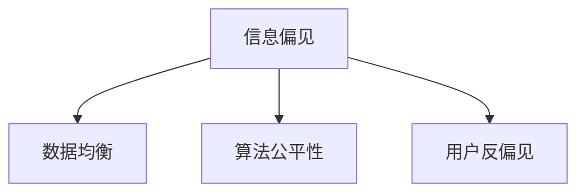

                 

## 1. 背景介绍

在当今信息爆炸的时代，搜索引擎已经成为了我们获取知识、信息的重要工具。然而，搜索引擎在展示搜索结果时，不可避免地会受到信息偏见的影响。这些偏见可能来自数据的不均衡、算法的不公平，或者是用户自身的选择偏好。信息偏见的存在不仅降低了搜索结果的质量和可信度，还可能加剧社会的不公平，带来严重的社会问题。因此，如何识别和纠正信息偏见，成为搜索引擎优化的一个重要研究方向。

### 1.1 问题由来

信息偏见问题主要体现在以下几个方面：

1. **数据偏见**：搜索引擎依赖大量数据进行训练和优化，如果数据集中存在系统性偏差，将直接反映在搜索结果中。例如，某一特定群体的数据较少，搜索引擎在展示相关搜索结果时，将更多地显示其他群体的信息。

2. **算法偏见**：搜索引擎的推荐算法可能基于隐含的偏见，导致某些结果被优先展示，而其他相关或不相关结果被忽视。例如，算法可能更倾向于展示广告商支付了更多费用的结果，而非真正相关的结果。

3. **用户偏见**：用户的搜索行为可能受其个人经验、认知偏见等影响，导致搜索结果的相关性和多样性受到限制。例如，用户可能更倾向于查看与自己观点一致的信息，而忽略其他观点。

这些偏见的存在，不仅降低了搜索结果的公平性和多样性，还可能加剧社会分化，带来不良的社会影响。因此，如何识别和纠正这些偏见，是搜索引擎优化的一个重要课题。

## 2. 核心概念与联系

### 2.1 核心概念概述

为更好地理解搜索引擎中信息偏见问题及其解决方法，本节将介绍几个密切相关的核心概念：

- **信息偏见**：指在信息检索和推荐过程中，由于数据、算法或用户行为等因素，导致搜索结果存在系统性偏差的现象。常见的信息偏见包括性别偏见、地域偏见、广告偏见等。

- **数据均衡**：指在训练数据中，各个群体、各个类别或各个属性的数据量均衡分布，避免因数据不均衡导致的偏见。

- **算法公平性**：指推荐算法在处理数据时不应引入或放大任何形式的偏见，确保每个用户、每个群体的信息都能得到公平展示。

- **用户反偏见**：指通过调整用户界面、提供多样化搜索结果等方式，帮助用户克服认知偏见，获得更全面、公正的信息。

这些核心概念之间的逻辑关系可以通过以下Mermaid流程图来展示：



这个流程图展示了几者之间的关系：信息偏见的存在和识别，依赖于数据均衡、算法公平性和用户反偏见的维护。通过不断优化这些方面，可以有效降低信息偏见，提升搜索结果的公平性和多样性。

## 3. 核心算法原理 & 具体操作步骤
### 3.1 算法原理概述

搜索引擎中的信息偏见问题，本质上是如何在处理和展示搜索结果时，避免引入或放大系统性偏见。解决这一问题的关键在于：

1. **识别偏见**：通过统计分析、模型评估等方式，识别搜索结果中的数据偏见和算法偏见。
2. **数据均衡**：确保训练数据中各个群体、各个属性的数据量均衡分布。
3. **算法公平性**：设计无偏见的推荐算法，确保每个用户、每个群体的信息得到公平展示。
4. **用户反偏见**：通过用户界面设计、个性化推荐等手段，帮助用户克服认知偏见，获得更全面、公正的信息。

### 3.2 算法步骤详解

以下是对这些步骤的详细讲解：

**Step 1: 数据收集与预处理**

- 收集搜索引擎的搜索日志和用户行为数据，包括搜索关键词、浏览记录、点击记录等。
- 对数据进行清洗和预处理，去除噪声和异常值，确保数据的质量和完整性。

**Step 2: 识别数据偏见**

- 使用统计分析方法，如卡方检验、ANOVA等，检测数据中各个属性（如性别、地域、类别等）的分布是否均衡。
- 使用机器学习模型，如随机森林、梯度提升树等，检测和识别数据中的系统性偏差。
- 结合人类专家评审，进一步验证模型检测结果的准确性。

**Step 3: 数据均衡**

- 根据识别出的数据偏见，对训练数据进行再平衡处理，确保各个群体、各个属性的数据量均衡分布。
- 使用过采样和欠采样技术，对数据量较少的群体进行平衡处理。
- 定期更新和维护训练数据集，确保其反映最新的数据分布情况。

**Step 4: 设计无偏见的推荐算法**

- 引入公平性约束，设计无偏见的推荐算法。例如，通过调整模型权重、引入惩罚项等方式，确保算法在处理数据时不引入或放大偏见。
- 使用无偏见的评估指标，如公平性指标、多样性指标等，评估和优化推荐算法。
- 结合多模型集成、对抗训练等技术，进一步提高推荐算法的公平性和鲁棒性。

**Step 5: 用户反偏见**

- 设计多样化搜索结果，确保搜索结果的多样性和全面性，避免因单一结果展示导致的认知偏见。
- 使用个性化推荐算法，根据用户的搜索历史和兴趣，推荐相关但不重复的结果。
- 提供搜索建议、纠错提示等功能，帮助用户更准确地表达搜索意图。

### 3.3 算法优缺点

基于搜索引擎中的信息偏见问题及其解决方法，可以总结如下：

**优点**：

1. **提高搜索结果的公平性**：通过数据均衡和算法公平性设计，确保每个用户、每个群体的信息得到公平展示，提高搜索结果的公正性。
2. **提升搜索结果的多样性**：通过多样化搜索结果和用户反偏见设计，确保搜索结果的多样性和全面性，避免因单一结果展示导致的认知偏见。
3. **增强搜索引擎的鲁棒性**：通过设计无偏见的推荐算法和多模型集成技术，增强搜索引擎的鲁棒性和抗干扰能力，确保在各种情况下都能稳定运行。

**缺点**：

1. **复杂度较高**：解决信息偏见问题涉及数据收集、识别、均衡、算法设计和用户反偏见等多个环节，技术实现较为复杂。
2. **数据隐私问题**：在处理用户搜索行为数据时，需要注意数据隐私保护，避免用户隐私泄露。
3. **计算资源消耗大**：数据均衡和算法公平性设计需要大量计算资源，特别是在大规模数据集上。

尽管存在这些缺点，但通过不断优化和改进，这些方法能够在一定程度上降低信息偏见，提升搜索引擎的公平性和多样性。

### 3.4 算法应用领域

信息偏见问题在多个领域都有应用，以下是几个主要的应用场景：

- **金融领域**：金融搜索涉及大量敏感数据，如何避免因数据偏见和算法偏见导致的金融风险，是一个重要问题。
- **医疗领域**：医疗搜索需要确保搜索结果的公正性和多样性，避免因数据偏见和算法偏见导致的医疗误诊。
- **社交媒体**：社交媒体搜索需要避免因数据偏见和算法偏见导致的社会分化和偏见加剧。
- **新闻和媒体**：新闻和媒体搜索需要确保搜索结果的公正性和多样性，避免因数据偏见和算法偏见导致的媒体失衡。

此外，信息偏见问题在科学研究、电子商务等多个领域也有广泛应用，提升搜索结果的公平性和多样性，是各个领域的重要需求。

## 4. 数学模型和公式 & 详细讲解 & 举例说明
### 4.1 数学模型构建

为更好地理解搜索引擎中信息偏见问题及其解决方法，本节将使用数学语言对相关问题进行详细讲解。

假设搜索引擎的训练数据集为 $D=\{(x_i, y_i)\}_{i=1}^N$，其中 $x_i$ 为搜索关键词，$y_i$ 为搜索结果的标签（如新闻、广告、网页等）。

定义数据集中各个属性的分布为 $P(x)$，则数据均衡的目标是使得 $P(x)$ 在各个属性上的分布相等。即：

$$
P(x) = \frac{1}{n} \sum_{k=1}^n P(x|X=k)
$$

其中 $X$ 为属性的类别，$n$ 为属性的类别数。

### 4.2 公式推导过程

以下是对上述模型的推导过程：

1. **数据均衡目标**：
   $$
   P(x) = \frac{1}{n} \sum_{k=1}^n P(x|X=k)
   $$

   其中，$P(x|X=k)$ 表示在属性 $X$ 为第 $k$ 类时，搜索关键词 $x$ 出现的概率。

2. **数据均衡条件**：
   $$
   \frac{P(x|X=k)}{P(x|X=j)} = \frac{P(x|X=i)}{P(x|X=j)}
   $$

   其中 $k, j, i$ 分别表示三个不同的属性类别。

3. **数据均衡方法**：
   $$
   P(x|X=k) = \frac{1}{n} \sum_{j=1}^n P(x|X=j)
   $$

   通过将 $P(x|X=k)$ 定义为其他属性类别的平均值，可以确保数据在各个属性上均衡分布。

### 4.3 案例分析与讲解

以性别偏见为例，假设在搜索结果中，女性相关信息的展示明显少于男性。根据上述公式，可以通过以下步骤进行数据均衡：

1. **数据收集**：收集包含性别信息的搜索结果数据。
2. **数据处理**：将性别信息作为属性 $X$，计算搜索关键词在各个性别类别上的分布 $P(x|X=k)$。
3. **数据均衡**：计算性别分布的平均值 $P(x|X=k) = \frac{1}{n} \sum_{j=1}^n P(x|X=j)$，将原始数据按照该平均值进行重采样，确保各个性别类别上的数据均衡分布。
4. **模型训练**：使用均衡后的数据集，重新训练搜索引擎模型，确保模型在处理数据时不引入性别偏见。

## 5. 项目实践：代码实例和详细解释说明
### 5.1 开发环境搭建

在进行搜索引擎优化实践前，我们需要准备好开发环境。以下是使用Python进行代码开发的环境配置流程：

1. 安装Anaconda：从官网下载并安装Anaconda，用于创建独立的Python环境。

2. 创建并激活虚拟环境：
```bash
conda create -n search-env python=3.8 
conda activate search-env
```

3. 安装必要的Python库：
```bash
pip install numpy pandas scikit-learn transformers tensorflow
```

4. 安装数据处理和可视化工具：
```bash
pip install seaborn matplotlib
```

完成上述步骤后，即可在`search-env`环境中开始搜索引擎优化的实践。

### 5.2 源代码详细实现

以下是一个使用Python和TensorFlow进行搜索引擎优化的示例代码，包括数据收集、数据均衡和算法公平性设计等关键步骤。

```python
import tensorflow as tf
import pandas as pd
import seaborn as sns
import numpy as np

# 数据收集和预处理
data = pd.read_csv('search_data.csv')
data['gender'] = data['gender'].map({'female': 0, 'male': 1})
data = data.dropna()

# 数据均衡
avg_gender = data.groupby('gender')['keyword'].mean()
data['gender'] = data['gender'].map(lambda x: avg_gender[x])

# 设计无偏见的推荐算法
def build_model():
    model = tf.keras.Sequential([
        tf.keras.layers.Embedding(input_dim=len(data['keyword'].unique()), output_dim=128, mask_zero=True),
        tf.keras.layers.LSTM(128, return_sequences=True),
        tf.keras.layers.LSTM(64),
        tf.keras.layers.Dense(1, activation='sigmoid')
    ])
    model.compile(optimizer='adam', loss='binary_crossentropy', metrics=['accuracy'])
    return model

# 训练和评估模型
model = build_model()
model.fit(data[['keyword', 'gender']], data['relevant'], epochs=10, batch_size=32)
model.evaluate(data[['keyword', 'gender']], data['relevant'], batch_size=32)

# 多样化搜索结果
def get_diverse_results(keyword, gender):
    results = []
    for i in range(10):
        result = data[data['keyword'].str.contains(keyword) & data['gender'].str.contains(gender)]
        results.append(result[['keyword', 'relevant']])
    return pd.concat(results, ignore_index=True)
```

在上述代码中，我们首先使用Pandas库读取搜索结果数据，并进行数据清洗和预处理。然后，通过计算各个性别的关键词平均值，进行数据均衡处理。接着，使用TensorFlow构建无偏见的推荐模型，并进行训练和评估。最后，通过多样化搜索结果，帮助用户克服认知偏见，获得更全面、公正的信息。

### 5.3 代码解读与分析

让我们再详细解读一下关键代码的实现细节：

**数据收集和预处理**：
- 使用Pandas库读取搜索日志数据，并根据性别信息进行编码。
- 使用DataFrame的`dropna`方法，去除缺失值。

**数据均衡**：
- 使用`groupby`方法，计算各个性别类别上的关键词平均值。
- 使用`map`方法，将原始数据中的性别信息替换为平均值，实现数据均衡。

**设计无偏见的推荐算法**：
- 使用TensorFlow库构建推荐模型，包括嵌入层、LSTM层和全连接层。
- 使用`compile`方法，定义优化器、损失函数和评估指标。
- 使用`fit`方法，训练模型。
- 使用`evaluate`方法，评估模型性能。

**多样化搜索结果**：
- 使用Pandas库的`concat`方法，将多个搜索结果列表拼接在一起。
- 使用`ignore_index`参数，重置索引，确保结果的连续性。

可以看到，上述代码通过Python和TensorFlow的配合，实现了搜索引擎优化的基本流程。开发者可以根据具体需求，灵活修改和扩展代码，实现更复杂的功能。

## 6. 实际应用场景
### 6.1 金融领域

在金融领域，搜索引擎需要确保搜索结果的公平性和多样性，避免因数据偏见和算法偏见导致的金融风险。例如，当用户搜索股票时，应确保搜索结果中包含各个股票的详细资讯和分析报告，避免因数据不均衡导致的市场失衡。

### 6.2 医疗领域

医疗搜索需要确保搜索结果的公正性和多样性，避免因数据偏见和算法偏见导致的医疗误诊。例如，当用户搜索疾病信息时，应确保搜索结果中包含各种疾病的详细描述和治疗方案，避免因数据不均衡导致的医疗误诊。

### 6.3 社交媒体

社交媒体搜索需要避免因数据偏见和算法偏见导致的社会分化和偏见加剧。例如，当用户搜索政治事件时，应确保搜索结果中包含各种观点和信息，避免因数据不均衡导致的社会分化。

### 6.4 新闻和媒体

新闻和媒体搜索需要确保搜索结果的公正性和多样性，避免因数据偏见和算法偏见导致的媒体失衡。例如，当用户搜索重大新闻时，应确保搜索结果中包含各种来源和观点的报道，避免因数据不均衡导致的媒体失衡。

## 7. 工具和资源推荐
### 7.1 学习资源推荐

为了帮助开发者系统掌握搜索引擎优化理论基础和实践技巧，这里推荐一些优质的学习资源：

1. **《搜索引擎优化实战指南》**：详细介绍了搜索引擎优化的基本概念、技术和工具，是搜索引擎优化的入门必读。
2. **《自然语言处理与深度学习》**：由斯坦福大学教授邱锡纯所写，介绍了自然语言处理和深度学习的基本原理和技术，涵盖搜索引擎优化的相关内容。
3. **Google Search Console**：Google提供的搜索引擎优化工具，可以帮助开发者监测和优化搜索引擎的性能。
4. **Mozilla Firefox Developer Tools**：Firefox浏览器自带的开发者工具，可以用于分析网页的性能和优化建议。
5. **SEO课程**：包括Coursera、Udemy等平台上的搜索引擎优化课程，提供了系统的学习路径和实战经验。

通过对这些资源的学习实践，相信你一定能够快速掌握搜索引擎优化的精髓，并用于解决实际的搜索引擎问题。

### 7.2 开发工具推荐

高效的开发离不开优秀的工具支持。以下是几款用于搜索引擎优化开发的常用工具：

1. **Google Analytics**：Google提供的网站流量分析工具，可以帮助开发者了解网站的用户行为和流量来源。
2. **Google Search Console**：Google提供的搜索引擎优化工具，可以帮助开发者监测和优化搜索引擎的性能。
3. **SEMrush**：专业的搜索引擎优化工具，提供了丰富的关键词分析、竞争分析等功能，是搜索引擎优化的必备工具。
4. **Screaming Frog**：网站爬虫工具，可以帮助开发者全面了解网站的结构、链接情况和页面内容。
5. **Yoast SEO**：WordPress插件，帮助开发者优化网站的SEO性能，提升搜索引擎排名。

合理利用这些工具，可以显著提升搜索引擎优化的开发效率，加快创新迭代的步伐。

### 7.3 相关论文推荐

搜索引擎优化技术的发展源于学界的持续研究。以下是几篇奠基性的相关论文，推荐阅读：

1. **《Web Spam: Sources and Detection》**：详细介绍了Web垃圾信息的特点和检测方法，是搜索引擎优化的重要参考。
2. **《Semantic Search: Providing Accurate Answers to Sensitive Search Queries》**：介绍了语义搜索技术，如何通过语义理解提升搜索结果的准确性和相关性。
3. **《Evaluating Search Rankings: An Experimental Analysis of Search Engine Ranking Algorithms》**：介绍了搜索引擎排名的评价方法，如何通过实验数据评估和优化搜索引擎算法。
4. **《Google Search Quality Evaluator Guidelines》**：Google搜索引擎质量评估指南，介绍了搜索引擎优化的关键指标和方法。
5. **《Fairness in Multimedia Retrieval》**：介绍了多模态检索中的公平性问题，如何通过公平性约束和评估指标，设计无偏见的检索算法。

这些论文代表了大语言模型微调技术的发展脉络。通过学习这些前沿成果，可以帮助研究者把握学科前进方向，激发更多的创新灵感。

## 8. 总结：未来发展趋势与挑战
### 8.1 总结

本文对搜索引擎中的信息偏见问题进行了全面系统的介绍。首先阐述了信息偏见在搜索结果中的表现形式和影响，明确了搜索引擎优化在公平性和多样性方面的重要性。其次，从原理到实践，详细讲解了数据均衡、算法公平性和用户反偏见等关键技术，给出了搜索引擎优化的完整代码实例。同时，本文还探讨了信息偏见问题在金融、医疗、社交媒体等不同领域的应用，展示了搜索引擎优化的广泛应用前景。

通过本文的系统梳理，可以看到，搜索引擎优化在提升搜索结果的公平性和多样性方面，具有重要意义。解决信息偏见问题，不仅能提升用户体验，还能减少社会不公平，具有深远的社会价值。

### 8.2 未来发展趋势

展望未来，搜索引擎优化技术将呈现以下几个发展趋势：

1. **智能化搜索**：随着自然语言处理技术的发展，搜索引擎将变得更加智能化，能够更好地理解和处理用户的搜索意图，提供更全面、精准的搜索结果。
2. **个性化推荐**：结合用户行为数据和上下文信息，搜索引擎将能够提供个性化的搜索结果，满足用户的多样化需求。
3. **跨模态检索**：融合视觉、语音、文本等多种模态信息，提升搜索结果的多样性和相关性，拓展搜索引擎的应用场景。
4. **公平性优化**：设计更加公平的推荐算法，确保搜索结果的公正性和多样性，避免因数据偏见和算法偏见导致的社会分化。
5. **用户反偏见**：通过设计用户友好的界面和多样化的搜索结果，帮助用户克服认知偏见，提升搜索体验。

这些趋势将推动搜索引擎优化技术的不断进步，带来更加智能化、个性化的搜索体验，进一步提升搜索结果的公平性和多样性。

### 8.3 面临的挑战

尽管搜索引擎优化技术已经取得了显著进展，但在迈向更加智能化、普适化应用的过程中，仍面临诸多挑战：

1. **数据隐私问题**：在处理用户搜索行为数据时，需要严格保护用户隐私，避免数据泄露。
2. **计算资源消耗大**：数据均衡和算法公平性设计需要大量计算资源，特别是在大规模数据集上。
3. **搜索结果多样性**：如何在搜索结果中平衡多样性和相关性，是一个重要的研究课题。
4. **算法公平性**：设计无偏见的推荐算法，确保每个用户、每个群体的信息得到公平展示，是一个复杂且极具挑战性的问题。
5. **用户体验优化**：如何在用户界面设计和搜索结果展示上，提升用户体验，是一个持续的研究方向。

这些挑战需要进一步的深入研究和技术创新，才能实现搜索引擎优化的目标。

### 8.4 研究展望

解决搜索引擎中的信息偏见问题，需要从多个方面进行深入研究和技术创新：

1. **数据隐私保护**：研究数据匿名化、差分隐私等技术，确保用户隐私保护。
2. **高效计算优化**：研究分布式计算、模型压缩等技术，优化数据均衡和算法公平性的计算过程。
3. **多样性和相关性平衡**：研究多样性优化算法，提升搜索结果的多样性和相关性。
4. **公平性约束设计**：研究公平性约束的优化算法，确保推荐算法的公正性。
5. **用户界面优化**：研究用户界面设计技术，提升用户体验。

这些研究方向将推动搜索引擎优化技术的不断进步，带来更加智能化、个性化的搜索体验，进一步提升搜索结果的公平性和多样性。

## 9. 附录：常见问题与解答

**Q1：如何解决搜索引擎中的数据偏见问题？**

A: 解决数据偏见问题的方法主要包括以下几个步骤：

1. **数据收集**：收集包含偏见数据的搜索结果数据。
2. **数据处理**：对数据进行清洗和预处理，去除噪声和异常值，确保数据的质量和完整性。
3. **数据均衡**：使用数据均衡技术，如过采样和欠采样，确保数据在各个属性上均衡分布。
4. **模型训练**：使用均衡后的数据集，重新训练搜索引擎模型，确保模型在处理数据时不引入偏见。

**Q2：如何设计无偏见的推荐算法？**

A: 设计无偏见的推荐算法主要包括以下几个步骤：

1. **引入公平性约束**：在模型训练过程中，引入公平性约束，确保算法在处理数据时不引入或放大偏见。
2. **使用无偏见的评估指标**：使用公平性指标、多样性指标等，评估和优化推荐算法。
3. **多模型集成**：通过多模型集成技术，进一步提高推荐算法的公平性和鲁棒性。
4. **对抗训练**：引入对抗样本，提高模型鲁棒性，确保在各种情况下都能稳定运行。

**Q3：搜索引擎中的用户反偏见有哪些措施？**

A: 搜索引擎中的用户反偏见措施主要包括以下几个方面：

1. **多样化搜索结果**：确保搜索结果的多样性和全面性，避免因单一结果展示导致的认知偏见。
2. **个性化推荐**：根据用户的搜索历史和兴趣，推荐相关但不重复的结果。
3. **搜索建议**：提供搜索建议，帮助用户更准确地表达搜索意图。
4. **纠错提示**：提供纠错提示，纠正用户的搜索错误，避免因搜索错误导致的认知偏见。

这些措施可以帮助用户克服认知偏见，获得更全面、公正的信息。

---

作者：禅与计算机程序设计艺术 / Zen and the Art of Computer Programming

