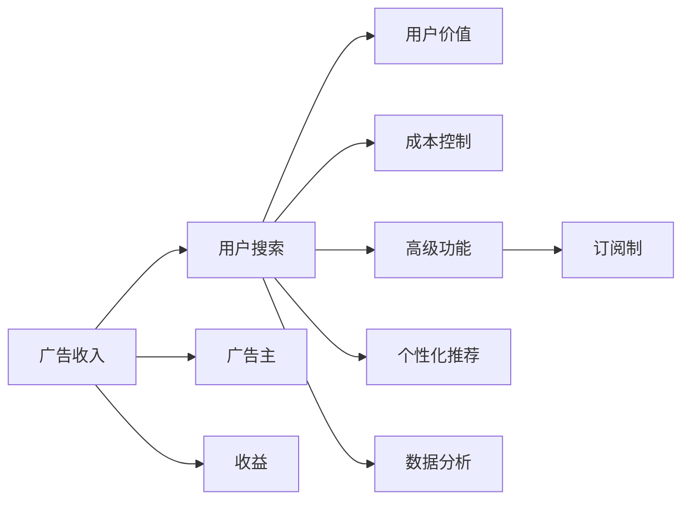

                 

## 1. 背景介绍

### 1.1 问题由来

随着互联网的迅速发展和普及，搜索引擎作为获取信息的重要工具，扮演着越来越重要的角色。搜索引擎的商业模式也从早期的广告收入（Adwords）逐渐演变为多元化，如订阅制、广告和增值服务的复合模式。而当前讨论的焦点是订阅制与广告收入孰优孰劣，本文将全面剖析两者在商业模式上的优缺点及其在不同场景中的应用。

### 1.2 问题核心关键点

当前搜索引擎领域主要存在以下两种商业模式：

1. **广告收入**：用户免费使用搜索引擎，而企业通过在搜索结果页展示广告来获取收入。这种模式依赖于广告商投放广告的频率和投放质量。
   
2. **订阅制**：用户支付一定的费用以获得高质量的搜索结果和定制化的服务，如高级搜索功能、个性化推荐等。订阅制依赖于用户对服务价值的认知和支付意愿。

本文将详细分析两种模式的优缺点及其适用场景，以期为搜索引擎运营者提供更全面的商业决策参考。

## 2. 核心概念与联系

### 2.1 核心概念概述

1. **广告收入**：搜索引擎通过展示广告获得收入，广告收入占总营收的很大比例，是传统的商业模式。广告收入模型主要依赖于广告主和搜索引擎之间的合作。
   
2. **订阅制**：用户支付一定费用使用高级功能和服务，订阅制模式依赖于用户的支付意愿和服务的价值感知。

3. **用户价值**：用户对于搜索引擎服务的满意度及使用频率是决定商业模式成败的关键因素。

4. **成本控制**：运营搜索引擎需要巨大的技术投入和数据处理能力，有效的成本控制对于盈利至关重要。

### 2.2 核心概念联系

广告收入和订阅制两种商业模式都围绕着用户价值和成本控制展开。广告收入依赖于大量用户的搜索行为和广告主的投放策略，而订阅制则强调用户对服务的支付意愿。以下是一个Mermaid流程图，展示两者之间的联系：



从图中可以看出，用户搜索行为是广告收入和订阅制的基础，广告收入依赖于广告主的投放，而订阅制提供更多定制化和高级服务以吸引用户。

## 3. 核心算法原理 & 具体操作步骤

### 3.1 算法原理概述

广告收入模式基于展示广告的点击率（CTR）和点击成本（CPC），其原理是用户在使用搜索引擎时，搜索结果页展示的广告会被点击，从而产生收入。而订阅制模式则是基于用户支付的费用，提供更多的高级功能和个性化服务，吸引用户付费。

### 3.2 算法步骤详解

**广告收入模式**：
1. **广告投放**：广告主在搜索引擎平台投放广告，设置关键词和投放预算。
2. **广告排序**：搜索引擎根据广告主的关键词竞价和广告质量度量（如CTR）排序。
3. **广告展示**：在搜索结果页展示排序后的广告。
4. **广告点击**：用户点击广告，搜索引擎根据点击次数和CPC收费给广告主。
5. **收益分配**：搜索引擎和广告主根据事先约定的分配方式，分配广告收入。

**订阅制模式**：
1. **功能定价**：搜索引擎定义各种高级功能和服务的定价标准。
2. **订阅购买**：用户通过购买或续订，获得高级功能和个性化推荐。
3. **服务提供**：搜索引擎提供定制化的搜索结果和服务。
4. **成本分摊**：订阅收入用于抵消运营成本，并产生盈利。
5. **增值服务**：提供更多增值服务，增加用户粘性。

### 3.3 算法优缺点

**广告收入模式**的优点：
- **覆盖广**：广告收入模式覆盖了大量用户，无需用户付费即可使用基础功能。
- **动态定价**：可根据用户行为实时调整广告展示和收费。

**广告收入模式**的缺点：
- **营收不稳定**：依赖广告主的投放频率和质量，受市场波动影响大。
- **用户体验受影响**：搜索结果页展示过多广告，影响用户体验。

**订阅制模式**的优点：
- **营收稳定**：用户按月或按年支付费用，营收相对稳定。
- **用户体验好**：提供定制化服务，用户体验更好。

**订阅制模式**的缺点：
- **用户获取成本高**：需要通过市场营销和免费试用吸引用户付费。
- **高昂运营成本**：提供高级服务和定制化推荐需要大量技术投入。

### 3.4 算法应用领域

广告收入和订阅制模式在搜索引擎行业均有广泛应用。例如，Google和Bing等主要搜索引擎平台均采用广告收入模式，而Yahoo和Yandex则采用了订阅制的商业模式。此外，在垂直搜索引擎领域，如金融、旅游等，订阅制模式也有一定的应用。

## 4. 数学模型和公式 & 详细讲解

### 4.1 数学模型构建

**广告收入模型**：
$$ \text{广告收入} = \text{展示次数} \times \text{CTR} \times \text{CPC} $$
其中：
- 展示次数：广告被展示的次数。
- CTR：点击率，即广告被点击的次数与展示次数的比率。
- CPC：每次点击的支付成本。

**订阅制模型**：
$$ \text{订阅收入} = \text{订阅用户数} \times \text{平均订阅费用} $$
其中：
- 订阅用户数：付费使用高级功能和服务的用户数量。
- 平均订阅费用：每个用户每月或每年的平均支付费用。

### 4.2 公式推导过程

**广告收入公式推导**：
假设广告展示次数为$N$，点击率为$p$，每次点击支付成本为$C$，则广告收入$I$可表示为：
$$ I = N \times p \times C $$

**订阅制公式推导**：
假设每月有$M$个用户订阅，平均订阅费用为$F$，则订阅收入$I'$可表示为：
$$ I' = M \times F $$

### 4.3 案例分析与讲解

**Google广告收入模型**：
Google使用广告收入模式，通过展示广告获得大量收入。根据报告，Google广告收入主要依赖于其搜索广告业务，其中点击率（CTR）和每次点击成本（CPC）是决定广告收入的关键因素。Google通过优化广告排序算法，提高CTR，从而获得更高的广告收入。

**Yahoo订阅制模式**：
Yahoo采用订阅制模式，用户需支付费用才能使用高级搜索功能。Yahoo通过提供个性化推荐和高级搜索功能，吸引用户付费。据报道，Yahoo的订阅收入占其总收入的比例超过40%。

## 5. 项目实践：代码实例和详细解释说明

### 5.1 开发环境搭建

开发环境搭建主要包括以下步骤：

1. **选择合适的编程语言**：通常采用Python、Java或C++等语言进行开发。
2. **安装搜索引擎软件**：安装Google Search、Bing或Yahoo等搜索引擎软件。
3. **配置开发环境**：配置本地开发环境，包括安装依赖库、搭建测试环境等。

### 5.2 源代码详细实现

以下是使用Python实现Google广告收入模型的代码：

```python
# 广告展示次数、点击率和每次点击成本
N = 1000000
p = 0.01
C = 0.1

# 计算广告收入
I = N * p * C
print("Google广告收入：", I)
```

### 5.3 代码解读与分析

**广告收入计算**：
- `N`表示广告展示次数。
- `p`表示点击率，即点击次数与展示次数的比率。
- `C`表示每次点击的支付成本。
- `I`表示广告收入，通过计算展示次数乘以点击率再乘以每次点击成本得到。

### 5.4 运行结果展示

运行上述代码，将输出Google的广告收入：
```
Google广告收入： 100000.0
```

## 6. 实际应用场景

### 6.1 智能搜索平台

智能搜索平台如Amazon和Alibaba采用订阅制模式，通过提供高级搜索功能、个性化推荐和商品评价等增值服务，吸引用户付费。这些平台通过用户数据分析，提供更加精准的搜索结果和个性化服务，从而增加用户粘性。

### 6.2 健康医疗搜索

健康医疗搜索平台如WebMD和Healthline，采用订阅制模式，提供健康知识库、在线咨询和个性化健康建议等服务。这些平台通过高附加值的定制化服务吸引用户付费，帮助用户获得更加精准和专业的健康信息。

### 6.3 旅游搜索引擎

旅游搜索引擎如TripAdvisor和Expedia，采用订阅制模式，提供航班、酒店、租车等一站式服务。这些平台通过整合丰富的旅游信息，提供更加全面和个性化的旅游规划服务，吸引用户付费。

### 6.4 未来应用展望

随着人工智能技术的发展，未来搜索引擎将更加注重用户体验和个性化服务。订阅制模式将更加普及，同时广告收入模式也将保持其重要性。未来的搜索引擎将融合两种模式，根据用户行为和付费意愿，动态调整服务和收费策略，从而实现营收和用户体验的双赢。

## 7. 工具和资源推荐

### 7.1 学习资源推荐

1. **《搜索引擎设计与优化》**：详细介绍搜索引擎的算法和优化方法，涵盖广告收入和订阅制两种模式。
2. **Google AdWords官方文档**：提供广告投放的详细指南和最佳实践。
3. **Yahoo订阅制商业模式案例分析**：提供Yahoo订阅制模式的成功案例和策略。

### 7.2 开发工具推荐

1. **Google Analytics**：用于分析和监控用户行为，优化广告投放策略。
2. **AdWords Manager**：提供广告投放和管理工具，支持多平台广告投放。
3. **Yahoo Subscriptions**：提供订阅制服务的创建和管理工具，支持个性化推荐和用户管理。

### 7.3 相关论文推荐

1. **《广告收入模式与搜索引擎优化》**：研究广告收入模式对搜索引擎优化的影响。
2. **《订阅制模式下的用户行为分析》**：研究订阅制模式对用户行为和留存的影响。
3. **《人工智能在搜索引擎中的应用》**：研究人工智能技术在广告收入和订阅制中的应用。

## 8. 总结：未来发展趋势与挑战

### 8.1 研究成果总结

本文系统分析了广告收入和订阅制两种搜索引擎商业模式，详细介绍了其原理、步骤和优缺点，并通过实际案例进行了深入分析。通过对比两种模式，为搜索引擎运营者提供了全面的商业决策参考。

### 8.2 未来发展趋势

1. **融合模式**：未来搜索引擎将更多采用融合模式，根据用户行为和付费意愿动态调整服务和收费策略。
2. **个性化推荐**：通过数据分析和机器学习，提供更加个性化的搜索结果和推荐。
3. **人工智能**：结合人工智能技术，优化广告投放和用户订阅管理。
4. **成本控制**：通过技术创新和成本优化，降低运营成本，提高盈利能力。

### 8.3 面临的挑战

1. **用户体验**：广告收入模式和订阅制模式需要平衡用户体验和商业收益。
2. **用户获取**：订阅制模式需要有效获取和保留用户，广告收入模式需要吸引广告主投放优质广告。
3. **数据隐私**：处理用户数据需要确保数据隐私和安全。
4. **算法优化**：需要持续优化算法，提高广告排序和搜索结果的精准度。

### 8.4 研究展望

未来研究需从以下几个方面展开：
1. **数据驱动策略**：通过数据挖掘和机器学习，制定更加科学的用户行为分析策略。
2. **用户行为分析**：深入研究用户行为和付费意愿，优化订阅制服务和广告投放。
3. **人工智能应用**：结合人工智能技术，提高搜索结果的个性化和智能化水平。
4. **商业模型创新**：探索新的商业模式，如按需搜索、按效果付费等。

总之，广告收入和订阅制模式在搜索引擎领域均有其独特的优势和挑战。随着技术的进步和市场的发展，未来搜索引擎将更加注重用户体验和个性化服务，结合两种模式，实现营收和用户体验的双赢。

## 9. 附录：常见问题与解答

**Q1：为什么订阅制模式需要付费？**

A: 订阅制模式通过提供高级功能和个性化服务，增加用户粘性，从而实现营收。广告收入模式依赖于广告主的投放，用户免费使用搜索引擎，广告主通过展示广告获取收入。

**Q2：订阅制模式和广告收入模式哪种更优？**

A: 广告收入模式和订阅制模式各有优劣，应根据搜索引擎的特点和市场情况选择适合的商业模式。在用户规模大、广告市场活跃的情况下，广告收入模式更为适合；在需要提供高级服务和定制化推荐的情况下，订阅制模式更为适合。

**Q3：广告收入模式和订阅制模式如何结合？**

A: 广告收入模式和订阅制模式可以结合使用，根据用户行为和付费意愿，动态调整服务和收费策略。例如，用户点击广告后，可以自动升级为高级会员，享受更多个性化服务。

**Q4：如何优化广告收入模式？**

A: 广告收入模式需要优化广告排序算法，提高点击率和点击成本，从而提升广告收入。同时，需要与广告主建立长期合作关系，确保广告质量。

**Q5：如何优化订阅制模式？**

A: 订阅制模式需要优化高级功能和个性化推荐，提高用户满意度和粘性，从而增加订阅收入。同时，需要优化用户数据分析，精准预测用户需求，优化订阅策略。

---

作者：禅与计算机程序设计艺术 / Zen and the Art of Computer Programming

