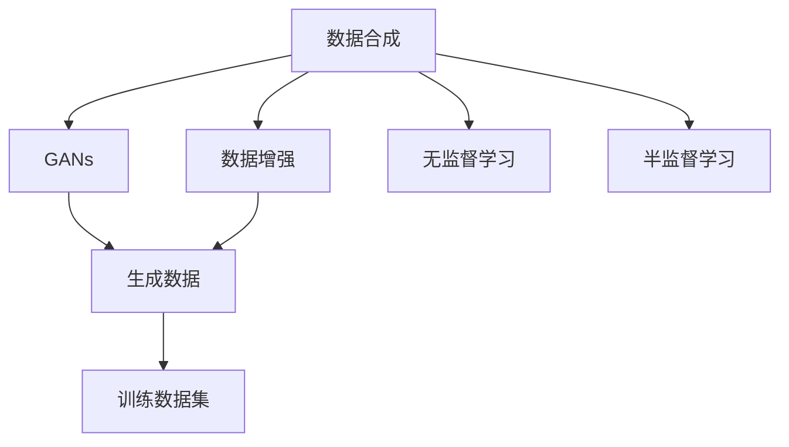

                 

# AI数据集构建：从收集到合成数据生成

> 关键词：数据集构建, 数据收集, 数据合成, 数据增强, 生成对抗网络(GANs), 无监督学习, 自监督学习

## 1. 背景介绍

在人工智能（AI）的各个分支领域，数据集构建是一个核心问题。无论是监督学习、半监督学习还是无监督学习，数据的质量、多样性和数量都直接影响模型的训练效果和泛化能力。传统上，数据集构建主要依赖于人工标注，不仅耗时耗力，还受制于数据收集范围和标注质量的局限。近年来，随着深度学习技术的发展，数据合成（data synthesis）和数据增强（data augmentation）等技术逐渐成为构建高质量AI数据集的新手段，大大扩展了数据收集的范围和多样性。

### 1.1 问题由来
随着AI技术的快速发展，深度学习在图像识别、自然语言处理、语音识别等领域的性能不断提升，其背后离不开高质量数据集的支撑。传统的数据集构建方法包括数据采集、数据标注、数据清洗等环节，耗费大量人力物力，且数据集质量和多样性受限于人工标注的局限。数据合成和数据增强技术为AI数据集的构建提供了新的可能性，通过自动生成数据或对已有数据进行变换，以扩充数据集规模，提高数据的多样性和泛化能力。

### 1.2 问题核心关键点
数据合成和数据增强是构建高质量AI数据集的核心技术。它们通过引入自动化的数据生成和变换手段，降低人工标注的依赖，扩展数据集规模，提高数据多样性，从而提升模型的泛化能力和鲁棒性。

数据合成技术通过生成假数据（如GANs），提供无法通过传统手段收集的数据，扩充数据集规模。而数据增强技术则通过对已有数据进行随机变换（如旋转、裁剪、颜色扰动等），增强数据的泛化能力。

数据合成和数据增强技术的优缺点如下：

- 数据合成：
  - **优点**：扩展数据集规模，丰富数据多样性，降低人工标注依赖。
  - **缺点**：生成的数据可能存在不真实性，泛化能力依赖于生成器质量。

- 数据增强：
  - **优点**：基于真实数据变换，生成多样化的训练样本，提高模型鲁棒性。
  - **缺点**：需要收集大量原始数据，变换方式有限，难以产生过于稀有的数据。

数据合成与数据增强技术的互补性，使得它们成为构建高质量AI数据集的重要手段。

## 2. 核心概念与联系

### 2.1 核心概念概述

为更好地理解数据合成和数据增强技术，本节将介绍几个密切相关的核心概念：

- 数据合成（Data Synthesis）：通过生成假数据或生成数据，扩展数据集规模，提供无法通过传统手段收集的数据。
- 数据增强（Data Augmentation）：通过对已有数据进行变换，生成多样化的训练样本，提高模型的泛化能力。
- 生成对抗网络（Generative Adversarial Networks, GANs）：一种通过对抗训练生成高逼真假数据的深度学习模型。
- 自监督学习（Self-Supervised Learning）：利用数据的自然结构，如掩码预测、语言模型预测等，进行无监督训练。
- 半监督学习（Semi-Supervised Learning）：结合少量标注数据和大量无标注数据，提高模型性能。

这些核心概念之间的逻辑关系可以通过以下Mermaid流程图来展示：



这个流程图展示数据合成、数据增强与无监督学习和半监督学习之间的关系：

1. 数据合成和数据增强通过生成多样化数据，为无监督学习和半监督学习提供丰富的训练样本。
2. 无监督学习利用数据的自然结构进行训练，与数据合成和数据增强相结合，提升模型性能。
3. 半监督学习结合少量标注数据和大量无标注数据，进一步提升模型效果。

这些概念共同构成了AI数据集构建的理论基础，帮助模型通过数据生成和数据变换手段，构建更加多样化和高质量的数据集，提升模型的泛化能力和鲁棒性。

## 3. 核心算法原理 & 具体操作步骤

### 3.1 算法原理概述

数据合成和数据增强技术通常依赖于深度学习模型进行实现。其核心思想是：利用模型的表示能力，将输入数据转换为新的数据样本，扩展数据集的规模和多样性。

具体而言，数据合成技术通过生成对抗网络（GANs）等模型，生成与真实数据高度相似但无法通过传统手段收集的数据，丰富训练集的多样性。数据增强技术则通过对现有数据进行变换，如旋转、裁剪、颜色扰动等，生成不同的训练样本，提高模型的泛化能力。

### 3.2 算法步骤详解

数据合成和数据增强的技术步骤包括：

**Step 1: 数据收集与预处理**
- 收集原始数据，进行清洗、去重、归一化等预处理操作，确保数据质量。
- 根据应用需求，选择合适的时间、空间、尺度等进行数据采集。

**Step 2: 数据增强**
- 选择合适的数据增强算法，如随机旋转、平移、缩放、裁剪、翻转等。
- 对数据进行随机变换，生成新的训练样本。
- 根据任务需求，设计合适的变换策略，如针对图像的随机扰动，针对文本的近义替换等。

**Step 3: 数据合成**
- 选择合适的生成模型，如GANs、VAE等。
- 定义生成器的损失函数，如GAN的对抗损失、VAE的重建损失等。
- 训练生成模型，生成假数据。

**Step 4: 数据集整合**
- 将原始数据和增强、合成的数据合并，形成完整的训练集。
- 对数据集进行划分，形成训练集、验证集和测试集。

**Step 5: 模型训练**
- 选择合适的深度学习模型，如CNN、RNN、Transformer等。
- 在处理后的数据集上进行模型训练。
- 根据训练效果调整超参数，如学习率、批大小、迭代次数等。

### 3.3 算法优缺点

数据合成和数据增强技术具有以下优点：

- **扩展数据集规模**：通过生成多样化数据，扩展数据集规模，降低标注数据需求。
- **提高数据多样性**：生成多样化的训练样本，提高模型的泛化能力。
- **降低标注成本**：减少人工标注的依赖，提高标注效率。

同时，这些技术也存在一些局限：

- **合成数据质量**：生成的数据可能存在不真实性，泛化能力依赖于生成器质量。
- **变换方式有限**：数据增强依赖于原始数据的变换，变换方式有限，难以产生过于稀有的数据。
- **计算成本高**：生成高质量数据和进行复杂变换需要较高的计算资源和时间。

### 3.4 算法应用领域

数据合成和数据增强技术在AI领域的各个分支中都有广泛应用，例如：

- 图像识别：通过对图像进行旋转、平移、缩放等变换，生成多样化的训练样本。
- 自然语言处理：通过近义替换、随机插入、随机删除等方式，生成多样化的文本样本。
- 语音识别：通过对音频信号进行变调、变速、降噪等变换，生成多样化的音频样本。
- 推荐系统：通过对用户行为数据进行增强和合成，生成新的用户行为样本，提高推荐效果。
- 自动驾驶：通过对传感器数据进行增强和合成，生成新的训练数据，提升模型鲁棒性。

除了上述这些经典应用外，数据合成和数据增强技术还在医疗、金融、交通等领域得到广泛应用，为AI技术的落地提供了坚实的数据基础。

## 4. 数学模型和公式 & 详细讲解  
### 4.1 数学模型构建

数据合成和数据增强技术的数学模型构建，通常包括生成模型、增强算法和损失函数的定义。以图像数据增强为例，其数学模型可以表示为：

$$
x' = f(x; \theta)
$$

其中，$x$ 表示原始图像，$x'$ 表示增强后的图像，$f$ 表示增强算法，$\theta$ 表示增强算法的参数。

### 4.2 公式推导过程

以图像数据增强为例，其核心公式可以推导如下：

- **随机旋转**：将图像随机旋转一定角度，生成新图像：
$$
x' = \begin{bmatrix}
\cos\theta & -\sin\theta \\
\sin\theta & \cos\theta
\end{bmatrix}
\begin{bmatrix}
x_{1} \\
x_{2}
\end{bmatrix}
$$
- **随机平移**：将图像随机平移一定距离，生成新图像：
$$
x' = x + \delta
$$
其中，$\delta$ 表示随机平移向量。

对于生成对抗网络（GANs），其核心公式可以表示为：

- **生成器**：定义生成器的损失函数：
$$
L_G = \mathbb{E}_{x}[\log D(G(z))]
$$
其中，$G$ 表示生成器，$D$ 表示判别器，$z$ 表示噪声向量，$\mathbb{E}$ 表示期望。

- **判别器**：定义判别器的损失函数：
$$
L_D = \mathbb{E}_{x}[\log D(x)] + \mathbb{E}_{z}[\log (1-D(G(z)))]
$$

### 4.3 案例分析与讲解

以图像数据增强为例，分析其在实际应用中的效果。

**案例1: 医学影像增强**
- 数据集：收集大量医学影像数据，包括正常影像和异常影像。
- 增强算法：随机旋转、翻转、裁剪等。
- 效果：提高模型的泛化能力，能够更好地识别细微的异常影像。

**案例2: 自然语言处理**
- 数据集：收集大量新闻、评论等文本数据。
- 增强算法：近义替换、随机插入、随机删除等。
- 效果：提高模型的鲁棒性，能够适应不同风格的输入。

## 5. 项目实践：代码实例和详细解释说明

### 5.1 开发环境搭建

在进行数据合成和数据增强的实践前，我们需要准备好开发环境。以下是使用Python进行PyTorch开发的环境配置流程：

1. 安装Anaconda：从官网下载并安装Anaconda，用于创建独立的Python环境。

2. 创建并激活虚拟环境：
```bash
conda create -n pytorch-env python=3.8 
conda activate pytorch-env
```

3. 安装PyTorch：根据CUDA版本，从官网获取对应的安装命令。例如：
```bash
conda install pytorch torchvision torchaudio cudatoolkit=11.1 -c pytorch -c conda-forge
```

4. 安装Pillow库：用于图像处理和增强。
```bash
pip install pillow
```

5. 安装sklearn库：用于数据增强和合成。
```bash
pip install scikit-learn
```

完成上述步骤后，即可在`pytorch-env`环境中开始数据合成和数据增强的实践。

### 5.2 源代码详细实现

这里我们以图像数据增强为例，给出使用PyTorch实现随机旋转、平移和缩放的代码实现。

```python
import torchvision.transforms as transforms
from PIL import Image
import numpy as np

# 定义数据增强
transform = transforms.Compose([
    transforms.RandomRotation(30),
    transforms.RandomHorizontalFlip(),
    transforms.RandomAffine(degrees=20, scale=(0.8, 1.2), shear=10),
])

# 加载图片
image = Image.open('image.jpg')

# 应用数据增强
transformed_image = transform(image)

# 保存增强后的图片
transformed_image.save('transformed_image.jpg')
```

代码实现步骤如下：

1. 引入PyTorch的transforms模块，并定义数据增强的变换策略。
2. 加载原始图片。
3. 应用数据增强策略，生成增强后的图片。
4. 保存增强后的图片。

### 5.3 代码解读与分析

在上述代码中，我们使用了PyTorch的transforms模块，定义了随机旋转、随机水平翻转和随机仿射变换等数据增强策略。这些策略通过组合，能够生成多样化的增强图像，提高模型的泛化能力。

在实际应用中，数据增强的参数选择和变换策略设计，需要根据具体任务进行调整。例如，对于医疗影像数据，可能需要更多的随机旋转和缩放，以捕捉影像的多角度和尺度变化。而对于自然语言处理任务，可能需要更多的随机替换和删除，以增加数据的多样性。

## 6. 实际应用场景
### 6.1 智能监控

在智能监控领域，数据增强技术可以用于生成多角度、多光照条件下的监控图像，提高模型的鲁棒性。通过随机旋转、缩放和裁剪等变换，生成多样化的监控图像，使得模型能够在不同的光照和角度下都能识别出入侵者。

### 6.2 自动驾驶

在自动驾驶领域，数据合成技术可以用于生成复杂的交通场景，提高模型的泛化能力。通过生成不同天气、交通状况、道路环境下的图像，模型能够在真实驾驶环境中表现出更高的适应性。

### 6.3 医学影像诊断

在医学影像诊断领域，数据增强技术可以用于生成多样化的医学影像，提高模型的泛化能力。通过随机旋转、平移和缩放等变换，生成多角度、多尺度的医学影像，使得模型能够在不同的影像分辨率和角度下都能准确识别出异常影像。

### 6.4 未来应用展望

随着数据合成和数据增强技术的不断发展，未来AI数据集构建将呈现以下几个趋势：

1. **生成模型多样化**：除了GANs，未来还将涌现更多类型的生成模型，如变分自编码器（VAE）、扩散模型等，提升数据合成的质量。
2. **数据增强自动化**：开发更加智能和自动化的数据增强算法，根据不同任务需求，自动设计合适的变换策略。
3. **数据合成与增强结合**：将数据合成与数据增强相结合，进一步扩展数据集规模，提高数据多样性。
4. **多模态数据增强**：扩展数据增强技术到多模态数据，如文本、音频、图像等，实现多模态数据的协同增强。
5. **元数据增强**：利用数据的元数据信息，进行数据增强，提高模型的解释性和可理解性。

## 7. 工具和资源推荐
### 7.1 学习资源推荐

为了帮助开发者系统掌握数据合成和数据增强的技术，这里推荐一些优质的学习资源：

1. **《深度学习中的数据增强》系列博文**：深入浅出地介绍了数据增强的原理、实践和应用，适合初学者入门。

2. **CS231n《卷积神经网络》课程**：斯坦福大学开设的计算机视觉课程，涵盖了数据增强的各种技术和应用。

3. **《Generative Adversarial Networks: An Overview》论文**：GANs的奠基性论文，详细介绍了GANs的原理和应用，适合进一步深入学习。

4. **《Deep Learning with PyTorch》书籍**：PyTorch官方文档，提供了丰富的示例代码，适合实际应用实践。

5. **HuggingFace官方文档**：Transformers库的官方文档，提供了各种预训练模型的数据增强和合成方法。

通过这些资源的学习实践，相信你一定能够快速掌握数据合成和数据增强的精髓，并用于解决实际的AI问题。

### 7.2 开发工具推荐

高效的开发离不开优秀的工具支持。以下是几款用于数据合成和数据增强开发的常用工具：

1. **PyTorch**：基于Python的开源深度学习框架，灵活的计算图和丰富的数据增强模块，适合快速迭代研究。

2. **TensorFlow**：由Google主导开发的开源深度学习框架，生产部署方便，适合大规模工程应用。

3. **Pillow**：Python Imaging Library的升级版，提供了丰富的图像处理和增强功能。

4. **sklearn**：Scikit-Learn机器学习库，提供了多种数据增强和合成算法。

5. **TensorBoard**：TensorFlow配套的可视化工具，可以实时监测模型训练状态，提供丰富的图表呈现方式。

6. **Weights & Biases**：模型训练的实验跟踪工具，可以记录和可视化模型训练过程中的各项指标，方便对比和调优。

合理利用这些工具，可以显著提升数据合成和数据增强任务的开发效率，加快创新迭代的步伐。

### 7.3 相关论文推荐

数据合成和数据增强技术的发展源于学界的持续研究。以下是几篇奠基性的相关论文，推荐阅读：

1. **ImageNet Classification with Deep Convolutional Neural Networks**：AlexNet论文，引入了大规模数据集和深度卷积神经网络，推动了图像分类技术的进步。

2. **Beyond Measuring performance on ImageNet**：提出了ImageNet以外的数据集，推动了数据增强技术的发展。

3. **CycleGAN: Learning to Drive Unpaired Images from Unpaired Images**：CycleGAN论文，提出了无对数据生成技术，扩展了数据合成的范围。

4. **An Image Is Worth A Thousand Words**：提出了图像描述生成技术，推动了多模态数据增强的发展。

5. **Deep Residual Learning for Image Recognition**：ResNet论文，提出了残差网络结构，推动了深度学习模型的发展。

这些论文代表了大数据集构建技术的演进脉络。通过学习这些前沿成果，可以帮助研究者把握学科前进方向，激发更多的创新灵感。

## 8. 总结：未来发展趋势与挑战

### 8.1 总结

本文对数据合成和数据增强技术进行了全面系统的介绍。首先阐述了数据合成和数据增强技术的背景和意义，明确了其在AI数据集构建中的重要作用。其次，从原理到实践，详细讲解了数据增强和数据合成的数学模型和关键步骤，给出了具体的代码实现和分析。同时，本文还广泛探讨了这些技术在智能监控、自动驾驶、医学影像诊断等多个领域的应用前景，展示了其巨大的潜力和广泛的应用价值。此外，本文精选了数据合成和数据增强技术的各类学习资源，力求为读者提供全方位的技术指引。

通过本文的系统梳理，可以看到，数据合成和数据增强技术正在成为AI数据集构建的重要手段，极大地拓展了数据收集的范围和多样性，提升模型的泛化能力和鲁棒性。未来，伴随生成模型和增强算法的不断演进，数据合成和数据增强技术必将在构建高质量AI数据集方面发挥更大作用。

### 8.2 未来发展趋势

展望未来，数据合成和数据增强技术将呈现以下几个发展趋势：

1. **生成模型多样化**：除了GANs，未来还将涌现更多类型的生成模型，如VAE、扩散模型等，提升数据合成的质量。

2. **数据增强自动化**：开发更加智能和自动化的数据增强算法，根据不同任务需求，自动设计合适的变换策略。

3. **数据合成与增强结合**：将数据合成与数据增强相结合，进一步扩展数据集规模，提高数据多样性。

4. **多模态数据增强**：扩展数据增强技术到多模态数据，如文本、音频、图像等，实现多模态数据的协同增强。

5. **元数据增强**：利用数据的元数据信息，进行数据增强，提高模型的解释性和可理解性。

这些趋势凸显了数据合成和数据增强技术的发展前景，为构建高质量AI数据集提供了新的方向。

### 8.3 面临的挑战

尽管数据合成和数据增强技术已经取得了显著进展，但在应用过程中仍面临诸多挑战：

1. **生成数据质量**：生成的数据可能存在不真实性，泛化能力依赖于生成器质量。

2. **计算成本高**：生成高质量数据和进行复杂变换需要较高的计算资源和时间。

3. **数据多样性有限**：数据增强依赖于原始数据的变换，变换方式有限，难以产生过于稀有的数据。

4. **过拟合风险**：生成的数据可能存在过拟合风险，模型容易陷入局部最优。

5. **数据分布偏差**：生成的数据可能存在分布偏差，影响模型的泛化能力。

这些挑战需要未来的研究在生成器质量、计算效率、变换策略等方面进行优化，才能真正发挥数据合成和数据增强技术的潜力。

### 8.4 研究展望

面对数据合成和数据增强面临的挑战，未来的研究需要在以下几个方面寻求新的突破：

1. **生成模型优化**：开发更加高效和逼真的生成模型，提高数据合成的质量。

2. **增强算法优化**：设计更加智能和自动化的数据增强算法，根据不同任务需求，自动设计合适的变换策略。

3. **数据质量控制**：开发数据质量评估和控制算法，确保生成的数据具有高质量和多样性。

4. **模型鲁棒性提升**：提高模型对生成数据的鲁棒性，避免过拟合和分布偏差。

5. **多模态数据增强**：扩展数据增强技术到多模态数据，实现多模态数据的协同增强。

6. **元数据利用**：利用数据的元数据信息，进行数据增强，提高模型的解释性和可理解性。

这些研究方向将推动数据合成和数据增强技术向更加高效、自动和智能的方向发展，为构建高质量AI数据集提供更强大的技术支持。

## 9. 附录：常见问题与解答

**Q1: 数据增强和数据合成有什么区别？**

A: 数据增强和数据合成都是数据扩充技术，但具体实现方式不同。数据增强通过随机变换已有数据，生成新的训练样本，提高模型的泛化能力。数据合成则通过生成对抗网络等模型，生成与真实数据高度相似但无法通过传统手段收集的数据，扩展数据集规模。

**Q2: 如何选择合适的数据增强算法？**

A: 选择合适的数据增强算法，需要考虑任务需求和数据特征。例如，对于图像数据，可以采用随机旋转、平移、缩放等变换；对于文本数据，可以采用近义替换、随机插入、随机删除等变换。同时，也可以结合多种变换策略，进一步增强数据的多样性。

**Q3: 数据合成和数据增强对计算资源的需求有哪些？**

A: 数据合成和数据增强对计算资源的需求较高。生成高质量数据和进行复杂变换需要较高的计算资源和时间。建议根据计算资源情况，合理选择数据增强算法和生成模型，避免过拟合和计算过载。

**Q4: 数据合成和数据增强在实际应用中需要注意哪些问题？**

A: 在实际应用中，需要注意以下问题：

1. 数据质量控制：确保生成的数据具有高质量和多样性，避免过拟合和分布偏差。
2. 计算效率优化：优化数据生成和变换的计算效率，避免过高的计算成本。
3. 模型鲁棒性提升：提高模型对生成数据的鲁棒性，避免过拟合和分布偏差。
4. 数据分布匹配：确保生成的数据与真实数据分布一致，避免模型泛化能力的下降。

这些问题的有效解决，需要综合运用数据质量评估、计算优化、模型鲁棒性提升等技术手段。

通过本文的系统梳理，可以看到，数据合成和数据增强技术正在成为AI数据集构建的重要手段，极大地拓展了数据收集的范围和多样性，提升模型的泛化能力和鲁棒性。未来，伴随生成模型和增强算法的不断演进，数据合成和数据增强技术必将在构建高质量AI数据集方面发挥更大作用。

