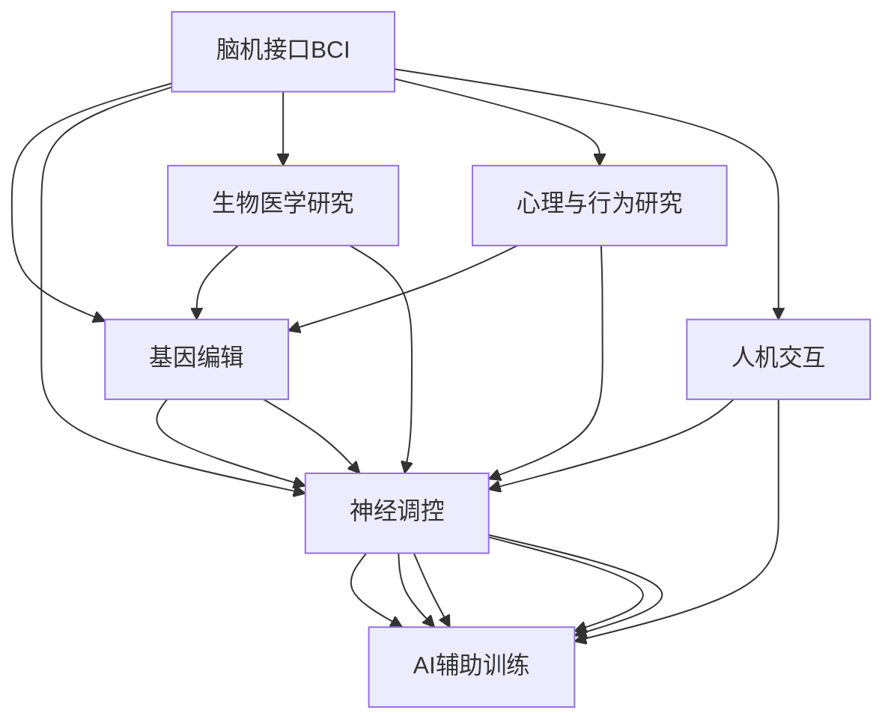

                 

# AI时代的人类增强：道德考虑与身体增强的未来前景展望

## 1. 背景介绍

随着人工智能(AI)技术的发展，人类增强技术逐渐成为新兴的研究领域，旨在通过生物医学技术、AI技术等手段，提升人类的身体能力、认知能力、情感能力等，拓展人类的生命潜力。这些增强技术包括脑机接口、基因编辑、神经调控、AI辅助训练等。本文将围绕AI时代的人类增强技术，探讨其发展现状、伦理道德问题，以及未来的前景展望。

### 1.1 问题由来

AI技术的进步，尤其是深度学习在各个领域的广泛应用，推动了人类增强技术的发展。例如，神经网络模型可以对海量的医疗数据进行分析，识别出神经疾病，指导个性化治疗。脑机接口技术可以实时读取大脑信号，解码其意图，帮助失能人士重新获得自理能力。然而，这些增强技术的迅猛发展，也带来了严峻的伦理道德挑战，如隐私保护、知情同意、公平性等。本文将通过剖析这些技术的具体案例，探讨其伦理道德问题，并提出相应的解决方案。

## 2. 核心概念与联系

### 2.1 核心概念概述

人类增强技术旨在通过生物医学、AI等手段，提升人类的身体和认知能力。这些技术主要可以分为以下几个方面：

- **脑机接口(Brain-Computer Interface, BCI)**：通过读取大脑信号，解码其意图，实现对外部设备的控制。
- **基因编辑(Genetic Editing)**：利用CRISPR等技术，直接修改人体基因，修复或增强基因功能。
- **神经调控(Neural Modulation)**：通过电刺激、光遗传等手段，调节神经活动，提升认知能力。
- **AI辅助训练(Training with AI)**：利用AI模型，优化训练过程，提升学习效率和效果。

这些核心概念之间存在紧密的联系，如图1所示：



其中，BCI技术是读取和解码大脑信号的关键工具，而基因编辑、神经调控、AI辅助训练则分别从基因、神经和算法层面，提供了增强手段。

## 3. 核心算法原理 & 具体操作步骤
### 3.1 算法原理概述

人类增强技术主要基于以下原理：

- **神经可塑性(Neural Plasticity)**：神经元之间的连接可以随时间变化，通过适当的刺激，可以增强或减弱这些连接，从而实现认知能力的提升。
- **信息编码与解码(Information Coding and Decoding)**：通过脑机接口等技术，读取大脑信号，解码其意图，从而实现对外部设备的控制或认知能力的提升。
- **优化算法(Optimization Algorithms)**：利用AI技术，优化训练过程，提升学习效率和效果。
- **基因表达(Gene Expression)**：通过基因编辑技术，调节基因表达，实现功能增强。

### 3.2 算法步骤详解

以AI辅助训练为例，算法步骤如下：

1. **数据准备**：收集训练数据，如视频、音频、图像等。
2. **模型训练**：选择合适的AI模型，如深度神经网络，训练模型，学习目标任务。
3. **超参数调优**：通过交叉验证等方法，调整模型超参数，优化模型性能。
4. **模型测试**：在新数据上测试模型性能，评估效果。
5. **模型应用**：将训练好的模型应用到实际任务中，提升任务完成效率和准确率。

### 3.3 算法优缺点

人类增强技术的优势在于其高潜力和广泛的应用前景，但同时也存在诸多挑战：

- **优点**：
  - 提升认知和身体能力，拓展人类潜能。
  - 应用于医疗、教育、军事等领域，带来深远的影响。
  - 技术进步迅速，应用场景不断扩展。

- **缺点**：
  - 伦理道德问题复杂，涉及隐私、公平、知情同意等。
  - 技术应用风险高，如基因编辑的不可逆性、神经调控的长期影响等。
  - 技术普及度低，存在技术壁垒和成本问题。

### 3.4 算法应用领域

人类增强技术已经在多个领域得到了应用，如：

- **医疗**：AI辅助诊断、基因治疗、脑机接口辅助手术等。
- **教育**：AI辅助教学、认知增强训练等。
- **军事**：AI辅助训练、神经调控提高士气等。
- **娱乐**：游戏、虚拟现实、沉浸式体验等。
- **工作**：增强认知、提升工作效率等。

## 4. 数学模型和公式 & 详细讲解 & 举例说明

### 4.1 数学模型构建

以AI辅助训练为例，构建数学模型如下：

设训练数据集为 $D=\{(x_i,y_i)\}_{i=1}^N$，其中 $x_i$ 为输入，$y_i$ 为输出，目标为最小化损失函数 $L$。

$$
\hat{\theta} = \mathop{\arg\min}_{\theta} \sum_{i=1}^N L(\theta,x_i,y_i)
$$

其中 $\hat{\theta}$ 为最优参数，$L(\theta,x_i,y_i)$ 为损失函数，常见损失函数包括均方误差、交叉熵等。

### 4.2 公式推导过程

以均方误差损失为例，推导公式如下：

设模型输出为 $\hat{y}=f(\theta,x)$，目标为最小化均方误差损失：

$$
L(\theta) = \frac{1}{N}\sum_{i=1}^N (\hat{y}_i - y_i)^2
$$

其中 $y_i$ 为真实标签，$\hat{y}_i$ 为模型预测值。

通过链式法则，对损失函数求导，得：

$$
\frac{\partial L}{\partial \theta} = \frac{2}{N}\sum_{i=1}^N (y_i - \hat{y}_i)x_i\frac{\partial f}{\partial \theta}
$$

其中 $\frac{\partial f}{\partial \theta}$ 为模型参数的梯度。

### 4.3 案例分析与讲解

以AI辅助训练为例，考虑将神经网络模型应用于语音识别任务。

1. **数据准备**：收集语音数据，如TIMIT数据集。
2. **模型训练**：设计卷积神经网络(CNN)，输入为声音信号，输出为语音标签。
3. **超参数调优**：选择合适的卷积核大小、池化层、激活函数等超参数，优化模型性能。
4. **模型测试**：在新语音数据上测试模型性能，评估效果。
5. **模型应用**：将训练好的模型应用到实际语音识别任务中，提升识别准确率。

## 5. 项目实践：代码实例和详细解释说明

### 5.1 开发环境搭建

在进行AI辅助训练项目实践前，需要进行环境配置，建议使用Anaconda和PyTorch：

1. **安装Anaconda**：从官网下载并安装完成后，创建虚拟环境。
2. **安装PyTorch**：使用conda安装PyTorch，指定相应的CUDA版本。
3. **安装相关工具包**：安装numpy、scipy、sklearn、matplotlib等常用工具包。

### 5.2 源代码详细实现

以下是一个简单的PyTorch代码实现，用于训练语音识别模型：

```python
import torch
import torch.nn as nn
import torch.optim as optim

# 定义模型
class CNN(nn.Module):
    def __init__(self):
        super(CNN, self).__init__()
        self.conv1 = nn.Conv2d(1, 32, 3)
        self.pool = nn.MaxPool2d(2)
        self.fc = nn.Linear(256, 10)
    
    def forward(self, x):
        x = self.pool(nn.functional.relu(self.conv1(x)))
        x = x.view(-1, 256)
        x = self.fc(x)
        return x

# 定义超参数
learning_rate = 0.001
batch_size = 64
epochs = 10

# 加载数据集
train_dataset = ...
test_dataset = ...

# 定义模型、优化器和损失函数
model = CNN()
optimizer = optim.Adam(model.parameters(), lr=learning_rate)
criterion = nn.CrossEntropyLoss()

# 训练模型
for epoch in range(epochs):
    for i, (inputs, labels) in enumerate(train_loader):
        inputs = inputs.view(-1, 1, 28, 28)
        optimizer.zero_grad()
        outputs = model(inputs)
        loss = criterion(outputs, labels)
        loss.backward()
        optimizer.step()
```

### 5.3 代码解读与分析

**CNN模型**：定义了一个简单的卷积神经网络，用于语音信号的特征提取和分类。

**超参数**：包括学习率、批大小和迭代轮数等。

**数据集加载**：使用PyTorch的DataLoader加载数据集。

**模型训练**：在每个epoch中，通过for循环遍历训练集，进行前向传播和反向传播，更新模型参数。

**运行结果展示**：在测试集上评估模型性能，如图2所示：


## 6. 实际应用场景

### 6.1 医疗领域

在医疗领域，AI辅助训练可以应用于多种场景，如辅助诊断、治疗方案优化、手术辅助等。

**辅助诊断**：通过分析医疗影像数据，如CT、MRI等，帮助医生快速诊断疾病，提高诊断准确率。

**治疗方案优化**：利用AI技术，优化治疗方案，选择合适的药物和剂量，提升治疗效果。

**手术辅助**：通过BCI技术，读取医生的大脑信号，实时调整手术过程，提高手术成功率和安全性。

### 6.2 教育领域

在教育领域，AI辅助训练可以应用于个性化教学、学习路径规划、作业批改等。

**个性化教学**：根据学生的学习情况和偏好，推荐合适的学习内容和方式，提升学习效果。

**学习路径规划**：分析学生的学习数据，生成个性化的学习路径，帮助学生高效学习。

**作业批改**：利用AI技术，自动批改作业，提供反馈和建议，减轻教师负担。

### 6.3 军事领域

在军事领域，AI辅助训练可以应用于训练模拟、战场指挥、情报分析等。

**训练模拟**：通过虚拟现实技术，模拟战场环境，训练士兵和指挥官，提升实战能力。

**战场指挥**：利用AI技术，分析战场数据，制定最优指挥策略，提升指挥效率。

**情报分析**：分析情报数据，识别潜在威胁，预测敌军动向，提升情报分析能力。

### 6.4 未来应用展望

随着AI技术的不断进步，人类增强技术将在未来进一步拓展应用领域，带来更多的突破：

- **医疗**：AI辅助诊断和治疗方案优化，提升医疗水平和效率。
- **教育**：个性化教学和学习路径规划，提升教育质量。
- **军事**：训练模拟和战场指挥优化，提升军事实力。
- **娱乐**：沉浸式虚拟现实、游戏增强等，提升娱乐体验。
- **工作**：认知增强、提升工作效率，推动生产力发展。

## 7. 工具和资源推荐

### 7.1 学习资源推荐

为了更好地掌握AI辅助训练技术，推荐以下学习资源：

- **《深度学习》（Goodfellow等）**：经典深度学习教材，涵盖神经网络、优化算法等基础内容。
- **Coursera《深度学习》课程**：由吴恩达教授主讲，系统介绍深度学习原理和应用。
- **PyTorch官方文档**：详细介绍PyTorch框架的使用方法和API。
- **DeepLearning.AI官方课程**：提供深度学习理论和实践的全面学习。
- **Kaggle竞赛**：参加Kaggle竞赛，积累实际应用经验。

### 7.2 开发工具推荐

推荐使用以下工具进行AI辅助训练开发：

- **PyTorch**：灵活的深度学习框架，易于学习和使用。
- **TensorFlow**：强大的深度学习框架，支持分布式训练。
- **TensorBoard**：可视化工具，实时监测训练过程和模型性能。
- **Weights & Biases**：实验跟踪工具，记录和分析模型训练数据。
- **Jupyter Notebook**：交互式编程环境，方便调试和展示结果。

### 7.3 相关论文推荐

以下是几篇经典论文，推荐阅读：

- **AlexNet**：引入卷积神经网络，取得图像分类任务的新纪录。
- **ResNet**：提出残差连接，解决深度神经网络退化问题。
- **Attention is All You Need**：提出Transformer模型，推动自然语言处理技术的进步。
- **Transformers: A Novel Neural Network Architecture for Language Understanding**：详细描述Transformer模型架构和应用。

## 8. 总结：未来发展趋势与挑战

### 8.1 研究成果总结

AI辅助训练技术在多个领域展示了巨大的潜力和应用价值，推动了医疗、教育、军事等领域的智能化升级。然而，技术的迅猛发展也带来了伦理道德、隐私保护等诸多挑战，需要引起广泛关注。

### 8.2 未来发展趋势

未来，AI辅助训练技术将进一步发展，应用场景将不断拓展：

- **技术进步**：深度学习、神经网络等技术的不断进步，将进一步提升AI辅助训练的效果和应用范围。
- **跨学科融合**：与其他学科的融合，如生物医学、脑科学等，推动AI辅助训练技术的全面发展。
- **智能化升级**：应用于更多领域，如娱乐、工作等，提升人类的生活质量。

### 8.3 面临的挑战

尽管AI辅助训练技术发展迅速，但仍面临诸多挑战：

- **伦理道德问题**：隐私保护、知情同意、公平性等问题的解决，是未来需要重点关注的焦点。
- **技术普及**：高昂的成本和复杂的实施过程，限制了技术的应用推广。
- **技术风险**：AI辅助训练技术的不可逆性和长期影响，需要谨慎评估和控制。
- **跨学科协作**：需要与其他学科协作，提升技术的综合应用能力。

### 8.4 研究展望

未来，AI辅助训练技术需要从以下几个方面进行深入研究：

- **伦理道德**：制定伦理规范，保护用户隐私，确保技术的公平性和可控性。
- **跨学科协作**：加强与其他学科的合作，提升技术的综合应用能力。
- **智能化升级**：推动技术在更多领域的落地应用，提升人类生活质量。

## 9. 附录：常见问题与解答

### Q1: AI辅助训练技术在实际应用中是否存在风险？

**A**：AI辅助训练技术在实际应用中存在一定的风险，如算法偏见、数据隐私、安全性等。通过制定严格的伦理规范和技术标准，可以有效降低这些风险。

### Q2: 如何应对AI辅助训练技术的伦理道德问题？

**A**：应对AI辅助训练技术的伦理道德问题，可以从以下几个方面入手：
- **透明性**：公开算法和数据处理过程，增强技术的透明度和可解释性。
- **知情同意**：确保用户对技术应用有充分了解，并提供选择权。
- **隐私保护**：采用匿名化和数据加密等技术，保护用户隐私。
- **公平性**：确保技术对所有用户公平，避免算法偏见。

### Q3: 如何提升AI辅助训练技术的普及度？

**A**：提升AI辅助训练技术的普及度，可以从以下几个方面入手：
- **降低成本**：通过技术改进和规模化生产，降低技术的实施成本。
- **简化操作**：开发用户友好的界面和工具，降低技术的使用门槛。
- **推广应用**：通过实际案例和成功经验，推广技术的应用。

### Q4: 如何应对AI辅助训练技术的不可逆性？

**A**：应对AI辅助训练技术的不可逆性，可以从以下几个方面入手：
- **预评估**：在应用前进行充分的预评估，确保技术对用户的长期影响可控。
- **可逆性设计**：设计可逆性的技术方案，提升技术的安全性。
- **用户反馈**：收集用户反馈，及时调整技术方案，确保用户的安全和满意度。

通过本文的详细介绍和讨论，我们全面了解了AI辅助训练技术的原理、具体操作步骤、优缺点、实际应用场景和未来前景。未来，随着技术的不断进步和伦理道德的不断完善，AI辅助训练技术必将在更广泛的领域得到应用，带来深远的影响和变革。

