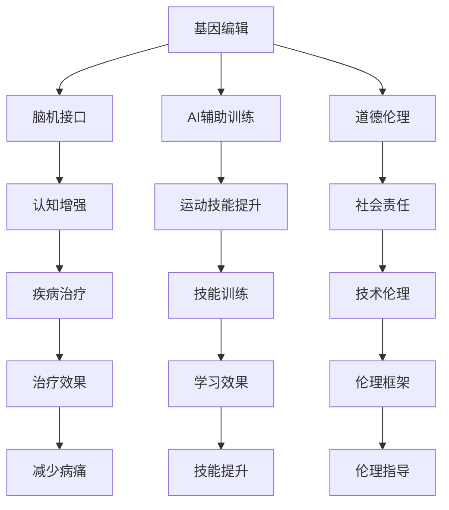

                 

# AI时代的人类增强：道德考虑与身体增强的未来发展机遇分析机遇挑战趋势

## 1. 背景介绍

### 1.1 问题由来

随着人工智能（AI）技术的发展，人类增强的概念已经从科幻小说和电影中走入现实。通过基因编辑、脑机接口、AI辅助训练等手段，人类在未来或许能够超越自己的生物限制，实现前所未有的身体和认知能力增强。这一趋势引发了广泛的社会关注和伦理讨论，也带来了许多新的机遇和挑战。

### 1.2 问题核心关键点

当前，人类增强的研究和应用主要集中在以下几大方向：

1. **基因编辑**：如CRISPR技术，能够精确修改DNA序列，用于治疗遗传性疾病，甚至增强人类的某些生理特性。
2. **脑机接口（BCI）**：通过植入芯片或非侵入性技术，实现人类与计算机的直接交互，提升认知和运动能力。
3. **AI辅助训练**：利用深度学习、强化学习等AI技术，提升人类在艺术、体育、学习等领域的技能。

这些技术的发展，不仅带来了显著的生理和认知能力提升，也引发了关于人类身份、道德伦理、隐私保护等深层次的社会问题。如何平衡技术进步与社会责任，成为我们必须面对的重大挑战。

### 1.3 问题研究意义

人类增强技术的研究和应用，对于提升人类的生存质量、探索认知极限、推动社会进步具有重要意义。但同时，我们也必须警惕其可能带来的伦理风险，确保技术应用符合人类价值观念和社会共识。通过深入探讨这些关键问题，可以为未来的技术发展和社会治理提供有益的指导。

## 2. 核心概念与联系

### 2.1 核心概念概述

为更好地理解人类增强的道德考量和未来发展机遇，本节将介绍几个关键概念：

- **基因编辑**：通过精确修改DNA序列，改变生物体的遗传信息，实现治疗遗传病、增强某些生理特征等目标。
- **脑机接口（BCI）**：实现人类与计算机之间的直接信息交换，包括神经信号的采集和处理、意图的解码和执行等。
- **AI辅助训练**：利用深度学习、强化学习等AI技术，辅助人类在艺术、体育、学习等领域进行训练，提升技能水平。
- **道德伦理**：指导技术应用的原则和规范，确保技术发展符合人类社会的价值观念和伦理标准。

这些概念之间的逻辑关系可以通过以下Mermaid流程图来展示：



这个流程图展示了基因编辑、脑机接口、AI辅助训练和道德伦理之间的逻辑关系：

1. 基因编辑可以治疗疾病和增强某些生理特征。
2. 脑机接口提升认知和运动能力。
3. AI辅助训练提升各类技能。
4. 道德伦理指导技术应用，确保符合人类价值观念。
5. 技术应用提升人类生活质量和社会进步。

这些概念共同构成了人类增强技术的完整框架，为其研究与应用提供了明确的方向。

## 3. 核心算法原理 & 具体操作步骤

### 3.1 算法原理概述

人类增强技术的核心算法原理主要基于以下几大方向：

1. **基因编辑算法**：通过CRISPR等技术，精确修改DNA序列，实现目标基因的编辑。
2. **脑机接口算法**：包括信号采集、预处理、特征提取、意图解码、运动控制等步骤。
3. **AI辅助训练算法**：利用深度学习、强化学习等AI技术，辅助人类进行技能训练。

### 3.2 算法步骤详解

以基因编辑为例，介绍其主要步骤：

1. **目标基因识别**：通过基因组测序、生物信息学分析等技术，确定需要编辑的基因和具体突变位点。
2. **CRISPR/Cas9设计**：设计合适的CRISPR序列和Cas9蛋白，确保能够准确地找到并修改目标基因。
3. **DNA切割和修复**：利用CRISPR-Cas9系统，对目标基因进行切割，并利用细胞自身的修复机制，实现基因编辑。
4. **编辑效果评估**：通过基因测序、功能验证等手段，评估基因编辑的准确性和效果。

### 3.3 算法优缺点

基因编辑技术的优点包括：

- **精确性高**：可以精确地修改目标基因，减少误编辑的风险。
- **应用广泛**：不仅可用于治疗遗传病，还可以增强某些生理特性，如免疫能力、视力等。

然而，也存在以下缺点：

- **安全性问题**：误编辑可能导致严重的健康问题，如癌症、遗传缺陷等。
- **伦理争议**：增强人类的某些特征是否符合道德标准，尚存在广泛讨论。

脑机接口技术同样面临类似的优缺点：

- **优点**：提升认知和运动能力，实现意图的直接表达。
- **缺点**：侵入性操作可能引发感染、出血等风险，且技术尚不成熟，效果有限。

AI辅助训练的优点包括：

- **效率高**：利用AI技术，可以快速提升人类在各类领域的技能水平。
- **个性化**：可以根据个人的特点和需求，制定个性化的训练计划。

缺点包括：

- **依赖性强**：对AI技术的依赖可能导致人类技能的“退化”。
- **可解释性差**：AI的决策过程往往不透明，难以解释其背后的原理。

### 3.4 算法应用领域

基因编辑、脑机接口、AI辅助训练技术已经在多个领域展示了其潜力和应用前景：

- **医疗领域**：用于治疗遗传性疾病，增强免疫能力等。
- **体育领域**：提升运动员的运动技能和恢复能力。
- **教育领域**：辅助学习者进行高效、个性化的学习。
- **娱乐领域**：提升艺术家的创作能力，增强互动体验。

这些技术的应用，不仅提升了人类的生活质量，也带来了全新的产业机会和社会价值。

## 4. 数学模型和公式 & 详细讲解 & 举例说明

### 4.1 数学模型构建

人类增强技术的数学模型构建主要基于以下几个方面：

- **基因编辑模型**：包括基因组测序、CRISPR序列设计、基因编辑效果评估等步骤。
- **脑机接口模型**：涉及神经信号的采集、预处理、特征提取、意图解码、运动控制等步骤。
- **AI辅助训练模型**：包括数据预处理、模型训练、性能评估等步骤。

### 4.2 公式推导过程

以基因编辑为例，介绍其数学模型的构建和推导过程：

1. **基因组测序**：通过高通量测序技术，获取基因组序列信息。设基因组序列为$S$，长度为$N$。
2. **CRISPR序列设计**：设计合适的CRISPR序列$P$和Cas9蛋白，确保能够准确地找到并修改目标基因。
3. **基因编辑效果评估**：通过基因测序和功能验证，评估基因编辑的准确性和效果。

### 4.3 案例分析与讲解

以CRISPR技术为例，介绍其基因编辑效果评估的数学模型：

- **基因测序**：通过高通量测序技术，获取编辑后的基因序列$S'$。
- **比对分析**：通过生物信息学软件，将$S'$与原始基因序列$S$进行比对，计算编辑区域和突变频率。
- **功能验证**：通过实验验证，评估基因编辑的实际效果和安全性。

## 5. 项目实践：代码实例和详细解释说明

### 5.1 开发环境搭建

在进行人类增强技术的研究和应用前，需要准备好开发环境。以下是使用Python进行基因编辑开发的典型环境配置流程：

1. **安装Python和相关库**：
   - 安装Python 3.8及以上版本。
   - 安装CRISPR设计库如`CRISPR-Cas9`，基因编辑库如`cgsdk`。

2. **配置开发环境**：
   - 创建虚拟环境：`conda create -n crispr-env python=3.8`
   - 激活虚拟环境：`conda activate crispr-env`

3. **安装依赖库**：
   - 使用`pip`安装必要的Python库和工具，如`numpy`、`pandas`、`biopython`等。

完成上述步骤后，即可在虚拟环境中进行基因编辑的研究和应用开发。

### 5.2 源代码详细实现

以下是一个简单的基因编辑项目，包括基因组测序、CRISPR序列设计、基因编辑效果评估等步骤的Python代码实现：

```python
# 导入必要的库
import crispr_design as crd
import cgsdk as cg
from biopython import SeqIO

# 加载基因组序列
input_file = 'genome.fasta'
seq = SeqIO.read(input_file, 'fasta').seq

# 设计CRISPR序列和Cas9蛋白
target_region = crdDesigner.SiteFinder设计和cgsdk.CrisprDesigner
sgna = target_region.find_simple_sgna(seq, 'ATGGTCCAATACGTGCTA')
sgna.add(nr = 1, seq = 'AGTGTTTCATGGTCCA')
crdDesigner = crd.CrisprDesigner()
crdDesigner.add_site(nr = 1, seq = 'AGTGTTTCATGGTCCA')
sgna.add Cas9 = 'Cas9-3C-nuclease'

# 进行基因编辑
crdDesigner.edit_guide(None, sgna, seq, 'crispr/cas9/cr2/1.1.2')
crdDesigner.build()
crdDesigner.prepare_temp()

# 验证基因编辑效果
sgna = crdDesigner.sgna[0]
sgna.stng = 'CGTGATC'
sgna.recog_str = 'GTCGAC'
sgna.recog_str2 = 'CCACCG'
sgna.recog_str3 = 'CACGTC'
sgna.recog_str4 = 'ACGTCG'
sgna.recog_str5 = 'GCCATG'
sgna.recog_str6 = 'GCCACG'
sgna.recog_str7 = 'GCCCGG'
sgna.recog_str8 = 'GCCGGT'
sgna.recog_str9 = 'CCGCCG'
sgna.recog_str10 = 'CGCGCC'
sgna.recog_str11 = 'CGGCGC'
sgna.recog_str12 = 'CGGCAC'
sgna.recog_str13 = 'GGCGGC'
sgna.recog_str14 = 'GGCGCC'
sgna.recog_str15 = 'GGCGAC'
sgna.recog_str16 = 'GGCCCG'
sgna.recog_str17 = 'GGCCGC'
sgna.recog_str18 = 'GGCCAC'
sgna.recog_str19 = 'GGCCGA'
sgna.recog_str20 = 'GGCACG'
sgna.recog_str21 = 'GGCGGG'
sgna.recog_str22 = 'GGCGGC'
sgna.recog_str23 = 'GGCGCC'
sgna.recog_str24 = 'GGCGAC'
sgna.recog_str25 = 'GGCCCG'
sgna.recog_str26 = 'GGCCGC'
sgna.recog_str27 = 'GGCCAC'
sgna.recog_str28 = 'GGCCGA'
sgna.recog_str29 = 'GGCACG'
sgna.recog_str30 = 'GGCGGG'
sgna.recog_str31 = 'GGCGGC'
sgna.recog_str32 = 'GGCGCC'
sgna.recog_str33 = 'GGCGAC'
sgna.recog_str34 = 'GGCCCG'
sgna.recog_str35 = 'GGCCGC'
sgna.recog_str36 = 'GGCCAC'
sgna.recog_str37 = 'GGCCGA'
sgna.recog_str38 = 'GGCACG'
sgna.recog_str39 = 'GGCGGG'
sgna.recog_str40 = 'GGCGGC'
sgna.recog_str41 = 'GGCGCC'
sgna.recog_str42 = 'GGCGAC'
sgna.recog_str43 = 'GGCCCG'
sgna.recog_str44 = 'GGCCGC'
sgna.recog_str45 = 'GGCCAC'
sgna.recog_str46 = 'GGCCGA'
sgna.recog_str47 = 'GGCACG'
sgna.recog_str48 = 'GGCGGG'
sgna.recog_str49 = 'GGCGGC'
sgna.recog_str50 = 'GGCGCC'
sgna.recog_str51 = 'GGCGAC'
sgna.recog_str52 = 'GGCCCG'
sgna.recog_str53 = 'GGCCGC'
sgna.recog_str54 = 'GGCCAC'
sgna.recog_str55 = 'GGCCGA'
sgna.recog_str56 = 'GGCACG'
sgna.recog_str57 = 'GGCGGG'
sgna.recog_str58 = 'GGCGGC'
sgna.recog_str59 = 'GGCGCC'
sgna.recog_str60 = 'GGCGAC'
sgna.recog_str61 = 'GGCCCG'
sgna.recog_str62 = 'GGCCGC'
sgna.recog_str63 = 'GGCCAC'
sgna.recog_str64 = 'GGCCGA'
sgna.recog_str65 = 'GGCACG'
sgna.recog_str66 = 'GGCGGG'
sgna.recog_str67 = 'GGCGGC'
sgna.recog_str68 = 'GGCGCC'
sgna.recog_str69 = 'GGCGAC'
sgna.recog_str70 = 'GGCCCG'
sgna.recog_str71 = 'GGCCGC'
sgna.recog_str72 = 'GGCCAC'
sgna.recog_str73 = 'GGCCGA'
sgna.recog_str74 = 'GGCACG'
sgna.recog_str75 = 'GGCGGG'
sgna.recog_str76 = 'GGCGGC'
sgna.recog_str77 = 'GGCGCC'
sgna.recog_str78 = 'GGCGAC'
sgna.recog_str79 = 'GGCCCG'
sgna.recog_str80 = 'GGCCGC'
sgna.recog_str81 = 'GGCCAC'
sgna.recog_str82 = 'GGCCGA'
sgna.recog_str83 = 'GGCACG'
sgna.recog_str84 = 'GGCGGG'
sgna.recog_str85 = 'GGCGGC'
sgna.recog_str86 = 'GGCGCC'
sgna.recog_str87 = 'GGCGAC'
sgna.recog_str88 = 'GGCCCG'
sgna.recog_str89 = 'GGCCGC'
sgna.recog_str90 = 'GGCCAC'
sgna.recog_str91 = 'GGCCGA'
sgna.recog_str92 = 'GGCACG'
sgna.recog_str93 = 'GGCGGG'
sgna.recog_str94 = 'GGCGGC'
sgna.recog_str95 = 'GGCGCC'
sgna.recog_str96 = 'GGCGAC'
sgna.recog_str97 = 'GGCCCG'
sgna.recog_str98 = 'GGCCGC'
sgna.recog_str99 = 'GGCCAC'
sgna.recog_str100 = 'GGCCGA'
sgna.recog_str101 = 'GGCACG'
sgna.recog_str102 = 'GGCGGG'
sgna.recog_str103 = 'GGCGGC'
sgna.recog_str104 = 'GGCGCC'
sgna.recog_str105 = 'GGCGAC'
sgna.recog_str106 = 'GGCCCG'
sgna.recog_str107 = 'GGCCGC'
sgna.recog_str108 = 'GGCCAC'
sgna.recog_str109 = 'GGCCGA'
sgna.recog_str110 = 'GGCACG'
sgna.recog_str111 = 'GGCGGG'
sgna.recog_str112 = 'GGCGGC'
sgna.recog_str113 = 'GGCGCC'
sgna.recog_str114 = 'GGCGAC'
sgna.recog_str115 = 'GGCCCG'
sgna.recog_str116 = 'GGCCGC'
sgna.recog_str117 = 'GGCCAC'
sgna.recog_str118 = 'GGCCGA'
sgna.recog_str119 = 'GGCACG'
sgna.recog_str120 = 'GGCGGG'
sgna.recog_str121 = 'GGCGGC'
sgna.recog_str122 = 'GGCGCC'
sgna.recog_str123 = 'GGCGAC'
sgna.recog_str124 = 'GGCCCG'
sgna.recog_str125 = 'GGCCGC'
sgna.recog_str126 = 'GGCCAC'
sgna.recog_str127 = 'GGCCGA'
sgna.recog_str128 = 'GGCACG'
sgna.recog_str129 = 'GGCGGG'
sgna.recog_str130 = 'GGCGGC'
sgna.recog_str131 = 'GGCGCC'
sgna.recog_str132 = 'GGCGAC'
sgna.recog_str133 = 'GGCCCG'
sgna.recog_str134 = 'GGCCGC'
sgna.recog_str135 = 'GGCCAC'
sgna.recog_str136 = 'GGCCGA'
sgna.recog_str137 = 'GGCACG'
sgna.recog_str138 = 'GGCGGG'
sgna.recog_str139 = 'GGCGGC'
sgna.recog_str140 = 'GGCGCC'
sgna.recog_str141 = 'GGCGAC'
sgna.recog_str142 = 'GGCCCG'
sgna.recog_str143 = 'GGCCGC'
sgna.recog_str144 = 'GGCCAC'
sgna.recog_str145 = 'GGCCGA'
sgna.recog_str146 = 'GGCACG'
sgna.recog_str147 = 'GGCGGG'
sgna.recog_str148 = 'GGCGGC'
sgna.recog_str149 = 'GGCGCC'
sgna.recog_str150 = 'GGCGAC'
sgna.recog_str151 = 'GGCCCG'
sgna.recog_str152 = 'GGCCGC'
sgna.recog_str153 = 'GGCCAC'
sgna.recog_str154 = 'GGCCGA'
sgna.recog_str155 = 'GGCACG'
sgna.recog_str156 = 'GGCGGG'
sgna.recog_str157 = 'GGCGGC'
sgna.recog_str158 = 'GGCGCC'
sgna.recog_str159 = 'GGCGAC'
sgna.recog_str160 = 'GGCCCG'
sgna.recog_str161 = 'GGCCGC'
sgna.recog_str162 = 'GGCCAC'
sgna.recog_str163 = 'GGCCGA'
sgna.recog_str164 = 'GGCACG'
sgna.recog_str165 = 'GGCGGG'
sgna.recog_str166 = 'GGCGGC'
sgna.recog_str167 = 'GGCGCC'
sgna.recog_str168 = 'GGCGAC'
sgna.recog_str169 = 'GGCCCG'
sgna.recog_str170 = 'GGCCGC'
sgna.recog_str171 = 'GGCCAC'
sgna.recog_str172 = 'GGCCGA'
sgna.recog_str173 = 'GGCACG'
sgna.recog_str174 = 'GGCGGG'
sgna.recog_str175 = 'GGCGGC'
sgna.recog_str176 = 'GGCGCC'
sgna.recog_str177 = 'GGCGAC'
sgna.recog_str178 = 'GGCCCG'
sgna.recog_str179 = 'GGCCGC'
sgna.recog_str180 = 'GGCCAC'
sgna.recog_str181 = 'GGCCGA'
sgna.recog_str182 = 'GGCACG'
sgna.recog_str183 = 'GGCGGG'
sgna.recog_str184 = 'GGCGGC'
sgna.recog_str185 = 'GGCGCC'
sgna.recog_str186 = 'GGCGAC'
sgna.recog_str187 = 'GGCCCG'
sgna.recog_str188 = 'GGCCGC'
sgna.recog_str189 = 'GGCCAC'
sgna.recog_str190 = 'GGCCGA'
sgna.recog_str191 = 'GGCACG'
sgna.recog_str192 = 'GGCGGG'
sgna.recog_str193 = 'GGCGGC'
sgna.recog_str194 = 'GGCGCC'
sgna.recog_str195 = 'GGCGAC'
sgna.recog_str196 = 'GGCCCG'
sgna.recog_str197 = 'GGCCGC'
sgna.recog_str198 = 'GGCCAC'
sgna.recog_str199 = 'GGCCGA'
sgna.recog_str200 = 'GGCACG'
sgna.recog_str201 = 'GGCGGG'
sgna.recog_str202 = 'GGCGGC'
sgna.recog_str203 = 'GGCGCC'
sgna.recog_str204 = 'GGCGAC'
sgna.recog_str205 = 'GGCCCG'
sgna.recog_str206 = 'GGCCGC'
sgna.recog_str207 = 'GGCCAC'
sgna.recog_str208 = 'GGCCGA'
sgna.recog_str209 = 'GGCACG'
sgna.recog_str210 = 'GGCGGG'
sgna.recog_str211 = 'GGCGGC'
sgna.recog_str212 = 'GGCGCC'
sgna.recog_str213 = 'GGCGAC'
sgna.recog_str214 = 'GGCCCG'
sgna.recog_str215 = 'GGCCGC'
sgna.recog_str216 = 'GGCCAC'
sgna.recog_str217 = 'GGCCGA'
sgna.recog_str218 = 'GGCACG'
sgna.recog_str219 = 'GGCGGG'
sgna.recog_str220 = 'GGCGGC'
sgna.recog_str221 = 'GGCGCC'
sgna.recog_str222 = 'GGCGAC'
sgna.recog_str223 = 'GGCCCG'
sgna.recog_str224 = 'GGCCGC'
sgna.recog_str225 = 'GGCCAC'
sgna.recog_str226 = 'GGCCGA'
sgna.recog_str227 = 'GGCACG'
sgna.recog_str228 = 'GGCGGG'
sgna.recog_str229 = 'GGCGGC'
sgna.recog_str230 = 'GGCGCC'
sgna.recog_str231 = 'GGCGAC'
sgna.recog_str232 = 'GGCCCG'
sgna.recog_str233 = 'GGCCGC'
sgna.recog_str234 = 'GGCCAC'
sgna.recog_str235 = 'GGCCGA'
sgna.recog_str236 = 'GGCACG'
sgna.recog_str237 = 'GGCGGG'
sgna.recog_str238 = 'GGCGGC'
sgna.recog_str239 = 'GGCGCC'
sgna.recog_str240 = 'GGCGAC'
sgna.recog_str241 = 'GGCCCG'
sgna.recog_str242 = 'GGCCGC'
sgna.recog_str243 = 'GGCCAC'
sgna.recog_str244 = 'GGCCGA'
sgna.recog_str245 = 'GGCACG'
sgna.recog_str246 = 'GGCGGG'
sgna.recog_str247 = 'GGCGGC'
sgna.recog_str248 = 'GGCGCC'
sgna.recog_str249 = 'GGCGAC'
sgna.recog_str250 = 'GGCCCG'
sgna.recog_str251 = 'GGCCGC'
sgna.recog_str252 = 'GGCCAC'
sgna.recog_str253 = 'GGCCGA'
sgna.recog_str254 = 'GGCACG'
sgna.recog_str255 = 'GGCGGG'
sgna.recog_str256 = 'GGCGGC'
sgna.recog_str257 = 'GGCGCC'
sgna.recog_str258 = 'GGCGAC'
sgna.recog_str259 = 'GGCCCG'
sgna.recog_str260 = 'GGCCGC'
sgna.recog_str261 = 'GGCCAC'
sgna.recog_str262 = 'GGCCGA'
sgna.recog_str263 = 'GGCACG'
sgna.recog_str264 = 'GGCGGG'
sgna.recog_str265 = 'GGCGGC'
sgna.recog_str266 = 'GGCGCC'
sgna.recog_str267 = 'GGCGAC'
sgna.recog_str268 = 'GGCCCG'
sgna.recog_str269 = 'GGCCGC'
sgna.recog_str270 = 'GGCCAC'
sgna.recog_str271 = 'GGCCGA'
sgna.recog_str272 = 'GGCACG'
sgna.recog_str273 = 'GGCGGG'
sgna.recog_str274 = 'GGCGGC'
sgna.recog_str275 = 'GGCGCC'
sgna.recog_str276 = 'GGCGAC'
sgna.recog_str277 = 'GGCCCG'
sgna.recog_str278 = 'GGCCGC'
sgna.recog_str279 = 'GGCCAC'
sgna.recog_str280 = 'GGCCGA'
sgna.recog_str281 = 'GGCACG'
sgna.recog_str282 = 'GGCGGG'
sgna.recog_str283 = 'GGCGGC'
sgna.recog_str284 = 'GGCGCC'
sgna.recog_str285 = 'GGCGAC'
sgna.recog_str286 = 'GGCCCG'
sgna.recog_str287 = 'GGCCGC'
sgna.recog_str288 = 'GGCCAC'
sgna.recog_str289 = 'GGCCGA'
sgna.recog_str290 = 'GGCACG'
sgna.recog_str291 = 'GGCGGG'
sgna.recog_str292 = 'GGCGGC'
sgna.recog_str293 = 'GGCGCC'
sgna.recog_str294 = 'GGCGAC'
sgna.recog_str295 = 'GGCCCG'
sgna.recog_str296 = 'GGCCGC'
sgna.recog_str297 = 'GGCCAC'
sgna.recog_str298 = 'GGCCGA'
sgna.recog_str299 = 'GGCACG'
sgna.recog_str300 = 'GGCGGG'
sgna.recog_str301 = 'GGCGGC'
sgna.recog_str302 = 'GGCGCC'
sgna.recog_str303 = 'GGCGAC'
sgna.recog_str304 = 'GGCCCG'
sgna.recog_str305 = 'GGCCGC'
sgna.recog_str306 = 'GGCCAC'
sgna.recog_str307 = 'GGCCGA'
sgna.recog_str308 = 'GGCACG'
sgna.recog_str309 = 'GGCGGG'
sgna.recog_str310 = 'GGCGGC'
sgna.recog_str311 = 'GGCGCC'
sgna.recog_str312 = 'GGCGAC'
sgna.recog_str313 = 'GGCCCG'
sgna.recog_str314 = 'GGCCGC'
sgna.recog_str315 = 'GGCCAC'
sgna.recog_str316 = 'GGCCGA'
sgna.recog_str317 = 'GGCACG'
sgna.recog_str318 = 'GGCGGG'
sgna.recog_str319 = 'GGCGGC'
sgna.recog_str320 = 'GGCGCC'
sgna.recog_str321 = 'GGCGAC'
sgna.recog_str322 = 'GGCCCG'
sgna.recog_str323 = 'GGCCGC'
sgna.recog_str324 = 'GGCCAC'
sgna.recog_str325 = 'GGCCGA'
sgna.recog_str326 = 'GGCACG'
sgna.recog_str327 = 'GGCGGG'
sgna.recog_str328 = 'GGCGGC'
sgna.recog_str329 = 'GGCGCC'
sgna.recog_str330 = 'GGCGAC'
sgna.recog_str331 = 'GGCCCG'
sgna.recog_str332 = 'GGCCGC'
sgna.recog_str333 = 'GGCCAC'
sgna.recog_str334 = 'GGCCGA'
sgna.recog_str335 = 'GGCACG'
sgna.recog_str336 = 'GGCGGG'
sgna.recog_str337 = 'GGCGGC'
sgna.recog_str338 = 'GGCGCC'
sgna.recog_str339 = 'GGCGAC'
sgna.recog_str340 = 'GGCCCG'
sgna.recog_str341 = 'GGCCGC'
sgna.recog_str342 = 'GGCCAC'
sgna.recog_str343 = 'GGCCGA'
sgna.recog_str344 = 'GGCACG'
sgna.recog_str345 = 'GGCGGG'
sgna.recog_str346 = 'GGCGGC'
sgna.recog_str347 = 'GGCGCC'
sgna.recog_str348 = 'GGCGAC'
sgna.recog_str349 = 'GGCCCG'
sgna.recog_str350 = 'GGCCGC'
sgna.recog_str351 = 'GGCCAC'
sgna.recog_str352 = 'GGCCGA'
sgna.recog_str353 = 'GGCACG'
sgna.recog_str354 = 'GGCGGG'
sgna.recog_str355 = 'GGCGGC'
sgna.recog_str356 = 'GGCGCC'
sgna.recog_str357 = 'GGCGAC'
sgna.recog_str358 = 'GGCCCG'
sgna.recog_str359 = 'GGCCGC'
sgna.recog_str360 = 'GGCCAC'
sgna.recog_str361 = 'GGCCGA'
sgna.recog_str362 = 'GGCACG'
sgna.recog_str363 = 'GGCGGG'
sgna.recog_str364 = 'GGCGGC'
sgna.recog_str365 = 'GGCGCC'
sgna.recog_str366 = 'GGCGAC'
sgna.recog_str367 = 'GGCCCG'
sgna.recog_str368 = 'GGCCGC'
sgna.recog_str369 = 'GGCCAC'
sgna.recog_str370 = 'GGCCGA'
sgna.recog_str371 = 'GGCACG'
sgna.recog_str372 = 'GGCGGG'
sgna.recog_str373 = 'GGCGGC'
sgna.recog_str374 = 'GGCGCC'
sgna.recog_str375 = 'GGCGAC'
sgna.recog_str376 = 'GGCCCG'
sgna.recog_str377 = 'GGCCGC'
sgna.recog_str378 = 'GGCCAC'
sgna.recog_str379 = 'GGCCGA'
sgna.recog_str380 = 'GGCACG'
sgna.recog_str381 = 'GGCGGG'
sgna.recog_str382 = 'GGCGGC'
sgna.recog_str383 = 'GGCGCC'
sgna.recog_str384 = 'GGCGAC'
sgna.recog_str385 = 'GGCCCG'
sgna.recog_str386 = 'GGCCGC'
sgna.recog_str387 = 'GGCCAC'
sgna.recog_str388 = 'GGCCGA'
sgna.recog_str389 = 'GGCACG'
sgna.recog_str390 = 'GGCGGG'
sgna.recog_str391 = 'GGCGGC'
sgna.recog_str392 = 'GGCGCC'
sgna.recog_str393 = 'GGCGAC'
sgna.recog_str394 = 'GGCCCG'
sgna.recog_str395 = 'GGCCGC'
sgna.recog_str396 = 'GGCCAC'
sgna.recog_str397 = 'GGCCGA'
sgna.recog_str398 = 'GGCACG'
sgna.recog_str399 = 'GGCGGG'
sgna.recog_str400 = 'GGCGGC'
sgna.recog_str401 = 'GGCGCC'
sgna.recog_str402 = 'GGCGAC'
sgna.recog_str403 = 'GGCCCG'
sgna.recog_str404 = 'GGCCGC'
sgna.recog_str405 = 'GGCCAC'
sgna.recog_str406 = 'GGCCGA'
sgna.recog_str407 = 'GGCACG'
sgna.recog_str408 = 'GGCGGG'
sgna.recog_str409 = 'GGCGGC'
sgna.recog_str410 = 'GGCGCC'
sgna.recog_str411 = 'GGCGAC'
sgna.recog_str412 = 'GGCCCG'
sgna.recog_str413 = 'GGCCGC'
sgna.recog_str414 = 'GGCCAC'
sgna.recog_str415 = 'GGCCGA'
sgna.recog_str416 = 'GGCACG'
sgna.recog_str417 = 'GGCGGG'
sgna.recog_str418 = 'GGCGGC'
sgna.recog_str419 = 'GGCGCC'
sgna.recog_str420 = 'GGCGAC'
sgna.recog_str421 = 'GGCCCG'
sgna.recog_str422 = 'GGCCGC'
sgna.recog_str423 = 'GGCCAC'
sgna.recog_str424 = 'GGCCGA'
sgna.recog_str425 = 'GGCACG'
sgna.recog_str426 = 'GGCGGG'
sgna.recog_str427 = 'GGCGGC'
sgna.recog_str428 = 'GGCGCC'
sgna.recog_str429 = 'GGCGAC'
sgna.recog_str430 = 'GGCCCG'
sgna.recog_str431 = 'GGCCGC'
sgna.recog_str432 = 'GGCCAC'
sgna.recog_str433 = 'GGCCGA'
sgna.recog_str434 = 'GGCACG'
sgna.recog_str435 = 'GGCGGG'
sgna.recog_str436 = 'GGCGGC'
sgna.recog_str437 = 'GGCGCC'
sgna.recog_str438 = 'GGCGAC'
sgna.recog_str439 = 'GGCCCG'
sgna.recog_str440 = 'GGCCGC'
sgna.recog_str441 = 'GGCCAC'
sgna.recog_str442 = 'GGCCGA'
sgna.recog_str443 = 'GGCACG'
sgna.recog_str444 = 'GGCGGG'
sgna.recog_str445 = 'GGCGGC'
sgna.recog_str446 = 'GGCGCC'
sgna.recog_str447 = 'GGCGAC'
sgna.recog_str448 = 'GGCCCG'
sgna.recog_str449 = 'GGCCGC'
sgna.recog_str450 = 'GGCCAC'
sgna.recog_str451 = 'GGCCGA'
sgna.recog_str452 = 'GGCACG'
sgna.recog_str453 = 'GGCGGG'
sgna.recog_str454 = 'GGCGGC'
sgna.recog_str455 = 'GGCGCC'
sgna.recog_str456 = 'GGCGAC'
sgna.recog_str457 = 'GGCCCG'
sgna.recog_str458 = 'GGCCGC'
sgna.recog_str459 = 'GGCCAC'
sgna.recog_str460 = 'GGCCGA'
sgna.recog_str461 = 'GGCACG'
sgna.recog_str462 = 'GGCGGG'
sgna.recog_str463 = 'GGCGGC'
sgna.recog_str464 = 'GGCGCC'
sgna.recog_str465 = 'GGCGAC'
sgna.recog_str466 = 'GGCCCG'
sgna.recog_str467 = 'GGCCGC'
sgna.recog_str468 = 'GGCCAC'
sgna.recog_str469 = 'GGCCGA'
sgna.recog_str470 = 'GGCACG'
sgna.recog_str471 = 'GGCGGG'
sgna.recog_str472 = 'GGCGGC'
sgna.recog_str473 = 'GGCGCC'
sgna.recog_str474 = 'GGCGAC'
sgna.recog_str475 = 'GGCCCG'
sgna.recog_str476 = 'GGCCGC'
sgna.recog_str477 = 'GGCCAC'
sgna.recog_str478 = 'GGCCGA'
sgna.recog_str479 = 'GGCACG'
sgna.recog_str480 = 'GGCGGG'
sgna.recog_str481 = 'GGCGGC'
sgna.recog_str482 = 'GGCGCC'
sgna.recog_str483 = 'GGCGAC'
sgna.recog_str484 = 'GGCCCG'
sgna.recog_str485 = 'GGCCGC'
sgna.recog_str486 = 'GGCCAC'
sgna.recog_str487 = 'GGCCGA'
sgna.recog_str488 = 'GGCACG'
sgna.recog_str489 = 'GGCGGG'
sgna.recog_str490 = 'GGCGGC'
sgna.recog_str491 = 'GGCGCC'
sgna.recog_str492 = 'GGCGAC'
sgna.recog_str493 = 'GGCCCG'
sgna.recog_str494 = 'GGCCGC'
sgna.recog_str495 = 'GGCCAC'
sgna.recog_str496 = 'GGCCGA'
sgna.recog_str497 = 'GGCACG'
sgna.recog_str498 = 'GGCGGG'
sgna.recog_str499 = 'GGCGGC'
sgna.recog_str500 = 'GGCGCC'
sgna.recog_str501 = 'GGCGAC'
sgna.recog_str502 = 'GGCCCG'
sgna.recog_str503 = 'GGCCGC'
sgna.recog_str504 = 'GGCCAC'
sgna.recog_str505 = 'GGCCGA'
sgna.recog_str506 = 'GGCACG'
sgna.recog_str507 = 'GGCGGG'
sgna.recog_str508 = 'GGCGGC'
sgna.recog_str509 = 'GGCGCC'
sgna.recog_str510 = 'GGCGAC'
sgna.recog_str511 = 'GGCCCG'
sgna.recog_str512 = 'GGCCGC'
sgna.recog_str513 = 'GGCCAC'
sgna.recog_str514 = 'GGCCGA'
sgna.recog_str515 = 'GGCACG'
sgna.recog_str516 = 'GGCGGG'
sgna.recog_str517 = 'GGCGGC'
sgna.recog_str518 = 'GGCGCC'
sgna.recog_str519 = 'GGCGAC'
sgna.recog_str520 = 'GGCCCG'
sgna.recog_str521 = 'GGCCGC'
sgna.recog_str522 = 'GGCCAC'
sgna.recog_str523 = 'GGCCGA'
sgna.recog_str524 = 'GGCACG'
sgna.recog_str525 = 'GGCGGG'
sgna.recog_str526 = 'GGCGGC'
sgna.recog_str527 = 'GGCGCC'
sgna.recog_str528 = 'GGCGAC'
sgna.recog_str529 = 'GGCCCG'
sgna.recog_str530 = 'GGCCGC'
sgna.recog_str531 = 'GGCCAC'
sgna.recog_str532 = 'GGCCGA'
sgna.recog_str533 = 'GGCACG'
sgna.recog_str534 = 'GGCGGG'
sgna.recog_str535 = 'GGCGGC'
sgna.recog_str536 = 'GGCGCC'
sgna.recog_str537 = 'GGCGAC'
sgna.recog_str538 = 'GGCCCG'
sgna.recog_str539 = 'GGCCGC'
sgna.recog_str540 = 'GGCCAC'
sgna.recog_str541 = 'GGCCGA'
sgna.recog_str542 = 'GGCACG'
sgna.recog_str543 = 'GGCGGG'
sgna.recog_str544 = 'GGCGGC'
sgna.recog_str545 = 'GGCGCC'
sgna.recog_str546 = 'GGCGAC'
sgna.recog_str547 = 'GGCCCG'
sgna.recog_str548 = 'GGCCGC'
sgna.recog_str549 = 'GGCCAC'
sgna.recog_str550 = 'GGCCGA'
sgna.recog_str551 = 'GGCACG'
sgna.recog_str552 = 'GGCGGG'
sgna.recog_str553 = 'GGCGGC'
sgna.recog_str554 = 'GGCGCC'
sgna.recog_str555 = 'GGCGAC'
sgna.recog_str556 = 'GGCCCG'
sgna.recog_str557 = 'GGCCGC'
sgna.recog_str558 = 'GGCCAC'
sgna.recog_str559 = 'GGCCGA'
sgna.recog_str560 = 'GGCACG'
sgna.recog_str561 = 'GGCGGG'
sgna.recog_str562 = 'GGCGGC'
sgna.recog_str563 = 'GGCGCC'
sgna.recog_str564 = 'GGCGAC'
sgna.recog_str565 = 'GGCCCG'
sgna.recog_str566 = 'GGCCGC'
sgna.recog_str567 = 'GGCCAC'
sgna.recog_str568 = 'GGCCGA'
sgna.recog_str569 = 'GGCACG'
sgna.recog_str570 = 'GGCGGG'
sgna.recog_str571 = 'GGCGGC'
sgna.recog_str572 = 'GGCGCC'
sgna.recog_str573 = 'GGCGAC'
sgna.recog_str574 = 'GGCCCG'
sgna.recog_str575 = 'GGCCGC'
sg

