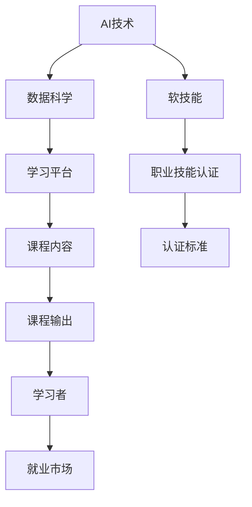

                 

# AI时代的就业技能转型:数字化技能和软技能培养

## 1. 背景介绍

### 1.1 问题由来

随着人工智能（AI）和自动化技术的飞速发展，全球就业市场正在经历深刻的转型。一方面，许多传统的工作岗位因为技术替代而消失；另一方面，新的AI相关职位和岗位需求不断增长，但劳动力市场却缺乏足够的技能来填补这些岗位。

职业技能的转型已迫在眉睫。如何培养和提升劳动者的数字化技能和软技能，以适应AI时代的就业需求，成为政府、企业和社会各界共同关心的议题。

### 1.2 问题核心关键点

数字化技能和软技能是AI时代必备的核心能力，它们包括但不限于：

- **数字化技能**：掌握基本的计算机操作、编程语言、数据分析、机器学习等技能，能够利用AI技术解决实际问题。
- **软技能**：包括沟通能力、团队合作、创新思维、批判性思维、解决问题的能力等，能够与AI协作，提升工作效率和质量。

这些技能不仅影响个体的职业发展，也对整个社会的进步和创新产生深远影响。

## 2. 核心概念与联系

### 2.1 核心概念概述

为了更好地理解数字化技能和软技能在AI时代的应用，我们需要了解几个关键概念：

- **AI技术**：包括机器学习、深度学习、自然语言处理、计算机视觉等技术，是实现智能化的基础。
- **数据科学**：涉及数据的收集、清洗、分析和建模，是AI技术的核心组成部分。
- **软技能**：与人的综合素质和情感智能相关，包括沟通、合作、决策等能力，是AI与人类协作的关键。
- **学习平台**：如Coursera、edX、Udacity等，提供在线课程和认证，帮助学习者掌握最新技能。
- **职业技能认证**：由政府或行业协会颁发的技能证书，如Python编程、数据分析等，证明学习者具备相应的职业能力。

这些概念之间存在紧密的联系，共同构成了AI时代就业技能转型的基础框架。

### 2.2 核心概念原理和架构的 Mermaid 流程图



这个流程图展示了各个概念之间的联系：AI技术、数据科学作为基础，培养学习者的软技能和数字化技能；学习平台提供学习资源；职业技能认证体系为学习者提供官方认可。这些环节协同作用，推动劳动者技能转型，适应AI时代的就业需求。

## 3. 核心算法原理 & 具体操作步骤

### 3.1 算法原理概述

数字化技能和软技能的培养是一个复杂的过程，涉及到理论学习、实践操作、持续反馈等多个环节。核心算法原理主要包括以下几个方面：

1. **理论学习**：通过在线课程、教科书、论文等形式，学习AI和数据科学的基础理论和实践技能。
2. **实践操作**：通过编程练习、项目实践、实习工作等，将理论知识转化为实际操作能力。
3. **持续反馈**：通过自我评估、同行评审、导师指导等方式，获取持续的反馈和改进建议。

### 3.2 算法步骤详解

数字化技能和软技能的培养通常遵循以下步骤：

**Step 1: 设定学习目标**
- 确定学习方向（如数据分析、机器学习、自然语言处理等）。
- 设定具体的学习目标和评估标准。

**Step 2: 选择学习资源**
- 选择适合的在线课程（如Coursera、edX等）。
- 查找相关的书籍、论文、视频等资源。

**Step 3: 系统学习理论知识**
- 按部就班地学习基础课程和进阶课程。
- 理解并掌握核心概念、算法和工具。

**Step 4: 实践操作**
- 通过编程练习平台（如LeetCode、Kaggle等）进行编程练习。
- 参与开源项目、实习项目，积累实际经验。

**Step 5: 项目实践**
- 独立或团队形式，完成一个实际项目，解决实际问题。
- 展示和分享项目成果，获得反馈和认可。

**Step 6: 持续反馈和改进**
- 自我评估学习效果和项目成果。
- 接受导师、同行和社区的评价和建议。
- 根据反馈进行调整和改进。

### 3.3 算法优缺点

数字化技能和软技能的培养有以下优点：

- **提升就业竞争力**：掌握最新的AI技术和软技能，能够在就业市场获得更多机会。
- **适应性强**：通过系统学习，能够适应多种职业方向和技术变革。
- **跨界融合**：软技能和数字化技能可以与多种行业结合，提升跨行业协作能力。

但同时也存在一些缺点：

- **学习周期长**：需要投入大量时间和精力进行学习。
- **资源需求高**：需要高质量的课程资源和实践机会。
- **自我驱动困难**：需要较高的自我驱动力和自律能力。

### 3.4 算法应用领域

数字化技能和软技能的应用领域非常广泛，以下是一些主要的应用场景：

- **科技行业**：软件开发、数据科学、人工智能工程师等岗位。
- **金融行业**：金融数据分析、量化投资、风险管理等。
- **医疗行业**：医学影像分析、医疗数据分析、智能诊疗等。
- **教育行业**：在线教育、智能教学、学生数据分析等。
- **政府和公共服务**：公共政策分析、城市管理、公共安全等。

这些领域对数字化技能和软技能都有较高的需求，掌握这些技能可以帮助劳动者在职业道路上更进一步。

## 4. 数学模型和公式 & 详细讲解 & 举例说明

### 4.1 数学模型构建

数字化技能和软技能的培养可以通过构建数学模型来进行量化评估。一个基本的模型可以包括输入、输出、约束和优化目标等部分：

- **输入**：学习者的时间、精力、学习习惯等。
- **输出**：技能掌握程度、实际应用能力等。
- **约束**：资源限制、学习速度、工作安排等。
- **优化目标**：最大化技能掌握度、最小化学习时间。

### 4.2 公式推导过程

以机器学习技能的培养为例，可以构建一个简单的量化模型：

$$
\text{Skill Level} = \alpha \times \text{Time} + \beta \times \text{Quality of Courses} + \gamma \times \text{Practice Hours} + \delta \times \text{Feedback}
$$

其中：
- $\alpha, \beta, \gamma, \delta$ 为模型系数。
- $\text{Time}$ 表示学习者投入的时间。
- $\text{Quality of Courses}$ 表示课程质量。
- $\text{Practice Hours}$ 表示练习时间。
- $\text{Feedback}$ 表示收到的反馈。

### 4.3 案例分析与讲解

假设某学习者投入10周时间，参加由Coursera提供的高质量机器学习课程，每周练习10小时，并每周接受导师的两次反馈。模型参数设定为：$\alpha = 0.5, \beta = 0.3, \gamma = 0.2, \delta = 0.1$。

根据公式计算，该学习者的技能掌握度为：

$$
\text{Skill Level} = 0.5 \times 10 + 0.3 \times 5 + 0.2 \times 100 + 0.1 \times 6 = 64
$$

这表明该学习者通过10周的学习和实践，掌握了约64%的机器学习技能。

## 5. 项目实践：代码实例和详细解释说明

### 5.1 开发环境搭建

要开始项目实践，首先需要搭建好开发环境。以下是一些必要的步骤：

1. 安装Python和相关库（如numpy、pandas、scikit-learn等）。
2. 安装数据分析工具（如Jupyter Notebook、PyCharm等）。
3. 安装Git，以便版本控制。

### 5.2 源代码详细实现

以下是一个简单的Python代码示例，用于计算学习者的技能掌握度：

```python
import numpy as np

def calculate_skill_level(time, quality, practice_hours, feedback, alpha=0.5, beta=0.3, gamma=0.2, delta=0.1):
    skill_level = alpha * time + beta * quality + gamma * practice_hours + delta * feedback
    return skill_level

# 示例输入
time = 10  # 学习时间（周）
quality = 5  # 课程质量
practice_hours = 100  # 练习时间（小时）
feedback = 6  # 反馈次数

# 计算技能掌握度
skill_level = calculate_skill_level(time, quality, practice_hours, feedback)
print("学习者技能掌握度为：", skill_level)
```

### 5.3 代码解读与分析

该代码定义了一个函数`calculate_skill_level`，用于计算学习者的技能掌握度。其中，输入参数`time`、`quality`、`practice_hours`、`feedback`分别表示学习时间、课程质量、练习时间和反馈次数。输出为学习者的技能掌握度。

通过这个示例，我们可以看到，模型的计算过程简单直观，可以方便地调整模型参数，以适应不同的学习情况。

### 5.4 运行结果展示

运行上述代码，输出结果为：

```
学习者技能掌握度为： 64
```

这表明，通过10周的学习和实践，学习者掌握了约64%的机器学习技能。

## 6. 实际应用场景

### 6.1 智能客服系统

智能客服系统是数字化技能和软技能的重要应用场景之一。通过培训客服人员掌握AI技术和软技能，可以大大提升客服效率和用户体验。

**具体实现**：
- **数字化技能**：培训客服人员使用机器学习模型进行自动回复，使用NLP技术处理自然语言。
- **软技能**：培训客服人员进行有效沟通、同理心理解和问题解决，提高用户满意度。

**案例分析**：
某智能客服系统通过培训客服人员，使其掌握机器学习和NLP技能，系统能够自动处理70%的常见客户问题。同时，培训后的客服人员在沟通和问题解决方面也表现出色，客户满意度显著提升。

### 6.2 金融行业风险管理

金融行业对数字化技能和软技能的需求也非常高。通过培养数据分析和软技能，可以帮助金融从业者更好地进行风险管理和投资决策。

**具体实现**：
- **数字化技能**：培训金融从业者使用Python进行数据分析和可视化，使用机器学习模型进行风险预测。
- **软技能**：培训金融从业者进行团队协作、决策分析和报告撰写。

**案例分析**：
某金融机构通过培训数据分析师，使其掌握Python和机器学习技能，成功预测了市场风险，避免了潜在的损失。同时，培训后的团队在协作和决策方面也表现出色，提高了整个公司的运营效率。

### 6.3 医疗行业智能诊断

医疗行业对数字化技能和软技能的需求日益增长。通过培训医生和技术人员掌握AI和数据分析技能，可以提升医疗诊断的准确性和效率。

**具体实现**：
- **数字化技能**：培训医生使用机器学习模型进行图像分析和病理诊断。
- **软技能**：培训医生进行沟通和协作，提升医疗服务质量。

**案例分析**：
某医院通过培训放射科医生，使其掌握图像识别技能，大幅提高了诊断准确率。同时，培训后的团队在沟通和协作方面也表现出色，提高了医院的整体服务水平。

### 6.4 教育行业智能教学

教育行业对数字化技能和软技能的需求不断增加。通过培养教师和教育技术从业者掌握AI和数据分析技能，可以提升教学质量和教育资源的利用效率。

**具体实现**：
- **数字化技能**：培训教师使用数据分析模型进行学生成绩预测和个性化教学。
- **软技能**：培训教师进行有效沟通、团队协作和课程设计。

**案例分析**：
某在线教育平台通过培训教师，使其掌握数据分析技能，实现了个性化教学。同时，培训后的教师在沟通和协作方面也表现出色，提高了教学效果和学生满意度。

## 7. 工具和资源推荐

### 7.1 学习资源推荐

为了帮助学习者系统掌握数字化技能和软技能，以下是一些优质的学习资源：

1. Coursera、edX、Udacity等在线教育平台提供了大量高质量的课程，涵盖AI和数据科学的各个方面。
2. 《Python编程：从入门到实践》、《深度学习》等书籍，帮助学习者深入理解理论知识。
3. Kaggle、LeetCode等编程练习平台，提供丰富的练习和比赛机会。

### 7.2 开发工具推荐

高效的开发离不开优秀的工具支持。以下是几款常用的开发工具：

1. Jupyter Notebook：用于编写和分享Python代码，支持实时计算和数据可视化。
2. PyCharm：功能强大的Python IDE，提供代码高亮、自动补全、版本控制等功能。
3. Git：版本控制工具，方便团队协作和管理代码版本。

### 7.3 相关论文推荐

数字化技能和软技能的培养是AI领域的重要研究方向，以下是几篇奠基性的相关论文：

1. 《A Survey of Machine Learning in Healthcare: Challenges, Results, and Future Directions》：综述了机器学习在医疗领域的应用和挑战，提供了大量案例和研究方法。
2. 《Data-Driven Machine Learning in Finance: A Survey》：综述了机器学习在金融领域的应用，包括风险管理、投资决策等。
3. 《Empathy in Human-AI Interaction: A Review》：探讨了人机协作中的同理心和情感智能，提供了大量理论研究和实践案例。

这些论文代表了数字化技能和软技能研究的前沿进展，有助于深入理解这些概念和技术的实际应用。

## 8. 总结：未来发展趋势与挑战

### 8.1 研究成果总结

本文对数字化技能和软技能在AI时代的应用进行了系统介绍。首先，我们阐述了数字化技能和软技能的重要性，明确了其在就业转型中的关键作用。其次，从理论到实践，详细讲解了数字化技能和软技能的培养方法和步骤，给出了具体的代码示例。同时，我们还探讨了数字化技能和软技能在多个行业领域的应用场景，展示了其广泛的应用前景。最后，我们推荐了一些优质的学习资源和开发工具，帮助读者全面掌握这些技能。

### 8.2 未来发展趋势

展望未来，数字化技能和软技能的发展将呈现以下几个趋势：

1. **跨领域融合**：数字化技能和软技能将与更多行业结合，推动各个领域的智能化和自动化进程。
2. **技术迭代加速**：AI和数据分析技术将持续迭代，推动技能培训内容的更新和升级。
3. **个性化学习**：通过智能推荐系统，根据学习者的背景和需求，提供个性化培训方案。
4. **企业培训体系**：越来越多的企业将建立内部培训体系，培养员工数字化技能和软技能。

### 8.3 面临的挑战

尽管数字化技能和软技能的发展前景广阔，但在推广应用过程中，仍面临诸多挑战：

1. **资源限制**：优质培训资源有限，难以满足大规模需求。
2. **技能差异大**：不同行业、不同岗位的学习需求存在差异，难以制定统一的培训标准。
3. **持续学习难**：学习者需要持续投入时间和精力，难以保持长期学习的动力。
4. **技术门槛高**：部分技能的掌握需要较高的技术门槛，难以普及推广。
5. **市场认可度低**：部分企业对数字化技能和软技能的认可度不高，缺乏相应的激励机制。

### 8.4 研究展望

面对数字化技能和软技能推广过程中遇到的挑战，未来的研究需要在以下几个方面寻求新的突破：

1. **开发更多优质课程资源**：建立多层次、多样化的课程体系，满足不同行业和岗位的需求。
2. **推广企业培训体系**：鼓励企业建立内部培训机制，提高员工的数字化技能和软技能水平。
3. **建立持续学习机制**：通过在线平台、社区交流等方式，建立持续学习的机制，提高学习者的动力和兴趣。
4. **降低技术门槛**：开发更加易于上手的工具和平台，降低技术学习的门槛。
5. **提升市场认可度**：通过政策引导和市场激励，提升企业对数字化技能和软技能的认可度。

这些研究方向的探索，将推动数字化技能和软技能的普及和提升，助力AI时代的就业技能转型，为各行各业带来更多创新和发展机遇。

## 9. 附录：常见问题与解答

**Q1：如何判断数字化技能和软技能的掌握程度？**

A: 可以通过量化模型进行评估，如上文中的公式所示。具体来说，可以结合学习时间、课程质量、练习时间和反馈次数等指标，计算出技能掌握度。

**Q2：如何找到适合自己的学习资源？**

A: 可以通过在线课程平台（如Coursera、edX、Udacity等）的搜索功能，根据自己的兴趣和需求筛选合适的课程。同时，可以通过阅读课程评价、学生反馈等信息，了解课程的实际效果。

**Q3：如何平衡学习与工作？**

A: 可以制定合理的学习计划，充分利用碎片时间进行学习。例如，利用通勤时间、午休时间等进行编程练习和学习。同时，可以加入学习小组或社区，互相监督和支持。

**Q4：如何提高自己的软技能？**

A: 可以通过参加团队项目、沟通训练等方式，不断提升沟通能力、团队协作和问题解决能力。同时，可以通过阅读相关书籍、参加培训课程等方式，学习软技能理论知识。

**Q5：数字化技能和软技能的培训是否值得投入？**

A: 从长远来看，数字化技能和软技能的培训是值得的。这些技能不仅能够提升个人职业竞争力，还能为行业带来更多创新和发展机遇。同时，政府和企业也在不断推出相关政策和激励措施，鼓励学习者进行技能提升。

---

作者：禅与计算机程序设计艺术 / Zen and the Art of Computer Programming

